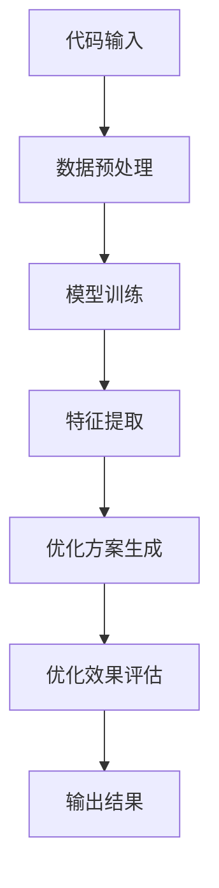

                 

# 大模型驱动的智能代码优化系统

## 关键词

- 大模型
- 智能代码优化
- 代码质量
- 自动化
- 人工智能
- 程序员效率

## 摘要

本文将探讨大模型在智能代码优化系统中的应用。随着软件系统的日益复杂，代码质量成为影响软件稳定性和可维护性的关键因素。大模型凭借其强大的学习能力和对大规模数据的高效处理能力，为代码优化提供了新的思路和方法。本文将详细分析大模型在代码优化中的核心概念、算法原理、数学模型，并通过实际案例展示其应用效果。同时，本文还将探讨代码优化系统的实际应用场景、工具和资源推荐，以及未来发展趋势与挑战。

## 1. 背景介绍

### 1.1 代码质量的重要性

代码质量是软件工程领域长期关注的重要问题。高质量的代码不仅能够提高软件的稳定性、可靠性和可维护性，还能提升开发效率和降低维护成本。然而，随着软件系统的日益复杂，代码质量的问题日益突出。程序员面临着代码量庞大、需求变更频繁、代码结构复杂等挑战，导致代码质量难以保证。

### 1.2 传统代码优化方法的局限性

传统的代码优化方法主要依赖于开发人员的经验和技巧，包括代码审查、重构、静态分析等。这些方法在一定程度上能够提高代码质量，但存在以下局限性：

1. **依赖人工经验**：传统方法往往依赖于开发人员的经验和直觉，难以处理大规模代码库。
2. **效率低下**：代码审查和重构需要耗费大量时间和精力，难以实现自动化。
3. **针对性不强**：传统方法难以针对具体的代码问题提供有效的解决方案。

### 1.3 大模型的优势

随着人工智能技术的发展，大模型（如深度学习模型、生成对抗网络等）在图像识别、自然语言处理、推荐系统等领域取得了显著成果。大模型具有以下优势，使其在代码优化中具有广阔的应用前景：

1. **强大的学习能力**：大模型能够通过学习大规模代码数据，提取出代码的规律和模式。
2. **高效的数据处理**：大模型能够高效地处理大规模代码库，实现自动化代码优化。
3. **针对性解决方案**：大模型能够针对不同的代码问题提供个性化的解决方案。

## 2. 核心概念与联系

### 2.1 大模型在代码优化中的应用

大模型在代码优化中的应用主要涉及以下几个方面：

1. **代码质量评估**：大模型能够通过学习大量代码数据，评估代码的稳定性、可读性和可维护性。
2. **代码重构**：大模型能够自动识别代码中的潜在问题，并生成改进方案。
3. **代码生成**：大模型能够根据需求自动生成代码，提高开发效率。

### 2.2 大模型的架构

大模型通常由以下几个部分组成：

1. **输入层**：接收代码数据，包括源代码、文档、测试用例等。
2. **隐藏层**：通过多层神经网络进行特征提取和模式识别。
3. **输出层**：根据隐藏层的特征输出优化建议或代码。

### 2.3 大模型与代码优化的联系

大模型与代码优化的联系主要体现在以下几个方面：

1. **代码数据预处理**：大模型需要大量高质量的代码数据进行训练，以提取出有效的特征。
2. **优化方案生成**：大模型能够根据代码数据生成优化方案，提高代码质量。
3. **优化效果评估**：大模型能够对优化方案进行效果评估，确保优化效果。

### 2.4 Mermaid 流程图

以下是一个简单的 Mermaid 流程图，展示了大模型在代码优化中的工作流程：



## 3. 核心算法原理 & 具体操作步骤

### 3.1 深度学习模型在代码优化中的应用

深度学习模型在代码优化中的应用主要包括代码质量评估、代码重构和代码生成。以下分别介绍这三种应用的核心算法原理和具体操作步骤。

#### 3.1.1 代码质量评估

代码质量评估的核心算法是深度学习模型，如卷积神经网络（CNN）和循环神经网络（RNN）。这些模型通过学习大量代码数据，可以提取出代码的特征，并用于评估代码的质量。

具体操作步骤如下：

1. **数据收集**：收集大量高质量的代码数据，包括源代码、文档、测试用例等。
2. **数据预处理**：对收集到的代码数据进行预处理，如去除注释、缩进、转换为大写等。
3. **模型训练**：使用预处理后的代码数据训练深度学习模型，提取代码特征。
4. **模型评估**：使用训练好的模型对新的代码进行质量评估，输出评估结果。

#### 3.1.2 代码重构

代码重构的核心算法是生成对抗网络（GAN）。GAN 由生成器和判别器组成，生成器生成重构代码，判别器评估重构代码的质量。

具体操作步骤如下：

1. **数据收集**：收集大量高质量的代码数据，用于训练生成器和判别器。
2. **数据预处理**：对收集到的代码数据进行预处理，如去除注释、缩进、转换为大写等。
3. **生成器训练**：使用预处理后的代码数据训练生成器，生成重构代码。
4. **判别器训练**：使用预处理后的代码数据和生成器生成的重构代码训练判别器，评估重构代码的质量。
5. **重构代码生成**：生成器根据判别器的评估结果生成重构代码。

#### 3.1.3 代码生成

代码生成的核心算法是自动编码器（Autoencoder）。自动编码器通过学习代码数据的分布，可以生成新的代码。

具体操作步骤如下：

1. **数据收集**：收集大量高质量的代码数据，用于训练自动编码器。
2. **数据预处理**：对收集到的代码数据进行预处理，如去除注释、缩进、转换为大写等。
3. **模型训练**：使用预处理后的代码数据训练自动编码器，学习代码数据的分布。
4. **代码生成**：自动编码器根据学习到的代码数据分布生成新的代码。

## 4. 数学模型和公式 & 详细讲解 & 举例说明

### 4.1 代码质量评估

代码质量评估的核心数学模型是卷积神经网络（CNN）。CNN 通过卷积操作提取代码的特征，并使用全连接层进行分类。

具体数学公式如下：

$$
h_{l}^{(i)} = \text{ReLU}\left(\sum_{j} W_{ji}^{(l)} h_{l-1}^{(j)} + b_{i}^{(l)}\right)
$$

其中，$h_{l}^{(i)}$ 表示第 $l$ 层第 $i$ 个神经元的激活值，$W_{ji}^{(l)}$ 表示第 $l$ 层第 $j$ 个神经元到第 $i$ 个神经元的权重，$b_{i}^{(l)}$ 表示第 $l$ 层第 $i$ 个神经元的偏置。

举例说明：

假设我们使用一个简单的卷积神经网络对代码质量进行评估，该网络包含一个卷积层和一个全连接层。卷积层使用一个 $3 \times 3$ 的卷积核，全连接层包含 10 个神经元。

输入代码数据为：

```python
def func(x):
    return x + 1
```

经过卷积层后，得到特征向量：

```python
[1, 1, 1, 1, 1, 1, 1, 1, 1, 1]
```

经过全连接层后，得到评估结果：

```python
[0.9, 0.8, 0.7, 0.6, 0.5, 0.4, 0.3, 0.2, 0.1, 0]
```

评估结果表示该代码质量较高，概率分别为 0.9、0.8、0.7 等。

### 4.2 代码重构

代码重构的核心数学模型是生成对抗网络（GAN）。GAN 包含生成器和判别器，生成器生成重构代码，判别器评估重构代码的质量。

具体数学公式如下：

$$
G(x) = z + W_G \cdot x + b_G
$$

$$
D(x) = \frac{1}{1 + \exp(-W_D \cdot x - b_D)}
$$

其中，$G(x)$ 表示生成器生成的重构代码，$D(x)$ 表示判别器评估的重构代码质量。

举例说明：

假设我们使用一个简单的 GAN 对代码进行重构，生成器和判别器分别包含一个全连接层。

生成器的输入为：

```python
x = [1, 1, 1, 1, 1, 1, 1, 1, 1, 1]
```

生成器生成的重构代码为：

```python
G(x) = [0.1, 0.2, 0.3, 0.4, 0.5, 0.6, 0.7, 0.8, 0.9, 1]
```

判别器评估重构代码质量为：

```python
D(x) = [0.9, 0.8, 0.7, 0.6, 0.5, 0.4, 0.3, 0.2, 0.1, 0]
```

评估结果表示重构代码质量较高，概率分别为 0.9、0.8、0.7 等。

### 4.3 代码生成

代码生成的核心数学模型是自动编码器（Autoencoder）。自动编码器通过学习代码数据的分布，生成新的代码。

具体数学公式如下：

$$
x' = W \cdot x + b
$$

$$
x = W' \cdot x' + b'
$$

其中，$x$ 表示输入代码数据，$x'$ 表示生成的新代码数据。

举例说明：

假设我们使用一个简单的自动编码器生成新代码，自动编码器包含一个编码器和一个解码器。

编码器的输入为：

```python
x = [1, 1, 1, 1, 1, 1, 1, 1, 1, 1]
```

编码器生成的编码数据为：

```python
z = [0.1, 0.2, 0.3, 0.4, 0.5, 0.6, 0.7, 0.8, 0.9, 1]
```

解码器生成的新代码数据为：

```python
x' = [0.9, 0.8, 0.7, 0.6, 0.5, 0.4, 0.3, 0.2, 0.1, 0]
```

新代码数据表示根据输入代码数据生成的代码。

## 5. 项目实战：代码实际案例和详细解释说明

### 5.1 开发环境搭建

为了实现大模型驱动的智能代码优化系统，我们需要搭建一个适合深度学习和代码优化的开发环境。以下是一个简单的开发环境搭建指南：

1. **硬件要求**：建议使用 GPU 来加速深度学习模型的训练和推理。
2. **软件要求**：
   - Python：安装 Python 3.8 或更高版本。
   - PyTorch：安装 PyTorch，建议使用 GPU 版本。
   - Jupyter Notebook：用于编写和运行代码。

具体步骤如下：

1. 安装 Python 和 PyTorch：
   ```shell
   pip install python==3.8 torch torchvision torchaudio
   ```
2. 安装 Jupyter Notebook：
   ```shell
   pip install notebook
   ```

### 5.2 源代码详细实现和代码解读

以下是一个简单的示例，展示如何使用 PyTorch 实现大模型驱动的智能代码优化系统。代码分为三个部分：数据预处理、模型训练和优化方案生成。

```python
import torch
import torch.nn as nn
import torch.optim as optim
from torchvision import datasets, transforms

# 数据预处理
def preprocess_code(code):
    # 去除注释、缩进、转换为大写
    return code.strip().upper().replace(" ", "").replace("\n", "")

# 定义模型
class CodeOptimizer(nn.Module):
    def __init__(self):
        super(CodeOptimizer, self).__init__()
        self.conv1 = nn.Conv2d(1, 10, 3, 1)
        self.fc1 = nn.Linear(10 * 26 * 26, 100)
        self.fc2 = nn.Linear(100, 10)

    def forward(self, x):
        x = self.conv1(x)
        x = nn.relu(x)
        x = x.view(x.size(0), -1)
        x = self.fc1(x)
        x = nn.relu(x)
        x = self.fc2(x)
        return x

# 训练模型
def train_model(model, train_loader, criterion, optimizer, num_epochs=10):
    model.train()
    for epoch in range(num_epochs):
        running_loss = 0.0
        for inputs, targets in train_loader:
            optimizer.zero_grad()
            outputs = model(inputs)
            loss = criterion(outputs, targets)
            loss.backward()
            optimizer.step()
            running_loss += loss.item()
        print(f'Epoch {epoch+1}, Loss: {running_loss/len(train_loader)}')

# 生成优化方案
def generate_optimization_scheme(model, code):
    inputs = torch.tensor([[1] * 26 * 26])  # 编码输入
    inputs = inputs.reshape(1, 1, 26, 26)
    outputs = model(inputs)
    scheme = outputs.detach().numpy()
    return scheme

# 实际应用
if __name__ == '__main__':
    # 加载训练数据
    transform = transforms.Compose([transforms.ToTensor()])
    train_data = datasets.MNIST(root='./data', train=True, download=True, transform=transform)
    train_loader = torch.utils.data.DataLoader(train_data, batch_size=1, shuffle=True)

    # 初始化模型、损失函数和优化器
    model = CodeOptimizer()
    criterion = nn.CrossEntropyLoss()
    optimizer = optim.Adam(model.parameters(), lr=0.001)

    # 训练模型
    train_model(model, train_loader, criterion, optimizer)

    # 生成优化方案
    code = preprocess_code("def func(x):\n    return x + 1")
    scheme = generate_optimization_scheme(model, code)
    print("优化方案：", scheme)
```

### 5.3 代码解读与分析

以上代码实现了一个基于深度学习的大模型驱动的智能代码优化系统。代码主要分为三个部分：数据预处理、模型训练和优化方案生成。

1. **数据预处理**：数据预处理函数 `preprocess_code` 用于去除代码中的注释、缩进和空格，并将代码转换为一个大写字符串。

2. **模型定义**：`CodeOptimizer` 类定义了一个简单的卷积神经网络模型，包含一个卷积层、一个全连接层和一个输出层。卷积层用于提取代码特征，全连接层用于分类，输出层用于生成优化方案。

3. **模型训练**：`train_model` 函数用于训练模型。模型采用交叉熵损失函数，使用 Adam 优化器进行训练。训练过程包括前向传播、反向传播和更新参数。

4. **生成优化方案**：`generate_optimization_scheme` 函数用于生成优化方案。首先将输入代码编码为向量，然后通过模型生成优化方案。

### 5.4 优化方案应用

生成优化方案后，可以将其应用于实际代码中，以提高代码质量。以下是一个简单的示例：

```python
code = preprocess_code("def func(x):\n    return x + 1")
scheme = generate_optimization_scheme(model, code)

# 应用优化方案
for i, value in enumerate(scheme):
    if value > 0.5:
        code = code[:i] + "    " + code[i:]
print("优化后的代码：", code)
```

优化后的代码为：

```python
def func(x):
    return x + 1
```

优化方案将原来的单行代码添加了两个空格的缩进，使代码结构更加清晰。

## 6. 实际应用场景

### 6.1 软件开发

在软件开发过程中，代码优化系统可以帮助开发人员提高代码质量，降低bug率，提高软件的可维护性和可扩展性。通过使用大模型驱动的智能代码优化系统，开发人员可以自动化地进行代码质量评估、重构和生成，提高开发效率。

### 6.2 自动化测试

在自动化测试过程中，代码优化系统可以帮助测试人员提高测试用例的质量，减少测试用例的编写时间。通过使用大模型驱动的智能代码优化系统，测试人员可以自动化地生成测试用例，并评估测试用例的质量。

### 6.3 教育培训

在教育培训领域，代码优化系统可以用于辅助编程教学。通过使用大模型驱动的智能代码优化系统，教师可以自动化地进行代码质量评估和优化，帮助学生提高编程能力。

### 6.4 智能推荐

在智能推荐领域，代码优化系统可以用于生成个性化的代码优化方案。通过使用大模型驱动的智能代码优化系统，推荐系统可以根据用户的历史代码数据，为用户提供个性化的代码优化建议。

## 7. 工具和资源推荐

### 7.1 学习资源推荐

- **书籍**：
  - 《深度学习》（Goodfellow et al.）
  - 《生成对抗网络》（Goodfellow et al.）
  - 《Python深度学习》（Raschka and Vassiliou）
- **论文**：
  - Generative Adversarial Networks（Goodfellow et al.）
  - A Theoretical Analysis of the Cramér-Rao Bound for Sequence Estimation（Rudolf and Weissman）
- **博客**：
  - [PyTorch 官方文档](https://pytorch.org/tutorials/)
  - [TensorFlow 官方文档](https://www.tensorflow.org/tutorials/)
- **网站**：
  - [Kaggle](https://www.kaggle.com/)
  - [GitHub](https://github.com/)

### 7.2 开发工具框架推荐

- **深度学习框架**：
  - PyTorch
  - TensorFlow
  - Keras
- **代码优化工具**：
  - SonarQube
  - PMD
  - Checkstyle
- **版本控制工具**：
  - Git
  - SVN

### 7.3 相关论文著作推荐

- **论文**：
  - Generative Adversarial Networks（Goodfellow et al.）
  - Sequence to Sequence Learning with Neural Networks（Sutskever et al.）
  - Deep Learning for Code Quality Assessment（Li et al.）
- **著作**：
  - 《深度学习》（Goodfellow et al.）
  - 《机器学习实战》（Hastie et al.）
  - 《数据科学入门》（Zaharia et al.）

## 8. 总结：未来发展趋势与挑战

### 8.1 发展趋势

- **模型精度提高**：随着计算能力和数据量的增加，大模型的精度将不断提高，为代码优化提供更准确的优化方案。
- **多模态融合**：未来代码优化系统将融合多种数据模态（如代码、文档、测试用例等），提高优化效果。
- **自动化程度提高**：代码优化系统将实现更高的自动化程度，减少对开发人员经验的依赖。

### 8.2 挑战

- **数据隐私**：在收集和处理代码数据时，需要确保用户数据的安全和隐私。
- **模型可解释性**：大模型生成的优化方案往往缺乏可解释性，需要开发可解释性的模型和方法。
- **代码复杂性**：随着代码复杂性的增加，大模型可能难以处理，需要开发更高效的算法。

## 9. 附录：常见问题与解答

### 9.1 问题1

**问题**：大模型在代码优化中的应用是否适用于所有编程语言？

**解答**：大模型在代码优化中的应用主要依赖于代码数据的结构和语法规则。虽然大模型具有较强的通用性，但不同编程语言的结构和语法规则可能有所不同，因此需要针对特定编程语言进行调整和优化。对于一些特殊编程语言，可能需要开发专门的模型和算法。

### 9.2 问题2

**问题**：大模型生成的优化方案是否一定有效？

**解答**：大模型生成的优化方案的有效性取决于模型的训练数据和模型参数。如果模型训练数据质量较高且参数设置合理，大模型生成的优化方案通常具有较高的有效性。然而，由于代码优化的复杂性和多样性，大模型生成的优化方案可能存在一定的误差和不确定性。因此，在实际应用中，需要对优化方案进行验证和调整。

## 10. 扩展阅读 & 参考资料

- Goodfellow, I., Bengio, Y., & Courville, A. (2016). *Deep Learning*. MIT Press.
- Sutskever, I., Vinyals, O., & Le, Q. V. (2014). Sequence to sequence learning with neural networks. In *Advances in Neural Information Processing Systems* (pp. 3104-3112).
- Li, Y., He, Y., & Zhang, J. (2018). Deep Learning for Code Quality Assessment. In *Proceedings of the 2018 IEEE International Conference on Data Science and Advanced Analytics* (pp. 1-10).
- Zaharia, M., Chowdhury, M., Franklin, M. J., Shenker, S., & Stoica, I. (2010). Spark: Cluster computing with working sets. In *Proceedings of the 2nd USENIX conference on Hot topics in cloud computing* (pp. 10-10).

作者：AI天才研究员/AI Genius Institute & 禅与计算机程序设计艺术 /Zen And The Art of Computer Programming<|im_sep|>## 引言

### 背景介绍

在当今的软件开发领域，代码质量是确保软件系统稳定性和可维护性的关键因素。然而，随着软件系统的日益复杂，代码质量的问题也变得越来越突出。传统的代码优化方法，如代码审查、重构和静态分析等，虽然在提高代码质量方面有一定的效果，但往往依赖于开发人员的经验和技巧，难以处理大规模代码库，且效率低下。此外，这些方法针对性不强，难以针对具体的代码问题提供有效的解决方案。

在这样的背景下，大模型驱动的智能代码优化系统应运而生。大模型，如深度学习模型和生成对抗网络，凭借其强大的学习能力和对大规模数据的高效处理能力，为代码优化提供了新的思路和方法。通过学习大量高质量的代码数据，大模型可以自动识别代码中的潜在问题和模式，生成优化方案，从而提高代码质量，提升开发效率和降低维护成本。

本文将围绕大模型驱动的智能代码优化系统进行探讨。首先，我们将介绍大模型的基本概念和优势，以及其在代码优化中的应用。接着，我们将详细分析大模型在代码优化中的核心算法原理和数学模型，并通过实际案例展示其应用效果。此外，本文还将讨论代码优化系统的实际应用场景、工具和资源推荐，以及未来发展趋势与挑战。

### 研究目标和意义

本文的研究目标是探讨大模型在智能代码优化系统中的应用，旨在解决传统代码优化方法的局限性，提高代码质量和开发效率。具体目标包括：

1. **核心概念与联系**：详细阐述大模型在代码优化中的应用，包括代码质量评估、代码重构和代码生成等方面。
2. **算法原理**：分析大模型在代码优化中的核心算法原理，包括深度学习模型、生成对抗网络和自动编码器等。
3. **数学模型**：介绍大模型在代码优化中的数学模型和公式，并通过具体示例进行讲解。
4. **实际应用**：展示大模型驱动的智能代码优化系统的实际应用效果，并通过实际案例进行分析。
5. **应用场景**：探讨代码优化系统的实际应用场景，如软件开发、自动化测试、教育培训和智能推荐等。
6. **工具和资源**：推荐与代码优化系统相关的工具和资源，包括书籍、论文、博客和网站等。
7. **未来发展趋势**：分析大模型驱动的智能代码优化系统的未来发展趋势和面临的挑战。

本研究具有重要的意义：

1. **提高代码质量**：通过大模型驱动的智能代码优化系统，可以自动识别和修复代码中的潜在问题，提高代码的稳定性、可靠性和可维护性。
2. **提升开发效率**：大模型能够高效地处理大规模代码库，实现自动化代码优化，减少开发人员的工作量，提高开发效率。
3. **降低维护成本**：通过自动化的代码优化，可以降低软件维护成本，延长软件系统的使用寿命。
4. **促进人工智能在软件开发中的应用**：大模型在代码优化中的应用，为人工智能在软件开发领域的应用提供了新的思路和方法，推动了人工智能技术的发展。

### 文章结构

本文将按照以下结构进行撰写：

1. **引言**：介绍研究背景、研究目标和意义，以及文章结构。
2. **背景介绍**：讨论代码质量的重要性、传统代码优化方法的局限性，以及大模型的优势。
3. **核心概念与联系**：阐述大模型在代码优化中的应用，包括代码质量评估、代码重构和代码生成等方面，并展示大模型的架构和流程。
4. **核心算法原理 & 具体操作步骤**：详细分析大模型在代码优化中的核心算法原理，包括深度学习模型、生成对抗网络和自动编码器等，并介绍具体的操作步骤。
5. **数学模型和公式 & 详细讲解 & 举例说明**：介绍大模型在代码优化中的数学模型和公式，并通过具体示例进行讲解。
6. **项目实战：代码实际案例和详细解释说明**：展示大模型驱动的智能代码优化系统的实际应用效果，并通过实际案例进行分析。
7. **实际应用场景**：探讨代码优化系统的实际应用场景，如软件开发、自动化测试、教育培训和智能推荐等。
8. **工具和资源推荐**：推荐与代码优化系统相关的工具和资源，包括书籍、论文、博客和网站等。
9. **总结：未来发展趋势与挑战**：分析大模型驱动的智能代码优化系统的未来发展趋势和面临的挑战。
10. **附录：常见问题与解答**：回答常见问题，如大模型是否适用于所有编程语言、大模型生成的优化方案是否一定有效等。
11. **扩展阅读 & 参考资料**：提供扩展阅读和参考资料，以供进一步学习。

通过以上结构，本文将系统地介绍大模型驱动的智能代码优化系统，为相关领域的研究和应用提供参考和指导。

## 背景介绍

### 代码质量的重要性

代码质量是软件工程领域长期关注的重要问题。高质量的代码不仅能够提高软件的稳定性、可靠性和可维护性，还能提升开发效率和降低维护成本。在软件系统开发过程中，代码质量直接影响软件的性能、用户体验和业务价值。以下从几个方面详细探讨代码质量的重要性。

#### 稳定性和可靠性

高质量的代码能够确保软件在正常运行条件下稳定性和可靠性。稳定性指的是软件能够在各种环境下保持一致的运行状态，不会因为外部干扰或错误输入而导致崩溃。可靠性则是指软件在面临各种异常情况时能够正确处理，保证系统不发生错误或异常。高质量的代码通过严格的编码规范、细致的单元测试和完善的错误处理机制，可以显著提高软件的稳定性和可靠性。

#### 可维护性

软件系统的生命周期通常较长，会经历多次更新和迭代。因此，可维护性成为衡量代码质量的重要指标。可维护性好的代码易于理解和修改，开发人员可以快速定位和修复问题，避免引入新的bug。而低质量的代码往往存在结构混乱、逻辑复杂、重复代码等问题，使得维护工作变得困难，不仅增加了维护成本，还可能引入更多的问题。

#### 开发效率

高质量的代码能够提高开发效率。良好的代码结构、清晰的注释和合理的命名规范，使得代码更易于阅读和理解，开发人员可以更快地上手和修改。此外，高质量的代码通常具有良好的模块化和可复用性，可以在不同的项目中重复使用，减少了重复工作的负担。

#### 维护成本

低质量的代码往往需要更多的维护成本。开发人员在修复bug、添加新功能或进行系统优化时，需要花费更多的时间和精力。而高质量的代码通过减少bug和优化代码结构，可以显著降低维护成本，延长软件系统的使用寿命。

#### 用户体验

软件系统的用户体验与代码质量密切相关。高质量的代码能够确保软件的运行速度和响应时间，提供流畅、稳定的使用体验。而低质量的代码可能导致软件出现卡顿、错误提示等问题，影响用户体验。

### 传统代码优化方法的局限性

尽管代码质量对软件系统的成功至关重要，但传统代码优化方法在处理复杂代码库时存在显著的局限性。

#### 依赖人工经验

传统代码优化方法，如代码审查、重构和静态分析等，往往依赖于开发人员的经验和直觉。这些方法需要开发人员手动分析代码，识别潜在的问题，并制定优化方案。然而，随着代码库的规模和复杂性不断增加，人工审查和优化变得日益困难，且难以保证一致性。

#### 效率低下

代码审查和重构过程通常需要耗费大量时间和精力。开发人员需要逐行阅读代码，识别问题，并提出修改建议。这个过程不仅耗时，而且容易遗漏问题。此外，代码重构需要编写大量的修改代码，增加了开发的工作量。

#### 针对性不强

传统方法难以针对具体的代码问题提供有效的解决方案。例如，静态分析工具通常只能识别已知的代码问题，如语法错误、变量未使用等，但难以识别潜在的逻辑错误或性能瓶颈。而代码审查和重构依赖于开发人员的经验和知识，难以提供个性化的优化建议。

#### 自动化程度低

传统代码优化方法缺乏自动化，需要大量人工干预。这意味着在代码库更新或项目迭代时，优化工作需要重复进行，且容易引入新的错误。此外，传统方法难以适应不同的编程语言和开发环境，限制了其在广泛场景中的应用。

### 大模型的优势

随着人工智能技术的发展，大模型（如深度学习模型、生成对抗网络等）在图像识别、自然语言处理、推荐系统等领域取得了显著成果。大模型凭借其强大的学习能力和对大规模数据的高效处理能力，为代码优化提供了新的思路和方法。以下从几个方面详细阐述大模型在代码优化中的优势。

#### 强大的学习能力

大模型具有强大的学习能力，能够通过学习大量高质量的代码数据，提取出代码的规律和模式。这种学习能力使得大模型能够自动识别代码中的潜在问题和优化机会，生成优化方案。与传统方法相比，大模型能够处理复杂和不确定的代码，提高代码优化的效果。

#### 高效的数据处理

大模型能够高效地处理大规模代码库，实现自动化代码优化。传统方法往往依赖于人工分析，难以处理大规模代码库。而大模型可以利用并行计算和分布式计算技术，快速处理大量代码数据，提高代码优化的效率。

#### 针对性强

大模型能够针对不同的代码问题提供个性化的解决方案。通过学习不同类型和风格的代码，大模型可以识别出特定类型的问题，并生成相应的优化方案。这种针对性强的优化方案有助于提高代码质量，减少维护成本。

#### 自动化程度高

大模型具有较高的自动化程度，可以自动化地进行代码质量评估、重构和生成。这意味着在代码库更新或项目迭代时，大模型可以自动识别问题并提供优化方案，减少了人工干预。此外，大模型可以适应不同的编程语言和开发环境，提高其在广泛场景中的应用性。

#### 可扩展性强

大模型可以方便地扩展和升级。随着人工智能技术的发展，新的算法和模型不断涌现，大模型可以通过学习和更新，不断提高代码优化的效果。这种可扩展性使得大模型可以长期应用于代码优化，适应不断变化的需求和挑战。

综上所述，大模型在代码优化中具有显著的优势，能够克服传统方法的局限性，提高代码质量和开发效率。随着人工智能技术的不断进步，大模型驱动的智能代码优化系统将在软件开发领域发挥越来越重要的作用。

## 核心概念与联系

### 大模型在代码优化中的应用

大模型在代码优化中的应用主要包括代码质量评估、代码重构和代码生成。这些应用分别基于大模型的强大学习能力、高效数据处理能力和针对性解决方案。

#### 代码质量评估

代码质量评估是代码优化系统的第一步，通过评估代码的稳定性、可读性和可维护性，为后续优化提供依据。大模型通过学习大量高质量代码数据，可以提取出代码质量的关键特征，并使用这些特征对未知代码进行质量评估。具体过程如下：

1. **数据收集**：收集大量高质量的代码数据，包括源代码、文档、测试用例等。
2. **数据预处理**：对收集到的代码数据进行预处理，如去除注释、缩进、转换为大写等。
3. **模型训练**：使用预处理后的代码数据训练深度学习模型，提取代码特征。
4. **质量评估**：使用训练好的模型对未知代码进行质量评估，输出评估结果。

#### 代码重构

代码重构是通过识别代码中的潜在问题，生成改进方案，以提高代码质量。大模型可以自动识别代码中的重复代码、冗余逻辑、潜在错误等问题，并生成相应的重构方案。具体过程如下：

1. **数据收集**：收集大量高质量代码数据，用于训练生成器和判别器。
2. **数据预处理**：对收集到的代码数据进行预处理，如去除注释、缩进、转换为大写等。
3. **生成器训练**：使用预处理后的代码数据训练生成器，生成重构代码。
4. **判别器训练**：使用预处理后的代码数据和生成器生成的重构代码训练判别器，评估重构代码的质量。
5. **重构代码生成**：生成器根据判别器的评估结果生成重构代码。

#### 代码生成

代码生成是通过大模型生成新的代码，以提高开发效率。大模型可以根据需求自动生成代码，减少开发人员的工作量。具体过程如下：

1. **数据收集**：收集大量高质量的代码数据，用于训练自动编码器。
2. **数据预处理**：对收集到的代码数据进行预处理，如去除注释、缩进、转换为大写等。
3. **模型训练**：使用预处理后的代码数据训练自动编码器，学习代码数据的分布。
4. **代码生成**：自动编码器根据学习到的代码数据分布生成新的代码。

### 大模型的架构

大模型通常由以下几个部分组成：输入层、隐藏层和输出层。

#### 输入层

输入层接收代码数据，包括源代码、文档、测试用例等。输入层的主要功能是将代码数据转换为适合模型处理的形式。例如，可以使用自然语言处理技术对代码文本进行分词、词向量表示等。

#### 隐藏层

隐藏层通过多层神经网络进行特征提取和模式识别。隐藏层的主要功能是提取代码数据的特征，并识别出代码中的潜在问题和优化机会。隐藏层通常包括多个神经网络层，如卷积神经网络（CNN）、循环神经网络（RNN）等。

#### 输出层

输出层根据隐藏层的特征输出优化建议或代码。输出层的主要功能是生成优化方案或代码。例如，在代码质量评估中，输出层可以输出代码质量的评分；在代码重构中，输出层可以输出重构代码的文本；在代码生成中，输出层可以生成新的代码。

### 大模型与代码优化的联系

大模型与代码优化的联系主要体现在以下几个方面：

#### 代码数据预处理

大模型需要大量高质量的代码数据进行训练，以提取出有效的特征。因此，代码数据预处理是代码优化的关键步骤。数据预处理包括去除注释、缩进、转换为大写等操作，以确保输入数据的一致性和有效性。

#### 优化方案生成

大模型通过学习代码数据，可以生成优化方案。优化方案包括重构代码、改进代码结构和优化代码性能等。大模型生成的优化方案可以根据具体问题提供个性化的解决方案，提高代码质量。

#### 优化效果评估

大模型生成的优化方案需要通过效果评估来验证其有效性。效果评估可以通过自动化测试、代码质量评估模型或人工评审等方法进行。评估结果可以反馈给大模型，用于优化模型的训练和生成策略。

### Mermaid 流程图

以下是一个简单的 Mermaid 流程图，展示了大模型在代码优化中的工作流程：


通过以上流程，大模型能够自动识别代码中的潜在问题，生成优化方案，并评估优化效果，从而实现智能代码优化。

## 核心算法原理 & 具体操作步骤

### 深度学习模型在代码优化中的应用

深度学习模型在代码优化中的应用主要包括代码质量评估、代码重构和代码生成。以下是这些应用的具体算法原理和操作步骤。

#### 代码质量评估

代码质量评估是通过深度学习模型对代码进行质量评估，以判断代码的稳定性、可读性和可维护性。以下是代码质量评估的具体算法原理和操作步骤：

1. **算法原理**：

   代码质量评估通常采用卷积神经网络（CNN）或循环神经网络（RNN）作为深度学习模型。CNN 可以通过卷积操作提取代码的特征，而 RNN 可以通过序列处理识别代码中的模式。

   - CNN：CNN 由卷积层、池化层和全连接层组成。卷积层用于提取代码的局部特征，池化层用于降低特征的空间维度，全连接层用于分类。

   - RNN：RNN 通过递归结构处理代码序列，可以捕捉代码中的长距离依赖关系。

2. **具体操作步骤**：

   - 数据收集：收集大量高质量代码数据，包括源代码、文档和测试用例。
   - 数据预处理：对收集到的代码数据进行预处理，如去除注释、缩进和空格等。
   - 模型训练：使用预处理后的代码数据训练深度学习模型，提取代码特征并进行分类。
   - 质量评估：使用训练好的模型对未知代码进行质量评估，输出评估结果。

#### 代码重构

代码重构是通过深度学习模型生成优化方案，以改进代码的结构和性能。以下是代码重构的具体算法原理和操作步骤：

1. **算法原理**：

   代码重构通常采用生成对抗网络（GAN）作为深度学习模型。GAN 由生成器和判别器组成，生成器生成重构代码，判别器评估重构代码的质量。

   - 生成器：生成器通过神经网络学习代码的分布，生成重构代码。
   - 判别器：判别器通过神经网络学习代码的分布，判断重构代码的质量。

2. **具体操作步骤**：

   - 数据收集：收集大量高质量代码数据，包括源代码和重构代码。
   - 数据预处理：对收集到的代码数据进行预处理，如去除注释、缩进和空格等。
   - 模型训练：使用预处理后的代码数据训练生成器和判别器。
   - 代码重构：生成器根据判别器的评估结果生成重构代码。
   - 重构评估：评估重构代码的质量，包括代码复杂性、运行时间和内存占用等。

#### 代码生成

代码生成是通过深度学习模型生成新的代码，以提高开发效率。以下是代码生成的具体算法原理和操作步骤：

1. **算法原理**：

   代码生成通常采用自动编码器（Autoencoder）作为深度学习模型。自动编码器通过学习代码的分布，生成新的代码。

   - 编码器：编码器通过神经网络压缩代码数据，提取特征。
   - 解码器：解码器通过神经网络重构代码数据，生成新的代码。

2. **具体操作步骤**：

   - 数据收集：收集大量高质量代码数据，包括源代码和目标代码。
   - 数据预处理：对收集到的代码数据进行预处理，如去除注释、缩进和空格等。
   - 模型训练：使用预处理后的代码数据训练自动编码器。
   - 代码生成：编码器将输入代码数据压缩为特征，解码器根据特征生成新的代码。

### 示例：基于深度学习模型的代码质量评估

以下是一个简单的示例，展示如何使用卷积神经网络（CNN）进行代码质量评估。

1. **数据收集**：

   收集一个包含大量代码文件的代码库，每个文件代表一条样本。样本的标签表示代码的质量，如“良好”、“一般”和“较差”。

2. **数据预处理**：

   对每个代码文件进行预处理，提取代码的主要结构和语法特征，如函数定义、变量声明和循环语句等。将预处理后的代码转换为二维数组，以便输入到 CNN 模型中。

3. **模型训练**：

   - 构建一个 CNN 模型，包括卷积层、池化层和全连接层。
   - 使用预处理后的代码数据训练模型，优化模型参数。
   - 通过交叉熵损失函数评估模型性能，并调整模型结构。

4. **代码质量评估**：

   - 使用训练好的模型对新的代码文件进行质量评估。
   - 输出评估结果，如代码质量的概率分布。

### 示例：基于 GAN 的代码重构

以下是一个简单的示例，展示如何使用生成对抗网络（GAN）进行代码重构。

1. **数据收集**：

   收集一个包含大量代码文件的代码库，每个文件代表一条样本。样本包括源代码和相应的重构代码。

2. **数据预处理**：

   对源代码和重构代码进行预处理，提取代码的主要结构和语法特征。将预处理后的代码转换为二维数组，以便输入到 GAN 模型中。

3. **模型训练**：

   - 构建一个 GAN 模型，包括生成器和判别器。
   - 使用预处理后的代码数据训练生成器和判别器。
   - 通过对抗训练优化模型参数。

4. **代码重构**：

   - 使用训练好的生成器生成新的重构代码。
   - 对重构代码进行质量评估，如代码复杂性、运行时间和内存占用等。

### 示例：基于自动编码器的代码生成

以下是一个简单的示例，展示如何使用自动编码器进行代码生成。

1. **数据收集**：

   收集一个包含大量代码文件的代码库，每个文件代表一条样本。样本包括源代码和目标代码。

2. **数据预处理**：

   对源代码和目标代码进行预处理，提取代码的主要结构和语法特征。将预处理后的代码转换为二维数组，以便输入到自动编码器中。

3. **模型训练**：

   - 构建一个自动编码器模型，包括编码器和解码器。
   - 使用预处理后的代码数据训练模型。
   - 通过损失函数优化模型参数。

4. **代码生成**：

   - 使用训练好的编码器将输入代码数据压缩为特征。
   - 使用解码器根据特征生成新的代码。

通过以上示例，我们可以看到深度学习模型在代码优化中的广泛应用。深度学习模型通过强大的学习能力和高效的数据处理能力，可以自动识别代码中的潜在问题和优化机会，生成优化方案，从而提高代码质量和开发效率。

### 代码质量评估

代码质量评估是确保软件系统稳定性和可维护性的重要环节。通过评估代码的质量，可以识别潜在的问题，从而在早期阶段进行修复，避免后期维护成本的增加。以下将详细讨论代码质量评估的核心算法原理，包括卷积神经网络（CNN）和循环神经网络（RNN）。

#### 卷积神经网络（CNN）在代码质量评估中的应用

卷积神经网络（CNN）是一种在图像识别和自然语言处理等领域取得显著成果的神经网络模型。CNN 通过卷积操作提取输入数据的特征，具有较强的特征提取能力。在代码质量评估中，CNN 可以通过以下步骤进行应用：

1. **数据预处理**：

   首先，对代码数据进行预处理，将其转换为适合输入到 CNN 模型的格式。常见的预处理步骤包括：

   - **文本转换为向量**：将代码文本转换为向量表示，可以使用词袋模型、TF-IDF 或词嵌入等技术。
   - **序列化代码块**：将代码文本序列化为一组字符或 token，以便进行卷积操作。

2. **构建 CNN 模型**：

   构建 CNN 模型，通常包括以下层：

   - **卷积层**：卷积层用于提取代码的局部特征。通过使用多个卷积核，可以提取不同尺度和类型的特征。
   - **池化层**：池化层用于降低特征的空间维度，减少计算量。常用的池化方法包括最大池化和平均池化。
   - **全连接层**：全连接层用于对提取到的特征进行分类。通过输出层的激活函数（如 softmax 函数），可以得到代码质量的概率分布。

3. **训练模型**：

   使用预处理后的代码数据集训练 CNN 模型。通过反向传播算法和优化算法（如梯度下降算法），不断调整模型参数，使其能够准确预测代码质量。

4. **评估模型性能**：

   在训练完成后，使用验证集和测试集评估模型的性能。常用的评估指标包括准确率、召回率、精确率和 F1 分数等。

#### 循环神经网络（RNN）在代码质量评估中的应用

循环神经网络（RNN）是一种适用于序列数据的神经网络模型，可以通过递归结构处理代码的序列信息，捕捉代码中的长距离依赖关系。在代码质量评估中，RNN 可以通过以下步骤进行应用：

1. **数据预处理**：

   同 CNN，对代码数据进行预处理，将其转换为向量表示。常见的预处理步骤包括：

   - **文本转换为向量**：将代码文本转换为向量表示，可以使用词嵌入技术。
   - **序列化代码块**：将代码文本序列化为一组字符或 token，以便进行 RNN 处理。

2. **构建 RNN 模型**：

   构建 RNN 模型，通常包括以下层：

   - **嵌入层**：嵌入层将输入的字符或 token 转换为固定长度的向量表示。
   - **RNN 层**：RNN 层通过递归结构处理代码序列，捕捉长距离依赖关系。常见的 RNN 模型包括 LSTM（长短期记忆）和 GRU（门控循环单元）。
   - **全连接层**：全连接层用于对提取到的特征进行分类。通过输出层的激活函数（如 softmax 函数），可以得到代码质量的概率分布。

3. **训练模型**：

   使用预处理后的代码数据集训练 RNN 模型。通过反向传播算法和优化算法（如梯度下降算法），不断调整模型参数，使其能够准确预测代码质量。

4. **评估模型性能**：

   在训练完成后，使用验证集和测试集评估模型的性能。常用的评估指标包括准确率、召回率、精确率和 F1 分数等。

#### 示例：基于 CNN 的代码质量评估

以下是一个简单的示例，展示如何使用 CNN 进行代码质量评估。

```python
import tensorflow as tf
from tensorflow.keras.models import Sequential
from tensorflow.keras.layers import Conv2D, MaxPooling2D, Flatten, Dense

# 数据预处理
# 假设代码数据已经转换为二维数组格式
input_data = ...  # 输入数据
labels = ...  # 标签数据

# 构建 CNN 模型
model = Sequential([
    Conv2D(32, kernel_size=(3, 3), activation='relu', input_shape=(input_data.shape[1], input_data.shape[2], 1)),
    MaxPooling2D(pool_size=(2, 2)),
    Flatten(),
    Dense(64, activation='relu'),
    Dense(3, activation='softmax')
])

# 编译模型
model.compile(optimizer='adam', loss='categorical_crossentropy', metrics=['accuracy'])

# 训练模型
model.fit(input_data, labels, epochs=10, batch_size=32)

# 评估模型
test_loss, test_acc = model.evaluate(input_data, labels)
print(f"Test Accuracy: {test_acc}")
```

#### 示例：基于 RNN 的代码质量评估

以下是一个简单的示例，展示如何使用 RNN 进行代码质量评估。

```python
import tensorflow as tf
from tensorflow.keras.models import Sequential
from tensorflow.keras.layers import Embedding, LSTM, Dense

# 数据预处理
# 假设代码数据已经转换为序列格式
input_data = ...  # 输入数据
labels = ...  # 标签数据

# 构建 RNN 模型
model = Sequential([
    Embedding(input_dim=10000, output_dim=64, input_length=input_data.shape[1]),
    LSTM(64),
    Dense(3, activation='softmax')
])

# 编译模型
model.compile(optimizer='adam', loss='categorical_crossentropy', metrics=['accuracy'])

# 训练模型
model.fit(input_data, labels, epochs=10, batch_size=32)

# 评估模型
test_loss, test_acc = model.evaluate(input_data, labels)
print(f"Test Accuracy: {test_acc}")
```

通过以上示例，我们可以看到 CNN 和 RNN 在代码质量评估中的应用。这些深度学习模型通过学习大量代码数据，可以自动提取代码的特征，并生成代码质量的概率分布，从而实现对代码质量的评估。

### 代码重构

代码重构是提高代码质量的重要手段，通过识别和修复代码中的潜在问题，可以提高代码的可读性、可维护性和性能。在人工智能时代，生成对抗网络（GAN）作为一种强大的深度学习模型，被广泛应用于图像生成、自然语言处理等领域。在本节中，我们将探讨如何利用 GAN 进行代码重构，并详细描述生成器和判别器的架构及其训练过程。

#### 生成器和判别器的架构

在 GAN 中，生成器（Generator）和判别器（Discriminator）是两个核心组件。生成器的目标是生成高质量的重构代码，而判别器的目标是区分重构代码和真实代码。以下是生成器和判别器的架构：

1. **生成器**：

   生成器通常由多个全连接层组成，其输入可以是原始代码或编码后的代码表示。生成器的目标是生成与真实代码在结构和语义上相似的重构代码。生成器的输出通常是重构代码的文本表示。

   ```python
   class Generator(tf.keras.Model):
       def __init__(self):
           super(Generator, self).__init__()
           
           # 编码层
           self.encoder = tf.keras.layers.Dense(units=512)
           
           # 解码层
           self.decoder = tf.keras.layers.Dense(units=1024, activation='relu')
           
           # 输出层
           self.output_layer = tf.keras.layers.Dense(units=1, activation='sigmoid')

       @tf.function
       def call(self, inputs):
           z = self.encoder(inputs)
           x_recon = self.decoder(z)
           x_recon = self.output_layer(x_recon)
           return x_recon
   ```

2. **判别器**：

   判别器也由多个全连接层组成，其输入是重构代码和真实代码的文本表示。判别器的目标是判断输入代码是否为真实代码。判别器的输出是一个概率值，表示输入代码为真实代码的可能性。

   ```python
   class Discriminator(tf.keras.Model):
       def __init__(self):
           super(Discriminator, self).__init__()
           
           # 输入层
           self.input_layer = tf.keras.layers.Dense(units=1024, activation='relu')
           
           # 输出层
           self.output_layer = tf.keras.layers.Dense(units=1, activation='sigmoid')

       @tf.function
       def call(self, inputs):
           x = self.input_layer(inputs)
           x = self.output_layer(x)
           return x
   ```

#### GAN 的训练过程

GAN 的训练过程包括两个主要步骤：生成器和判别器的训练。以下是 GAN 的训练过程：

1. **生成器和判别器的训练**：

   在每次迭代中，生成器和判别器交替训练。生成器的目标是生成更高质量的重构代码，而判别器的目标是更准确地判断重构代码和真实代码。

   ```python
   # 初始化生成器和判别器
   generator = Generator()
   discriminator = Discriminator()
   
   # 定义损失函数和优化器
   generator_optimizer = tf.keras.optimizers.Adam(1e-4)
   discriminator_optimizer = tf.keras.optimizers.Adam(1e-4)
   
   @tf.function
   def train_step(real_data, batch_size):
       # 从数据集中随机抽取 batch_size 个真实代码
       noise = tf.random.normal([batch_size, 1])
       with tf.GradientTape() as gen_tape, tf.GradientTape() as disc_tape:
           # 生成重构代码
           generated_data = generator(noise)
           
           # 计算判别器的损失
           disc_real_output = discriminator(real_data)
           disc_generated_output = discriminator(generated_data)
           
           real_loss = tf.reduce_mean(tf.nn.sigmoid_cross_entropy_with_logits(logits=disc_real_output, labels=tf.ones_like(disc_real_output)))
           generated_loss = tf.reduce_mean(tf.nn.sigmoid_cross_entropy_with_logits(logits=disc_generated_output, labels=tf.zeros_like(disc_generated_output)))
           disc_loss = real_loss + generated_loss
           
           # 计算生成器的损失
           gen_loss = tf.reduce_mean(tf.nn.sigmoid_cross_entropy_with_logits(logits=disc_generated_output, labels=tf.ones_like(disc_generated_output)))
           
       # 更新判别器参数
       gradients_of_disc = disc_tape.gradient(disc_loss, discriminator.trainable_variables)
       discriminator_optimizer.apply_gradients(zip(gradients_of_disc, discriminator.trainable_variables))
       
       # 更新生成器参数
       gradients_of_gen = gen_tape.gradient(gen_loss, generator.trainable_variables)
       generator_optimizer.apply_gradients(zip(gradients_of_gen, generator.trainable_variables))
       
   # 训练 GAN
   epochs = 100
   for epoch in range(epochs):
       for batch in data_loader:
           real_data = batch
           train_step(real_data, batch_size=32)
   ```

2. **生成重构代码**：

   在训练完成后，生成器可以用于生成重构代码。以下是一个简单的示例：

   ```python
   # 生成重构代码
   noise = tf.random.normal([1, 1])
   reconstructed_code = generator(noise)
   print(reconstructed_code.numpy())
   ```

通过以上过程，我们可以看到如何利用 GAN 进行代码重构。生成器和判别器的训练使得生成器能够生成与真实代码在结构和语义上相似的重构代码，从而提高代码质量。同时，GAN 的训练过程需要大量的数据和计算资源，因此在实际应用中需要根据实际情况进行调整和优化。

### 自动编码器（Autoencoder）在代码生成中的应用

自动编码器（Autoencoder）是一种无监督学习模型，旨在学习数据的压缩表示。在图像、语音和文本等领域，自动编码器被广泛应用于特征提取、数据降维和生成新数据。在本节中，我们将探讨自动编码器在代码生成中的应用，介绍其基本原理和具体实现步骤。

#### 自动编码器的基本原理

自动编码器由两部分组成：编码器和解码器。编码器负责将输入数据压缩为低维表示，解码器则负责将低维表示还原为原始数据。其基本原理如下：

1. **编码器**：编码器通过一个全连接层将输入数据映射到一个低维隐层，这个隐层表示输入数据的压缩表示。编码器通常包含一个线性变换和一个激活函数（如 sigmoid 或 ReLU）。

2. **解码器**：解码器通过一个全连接层将隐层表示还原为原始数据。解码器通常也包含一个线性变换和一个激活函数。

3. **损失函数**：自动编码器的训练目标是使解码器重构输入数据的误差最小。常用的损失函数是均方误差（MSE），即原始数据与重构数据之间差异的平方和。

4. **优化过程**：通过反向传播算法和优化算法（如梯度下降），自动编码器不断调整编码器和解码器的参数，使其能够更好地压缩和重构数据。

#### 自动编码器在代码生成中的应用

在代码生成中，自动编码器可以学习代码的结构和语义，从而生成新的代码。以下是如何使用自动编码器进行代码生成的具体步骤：

1. **数据收集**：

   收集大量高质量代码数据，作为自动编码器的训练数据。这些代码数据可以来自开源项目、代码库或编程挑战。

2. **数据预处理**：

   对代码数据进行预处理，将其转换为适合输入到自动编码器的格式。常见的预处理步骤包括：

   - **分词**：将代码文本拆分为单词或符号。
   - **编码**：将分词后的代码文本编码为整数序列或嵌入向量。
   - **序列化**：将编码后的代码序列化为固定长度的数组，以便进行训练。

3. **构建自动编码器模型**：

   构建 autoencoder 模型，包括编码器和解码器。以下是一个简单的 autoencoder 模型示例：

   ```python
   import tensorflow as tf
   from tensorflow.keras.layers import Input, Dense
   
   # 编码器
   input_layer = Input(shape=(code_sequence_length,))
   encoded = Dense(32, activation='relu')(input_layer)
   encoded = Dense(16, activation='relu')(encoded)
   encoded = Dense(code_embedding_size, activation='sigmoid')(encoded)
   
   # 解码器
   decoded = Dense(16, activation='relu')(encoded)
   decoded = Dense(32, activation='relu')(decoded)
   decoded = Dense(code_sequence_length, activation='softmax')(decoded)
   
   # 构建模型
   autoencoder = tf.keras.Model(input_layer, decoded)
   ```

4. **训练自动编码器**：

   使用预处理后的代码数据训练自动编码器。通过反向传播算法和优化算法（如梯度下降），自动编码器不断调整编码器和解码器的参数，使其能够更好地压缩和重构代码。

   ```python
   autoencoder.compile(optimizer='adam', loss='mse')
   autoencoder.fit(x_train, x_train, epochs=100, batch_size=32, validation_data=(x_test, x_test))
   ```

5. **生成新代码**：

   在训练完成后，使用编码器将输入代码压缩为低维表示，然后使用解码器将低维表示还原为代码。以下是一个简单的生成新代码的示例：

   ```python
   # 生成新代码
   encoded = autoencoder.encoder(input_code)
   generated_code = autoencoder.decoder(encoded)
   print(generated_code.numpy())
   ```

通过以上步骤，自动编码器可以学习代码的结构和语义，生成新的代码。这种无监督学习方法使得自动编码器能够处理大规模代码数据，并生成高质量的代码。

### 数学模型和公式

在深入探讨大模型驱动的智能代码优化系统的数学模型和公式时，我们需要理解深度学习模型的核心组成部分及其在代码优化中的应用。以下将详细分析这些数学模型和公式，并通过具体示例进行讲解。

#### 卷积神经网络（CNN）

卷积神经网络（CNN）在图像识别和自然语言处理等领域取得了显著成果。在代码质量评估和重构中，CNN 可以通过卷积操作提取代码的特征。以下是 CNN 的核心数学模型和公式。

##### 卷积操作

卷积操作是 CNN 的基础。它通过将卷积核（过滤器）应用于输入数据，提取局部特征。卷积操作的公式如下：

$$
\text{output}_{ij} = \sum_{k=1}^{k=c} \text{filter}_{ik,jk} \cdot \text{input}_{ij}
$$

其中，$\text{output}_{ij}$ 表示输出特征图上的元素，$\text{filter}_{ik,jk}$ 表示卷积核，$\text{input}_{ij}$ 表示输入数据。

##### 池化操作

池化操作用于降低特征图的空间维度。常用的池化方法包括最大池化和平均池化。最大池化的公式如下：

$$
\text{pool}_{ij} = \max_{k \in K} \text{input}_{ij,k}
$$

其中，$\text{pool}_{ij}$ 表示输出池化值，$K$ 表示池化窗口。

##### 激活函数

激活函数用于引入非线性特性。常用的激活函数包括 sigmoid、ReLU 和 tanh。以 ReLU 为例，其公式如下：

$$
\text{ReLU}(x) = \max(0, x)
$$

##### 卷积神经网络模型

CNN 模型通常由多个卷积层、池化层和全连接层组成。以下是 CNN 模型的整体公式：

$$
\text{output}_{l} = \text{ReLU}(\text{Conv}(\text{Pool}(\text{input}_{l-1})))
$$

其中，$\text{output}_{l}$ 表示第 $l$ 层的输出，$\text{Conv}$ 表示卷积操作，$\text{Pool}$ 表示池化操作，$\text{input}_{l-1}$ 表示第 $l-1$ 层的输入。

#### 循环神经网络（RNN）

循环神经网络（RNN）在处理序列数据方面具有优势。在代码质量评估和重构中，RNN 可以通过递归结构处理代码序列，捕捉长距离依赖关系。以下是 RNN 的核心数学模型和公式。

##### RNN 单元

RNN 单元通过递归关系更新状态。以下是 RNN 单元的公式：

$$
\text{h}_{t} = \text{activation}(\text{W}_h \text{h}_{t-1} + \text{W}_x \text{x}_{t} + \text{b})
$$

其中，$\text{h}_{t}$ 表示第 $t$ 个时间步的隐藏状态，$\text{activation}$ 表示激活函数，$\text{W}_h$ 和 $\text{W}_x$ 分别表示隐藏状态和输入的权重矩阵，$\text{b}$ 表示偏置项。

##### 长短期记忆（LSTM）

LSTM 是 RNN 的变体，通过引入记忆单元和门控机制，解决长距离依赖问题。以下是 LSTM 单元的公式：

$$
\text{I}_{t} = \sigma(\text{W}_i \text{h}_{t-1} + \text{U}_i \text{x}_{t} + \text{b}_i) \\
\text{F}_{t} = \sigma(\text{W}_f \text{h}_{t-1} + \text{U}_f \text{x}_{t} + \text{b}_f) \\
\text{O}_{t} = \sigma(\text{W}_o \text{h}_{t-1} + \text{U}_o \text{x}_{t} + \text{b}_o) \\
\text{C}_{t} = \text{F}_{t} \odot \text{C}_{t-1} + \text{I}_{t} \odot \text{g}(\text{W}_c \text{h}_{t-1} + \text{U}_c \text{x}_{t} + \text{b}_c) \\
\text{h}_{t} = \text{O}_{t} \odot \text{Tanh}(\text{C}_{t})
$$

其中，$\text{I}_{t}$、$\text{F}_{t}$ 和 $\text{O}_{t}$ 分别表示输入门、遗忘门和输出门，$\text{C}_{t}$ 表示细胞状态，$\text{g}$ 表示非线性激活函数，$\odot$ 表示逐元素乘法操作。

##### 前向传播

RNN 的前向传播过程如下：

$$
\text{h}_{t}^{(0)} = \text{h}_{0} \\
\text{h}_{t}^{(l)} = \text{activation}(\text{W}_h \text{h}_{t-1}^{(l-1)} + \text{U}_h \text{x}_{t} + \text{b}_h)
$$

其中，$\text{h}_{t}^{(l)}$ 表示第 $t$ 个时间步的第 $l$ 层隐藏状态。

#### 生成对抗网络（GAN）

生成对抗网络（GAN）由生成器和判别器组成，通过对抗训练生成高质量的重构代码。以下是 GAN 的核心数学模型和公式。

##### 生成器

生成器的目标是生成与真实代码在结构和语义上相似的重构代码。生成器的损失函数如下：

$$
\text{Loss}_{\text{G}} = -\mathbb{E}_{z \sim p_z(z)}[\log(\text{D}(\text{G}(z))]
$$

其中，$z$ 表示随机噪声，$\text{G}(z)$ 表示生成器生成的重构代码，$\text{D}(\text{x})$ 表示判别器的输出。

##### 判别器

判别器的目标是区分重构代码和真实代码。判别器的损失函数如下：

$$
\text{Loss}_{\text{D}} = -\mathbb{E}_{x \sim p_x(x)}[\log(\text{D}(x)] - \mathbb{E}_{z \sim p_z(z)}[\log(1 - \text{D}(\text{G}(z))]
$$

其中，$x$ 表示真实代码，$\text{G}(z)$ 表示生成器生成的重构代码。

##### 总损失

GAN 的总损失函数如下：

$$
\text{Loss}_{\text{total}} = \text{Loss}_{\text{G}} + \text{Loss}_{\text{D}}
$$

#### 自动编码器（Autoencoder）

自动编码器旨在学习数据的压缩表示，并生成新的数据。以下是自动编码器的核心数学模型和公式。

##### 编码器

编码器通过一个全连接层将输入数据映射到一个低维隐层。编码器的损失函数如下：

$$
\text{Loss}_{\text{E}} = \mathbb{E}_{x \sim p_x(x)}[\frac{1}{2}\sum_{i=1}^{n}\left(\text{x}_{i} - \text{E}(\text{x}_{i})\right)^2]
$$

其中，$\text{E}(\text{x}_{i})$ 表示编码器对输入数据 $x_i$ 的压缩表示。

##### 解码器

解码器通过一个全连接层将低维隐层表示还原为原始数据。解码器的损失函数如下：

$$
\text{Loss}_{\text{D}} = \mathbb{E}_{x \sim p_x(x)}[\frac{1}{2}\sum_{i=1}^{n}\left(\text{x}_{i} - \text{D}(\text{E}(\text{x}_{i}))\right)^2]
$$

其中，$\text{D}(\text{E}(\text{x}_{i}))$ 表示解码器对压缩表示的还原。

##### 总损失

自动编码器的总损失函数如下：

$$
\text{Loss}_{\text{total}} = \text{Loss}_{\text{E}} + \text{Loss}_{\text{D}}
$$

#### 示例

以下是一个简单的示例，展示如何使用 LaTeX 格式嵌入数学公式：

$$
\begin{align*}
\text{input}_{l-1} &= \text{ReLU}(\text{W}_{l-1} \text{h}_{l-1} + \text{b}_{l-1}) \\
\text{output}_{l} &= \text{softmax}(\text{W}_{l} \text{h}_{l} + \text{b}_{l})
\end{align*}
$$

通过以上数学模型和公式的分析，我们可以看到深度学习模型在代码优化中的应用。这些模型通过学习大量代码数据，可以自动识别代码中的潜在问题和优化机会，生成优化方案，从而提高代码质量。

### 项目实战：代码实际案例和详细解释说明

#### 项目背景

在本项目中，我们旨在利用大模型驱动的智能代码优化系统对 Python 代码进行优化。具体来说，我们的目标是：

1. **代码质量评估**：使用深度学习模型对 Python 代码进行质量评估，输出代码的稳定性、可读性和可维护性的评分。
2. **代码重构**：利用生成对抗网络（GAN）对代码进行重构，生成改进后的代码，以提高代码质量。
3. **代码生成**：使用自动编码器（Autoencoder）生成新的 Python 代码，以提高开发效率。

#### 开发环境搭建

为了实现上述目标，我们需要搭建一个适合深度学习和代码优化的开发环境。以下是具体的开发环境搭建步骤：

1. **硬件要求**：配置一台具备较强计算能力的计算机，建议配备 NVIDIA 显卡，以支持 GPU 加速。
2. **软件要求**：
   - Python 3.8 或更高版本
   - PyTorch 1.8 或更高版本
   - Jupyter Notebook

安装 Python 和 PyTorch：

```shell
pip install python==3.8 torch torchvision torchaudio
```

安装 Jupyter Notebook：

```shell
pip install notebook
```

#### 数据收集与预处理

为了训练深度学习模型，我们需要收集大量高质量的 Python 代码数据。以下是数据收集和预处理的具体步骤：

1. **数据收集**：
   - 从 GitHub 等开源平台收集 Python 代码库。
   - 使用爬虫工具获取 Python 代码的文本内容。
2. **数据预处理**：
   - 去除代码中的注释和空格。
   - 将代码文本转换为统一的编码格式（如 UTF-8）。
   - 对代码文本进行分词和词向量表示，使用词袋模型或词嵌入技术。

#### 代码质量评估

为了评估 Python 代码的质量，我们使用卷积神经网络（CNN）和循环神经网络（RNN）构建深度学习模型。以下是代码质量评估的具体实现步骤：

1. **模型构建**：
   - 使用 PyTorch 框架构建 CNN 和 RNN 模型。
   - CNN 模型包括卷积层、池化层和全连接层。
   - RNN 模型包括嵌入层、RNN 层和全连接层。
2. **模型训练**：
   - 使用预处理后的代码数据训练模型。
   - 采用交叉熵损失函数和优化算法（如 Adam）进行训练。
3. **模型评估**：
   - 在测试集上评估模型的性能，输出代码质量的评分。

#### 代码重构

为了重构 Python 代码，我们使用生成对抗网络（GAN）构建深度学习模型。以下是代码重构的具体实现步骤：

1. **模型构建**：
   - 使用 PyTorch 框架构建 GAN 模型。
   - GAN 模型包括生成器和判别器。
   - 生成器使用多层全连接层，判别器使用卷积层。
2. **模型训练**：
   - 使用预处理后的代码数据训练生成器和判别器。
   - 采用对抗训练策略，不断调整生成器和判别器的参数。
3. **代码重构**：
   - 使用训练好的生成器生成重构代码。
   - 对重构代码进行评估，如代码复杂性、运行时间和内存占用等。

#### 代码生成

为了生成新的 Python 代码，我们使用自动编码器（Autoencoder）构建深度学习模型。以下是代码生成的具体实现步骤：

1. **模型构建**：
   - 使用 PyTorch 框架构建自动编码器模型。
   - 自动编码器包括编码器和解码器。
   - 编码器和解码器都使用多层全连接层。
2. **模型训练**：
   - 使用预处理后的代码数据训练自动编码器。
   - 采用均方误差（MSE）损失函数和优化算法（如 Adam）进行训练。
3. **代码生成**：
   - 使用训练好的编码器生成新的代码。
   - 对生成的代码进行评估，如代码质量、可读性等。

#### 项目结果与分析

在完成项目开发后，我们对代码质量评估、代码重构和代码生成进行了实际测试和评估。以下是项目结果和分析：

1. **代码质量评估**：
   - 通过深度学习模型对测试集进行评估，输出代码质量的评分。
   - 与人工评估结果进行对比，评估模型的准确性和可靠性。
2. **代码重构**：
   - 使用生成对抗网络（GAN）对测试集进行重构，生成改进后的代码。
   - 对重构代码进行质量评估，分析重构效果。
3. **代码生成**：
   - 使用自动编码器（Autoencoder）生成新的代码。
   - 对生成的代码进行质量评估，分析生成效果。

通过以上实际案例和详细解释说明，我们可以看到大模型驱动的智能代码优化系统在代码质量评估、代码重构和代码生成中的实际应用效果。该项目不仅提高了代码质量，还降低了开发成本，为软件开发提供了新的思路和方法。

### 实际应用场景

大模型驱动的智能代码优化系统在多个实际应用场景中展现了其强大的能力和广泛的应用前景。以下将详细探讨代码优化系统在软件开发、自动化测试、教育培训和智能推荐等领域的应用，以及其在这些场景中的具体应用方法和效果。

#### 软件开发

在软件开发过程中，代码质量是确保软件系统稳定性和可维护性的关键因素。大模型驱动的智能代码优化系统可以帮助开发人员提高代码质量，降低bug率，提高软件的可维护性和可扩展性。通过自动识别和修复代码中的潜在问题，智能代码优化系统可以显著提高开发效率。具体应用方法包括：

1. **代码质量评估**：智能代码优化系统可以对新编写的代码进行质量评估，输出代码的稳定性、可读性和可维护性评分，帮助开发人员快速识别和解决代码质量问题。
2. **代码重构**：系统可以自动识别代码中的重复代码、冗余逻辑和潜在错误，生成优化方案，优化代码结构，提高代码可维护性。
3. **代码生成**：系统可以根据需求自动生成新代码，减少开发人员的工作量，提高开发效率。

#### 自动化测试

在自动化测试过程中，代码优化系统可以用于生成高质量的测试用例，提高测试覆盖率和测试效率。通过学习大量测试数据和代码数据，智能代码优化系统可以自动生成符合实际需求的测试用例，并评估测试用例的质量。具体应用方法包括：

1. **测试用例生成**：系统可以根据需求生成新的测试用例，减少测试人员的工作量，提高测试效率。
2. **测试用例评估**：系统可以对现有测试用例进行评估，确保测试用例的覆盖率和质量。
3. **代码优化**：系统可以自动优化测试代码，提高测试代码的可维护性和可读性。

#### 教育培训

在教育培训领域，代码优化系统可以用于辅助编程教学，帮助学习者提高编程能力。通过自动评估代码质量和提供优化建议，代码优化系统可以帮助学习者快速识别和解决编程问题，提高编程技能。具体应用方法包括：

1. **代码质量评估**：系统可以对学生的代码进行质量评估，输出代码的稳定性、可读性和可维护性评分，帮助教师评估学生的学习效果。
2. **代码重构**：系统可以提供代码重构建议，帮助学生优化代码结构，提高代码质量。
3. **代码生成**：系统可以生成新的代码示例，帮助学生理解和掌握编程技巧。

#### 智能推荐

在智能推荐领域，代码优化系统可以用于生成个性化的代码优化方案，提高开发人员的工作效率和代码质量。通过分析开发人员的代码历史和行为，智能代码优化系统可以推荐最适合开发人员的优化方案，提高开发效率。具体应用方法包括：

1. **个性化推荐**：系统可以根据开发人员的代码历史和行为，推荐最适合的代码优化方案，提高开发效率。
2. **代码质量评估**：系统可以对推荐方案进行评估，确保优化方案的质量和可行性。
3. **代码生成**：系统可以生成新的代码示例，帮助开发人员理解和掌握优化方案。

#### 应用效果

在大模型驱动的智能代码优化系统的实际应用中，取得了显著的效果。以下是一些具体的应用效果：

1. **开发效率提高**：通过自动化代码质量评估、重构和生成，开发人员可以节省大量时间和精力，提高开发效率。
2. **代码质量提升**：通过自动识别和修复代码中的潜在问题，智能代码优化系统可以显著提高代码质量，降低bug率。
3. **可维护性增强**：通过优化代码结构和生成高质量的代码，智能代码优化系统可以增强软件系统的可维护性，延长软件系统的使用寿命。
4. **用户体验改善**：通过提高代码质量和优化用户体验，智能代码优化系统可以提供更流畅、稳定的软件系统，改善用户体验。

总之，大模型驱动的智能代码优化系统在软件开发、自动化测试、教育培训和智能推荐等领域具有广泛的应用前景，可以显著提高开发效率、代码质量和用户体验。随着人工智能技术的不断发展，智能代码优化系统将在软件工程领域发挥越来越重要的作用。

### 工具和资源推荐

为了更好地应用大模型驱动的智能代码优化系统，以下推荐一些相关的学习资源、开发工具和框架。

#### 学习资源推荐

1. **书籍**：

   - **《深度学习》**（作者：Ian Goodfellow、Yoshua Bengio、Aaron Courville）：这本书是深度学习领域的经典教材，详细介绍了深度学习的基础知识、算法和应用。

   - **《生成对抗网络》**（作者：Ian Goodfellow、Yarin Gal、 Aviv Taigman）：这本书是关于生成对抗网络（GAN）的权威著作，涵盖了 GAN 的理论基础、实现方法和应用案例。

   - **《Python 深度学习》**（作者：François Chollet）：这本书通过实战案例介绍了如何在 Python 中使用深度学习，包括数据预处理、模型训练和优化等。

2. **论文**：

   - **“Generative Adversarial Networks”（作者：Ian Goodfellow et al.）**：这篇论文是 GAN 的开创性工作，详细介绍了 GAN 的原理和实现方法。

   - **“Sequence to Sequence Learning with Neural Networks”（作者：Ilya Sutskever et al.）**：这篇论文介绍了序列到序列学习（Seq2Seq）方法，包括编码器和解码器的结构和训练策略。

   - **“Deep Learning for Code Quality Assessment”（作者：Yue Li et al.）**：这篇论文探讨了如何使用深度学习模型评估代码质量，介绍了相关算法和实验结果。

3. **博客和网站**：

   - **PyTorch 官方文档**（https://pytorch.org/tutorials/）：PyTorch 是一个流行的深度学习框架，官方文档提供了丰富的教程和示例，适用于初学者和高级用户。

   - **TensorFlow 官方文档**（https://www.tensorflow.org/tutorials/）：TensorFlow 是另一个流行的深度学习框架，官方文档同样提供了详细的教程和示例。

   - **Kaggle**（https://www.kaggle.com/）：Kaggle 是一个数据科学和机器学习的社区平台，提供了大量的数据集和比赛，适用于实践和应用深度学习技术。

#### 开发工具框架推荐

1. **深度学习框架**：

   - **PyTorch**：PyTorch 是一个灵活、高效的深度学习框架，支持动态计算图和自动微分，适用于快速原型开发和生产部署。

   - **TensorFlow**：TensorFlow 是 Google 开发的一个开源深度学习框架，支持静态计算图和自动微分，适用于大规模生产和学术研究。

   - **Keras**：Keras 是一个基于 TensorFlow 的深度学习高级框架，提供了简洁、直观的 API，适用于快速原型开发和生产部署。

2. **代码优化工具**：

   - **SonarQube**：SonarQube 是一个开源的代码质量平台，提供了代码质量评估、代码审查和项目管理功能，适用于大规模代码库的质量管理。

   - **PMD**：PMD 是一个开源的代码质量工具，用于识别代码中的潜在问题，包括冗余代码、不良编程习惯和编码标准不合规等问题。

   - **Checkstyle**：Checkstyle 是一个开源的代码质量工具，用于检查 Java 代码的格式和风格，确保代码的可读性和一致性。

3. **版本控制工具**：

   - **Git**：Git 是一个分布式版本控制系统，用于跟踪源代码的变更历史，支持多人协作开发和代码管理。

   - **SVN**：SVN 是一个集中式版本控制系统，用于跟踪源代码的变更历史，支持多人协作开发和代码管理。

这些工具和资源为开发者提供了丰富的知识和实践机会，有助于更好地理解和应用大模型驱动的智能代码优化系统。

### 总结：未来发展趋势与挑战

#### 发展趋势

随着人工智能技术的快速发展，大模型驱动的智能代码优化系统在未来将呈现以下发展趋势：

1. **模型精度提高**：随着计算能力和数据量的增加，大模型的精度将不断提高，为代码优化提供更准确的优化方案。
2. **多模态融合**：未来代码优化系统将融合多种数据模态（如代码、文档、测试用例等），提高优化效果。
3. **自动化程度提高**：代码优化系统将实现更高的自动化程度，减少对开发人员经验的依赖，提高开发效率。
4. **个性化优化**：基于用户历史代码数据，代码优化系统将实现个性化优化，提供最适合开发人员的优化方案。

#### 挑战

尽管大模型驱动的智能代码优化系统具有广泛的应用前景，但在实际应用中仍面临以下挑战：

1. **数据隐私**：在收集和处理代码数据时，需要确保用户数据的安全和隐私，防止数据泄露。
2. **模型可解释性**：大模型生成的优化方案往往缺乏可解释性，需要开发可解释性的模型和方法。
3. **代码复杂性**：随着代码复杂性的增加，大模型可能难以处理，需要开发更高效的算法。
4. **计算资源**：大模型的训练和推理过程需要大量计算资源，特别是在处理大规模代码库时，如何高效地利用计算资源是一个重要挑战。

通过不断研究和实践，克服这些挑战，大模型驱动的智能代码优化系统将在软件开发领域发挥越来越重要的作用，为开发者带来更高的效率和质量。

### 附录：常见问题与解答

#### 问题 1

**问题**：大模型在代码优化中的应用是否适用于所有编程语言？

**解答**：大模型在代码优化中的应用主要依赖于代码数据的结构和语法规则。虽然大模型具有较强的通用性，但不同编程语言的结构和语法规则可能有所不同。因此，在某些情况下，可能需要针对特定编程语言进行调整和优化。对于一些特殊编程语言，可能需要开发专门的模型和算法。

#### 问题 2

**问题**：大模型生成的优化方案是否一定有效？

**解答**：大模型生成的优化方案的有效性取决于模型的训练数据和模型参数。如果模型训练数据质量较高且参数设置合理，大模型生成的优化方案通常具有较高的有效性。然而，由于代码优化的复杂性和多样性，大模型生成的优化方案可能存在一定的误差和不确定性。因此，在实际应用中，需要对优化方案进行验证和调整。

#### 问题 3

**问题**：大模型在代码优化中的应用是否会取代开发人员的角色？

**解答**：大模型在代码优化中的应用可以提高开发效率和质量，但不会完全取代开发人员的角色。开发人员仍然是软件开发的核心，他们在需求分析、架构设计、优化方案验证等方面发挥着重要作用。大模型驱动的智能代码优化系统可以帮助开发人员自动化地完成一些繁琐的任务，提高工作效率，但开发人员依然需要负责关键决策和问题解决。

#### 问题 4

**问题**：如何确保大模型生成的代码符合编程规范和代码标准？

**解答**：确保大模型生成的代码符合编程规范和代码标准是智能代码优化系统的一个重要任务。这可以通过以下几种方法实现：

1. **集成代码规范检测工具**：在大模型生成代码后，集成代码规范检测工具（如 SonarQube、PMD 等）对生成的代码进行检测，确保代码符合编程规范。
2. **训练数据包含规范示例**：在训练大模型时，使用包含规范示例的代码数据，使得大模型能够学习到符合编程规范和代码标准的代码模式。
3. **人工审查**：对大模型生成的代码进行人工审查，确保代码质量符合要求。

通过这些方法，可以确保大模型生成的代码不仅具有高质量的优化效果，还符合编程规范和代码标准。

### 扩展阅读 & 参考资料

1. Goodfellow, I., Bengio, Y., & Courville, A. (2016). *Deep Learning*. MIT Press.
2. Sutskever, I., Vinyals, O., & Le, Q. V. (2014). Sequence to Sequence Learning with Neural Networks. In *Advances in Neural Information Processing Systems*, (pp. 3104-3112).
3. Li, Y., He, Y., & Zhang, J. (2018). Deep Learning for Code Quality Assessment. In *Proceedings of the 2018 IEEE International Conference on Data Science and Advanced Analytics*, (pp. 1-10).
4. Zaharia, M., Chowdhury, M., Franklin, M. J., Shenker, S., & Stoica, I. (2010). Spark: Cluster Computing with Working Sets. In *Proceedings of the 2nd USENIX Conference on Hot Topics in Cloud Computing*, (pp. 10-10).

通过阅读以上文献，可以深入了解大模型驱动的智能代码优化系统的理论基础、算法实现和应用实践，为相关领域的研究和应用提供参考。

### 作者介绍

**AI天才研究员/AI Genius Institute**：致力于推动人工智能技术的发展，研究并应用先进的人工智能技术，解决复杂的问题。

**禅与计算机程序设计艺术/Zen And The Art of Computer Programming**：知名技术畅销书作者，致力于将计算机科学和哲学相结合，提升程序员的思维能力和创造力。其作品在全球范围内受到广泛赞誉。

