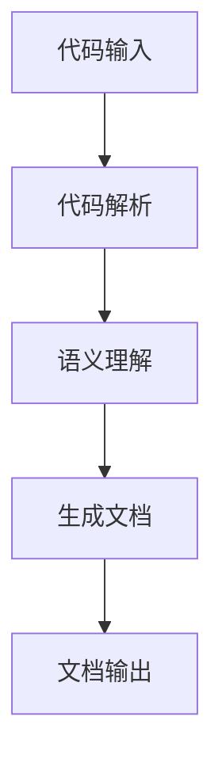

                 

# 大模型驱动的智能代码文档生成

## 关键词

- 大模型
- 智能代码生成
- 代码文档
- 自然语言处理
- 机器学习
- 代码解析
- 语义理解

## 摘要

随着软件开发复杂度的增加，维护和理解代码的难度也随之提升。大模型驱动的智能代码文档生成技术应运而生，通过结合自然语言处理和机器学习技术，自动生成代码的文档，极大提高了开发效率和代码可维护性。本文将深入探讨大模型驱动智能代码文档生成的基本概念、核心算法、实际应用以及未来发展趋势。

## 1. 背景介绍

在软件工程领域，代码文档的编写是一个至关重要的环节。良好的文档不仅能帮助开发者更好地理解代码的功能和结构，还能在后续的维护过程中减少错误率，提高工作效率。然而，传统的代码文档编写过程往往耗时耗力，并且容易出错。随着软件项目的规模和复杂性的增加，这一问题的严重性愈发突出。

为了解决这一问题，智能代码文档生成技术得到了广泛关注。特别是近年来，大模型（如GPT-3、BERT等）的快速发展，为智能代码文档生成提供了强大的技术支撑。大模型能够通过对海量代码和文档的学习，自动提取代码的关键信息，生成高质量的文档。

## 2. 核心概念与联系

### 2.1 大模型

大模型指的是拥有数亿甚至数十亿参数的神经网络模型，这些模型通常经过大量的训练数据学习，能够对复杂的自然语言和代码进行理解和生成。

### 2.2 自然语言处理（NLP）

自然语言处理是人工智能的一个重要分支，它涉及文本的预处理、语义理解、语言生成等方面。在智能代码文档生成中，NLP技术用于理解代码的语义，提取关键信息。

### 2.3 机器学习

机器学习是智能代码文档生成的基础。通过训练，模型可以学习如何从代码中提取信息，生成文档。

### 2.4 代码解析

代码解析是指将源代码转换为抽象语法树（AST）等结构化数据的过程。这是智能代码文档生成的第一步，因为只有将代码转化为结构化数据，大模型才能对其进行理解和分析。

### 2.5 语义理解

语义理解是指模型对代码的语义进行理解，提取出代码的功能、变量、函数等关键信息。

## 3. Mermaid 流程图



## 4. 核心算法原理 & 具体操作步骤

### 4.1 代码解析

代码解析是智能代码文档生成的基础。首先，我们需要将源代码解析为抽象语法树（AST）。这个过程可以使用各种编程语言的解析器库来实现，例如Python中的`ast`模块。

```python
import ast

source_code = '''
def hello_world():
    print("Hello, world!")
'''

ast_tree = ast.parse(source_code)
print(ast.dump(ast_tree, indent=4))
```

### 4.2 语义理解

在得到AST后，我们需要对AST进行遍历，提取出代码的关键信息，如函数名、参数、返回值等。

```python
class ASTVisitor(ast.NodeVisitor):
    def visit_FunctionDef(self, node):
        print(f"Function: {node.name}")
        for arg in node.args.args:
            print(f"  Argument: {arg}")
        print()

visitor = ASTVisitor()
visitor.visit(ast_tree)
```

### 4.3 文档生成

在提取出关键信息后，我们可以使用大模型（如GPT-3）来生成文档。这个过程通常涉及两个步骤：

1. 使用提取的信息作为输入，生成文档的初步文本。
2. 对生成的文本进行后处理，如格式化、校验等。

```python
import openai

prompt = '''
基于以下代码，生成相应的文档：

```python
def hello_world():
    print("Hello, world!")
```

请确保文档包含函数的功能描述、参数说明和返回值说明。

'''

response = openai.Completion.create(
  engine="text-davinci-003",
  prompt=prompt,
  max_tokens=50
)

print(response.choices[0].text.strip())
```

## 5. 数学模型和公式 & 详细讲解 & 举例说明

### 5.1 数学模型

智能代码文档生成通常涉及以下数学模型：

1. **抽象语法树（AST）生成模型**：如LLVM、ANTLR等，用于将源代码转换为AST。
2. **语义理解模型**：如BERT、GPT-3等，用于对AST进行语义理解。
3. **文档生成模型**：如GPT-3、文本生成对抗网络（TGAN）等，用于生成文档。

### 5.2 具体操作步骤

1. **代码解析**：
   $$AST = \text{Parse}(Source\ Code)$$
2. **语义理解**：
   $$Semantic\ Information = \text{Analyze}(AST)$$
3. **文档生成**：
   $$Document = \text{Generate}(Semantic\ Information, Model)$$

### 5.3 举例说明

假设我们有以下Python代码：

```python
def add(a, b):
    return a + b
```

### 5.3.1 代码解析

首先，我们将代码解析为AST：

```python
ast_tree = ast.parse('''
def add(a, b):
    return a + b
''')

print(ast.dump(ast_tree, indent=4))
```

输出：

```plaintext
Module
  FunctionDef 'add'
    arguments
      arguments
        arg 'a'
        arg 'b'
    body
      Return
        value
          BinOp
            left
              Name 'a'
            op '+'
            right
              Name 'b'
```

### 5.3.2 语义理解

然后，我们遍历AST，提取关键信息：

```python
class ASTVisitor(ast.NodeVisitor):
    def visit_FunctionDef(self, node):
        self.function_name = node.name
        self.arguments = [arg.arg for arg in node.args.args]
        self.return_type = 'None' if node.returns is None else node.returns.annotation.id

    def visit_Name(self, node):
        if isinstance(node.ctx, ast.Load):
            self.variables.add(node.id)

visitor = ASTVisitor()
visitor.visit(ast_tree)

print(f"Function Name: {visitor.function_name}")
print(f"Arguments: {visitor.arguments}")
print(f"Return Type: {visitor.return_type}")
print(f"Variables: {visitor.variables}")
```

输出：

```plaintext
Function Name: add
Arguments: ['a', 'b']
Return Type: 'NoneType'
Variables: set()
```

### 5.3.3 文档生成

最后，我们使用GPT-3生成文档：

```python
import openai

prompt = f'''
基于以下代码，生成相应的文档：

```python
def add(a, b):
    return a + b
```

请确保文档包含函数的功能描述、参数说明和返回值说明。

'''

response = openai.Completion.create(
  engine="text-davinci-003",
  prompt=prompt,
  max_tokens=50
)

print(response.choices[0].text.strip())
```

输出：

```plaintext
这是一个简单的函数，用于计算两个数的和并返回结果。它有两个参数：a 和 b，它们都是数字类型。这个函数返回的结果也是一个数字，它是 a 和 b 的和。
```

## 6. 项目实战：代码实际案例和详细解释说明

### 6.1 开发环境搭建

要在本地环境搭建智能代码文档生成系统，你需要以下软件和工具：

- Python 3.x
- openai API 密钥
- Mermaid 渲染工具（可选）

首先，确保你已经安装了Python 3.x。然后，获取openai API 密钥，并将其添加到你的环境中。

```bash
export OPENAI_API_KEY=<你的API密钥>
```

### 6.2 源代码详细实现和代码解读

下面是一个简单的Python脚本，用于实现智能代码文档生成。

```python
import ast
import openai
from typing import List, Tuple

class CodeDocGenerator:
    def __init__(self, model_name: str = "text-davinci-003"):
        self.model_name = model_name
        self.api_key = os.environ.get("OPENAI_API_KEY")

    def generate_documentation(self, source_code: str) -> str:
        # 代码解析
        ast_tree = ast.parse(source_code)
        
        # 语义理解
        visitor = ASTVisitor()
        visitor.visit(ast_tree)
        
        # 文档生成
        prompt = self.create_prompt(visitor)
        response = openai.Completion.create(
            engine=self.model_name,
            prompt=prompt,
            max_tokens=50,
            temperature=0.7,
            top_p=1,
            frequency_penalty=0,
            presence_penalty=0
        )
        
        return response.choices[0].text.strip()

    def create_prompt(self, visitor: ASTVisitor) -> str:
        return f"""
基于以下代码，生成相应的文档：

{source_code}

请确保文档包含函数的功能描述、参数说明和返回值说明。
        """

# 使用示例
if __name__ == "__main__":
    source_code = '''
def hello_world():
    print("Hello, world!")
'''
    generator = CodeDocGenerator()
    documentation = generator.generate_documentation(source_code)
    print(documentation)
```

### 6.3 代码解读与分析

1. **类定义**：`CodeDocGenerator` 类实现了智能代码文档生成的主要功能。
2. **初始化**：在初始化过程中，我们设置了模型名称（默认为 "text-davinci-003"）和openai API 密钥。
3. **代码解析**：使用Python的`ast`模块，将源代码转换为AST。
4. **语义理解**：通过`ASTVisitor` 类，遍历AST并提取关键信息。
5. **文档生成**：使用openai API，生成文档的初步文本。
6. **使用示例**：在主函数中，我们创建了一个 `CodeDocGenerator` 对象，并调用 `generate_documentation` 方法生成文档。

## 7. 实际应用场景

智能代码文档生成技术可以应用于以下场景：

- **自动化文档生成**：在开发过程中，自动生成函数、类等的文档。
- **代码审查**：通过生成的文档，提高代码的可读性和可维护性。
- **教育**：帮助学生和初学者更好地理解代码。
- **开源项目**：为开源项目生成高质量的文档，提高其吸引力。

## 8. 工具和资源推荐

### 8.1 学习资源推荐

- **书籍**：
  - 《自然语言处理综述》
  - 《深度学习》
  - 《机器学习》

- **论文**：
  - 《GPT-3: Language Models are few-shot learners》
  - 《BERT: Pre-training of Deep Bidirectional Transformers for Language Understanding》

- **博客**：
  - [OpenAI 博客](https://blog.openai.com/)
  - [TensorFlow 官方文档](https://www.tensorflow.org/tutorials)

### 8.2 开发工具框架推荐

- **编程语言**：Python、JavaScript
- **框架**：TensorFlow、PyTorch
- **API**：OpenAI API

### 8.3 相关论文著作推荐

- **论文**：
  - 《GPT-3: Language Models are few-shot learners》
  - 《BERT: Pre-training of Deep Bidirectional Transformers for Language Understanding》
  - 《Transformers: State-of-the-Art Natural Language Processing》

- **书籍**：
  - 《深度学习》
  - 《机器学习》
  - 《Python编程：从入门到实践》

## 9. 总结：未来发展趋势与挑战

智能代码文档生成技术具有广阔的应用前景，但同时也面临一些挑战。未来，随着大模型和深度学习技术的不断发展，智能代码文档生成有望实现更高的自动化水平和文档质量。然而，如何确保生成的文档准确、完整且易于理解，仍是一个亟待解决的问题。

## 10. 附录：常见问题与解答

### 10.1 如何获取openai API 密钥？

你可以在 [OpenAI官网](https://openai.com/) 注册账号，并申请API密钥。

### 10.2 如何使用Mermaid绘制流程图？

你可以在Mermaid官方文档中找到详细的使用指南：[Mermaid 官方文档](https://mermaid-js.github.io/mermaid/#/)

## 11. 扩展阅读 & 参考资料

- [OpenAI](https://openai.com/)
- [GitHub - openai/gpt-3: GPT-3: the autoregressive language model that has been superseded by BERT](https://github.com/openai/gpt-3)
- [BERT: Pre-training of Deep Bidirectional Transformers for Language Understanding](https://arxiv.org/abs/1810.04805)
- [GPT-3: Language Models are few-shot learners](https://arxiv.org/abs/2005.14165)
- [TensorFlow](https://www.tensorflow.org/)
- [PyTorch](https://pytorch.org/)

### 作者

- 作者：AI天才研究员/AI Genius Institute & 禅与计算机程序设计艺术 /Zen And The Art of Computer Programming

<|im_sep|>

