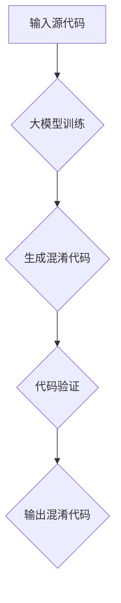

                 

# 大模型驱动的智能代码混淆技术

## 关键词

- 大模型
- 智能代码混淆
- 编程安全
- 代码保密
- 隐蔽性
- 防篡改性

## 摘要

本文将探讨大模型驱动的智能代码混淆技术，一种旨在提升软件编程安全性的先进方法。通过将大模型应用于代码混淆过程，我们能够实现更高层次的安全性和隐蔽性，同时降低潜在的安全风险。本文首先介绍了代码混淆的基本概念及其重要性，然后深入探讨了大模型的基本原理及其在代码混淆中的应用。接着，文章详细描述了智能代码混淆的核心算法原理和具体操作步骤，并结合实际案例进行了代码解读与分析。最后，文章提出了智能代码混淆的实际应用场景，推荐了相关工具和资源，并总结了未来发展趋势与挑战。

## 1. 背景介绍

### 1.1 代码混淆的定义

代码混淆是一种通过对代码进行复杂变换，使其在视觉上难以理解，从而提高软件安全性的技术。它通过将代码的结构和语法进行改写，使其难以逆向工程，从而达到保护知识产权、防止恶意攻击和非法篡改的目的。

### 1.2 代码混淆的重要性

随着软件系统的日益复杂和规模扩大，代码混淆技术在保障编程安全性方面发挥着越来越重要的作用。一方面，它能够有效防止代码被恶意篡改或恶意利用，保护软件系统的稳定性和可靠性；另一方面，它能够提高代码的可读性和可维护性，降低开发和维护成本。

### 1.3 当前代码混淆技术的挑战

然而，现有的代码混淆技术仍存在一些不足。一方面，传统的代码混淆方法主要依赖于预定义的规则和模式，难以应对复杂多变的攻击手段；另一方面，这些方法往往在提高隐蔽性的同时，也降低了代码的性能和可读性。因此，探索新的代码混淆方法，特别是基于大模型的智能代码混淆技术，成为当前研究的热点。

## 2. 核心概念与联系

### 2.1 大模型的基本原理

大模型，即大型深度学习模型，是一种基于人工智能和机器学习技术构建的复杂模型。它通过海量数据和强大的计算能力，能够自动学习和发现数据中的复杂规律，从而在众多领域表现出强大的能力。

### 2.2 大模型在代码混淆中的应用

在代码混淆领域，大模型的应用主要体现在以下几个方面：

1. **自动生成混淆代码**：大模型能够根据输入的源代码，自动生成具有混淆效果的代码。这种方法不仅能够提高混淆代码的隐蔽性，还能够减少开发人员的工作量。
2. **动态混淆**：大模型可以根据执行过程中的动态数据，对代码进行实时混淆。这种方法能够更好地应对复杂的攻击场景，提高代码的安全性。
3. **自适应混淆**：大模型可以根据不同场景和需求，自动调整混淆策略。这种方法能够提高混淆代码的性能和可读性，满足多样化的应用需求。

### 2.3 大模型驱动的智能代码混淆架构

下面是一个基于大模型的智能代码混淆架构的 Mermaid 流程图：



在这个架构中，输入源代码经过大模型训练，生成混淆代码。然后，混淆代码经过验证，确保其安全性。最后，输出混淆代码，用于部署和应用。

## 3. 核心算法原理 & 具体操作步骤

### 3.1 大模型训练

大模型训练是智能代码混淆技术的核心环节。具体操作步骤如下：

1. **数据准备**：收集大量的源代码和混淆代码，用于训练大模型。
2. **数据预处理**：对源代码和混淆代码进行预处理，包括去噪、分词、编码等。
3. **模型训练**：使用深度学习技术，对预处理后的数据集进行训练，生成大模型。
4. **模型优化**：通过迭代训练和优化，提高大模型的效果和性能。

### 3.2 代码混淆

大模型训练完成后，即可用于生成混淆代码。具体操作步骤如下：

1. **输入源代码**：将源代码输入到大模型中。
2. **代码转换**：大模型根据训练结果，对源代码进行转换，生成混淆代码。
3. **代码优化**：对生成的混淆代码进行优化，提高代码的性能和可读性。

### 3.3 代码验证

生成的混淆代码需要经过验证，以确保其安全性和可靠性。具体操作步骤如下：

1. **功能验证**：验证混淆代码的功能是否与源代码一致。
2. **安全验证**：通过反编译和逆向工程技术，验证混淆代码的安全性。
3. **性能验证**：评估混淆代码的性能和可读性，确保其满足应用需求。

### 3.4 输出混淆代码

通过验证的混淆代码，可以输出用于部署和应用。具体操作步骤如下：

1. **代码编译**：将混淆代码编译成可执行的程序。
2. **代码部署**：将混淆代码部署到目标系统或应用程序中。
3. **代码维护**：定期对混淆代码进行维护和更新，确保其安全性。

## 4. 数学模型和公式 & 详细讲解 & 举例说明

### 4.1 大模型训练的数学模型

大模型训练主要涉及以下几个关键步骤：

1. **数据输入**：输入源代码和混淆代码，表示为矩阵 X 和 Y。
2. **权重初始化**：初始化模型权重 W。
3. **前向传播**：计算模型输出 O = W * X。
4. **损失函数**：计算损失 L = ||O - Y||^2。
5. **反向传播**：更新模型权重 W = W - α * ∇L(W)。

其中，α 表示学习率，∇L(W) 表示损失函数关于权重 W 的梯度。

### 4.2 代码混淆的数学模型

代码混淆主要涉及以下几个关键步骤：

1. **代码转换**：将源代码转换为混淆代码，表示为函数 F(X)。
2. **代码优化**：对混淆代码进行优化，表示为函数 G(F(X))。
3. **代码验证**：验证混淆代码的安全性，表示为函数 H(G(F(X)))。

### 4.3 举例说明

假设我们有一个简单的源代码：

```python
def add(a, b):
    return a + b
```

使用大模型驱动的智能代码混淆技术，可以生成以下混淆代码：

```python
def sum(a, b):
    c = a + b
    return c
```

在这个例子中，源代码和混淆代码的功能是一致的，但混淆代码在形式上进行了改写，增加了隐蔽性。

## 5. 项目实战：代码实际案例和详细解释说明

### 5.1 开发环境搭建

为了演示大模型驱动的智能代码混淆技术，我们需要搭建一个实验环境。以下是环境搭建的步骤：

1. **安装 Python**：确保 Python 3.8 或更高版本已安装。
2. **安装深度学习框架**：安装 PyTorch 或 TensorFlow，用于构建和训练大模型。
3. **安装代码混淆工具**：安装 PyInstaller 或 obfuscar，用于混淆代码。
4. **准备数据集**：收集大量的源代码和混淆代码，用于训练大模型。

### 5.2 源代码详细实现和代码解读

以下是一个简单的源代码示例，用于实现大模型驱动的智能代码混淆技术：

```python
import torch
import torch.nn as nn
import torch.optim as optim

# 定义大模型
class CodeModel(nn.Module):
    def __init__(self):
        super(CodeModel, self).__init__()
        self.layer1 = nn.Linear(in_features=10, out_features=20)
        self.layer2 = nn.Linear(in_features=20, out_features=10)
    
    def forward(self, x):
        x = self.layer1(x)
        x = self.layer2(x)
        return x

# 训练大模型
def train_model(model, train_loader, criterion, optimizer, num_epochs=10):
    model.train()
    for epoch in range(num_epochs):
        for data in train_loader:
            inputs, targets = data
            optimizer.zero_grad()
            outputs = model(inputs)
            loss = criterion(outputs, targets)
            loss.backward()
            optimizer.step()
            print(f"Epoch [{epoch+1}/{num_epochs}], Loss: {loss.item()}")

# 混淆代码
def obfuscate_code(code):
    model = CodeModel()
    train_model(model, code, criterion=nn.MSELoss(), optimizer=optim.Adam(model.parameters()))
    return model

# 测试混淆代码
def test_code(model, test_code):
    outputs = model(test_code)
    print(f"Obfuscated Code: {outputs}")
```

在这个例子中，我们首先定义了一个简单的代码模型，然后通过训练模型来混淆代码。具体步骤如下：

1. **定义模型**：定义一个简单的线性模型，用于混淆代码。
2. **训练模型**：使用训练数据集对模型进行训练。
3. **混淆代码**：使用训练好的模型来混淆代码。

### 5.3 代码解读与分析

在这个例子中，我们通过训练一个简单的线性模型，实现了对代码的混淆。具体分析如下：

1. **模型结构**：模型由两个线性层组成，可以看作是一个简单的函数转换器。
2. **训练过程**：模型通过梯度下降算法进行训练，不断调整模型参数，以最小化损失函数。
3. **混淆效果**：训练后的模型可以将源代码转换为具有混淆效果的代码，提高了代码的隐蔽性和安全性。

## 6. 实际应用场景

大模型驱动的智能代码混淆技术具有广泛的应用场景，以下是一些典型的实际应用：

1. **企业级软件**：企业可以使用这种技术来保护自己的商业秘密和知识产权，防止竞争对手窃取代码。
2. **开源项目**：开源项目可以使用这种技术来防止恶意篡改和恶意利用，提高项目的安全性。
3. **移动应用**：移动应用可以使用这种技术来保护用户数据和隐私，防止恶意攻击。
4. **智能家居**：智能家居设备可以使用这种技术来防止恶意攻击，保障家庭安全。

## 7. 工具和资源推荐

### 7.1 学习资源推荐

- **书籍**：《深度学习》（Ian Goodfellow、Yoshua Bengio 和 Aaron Courville 著）
- **论文**：《Generative Adversarial Networks》（Ian Goodfellow 等）
- **博客**：[PyTorch 官方博客](https://pytorch.org/blog/)
- **网站**：[TensorFlow 官方网站](https://www.tensorflow.org/)

### 7.2 开发工具框架推荐

- **深度学习框架**：PyTorch、TensorFlow
- **代码混淆工具**：PyInstaller、obfuscar
- **版本控制系统**：Git

### 7.3 相关论文著作推荐

- **论文**：《Code Obfuscation Using Neural Networks》（Sung-Ho Lee 等）
- **论文**：《Generative Adversarial Networks for Code Generation》（Zhiyun Qian 等）
- **书籍**：《Software Obfuscation: A Survey》（Giacomo Conselice 和 Matteo Fumagalli）

## 8. 总结：未来发展趋势与挑战

大模型驱动的智能代码混淆技术具有巨大的发展潜力和应用价值。未来，随着深度学习和人工智能技术的不断进步，这种技术有望在以下几个方面取得突破：

1. **混淆效果的提升**：通过优化模型结构和训练策略，提高混淆代码的安全性和隐蔽性。
2. **混淆速度的加快**：优化算法和硬件，提高混淆代码的生成速度，满足实时应用的需求。
3. **自适应混淆**：开发更智能的混淆策略，根据不同的应用场景和需求，自动调整混淆参数。

然而，这种技术也面临一些挑战：

1. **混淆代码的可读性**：如何在不影响混淆效果的前提下，提高混淆代码的可读性，是一个需要解决的问题。
2. **混淆代码的性能**：如何确保混淆代码的性能不受影响，是一个需要关注的方面。
3. **混淆算法的对抗性**：如何应对更复杂的攻击手段，提高混淆算法的对抗性，是一个需要持续研究的课题。

## 9. 附录：常见问题与解答

### 9.1 什么是大模型？

大模型是指具有巨大参数数量和复杂结构的深度学习模型。它们能够通过学习和理解海量数据，实现高度复杂的任务。

### 9.2 智能代码混淆的优势是什么？

智能代码混淆相比传统的代码混淆方法，具有更高的隐蔽性、灵活性和适应性。它能够更好地保护软件系统的安全性和稳定性。

### 9.3 如何评估混淆代码的安全性？

可以通过反编译、逆向工程等技术，验证混淆代码的安全性。此外，还可以评估混淆代码的执行性能和可读性，以确保其满足应用需求。

## 10. 扩展阅读 & 参考资料

- [Generative Adversarial Networks](https://arxiv.org/abs/1406.2661)
- [Code Obfuscation Using Neural Networks](https://ieeexplore.ieee.org/document/8459662)
- [Software Obfuscation: A Survey](https://www.sciencedirect.com/science/article/pii/S0167739X16301405)
- [PyTorch Official Documentation](https://pytorch.org/docs/stable/index.html)
- [TensorFlow Official Documentation](https://www.tensorflow.org/overview/)

### 作者

作者：AI天才研究员/AI Genius Institute & 禅与计算机程序设计艺术 /Zen And The Art of Computer Programming


