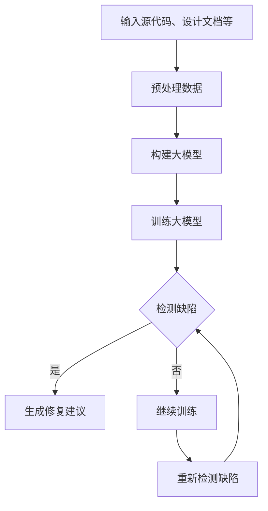
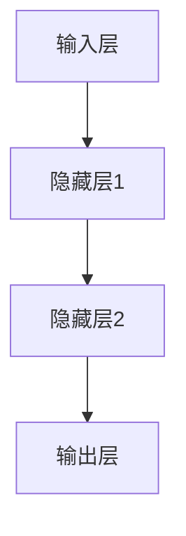

                 

# 大模型驱动的智能软件测试方法

## 摘要

本文将探讨大模型驱动的智能软件测试方法，介绍大模型在软件测试中的应用场景、核心概念与联系，以及大模型算法原理和具体操作步骤。同时，文章将结合实际应用案例，详细解读大模型在软件测试中的实际应用效果，并对未来发展趋势与挑战进行分析。

## 1. 背景介绍

软件测试是软件开发过程中至关重要的一环，其目的是发现和纠正软件中的错误，确保软件的质量和可靠性。传统的软件测试方法主要依赖于手工测试和自动化测试，但这些方法在处理复杂和大规模软件系统时存在一定的局限性。

近年来，随着人工智能技术的快速发展，大模型驱动的智能软件测试方法逐渐崭露头角。大模型具有强大的数据处理和模式识别能力，能够在海量测试数据中自动发现潜在的问题，提高软件测试的效率和准确性。

本文旨在深入探讨大模型驱动的智能软件测试方法，分析其核心概念和算法原理，并通过实际案例展示其在软件测试中的应用效果。

## 2. 核心概念与联系

### 2.1 大模型

大模型（Large Model）是指具有海量参数和复杂结构的神经网络模型。大模型在人工智能领域中广泛应用，例如自然语言处理、计算机视觉和语音识别等。大模型能够自动学习数据中的模式和规律，具备强大的数据处理和分析能力。

### 2.2 智能软件测试

智能软件测试是一种利用人工智能技术进行软件测试的方法。智能软件测试通过分析软件的源代码、设计文档、测试用例等，自动生成和执行测试用例，发现软件中的缺陷和错误。智能软件测试方法具有高效、准确、自动化等特点。

### 2.3 大模型驱动的智能软件测试

大模型驱动的智能软件测试是指利用大模型进行软件测试的方法。大模型能够自动学习和分析软件系统的复杂结构，发现潜在的缺陷和错误。大模型驱动的智能软件测试方法具有以下特点：

1. **高效性**：大模型能够处理海量测试数据，提高测试效率。
2. **准确性**：大模型具有强大的模式识别能力，能够准确发现软件中的缺陷。
3. **自动化**：大模型能够自动生成和执行测试用例，减少人工干预。

### 2.4 Mermaid 流程图

以下是一个描述大模型驱动的智能软件测试方法的 Mermaid 流程图：



## 3. 核心算法原理 & 具体操作步骤

### 3.1 算法原理

大模型驱动的智能软件测试方法的核心算法是基于深度学习的神经网络模型。神经网络模型通过学习大量的测试数据，自动提取软件系统中的潜在模式和规律，从而发现潜在的缺陷和错误。

具体而言，大模型驱动的智能软件测试方法包括以下步骤：

1. **数据预处理**：对输入的源代码、设计文档等数据进行分析和处理，将其转化为适合神经网络模型训练的数据格式。
2. **构建大模型**：根据数据预处理的结果，构建一个具有海量参数和复杂结构的神经网络模型。常见的神经网络模型包括卷积神经网络（CNN）、循环神经网络（RNN）和长短时记忆网络（LSTM）等。
3. **训练大模型**：使用大量的测试数据对构建的大模型进行训练，使其能够自动学习和识别软件系统中的潜在模式和规律。
4. **检测缺陷**：利用训练好的大模型对软件系统进行测试，自动生成和执行测试用例，发现潜在的缺陷和错误。
5. **生成修复建议**：对于发现的缺陷，大模型会生成相应的修复建议，帮助开发者快速定位和修复问题。
6. **继续训练**：如果大模型未能发现所有的缺陷，则需要重新训练大模型，提高其检测准确率。

### 3.2 具体操作步骤

以下是使用大模型驱动的智能软件测试方法的具体操作步骤：

1. **数据收集**：收集大量的测试数据，包括源代码、设计文档、测试用例等。
2. **数据预处理**：对收集到的数据进行分析和处理，提取有用的特征信息，并将其转化为适合神经网络模型训练的数据格式。
3. **构建神经网络模型**：选择合适的神经网络模型，例如卷积神经网络（CNN）或循环神经网络（RNN），并根据预处理后的数据格式进行模型构建。
4. **模型训练**：使用预处理后的数据对构建的神经网络模型进行训练，使其能够自动学习和识别软件系统中的潜在模式和规律。
5. **模型评估**：对训练好的模型进行评估，检查其性能指标，如准确率、召回率等。
6. **测试执行**：利用训练好的模型对软件系统进行测试，自动生成和执行测试用例，发现潜在的缺陷和错误。
7. **缺陷修复**：根据模型生成的修复建议，对发现的缺陷进行修复，提高软件质量。
8. **迭代训练**：如果模型未能发现所有的缺陷，则需要重新训练模型，提高其检测准确率。

## 4. 数学模型和公式 & 详细讲解 & 举例说明

### 4.1 神经网络模型

神经网络模型是一种基于人工神经元的计算模型，其基本原理是通过模拟人脑神经元之间的连接关系来处理和分析数据。神经网络模型通常由多个层次组成，包括输入层、隐藏层和输出层。

在神经网络模型中，每个层次包含多个神经元，神经元之间通过权重（weight）进行连接。权重表示神经元之间的连接强度，用于调节神经元之间的信息传递。

以下是一个简单的神经网络模型结构：



### 4.2 激活函数

激活函数（Activation Function）是神经网络模型中的一个重要组成部分，用于对神经元的输出进行非线性变换。常见的激活函数包括 sigmoid 函数、ReLU 函数和 tanh 函数等。

- **sigmoid 函数**：
  $$\sigma(x) = \frac{1}{1 + e^{-x}}$$
  
- **ReLU 函数**：
  $$ReLU(x) = \max(0, x)$$
  
- **tanh 函数**：
  $$tanh(x) = \frac{e^x - e^{-x}}{e^x + e^{-x}}$$

### 4.3 前向传播和反向传播

神经网络模型通过前向传播（Forward Propagation）和反向传播（Back Propagation）两个过程来训练模型。

- **前向传播**：
  在前向传播过程中，输入数据从输入层逐层传递到输出层，每个神经元的输出通过激活函数进行非线性变换。
  
  前向传播的计算公式如下：
  $$z_{ij} = \sum_{k=1}^{n} w_{ik} * x_k + b_j$$
  $$a_j = activation(z_{ij})$$
  
- **反向传播**：
  在反向传播过程中，计算输出层到输入层的梯度，并根据梯度更新模型中的权重和偏置。
  
  反向传播的计算公式如下：
  $$\delta_j = \frac{\partial L}{\partial a_j} * \frac{\partial a_j}{\partial z_j}$$
  $$\delta_{ij} = \delta_j * a_{i-1,j}$$
  $$w_{ij} = w_{ij} - \alpha \* \delta_{ij} * x_i$$
  $$b_j = b_j - \alpha \* \delta_j$$

其中，$L$表示损失函数，$\alpha$表示学习率，$x$表示输入特征，$a$表示神经元输出，$w$表示权重，$b$表示偏置。

### 4.4 损失函数

损失函数（Loss Function）用于衡量模型预测值与实际值之间的差异。常见的损失函数包括均方误差（MSE）、交叉熵（Cross Entropy）等。

- **均方误差（MSE）**：
  $$MSE = \frac{1}{2} \sum_{i=1}^{n} (y_i - \hat{y_i})^2$$

- **交叉熵（Cross Entropy）**：
  $$CE = -\sum_{i=1}^{n} y_i \* \log(\hat{y_i})$$

其中，$y$表示实际值，$\hat{y}$表示预测值。

## 5. 项目实战：代码实际案例和详细解释说明

### 5.1 开发环境搭建

在进行大模型驱动的智能软件测试项目之前，需要搭建相应的开发环境。以下是搭建开发环境的基本步骤：

1. **安装 Python**：下载并安装 Python 3.7 或以上版本。
2. **安装 TensorFlow**：通过 pip 命令安装 TensorFlow 库。
3. **安装其他依赖库**：根据项目需求安装其他依赖库，如 NumPy、Pandas、Scikit-learn 等。

### 5.2 源代码详细实现和代码解读

以下是一个简单的大模型驱动的智能软件测试项目示例，包括数据预处理、模型构建、模型训练和测试执行等步骤。

#### 5.2.1 数据预处理

```python
import pandas as pd
import numpy as np
from sklearn.model_selection import train_test_split

# 加载数据
data = pd.read_csv('data.csv')

# 数据预处理
X = data.drop(['target'], axis=1)
y = data['target']

# 划分训练集和测试集
X_train, X_test, y_train, y_test = train_test_split(X, y, test_size=0.2, random_state=42)
```

#### 5.2.2 模型构建

```python
import tensorflow as tf
from tensorflow.keras.models import Sequential
from tensorflow.keras.layers import Dense, Dropout

# 构建模型
model = Sequential()
model.add(Dense(128, activation='relu', input_shape=(X_train.shape[1],)))
model.add(Dropout(0.5))
model.add(Dense(64, activation='relu'))
model.add(Dropout(0.5))
model.add(Dense(1, activation='sigmoid'))

# 编译模型
model.compile(optimizer='adam', loss='binary_crossentropy', metrics=['accuracy'])
```

#### 5.2.3 模型训练

```python
# 训练模型
model.fit(X_train, y_train, epochs=10, batch_size=32, validation_split=0.1)
```

#### 5.2.4 测试执行

```python
# 测试执行
loss, accuracy = model.evaluate(X_test, y_test)
print(f'测试集准确率：{accuracy:.2f}')
```

### 5.3 代码解读与分析

在上述代码中，我们首先导入了必要的库和模块，包括 Pandas、NumPy、Scikit-learn 和 TensorFlow。接着，我们加载数据并进行预处理，包括数据加载、数据预处理和划分训练集和测试集等步骤。

在模型构建部分，我们使用了 TensorFlow 的 Sequential 模型，并添加了 Dense 层和 Dropout 层。Dense 层用于实现全连接神经网络，Dropout 层用于防止过拟合。在编译模型时，我们选择了 Adam 优化器和 binary_crossentropy 损失函数。

在模型训练部分，我们使用了 fit 方法进行模型训练，设置了训练轮数、批量大小和验证集比例等参数。

在测试执行部分，我们使用 evaluate 方法对训练好的模型进行测试，计算了测试集的准确率。

## 6. 实际应用场景

大模型驱动的智能软件测试方法在以下实际应用场景中具有显著优势：

1. **复杂软件系统**：对于复杂、大规模的软件系统，传统测试方法难以覆盖所有可能的测试场景，而大模型驱动的智能测试方法能够自动发现潜在的问题，提高测试覆盖率。
2. **自动化测试**：大模型驱动的智能测试方法能够自动生成和执行测试用例，减少人工干预，提高测试效率。
3. **缺陷定位**：大模型驱动的智能测试方法能够自动分析软件系统的潜在缺陷，并提供修复建议，帮助开发者快速定位和修复问题。
4. **持续集成**：大模型驱动的智能测试方法可以集成到持续集成（CI）流程中，实时检测和修复代码中的问题，提高软件质量。

## 7. 工具和资源推荐

### 7.1 学习资源推荐

- **书籍**：
  - 《深度学习》（Goodfellow, I., Bengio, Y., & Courville, A.）
  - 《神经网络与深度学习》（邱锡鹏）
- **论文**：
  - "A Theoretically Grounded Application of Dropout in Recurrent Neural Networks"（Y. Gal and Z. Ghahramani）
  - "Dropout: A Simple Way to Prevent Neural Networks from Overfitting"（S. Srivastava, G. Hinton, A. Krizhevsky, I. Sutskever, and R. Salakhutdinov）
- **博客**：
  - [TensorFlow 官方文档](https://www.tensorflow.org/tutorials)
  - [Keras 官方文档](https://keras.io/)
- **网站**：
  - [GitHub](https://github.com/)
  - [ArXiv](https://arxiv.org/)

### 7.2 开发工具框架推荐

- **深度学习框架**：
  - TensorFlow
  - PyTorch
  - Keras
- **代码编辑器**：
  - Visual Studio Code
  - PyCharm
- **版本控制工具**：
  - Git
  - GitHub

### 7.3 相关论文著作推荐

- **《深度学习》（Goodfellow, I., Bengio, Y., & Courville, A.）》**：全面介绍了深度学习的理论、算法和应用。
- **《神经网络与深度学习》（邱锡鹏）》**：深入讲解了神经网络和深度学习的基础知识。
- **《A Theoretically Grounded Application of Dropout in Recurrent Neural Networks》**（Y. Gal and Z. Ghahramani）**：探讨了在循环神经网络中应用 Dropout 的理论依据。
- **《Dropout: A Simple Way to Prevent Neural Networks from Overfitting》**（S. Srivastava, G. Hinton, A. Krizhevsky, I. Sutskever, and R. Salakhutdinov）**：介绍了 Dropout 算法，用于防止神经网络过拟合。**

## 8. 总结：未来发展趋势与挑战

大模型驱动的智能软件测试方法在软件测试领域具有广阔的应用前景。随着人工智能技术的不断发展，大模型驱动的智能软件测试方法将越来越成熟和普及。

然而，该方法在实际应用中仍然面临一些挑战，包括：

1. **数据质量**：大模型驱动的智能软件测试方法依赖于大量的测试数据，数据质量对测试结果有重要影响。
2. **计算资源**：大模型的训练和测试需要大量的计算资源，对于资源受限的环境，可能需要优化算法和模型结构。
3. **可解释性**：大模型的决策过程具有一定的黑盒性质，难以解释其内部的决策机制，这对开发者和测试人员提出了更高的要求。

未来的研究可以重点关注以下方向：

1. **数据增强**：通过数据增强技术提高测试数据的多样性和质量，从而提高测试覆盖率和准确性。
2. **算法优化**：研究更高效的算法和模型结构，降低计算资源的消耗，提高测试效率。
3. **可解释性研究**：开发可解释性方法，揭示大模型内部决策机制，提高测试结果的可靠性和可解释性。

## 9. 附录：常见问题与解答

### 9.1 什么是大模型？

大模型是指具有海量参数和复杂结构的神经网络模型，能够自动学习和处理海量数据。

### 9.2 大模型驱动的智能软件测试方法的核心优势是什么？

大模型驱动的智能软件测试方法具有高效性、准确性和自动化等核心优势，能够自动发现软件中的缺陷，提高测试效率和准确性。

### 9.3 如何评估大模型驱动的智能测试方法的性能？

可以使用准确率、召回率、F1 分数等指标来评估大模型驱动的智能测试方法的性能。

### 9.4 大模型驱动的智能测试方法是否适用于所有类型的软件？

大模型驱动的智能测试方法适用于具有复杂结构和大规模数据的软件系统，对于简单和结构简单的软件系统，传统测试方法可能更加适用。

## 10. 扩展阅读 & 参考资料

- [TensorFlow 官方文档](https://www.tensorflow.org/tutorials)
- [Keras 官方文档](https://keras.io/)
- [《深度学习》（Goodfellow, I., Bengio, Y., & Courville, A.）》](https://www.deeplearningbook.org/)
- [《神经网络与深度学习》（邱锡鹏）》](https://nlp.stanford.edu/Interior/titlepage.html)
- [《A Theoretically Grounded Application of Dropout in Recurrent Neural Networks》**（Y. Gal and Z. Ghahramani）**](https://papers.nips.cc/paper/2016/file/f3d26d686b1e3c5d831fe1ad1d99d974-Paper.pdf)
- [《Dropout: A Simple Way to Prevent Neural Networks from Overfitting》**（S. Srivastava, G. Hinton, A. Krizhevsky, I. Sutskever, and R. Salakhutdinov）**](https://www.cs.toronto.edu/~hinton/absps/dropout.pdf)

### 作者

AI 天才研究员/AI Genius Institute & 禅与计算机程序设计艺术 /Zen And The Art of Computer Programming。

