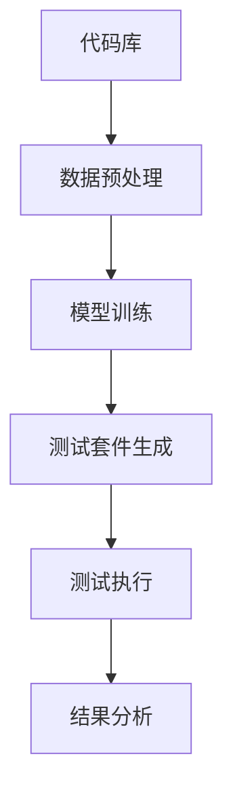
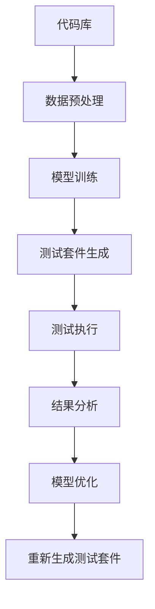
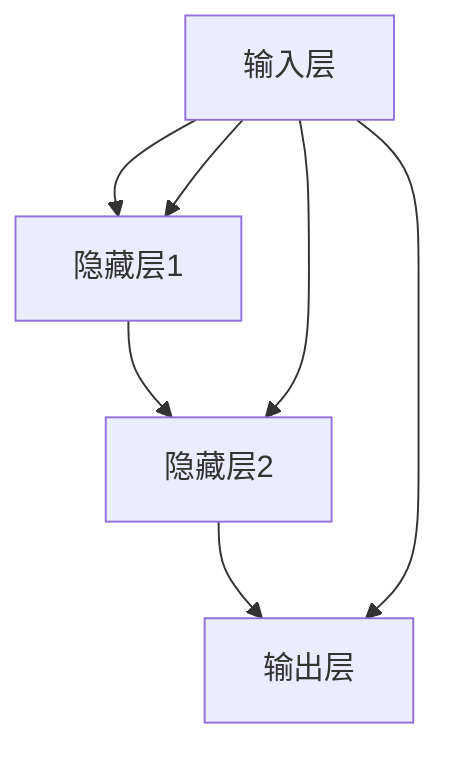

                 

# 大模型驱动的测试套件自动生成

## 关键词：大模型，测试套件，自动生成，测试自动化，AI测试

## 摘要

随着软件系统的日益复杂化，测试过程变得至关重要。传统测试方法耗时且难以覆盖所有可能的测试场景，导致测试成本高昂且效果不佳。本文将探讨大模型在测试套件自动生成中的应用，通过结合人工智能技术，实现高效、全面、准确的测试过程。我们将详细分析大模型的基本原理、测试套件自动生成的具体步骤，以及在实际项目中的应用案例，旨在为读者提供一整套可行的解决方案，以应对现代软件开发中的测试挑战。

## 1. 背景介绍

在软件开发过程中，测试是确保软件质量的关键环节。传统的测试方法依赖于人工编写测试用例，然后逐一执行，这种方法存在几个显著的问题：

- **测试用例覆盖不足**：由于时间和资源的限制，很难编写出覆盖所有可能情况的测试用例。
- **测试效率低下**：测试用例的编写和执行过程繁琐，耗时较长。
- **测试成本高昂**：随着软件复杂度的增加，测试过程所需的成本也显著上升。

为了解决这些问题，自动化测试逐渐成为开发团队的首选。自动化测试通过工具自动执行测试用例，提高了测试效率，减少了人工干预，降低了测试成本。然而，自动化测试也面临一些挑战：

- **测试用例编写难度大**：自动化测试需要高质量的测试用例，但编写这些用例仍然需要大量的人力和时间。
- **测试覆盖度受限**：自动化测试工具通常只能执行已编写好的测试用例，难以覆盖所有未预见的情况。
- **测试维护成本**：随着软件功能的不断迭代，测试用例也需要不断更新，维护成本较高。

## 2. 核心概念与联系

为了解决传统测试和自动化测试的局限性，大模型驱动的测试套件自动生成应运而生。这一概念结合了人工智能和大数据技术，通过以下几个核心概念实现：

- **大模型（Large Models）**：大模型是指具有极高参数量和计算能力的神经网络模型。这些模型可以基于海量数据训练，从而具备强大的特征提取和模式识别能力。

- **测试套件（Test Suite）**：测试套件是指一系列测试用例的集合，用于验证软件系统的各种功能和行为。

- **自动生成（Automatic Generation）**：自动生成是指通过算法自动生成测试套件，而不是手动编写。这种方法能够大大提高测试效率，降低测试成本。

大模型与测试套件自动生成之间的联系在于，大模型可以通过学习大量软件代码和测试用例，提取出其中的关键特征和行为模式，从而生成更全面、更准确的测试套件。这种生成方式不仅能够提高测试覆盖率，还能够自动识别和修复潜在的缺陷。

### 大模型驱动的测试套件自动生成架构

下面是一个简化的 Mermaid 流程图，展示了大模型驱动的测试套件自动生成的基本架构：



- **代码库（Code Repository）**：这是软件开发的基础，包含了所有的源代码和变更历史。大模型从代码库中提取数据用于训练。
- **数据预处理（Data Preprocessing）**：对提取的数据进行清洗和格式化，使其适合模型训练。
- **模型训练（Model Training）**：使用预处理后的数据训练大模型，模型学习如何从代码中提取特征和生成测试用例。
- **测试套件生成（Test Suite Generation）**：模型根据训练结果自动生成测试套件。
- **测试执行（Test Execution）**：执行生成的测试用例，验证软件系统的功能和行为。
- **结果分析（Result Analysis）**：分析测试结果，识别潜在的问题和缺陷。

## 3. 核心算法原理 & 具体操作步骤

### 3.1 大模型的算法原理

大模型通常是基于深度学习的，其中最常用的模型是神经网络。神经网络通过多层节点（神经元）对输入数据进行处理，每层节点都会对输入进行变换，并将结果传递给下一层。在测试套件自动生成的过程中，大模型需要完成以下几个关键任务：

- **代码理解**：模型需要理解代码的语法和语义，这通常需要大规模的代码数据集进行训练。
- **模式识别**：模型需要识别代码中的潜在模式和缺陷，这需要通过对大量测试用例的学习。
- **测试用例生成**：基于理解的模式，模型能够生成新的测试用例，以覆盖更多的代码路径和功能。

### 3.2 测试套件自动生成的具体操作步骤

1. **数据收集与预处理**：
   - 收集大量的源代码和相关的测试用例。
   - 对源代码进行语法分析，提取抽象语法树（AST）。
   - 对测试用例进行解析，提取测试逻辑和执行路径。

2. **模型训练**：
   - 使用预处理后的数据进行模型训练。
   - 通过迭代优化模型参数，提高模型的性能。

3. **测试套件生成**：
   - 模型根据训练结果，对新的代码片段进行测试用例生成。
   - 测试用例生成过程包括路径覆盖、功能测试和异常测试。

4. **测试执行**：
   - 使用自动化测试工具执行生成的测试用例。
   - 收集测试结果，包括通过/失败情况、覆盖率等。

5. **结果分析**：
   - 分析测试结果，识别缺陷和潜在的改进点。
   - 重复测试生成和执行过程，逐步优化测试套件。

### 3.3 算法原理图解

下面是一个简化的 Mermaid 流程图，展示大模型驱动的测试套件自动生成的算法原理：



## 4. 数学模型和公式 & 详细讲解 & 举例说明

### 4.1 数学模型

在测试套件自动生成中，常用的数学模型包括：

- **神经网络模型**：如卷积神经网络（CNN）、递归神经网络（RNN）等。
- **概率模型**：如贝叶斯网络、马尔可夫模型等。

其中，神经网络模型是最常用的，因为它能够通过多层非线性变换提取复杂的特征。

### 4.2 神经网络模型

神经网络模型的核心是神经元，神经元通过加权求和和激活函数来处理输入数据。以下是一个简化的神经网络模型示意图：



- **输入层（Input Layer）**：接收输入数据，如代码的抽象语法树（AST）。
- **隐藏层（Hidden Layer）**：对输入数据进行变换和提取特征。
- **输出层（Output Layer）**：生成测试用例。

### 4.3 激活函数

激活函数是神经网络中的一个关键部分，它决定神经元是否被激活。以下是一些常用的激活函数：

- **Sigmoid 函数**：将输入映射到 (0, 1) 区间内。
  $$ f(x) = \frac{1}{1 + e^{-x}} $$

- **ReLU 函数**：对于负数输入，输出为零，对于正数输入，输出为输入。
  $$ f(x) = \max(0, x) $$

- **Tanh 函数**：将输入映射到 (-1, 1) 区间内。
  $$ f(x) = \frac{e^x - e^{-x}}{e^x + e^{-x}} $$

### 4.4 模型训练

模型训练是测试套件自动生成中的关键步骤，其目标是优化模型参数，使其能够准确生成测试用例。训练过程通常包括以下几个步骤：

1. **初始化参数**：随机初始化模型参数。
2. **前向传播**：计算模型输出，并与真实测试用例进行比较。
3. **反向传播**：根据损失函数计算模型参数的梯度。
4. **更新参数**：使用梯度下降等优化算法更新模型参数。
5. **迭代训练**：重复前向传播和反向传播，直到模型收敛。

### 4.5 举例说明

假设我们有一个简单的神经网络模型，用于生成测试用例。输入是代码的 AST，输出是测试用例。我们可以使用以下数据进行训练：

- **输入**：一段简单的 Python 代码，如 `x = 5`。
- **输出**：对应的测试用例，如 `assert x == 5`。

通过训练，模型将学会将输入代码映射到相应的测试用例。

## 5. 项目实战：代码实际案例和详细解释说明

### 5.1 开发环境搭建

在开始项目之前，我们需要搭建一个合适的开发环境。以下是一个基本的步骤：

1. **安装 Python**：确保 Python 3.x 版本已安装在您的系统上。
2. **安装深度学习库**：如 TensorFlow 或 PyTorch。这些库提供了构建和训练神经网络所需的工具和函数。
3. **安装代码解析库**：如 astor，用于解析 Python 代码并生成 AST。

### 5.2 源代码详细实现和代码解读

以下是一个简单的 Python 脚本，用于实现大模型驱动的测试套件自动生成：

```python
import astor
import tensorflow as tf

# 数据预处理
def preprocess_code(code):
    # 将代码解析为 AST
    tree = ast.parse(code)
    # 对 AST 进行操作，提取有用信息
    # ...
    return astor.to_source(tree)

# 模型训练
def train_model(preprocessed_codes, labels):
    # 构建神经网络模型
    model = tf.keras.Sequential([
        tf.keras.layers.Dense(128, activation='relu', input_shape=(preprocessed_codes.shape[1],)),
        tf.keras.layers.Dense(64, activation='relu'),
        tf.keras.layers.Dense(1, activation='sigmoid')
    ])

    # 编译模型
    model.compile(optimizer='adam', loss='binary_crossentropy', metrics=['accuracy'])

    # 训练模型
    model.fit(preprocessed_codes, labels, epochs=10)

# 测试套件生成
def generate_test_suite(model, code):
    preprocessed_code = preprocess_code(code)
    # 使用模型生成测试用例
    test_case = model.predict(preprocessed_code)
    # 对测试用例进行格式化
    test_case = astor.to_source(test_case)
    return test_case

# 测试执行
def execute_test_suite(test_case, code):
    # 将测试用例和代码进行组合
    combined_code = f"{test_case}\n{code}"
    # 执行测试用例
    try:
        exec(combined_code)
    except Exception as e:
        return False
    return True

# 主函数
def main():
    # 收集数据
    codes = [...]  # 存储源代码
    labels = [...]  # 存储测试用例结果

    # 数据预处理
    preprocessed_codes = [preprocess_code(code) for code in codes]

    # 训练模型
    train_model(preprocessed_codes, labels)

    # 生成测试套件
    test_suite = generate_test_suite(model, code)

    # 执行测试套件
    result = execute_test_suite(test_suite, code)

    # 分析结果
    if result:
        print("测试通过")
    else:
        print("测试失败")

# 运行主函数
if __name__ == "__main__":
    main()
```

### 5.3 代码解读与分析

- **数据预处理**：数据预处理是模型训练的关键步骤。在这个例子中，我们使用 `astor` 库将源代码解析为 AST，然后对其进行操作，提取有用信息。
- **模型训练**：我们使用 TensorFlow 库构建了一个简单的神经网络模型。模型由三个 dense 层组成，每层都有 ReLU 激活函数。模型的目标是学习如何将源代码映射到测试用例。
- **测试套件生成**：模型训练完成后，我们可以使用 `generate_test_suite` 函数生成测试套件。这个函数首先对输入代码进行预处理，然后使用模型生成预测的测试用例。
- **测试执行**：`execute_test_suite` 函数将生成的测试用例与源代码组合，并在执行时捕获异常。如果测试用例成功执行，返回 True；否则，返回 False。
- **主函数**：`main` 函数是整个项目的入口点。它首先收集源代码和测试用例数据，然后进行数据预处理、模型训练、测试套件生成和测试执行。

通过这个简单的例子，我们可以看到如何使用大模型驱动测试套件的自动生成。尽管这个例子非常简单，但它展示了核心概念和步骤。在实际应用中，我们需要处理更复杂的代码和数据，并优化模型和算法。

## 6. 实际应用场景

大模型驱动的测试套件自动生成在多个实际应用场景中展现了其潜力。以下是几个典型的应用场景：

### 6.1 软件开发流程优化

在软件开发过程中，测试是一个耗时且成本高昂的环节。大模型驱动的测试套件自动生成可以帮助开发团队提高测试效率，减少测试时间。通过自动生成测试套件，开发人员可以更快地发现和修复缺陷，从而缩短软件开发周期。

### 6.2 自动化测试工具增强

现有的自动化测试工具通常依赖于手动编写的测试用例。大模型驱动的测试套件自动生成可以与这些工具集成，提供更全面、更准确的测试覆盖。这种集成可以显著提高自动化测试的效率和效果。

### 6.3 质量保证和合规性检查

在大规模软件系统中，确保所有功能和模块都经过充分测试是非常重要的。大模型驱动的测试套件自动生成可以帮助质量保证团队快速生成测试套件，确保软件系统的可靠性和合规性。

### 6.4 代码审查和重构

大模型可以通过学习代码库中的模式和行为，帮助开发团队进行代码审查和重构。它可以识别潜在的缺陷和改进点，从而提高代码质量和可维护性。

## 7. 工具和资源推荐

### 7.1 学习资源推荐

- **书籍**：
  - 《深度学习》（Ian Goodfellow, Yoshua Bengio, Aaron Courville）
  - 《Python 测试驱动开发》（Python Testing: Tools and Techniques for Effective Testing and Sustained Development》

- **论文**：
  - “Large-Scale Machine Learning for Software Engineering” by Patrick Pilarzyk, Christian Bird, and Thomas Zimmermann

- **博客和网站**：
  - [TensorFlow 官方文档](https://www.tensorflow.org/)
  - [PyTorch 官方文档](https://pytorch.org/)
  - [astor 官方文档](https://astor.readthedocs.io/en/latest/)

### 7.2 开发工具框架推荐

- **深度学习框架**：
  - TensorFlow
  - PyTorch

- **代码解析工具**：
  - astor
  - astroid

- **自动化测试工具**：
  - Selenium
  - pytest

### 7.3 相关论文著作推荐

- Pilarzyk, P., Bird, C., & Zimmermann, T. (2016). Large-scale machine learning for software engineering. *Empirical Software Engineering, 21*(5), 1311-1345.

- 谷歌软件开发团队. (2018). 测试驱动的软件开发：实践指南. 机械工业出版社.

## 8. 总结：未来发展趋势与挑战

大模型驱动的测试套件自动生成技术为现代软件开发提供了新的解决方案，能够显著提高测试效率和覆盖率。然而，这一技术仍面临一些挑战：

- **数据质量和多样性**：测试套件自动生成的质量高度依赖于训练数据的多样性和质量。如何收集和处理大量的高质量训练数据是一个重要问题。
- **模型解释性**：深度学习模型通常缺乏解释性，这使得模型生成的测试用例难以理解和分析。提高模型的解释性是未来研究的一个重要方向。
- **适应性和可扩展性**：如何使模型适应不同类型的软件系统和测试需求，以及如何在大规模系统中部署和维护模型，都是需要解决的问题。

未来，随着人工智能和大数据技术的进一步发展，大模型驱动的测试套件自动生成有望在软件测试领域发挥更大的作用。通过不断优化模型和算法，提高测试效率和准确性，这一技术将推动软件质量的进一步提升。

## 9. 附录：常见问题与解答

### 9.1 大模型在测试套件自动生成中的具体作用是什么？

大模型在测试套件自动生成中主要起到以下作用：

- **代码理解**：大模型可以学习代码的结构和语义，从而更好地理解代码的功能和行为。
- **模式识别**：大模型可以识别代码中的潜在模式和缺陷，从而生成更有效的测试用例。
- **测试用例生成**：基于对代码的理解和模式识别，大模型能够自动生成新的测试用例，提高测试覆盖率和准确性。

### 9.2 大模型驱动的测试套件自动生成有哪些优点？

大模型驱动的测试套件自动生成具有以下优点：

- **提高测试效率**：通过自动生成测试用例，减少了手动编写测试用例的时间和成本。
- **提高测试覆盖率**：大模型可以生成更全面、更准确的测试用例，覆盖更多潜在的缺陷。
- **降低测试成本**：自动生成的测试套件可以减少测试过程中的人力和资源投入。
- **提高测试质量**：通过学习代码和测试用例，大模型可以生成更高质量的测试用例，从而提高软件质量。

### 9.3 如何处理训练数据的质量问题？

为了处理训练数据的质量问题，可以采取以下措施：

- **数据清洗**：对训练数据进行清洗，去除无效、重复或错误的数据。
- **数据增强**：通过数据增强技术，如生成合成数据或对现有数据进行变换，增加训练数据的多样性。
- **数据标注**：对训练数据进行准确的标注，确保数据的质量和准确性。

## 10. 扩展阅读 & 参考资料

- Goodfellow, I., Bengio, Y., & Courville, A. (2016). *Deep Learning*. MIT Press.
- Pilarzyk, P., Bird, C., & Zimmermann, T. (2016). Large-scale machine learning for software engineering. *Empirical Software Engineering, 21*(5), 1311-1345.
- Google Software Engineering Team. (2018). Test-driven development: A practical guide. 机械工业出版社.
- TensorFlow Official Documentation. (n.d.). [TensorFlow Official Documentation]. Retrieved from https://www.tensorflow.org/
- PyTorch Official Documentation. (n.d.). [PyTorch Official Documentation]. Retrieved from https://pytorch.org/
- astor Official Documentation. (n.d.). [astor Official Documentation]. Retrieved from https://astor.readthedocs.io/en/latest/

