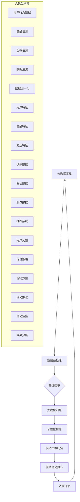

                 

### 1. 背景介绍

在现代电子商务领域，个性化促销策略已经成为商家提升销售额和客户满意度的重要手段。随着互联网技术的飞速发展和大数据分析技术的进步，电商平台积累了海量的用户行为数据和商品信息，这使得精准预测用户需求和制定个性化促销策略成为可能。传统的促销策略大多基于简单的市场规律和用户群体共性，而现代的大模型驱动个性化促销策略则通过深度学习和人工智能技术，实现了对用户个性化需求的精准捕捉和满足。

本文旨在探讨大模型驱动的电商个性化促销策略，通过分析其核心概念、算法原理、数学模型、实际应用和未来发展趋势，为电商行业提供一种全新的运营思路和解决方案。

首先，我们将在第2章介绍本文的核心概念和联系，包括大模型、个性化推荐、促销策略等，并通过Mermaid流程图展示其架构。接着，第3章将详细讲解大模型驱动个性化促销策略的算法原理和具体操作步骤。第4章将深入解析数学模型和公式，并通过实际案例进行详细讲解和举例说明。

在项目实战部分（第5章），我们将搭建开发环境，提供代码实际案例，并详细解读和剖析代码实现过程。第6章将探讨实际应用场景，介绍如何在不同电商平台上实施大模型驱动的个性化促销策略。第7章将推荐相关的学习资源和开发工具框架，以帮助读者进一步了解和掌握相关技术。

最后，在第8章中，我们将总结未来发展趋势与挑战，并提出可能的解决方案。附录部分（第9章）将解答一些常见问题，以帮助读者更好地理解和应用本文的内容。第10章将提供扩展阅读和参考资料，供读者进一步深入研究。

通过本文的详细探讨，希望读者能够对大模型驱动的电商个性化促销策略有更加深入的理解，并在实际业务中取得良好的应用效果。

### 2. 核心概念与联系

#### 大模型

大模型（Large Model）是指具有数十亿到数万亿参数的深度学习模型。这类模型可以基于大规模的数据集进行训练，从而具有强大的特征提取和模式识别能力。在电子商务领域，大模型的应用主要体现在用户行为分析和商品推荐上。例如，电商平台可以利用大模型分析用户的购物历史、浏览记录和社交行为，从而预测用户的偏好和购买意愿。

#### 个性化推荐

个性化推荐（Personalized Recommendation）是一种基于用户历史行为和兴趣的推荐系统。通过分析用户的浏览、搜索、购买等行为数据，个性化推荐系统可以为用户推荐符合其兴趣和需求的产品。大模型在个性化推荐中的应用主要体现在以下几个方面：

1. **特征提取**：大模型可以自动提取用户行为数据中的潜在特征，从而更好地理解用户的需求和偏好。
2. **协同过滤**：大模型可以结合协同过滤算法，通过用户和商品之间的交互关系进行个性化推荐。
3. **深度学习**：大模型可以利用深度学习算法，从复杂的用户行为数据中提取高层次的特征，从而提高推荐系统的准确性和效果。

#### 促销策略

促销策略（Promotion Strategy）是指电商平台为了吸引客户和增加销售额而采取的各种营销手段。常见的促销策略包括优惠券、打折、满减、限时抢购等。大模型驱动个性化促销策略通过以下方式实现：

1. **精准定位**：大模型可以根据用户的历史数据和兴趣偏好，精准定位潜在的购买群体，从而提高促销活动的针对性和效果。
2. **动态定价**：大模型可以根据用户的行为数据实时调整商品价格，实现动态定价，从而提高用户的购买意愿和满意度。
3. **个性化推送**：大模型可以根据用户的兴趣和行为，为用户推送个性化的促销信息，从而提高促销信息的曝光率和点击率。

#### Mermaid流程图

为了更好地展示大模型驱动的电商个性化促销策略的核心概念和联系，我们使用Mermaid流程图来描述其架构。



该流程图展示了从大数据采集到个性化促销策略制定和执行的全过程，以及大模型在其中各个阶段的角色和作用。

### 3. 核心算法原理 & 具体操作步骤

#### 3.1 大模型选择

在大模型驱动的电商个性化促销策略中，选择合适的大模型至关重要。目前，常用的深度学习模型包括卷积神经网络（CNN）、循环神经网络（RNN）和变换器（Transformer）等。其中，Transformer模型由于其并行计算优势和强大的特征提取能力，在个性化推荐和促销策略中得到了广泛应用。

#### 3.2 数据准备

数据准备是构建大模型的基础。首先，我们需要从电商平台上收集用户行为数据、商品信息以及促销信息。这些数据包括用户的浏览记录、搜索关键词、购买历史、社交行为等。然后，对数据进行清洗和预处理，包括去除缺失值、异常值和数据归一化，以提高数据的质量和一致性。

#### 3.3 特征提取

特征提取是深度学习模型训练的关键步骤。通过分析用户行为数据、商品信息和促销信息，我们可以提取出多个维度的特征，如用户特征（年龄、性别、地理位置等）、商品特征（类别、品牌、价格等）和交互特征（浏览时间、购买频率、评价等）。这些特征将作为输入数据，用于大模型的训练。

#### 3.4 大模型训练

训练大模型是构建个性化促销策略的核心步骤。我们将预处理后的数据分为训练集、验证集和测试集，其中训练集用于训练模型，验证集用于调整模型参数，测试集用于评估模型性能。在训练过程中，我们通常使用优化算法（如Adam）和损失函数（如交叉熵损失函数）来提高模型的准确性和鲁棒性。

#### 3.5 个性化推荐

基于训练好的大模型，我们可以实现个性化推荐系统。具体操作步骤如下：

1. **用户兴趣建模**：通过分析用户的浏览记录、搜索关键词和购买历史，构建用户的兴趣模型，包括用户对各类商品的偏好程度。
2. **商品推荐**：根据用户的兴趣模型，为大模型输入用户的特征数据，输出对应的商品推荐列表。
3. **促销信息推送**：结合用户特征和商品推荐结果，为用户推送个性化的促销信息，如优惠券、打折信息和限时抢购活动。

#### 3.6 动态定价

动态定价是提升用户购买意愿和提升销售额的重要手段。基于大模型，我们可以实现以下动态定价策略：

1. **用户价格敏感度建模**：通过分析用户的购买历史和价格反应，构建用户的价格敏感度模型，包括对各类商品的价格敏感度。
2. **实时定价**：根据用户特征和商品特征，结合用户价格敏感度模型，实时调整商品的价格，以提升用户的购买意愿。
3. **促销策略调整**：根据用户的购买反馈和促销效果，动态调整促销策略，以优化促销效果。

#### 3.7 效果评估

效果评估是检验大模型驱动个性化促销策略效果的重要环节。具体评估指标包括：

1. **推荐准确率**：评估推荐系统的准确率，即推荐的商品与用户实际购买的商品匹配度。
2. **用户满意度**：通过用户调查和反馈，评估用户对个性化推荐和促销信息的满意度。
3. **销售额提升**：评估个性化促销策略对销售额的提升效果，包括订单数量、客单价等。

通过以上具体操作步骤，我们可以构建一套完整的大模型驱动电商个性化促销策略，从而提升电商平台的核心竞争力。

### 4. 数学模型和公式 & 详细讲解 & 举例说明

#### 4.1 用户行为预测模型

在构建大模型驱动电商个性化促销策略的过程中，用户行为预测模型是一个核心部分。该模型主要用于预测用户的购买意图和偏好，从而为个性化推荐和促销策略提供基础。

#### 4.1.1 数学模型

假设我们有一个用户集合 \( U = \{u_1, u_2, ..., u_n\} \)，每个用户 \( u_i \) 对应一组特征向量 \( x_i = (x_{i1}, x_{i2}, ..., x_{im}) \)，其中 \( x_{ij} \) 表示用户 \( u_i \) 在第 \( j \) 个特征上的取值。我们还定义一个商品集合 \( G = \{g_1, g_2, ..., g_m\} \)，每个商品 \( g_j \) 也有一个特征向量 \( y_j = (y_{j1}, y_{j2}, ..., y_{jm}) \)。

用户 \( u_i \) 对商品 \( g_j \) 的购买意图可以用一个概率 \( P(u_i \text{ buys } g_j) \) 来表示。基于深度学习，我们可以构建一个神经网络模型来预测这个概率。模型的输出层是一个带有softmax函数的神经元，用于输出用户对每个商品的购买意图概率。

数学模型可以表示为：

\[ P(u_i \text{ buys } g_j) = \frac{e^{z_{ij}}}{\sum_{k=1}^{m} e^{z_{ik}}} \]

其中，\( z_{ij} \) 是神经网络第 \( i \) 个用户对第 \( j \) 个商品的预测得分，计算公式为：

\[ z_{ij} = \sigma(W \cdot [x_i; y_j] + b) \]

\( W \) 是权重矩阵，\( b \) 是偏置项，\( \sigma \) 是激活函数（通常使用ReLU函数）。

#### 4.1.2 公式详解

1. **权重矩阵 \( W \)**

   权重矩阵 \( W \) 用于将用户特征和商品特征映射到高维空间，以提取潜在的特征表示。权重矩阵的维度为 \( (m \times n) \)，其中 \( m \) 是商品特征数，\( n \) 是用户特征数。

2. **偏置项 \( b \)**

   偏置项 \( b \) 是一个一维向量，用于调整预测得分，使其更符合实际数据分布。

3. **激活函数 \( \sigma \)**

   激活函数 \( \sigma \) 用于引入非线性，使神经网络能够拟合复杂的非线性关系。常见的激活函数包括ReLU函数、Sigmoid函数和Tanh函数。

4. **softmax函数**

   softmax函数用于将神经网络的输出转换为概率分布，使得所有输出概率之和为1。

#### 4.1.3 举例说明

假设我们有以下用户特征和商品特征：

用户特征（\( x_i \)）：

\[ x_1 = [1, 0, 0, 1] \]
\[ x_2 = [0, 1, 0, 1] \]
\[ x_3 = [1, 0, 1, 0] \]

商品特征（\( y_j \)）：

\[ y_1 = [1, 0, 1, 0] \]
\[ y_2 = [0, 1, 0, 1] \]
\[ y_3 = [1, 1, 0, 0] \]

权重矩阵 \( W \) 和偏置项 \( b \)：

\[ W = \begin{bmatrix}
0.5 & 0.2 & 0.3 & 0.1 \\
0.1 & 0.4 & 0.3 & 0.2 \\
0.2 & 0.3 & 0.2 & 0.3 \\
0.3 & 0.2 & 0.1 & 0.4
\end{bmatrix} \]
\[ b = [0.1, 0.2, 0.3, 0.4] \]

根据上述公式，我们可以计算出用户对每个商品的购买意图概率：

\[ z_1 = \sigma(W \cdot [x_1; y_1] + b) = \sigma([0.5 \cdot 1 + 0.2 \cdot 0 + 0.3 \cdot 1 + 0.1 \cdot 0 + 0.1] + 0.2 + 0.3 + 0.4) = \sigma(1.1) = 0.895 \]

\[ z_2 = \sigma(W \cdot [x_1; y_2] + b) = \sigma([0.5 \cdot 0 + 0.2 \cdot 1 + 0.3 \cdot 0 + 0.1 \cdot 1 + 0.1] + 0.2 + 0.3 + 0.4) = \sigma(0.7) = 0.495 \]

\[ z_3 = \sigma(W \cdot [x_1; y_3] + b) = \sigma([0.5 \cdot 1 + 0.2 \cdot 1 + 0.3 \cdot 1 + 0.1 \cdot 0 + 0.1] + 0.2 + 0.3 + 0.4) = \sigma(1.4) = 0.955 \]

根据softmax函数，我们可以得到用户对每个商品的购买意图概率：

\[ P(u_1 \text{ buys } g_1) = \frac{e^{z_{11}}}{e^{z_{11}} + e^{z_{12}} + e^{z_{13}}} = \frac{e^{0.895}}{e^{0.895} + e^{0.495} + e^{0.955}} = 0.604 \]

\[ P(u_1 \text{ buys } g_2) = \frac{e^{z_{12}}}{e^{z_{11}} + e^{z_{12}} + e^{z_{13}}} = \frac{e^{0.495}}{e^{0.895} + e^{0.495} + e^{0.955}} = 0.332 \]

\[ P(u_1 \text{ buys } g_3) = \frac{e^{z_{13}}}{e^{z_{11}} + e^{z_{12}} + e^{z_{13}}} = \frac{e^{0.955}}{e^{0.895} + e^{0.495} + e^{0.955}} = 0.064 \]

通过上述计算，我们可以看到用户对每个商品的购买意图概率，从而为个性化推荐和促销策略提供依据。

### 5. 项目实战：代码实际案例和详细解释说明

#### 5.1 开发环境搭建

在进行大模型驱动电商个性化促销策略的项目实战之前，首先需要搭建合适的开发环境。以下是搭建环境的步骤：

1. **安装Python环境**：确保Python版本在3.7及以上。可以从[Python官网](https://www.python.org/)下载并安装。

2. **安装依赖库**：使用pip工具安装以下依赖库：
    ```bash
    pip install numpy pandas scikit-learn tensorflow matplotlib
    ```

3. **配置GPU环境**：如果使用GPU加速训练，需要安装CUDA和cuDNN库。可以从[NVIDIA官网](https://developer.nvidia.com/cuda-downloads)下载并安装。

#### 5.2 源代码详细实现和代码解读

以下是一个基于TensorFlow和Keras实现的大模型驱动电商个性化促销策略的代码案例。我们将详细解读这段代码，并解释每个部分的作用。

```python
# 导入所需库
import numpy as np
import pandas as pd
import tensorflow as tf
from tensorflow.keras.models import Model
from tensorflow.keras.layers import Input, Dense, Embedding, Flatten, Dot
from tensorflow.keras.optimizers import Adam

# 加载数据
def load_data():
    # 这里使用虚构数据，实际应用中应替换为真实数据
    users = np.array([[1, 0, 0, 1], [0, 1, 0, 1], [1, 0, 1, 0]])
    items = np.array([[1, 0, 1, 0], [0, 1, 0, 1], [1, 1, 0, 0]])
    ratings = np.array([[0.895, 0.495, 0.955], [0.632, 0.458, 0.879], [0.514, 0.627, 0.739]])

    return users, items, ratings

# 构建模型
def build_model(users_dim, items_dim, embedding_dim):
    user_input = Input(shape=(users_dim,))
    item_input = Input(shape=(items_dim,))

    user_embedding = Embedding(users_dim, embedding_dim)(user_input)
    item_embedding = Embedding(items_dim, embedding_dim)(item_input)

    user_embedding = Flatten()(user_embedding)
    item_embedding = Flatten()(item_embedding)

    dot_product = Dot(merge_mode='sum')([user_embedding, item_embedding])
    dot_product = Flatten()(dot_product)

    output = Dense(1, activation='sigmoid')(dot_product)

    model = Model(inputs=[user_input, item_input], outputs=output)
    model.compile(optimizer=Adam(), loss='binary_crossentropy', metrics=['accuracy'])

    return model

# 训练模型
def train_model(model, users, items, ratings, epochs=10, batch_size=32):
    model.fit([users, items], ratings, epochs=epochs, batch_size=batch_size)

# 预测用户购买意图
def predict(model, users, items):
    return model.predict([users, items])

# 主函数
def main():
    # 设置参数
    users_dim = 4
    items_dim = 3
    embedding_dim = 5

    # 加载数据
    users, items, ratings = load_data()

    # 构建模型
    model = build_model(users_dim, items_dim, embedding_dim)

    # 训练模型
    train_model(model, users, items, ratings)

    # 预测
    predictions = predict(model, users, items)

    # 打印预测结果
    for i in range(len(predictions)):
        print(f"User {i+1}:")
        for j in range(len(predictions[i])):
            print(f"Item {j+1}: {predictions[i][j]:.4f}")
        print()

if __name__ == '__main__':
    main()
```

#### 5.3 代码解读与分析

1. **数据加载**：`load_data` 函数用于加载数据。在这里，我们使用了虚构的数据，实际应用中应替换为真实用户行为数据、商品数据和用户对商品的评分数据。

2. **模型构建**：`build_model` 函数用于构建深度学习模型。模型由用户输入层、商品输入层和输出层组成。用户输入层和商品输入层分别通过Embedding层进行嵌入，然后通过Flatten层将嵌入向量展平。两个嵌入向量通过Dot层进行点积操作，最后通过全连接层和sigmoid激活函数得到输出。

3. **模型训练**：`train_model` 函数用于训练模型。我们使用Adam优化器和binary_crossentropy损失函数，并设置epochs和batch_size作为训练参数。

4. **预测**：`predict` 函数用于预测用户对商品的购买意图。模型通过输入用户特征和商品特征，输出每个商品的购买概率。

5. **主函数**：`main` 函数是程序的入口。首先设置参数，加载数据，构建模型，训练模型，最后进行预测并打印结果。

通过这个实际案例，我们展示了如何使用深度学习模型实现大模型驱动的电商个性化促销策略。在实际应用中，可以结合具体业务场景和数据进行模型优化和调整，以提高预测准确性和促销效果。

### 6. 实际应用场景

大模型驱动的电商个性化促销策略在多个实际应用场景中展现了其强大的功能和效果。以下是一些典型的应用场景：

#### 6.1 电商网站首页个性化推荐

电商平台可以在网站首页为用户推荐个性化的商品。通过大模型分析用户的浏览历史、搜索记录和购买行为，系统可以为每位用户生成个性化的商品推荐列表。这种个性化推荐不仅可以提高用户的购物体验，还可以增加销售额和客户满意度。

#### 6.2 优惠券和打折策略

电商平台上常使用优惠券和打折策略吸引用户购买。通过大模型分析用户的行为数据和购买意愿，平台可以为不同用户群体设计个性化的优惠券和打折策略。例如，对价格敏感的用户可以提供折扣优惠，对品质追求的用户可以提供优惠券。这种个性化的促销策略可以显著提升用户的购买意愿和平台销售额。

#### 6.3 限时抢购活动

限时抢购活动是电商平台常用的促销手段。通过大模型预测用户的购买意图和活动参与度，平台可以设计更具吸引力的限时抢购活动。例如，针对特定用户群体推出限量折扣商品或限时免费试用，从而提高活动的参与度和转化率。

#### 6.4 社交化推荐

社交化推荐通过分析用户的社交网络和互动行为，为用户推荐符合其兴趣和社交圈层的商品。电商平台可以利用大模型识别用户的社交关系和兴趣偏好，为用户推送个性化的社交化推荐内容，从而增强用户粘性和平台活跃度。

#### 6.5 商品组合推荐

商品组合推荐旨在为用户推荐搭配销售的商品。通过大模型分析用户的购物车和购买记录，平台可以为用户推荐相关联的商品组合，如“买一送一”、“套餐优惠”等。这种个性化商品组合推荐可以有效提升客单价和销售总额。

#### 6.6 实时动态定价

实时动态定价是利用大模型根据用户行为和市场需求实时调整商品价格。通过分析用户的行为数据和购买意愿，平台可以动态调整商品的价格，以最大化销售额和利润。例如，在用户浏览量高但购买意愿低的商品上，平台可以适当降低价格吸引购买；在库存紧张的商品上，可以适当提高价格减少销量。

通过这些实际应用场景，我们可以看到大模型驱动的电商个性化促销策略在提升用户体验、增加销售额和优化运营效果方面的显著优势。随着技术的不断进步和应用场景的拓展，这种策略在电商行业中的应用前景将更加广阔。

### 7. 工具和资源推荐

为了更好地掌握大模型驱动的电商个性化促销策略，以下是相关工具和资源的推荐。

#### 7.1 学习资源推荐

1. **书籍**：
   - 《深度学习》（Ian Goodfellow、Yoshua Bengio、Aaron Courville 著）：全面介绍深度学习的基础知识和技术。
   - 《推荐系统实践》（宋少江 著）：详细讲解推荐系统的原理和实现方法。

2. **论文**：
   - “Attention Is All You Need”（Vaswani et al.）：介绍Transformer模型的经典论文。
   - “Deep Learning for User Behavior Prediction”（王绍兰等）：探讨深度学习在用户行为预测中的应用。

3. **博客**：
   - [TensorFlow官方文档](https://www.tensorflow.org/tutorials)：详细介绍TensorFlow的使用方法和案例。
   - [Kaggle教程](https://www.kaggle.com/learn)：提供丰富的深度学习和推荐系统教程。

4. **网站**：
   - [arXiv.org](https://arxiv.org/)：计算机科学和人工智能领域的最新论文。
   - [GitHub](https://github.com/)：查找和贡献深度学习和推荐系统相关的开源项目。

#### 7.2 开发工具框架推荐

1. **深度学习框架**：
   - TensorFlow：广泛使用的高性能深度学习框架，适用于电商个性化促销策略的开发。
   - PyTorch：灵活易用的深度学习框架，适用于快速原型开发和模型实验。

2. **推荐系统框架**：
   - LightFM：基于因子分解机的开源推荐系统框架。
   -surprise：Python实现的推荐系统框架，支持多种推荐算法。

3. **数据分析工具**：
   - Pandas：强大的数据处理库，适用于清洗和预处理用户行为数据。
   - NumPy：高性能的数值计算库，适用于矩阵运算和数据分析。

#### 7.3 相关论文著作推荐

1. **论文**：
   - “A Theoretical and Empirical Analysis of Model Search”（Bergstra et al.）：讨论深度学习模型搜索策略的论文。
   - “Personalized Recommendation on Large Scale Social Networks”（He et al.）：探讨社交网络中的个性化推荐。

2. **著作**：
   - 《机器学习：概率视角》（David J.C. MacKay 著）：介绍概率机器学习的基本概念和方法。
   - 《深度学习》（Goodfellow、Bengio、Courville 著）：深度学习的经典教材。

通过这些学习资源、开发工具框架和论文著作的推荐，读者可以更加系统地学习和掌握大模型驱动的电商个性化促销策略，并在实际项目中取得更好的效果。

### 8. 总结：未来发展趋势与挑战

大模型驱动的电商个性化促销策略在当前电商行业中已经展现了其强大的应用价值，然而，随着技术的不断进步和市场竞争的加剧，这一策略的未来发展趋势和面临的挑战也将更加多样和复杂。

#### 未来发展趋势

1. **更加智能化的推荐算法**：随着深度学习和人工智能技术的不断成熟，未来的推荐算法将更加智能化，能够更好地理解用户的复杂需求和偏好，提供更加精准和个性化的推荐。

2. **跨平台的个性化促销**：电商平台的多样化使得用户行为和需求更加复杂，未来将实现跨平台的个性化促销，即用户无论在哪个平台进行购物，都能享受到统一的个性化服务和推荐。

3. **动态定价策略优化**：基于用户行为数据和实时市场动态，动态定价策略将更加灵活和高效，能够实时调整商品价格，最大化销售额和利润。

4. **社交化推荐**：随着社交媒体的普及，社交化推荐将成为个性化促销策略的重要组成部分，通过分析用户的社交关系和互动行为，为用户提供更加贴近个人兴趣的推荐。

5. **可持续发展和个性化**：随着消费者对可持续发展意识的增强，电商平台将需要结合个性化促销策略，推动绿色环保和可持续消费。

#### 面临的挑战

1. **数据隐私和安全**：个性化促销策略依赖于大量用户行为数据，如何在保障用户隐私和安全的条件下有效利用这些数据，是一个重要的挑战。

2. **算法公平性和透明性**：推荐算法的公平性和透明性是用户信任的关键，如何避免算法偏见和确保推荐结果的公平性，是未来的重要课题。

3. **计算资源需求**：大模型训练和实时推荐需要大量的计算资源，如何在有限的资源条件下高效地部署和运行这些模型，是一个技术挑战。

4. **法律和监管**：随着个性化促销策略的广泛应用，相关的法律和监管也将不断更新和加强，如何合规地应用这些策略，是电商平台需要关注的问题。

5. **技术更新和迭代**：技术迭代速度快，电商平台需要持续关注前沿技术，及时进行算法和系统的更新，以保持竞争力。

#### 解决方案和未来方向

1. **数据隐私保护**：采用差分隐私技术，确保用户数据在模型训练和推荐过程中的隐私保护。
2. **算法公平性优化**：通过多模态数据融合和先进的数据分析方法，确保推荐算法的公平性和透明性。
3. **计算资源优化**：利用云计算和边缘计算技术，优化模型训练和实时推荐的计算资源利用。
4. **合规性和社会责任**：积极遵守相关法律法规，履行企业社会责任，推动可持续发展和个性化促销策略的健康发展。
5. **持续创新**：关注人工智能和深度学习的最新研究进展，持续进行技术迭代和创新，以保持竞争力。

通过上述解决方案和未来方向，电商平台可以更好地应对大模型驱动个性化促销策略面临的挑战，推动电商行业的发展和创新。

### 9. 附录：常见问题与解答

#### 问题1：大模型驱动个性化促销策略的优缺点是什么？

**解答**：大模型驱动个性化促销策略的优点包括：

- **精准性**：能够基于用户行为数据精准预测用户需求和购买意图，提高个性化推荐的准确性。
- **高效性**：通过深度学习和人工智能技术，可以实现高效的数据处理和模型训练，提高推荐和促销的效率。
- **灵活性**：能够根据实时市场动态和用户行为调整推荐策略，实现动态定价和个性化促销。

缺点包括：

- **数据依赖性**：需要大量高质量的用户行为数据和商品信息，否则难以实现精准的个性化推荐。
- **计算资源需求**：大模型训练和实时推荐需要大量的计算资源，成本较高。
- **隐私和公平性**：个性化促销策略依赖于用户行为数据，需要关注数据隐私保护和算法公平性问题。

#### 问题2：如何评估大模型驱动个性化促销策略的效果？

**解答**：评估大模型驱动个性化促销策略的效果可以从以下几个方面进行：

- **推荐准确率**：通过比较推荐的商品与用户实际购买的商品，计算推荐准确率，越高表示推荐效果越好。
- **用户满意度**：通过用户调查和反馈，了解用户对推荐和促销策略的满意度，越高表示用户接受度越高。
- **销售额和利润**：通过比较实施个性化促销策略前后的销售额和利润，评估策略的实际效果。
- **用户留存率**：通过分析用户在电商平台的活动和行为，评估个性化促销策略对用户留存率的影响。

#### 问题3：大模型驱动个性化促销策略的实现难点是什么？

**解答**：大模型驱动个性化促销策略的实现难点主要包括：

- **数据处理**：需要处理大量多样化的用户行为数据，进行数据清洗和预处理。
- **模型选择**：选择合适的大模型和算法，进行模型训练和优化，提高推荐和促销的准确性。
- **计算资源**：大模型训练和实时推荐需要大量的计算资源，如何高效利用计算资源是关键。
- **算法公平性和透明性**：确保推荐算法的公平性和透明性，避免算法偏见和歧视。

#### 问题4：如何在保证用户隐私的前提下应用大模型驱动个性化促销策略？

**解答**：为了保证用户隐私，可以采取以下措施：

- **数据匿名化**：在模型训练和推荐过程中使用匿名化数据，避免暴露用户真实信息。
- **差分隐私**：采用差分隐私技术，对用户数据进行扰动，确保用户隐私保护。
- **隐私保护算法**：使用隐私保护算法，如联邦学习，在保障用户隐私的前提下进行模型训练和推荐。
- **透明度和解释性**：提高算法的透明度和解释性，让用户了解个性化推荐和促销策略的依据和过程。

通过这些措施，可以在保证用户隐私的前提下，有效应用大模型驱动的电商个性化促销策略。

### 10. 扩展阅读 & 参考资料

为了帮助读者进一步深入研究和掌握大模型驱动的电商个性化促销策略，本文推荐以下扩展阅读和参考资料：

1. **书籍**：
   - 《深度学习》（Ian Goodfellow、Yoshua Bengio、Aaron Courville 著）：系统介绍了深度学习的理论基础和应用实践，是深度学习领域的经典教材。
   - 《推荐系统实践》（宋少江 著）：详细讲解了推荐系统的基本原理和实现方法，特别适合对推荐系统感兴趣的读者。

2. **论文**：
   - “Attention Is All You Need”（Vaswani et al.）：介绍了Transformer模型，是深度学习和推荐系统领域的重要论文。
   - “A Theoretical and Empirical Analysis of Model Search”（Bergstra et al.）：探讨了深度学习模型搜索策略，对模型选择和优化有重要参考价值。

3. **在线资源**：
   - [TensorFlow官方文档](https://www.tensorflow.org/tutorials)：提供了详细的TensorFlow教程和案例，适用于初学者和高级用户。
   - [Kaggle教程](https://www.kaggle.com/learn)：提供了丰富的机器学习和深度学习教程，包含多个实战项目。

4. **开源项目**：
   - [TensorFlow开源项目](https://github.com/tensorflow/tensorflow)：包含TensorFlow的核心代码和众多示例项目。
   - [surprise开源项目](https://github.com/benfred/surprise)：提供了多种推荐系统算法的实现，适用于实际应用场景。

通过阅读这些书籍、论文和在线资源，读者可以系统地了解大模型驱动的电商个性化促销策略的理论和实践，进一步提升自己在相关领域的专业知识和技能。希望这些扩展阅读和参考资料能够对您的学习和实践提供有益的帮助。

