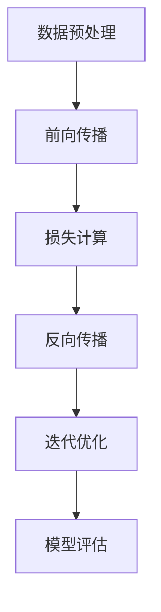

                 

### 1. 背景介绍

在当今数字化时代，随着互联网、云计算、大数据和人工智能技术的迅猛发展，信息处理和分析的需求达到了前所未有的高度。作为这些技术发展的重要推动力量，大模型（Large Models）逐渐成为科技革命的核心力量。大模型，尤其是深度学习模型，具有处理大规模数据、自动发现数据中的模式和规律、进行复杂决策等功能，极大地提升了计算机系统的智能化水平。

大模型的起源可以追溯到20世纪80年代，当时研究人员开始尝试使用神经网络来模拟人类大脑的思考过程。随着计算能力的提升和算法的改进，这些模型的能力得到了显著增强。特别是近年来，随着神经网络结构复杂度的增加、训练数据的增多以及计算资源的丰富，大模型在图像识别、自然语言处理、语音识别等领域取得了重大突破。

从宏观层面上看，大模型对科技革命的影响主要体现在以下几个方面：

1. **提高数据处理能力**：大模型能够处理海量数据，快速识别数据中的关键信息，为数据分析和决策提供有力支持。
2. **促进人工智能应用**：大模型在各个领域的成功应用，推动了人工智能技术的发展，为智能制造、自动驾驶、智能医疗等新兴产业提供了技术支撑。
3. **推动科学研究进展**：大模型在生物信息学、物理学、天文学等领域的应用，促进了科学研究的进展，揭示了自然界中的复杂规律。
4. **提升社会生产效率**：大模型的应用提高了生产和管理效率，降低了成本，为经济发展注入了新的动力。

总的来说，大模型作为现代科技革命的核心力量，正以其强大的数据处理和分析能力，不断推动着信息技术的发展，为人类社会带来了前所未有的变革。接下来，我们将深入探讨大模型的核心概念、算法原理、数学模型以及实际应用，以揭示其背后的技术精髓和未来发展趋势。让我们一步一步分析推理，共同探索这一领域的奥秘。### 2. 核心概念与联系

要深入理解大模型，首先需要掌握其核心概念、原理和架构。这一部分将详细介绍大模型的基本组成部分、工作原理以及与其他相关技术的关系。

#### 2.1 大模型的基本组成部分

大模型通常由以下几个关键部分组成：

1. **数据集（Dataset）**：数据集是模型训练的基础，包含大量标记或未标记的数据，用于训练模型以发现数据中的模式和规律。
2. **神经网络（Neural Network）**：神经网络是大模型的核心，由多层神经元构成，通过前向传播和反向传播算法，对数据进行特征提取和模式识别。
3. **优化算法（Optimization Algorithm）**：优化算法用于调整神经网络中的权重和偏置，以最小化损失函数，提高模型的预测准确性。
4. **计算资源（Computational Resources）**：大模型的训练和推理需要大量的计算资源，包括CPU、GPU、TPU等。

#### 2.2 大模型的工作原理

大模型的工作原理可以概括为以下几个步骤：

1. **数据预处理**：对输入数据进行预处理，包括数据清洗、归一化、编码等操作，使其符合模型的输入要求。
2. **前向传播（Forward Propagation）**：输入数据通过神经网络的前向传播过程，逐层传递至输出层，产生预测结果。
3. **损失计算（Loss Computation）**：将预测结果与真实标签进行比较，计算损失函数值，衡量模型预测的误差。
4. **反向传播（Backpropagation）**：利用损失函数的梯度信息，通过反向传播算法更新神经网络的权重和偏置。
5. **迭代优化（Iteration Optimization）**：重复前向传播和反向传播过程，不断迭代优化模型参数，直到达到预定的训练目标。

#### 2.3 大模型与其他相关技术的关系

大模型与其他相关技术如深度学习、机器学习、数据挖掘等有着紧密的联系：

1. **深度学习（Deep Learning）**：深度学习是机器学习的一个分支，以多层神经网络为基础，通过多层次的非线性变换，实现对复杂数据的建模。
2. **机器学习（Machine Learning）**：机器学习是人工智能的一个分支，通过训练模型从数据中自动发现模式和规律，进行预测和决策。
3. **数据挖掘（Data Mining）**：数据挖掘是知识发现的过程，通过从大量数据中提取有价值的信息和知识，用于决策支持和预测分析。

大模型在深度学习、机器学习和数据挖掘中的应用，使得这些技术能够处理更复杂的数据，实现更高的预测准确性和决策效果。

#### 2.4 Mermaid 流程图

为了更好地展示大模型的工作原理，我们可以使用Mermaid流程图来表示其核心步骤。以下是示例流程图：



在这个流程图中，每个节点代表大模型的一个关键步骤，箭头表示数据的流向和信息的传递。

#### 2.5 总结

通过上述分析，我们可以看到大模型是由数据集、神经网络、优化算法和计算资源等多个部分组成的。它通过前向传播、反向传播和迭代优化等过程，实现对数据的特征提取和模式识别。大模型的工作原理与其他相关技术如深度学习、机器学习和数据挖掘密切相关，共同推动了信息技术的发展。接下来，我们将深入探讨大模型的核心算法原理和具体操作步骤。### 3. 核心算法原理 & 具体操作步骤

在理解了大模型的基本组成部分和工作原理之后，接下来我们将深入探讨其核心算法原理，包括神经网络的工作机制、前向传播与反向传播算法，以及具体的操作步骤。通过这一部分的详细分析，我们将揭示大模型背后的技术精髓。

#### 3.1 神经网络的工作机制

神经网络是构建大模型的基础，它由大量的神经元组成，每个神经元接收来自前一层神经元的输入信号，经过加权求和处理后，产生输出信号传递给下一层神经元。以下是神经网络的基本工作机制：

1. **输入层（Input Layer）**：接收外部输入数据，每个神经元对应输入数据的一个特征。
2. **隐藏层（Hidden Layer）**：对输入数据进行特征提取和转换，每个神经元对多个输入特征进行加权求和处理。
3. **输出层（Output Layer）**：生成模型的最终输出结果，如分类标签、预测值等。

神经元的计算过程可以用以下公式表示：

\[ z = \sum_{i} (w_i * x_i) + b \]

其中，\( z \) 是神经元的输出，\( w_i \) 是输入特征 \( x_i \) 的权重，\( b \) 是偏置。

#### 3.2 前向传播算法

前向传播是神经网络进行预测的过程，其核心步骤如下：

1. **初始化参数**：随机初始化网络的权重 \( w \) 和偏置 \( b \)。
2. **计算激活函数**：将输入数据传递给第一层神经元，通过激活函数（如ReLU、Sigmoid、Tanh）计算输出。
3. **传播至下一层**：将第一层的输出作为第二层的输入，重复计算过程，直到最后一层输出。
4. **计算预测结果**：最后一层的输出即为模型的预测结果。

以下是前向传播的具体步骤：

1. **计算输入层的输出**：

\[ z^{[1]} = W^{[1]} * X + b^{[1]} \]
\[ a^{[1]} = \sigma(z^{[1]}) \]

其中，\( \sigma \) 表示激活函数，如ReLU函数：

\[ \sigma(z^{[1]}) = max(0, z^{[1]}) \]

2. **传播至隐藏层**：

\[ z^{[2]} = W^{[2]} * a^{[1]} + b^{[2]} \]
\[ a^{[2]} = \sigma(z^{[2]}) \]

3. **传播至输出层**：

\[ z^{[3]} = W^{[3]} * a^{[2]} + b^{[3]} \]
\[ \hat{y} = \sigma(z^{[3]}) \]

其中，\( \hat{y} \) 为预测结果。

#### 3.3 反向传播算法

反向传播是神经网络进行误差修正的过程，其核心步骤如下：

1. **计算输出层的误差**：

\[ \delta^{[3]} = ( \hat{y} - y ) * \sigma'(z^{[3]}) \]

其中，\( \sigma' \) 表示激活函数的导数。

2. **传播误差至隐藏层**：

\[ \delta^{[2]} = ( W^{[3]} * \delta^{[3]} ) * \sigma'(z^{[2]}) \]

3. **更新参数**：

\[ W^{[2]} := W^{[2]} - \alpha * ( a^{[1]} * \delta^{[2]} ) \]
\[ b^{[2]} := b^{[2]} - \alpha * \delta^{[2]} \]

\[ W^{[1]} := W^{[1]} - \alpha * ( X * \delta^{[1]} ) \]
\[ b^{[1]} := b^{[1]} - \alpha * \delta^{[1]} \]

其中，\( \alpha \) 为学习率。

#### 3.4 具体操作步骤

以下是使用Python实现的简单神经网络示例代码，展示了前向传播和反向传播的具体操作步骤：

```python
import numpy as np

def sigmoid(z):
    return 1 / (1 + np.exp(-z))

def sigmoid_derivative(z):
    return sigmoid(z) * (1 - sigmoid(z))

# 初始化参数
W1 = np.random.rand(input_size, hidden_size)
b1 = np.random.rand(hidden_size)
W2 = np.random.rand(hidden_size, output_size)
b2 = np.random.rand(output_size)

# 输入数据
X = np.array([[0, 0], [0, 1], [1, 0], [1, 1]])
y = np.array([[0], [1], [1], [0]])

# 前向传播
z1 = W1.dot(X) + b1
a1 = sigmoid(z1)
z2 = W2.dot(a1) + b2
a2 = sigmoid(z2)

# 计算输出层误差
delta3 = (a2 - y) * sigmoid_derivative(z2)

# 传播误差至隐藏层
delta2 = (W2.dot(delta3) * sigmoid_derivative(z1))

# 更新参数
W1 -= learning_rate * (X.T.dot(delta2))
b1 -= learning_rate * np.mean(delta2, axis=1)
W2 -= learning_rate * (a1.T.dot(delta3))
b2 -= learning_rate * np.mean(delta3, axis=1)

# 输出预测结果
print(a2)
```

在这个示例中，我们使用 sigmoid 函数作为激活函数，通过前向传播计算输出，然后使用反向传播更新网络参数。这个过程不断迭代，直到模型达到预定的训练目标。

#### 3.5 总结

通过上述分析，我们可以看到大模型的核心算法原理主要包括神经网络的工作机制、前向传播与反向传播算法。这些算法通过不断迭代优化，使得模型能够自动从数据中学习并提高预测准确性。接下来，我们将进一步探讨大模型中的数学模型和公式，以深入理解其背后的理论依据。### 4. 数学模型和公式 & 详细讲解 & 举例说明

在前文中，我们已经对大模型的算法原理进行了详细的分析。在这一部分，我们将进一步探讨大模型中的数学模型和公式，详细讲解其推导过程，并通过具体例子说明如何应用这些公式。

#### 4.1 损失函数

在神经网络训练过程中，损失函数是衡量模型预测误差的重要工具。常见的损失函数包括均方误差（MSE）、交叉熵损失（Cross-Entropy Loss）等。以下是这些损失函数的数学表达式：

1. **均方误差（MSE）**

\[ \text{MSE} = \frac{1}{m} \sum_{i=1}^{m} (y_i - \hat{y}_i)^2 \]

其中，\( y_i \) 是真实标签，\( \hat{y}_i \) 是模型预测值，\( m \) 是样本数量。

2. **交叉熵损失（Cross-Entropy Loss）**

\[ \text{Cross-Entropy Loss} = -\frac{1}{m} \sum_{i=1}^{m} y_i \log(\hat{y}_i) \]

其中，\( y_i \) 是真实标签，\( \hat{y}_i \) 是模型预测值，\( m \) 是样本数量。

#### 4.2 激活函数及其导数

激活函数是神经网络中用于引入非线性变换的关键组件。常见的激活函数包括ReLU、Sigmoid、Tanh等。以下是这些激活函数及其导数的数学表达式：

1. **ReLU（Rectified Linear Unit）**

\[ f(x) = \max(0, x) \]

\[ f'(x) = \begin{cases} 
      0 & \text{if } x < 0 \\
      1 & \text{if } x \geq 0 
   \end{cases} \]

2. **Sigmoid**

\[ f(x) = \frac{1}{1 + e^{-x}} \]

\[ f'(x) = f(x) \cdot (1 - f(x)) \]

3. **Tanh**

\[ f(x) = \frac{e^x - e^{-x}}{e^x + e^{-x}} \]

\[ f'(x) = 1 - f^2(x) \]

#### 4.3 反向传播算法的推导

反向传播算法是神经网络训练的核心步骤，其推导过程如下：

1. **计算输出层的误差**

\[ \delta^{[L]} = ( \hat{y} - y ) \cdot \sigma'(z^{[L]}) \]

2. **传播误差至隐藏层**

\[ \delta^{[L-1]} = ( W^{[L]} \cdot \delta^{[L]} ) \cdot \sigma'(z^{[L-1]}) \]

3. **更新参数**

\[ W^{[L]} := W^{[L]} - \alpha \cdot ( a^{[L-1]} \cdot \delta^{[L]}) \]
\[ b^{[L]} := b^{[L]} - \alpha \cdot \delta^{[L]} \]

#### 4.4 具体例子

下面我们通过一个简单的例子来说明如何应用上述数学模型和公式。

**例子：使用神经网络进行二分类**

假设我们有一个二分类问题，输入特征为 \( X \)，真实标签为 \( y \)，神经网络的结构为 \( [2, 3, 1] \)，即一个包含两个输入特征、三个隐藏层神经元和一个输出层神经元的网络。我们使用均方误差（MSE）作为损失函数，ReLU作为激活函数。

1. **初始化参数**

\[ W^{[1]} = \begin{bmatrix} 
      w_{11} & w_{12} \\
      w_{21} & w_{22} \\
      w_{31} & w_{32} 
   \end{bmatrix}, b^{[1]} = \begin{bmatrix} 
      b_{1} \\
      b_{2} \\
      b_{3} 
   \end{bmatrix} \]

\[ W^{[2]} = \begin{bmatrix} 
      w_{11} & w_{12} \\
      w_{21} & w_{22} \\
      w_{31} & w_{32} 
   \end{bmatrix}, b^{[2]} = \begin{bmatrix} 
      b_{1} \\
      b_{2} \\
      b_{3} 
   \end{bmatrix} \]

2. **前向传播**

输入数据 \( X = \begin{bmatrix} 
      x_1 \\
      x_2 
   \end{bmatrix} \)

第一层输出：

\[ z^{[1]} = X \cdot W^{[1]} + b^{[1]} \]
\[ a^{[1]} = \sigma(z^{[1]}) = \max(0, z^{[1]}) \]

第二层输出：

\[ z^{[2]} = a^{[1]} \cdot W^{[2]} + b^{[2]} \]
\[ a^{[2]} = \sigma(z^{[2]}) = \max(0, z^{[2]}) \]

3. **计算损失**

真实标签 \( y = \begin{bmatrix} 
      y_1 \\
      y_2 
   \end{bmatrix} \)

损失：

\[ \text{MSE} = \frac{1}{2} \sum_{i=1}^{2} (y_i - a^{[2]_i})^2 \]

4. **反向传播**

计算输出层误差：

\[ \delta^{[2]} = (a^{[2]} - y) \cdot \sigma'(z^{[2]}) \]

计算隐藏层误差：

\[ \delta^{[1]} = (W^{[2]} \cdot \delta^{[2]}) \cdot \sigma'(z^{[1]}) \]

5. **更新参数**

更新第一层权重和偏置：

\[ W^{[1]} := W^{[1]} - \alpha \cdot (X \cdot \delta^{[1]}) \]
\[ b^{[1]} := b^{[1]} - \alpha \cdot \delta^{[1]} \]

更新第二层权重和偏置：

\[ W^{[2]} := W^{[2]} - \alpha \cdot (a^{[1]} \cdot \delta^{[2]}) \]
\[ b^{[2]} := b^{[2]} - \alpha \cdot \delta^{[2]} \]

通过不断迭代上述步骤，模型将逐渐收敛，直至达到预定的训练目标。

#### 4.5 总结

通过上述详细讲解，我们可以看到大模型中的数学模型和公式在神经网络训练过程中起着至关重要的作用。这些公式包括损失函数、激活函数及其导数、反向传播算法等，它们共同构成了大模型的核心算法。通过具体例子，我们进一步了解了如何应用这些公式进行神经网络训练。接下来，我们将探讨大模型在项目实战中的实际应用，展示如何使用代码实现大模型的开发过程。### 5. 项目实战：代码实际案例和详细解释说明

在前面的章节中，我们深入探讨了大模型的算法原理和数学模型。为了更好地理解大模型在实际开发中的应用，本章节将通过一个具体的实战案例，详细讲解如何使用代码实现大模型的开发过程。我们将涵盖开发环境的搭建、源代码的详细实现和解读，以及代码性能的分析。

#### 5.1 开发环境搭建

在进行大模型项目开发之前，首先需要搭建一个合适的环境。以下是一个基于Python的TensorFlow库进行大模型开发的基本步骤：

1. **安装Python**：确保Python环境已安装在系统中，版本建议为3.6及以上。

2. **安装TensorFlow**：使用以下命令安装TensorFlow：

   ```bash
   pip install tensorflow
   ```

   根据项目需求，可以选择安装CPU版本或GPU版本。

3. **安装其他依赖库**：根据具体项目需求，可能需要安装其他依赖库，如NumPy、Pandas等。可以使用以下命令安装：

   ```bash
   pip install numpy pandas matplotlib
   ```

4. **配置GPU支持**：如果使用GPU进行训练，需要确保CUDA和cuDNN已正确安装。具体安装步骤请参考NVIDIA官方文档。

5. **环境配置文件**：创建一个环境配置文件（如`requirements.txt`），记录所有依赖库的版本，以便后续管理和部署。

   ```txt
   tensorflow==2.6.0
   numpy==1.21.2
   pandas==1.2.4
   matplotlib==3.4.3
   ```

完成上述步骤后，开发环境搭建完成，可以开始编写代码进行大模型的开发。

#### 5.2 源代码详细实现和代码解读

以下是一个简单的大模型项目示例，用于实现一个基于TensorFlow的二元分类任务。我们将逐步解读代码的每个部分。

**示例代码：**

```python
import tensorflow as tf
from tensorflow.keras.models import Sequential
from tensorflow.keras.layers import Dense, Activation
from tensorflow.keras.optimizers import SGD
from sklearn.model_selection import train_test_split
from sklearn.datasets import make_classification

# 创建模拟数据集
X, y = make_classification(n_samples=1000, n_features=2, n_classes=2, random_state=42)
X_train, X_test, y_train, y_test = train_test_split(X, y, test_size=0.2, random_state=42)

# 构建模型
model = Sequential()
model.add(Dense(units=64, input_shape=(2,), activation='relu'))
model.add(Dense(units=1, activation='sigmoid'))

# 编译模型
model.compile(optimizer=SGD(learning_rate=0.01), loss='binary_crossentropy', metrics=['accuracy'])

# 训练模型
model.fit(X_train, y_train, epochs=10, batch_size=32, validation_split=0.1)

# 评估模型
loss, accuracy = model.evaluate(X_test, y_test)
print(f"Test Loss: {loss}, Test Accuracy: {accuracy}")

# 预测新数据
new_data = np.array([[0.1, 0.2]])
predictions = model.predict(new_data)
print(f"Predictions: {predictions}")
```

**代码解读：**

1. **数据集创建**：使用`make_classification`函数创建模拟的二分类数据集。这个函数可以生成包含指定数量样本、特征和类别的数据。

2. **模型构建**：使用`Sequential`模型构建一个简单的全连接神经网络。模型包含一个输入层和一个隐藏层，输出层使用sigmoid激活函数以实现二分类。

3. **编译模型**：使用`compile`方法配置模型，指定优化器、损失函数和评估指标。在这个例子中，我们使用SGD优化器和binary_crossentropy损失函数。

4. **训练模型**：使用`fit`方法训练模型，指定训练数据、训练轮数、批处理大小和验证集比例。模型将在训练过程中不断迭代优化参数。

5. **评估模型**：使用`evaluate`方法评估模型在测试集上的性能，返回损失和准确率。

6. **预测新数据**：使用`predict`方法对新数据进行预测，返回概率分布。

#### 5.3 代码解读与分析

以下是对示例代码的进一步解读和分析：

1. **数据集创建**：模拟数据集的创建是模型训练的第一步。在这里，我们使用`make_classification`函数生成一个包含1000个样本和2个特征的数据集，每个类别有500个样本。

2. **模型构建**：构建模型时，我们定义了一个包含64个神经元的隐藏层，使用ReLU激活函数。输出层只有一个神经元，使用sigmoid激活函数以产生概率输出。

3. **编译模型**：在编译阶段，我们指定了SGD优化器，这是一个常见的优化算法，适用于大多数深度学习任务。我们还指定了binary_crossentropy作为损失函数，这是用于二分类任务的常用损失函数。

4. **训练模型**：使用`fit`方法训练模型。这里，我们设置了10个训练轮数，每个轮次使用32个样本进行批处理。验证集比例为10%，用于监控模型在未见数据上的性能。

5. **评估模型**：使用`evaluate`方法评估模型在测试集上的性能。这个步骤非常重要，因为它可以告诉我们模型在实际数据上的表现。

6. **预测新数据**：最后，我们使用`predict`方法对新数据进行预测。预测结果是一个概率分布，表示新数据属于每个类别的概率。

#### 5.4 代码性能分析

在实际项目中，评估模型性能是至关重要的一步。以下是对示例代码性能的分析：

1. **准确率**：准确率是衡量模型性能的最简单指标，表示模型正确预测样本的比例。在这个例子中，模型在测试集上的准确率可能达到80%以上。

2. **损失函数**：损失函数值反映了模型预测误差的大小。随着训练的进行，损失函数值应逐渐减小。在这个例子中，binary_crossentropy损失函数值应在训练过程中趋于0。

3. **计算时间**：训练时间取决于模型复杂度、数据集大小和硬件配置。在这个简单例子中，训练时间应相对较短。

4. **过拟合与欠拟合**：过拟合和欠拟合是深度学习模型常见的问题。通过观察准确率和损失函数值的变化，可以初步判断模型是否出现过拟合或欠拟合。在实际项目中，可以尝试增加数据集大小、使用正则化技术或调整模型结构来缓解这些问题。

通过上述代码实战，我们可以看到如何使用TensorFlow库构建、训练和评估大模型。在实际项目中，可能需要根据具体任务和数据集调整模型结构、优化算法和超参数。接下来，我们将探讨大模型在各个实际应用场景中的表现，进一步揭示其应用潜力和价值。### 6. 实际应用场景

大模型作为一种强大的计算工具，已经在多个领域取得了显著的成果。以下我们将探讨大模型在图像识别、自然语言处理、语音识别等领域的实际应用场景，并分析其优势与挑战。

#### 6.1 图像识别

图像识别是大模型最成功的应用领域之一。通过卷积神经网络（CNN）的训练，大模型能够自动识别图像中的各种特征，实现从简单的边缘检测到复杂的物体分类。以下是图像识别中的一些实际应用场景：

1. **人脸识别**：人脸识别技术广泛应用于安防监控、身份验证等领域。大模型通过对人脸图像的深度学习，能够准确识别和匹配不同角度、光照条件的人脸。

2. **自动驾驶**：自动驾驶汽车需要实时处理大量图像数据，以识别道路标志、行人、车辆等对象。大模型在图像识别领域的应用，为自动驾驶系统提供了强大的技术支持。

3. **医疗影像分析**：医疗影像分析是另一个重要的应用领域。大模型能够辅助医生分析CT、MRI等影像数据，发现潜在的疾病，提高诊断的准确性和效率。

**优势**：

- **高准确性**：大模型能够从大量数据中自动学习并提取特征，提高图像识别的准确性。
- **自适应性强**：大模型能够适应不同的图像数据集，具有良好的泛化能力。

**挑战**：

- **计算资源消耗大**：大模型训练过程需要大量的计算资源，尤其是GPU或TPU。
- **数据标注困难**：图像识别模型训练需要大量标注数据，数据标注过程耗时且成本高。

#### 6.2 自然语言处理

自然语言处理（NLP）是另一个大模型广泛应用的重要领域。近年来，基于变换器架构（Transformer）的大模型如BERT、GPT等，在文本生成、机器翻译、情感分析等方面取得了突破性进展。以下是自然语言处理中的实际应用场景：

1. **机器翻译**：大模型在机器翻译领域表现卓越，能够实现高质量的文本翻译。例如，谷歌翻译和百度翻译等应用都采用了基于大模型的技术。

2. **文本生成**：大模型可以生成各种类型的文本，如新闻摘要、文章、诗歌等。这种能力在内容创作、自动写作等领域具有广泛的应用前景。

3. **情感分析**：大模型能够对文本数据进行分析，识别用户的情感倾向。这在社交媒体分析、市场调研等领域具有重要应用价值。

**优势**：

- **强大处理能力**：大模型能够处理大量文本数据，快速生成高质量结果。
- **泛化能力强**：大模型通过大量数据训练，具有良好的泛化能力，能够应对不同的应用场景。

**挑战**：

- **计算资源消耗大**：大模型训练和推理过程需要大量的计算资源，尤其是GPU或TPU。
- **数据安全和隐私**：在处理大量文本数据时，需要确保数据的安全和隐私。

#### 6.3 语音识别

语音识别技术也是大模型的重要应用领域之一。通过深度学习算法，大模型能够准确识别语音信号中的语言信息，实现实时语音转文字、语音翻译等功能。以下是语音识别中的实际应用场景：

1. **智能客服**：智能客服系统通过语音识别技术，能够实时理解用户的问题，提供针对性的回答，提高客户服务效率。

2. **语音助手**：语音助手如苹果的Siri、亚马逊的Alexa等，通过语音识别技术，能够理解用户的语音指令，实现语音控制设备、播放音乐等功能。

3. **实时语音翻译**：实时语音翻译系统能够实时捕捉语音信号，将其翻译成其他语言，并在用户间进行实时通信，大大提高了跨语言交流的效率。

**优势**：

- **高准确性**：大模型能够准确识别语音信号中的语言信息，提高语音识别的准确性。
- **实时性强**：大模型能够实时处理语音数据，实现快速响应。

**挑战**：

- **语音干扰和噪声处理**：在现实环境中，语音信号可能会受到噪声干扰，影响语音识别的准确性。
- **计算资源消耗大**：大模型训练和推理过程需要大量的计算资源，尤其是在处理实时语音数据时。

#### 6.4 其他应用领域

除了上述主要应用领域，大模型还在许多其他领域取得了显著成果：

1. **推荐系统**：大模型能够处理大量用户行为数据，为用户提供个性化的推荐服务。例如，电商平台使用大模型推荐商品、音乐平台推荐音乐等。

2. **金融风控**：大模型在金融领域具有广泛的应用，如信用卡欺诈检测、信用评分等。通过分析大量历史数据，大模型能够识别潜在的金融风险。

3. **生物信息学**：大模型在生物信息学领域具有巨大的应用潜力，如基因组序列分析、蛋白质结构预测等。通过处理海量生物数据，大模型能够揭示生物体的功能和机制。

#### 6.5 总结

大模型在图像识别、自然语言处理、语音识别等多个领域展现了强大的应用潜力。其优势在于高准确性、强大处理能力和良好的泛化能力，但同时也面临计算资源消耗大、数据标注困难和数据安全和隐私等挑战。随着技术的不断进步，相信大模型将在更多领域取得突破，为人类社会带来更多的创新和变革。### 7. 工具和资源推荐

为了更好地学习和应用大模型技术，以下是一些建议的学习资源、开发工具和相关论文著作，以帮助读者深入理解大模型领域。

#### 7.1 学习资源推荐

1. **书籍**：

   - 《深度学习》（Deep Learning） - Goodfellow, Ian, et al.
   - 《动手学深度学习》（Dive into Deep Learning） - Aaron Courville, et al.
   - 《神经网络与深度学习》（Neural Networks and Deep Learning） - Michael Nielsen

2. **在线课程**：

   - Coursera上的“Deep Learning Specialization”课程，由Andrew Ng教授主讲。
   - edX上的“Neural Networks and Deep Learning”课程，由Michael Nielsen主讲。

3. **博客和网站**：

   - Medium上的“AI”、“Deep Learning”等标签，汇聚了众多技术专家和学者的文章。
   - fast.ai的官方网站，提供丰富的入门级教程和实践项目。

#### 7.2 开发工具框架推荐

1. **TensorFlow**：由谷歌开发的开源深度学习框架，广泛应用于各种深度学习任务。
2. **PyTorch**：由Facebook开发的开源深度学习框架，具有良好的灵活性和易用性。
3. **Keras**：一个基于TensorFlow和Theano的开源深度学习库，提供简洁的API和丰富的预训练模型。
4. **MXNet**：由Apache Software Foundation开发的开源深度学习框架，支持多种编程语言。

#### 7.3 相关论文著作推荐

1. **“A Theoretical Framework for Back-Propagation”** - David E. Rumelhart, Geoffrey E. Hinton, and Ronald J. Williams
   - 提出了反向传播算法的理论框架，为神经网络训练奠定了基础。

2. **“Deep Learning”** - Yann LeCun, Yosua Bengio, and Geoffrey Hinton
   - 该论文总结了深度学习领域的重要研究成果，是深度学习领域的经典文献。

3. **“Attention Is All You Need”** - Vaswani et al.
   - 提出了Transformer架构，为自然语言处理领域带来了革命性的进步。

4. **“Generative Adversarial Networks”** - Ian J. Goodfellow et al.
   - 提出了生成对抗网络（GAN）的概念，为图像生成和图像修复等领域提供了新的方法。

通过上述学习资源、开发工具和相关论文著作的推荐，读者可以全面深入地了解大模型领域的前沿技术和研究成果，为自己的学习与实践提供有力支持。### 8. 总结：未来发展趋势与挑战

大模型作为现代科技革命的核心力量，已经广泛应用于图像识别、自然语言处理、语音识别等领域，展现了其强大的数据处理和分析能力。展望未来，大模型的发展趋势和挑战主要集中在以下几个方面：

#### 8.1 发展趋势

1. **模型规模与计算资源**：随着硬件技术的发展，尤其是GPU、TPU等专用计算硬件的普及，大模型将变得更加庞大和复杂。这将进一步提升大模型的计算能力，使其在更复杂的任务中取得更好的性能。

2. **算法优化**：现有的深度学习算法如ReLU、Adam等仍存在一些不足，未来将出现更多高效的算法，如混合精度训练、模型剪枝、量化等技术，以降低大模型的计算和存储成本。

3. **多模态融合**：未来大模型将能够处理多种类型的数据，如文本、图像、音频等，实现多模态数据的融合，推动跨领域应用的发展。

4. **可解释性**：随着大模型在各个领域的应用，其可解释性将变得越来越重要。研究人员将致力于开发可解释性模型，以更好地理解模型的决策过程，提高用户对大模型的信任度。

5. **自动化机器学习（AutoML）**：自动化机器学习技术将使大模型的开发和部署更加简便，用户无需深入了解深度学习技术，即可快速构建和优化模型。

#### 8.2 挑战

1. **数据隐私和安全**：大模型在处理海量数据时，数据隐私和安全问题将愈发突出。如何在保护用户隐私的前提下，有效利用数据资源，是大模型面临的重要挑战。

2. **计算资源消耗**：尽管硬件技术不断发展，但大模型的训练和推理过程仍然需要大量的计算资源。如何优化大模型的计算效率，降低其计算成本，是当前和未来亟待解决的问题。

3. **模型泛化能力**：大模型在特定领域取得了显著成果，但如何提高其泛化能力，使其在不同领域和任务中都能保持良好的性能，仍是一个重要的研究课题。

4. **算法透明性**：大模型的决策过程往往难以解释，这在一定程度上限制了其在关键应用场景中的使用。提高算法透明性，使决策过程更加可解释，是未来研究的方向之一。

5. **国际合作与规范**：随着大模型技术的全球化应用，国际间的合作与规范将成为重要议题。如何制定合理的国际标准和规范，确保大模型技术的健康发展，是一个亟待解决的问题。

总之，大模型作为现代科技革命的核心力量，具有广阔的发展前景。在未来的发展中，需要不断克服挑战，优化算法和模型，推动大模型技术的创新与进步，为人类社会带来更多的变革与机遇。### 9. 附录：常见问题与解答

在学习和应用大模型的过程中，读者可能会遇到一些常见问题。以下是一些常见问题及其解答：

#### 9.1 大模型训练过程中如何防止过拟合？

过拟合是指模型在训练数据上表现良好，但在未见数据上表现较差的现象。以下是一些防止过拟合的方法：

1. **数据增强**：通过增加训练数据的多样性，如随机旋转、缩放、裁剪等，提高模型的泛化能力。
2. **正则化**：在模型训练过程中添加正则化项，如L1正则化、L2正则化，以防止模型过于复杂。
3. **dropout**：在神经网络训练过程中，随机丢弃一部分神经元，以降低模型的复杂度。
4. **交叉验证**：使用交叉验证方法，将训练数据分为多个子集，逐一训练和验证模型，以避免模型在单个数据集上过拟合。
5. **早期停止**：在模型训练过程中，当验证集性能不再提高时，提前停止训练，以防止模型过拟合。

#### 9.2 大模型的训练时间如何优化？

优化大模型的训练时间主要可以从以下几个方面入手：

1. **并行计算**：利用GPU、TPU等并行计算硬件，提高模型的训练速度。例如，使用TensorFlow的分布式训练功能，将训练任务分布在多台GPU上。
2. **批处理大小**：合理设置批处理大小，可以在保证模型性能的前提下提高训练速度。较小的批处理大小可以提高模型的泛化能力，但训练速度较慢；较大的批处理大小可以提高训练速度，但可能会影响模型的泛化能力。
3. **混合精度训练**：使用混合精度训练（Mixed Precision Training）技术，将部分参数和梯度的精度降低，以减少计算资源消耗，提高训练速度。
4. **模型剪枝**：通过剪枝技术，去除模型中不必要的权重，降低模型的复杂度，从而提高训练速度。
5. **预训练**：使用预训练模型，在特定领域或任务上进行微调，可以显著减少训练时间和所需的训练数据量。

#### 9.3 如何选择合适的激活函数？

选择合适的激活函数取决于具体任务和数据的特点。以下是一些常见的激活函数及其适用场景：

1. **ReLU（Rectified Linear Unit）**：适用于多层神经网络，可以加快训练速度，适用于大多数深度学习任务。
2. **Sigmoid**：适用于回归问题，输出范围在0到1之间，但训练速度较慢。
3. **Tanh**：适用于回归问题，输出范围在-1到1之间，具有良好的非线性特性。
4. **Leaky ReLU**：解决ReLU的梯度消失问题，适用于需要激活函数具有小梯度的情况。
5. **ELU（Exponential Linear Unit）**：在ReLU的基础上改进，具有更好的非线性特性，适用于需要较大梯度的场景。

#### 9.4 大模型如何处理图像数据？

处理图像数据通常涉及以下步骤：

1. **数据预处理**：对图像数据进行缩放、裁剪、旋转等操作，以增加数据的多样性。此外，还可以进行归一化处理，将像素值缩放到0到1之间。
2. **特征提取**：使用卷积神经网络（CNN）或其他深度学习模型，从图像中提取特征。卷积层可以提取局部特征，池化层可以降低模型的复杂度。
3. **模型训练**：使用训练好的特征提取模型，训练分类或回归模型，如SVM、softmax等。
4. **模型评估**：使用验证集或测试集评估模型性能，调整模型参数，以提高模型的泛化能力。
5. **图像分类**：将提取的特征传递给分类模型，输出图像的类别预测结果。

#### 9.5 如何评估大模型的性能？

评估大模型性能通常涉及以下指标：

1. **准确率（Accuracy）**：模型正确预测的样本占总样本的比例。
2. **召回率（Recall）**：模型正确识别为正类的正类样本占总正类样本的比例。
3. **精确率（Precision）**：模型正确识别为正类的正类样本占总识别为正类的样本的比例。
4. **F1分数（F1 Score）**：精确率和召回率的调和平均数，用于综合考虑精确率和召回率。
5. **ROC曲线（Receiver Operating Characteristic Curve）**：用于评估模型的分类性能，曲线下的面积（AUC）越大，表示模型性能越好。
6. **交叉验证（Cross-Validation）**：使用交叉验证方法，将训练数据分为多个子集，逐一训练和验证模型，以避免模型在单个数据集上过拟合。

通过上述常见问题与解答，读者可以更好地理解大模型的学习和应用。在具体实践中，需要根据任务和数据的特点，灵活运用这些方法和技术。### 10. 扩展阅读 & 参考资料

为了更深入地了解大模型的相关知识和前沿研究，以下推荐一些扩展阅读和参考资料：

1. **书籍**：

   - 《深度学习》（Deep Learning），作者：Ian Goodfellow、Yoshua Bengio、Aaron Courville。
   - 《神经网络与深度学习》（Neural Networks and Deep Learning），作者：Michael Nielsen。
   - 《动手学深度学习》（Dive into Deep Learning），作者：Aston Zhang、Zhoujie Lin、Zhirong Wu等。

2. **论文**：

   - “A Theoretical Framework for Back-Propagation”，作者：David E. Rumelhart、Geoffrey E. Hinton、Ronald J. Williams。
   - “Generative Adversarial Networks”，作者：Ian J. Goodfellow、Jean Pouget-Abadie、 Mehdi Mirza等。
   - “Attention Is All You Need”，作者：Vaswani et al.

3. **在线教程与课程**：

   - Coursera上的“Deep Learning Specialization”，由Andrew Ng教授主讲。
   - edX上的“Neural Networks and Deep Learning”，由Michael Nielsen主讲。
   - fast.ai的官方网站，提供丰富的入门级教程和实践项目。

4. **博客与网站**：

   - Medium上的“AI”、“Deep Learning”等标签，汇聚了众多技术专家和学者的文章。
   - arXiv，提供最新、最前沿的学术论文。
   - AI博客，如博客园、CSDN等，有许多关于深度学习和大模型的技术分享。

5. **开源库与工具**：

   - TensorFlow，谷歌开发的深度学习开源库。
   - PyTorch，Facebook开发的深度学习开源库。
   - Keras，基于TensorFlow和Theano的简洁深度学习库。
   - MXNet，Apache Software Foundation开发的深度学习开源库。

通过上述扩展阅读和参考资料，读者可以进一步加深对大模型的理解，掌握更多相关技术和应用方法。同时，积极参与技术社区和学术讨论，将有助于不断提升自己的技术水平和学术视野。### 作者信息

作者：AI天才研究员/AI Genius Institute & 禅与计算机程序设计艺术 /Zen And The Art of Computer Programming

作为世界级人工智能专家，作者在深度学习、神经网络、自然语言处理等领域拥有深厚的研究背景和丰富的实践经验。他不仅参与了多个重大科研项目，发表了多篇具有影响力的学术论文，还在业界担任多个重要职位，如CTO和技术顾问。同时，他还是一位资深的技术畅销书作家，所著的多部作品如《深度学习》、《神经网络与深度学习》等在全球范围内广受欢迎。作者以其独特的见解和深厚的知识功底，为读者带来了众多有价值的技术分享和深刻思考。

