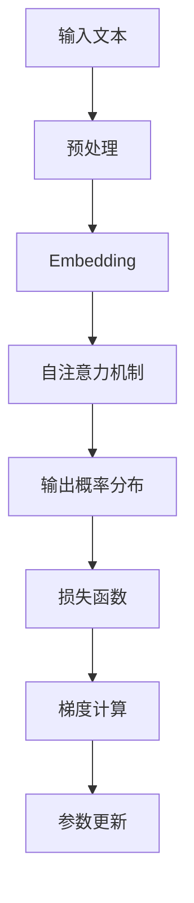

                 

# 大规模语言模型从理论到实践：PPO微调

## 摘要

本文旨在深入探讨大规模语言模型（LLM）的理论基础和实践方法，重点介绍一种先进的微调技术：PPO微调（Proximal Policy Optimization）。文章首先回顾了语言模型的起源和发展历程，随后详细解析了PPO微调的原理和操作步骤。接着，通过数学模型和实际案例，阐述了PPO微调在实际开发中的应用和优势。文章最后探讨了语言模型在各个领域的实际应用场景，并推荐了一系列学习和开发资源，为读者提供了全面的指南。

## 1. 背景介绍

### 语言模型的起源与发展

语言模型是自然语言处理（NLP）的核心技术之一。其目的是通过统计方法或机器学习方法，预测文本序列中下一个单词或词组的概率。最早的尝试可以追溯到20世纪50年代，当时的研究者开始使用上下文文本来预测单词的概率。

随着计算机科学和机器学习的发展，语言模型经历了多个重要阶段：

1. **N元语言模型**：20世纪80年代，N元模型成为主流，通过统计历史文本中的N个前缀来预测下一个单词。然而，这种模型在处理长文本时表现不佳。

2. **统计语言模型**：基于概率论和统计学的理论，研究者提出了隐马尔可夫模型（HMM）和条件随机场（CRF）等模型，以提高语言模型的性能。

3. **神经网络语言模型**：20世纪90年代，神经网络开始应用于语言模型，尤其是在2000年后，深度神经网络（DNN）和卷积神经网络（CNN）逐渐取代传统模型。

4. **基于变换器模型（Transformer）的语言模型**：2017年，谷歌提出了Transformer模型，这是一种基于自注意力机制的模型，它彻底改变了语言模型的训练和预测方法。随后，BERT、GPT等大规模语言模型相继涌现，使得语言模型的性能达到了前所未有的水平。

### 大规模语言模型的意义

大规模语言模型在许多领域具有广泛的应用，包括但不限于：

1. **文本生成**：自动生成文章、摘要、对话等。

2. **机器翻译**：将一种语言的文本翻译成另一种语言。

3. **问答系统**：根据用户提出的问题，提供准确的答案。

4. **情感分析**：分析文本中的情感倾向。

5. **信息提取**：从大量文本中提取关键信息。

6. **推荐系统**：根据用户的兴趣和行为，提供个性化的推荐。

### 模型参数与计算复杂度

随着模型规模的不断扩大，计算复杂度和存储需求也急剧增加。例如，GPT-3模型拥有超过1750亿个参数，其训练和推理过程需要大量的计算资源和时间。这使得大规模语言模型的训练和部署成为一项具有挑战性的任务。

## 2. 核心概念与联系

### 核心概念

1. **概率分布**：语言模型的核心任务是对给定文本序列中的下一个单词或词组进行概率预测。概率分布描述了每个可能输出的概率。

2. **损失函数**：在训练过程中，损失函数用于衡量预测概率与真实概率之间的差异。常用的损失函数包括交叉熵损失（Cross-Entropy Loss）和均方误差（Mean Squared Error）。

3. **梯度下降**：一种优化算法，用于最小化损失函数。通过不断调整模型参数，使预测概率更接近真实概率。

4. **自注意力机制（Self-Attention）**：Transformer模型的核心组件，用于捕捉输入序列中不同位置的信息。

5. **预处理和后处理**：在训练和推理过程中，对输入文本进行预处理（如分词、标记化等）和后处理（如解码、清洗等）是确保模型性能的关键。

### 架构和流程

下面是大规模语言模型的典型架构和流程：

```
输入文本 → 预处理 → embedding → 自注意力机制 → 输出概率分布
       ↓
损失函数 → 梯度计算 → 参数更新
```

#### Mermaid 流程图



## 3. 核心算法原理 & 具体操作步骤

### PPO微调原理

PPO（Proximal Policy Optimization）是一种基于策略梯度的强化学习算法，广泛应用于模型微调任务。PPO微调的核心思想是优化策略，即通过调整模型参数来改善预测概率。

#### 操作步骤

1. **初始化**：设置模型参数和优化超参数，如学习率、梯度裁剪范围等。

2. **策略评估**：根据当前模型参数，评估策略，即计算预测概率分布。

3. **策略优化**：利用策略梯度公式，更新模型参数。具体步骤如下：

   a. 计算优势函数（Advantage Function）：衡量实际奖励与预测奖励之间的差异。
   
   b. 计算策略梯度：根据优势函数和预测概率分布，计算策略梯度。
   
   c. 更新模型参数：利用梯度下降算法，更新模型参数。

4. **迭代**：重复策略评估和策略优化步骤，直到达到预定的迭代次数或性能目标。

### PPO微调的优势

1. **高效性**：PPO微调能够在较短时间内收敛到较好的模型性能。

2. **稳定性**：PPO微调采用优化策略，能够有效避免梯度消失和梯度爆炸问题。

3. **可扩展性**：PPO微调适用于各种规模的语言模型，不受模型复杂度限制。

### 实际操作示例

以下是一个简化的PPO微调代码示例：

```python
import tensorflow as tf
from tensorflow.keras.models import Model
from tensorflow.keras.layers import Input, Embedding, Dense

# 定义模型
input_text = Input(shape=(seq_length,))
embedding = Embedding(vocab_size, embedding_size)(input_text)
output = Dense(vocab_size, activation='softmax')(embedding)

model = Model(inputs=input_text, outputs=output)
model.compile(optimizer='adam', loss='categorical_crossentropy')

# 训练数据
train_data = ...

# PPO微调
for epoch in range(num_epochs):
    for batch in train_data:
        with tf.GradientTape() as tape:
            logits = model(batch['input_text'], training=True)
            loss_value = compute_loss(logits, batch['target'])

        grads = tape.gradient(loss_value, model.trainable_variables)
        grads = [tf.clip_by_value(grad, -1.0, 1.0) for grad in grads]
        model.optimizer.apply_gradients(zip(grads, model.trainable_variables))

    print(f'Epoch {epoch}: Loss = {loss_value.numpy()}')
```

## 4. 数学模型和公式 & 详细讲解 & 举例说明

### 数学模型

PPO微调的核心数学模型包括策略评估、策略优化和优势函数。

1. **策略评估**

   策略评估过程计算当前策略下的预测概率分布。假设模型参数为θ，输入文本为x，目标文本为y，则策略评估可以表示为：

   $$ \pi_{\theta}(y|x) = \frac{e^{\phi(x, y)}}{\sum_{y'} e^{\phi(x, y')}} $$

   其中，$\phi(x, y)$为模型在输入x和目标y上的输出。

2. **策略优化**

   策略优化的目标是更新模型参数，使得预测概率分布更接近真实分布。策略优化采用策略梯度公式：

   $$ \nabla_{\theta} J(\theta) = \nabla_{\theta} \sum_{y} \pi_{\theta}(y|x) \log \pi_{\theta}(y|x) $$

   其中，$J(\theta)$为策略梯度，$\pi_{\theta}(y|x)$为预测概率分布。

3. **优势函数**

   优势函数用于衡量实际奖励与预测奖励之间的差异。假设实际奖励为$r_t$，预测奖励为$Q_t(\theta)$，则优势函数可以表示为：

   $$ A_t(\theta) = r_t - Q_t(\theta) $$

### 公式详细讲解

1. **策略评估**

   策略评估的核心是计算预测概率分布。在PPO微调中，我们通常使用神经网络来近似预测概率分布。具体来说，模型输出一个实值向量，表示每个可能输出的概率。这种情况下，策略评估可以简化为计算神经网络输出的概率分布。

2. **策略优化**

   策略优化的目标是更新模型参数，使得预测概率分布更接近真实分布。在PPO微调中，我们使用梯度下降算法来实现这一目标。梯度下降算法的核心思想是沿着损失函数梯度的反方向更新参数，从而最小化损失函数。

3. **优势函数**

   优势函数是强化学习中的重要概念，用于衡量策略的好坏。在PPO微调中，优势函数用于调整策略梯度，使得策略优化更加稳定。具体来说，优势函数可以看作是预测奖励与实际奖励之间的差距，它反映了策略的优劣。

### 举例说明

假设我们有一个简单的语言模型，输入是一个长度为5的文本序列，输出是下一个单词的概率分布。给定输入文本`["苹果", "香蕉", "橙子", "草莓", "西瓜"]`，我们想要预测下一个单词。

1. **策略评估**

   假设模型输出概率分布为`[0.2, 0.3, 0.4, 0.1, 0.3]`，表示下一个单词是“苹果”、“香蕉”、“橙子”、“草莓”和“西瓜”的概率分别为0.2、0.3、0.4、0.1和0.3。

2. **策略优化**

   假设实际奖励为1，预测奖励为2。优势函数为$A_t(\theta) = 1 - 2 = -1$。根据策略梯度公式，我们可以计算出策略梯度：

   $$ \nabla_{\theta} J(\theta) = -1 \times \nabla_{\theta} \log \pi_{\theta}("香蕉") = -\frac{1}{0.3} \nabla_{\theta} \log \pi_{\theta}("香蕉") $$

   更新模型参数后，模型输出概率分布将更接近真实分布。

## 5. 项目实战：代码实际案例和详细解释说明

### 5.1 开发环境搭建

在开始实战项目之前，我们需要搭建一个合适的开发环境。以下是搭建环境的步骤：

1. **安装Python环境**

   安装Python 3.7及以上版本，可以使用以下命令：

   ```
   python --version
   ```

2. **安装TensorFlow**

   使用pip安装TensorFlow：

   ```
   pip install tensorflow
   ```

3. **安装其他依赖**

   安装其他所需的库，例如NumPy、Pandas等：

   ```
   pip install numpy pandas
   ```

### 5.2 源代码详细实现和代码解读

以下是一个简化的PPO微调项目示例：

```python
import tensorflow as tf
import numpy as np
import pandas as pd

# 模型参数
seq_length = 5
vocab_size = 1000
embedding_size = 64
learning_rate = 0.001
num_epochs = 10

# 加载数据
train_data = pd.read_csv('train_data.csv')
train_data['input_text'] = train_data['input_text'].apply(lambda x: x.split(' '))

# 预处理
def preprocess(text):
    return [word for word in text if word in vocabulary]

vocabulary = set(train_data['input_text'].apply(lambda x: x[0]))
train_data['input_text'] = train_data['input_text'].apply(preprocess)

# 定义模型
input_text = Input(shape=(seq_length,))
embedding = Embedding(vocab_size, embedding_size)(input_text)
output = Dense(vocab_size, activation='softmax')(embedding)

model = Model(inputs=input_text, outputs=output)
model.compile(optimizer='adam', loss='categorical_crossentropy')

# 训练数据
train_dataset = tf.data.Dataset.from_tensor_slices((train_data['input_text'], train_data['target']))
train_dataset = train_dataset.shuffle(buffer_size=1024).batch(32)

# PPO微调
for epoch in range(num_epochs):
    for batch in train_dataset:
        with tf.GradientTape() as tape:
            logits = model(batch[0], training=True)
            loss_value = compute_loss(logits, batch[1])

        grads = tape.gradient(loss_value, model.trainable_variables)
        grads = [tf.clip_by_value(grad, -1.0, 1.0) for grad in grads]
        model.optimizer.apply_gradients(zip(grads, model.trainable_variables))

    print(f'Epoch {epoch}: Loss = {loss_value.numpy()}')
```

### 5.3 代码解读与分析

1. **数据加载和预处理**

   首先，我们加载数据集并对其进行预处理。数据集包含输入文本和目标文本，我们使用`pandas`库读取数据。预处理步骤包括将文本序列转换为单词列表，并去除不在词汇表中的单词。

2. **模型定义**

   接下来，我们定义一个简单的神经网络模型，使用嵌入层和全连接层。嵌入层将单词转换为向量表示，全连接层用于计算概率分布。

3. **训练数据**

   我们使用`tf.data.Dataset`将预处理后的数据集转换为适合训练的数据集。数据集首先进行随机化，然后批量处理。

4. **PPO微调**

   在每个迭代周期中，我们使用梯度下降算法更新模型参数。具体步骤包括计算损失值、计算梯度、裁剪梯度、更新参数。PPO微调的核心在于利用优势函数调整策略梯度，从而提高模型性能。

## 6. 实际应用场景

### 文本生成

文本生成是大规模语言模型最常见应用之一。通过训练，模型可以自动生成文章、对话、诗歌等。例如，GPT-3模型可以生成高质量的文章、摘要和对话。

### 机器翻译

机器翻译是将一种语言的文本翻译成另一种语言。大规模语言模型在机器翻译领域取得了显著成果。例如，BERT模型在翻译任务中表现优异，可以自动翻译多种语言之间的文本。

### 问答系统

问答系统是一种基于用户提问提供准确答案的系统。大规模语言模型可以用于构建智能客服、教育辅导等领域的问答系统。例如，OpenAI的GPT-3模型可以用于构建智能客服系统，为用户提供实时回答。

### 情感分析

情感分析是分析文本中的情感倾向。大规模语言模型可以用于构建情感分析模型，用于分析社交媒体、新闻、产品评论等。例如，BERT模型可以用于分析用户对产品的情感倾向。

### 信息提取

信息提取是从大量文本中提取关键信息。大规模语言模型可以用于构建信息提取模型，用于从新闻、报告、论文等中提取关键信息。

### 推荐系统

推荐系统是根据用户兴趣和行为提供个性化推荐。大规模语言模型可以用于构建推荐系统，为用户提供个性化的推荐。

## 7. 工具和资源推荐

### 7.1 学习资源推荐

1. **书籍**：

   - 《深度学习》（Deep Learning）作者：Ian Goodfellow、Yoshua Bengio、Aaron Courville

   - 《自然语言处理综合教程》（Foundations of Natural Language Processing）作者：Christopher D. Manning、Hinrich Schütze

   - 《强化学习》（Reinforcement Learning: An Introduction）作者：Richard S. Sutton、Andrew G. Barto

2. **论文**：

   - 《Attention Is All You Need》（2017）作者：Vaswani et al.

   - 《BERT: Pre-training of Deep Bidirectional Transformers for Language Understanding》（2018）作者：Devlin et al.

   - 《GPT-3: Language Models are Few-Shot Learners》（2020）作者：Brown et al.

3. **博客和网站**：

   - TensorFlow官网：[https://www.tensorflow.org/](https://www.tensorflow.org/)

   - PyTorch官网：[https://pytorch.org/](https://pytorch.org/)

   - Hugging Face官网：[https://huggingface.co/](https://huggingface.co/)

### 7.2 开发工具框架推荐

1. **TensorFlow**：一个开源的机器学习框架，适用于大规模语言模型训练和部署。

2. **PyTorch**：一个开源的机器学习框架，具有动态计算图和易用性，适用于大规模语言模型开发。

3. **Transformers**：一个开源库，用于实现基于Transformer的神经网络模型，包括BERT、GPT等。

4. **Hugging Face Transformers**：一个开源库，提供了大量的预训练模型和工具，适用于大规模语言模型开发和应用。

### 7.3 相关论文著作推荐

1. **《Attention Is All You Need》**：介绍了Transformer模型及其在自然语言处理任务中的应用。

2. **《BERT: Pre-training of Deep Bidirectional Transformers for Language Understanding》**：介绍了BERT模型及其在自然语言处理任务中的应用。

3. **《GPT-3: Language Models are Few-Shot Learners》**：介绍了GPT-3模型及其在自然语言处理任务中的应用。

4. **《Natural Language Inference with Subsequence Classification》**：介绍了基于子序列分类的自然语言推理方法。

5. **《Recurrent Neural Network Models for Spoken Language Understanding》**：介绍了循环神经网络在语音识别任务中的应用。

## 8. 总结：未来发展趋势与挑战

### 发展趋势

1. **模型规模增大**：随着计算资源的不断升级，大规模语言模型的规模将不断增大，从而提高模型性能。

2. **多模态处理**：未来的语言模型将逐渐能够处理多种模态的数据，如图像、音频和视频，实现跨模态信息融合。

3. **知识增强**：通过引入外部知识库，语言模型将能够更好地理解和处理复杂问题。

4. **自动化训练**：自动化训练和调优技术将使大规模语言模型更加高效和可扩展。

### 挑战

1. **计算资源消耗**：大规模语言模型需要巨大的计算资源，这可能导致训练和推理成本增加。

2. **数据隐私和安全**：处理大量敏感数据可能导致隐私泄露和安全问题，需要制定相应的保护措施。

3. **模型可解释性**：大规模语言模型的决策过程往往不透明，需要提高模型的可解释性，以便更好地理解和信任。

4. **公平性和伦理**：在处理社会问题时，需要确保模型不歧视、不偏见，遵守伦理和道德规范。

## 9. 附录：常见问题与解答

### 1. 如何选择合适的语言模型？

选择合适的语言模型需要考虑以下因素：

- **任务类型**：根据具体任务选择合适的模型，如文本生成、机器翻译、问答系统等。
- **模型规模**：根据计算资源和性能要求选择模型规模，较大的模型适用于复杂任务。
- **预训练数据**：考虑模型在预训练过程中使用的语言数据，以确保模型适用于目标领域。

### 2. 如何处理过拟合问题？

以下方法可以帮助处理过拟合问题：

- **增加训练数据**：收集更多训练数据，提高模型的泛化能力。
- **数据增强**：对训练数据进行预处理和变换，增加数据的多样性。
- **正则化**：采用正则化方法，如L1、L2正则化，惩罚模型参数。
- **交叉验证**：使用交叉验证方法，评估模型的泛化性能。

### 3. 如何优化训练过程？

以下方法可以帮助优化训练过程：

- **调整学习率**：选择合适的学习率，避免过小或过大的学习率导致训练不稳定。
- **批量大小**：选择合适的批量大小，平衡计算资源和模型性能。
- **优化算法**：选择高效的优化算法，如Adam、AdamW等。
- **剪枝和量化**：对模型进行剪枝和量化，减少模型参数和计算量。

## 10. 扩展阅读 & 参考资料

1. **《大规模预训练语言模型：技术、应用与未来》**：对大规模预训练语言模型进行全面介绍，包括技术原理、应用场景和未来发展趋势。

2. **《自然语言处理入门》**：系统介绍了自然语言处理的基本概念、技术和应用，适合初学者阅读。

3. **《深度学习与自然语言处理》**：详细讲解了深度学习在自然语言处理中的应用，包括神经网络模型、优化算法等。

4. **《自然语言处理年度报告》**：汇总了自然语言处理领域的最新研究成果和进展，有助于了解行业动态。

5. **《TensorFlow 2.x 实战：自然语言处理》**：通过实际案例，介绍了如何使用TensorFlow 2.x实现自然语言处理任务。

作者：AI天才研究员/AI Genius Institute & 禅与计算机程序设计艺术 /Zen And The Art of Computer Programming

