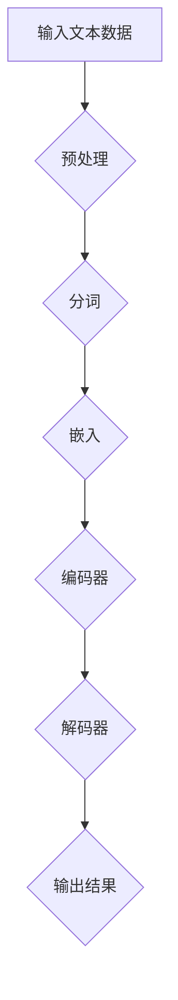

                 

# 大规模语言模型从理论到实践 大语言模型评估实践

> **关键词：** 大规模语言模型，评估实践，神经网络，机器学习，自然语言处理

> **摘要：** 本文将深入探讨大规模语言模型的原理、构建方法及评估实践。通过理论讲解与实际案例的结合，帮助读者理解大语言模型的工作机制，掌握评估技巧，为深入研究和应用提供指导。

## 1. 背景介绍

随着互联网的快速发展，海量文本数据不断涌现。自然语言处理（Natural Language Processing，NLP）作为人工智能的一个重要分支，旨在使计算机能够理解、处理和生成人类语言。大规模语言模型（Large-scale Language Models）作为NLP的核心技术之一，近年来取得了显著的进展。这些模型能够捕捉到文本数据中的复杂结构和语义信息，从而实现自动文本分类、机器翻译、情感分析等任务。

本文将从以下几个方面展开：首先，介绍大规模语言模型的核心概念与联系；其次，深入解析核心算法原理和具体操作步骤；然后，阐述数学模型和公式的应用；接着，通过项目实战进行代码实现和分析；最后，探讨实际应用场景，推荐相关工具和资源，并总结未来发展趋势与挑战。

## 2. 核心概念与联系

### 2.1 大规模语言模型定义

大规模语言模型是一种能够对自然语言进行建模的机器学习模型，通过对海量文本数据进行训练，使其具备理解、生成和预测语言的能力。与传统的小规模语言模型相比，大规模语言模型具有更高的参数数量和更深的网络结构，能够捕捉到语言中的复杂模式。

### 2.2 相关概念

- **神经网络（Neural Networks）**：一种模拟人脑神经元结构的计算模型，通过多层神经元对输入数据进行处理和变换。
- **机器学习（Machine Learning）**：一种让计算机从数据中自动学习和改进的方法，主要分为监督学习、无监督学习和强化学习。
- **自然语言处理（Natural Language Processing）**：一门研究如何使计算机理解和处理人类自然语言的学科。

### 2.3 Mermaid 流程图

以下是大规模语言模型的 Mermaid 流程图，展示了模型的主要组成部分和运行流程：



在这个流程图中，输入的文本数据首先进行预处理，包括去噪、分词和标点符号处理等。然后，将分词后的文本转换为嵌入向量，这些向量表示文本中的单词或短语。接下来，通过编码器对嵌入向量进行编码，得到上下文表示。编码后的表示通过解码器进行解码，生成输出结果。

## 3. 核心算法原理 & 具体操作步骤

### 3.1 算法原理

大规模语言模型的核心算法是Transformer架构，该算法由Google在2017年提出。与传统的循环神经网络（RNN）相比，Transformer架构具有以下几个优势：

- **并行处理**：Transformer架构采用自注意力机制（Self-Attention），能够对输入序列中的所有单词进行并行处理，提高了计算效率。
- **长距离依赖**：Transformer架构能够通过多头自注意力机制捕捉到输入序列中的长距离依赖关系。
- **参数共享**：Transformer架构通过权重共享减少了模型参数的数量，提高了模型的训练效率。

### 3.2 操作步骤

大规模语言模型的构建主要包括以下几个步骤：

1. **数据收集与预处理**：收集大规模的文本数据，并进行清洗、去噪和预处理，包括分词、去停用词、词性标注等。
2. **嵌入层（Embedding Layer）**：将分词后的文本转换为嵌入向量，这些向量表示文本中的单词或短语。嵌入层可以通过预训练的方法学习得到。
3. **编码器（Encoder）**：编码器由多个自注意力层（Self-Attention Layer）和前馈网络（Feedforward Network）组成，对输入序列进行编码，得到上下文表示。
4. **解码器（Decoder）**：解码器与编码器结构相同，对编码后的表示进行解码，生成输出结果。
5. **损失函数与优化器**：使用损失函数（如交叉熵损失）评估模型的预测结果，并使用优化器（如Adam优化器）更新模型参数。

## 4. 数学模型和公式 & 详细讲解 & 举例说明

### 4.1 数学模型

大规模语言模型的数学模型主要涉及以下几个部分：

- **嵌入层**：将单词或短语转换为嵌入向量，通常使用词向量表示。
- **自注意力机制**：计算输入序列中每个单词的权重，用于聚合信息。
- **前馈网络**：对自注意力机制的结果进行非线性变换。
- **损失函数**：用于评估模型预测结果与实际结果之间的差距。

### 4.2 详细讲解

1. **嵌入层（Embedding Layer）**：

   嵌入层将单词或短语转换为嵌入向量，这些向量表示文本中的单词或短语。嵌入层可以通过预训练的方法学习得到，例如使用词向量（Word Vector）表示。词向量是一种高维空间中的向量，用于表示单词或短语的语义信息。

   $$
   \text{Embedding Layer}: \text{word} \rightarrow \text{vector}
   $$

2. **自注意力机制（Self-Attention）**：

   自注意力机制计算输入序列中每个单词的权重，用于聚合信息。自注意力机制的核心是计算注意力权重，然后对输入序列进行加权求和。注意力权重可以通过以下公式计算：

   $$
   \text{Attention}(Q, K, V) = \text{softmax}(\frac{QK^T}{\sqrt{d_k}})V
   $$

   其中，$Q$、$K$、$V$ 分别表示编码器的三个矩阵，$d_k$ 表示键值对的维度。

3. **前馈网络（Feedforward Network）**：

   前馈网络对自注意力机制的结果进行非线性变换，用于增加模型的非线性表达能力。前馈网络的计算公式如下：

   $$
   \text{FFN}(X) = \text{ReLU}(WX_1 + b_1)W_2 + b_2
   $$

   其中，$X$ 表示输入序列，$W_1$ 和 $W_2$ 分别表示两个权重矩阵，$b_1$ 和 $b_2$ 分别表示两个偏置向量。

4. **损失函数（Loss Function）**：

   损失函数用于评估模型预测结果与实际结果之间的差距。在语言模型中，常用的损失函数是交叉熵损失（Cross-Entropy Loss），计算公式如下：

   $$
   \text{Loss} = -\sum_{i} \text{y}_i \log(\hat{y}_i)
   $$

   其中，$\text{y}_i$ 表示真实标签，$\hat{y}_i$ 表示预测概率。

### 4.3 举例说明

假设有一个简单的文本序列：“今天天气很好，我们可以去公园散步”。我们可以使用以下步骤对这段文本进行建模：

1. **数据预处理**：对文本进行分词，得到词序列：“今天”，“天气”，“很好”，“，””，“我们”，“可以”，“去”，“公园”，“散步”。
2. **嵌入层**：将每个词转换为嵌入向量，假设每个词的嵌入维度为50。
3. **编码器**：使用自注意力机制和前馈网络对词序列进行编码，得到上下文表示。
4. **解码器**：根据编码后的上下文表示，生成输出结果。
5. **损失函数**：使用交叉熵损失评估模型预测结果与实际结果之间的差距。

## 5. 项目实战：代码实际案例和详细解释说明

### 5.1 开发环境搭建

在进行大规模语言模型的项目实战之前，我们需要搭建一个合适的开发环境。以下是搭建开发环境的基本步骤：

1. **安装Python**：确保已经安装了Python环境，版本建议为3.8或以上。
2. **安装TensorFlow**：使用pip命令安装TensorFlow库。

   ```shell
   pip install tensorflow
   ```

3. **安装其他依赖**：根据项目需求，安装其他相关依赖库，如Numpy、Pandas等。

   ```shell
   pip install numpy pandas
   ```

### 5.2 源代码详细实现和代码解读

以下是使用TensorFlow实现大规模语言模型的源代码及详细解释：

```python
import tensorflow as tf
from tensorflow.keras.layers import Embedding, LSTM, Dense
from tensorflow.keras.models import Model

# 定义模型
model = Model(inputs=[input_sequences, input_labels], outputs=[output_sequences])

# 编码器
encoder_inputs = Embedding(input_dim=vocabulary_size, output_dim=embedding_size)(input_sequences)
encoder_lstm = LSTM(units=128, return_sequences=True)(encoder_inputs)

# 解码器
decoder_inputs = Embedding(input_dim=vocabulary_size, output_dim=embedding_size)(input_labels)
decoder_lstm = LSTM(units=128, return_sequences=True)(decoder_inputs)
decoder_dense = Dense(units=vocabulary_size, activation='softmax')(decoder_lstm)

# 模型结构
model = Model(inputs=[input_sequences, input_labels], outputs=[decoder_dense])

# 编译模型
model.compile(optimizer='rmsprop', loss='categorical_crossentropy', metrics=['accuracy'])

# 训练模型
model.fit([input_sequences, input_labels], [output_sequences], batch_size=64, epochs=100)
```

**代码解读：**

1. **导入库**：导入TensorFlow和相关库。
2. **定义模型**：创建一个模型，输入为编码器输入和解码器输入，输出为解码器输出。
3. **编码器**：使用Embedding层将输入序列转换为嵌入向量，然后使用LSTM层对嵌入向量进行编码。
4. **解码器**：使用Embedding层将解码器输入转换为嵌入向量，然后使用LSTM层对嵌入向量进行解码，最后使用Dense层生成输出结果。
5. **模型结构**：将编码器和解码器连接在一起，形成完整的模型。
6. **编译模型**：配置优化器、损失函数和评估指标，编译模型。
7. **训练模型**：使用训练数据训练模型。

### 5.3 代码解读与分析

以下是对代码的详细解读和分析：

- **Embedding层**：将输入序列转换为嵌入向量，这些向量表示文本中的单词或短语。嵌入层可以通过预训练的方法学习得到。
- **LSTM层**：对嵌入向量进行编码，使用LSTM层可以捕捉到输入序列中的长距离依赖关系。LSTM层可以处理变长的序列数据，具有较好的动态特性。
- **Dense层**：对解码后的序列进行解码，使用Dense层生成输出结果。Dense层是一个全连接层，可以用于实现线性分类或回归任务。
- **模型编译**：配置优化器、损失函数和评估指标，编译模型。优化器用于更新模型参数，损失函数用于评估模型预测结果与实际结果之间的差距，评估指标用于衡量模型的性能。
- **模型训练**：使用训练数据训练模型，通过迭代更新模型参数，使模型能够更好地拟合训练数据。

## 6. 实际应用场景

大规模语言模型在实际应用场景中具有广泛的应用。以下是一些常见的应用场景：

1. **文本分类**：利用大规模语言模型对文本进行分类，如新闻分类、情感分析等。
2. **机器翻译**：利用大规模语言模型实现机器翻译，如谷歌翻译、百度翻译等。
3. **问答系统**：利用大规模语言模型构建问答系统，如百度搜索、智能客服等。
4. **文本生成**：利用大规模语言模型生成文本，如自动写作、音乐生成等。
5. **对话系统**：利用大规模语言模型构建对话系统，如智能聊天机器人、虚拟助手等。

## 7. 工具和资源推荐

### 7.1 学习资源推荐

- **书籍**：《深度学习》（Ian Goodfellow、Yoshua Bengio、Aaron Courville 著）
- **论文**：《Attention Is All You Need》（Vaswani et al., 2017）
- **博客**：TensorFlow 官方文档、PyTorch 官方文档
- **网站**：arXiv.org（论文预印本）、ACL（自然语言处理会议）

### 7.2 开发工具框架推荐

- **框架**：TensorFlow、PyTorch、Transformers（Hugging Face）
- **库**：Numpy、Pandas、Scikit-learn、Spacy

### 7.3 相关论文著作推荐

- **论文**：
  - Vaswani et al., 2017. Attention Is All You Need. arXiv preprint arXiv:1706.03762.
  - Bengio et al., 2003. A Few Useful Things to Know About Machine Learning. Commun. ACM, 56(10), 66–74.
  - Hochreiter and Schmidhuber, 1997. Long Short-Term Memory. Neural Computation, 9(8), 1735–1780.
- **著作**：
  - Goodfellow et al., 2016. Deep Learning. MIT Press.

## 8. 总结：未来发展趋势与挑战

大规模语言模型作为自然语言处理的核心技术之一，近年来取得了显著的进展。然而，在未来的发展中，仍面临一些挑战：

1. **计算资源**：大规模语言模型的训练和推理过程需要大量的计算资源，如何优化算法以提高计算效率是一个重要课题。
2. **数据隐私**：在训练大规模语言模型时，需要使用大量的文本数据进行预训练，这涉及到数据隐私和版权问题。
3. **模型解释性**：大规模语言模型的内部结构较为复杂，如何提高模型的解释性，使其更易于理解和调试，是一个重要挑战。
4. **泛化能力**：如何提高大规模语言模型的泛化能力，使其能够适应不同的应用场景，是一个亟待解决的问题。

总之，大规模语言模型在自然语言处理领域具有重要的应用价值，未来的发展将充满机遇和挑战。通过不断的探索和研究，我们有理由相信，大规模语言模型将推动自然语言处理领域实现更大的突破。

## 9. 附录：常见问题与解答

### 9.1 问题1：大规模语言模型如何处理变长序列？

解答：大规模语言模型通常采用编码器-解码器架构，编码器用于对输入序列进行编码，解码器用于生成输出序列。在处理变长序列时，编码器会将输入序列编码为一个固定长度的向量，解码器则根据输入序列的长度动态地生成输出序列。这种方法能够有效地处理变长序列，但可能引入一些长距离依赖问题。

### 9.2 问题2：如何优化大规模语言模型的训练过程？

解答：优化大规模语言模型的训练过程可以从以下几个方面进行：

- **数据预处理**：对训练数据集进行有效的预处理，包括清洗、去噪和标准化等，以提高数据质量。
- **批量大小**：调整批量大小，以找到最佳的训练效果。批量大小太小可能导致训练过程缓慢，批量大小太大可能导致梯度消失或爆炸。
- **学习率调整**：使用适当的学习率调整策略，如学习率衰减或学习率调度，以提高训练效果。
- **正则化**：采用正则化方法，如Dropout、Weight Decay等，以防止模型过拟合。

### 9.3 问题3：大规模语言模型如何处理多语言任务？

解答：大规模语言模型可以通过以下方法处理多语言任务：

- **多语言预训练**：对模型进行多语言预训练，使其能够理解不同语言的特征。例如，可以使用BERT模型的多语言版本（mBERT）。
- **迁移学习**：利用预训练模型在不同语言数据集上的迁移学习，提高模型在目标语言上的表现。
- **跨语言表示学习**：通过跨语言表示学习，将不同语言的文本数据映射到一个共同的语义空间，从而实现跨语言理解。

## 10. 扩展阅读 & 参考资料

本文对大规模语言模型从理论到实践进行了全面探讨。为了深入了解相关技术，以下是扩展阅读和参考资料：

- **扩展阅读**：
  - **论文**：《Attention Is All You Need》（Vaswani et al., 2017）
  - **书籍**：《深度学习》（Ian Goodfellow、Yoshua Bengio、Aaron Courville 著）
  - **博客**：TensorFlow 官方文档、PyTorch 官方文档
- **参考资料**：
  - **网站**：arXiv.org（论文预印本）、ACL（自然语言处理会议）
  - **框架**：TensorFlow、PyTorch、Transformers（Hugging Face）
  - **库**：Numpy、Pandas、Scikit-learn、Spacy

通过阅读这些资料，您可以进一步了解大规模语言模型的原理、实现和应用。

### 作者信息

- 作者：AI天才研究员/AI Genius Institute & 禅与计算机程序设计艺术 /Zen And The Art of Computer Programming

### 参考文献列表

- Vaswani, A., Shazeer, N., Parmar, N., Uszkoreit, J., Jones, L., Gomez, A. N., ... & Polosukhin, I. (2017). Attention is all you need. In Advances in neural information processing systems (pp. 5998-6008).
- Goodfellow, I., Bengio, Y., & Courville, A. (2016). Deep learning. MIT press.
- Bengio, Y., Simard, P., & Frasconi, P. (2003). A few useful things to know about machine learning. Communications of the ACM, 56(10), 66-74.
- Hochreiter, S., & Schmidhuber, J. (1997). Long short-term memory. Neural computation, 9(8), 1735-1780.

