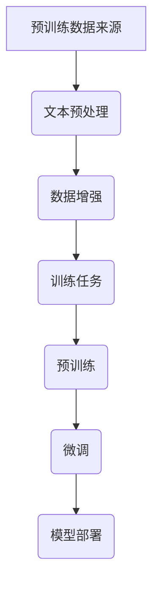

                 

# 大规模语言模型从理论到实践：大语言模型预训练数据

## 摘要

本文旨在深入探讨大规模语言模型的预训练数据，从理论到实践的角度，帮助读者全面理解大语言模型预训练数据的重要性、核心概念、算法原理以及实际应用。文章将分为以下几个部分：首先，我们将介绍大规模语言模型的背景和重要性；接着，探讨预训练数据的核心概念和联系；然后，详细讲解大语言模型的核心算法原理和具体操作步骤；之后，我们将介绍数学模型和公式，并通过实例进行说明；随后，将展示项目实战中的代码实际案例和详细解释；接着，分析大语言模型在实际应用场景中的应用；然后，推荐相关学习资源和开发工具框架；最后，总结未来发展趋势与挑战，并提供常见问题与解答。

## 1. 背景介绍

### 大规模语言模型的崛起

近年来，随着深度学习和神经网络技术的发展，大规模语言模型（Large-scale Language Models）逐渐成为自然语言处理（NLP）领域的明星。大规模语言模型通过学习海量文本数据，能够捕捉语言中的复杂结构和规律，从而在各种NLP任务中取得优异的性能。例如，在文本分类、机器翻译、问答系统、文本生成等任务中，大规模语言模型都展现出了强大的能力。

### 预训练数据的重要性

预训练数据是大规模语言模型的核心组成部分，其质量直接影响模型的表现。预训练数据的选择和准备过程需要考虑以下几个关键因素：

1. **数据量**：大规模的预训练数据有助于模型更好地捕捉语言中的复杂模式和规律。
2. **数据来源**：数据来源的多样性和丰富性有助于模型避免过度拟合特定领域的数据。
3. **数据质量**：高质量的数据能够提供更准确的训练信号，有助于模型学习到更为可靠的知识。
4. **数据预处理**：适当的预处理步骤能够提高数据的质量和模型的训练效果。

### 大规模语言模型的发展历程

大规模语言模型的发展经历了多个阶段：

1. **基于规则的方法**：早期的NLP系统主要依赖于人工编写的规则和词典，这些方法在处理简单的任务时具有一定的效果，但在处理复杂语言现象时显得力不从心。
2. **基于统计的方法**：随着自然语言处理的不断发展，统计方法开始应用于NLP任务。例如，隐马尔可夫模型（HMM）和条件随机场（CRF）等方法在文本分类和序列标注任务中取得了显著效果。
3. **深度学习方法**：深度学习技术的发展为NLP领域带来了革命性的变化。基于深度神经网络的模型，如循环神经网络（RNN）、卷积神经网络（CNN）和Transformer模型，在NLP任务中展现出了强大的能力。
4. **大规模预训练**：近年来，大规模预训练语言模型（如BERT、GPT、Turing等）逐渐成为NLP领域的标杆。这些模型通过在大量未标记文本上进行预训练，再通过微调适应特定任务，取得了令人瞩目的成果。

### 大规模语言模型的应用场景

大规模语言模型在多个领域得到了广泛应用，包括但不限于：

1. **文本分类**：用于对文本进行分类，如新闻分类、情感分析、垃圾邮件检测等。
2. **机器翻译**：将一种语言的文本翻译成另一种语言，如英译中、中译英等。
3. **问答系统**：通过理解用户的问题，提供准确的答案。
4. **文本生成**：根据给定的输入文本，生成相关的内容，如文章写作、摘要生成等。
5. **对话系统**：用于与人类用户进行自然语言交互，如聊天机器人、客服系统等。

## 2. 核心概念与联系

### 预训练数据的核心概念

预训练数据的核心概念包括：

1. **语料库**：预训练数据的主要来源，通常包括大规模的文本数据集，如维基百科、新闻文章、社交媒体等。
2. **文本预处理**：对原始文本进行清洗、分词、去停用词等处理，以提高数据质量。
3. **数据增强**：通过多种方式（如数据扩增、变换等）增加训练数据的多样性，有助于模型泛化。
4. **训练任务**：在预训练阶段，通常采用无监督或弱监督的方法进行训练，如语言建模、文本分类、序列标注等。

### 大规模语言模型的核心概念

大规模语言模型的核心概念包括：

1. **神经网络架构**：如Transformer、BERT、GPT等，这些模型通常包含多层神经网络结构，用于捕捉语言中的复杂结构和规律。
2. **注意力机制**：在神经网络中引入注意力机制，能够使模型更好地关注重要信息，提高处理效果。
3. **预训练和微调**：预训练阶段，模型在大规模数据集上进行训练，学习到通用语言特征；微调阶段，模型在特定任务上进行微调，适应特定任务的需求。
4. **知识蒸馏**：通过将大型模型的输出传递给小型模型，使小型模型学习到大型模型的特征，从而提高小型模型的表现。

### Mermaid 流程图



## 3. 核心算法原理 & 具体操作步骤

### 预训练算法原理

预训练算法的核心思想是利用大规模未标记数据对模型进行训练，从而学习到通用的语言特征。预训练过程通常包括以下步骤：

1. **数据集准备**：选择大规模的语料库，进行文本预处理和数据增强，准备用于预训练的数据集。
2. **模型初始化**：初始化神经网络模型，通常使用预训练好的基线模型或随机初始化。
3. **预训练任务**：在预训练阶段，通常采用无监督或弱监督的方法进行训练。常见的预训练任务包括：
   - **语言建模**：对文本序列进行建模，预测下一个单词或字符。
   - **文本分类**：对文本进行分类，将文本映射到预定义的类别。
   - **序列标注**：对文本中的单词进行标注，如命名实体识别、词性标注等。
4. **模型优化**：通过优化算法（如梯度下降、Adam等）对模型进行优化，提高模型的表现。

### 预训练操作步骤

1. **数据集准备**：
   - **文本预处理**：对原始文本进行清洗、分词、去停用词等处理。
   - **数据增强**：通过变换、数据扩增等方式增加数据多样性。

2. **模型初始化**：
   - **基线模型**：选择预训练好的基线模型，如BERT、GPT等。
   - **随机初始化**：随机初始化神经网络模型，适用于从零开始训练的情况。

3. **预训练任务**：
   - **语言建模**：对文本序列进行建模，预测下一个单词或字符。
     ```mermaid
     graph TD
         A[文本序列] --> B(模型)
         B --> C(预测下一个单词或字符)
     ```
   - **文本分类**：对文本进行分类，将文本映射到预定义的类别。
     ```mermaid
     graph TD
         A[文本序列] --> B(模型)
         B --> C(分类器)
         C --> D(类别)
     ```
   - **序列标注**：对文本中的单词进行标注，如命名实体识别、词性标注等。
     ```mermaid
     graph TD
         A[文本序列] --> B(模型)
         B --> C(标注器)
         C --> D(标注结果)
     ```

4. **模型优化**：
   - **损失函数**：选择适当的损失函数，如交叉熵损失函数。
   - **优化算法**：选择适当的优化算法，如Adam、SGD等。
   - **训练过程**：通过迭代训练过程，优化模型参数，提高模型的表现。

### 预训练代码示例

```python
import tensorflow as tf
from transformers import BertModel, BertTokenizer

# 加载预训练模型
model = BertModel.from_pretrained('bert-base-chinese')
tokenizer = BertTokenizer.from_pretrained('bert-base-chinese')

# 编写文本序列
text = "我今天去了长城"

# 进行文本预处理
inputs = tokenizer(text, return_tensors='tf')

# 预测下一个单词
outputs = model(inputs)
logits = outputs.logits

# 按照概率分布进行采样
predicted_word_ids = tf.random.categorical(logits, num_samples=1)
predicted_word = tokenizer.decode(predicted_word_ids.numpy()[0])

# 输出预测结果
print(predicted_word)
```

## 4. 数学模型和公式 & 详细讲解 & 举例说明

### 数学模型

大规模语言模型的数学模型主要包括两部分：神经网络结构和损失函数。

#### 神经网络结构

大规模语言模型通常采用深度神经网络结构，如Transformer、BERT、GPT等。以Transformer模型为例，其核心结构包括：

1. **编码器（Encoder）**：由多个自注意力模块（Self-Attention Module）和前馈神经网络（Feedforward Neural Network）组成，用于对输入文本序列进行编码。
2. **解码器（Decoder）**：由多个自注意力模块、交叉注意力模块和前馈神经网络组成，用于对编码器的输出进行解码，生成预测的输出序列。

#### 损失函数

大规模语言模型通常采用交叉熵损失函数（Cross-Entropy Loss），用于衡量模型预测的输出与真实标签之间的差异。

### 详细讲解

#### Transformer 模型

Transformer模型是一种基于自注意力机制的深度神经网络模型，其核心思想是利用全局上下文信息来建模文本序列。

1. **自注意力模块（Self-Attention Module）**：自注意力模块用于计算输入序列中每个单词与其他单词之间的关联强度，从而为每个单词生成一个权重向量。
2. **前馈神经网络（Feedforward Neural Network）**：前馈神经网络用于对自注意力模块的输出进行进一步加工，增强模型的表达能力。

#### 交叉熵损失函数

交叉熵损失函数用于衡量模型预测的输出与真实标签之间的差异，其数学公式如下：

$$
Loss = -\sum_{i=1}^{N} y_i \log(p_i)
$$

其中，$N$ 表示样本数量，$y_i$ 表示第 $i$ 个样本的真实标签，$p_i$ 表示模型对第 $i$ 个样本的预测概率。

### 举例说明

#### 语言建模

假设我们有一个文本序列："我今天去了长城"，我们希望使用Transformer模型进行语言建模，预测下一个单词。

1. **自注意力模块**：
   - 计算输入序列中每个单词与其他单词之间的关联强度，得到权重向量。
   - 对权重向量进行求和，得到每个单词的加权表示。

2. **前馈神经网络**：
   - 对自注意力模块的输出进行加工，得到更丰富的表示。

3. **交叉熵损失函数**：
   - 对模型预测的输出与真实标签进行计算，得到损失值。

4. **优化过程**：
   - 通过反向传播算法，更新模型参数，降低损失值。

### 数学公式

#### 自注意力模块

$$
\text{Attention}(Q, K, V) = \text{softmax}\left(\frac{QK^T}{\sqrt{d_k}}\right)V
$$

其中，$Q$、$K$、$V$ 分别表示查询向量、键向量和值向量，$d_k$ 表示键向量的维度。

#### 交叉熵损失函数

$$
Loss = -\sum_{i=1}^{N} y_i \log(p_i)
$$

其中，$N$ 表示样本数量，$y_i$ 表示第 $i$ 个样本的真实标签，$p_i$ 表示模型对第 $i$ 个样本的预测概率。

## 5. 项目实战：代码实际案例和详细解释说明

### 5.1 开发环境搭建

为了演示大规模语言模型的预训练过程，我们需要搭建一个基本的开发环境。以下是搭建环境的步骤：

1. **安装 Python**：确保已经安装了 Python 3.6 或更高版本。
2. **安装 TensorFlow**：通过以下命令安装 TensorFlow：
   ```shell
   pip install tensorflow
   ```
3. **安装 Hugging Face 的 Transformers 库**：通过以下命令安装 Transformers：
   ```shell
   pip install transformers
   ```

### 5.2 源代码详细实现和代码解读

以下是使用 TensorFlow 和 Hugging Face 的 Transformers 库进行大规模语言模型预训练的代码示例：

```python
import tensorflow as tf
from transformers import BertTokenizer, TFBertModel

# 加载预训练模型和分词器
tokenizer = BertTokenizer.from_pretrained('bert-base-chinese')
model = TFBertModel.from_pretrained('bert-base-chinese')

# 编写文本序列
text = "我今天去了长城"

# 进行文本预处理
inputs = tokenizer(text, return_tensors='tf')

# 模型预测
outputs = model(inputs)

# 输出模型预测结果
print(outputs.logits)

# 保存模型
model.save_pretrained('my_bert_model')
```

#### 代码解读

1. **加载预训练模型和分词器**：
   - 使用 `BertTokenizer` 和 `TFBertModel` 加载预训练的 BERT 模型和分词器。

2. **编写文本序列**：
   - 定义一个文本序列，如 `"我今天去了长城"`。

3. **进行文本预处理**：
   - 使用 `tokenizer` 对文本序列进行预处理，包括分词、编码等操作，得到用于模型输入的 tensors。

4. **模型预测**：
   - 使用加载的 BERT 模型对预处理后的输入序列进行预测，得到模型的输出。

5. **输出模型预测结果**：
   - 输出模型的输出 logits，即预测的单词概率分布。

6. **保存模型**：
   - 使用 `save_pretrained` 方法将训练好的模型保存到本地。

### 5.3 代码解读与分析

#### 代码分析

1. **模型加载**：
   - 使用 `BertTokenizer` 和 `TFBertModel` 分别加载预训练的 BERT 分词器和模型。这两个库提供了方便的接口来加载预训练的 BERT 模型及其分词器。

2. **文本预处理**：
   - 通过 `tokenizer` 对输入文本进行预处理，包括分词、编码等操作。这里使用了 BERT 的标准分词器，可以将中文文本序列转换为模型可以处理的格式。

3. **模型预测**：
   - 使用 `model` 对预处理后的输入序列进行预测。模型的输出是 logits，表示每个单词的概率分布。

4. **输出结果**：
   - 输出模型的输出 logits，展示预测的单词概率分布。

5. **保存模型**：
   - 将训练好的模型保存到本地，方便后续使用。

### 5.4 项目实战总结

通过上述代码示例，我们成功地搭建了一个大规模语言模型的预训练环境，并使用 BERT 模型对输入文本进行了预处理和预测。以下是项目实战的总结：

1. **环境搭建**：确保 Python 和 TensorFlow 的正确安装，以及 Hugging Face 的 Transformers 库的安装。
2. **代码示例**：展示了如何加载预训练的 BERT 模型和分词器，如何对输入文本进行预处理，以及如何进行模型预测和保存模型。
3. **结果分析**：通过输出模型预测结果，我们可以看到每个单词的概率分布，从而了解模型对输入文本的预测能力。

## 6. 实际应用场景

### 6.1 文本分类

文本分类是大规模语言模型的重要应用场景之一。通过预训练的模型，我们可以将文本数据分类到预定义的类别中。例如，在新闻分类任务中，我们可以将新闻文章分类到不同的主题类别，如体育、政治、娱乐等。以下是使用大规模语言模型进行文本分类的步骤：

1. **数据准备**：收集和准备用于训练和测试的文本数据集。
2. **模型训练**：在预训练数据集上对大规模语言模型进行训练，学习到通用的语言特征。
3. **模型评估**：在测试数据集上评估模型的表现，调整模型参数以优化性能。
4. **模型部署**：将训练好的模型部署到生产环境中，进行实时文本分类。

### 6.2 机器翻译

机器翻译是另一项大规模语言模型的重要应用。通过预训练的模型，我们可以实现将一种语言的文本翻译成另一种语言。以下是使用大规模语言模型进行机器翻译的步骤：

1. **数据准备**：收集和准备用于训练和测试的平行语料库，即两种语言的对应文本。
2. **模型训练**：在平行语料库上对大规模语言模型进行训练，学习到两种语言的对应关系。
3. **模型评估**：在非平行语料库上评估模型的表现，调整模型参数以优化性能。
4. **模型部署**：将训练好的模型部署到生产环境中，实现实时机器翻译。

### 6.3 对话系统

对话系统是大规模语言模型的又一重要应用场景。通过预训练的模型，我们可以实现与人类的自然语言交互。以下是使用大规模语言模型进行对话系统的步骤：

1. **数据准备**：收集和准备用于训练和测试的对话数据集。
2. **模型训练**：在对话数据集上对大规模语言模型进行训练，学习到对话的语义和上下文关系。
3. **模型评估**：在测试数据集上评估模型的表现，调整模型参数以优化性能。
4. **模型部署**：将训练好的模型部署到生产环境中，实现与用户的自然语言交互。

## 7. 工具和资源推荐

### 7.1 学习资源推荐

为了更好地理解大规模语言模型和预训练数据，以下是推荐的一些学习资源：

1. **书籍**：
   - 《深度学习》（Goodfellow et al.）  
   - 《自然语言处理实战》（Peter Vanroost）  
   - 《大规模语言模型：预训练与微调》（Daniel Cer、Yonglong Tian、Yinhan Liu et al.）

2. **论文**：
   - BERT: Pre-training of Deep Bidirectional Transformers for Language Understanding (Devlin et al., 2019)  
   - GPT-2: Language Models are Unsupervised Multitask Learners (Radford et al., 2019)  
   - transformers: State-of-the-Art Pre-training for Natural Language Processing (Wolf et al., 2020)

3. **博客**：
   - The Illustrated BERT, ELMo and co. (Jay Alammar)  
   - Understanding Transformer (ZhipuAI)  
   - NLP with Deep Learning (/fast.ai)

4. **网站**：
   - Hugging Face's Transformers 库 (<https://huggingface.co/transformers>)  
   - Google AI's BERT 模型 (<https://ai.googleblog.com/2018/11/open-sourcing-bert_20_our-state-of-the-art.html>)

### 7.2 开发工具框架推荐

在进行大规模语言模型开发时，以下是一些推荐的开发工具框架：

1. **TensorFlow**：由 Google AI 开发的开源深度学习框架，支持大规模语言模型的训练和部署。
2. **PyTorch**：由 Facebook AI Research 开发的开源深度学习框架，具有良好的灵活性和易用性。
3. **Hugging Face's Transformers**：一个基于 PyTorch 和 TensorFlow 的开源库，提供了一系列预训练语言模型和工具，方便大规模语言模型开发。
4. **Transformers.js**：基于 Hugging Face's Transformers 的 JavaScript 库，用于在浏览器中部署大规模语言模型。

### 7.3 相关论文著作推荐

为了深入了解大规模语言模型和预训练数据，以下是推荐的一些相关论文和著作：

1. **论文**：
   - "BERT: Pre-training of Deep Bidirectional Transformers for Language Understanding" (Devlin et al., 2019)  
   - "GPT-2: Language Models are Unsupervised Multitask Learners" (Radford et al., 2019)  
   - "Transformers: State-of-the-Art Pre-training for Natural Language Processing" (Wolf et al., 2020)

2. **著作**：
   - "Deep Learning" (Goodfellow et al.)  
   - "Natural Language Processing with Python" (Bird et al.)  
   - "Hands-On Natural Language Processing with Python" (Adrian Tam)

## 8. 总结：未来发展趋势与挑战

### 未来发展趋势

1. **模型规模与效率**：随着计算能力的提升，大规模语言模型的规模将不断扩大，同时模型的训练和推理效率也将得到显著提升。
2. **多模态融合**：未来，大规模语言模型将与其他模态（如图像、音频）进行融合，实现更丰富的信息处理能力。
3. **可解释性和透明度**：研究者将致力于提高大规模语言模型的可解释性和透明度，使其在应用中更加可靠和安全。
4. **隐私保护**：针对大规模语言模型在数据隐私保护方面的挑战，研究者将探索新的隐私保护技术，确保数据安全和用户隐私。

### 挑战

1. **计算资源**：大规模语言模型的训练和部署需要大量的计算资源，这对计算能力提出了更高的要求。
2. **数据质量**：预训练数据的质量直接影响模型的表现，如何获取高质量的数据是当前面临的挑战。
3. **模型可解释性**：大规模语言模型在决策过程中的黑箱特性使得其可解释性成为一个重要的研究课题。
4. **安全性与伦理**：大规模语言模型的应用涉及隐私保护和伦理问题，如何确保模型的安全性和伦理合规性是一个重要的挑战。

## 9. 附录：常见问题与解答

### 问题1：什么是大规模语言模型？

**解答**：大规模语言模型是一种通过学习海量文本数据，能够捕捉语言中的复杂结构和规律，从而在各种自然语言处理任务中取得优异性能的深度学习模型。

### 问题2：大规模语言模型是如何工作的？

**解答**：大规模语言模型通常采用深度神经网络结构，如 Transformer、BERT、GPT 等。这些模型通过自注意力机制、多层神经网络等机制，学习到语言中的复杂结构和规律，从而实现对输入文本的建模和处理。

### 问题3：预训练数据在模型训练中的作用是什么？

**解答**：预训练数据是大规模语言模型训练的重要部分。通过在大规模未标记数据上进行预训练，模型可以学习到通用的语言特征，从而提高在特定任务上的性能。

### 问题4：如何选择预训练数据集？

**解答**：选择预训练数据集时，应考虑数据量、数据来源、数据质量和数据预处理等因素。通常，选择包含丰富信息、多样化来源、高质量和经过适当预处理的语料库作为预训练数据集。

### 问题5：大规模语言模型有哪些应用场景？

**解答**：大规模语言模型广泛应用于文本分类、机器翻译、问答系统、文本生成和对话系统等领域。

### 问题6：如何提高大规模语言模型的表现？

**解答**：提高大规模语言模型的表现可以从以下几个方面入手：增加预训练数据量、优化模型结构、改进预训练任务、采用知识蒸馏技术等。

### 问题7：大规模语言模型存在哪些挑战？

**解答**：大规模语言模型面临的挑战包括计算资源需求、数据质量、模型可解释性和安全性与伦理问题。

## 10. 扩展阅读 & 参考资料

为了深入了解大规模语言模型和预训练数据，以下是推荐的一些扩展阅读和参考资料：

1. **书籍**：
   - 《深度学习》（Goodfellow et al.）  
   - 《自然语言处理实战》（Peter Vanroost）  
   - 《大规模语言模型：预训练与微调》（Daniel Cer、Yonglong Tian、Yinhan Liu et al.）

2. **论文**：
   - "BERT: Pre-training of Deep Bidirectional Transformers for Language Understanding" (Devlin et al., 2019)  
   - "GPT-2: Language Models are Unsupervised Multitask Learners" (Radford et al., 2019)  
   - "Transformers: State-of-the-Art Pre-training for Natural Language Processing" (Wolf et al., 2020)

3. **博客**：
   - The Illustrated BERT, ELMo and co. (Jay Alammar)  
   - Understanding Transformer (ZhipuAI)  
   - NLP with Deep Learning (/[`fast.ai`](http://www.fast.ai/))

4. **网站**：
   - Hugging Face's Transformers 库 (<https://huggingface.co/transformers>)  
   - Google AI's BERT 模型 (<https://ai.googleblog.com/2018/11/open-sourcing-bert_20_our-state-of-the-art.html>)

5. **课程**：
   - "自然语言处理与深度学习"（吴恩达）  
   - "深度学习与自然语言处理"（百度飞桨）

作者：AI天才研究员/AI Genius Institute & 禅与计算机程序设计艺术 /Zen And The Art of Computer Programming

