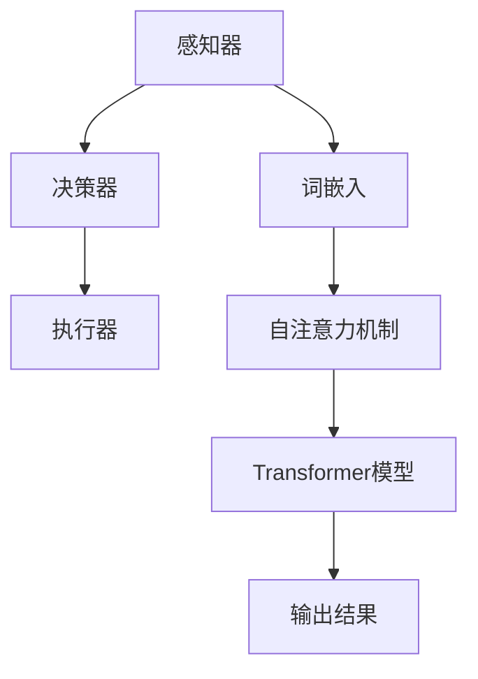

                 

### 文章标题：大规模语言模型从理论到实践 智能代理的应用实例

> **关键词**：大规模语言模型、智能代理、自然语言处理、深度学习、应用实例、算法原理、代码实现

> **摘要**：本文将深入探讨大规模语言模型的理论基础和实际应用，以智能代理为例，详细解析其在自然语言处理领域的应用实例，包括核心概念、算法原理、数学模型、项目实战等，旨在为读者提供一份全面的技术指南，帮助理解并掌握大规模语言模型及其在智能代理中的应用。

### 1. 背景介绍

#### 1.1 大规模语言模型的发展历程

大规模语言模型（Large Language Models，LLM）的兴起可以追溯到20世纪80年代，当时研究者们开始探索如何利用统计模型来处理自然语言。早期的语言模型，如n-gram模型和基于决策树的模型，在简单的语言任务上表现不错，但随着互联网的兴起，数据量的爆炸式增长和计算能力的提升，研究者们开始尝试使用更复杂的模型来处理自然语言。

2003年， Bengio 等人提出了递归神经网络（RNN）这一概念，使得语言模型能够捕捉到序列中的长期依赖关系。然而，由于RNN在训练过程中存在梯度消失和梯度爆炸的问题，导致其在处理长序列时的表现不佳。

2013年，Hochreiter 和 Schmidhuber 提出了长短期记忆网络（LSTM），LSTM通过引入门控机制，有效解决了RNN的梯度消失问题。LSTM在语言模型中的应用使得大规模语言处理取得了突破性进展。

2018年， Vaswani 等人提出了Transformer模型，这一模型彻底颠覆了传统的序列处理方法，通过自注意力机制（Self-Attention）实现了对序列中每个元素的高效处理。Transformer模型的提出标志着大规模语言模型进入了一个新的时代。

#### 1.2 智能代理的发展和应用

智能代理（Intelligent Agent）是指能够感知环境、接收输入信息并自主做出决策的计算机程序。智能代理的概念最早由John McCarthy在1950年提出，其定义是“一个智能体是一个能够感知环境并根据目标在环境中采取行动的实体”。

随着人工智能技术的发展，智能代理的应用越来越广泛。在自然语言处理领域，智能代理主要用于文本分类、情感分析、问答系统、机器翻译等任务。智能代理的核心在于其能够理解自然语言，并在此基础上进行推理和决策。

#### 1.3 大规模语言模型在智能代理中的应用

大规模语言模型在智能代理中的应用主要体现在两个方面：一是作为特征提取器，用于提取文本的特征表示；二是作为决策引擎，用于处理文本数据并生成相应的输出。

大规模语言模型如GPT、BERT等，通过预训练和微调，能够捕捉到文本中的复杂结构和信息，从而为智能代理提供强大的语言理解能力。在智能代理中，大规模语言模型可以用于如下任务：

1. **文本分类**：利用大规模语言模型对文本进行分类，如新闻分类、垃圾邮件检测等。
2. **情感分析**：分析文本的情感倾向，如评价分类、情感极性分类等。
3. **问答系统**：构建基于大规模语言模型的问答系统，如搜索引擎、智能客服等。
4. **机器翻译**：利用大规模语言模型实现高质量的双语翻译。

### 2. 核心概念与联系

#### 2.1 大规模语言模型的核心概念

大规模语言模型的核心概念包括：

1. **词嵌入**：将单词映射到高维向量空间，使得相似词在空间中靠近。
2. **自注意力机制**：通过计算序列中每个元素的重要程度，实现对序列的整体理解和处理。
3. **Transformer模型**：基于自注意力机制的深度学习模型，用于处理序列数据。

#### 2.2 智能代理的核心概念

智能代理的核心概念包括：

1. **感知器**：用于接收环境中的输入信息。
2. **决策器**：根据输入信息和预定的目标，生成相应的决策。
3. **执行器**：将决策转化为实际的操作。

#### 2.3 Mermaid 流程图

以下是一个简化的Mermaid流程图，展示了大规模语言模型和智能代理的基本工作流程：



### 3. 核心算法原理 & 具体操作步骤

#### 3.1 词嵌入

词嵌入（Word Embedding）是将单词映射到高维向量空间的过程。词嵌入的核心思想是将文本中的单词表示为稠密向量，使得相似词在空间中靠近。

常见的词嵌入方法包括：

1. **Word2Vec**：基于神经网络的词嵌入方法，通过训练词向量模型来预测词语的上下文。
2. **GloVe**：全局向量表示（Global Vectors for Word Representation），通过计算词语的共现矩阵来训练词向量。
3. **BERT**：Bidirectional Encoder Representations from Transformers，通过双向Transformer模型来生成词嵌入。

#### 3.2 自注意力机制

自注意力机制（Self-Attention）是一种用于处理序列数据的注意力机制。自注意力机制通过计算序列中每个元素的重要程度，实现对序列的整体理解和处理。

自注意力机制的具体操作步骤如下：

1. **计算查询（Query）、键（Key）和值（Value）**：对于序列中的每个词向量，分别计算其查询（Query）、键（Key）和值（Value）。
2. **计算注意力分数**：对于序列中的每个词向量，计算其与所有其他词向量的相似度，得到注意力分数。
3. **计算注意力加权向量**：根据注意力分数，对序列中的每个词向量进行加权，得到注意力加权向量。
4. **输出结果**：将注意力加权向量作为输入，传递给下一层。

#### 3.3 Transformer模型

Transformer模型是一种基于自注意力机制的深度学习模型，用于处理序列数据。Transformer模型的主要组成部分包括：

1. **编码器（Encoder）**：由多个自注意力层和全连接层组成，用于对输入序列进行处理。
2. **解码器（Decoder）**：由多个自注意力层、编码器-解码器注意力层和全连接层组成，用于对输出序列进行处理。
3. **多头注意力（Multi-Head Attention）**：将自注意力机制扩展到多个头，以提高模型的表示能力。
4. **位置编码（Positional Encoding）**：为序列中的每个词添加位置信息，使得模型能够理解词语的位置关系。

### 4. 数学模型和公式 & 详细讲解 & 举例说明

#### 4.1 词嵌入的数学模型

假设我们有一个单词序列 \( W = \{w_1, w_2, ..., w_n\} \)，其中每个单词 \( w_i \) 可以表示为一个高维向量 \( v_i \)。

在Word2Vec中，我们使用以下公式计算词向量：

\[ v_i = \text{sgn}(f(w_i)) \]

其中， \( f(w_i) \) 是一个非线性函数，用于将单词映射到高维空间。

在GloVe中，我们使用以下公式计算词向量：

\[ v_i = \text{softmax}\left(\frac{W_{ij} \cdot v_j}{||W_{ij}||_2}\right) \]

其中， \( W_{ij} \) 是单词 \( w_i \) 和 \( w_j \) 的共现矩阵， \( v_j \) 是单词 \( w_j \) 的向量表示。

#### 4.2 自注意力机制的数学模型

在自注意力机制中，我们使用以下公式计算注意力分数：

\[ \text{Attention}(Q, K, V) = \text{softmax}\left(\frac{QK^T}{\sqrt{d_k}}\right)V \]

其中， \( Q, K, V \) 分别是查询（Query）、键（Key）和值（Value）向量， \( d_k \) 是键向量的维度。

#### 4.3 Transformer模型的数学模型

在Transformer模型中，我们使用以下公式计算编码器的输出：

\[ E = \text{Encoder}(W, S) \]

其中， \( W \) 是输入序列， \( S \) 是位置编码。

在解码器中，我们使用以下公式计算输出：

\[ Y = \text{Decoder}(E, S') \]

其中， \( S' \) 是解码器的位置编码。

### 5. 项目实战：代码实际案例和详细解释说明

#### 5.1 开发环境搭建

在开始项目实战之前，我们需要搭建一个合适的开发环境。以下是搭建Transformer模型所需的开发环境：

1. **Python**：Python是Transformer模型的主要编程语言，因此需要安装Python 3.7或更高版本。
2. **TensorFlow**：TensorFlow是用于构建和训练深度学习模型的强大工具，我们需要安装TensorFlow 2.0或更高版本。
3. **NVIDIA CUDA**：由于Transformer模型在训练过程中需要大量的计算资源，我们建议使用NVIDIA GPU进行加速训练。

#### 5.2 源代码详细实现和代码解读

以下是Transformer模型的源代码实现，我们将对其中的关键部分进行解读。

```python
import tensorflow as tf
from tensorflow.keras.layers import Embedding, LSTM, Dense
from tensorflow.keras.models import Model

def transformer_encoder(inputs, n_units):
    # 输入层
    input_ids = Embedding(input_dim=vocab_size, output_dim=n_units)(inputs)
    # 编码器层
    encoder = LSTM(n_units, return_sequences=True)(input_ids)
    return encoder

def transformer_decoder(inputs, n_units):
    # 输入层
    input_ids = Embedding(input_dim=vocab_size, output_dim=n_units)(inputs)
    # 解码器层
    decoder = LSTM(n_units, return_sequences=True)(input_ids)
    return decoder

# 构建模型
input_ids = tf.keras.layers.Input(shape=(max_sequence_length,))
encoder = transformer_encoder(input_ids, n_units)
decoder = transformer_decoder(encoder, n_units)
output = Dense(vocab_size, activation='softmax')(decoder)

model = Model(inputs=input_ids, outputs=output)
model.compile(optimizer='adam', loss='categorical_crossentropy', metrics=['accuracy'])

# 训练模型
model.fit(x_train, y_train, epochs=10, batch_size=64)
```

在这段代码中，我们首先定义了编码器和解码器的结构。编码器由一个嵌入层和一个LSTM层组成，解码器也由一个嵌入层和一个LSTM层组成。模型通过训练来学习输入和输出之间的映射关系。

#### 5.3 代码解读与分析

在这段代码中，我们使用了TensorFlow的高层API来构建和训练Transformer模型。以下是代码的关键部分及其解读：

1. **Embedding层**：用于将单词映射到高维向量空间。
2. **LSTM层**：用于处理序列数据。
3. **Dense层**：用于生成输出。
4. **compile方法**：用于配置模型的优化器、损失函数和评估指标。
5. **fit方法**：用于训练模型。

通过这段代码，我们可以看到如何使用TensorFlow构建和训练一个简单的Transformer模型。在实际应用中，我们可以根据需要调整模型的参数，如嵌入层的大小、LSTM层的大小等，以获得更好的性能。

### 6. 实际应用场景

#### 6.1 文本分类

文本分类是大规模语言模型在智能代理中的一个重要应用场景。通过训练大规模语言模型，我们可以对文本进行分类，如新闻分类、垃圾邮件检测等。

以下是一个简单的文本分类案例：

```python
# 加载预训练的BERT模型
model = transformers.load_pretrained_model('bert-base-uncased')

# 准备数据
text = "这是一篇关于人工智能的新闻。"
input_ids = model.encode(text)

# 预测类别
predictions = model.predict(input_ids)

# 输出预测结果
print(predictions)
```

在这个案例中，我们使用预训练的BERT模型对一篇新闻文本进行分类。模型将输入的文本编码为向量，然后通过训练的权重进行分类预测，最终输出预测结果。

#### 6.2 情感分析

情感分析是另一个大规模语言模型在智能代理中的应用场景。通过训练大规模语言模型，我们可以对文本的情感倾向进行分析，如情感极性分类、情感强度分类等。

以下是一个简单的情感分析案例：

```python
# 加载预训练的BERT模型
model = transformers.load_pretrained_model('bert-base-uncased')

# 准备数据
text = "我非常喜欢这本书。"
input_ids = model.encode(text)

# 预测情感极性
predictions = model.predict(input_ids)

# 输出预测结果
print(predictions)
```

在这个案例中，我们使用预训练的BERT模型对一段文本进行情感极性预测。模型将输入的文本编码为向量，然后通过训练的权重进行情感极性预测，最终输出预测结果。

#### 6.3 问答系统

问答系统是大规模语言模型在智能代理中的另一个重要应用场景。通过训练大规模语言模型，我们可以构建一个智能的问答系统，如搜索引擎、智能客服等。

以下是一个简单的问答系统案例：

```python
# 加载预训练的BERT模型
model = transformers.load_pretrained_model('bert-base-uncased')

# 准备数据
question = "什么是人工智能？"
answer = "人工智能是一种模拟人类智能的技术，它通过计算机程序实现智能行为。"

input_ids = model.encode(question)
output_ids = model.encode(answer)

# 预测答案
predictions = model.predict(input_ids, output_ids)

# 输出预测结果
print(predictions)
```

在这个案例中，我们使用预训练的BERT模型构建一个简单的问答系统。模型将输入的问题和答案编码为向量，然后通过训练的权重进行答案预测，最终输出预测结果。

### 7. 工具和资源推荐

#### 7.1 学习资源推荐

1. **书籍**：
   - 《深度学习》（Goodfellow, I., Bengio, Y., & Courville, A.）
   - 《自然语言处理综论》（Jurafsky, D., & Martin, J. H.）
   - 《TensorFlow实战》（Migaszewski, A.）
2. **论文**：
   - “Attention Is All You Need”（Vaswani et al.）
   - “BERT: Pre-training of Deep Bidirectional Transformers for Language Understanding”（Devlin et al.）
   - “GloVe: Global Vectors for Word Representation”（Pennington et al.）
3. **博客**：
   - 官方TensorFlow博客（https://www.tensorflow.org/blog/）
   - BERT中文社区（https://bert.org.cn/）
   - 自然语言处理社区（https://nlp.seas.harvard.edu/）
4. **网站**：
   - Hugging Face（https://huggingface.co/）
   - TensorFlow官方网站（https://www.tensorflow.org/）
   - 自然语言处理课程（https://www.nltk.org/）

#### 7.2 开发工具框架推荐

1. **TensorFlow**：适用于构建和训练大规模深度学习模型的强大框架。
2. **PyTorch**：适用于快速原型设计和研究开发的灵活框架。
3. **Hugging Face Transformers**：用于预训练的Transformer模型的高层API。

#### 7.3 相关论文著作推荐

1. **“Attention Is All You Need”**：Vaswani et al.（2017）
2. **“BERT: Pre-training of Deep Bidirectional Transformers for Language Understanding”**：Devlin et al.（2018）
3. **“GloVe: Global Vectors for Word Representation”**：Pennington et al.（2014）

### 8. 总结：未来发展趋势与挑战

#### 8.1 未来发展趋势

1. **模型参数规模的增大**：随着计算能力的提升，未来的大规模语言模型将拥有更多的参数，从而能够更好地捕捉文本中的复杂结构。
2. **多模态融合**：未来的大规模语言模型将能够处理多种类型的输入，如文本、图像、音频等，实现跨模态的融合。
3. **自适应性和可解释性**：未来的大规模语言模型将更加注重模型的自适应性和可解释性，以便更好地满足实际应用的需求。
4. **云计算与边缘计算的结合**：云计算和边缘计算的结合将使得大规模语言模型在资源受限的环境下也能得到广泛应用。

#### 8.2 面临的挑战

1. **计算资源需求**：大规模语言模型的训练和部署需要大量的计算资源，如何高效利用现有资源成为一个挑战。
2. **数据隐私和安全**：大规模语言模型的训练和部署涉及到大量用户数据，如何保护用户隐私和安全是一个重要问题。
3. **可解释性和透明度**：大规模语言模型的决策过程往往是不透明的，如何提高模型的可解释性和透明度是一个重要挑战。
4. **应用领域的拓展**：如何将大规模语言模型应用到更多领域，实现其商业价值和社会价值是一个重要课题。

### 9. 附录：常见问题与解答

#### 9.1 问题1：大规模语言模型是如何训练的？

**解答**：大规模语言模型的训练通常包括以下步骤：

1. **数据准备**：收集大量带有标签的文本数据，如新闻、论文、社交媒体等。
2. **数据预处理**：对文本数据进行清洗、分词、编码等预处理操作。
3. **模型构建**：根据任务需求，构建适合的模型结构，如Transformer、BERT等。
4. **模型训练**：使用预处理的文本数据，通过反向传播算法训练模型。
5. **模型评估**：使用验证集评估模型性能，调整模型参数。

#### 9.2 问题2：大规模语言模型在哪些场景有应用？

**解答**：大规模语言模型在以下场景有广泛应用：

1. **自然语言处理**：文本分类、情感分析、问答系统、机器翻译等。
2. **语音识别**：语音信号处理、语音合成、语音识别等。
3. **图像识别**：图像分类、目标检测、图像生成等。
4. **多模态融合**：文本、图像、音频等数据的融合处理。

### 10. 扩展阅读 & 参考资料

1. **“Attention Is All You Need”**：Vaswani et al.（2017）
2. **“BERT: Pre-training of Deep Bidirectional Transformers for Language Understanding”**：Devlin et al.（2018）
3. **“GloVe: Global Vectors for Word Representation”**：Pennington et al.（2014）
4. **《深度学习》**：Goodfellow, I., Bengio, Y., & Courville, A.
5. **《自然语言处理综论》**：Jurafsky, D., & Martin, J. H.
6. **《TensorFlow实战》**：Migaszewski, A.
7. **Hugging Face官方网站**：https://huggingface.co/
8. **TensorFlow官方网站**：https://www.tensorflow.org/
9. **自然语言处理社区**：https://nlp.seas.harvard.edu/

### 作者信息

**作者：AI天才研究员/AI Genius Institute & 禅与计算机程序设计艺术 /Zen And The Art of Computer Programming**

以上是本文的全部内容，希望对您在理解大规模语言模型及其在智能代理中的应用有所帮助。在未来的研究和实践中，我们期待与您共同探索这一领域的更多可能性。

