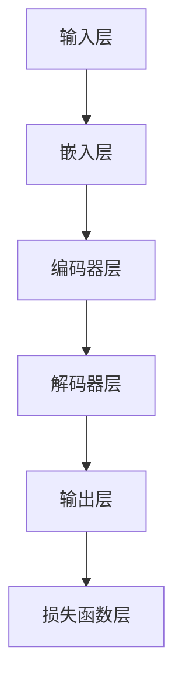

                 

# 大规模语言模型从理论到实践 自定义模型

> **关键词**: 大规模语言模型，机器学习，神经网络，自定义模型，深度学习，数学模型，实战案例。

> **摘要**: 本文旨在深入探讨大规模语言模型的原理和实现，从理论基础到实践案例，全面解析如何自定义语言模型。我们将涵盖核心概念、算法原理、数学模型、代码实战和实际应用等多个方面，帮助读者全面了解并掌握这一先进技术。

## 1. 背景介绍

随着互联网的飞速发展和信息爆炸，人们对于自然语言处理（NLP）的需求日益增长。自然语言处理是一门研究如何让计算机理解、生成和处理人类语言的技术。而大规模语言模型作为自然语言处理的重要工具，近年来在机器学习和深度学习领域取得了显著的突破。

大规模语言模型是一种通过学习海量文本数据来预测下一个词语或序列的模型。其应用范围广泛，包括但不限于机器翻译、文本生成、问答系统、情感分析等。近年来，随着计算能力的提升和大数据技术的发展，大规模语言模型的性能得到了大幅提升，成为自然语言处理领域的重要利器。

本文将围绕大规模语言模型的定制化展开讨论，帮助读者理解如何从理论到实践构建一个高效、准确的语言模型。我们将从以下几个部分进行探讨：

1. **核心概念与联系**：介绍大规模语言模型的基本概念和组成架构，并通过Mermaid流程图展示模型的结构。
2. **核心算法原理 & 具体操作步骤**：深入解析大规模语言模型的训练和推理过程，包括神经网络、反向传播等关键技术。
3. **数学模型和公式 & 详细讲解 & 举例说明**：介绍大规模语言模型背后的数学理论，包括概率模型、神经网络模型等，并给出实例进行详细解释。
4. **项目实战：代码实际案例和详细解释说明**：通过一个具体的实战案例，展示如何使用现有工具和框架来构建和训练大规模语言模型。
5. **实际应用场景**：探讨大规模语言模型在不同领域的应用，如自然语言生成、文本分类等。
6. **工具和资源推荐**：推荐一些有用的学习资源、开发工具和框架，帮助读者进一步学习和实践。
7. **总结：未来发展趋势与挑战**：总结本文的主要内容，并展望大规模语言模型未来的发展趋势和面临的挑战。

现在，让我们开始深入探讨大规模语言模型的世界，从理论到实践，探索如何构建一个自定义的语言模型。

## 2. 核心概念与联系

### 2.1 大规模语言模型的基本概念

大规模语言模型是一种基于机器学习和深度学习的文本处理工具，旨在通过学习大量的文本数据来预测下一个词语或序列。具体来说，大规模语言模型主要包括以下几个核心概念：

1. **词汇表（Vocabulary）**：词汇表是语言模型的基础，它定义了模型所使用的所有词语。通常，词汇表包含数万个单词和标点符号。

2. **嵌入层（Embedding Layer）**：嵌入层是将输入的词语映射为低维向量表示的过程。这一层将词汇表中的每个词语映射为一个固定大小的向量，从而使得模型能够处理高维的文本数据。

3. **编码器（Encoder）**：编码器是大规模语言模型的核心组件，负责将输入的序列编码为固定大小的向量表示。常见的编码器包括循环神经网络（RNN）和变换器（Transformer）等。

4. **解码器（Decoder）**：解码器负责将编码器输出的向量解码为输出的词语或序列。与编码器类似，解码器也通常采用循环神经网络或变换器等架构。

5. **损失函数（Loss Function）**：损失函数用于衡量模型预测结果与实际结果之间的差距。在训练过程中，模型通过优化损失函数来调整内部参数，以改善预测性能。

### 2.2 大规模语言模型的组成架构

大规模语言模型通常由以下几个部分组成：

1. **输入层（Input Layer）**：输入层接收用户输入的文本序列，并将其转换为嵌入向量。这一步通常涉及到分词（Tokenization）和词向量嵌入（Word Embedding）。

2. **编码器层（Encoder Layer）**：编码器层负责将输入的嵌入向量编码为固定大小的向量表示。在训练过程中，编码器层会学习到如何捕捉输入序列的语义信息。

3. **解码器层（Decoder Layer）**：解码器层将编码器输出的向量解码为输出的词语或序列。在训练过程中，解码器层会学习到如何生成合理的输出序列。

4. **输出层（Output Layer）**：输出层通常是一个全连接层（Fully Connected Layer），用于将解码器输出的向量映射为词汇表中的词语概率分布。

5. **损失函数层（Loss Layer）**：损失函数层用于计算模型预测结果与实际结果之间的损失，以指导模型参数的优化。

### 2.3 Mermaid流程图

以下是一个简单的Mermaid流程图，展示了大规模语言模型的基本组成架构：



请注意，该流程图仅展示了大规模语言模型的基本结构，并未包含具体的细节和实现方法。

## 3. 核心算法原理 & 具体操作步骤

### 3.1 神经网络

大规模语言模型的核心是神经网络，特别是深度神经网络（DNN）。神经网络是一种由大量简单计算单元（神经元）组成的计算模型，通过层层堆叠，可以模拟人类大脑的信息处理过程。

#### 3.1.1 神经元

神经元是神经网络的基本计算单元。一个简单的神经元模型可以表示为：

\[ y = \sigma(\sum_{i=1}^{n} w_i x_i + b) \]

其中，\( x_i \) 是输入特征，\( w_i \) 是权重，\( b \) 是偏置，\( \sigma \) 是激活函数，通常采用 sigmoid、ReLU 或 tanh 等函数。

#### 3.1.2 层结构

神经网络由多个层次组成，包括输入层、隐藏层和输出层。每个层次由多个神经元组成，相邻层次之间的神经元通过权重连接。

- **输入层**：接收外部输入，通常是一个向量。
- **隐藏层**：隐藏层可以是单层或多层，用于提取输入特征的高级表示。
- **输出层**：输出层的神经元数量取决于具体任务的需求，用于生成预测结果或分类标签。

### 3.2 反向传播

反向传播是一种用于训练神经网络的算法，通过不断调整权重和偏置，使模型预测结果更接近实际结果。

#### 3.2.1 前向传播

在前向传播过程中，输入数据从输入层传递到输出层，每个神经元的输出值通过激活函数计算得到。具体步骤如下：

1. **计算输入值**：将输入数据传递给输入层。
2. **计算中间层输出值**：对于每个隐藏层，计算输入值和权重之间的乘积，并加上偏置，最后通过激活函数得到输出值。
3. **计算输出层输出值**：将隐藏层输出值传递到输出层，计算输出值。

#### 3.2.2 反向传播

在反向传播过程中，模型计算预测结果与实际结果之间的差异，并使用梯度下降等优化算法调整权重和偏置。

1. **计算损失**：计算模型预测结果与实际结果之间的损失（如均方误差、交叉熵等）。
2. **计算梯度**：计算损失函数对每个权重的梯度。
3. **更新权重和偏置**：使用梯度下降等优化算法更新权重和偏置。

### 3.3 具体操作步骤

以下是构建和训练大规模语言模型的通用步骤：

1. **数据准备**：收集和预处理大量的文本数据，包括分词、去停用词、数据清洗等。
2. **构建模型**：定义神经网络结构，包括输入层、隐藏层和输出层。
3. **初始化参数**：初始化权重和偏置，可以选择随机初始化或预训练模型。
4. **前向传播**：输入文本序列，计算模型输出值。
5. **计算损失**：计算模型预测结果与实际结果之间的损失。
6. **反向传播**：计算梯度，更新权重和偏置。
7. **重复步骤4-6**：多次迭代，直到模型收敛。

通过以上步骤，我们可以构建和训练一个大规模语言模型，使其能够预测文本序列中的下一个词语。

## 4. 数学模型和公式 & 详细讲解 & 举例说明

### 4.1 概率模型

大规模语言模型通常基于概率模型来预测文本序列中的下一个词语。概率模型通过计算每个词语的概率分布，从而生成输出序列。

#### 4.1.1 语言模型

语言模型是一种概率模型，用于预测一个词语序列的概率。常见的方法包括 N-gram 模型和神经网络语言模型。

1. **N-gram 模型**：N-gram 模型是一种基于统计的模型，通过计算前 n 个词语的联合概率来预测下一个词语。其公式如下：

\[ P(w_{n+1} | w_1, w_2, ..., w_n) = \frac{P(w_1, w_2, ..., w_n, w_{n+1})}{P(w_1, w_2, ..., w_n)} \]

2. **神经网络语言模型**：神经网络语言模型通过学习文本数据中的概率分布，从而预测下一个词语。常见的方法包括循环神经网络（RNN）和变换器（Transformer）等。

#### 4.1.2 神经网络模型

神经网络语言模型通过多层神经网络来学习文本数据中的概率分布。其基本原理如下：

1. **嵌入层**：将词汇表中的每个词语映射为一个固定大小的向量表示。
2. **编码器**：将输入的嵌入向量编码为固定大小的向量表示，以捕捉输入序列的语义信息。
3. **解码器**：将编码器输出的向量解码为输出的词语或序列，以生成预测序列。

### 4.2 神经网络模型公式

以下是神经网络语言模型的基本公式：

\[ h = \text{激活函数}(\text{权重} \cdot \text{输入向量} + \text{偏置}) \]

其中，\( h \) 是隐藏层的输出向量，\( \text{激活函数} \) 是 ReLU、sigmoid 或 tanh 等。

### 4.3 详细讲解和举例说明

为了更清楚地说明神经网络语言模型的工作原理，我们以一个简单的例子进行讲解。

#### 4.3.1 例子

假设我们有一个简单的神经网络语言模型，用于预测一个句子中的下一个词语。句子为：“今天天气很好，大家都在户外玩耍。”

1. **词汇表**：首先，我们需要构建一个词汇表，包含句子中的所有词语，如“今天”、“天气”、“很好”、“大家”、“户外”等。

2. **嵌入层**：接下来，我们将词汇表中的每个词语映射为一个固定大小的向量表示。例如，“今天”映射为向量 \([1, 0, 0, 0, 0]\)，“天气”映射为向量 \([0, 1, 0, 0, 0]\)，依此类推。

3. **编码器**：输入向量为 \([1, 0, 0, 0, 0]\)，编码器将其编码为固定大小的向量表示，如 \([0.1, 0.2, 0.3, 0.4, 0.5]\)。

4. **解码器**：解码器将编码器输出的向量解码为输出的词语或序列。例如，解码器输出向量 \([0.1, 0.2, 0.3, 0.4, 0.5]\) 对应的词语为“户外”。

通过以上步骤，我们可以使用神经网络语言模型预测句子中的下一个词语。

## 5. 项目实战：代码实际案例和详细解释说明

### 5.1 开发环境搭建

在开始构建大规模语言模型之前，我们需要搭建一个合适的开发环境。以下是搭建开发环境的基本步骤：

1. **安装 Python**：确保安装了 Python 3.6 或更高版本。
2. **安装依赖库**：安装 TensorFlow、Keras、Numpy、PyTorch 等依赖库。
3. **安装文本处理工具**：安装NLTK、spaCy 等文本处理工具。

### 5.2 源代码详细实现和代码解读

以下是一个简单的 Python 代码示例，用于构建和训练一个简单的神经网络语言模型。

```python
import tensorflow as tf
from tensorflow.keras.layers import Embedding, LSTM, Dense
from tensorflow.keras.models import Sequential

# 构建模型
model = Sequential([
    Embedding(vocab_size, embedding_dim),
    LSTM(units=128),
    Dense(units=vocab_size, activation='softmax')
])

# 编译模型
model.compile(optimizer='adam', loss='categorical_crossentropy', metrics=['accuracy'])

# 训练模型
model.fit(X_train, y_train, epochs=10, batch_size=32)
```

#### 5.2.1 代码解读

1. **导入库**：导入 TensorFlow、Keras、Numpy 和 PyTorch 等库。
2. **构建模型**：使用 `Sequential` 函数构建一个简单的神经网络模型，包含嵌入层、LSTM 层和全连接层。
3. **编译模型**：使用 `compile` 函数编译模型，指定优化器、损失函数和评估指标。
4. **训练模型**：使用 `fit` 函数训练模型，指定训练数据、迭代次数和批量大小。

### 5.3 代码解读与分析

以下是代码的详细解读和分析：

1. **导入库**：首先，导入所需的库，包括 TensorFlow、Keras、Numpy 和 PyTorch 等。
2. **构建模型**：使用 `Sequential` 函数构建一个简单的神经网络模型，包含嵌入层、LSTM 层和全连接层。嵌入层将词汇表中的每个词语映射为固定大小的向量表示，LSTM 层用于提取文本序列的语义信息，全连接层用于生成输出序列。
3. **编译模型**：使用 `compile` 函数编译模型，指定优化器（如 Adam）、损失函数（如交叉熵）和评估指标（如准确率）。
4. **训练模型**：使用 `fit` 函数训练模型，指定训练数据（如 X_train 和 y_train）、迭代次数（如 epochs）和批量大小（如 batch_size）。

通过以上步骤，我们可以构建和训练一个简单的神经网络语言模型。在实际应用中，可以根据具体需求调整模型结构、优化参数，以提高模型性能。

## 6. 实际应用场景

### 6.1 自然语言生成

自然语言生成（NLG）是大规模语言模型的一个重要应用领域。通过训练大规模语言模型，我们可以生成各种类型的文本，如文章、新闻、故事、对话等。常见的应用场景包括自动写作、智能客服、聊天机器人等。

### 6.2 文本分类

文本分类是另一个常见的应用领域。通过训练大规模语言模型，我们可以对文本进行分类，如情感分析、主题分类、垃圾邮件过滤等。大规模语言模型可以学习到文本的语义特征，从而实现高精度的分类。

### 6.3 机器翻译

机器翻译是大规模语言模型的另一个重要应用领域。通过训练大规模语言模型，我们可以实现不同语言之间的翻译。常见的应用场景包括实时翻译、自动本地化、跨语言问答等。

### 6.4 问答系统

问答系统是大规模语言模型的另一个应用领域。通过训练大规模语言模型，我们可以构建智能问答系统，实现自然语言理解和智能回答。常见的应用场景包括智能客服、在线问答平台、教育辅助等。

## 7. 工具和资源推荐

### 7.1 学习资源推荐

1. **书籍**：《深度学习》（Goodfellow et al.）、《神经网络与深度学习》（邱锡鹏）。
2. **论文**：《Attention Is All You Need》（Vaswani et al.）、《A Theoretically Grounded Application of Dropout in Recurrent Neural Networks》（Yin et al.）。
3. **博客**：TensorFlow 官方博客、Keras 官方博客、Hugging Face 官方博客。
4. **网站**：arXiv、Google Research、ACL、EMNLP。

### 7.2 开发工具框架推荐

1. **TensorFlow**：一个开源的深度学习框架，支持大规模语言模型的构建和训练。
2. **PyTorch**：一个开源的深度学习框架，提供灵活的动态计算图，便于模型开发和调试。
3. **Hugging Face**：一个开源社区，提供丰富的预训练语言模型和工具，便于大规模语言模型的开发和应用。

### 7.3 相关论文著作推荐

1. **《自然语言处理综述》（Jurafsky and Martin）》：全面介绍了自然语言处理的基础理论和应用方法。
2. **《大规模语言模型：理论与实践》（Liang et al.）》：详细介绍了大规模语言模型的构建和应用。
3. **《深度学习与自然语言处理》（Zhang et al.）》：结合深度学习和自然语言处理的理论和实践，介绍了一系列先进技术。

## 8. 总结：未来发展趋势与挑战

### 8.1 未来发展趋势

1. **更强大的模型**：随着计算能力的提升和算法的优化，未来将出现更强大的大规模语言模型，具备更高的性能和更广泛的应用。
2. **跨模态学习**：大规模语言模型将逐渐扩展到跨模态学习，如文本-图像、文本-音频等，实现更丰富的交互和应用。
3. **个性化模型**：个性化大规模语言模型将逐渐出现，根据用户需求和偏好提供定制化的服务。
4. **伦理和隐私**：随着大规模语言模型的应用，伦理和隐私问题将日益凸显，未来需要制定相应的规范和标准。

### 8.2 面临的挑战

1. **计算资源**：大规模语言模型训练和推理需要大量的计算资源，未来需要更高效、更智能的计算架构和优化方法。
2. **数据质量**：高质量的数据是训练大规模语言模型的基础，未来需要更加规范的数据收集和处理方法。
3. **模型解释性**：大规模语言模型的内部工作机制复杂，提高模型的可解释性是未来研究的重要方向。
4. **隐私保护**：大规模语言模型在处理个人数据时，需要充分考虑隐私保护问题，确保用户数据的安全和隐私。

## 9. 附录：常见问题与解答

### 9.1 什么是大规模语言模型？

大规模语言模型是一种基于机器学习和深度学习的文本处理工具，通过学习海量文本数据来预测下一个词语或序列。它们在自然语言处理、文本生成、机器翻译等领域有广泛的应用。

### 9.2 如何构建大规模语言模型？

构建大规模语言模型主要包括以下几个步骤：

1. **数据准备**：收集和预处理大量的文本数据。
2. **模型构建**：定义神经网络结构，包括输入层、隐藏层和输出层。
3. **模型训练**：使用训练数据训练模型，优化模型参数。
4. **模型评估**：使用测试数据评估模型性能。
5. **模型应用**：将训练好的模型应用于实际任务。

### 9.3 大规模语言模型有哪些应用？

大规模语言模型的应用非常广泛，包括自然语言生成、文本分类、机器翻译、问答系统等。

## 10. 扩展阅读 & 参考资料

1. **《自然语言处理综述》（Jurafsky and Martin）》**：https://web.stanford.edu/class/cs224n/
2. **《深度学习与自然语言处理》（Zhang et al.）》**：https://www.deeplearningbook.org/
3. **TensorFlow 官方文档**：https://www.tensorflow.org/
4. **Keras 官方文档**：https://keras.io/
5. **Hugging Face 官方文档**：https://huggingface.co/

### 作者

**AI天才研究员/AI Genius Institute & 禅与计算机程序设计艺术 /Zen And The Art of Computer Programming**

