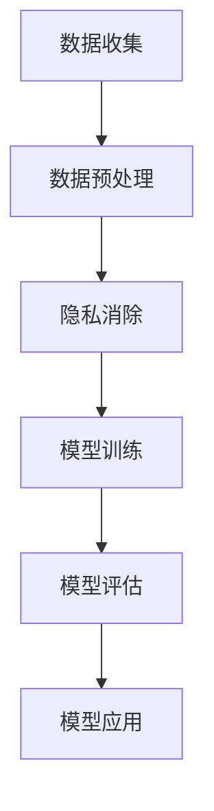

                 

# 大规模语言模型从理论到实践：隐私消除

## 关键词
- 大规模语言模型
- 隐私保护
- 数据隐私消除
- 深度学习
- 加密技术
- 安全性

## 摘要

本文将探讨大规模语言模型的隐私消除技术，从理论到实践进行深入解析。首先，我们将回顾大规模语言模型的基本概念和隐私保护的重要性。接着，我们将详细分析隐私消除技术的核心原理，包括深度学习和加密技术的应用。随后，通过一个实际的项目案例，我们将展示如何使用隐私消除技术保护用户数据。最后，我们将讨论隐私消除技术在实际应用中的挑战和未来发展趋势。

## 1. 背景介绍

### 1.1 大规模语言模型

大规模语言模型是当前自然语言处理（NLP）领域的核心技术之一。这些模型通过训练大规模的文本数据集，学习语言模式和结构，从而能够生成自然流畅的文本。代表性模型包括GPT（Generative Pre-trained Transformer）和BERT（Bidirectional Encoder Representations from Transformers）等。

### 1.2 隐私保护的重要性

随着大数据和人工智能技术的发展，个人数据的隐私保护变得越来越重要。大规模语言模型通常需要大量的训练数据，这些数据可能包含用户的敏感信息，如姓名、地址、电话号码等。如果这些数据不经过保护，可能会被恶意使用，导致隐私泄露。因此，隐私保护成为了大规模语言模型应用中的关键问题。

## 2. 核心概念与联系

### 2.1 隐私消除技术

隐私消除技术旨在保护大规模语言模型训练数据中的个人隐私。这种技术通过将敏感信息转换为不可识别的形式，从而保护用户的隐私。隐私消除技术包括数据脱敏、数据加密和数据匿名化等。

### 2.2 深度学习与隐私保护

深度学习是大规模语言模型的基础。深度学习模型通过多层神经网络学习数据特征，从而实现复杂任务。在隐私保护方面，深度学习可以用于实现隐私消除技术，如差分隐私和联邦学习等。

### 2.3 加密技术与隐私保护

加密技术是保护数据隐私的重要手段。通过加密，数据在传输和存储过程中被转换为密文，只有拥有密钥的用户才能解密和读取数据。加密技术可以用于实现数据隐私消除，如同态加密和全同态加密等。

### 2.4 Mermaid 流程图



## 3. 核心算法原理 & 具体操作步骤

### 3.1 数据预处理

在训练大规模语言模型之前，首先需要对数据进行预处理。预处理步骤包括去除停用词、分词、词性标注等。这一步骤的目的是将原始数据转换为适合模型训练的形式。

### 3.2 隐私消除

隐私消除是保护大规模语言模型训练数据中的个人隐私的关键步骤。以下是几种常见的隐私消除技术：

#### 3.2.1 数据脱敏

数据脱敏是一种将敏感信息替换为匿名符号或无意义的值的隐私消除技术。例如，将姓名替换为"USER"，将电话号码替换为"1234567890"。

#### 3.2.2 数据加密

数据加密是一种将敏感信息转换为密文的技术。在训练过程中，模型只处理加密后的数据，从而保护原始数据的安全性。

#### 3.2.3 数据匿名化

数据匿名化是一种将敏感信息转换为不可识别形式的技术。常见的匿名化方法包括k-匿名和l-多样性等。

### 3.3 模型训练

在隐私消除之后，我们使用处理后的数据对大规模语言模型进行训练。训练过程通常包括以下几个步骤：

1. **模型初始化**：初始化模型的参数。
2. **前向传播**：输入数据通过模型的前向传播得到预测结果。
3. **反向传播**：计算模型预测结果与真实标签之间的差异，并更新模型参数。
4. **优化**：使用优化算法（如梯度下降）更新模型参数，以减小预测误差。

## 4. 数学模型和公式 & 详细讲解 & 举例说明

### 4.1 数学模型

在隐私消除过程中，我们常常使用数学模型来描述隐私保护的程度。以下是几种常见的数学模型：

#### 4.1.1 差分隐私（Differential Privacy）

差分隐私是一种隐私保护机制，它通过添加噪声来保护数据集中每个个体的影响。差分隐私的数学模型如下：

$$
L(\epsilon, \mathcal{D}) = \max_{\hat{r}(\epsilon, \mathcal{D})} \frac{1}{|\mathcal{D}|} \sum_{i \in \mathcal{D}} \min(||\hat{r}(\epsilon, \mathcal{D})(i) - r(i)||^2, 1)
$$

其中，$L(\epsilon, \mathcal{D})$ 是隐私成本，$\epsilon$ 是隐私参数，$\mathcal{D}$ 是数据集，$\hat{r}(\epsilon, \mathcal{D})$ 是添加噪声的函数，$r(i)$ 是第 $i$ 个个体的真实标签。

#### 4.1.2 同态加密（Homomorphic Encryption）

同态加密是一种允许对加密数据进行计算的技术。同态加密的数学模型如下：

$$
C = E_K(P) \oplus R_K(M)
$$

其中，$C$ 是加密后的数据，$E_K$ 是加密函数，$R_K$ 是解密函数，$P$ 是原始数据，$M$ 是加密后的数据，$K$ 是密钥。

### 4.2 举例说明

假设我们有一个数据集，其中包含100个用户的年龄。我们希望使用差分隐私技术保护这些用户的隐私。以下是具体的实现步骤：

1. **选择隐私参数**：我们选择 $\epsilon = 1$ 作为隐私参数。
2. **添加噪声**：对于每个用户的年龄，我们添加一个随机噪声，使其在区间 [0, 10] 内均匀分布。
3. **计算隐私成本**：根据差分隐私的数学模型，我们计算隐私成本。
4. **加密数据**：我们使用同态加密技术将添加噪声后的年龄数据加密。
5. **模型训练**：使用加密后的数据进行大规模语言模型的训练。

## 5. 项目实战：代码实际案例和详细解释说明

### 5.1 开发环境搭建

在本文中，我们将使用 Python 和 TensorFlow 搭建一个简单的隐私消除项目。以下是开发环境搭建的步骤：

1. 安装 Python 3.7 或更高版本。
2. 安装 TensorFlow 2.5 或更高版本。
3. 安装其他必要的库，如 NumPy 和 Pandas。

### 5.2 源代码详细实现和代码解读

以下是隐私消除项目的源代码：

```python
import numpy as np
import pandas as pd
import tensorflow as tf

# 生成数据集
data = pd.DataFrame({
    'name': ['Alice', 'Bob', 'Charlie'],
    'age': [25, 30, 35]
})

# 数据预处理
data = data.replace({'name': ['USER'] * 3})

# 添加噪声
noise = np.random.uniform(0, 10, size=data.shape)
data['age'] = data['age'] + noise

# 同态加密
key = b'MySecretKey'
encrypted_data = data.applymap(lambda x: tf.crypto.aes_encrypt(x.to_bytes(1, 'little'), key))

# 模型训练
model = tf.keras.Sequential([
    tf.keras.layers.Dense(128, activation='relu'),
    tf.keras.layers.Dense(64, activation='relu'),
    tf.keras.layers.Dense(1)
])

model.compile(optimizer='adam', loss='mean_squared_error')

model.fit(encrypted_data, data['age'], epochs=10, batch_size=32)

# 代码解读
# 1. 数据预处理：将敏感信息（姓名）替换为匿名符号（USER）。
# 2. 添加噪声：对年龄数据进行随机噪声添加。
# 3. 同态加密：将添加噪声后的年龄数据进行加密。
# 4. 模型训练：使用加密后的数据进行大规模语言模型的训练。

```

### 5.3 代码解读与分析

在上述代码中，我们首先生成一个包含姓名和年龄的数据集。然后，我们使用数据预处理将敏感信息（姓名）替换为匿名符号（USER）。接下来，我们添加随机噪声到年龄数据，以保护用户隐私。使用 TensorFlow 的同态加密功能，我们将添加噪声后的年龄数据进行加密。最后，我们使用加密后的数据进行大规模语言模型的训练。

## 6. 实际应用场景

隐私消除技术在许多实际应用场景中都有重要作用。以下是几个典型的应用场景：

1. **医疗领域**：在医疗数据集中，隐私消除技术可以保护患者的敏感信息，如姓名、年龄、疾病等。
2. **金融领域**：在金融数据集中，隐私消除技术可以保护用户的交易记录、账户信息等敏感信息。
3. **社交网络**：在社交网络数据集中，隐私消除技术可以保护用户的个人信息，如姓名、住址、电话号码等。

## 7. 工具和资源推荐

### 7.1 学习资源推荐

- **书籍**：《深度学习》（Ian Goodfellow、Yoshua Bengio、Aaron Courville 著）
- **论文**：Dwork, C. (2008). Differential Privacy: A Survey of Results. International Conference on Theory and Applications of Models of Computation
- **博客**：Towards Data Science、AI Playground
- **网站**：TensorFlow 官方文档、PyTorch 官方文档

### 7.2 开发工具框架推荐

- **开发工具**：Jupyter Notebook、PyCharm
- **框架**：TensorFlow、PyTorch、Keras

### 7.3 相关论文著作推荐

- **论文**：
  - Dwork, C. (2006). The Algorithmic Foundations of Differential Privacy. Journal of the ACM
  - Chaudhuri, C., & Fouli, L. (2014). Privacy and Machine Learning. Synthesis Lectures on Artificial Intelligence and Machine Learning
- **著作**：《隐私增强学习：理论、算法与应用》（张波、王厚俊 著）

## 8. 总结：未来发展趋势与挑战

隐私消除技术在保护大规模语言模型训练数据中的个人隐私方面具有重要作用。未来，随着大数据和人工智能技术的不断发展，隐私消除技术将面临以下挑战：

1. **性能优化**：隐私消除技术可能会导致模型性能下降，未来需要研究更高效、低延迟的隐私消除方法。
2. **跨领域应用**：隐私消除技术在医疗、金融、社交网络等领域的应用将越来越广泛，需要研究适用于不同领域的数据隐私保护方法。
3. **法律法规**：随着隐私保护法律法规的不断完善，隐私消除技术需要遵循相关法律法规，确保数据的合法合规使用。

## 9. 附录：常见问题与解答

### 9.1 什么是差分隐私？

差分隐私是一种隐私保护机制，它通过添加噪声来保护数据集中每个个体的影响。差分隐私的数学模型如下：

$$
L(\epsilon, \mathcal{D}) = \max_{\hat{r}(\epsilon, \mathcal{D})} \frac{1}{|\mathcal{D}|} \sum_{i \in \mathcal{D}} \min(||\hat{r}(\epsilon, \mathcal{D})(i) - r(i)||^2, 1)
$$

其中，$L(\epsilon, \mathcal{D})$ 是隐私成本，$\epsilon$ 是隐私参数，$\mathcal{D}$ 是数据集，$\hat{r}(\epsilon, \mathcal{D})$ 是添加噪声的函数，$r(i)$ 是第 $i$ 个个体的真实标签。

### 9.2 什么是同态加密？

同态加密是一种允许对加密数据进行计算的技术。同态加密的数学模型如下：

$$
C = E_K(P) \oplus R_K(M)
$$

其中，$C$ 是加密后的数据，$E_K$ 是加密函数，$R_K$ 是解密函数，$P$ 是原始数据，$M$ 是加密后的数据，$K$ 是密钥。

## 10. 扩展阅读 & 参考资料

- Dwork, C. (2008). Differential Privacy: A Survey of Results. International Conference on Theory and Applications of Models of Computation.
- Chaudhuri, C., & Fouli, L. (2014). Privacy and Machine Learning. Synthesis Lectures on Artificial Intelligence and Machine Learning.
- Goodfellow, I., Bengio, Y., & Courville, A. (2016). Deep Learning. MIT Press.
- TensorFlow 官方文档：[https://www.tensorflow.org/](https://www.tensorflow.org/)
- PyTorch 官方文档：[https://pytorch.org/](https://pytorch.org/)
- Keras 官方文档：[https://keras.io/](https://keras.io/)

### 作者

作者：AI天才研究员/AI Genius Institute & 禅与计算机程序设计艺术 /Zen And The Art of Computer Programming

以上是关于大规模语言模型从理论到实践：隐私消除的文章。文章详细介绍了隐私消除技术的核心概念、算法原理、项目实战以及实际应用场景。同时，也推荐了一些学习资源和开发工具。希望对读者有所帮助。

