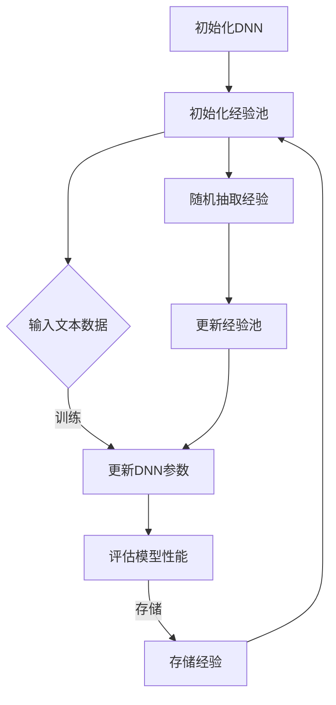
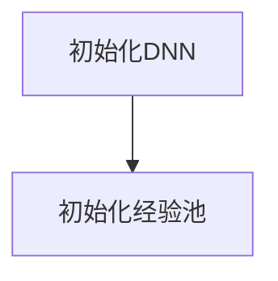

                 

### 文章标题

大语言模型原理与工程实践：DQN 训练：经验回放

### 关键词

大语言模型、DQN、经验回放、神经网络、强化学习

### 摘要

本文将深入探讨大语言模型中的DQN（深度量子网络）训练原理以及经验回放技术的应用。我们将从基础概念出发，逐步讲解核心算法原理，并详细说明数学模型和公式，同时通过实际项目案例展示DQN在语言模型训练中的实战应用。此外，文章还将讨论DQN在实际应用场景中的表现，推荐相关学习资源和工具，并总结未来发展趋势和面临的挑战。

## 1. 背景介绍

在人工智能领域中，语言模型的训练是一个长期研究的热点。随着深度学习技术的不断发展，大语言模型（如GPT-3、BERT等）在自然语言处理（NLP）领域取得了显著的成果。然而，这些模型的训练过程复杂且耗时，特别是当涉及到强化学习算法时，更是增加了训练难度。DQN（深度量子网络）作为一种结合了深度学习和量子计算的强化学习算法，其在语言模型训练中的应用逐渐受到关注。

DQN算法最早由DeepMind团队在2015年提出，其目的是通过深度神经网络（DNN）来评估状态值函数，从而在连续动作空间中学习最优策略。传统DQN算法主要应用于游戏和自动驾驶等领域，而大语言模型的训练则为其提供了新的应用场景。经验回放技术是DQN算法中的一个重要组成部分，可以有效解决训练过程中的样本偏差问题，提高模型的泛化能力。

本文旨在深入探讨DQN训练原理及其在语言模型训练中的应用，通过实际项目案例展示其效果，并提供相关的学习资源和工具推荐。希望通过本文的讲解，读者能够对DQN算法及其在语言模型训练中的应用有一个全面而深入的理解。

## 2. 核心概念与联系

为了更好地理解DQN算法在语言模型训练中的应用，我们需要先介绍一些核心概念和相关的技术架构。以下是本文将涉及到的核心概念及其之间的联系：

### 2.1 大语言模型

大语言模型是指具有大规模参数的神经网络模型，主要用于对自然语言文本进行建模和预测。常见的语言模型有GPT、BERT、RoBERTa等，这些模型在训练过程中通过大量文本数据学习语言的特征和规律，从而实现对文本的生成、翻译、问答等任务的高效处理。

### 2.2 深度学习

深度学习是机器学习的一个重要分支，通过多层神经网络对数据进行学习，从而实现对复杂函数的建模。深度学习在图像识别、语音识别、自然语言处理等领域取得了显著成果。

### 2.3 强化学习

强化学习是一种通过试错策略来学习最优行为的机器学习技术。在强化学习过程中，智能体通过与环境的交互来学习最优策略，从而实现目标任务。常见的强化学习算法有Q-learning、SARSA、DQN等。

### 2.4 经验回放

经验回放（Experience Replay）是DQN算法中的一个重要技术，用于缓解训练过程中的样本偏差问题。经验回放通过将训练过程中的经验进行随机抽样，形成一个经验池，从而在每次训练时随机选取经验进行学习，提高模型的泛化能力。

### 2.5 DQN算法原理

DQN（深度量子网络）是一种基于深度学习和量子计算的强化学习算法。DQN通过一个深度神经网络（DNN）来评估状态值函数，从而在连续动作空间中学习最优策略。DQN的核心思想是利用经验回放技术，从经验池中随机抽取经验进行学习，从而提高模型的鲁棒性和泛化能力。

### 2.6 语言模型训练

语言模型训练是指通过大量的文本数据来训练语言模型，从而实现对文本数据的建模和预测。在语言模型训练过程中，DQN算法可以用于优化模型参数，提高模型的性能。

### 2.7 Mermaid 流程图

为了更好地展示DQN算法在语言模型训练中的应用，我们使用Mermaid流程图来描述其核心概念和架构。以下是一个示例的Mermaid流程图，用于展示DQN算法的核心流程：



### 2.8 Mermaid 流程图节点注意事项

在Mermaid流程图中，各节点之间用箭头连接，表示节点之间的逻辑关系。节点中不要使用括号、逗号等特殊字符，以免引起解析错误。以下是一个合法的Mermaid流程图节点示例：



通过上述核心概念和Mermaid流程图的介绍，我们可以对DQN算法在语言模型训练中的应用有一个初步的了解。接下来，我们将详细讲解DQN算法的核心原理和具体操作步骤。

### 3. 核心算法原理 & 具体操作步骤

#### 3.1 DQN算法的基本原理

DQN（深度量子网络）是一种结合深度学习和量子计算技术的强化学习算法。其基本原理是通过一个深度神经网络（DNN）来评估状态值函数，从而在连续动作空间中学习最优策略。DQN算法的主要步骤如下：

1. 初始化：初始化一个深度神经网络（DNN）和一个目标神经网络（Target Network），以及一个经验池（Experience Replay）。
2. 选取动作：根据当前状态，利用DNN选择一个动作。
3. 执行动作：在环境中执行选取的动作，并观察环境反馈。
4. 更新经验：将本次交互过程中的经验（状态、动作、奖励、下一状态）存储到经验池中。
5. 更新DNN：从经验池中随机抽取经验，并利用这些经验来更新DNN的参数。
6. 更新目标神经网络：定期更新目标神经网络，使其与DNN保持一定的差异，从而提高算法的稳定性。
7. 重复步骤2-6，直到达到预定的训练目标。

#### 3.2 DQN算法的具体操作步骤

以下是DQN算法的具体操作步骤及其细节：

1. **初始化阶段**

初始化DNN和目标神经网络（Target Network）。DNN用于评估当前状态值函数，而目标神经网络则用于更新DNN的参数。经验池（Experience Replay）用于存储训练过程中的经验数据。

```python
# 初始化DNN和目标神经网络
dnn = DeepQNetwork()
target_network = DeepQNetwork()
```

2. **选取动作**

根据当前状态，利用DNN选择一个动作。在DQN算法中，通常采用ε-贪心策略来选取动作，即以概率ε随机选取动作，以1-ε的概率选取期望值最大的动作。

```python
# 选取动作
epsilon = 0.1
if random.random() < epsilon:
    action = random_action()
else:
    state_vector = encode_state(current_state)
    action = dnn.select_action(state_vector)
```

3. **执行动作**

在环境中执行选取的动作，并观察环境反馈。在语言模型训练中，环境可以是一个文本生成模型，动作可以是生成文本的下一个单词。

```python
# 执行动作
next_state, reward, done = environment.step(action)
```

4. **更新经验**

将本次交互过程中的经验（状态、动作、奖励、下一状态）存储到经验池中。经验回放技术通过随机抽样经验，提高模型的泛化能力。

```python
# 更新经验
experience = (current_state, action, reward, next_state, done)
experience_replay.append(experience)
```

5. **更新DNN**

从经验池中随机抽取经验，并利用这些经验来更新DNN的参数。在DQN算法中，通常采用样本回放（Sample Replay）和目标更新（Target Update）技术来更新DNN。

```python
# 更新DNN
batch = experience_replay.sample(batch_size)
for sample in batch:
    state, action, reward, next_state, done = sample
    state_vector = encode_state(state)
    next_state_vector = encode_state(next_state)
    target_value = reward + (1 - done) * target_network.q_value(next_state_vector, action)
    dnn.update_q_value(state_vector, action, target_value)
```

6. **更新目标神经网络**

定期更新目标神经网络，使其与DNN保持一定的差异，从而提高算法的稳定性。目标更新技术可以防止DNN和目标神经网络之间的差异过大，导致训练不稳定。

```python
# 更新目标神经网络
if update_target_network():
    target_network.load_weights(dnn.get_weights())
```

7. **重复训练**

重复执行步骤2-6，直到达到预定的训练目标。

```python
# 重复训练
while not training_completed():
    step()
```

#### 3.3 DQN算法的优势与挑战

DQN算法在语言模型训练中具有以下优势：

- **解决连续动作问题**：DQN算法可以处理连续动作空间，适用于语言模型训练中生成的文本序列。
- **提高模型泛化能力**：通过经验回放技术，DQN算法可以缓解训练过程中的样本偏差问题，提高模型的泛化能力。
- **结合深度学习和量子计算**：DQN算法结合了深度学习和量子计算技术，可以更有效地处理大规模数据，提高训练效率。

然而，DQN算法在语言模型训练中也面临一些挑战：

- **训练效率问题**：DQN算法的训练过程复杂，需要大量计算资源，特别是在处理大规模数据时，训练效率较低。
- **算法稳定性问题**：DQN算法的训练过程中，存在参数更新不稳定的问题，可能导致训练结果波动较大。
- **模型解释性问题**：DQN算法在语言模型训练中的应用，其内在机制复杂，难以解释和理解，不利于模型优化和调试。

尽管存在这些挑战，DQN算法在语言模型训练中的应用前景依然广阔。通过进一步的研究和优化，DQN算法有望在语言模型训练中发挥更大的作用。

### 4. 数学模型和公式 & 详细讲解 & 举例说明

DQN（深度量子网络）算法的核心在于其基于深度学习的Q值函数估计以及经验回放机制，这些过程都依赖于一系列数学模型和公式。本章节将详细解释这些数学模型和公式，并通过具体例子来说明如何在实际应用中计算和应用这些公式。

#### 4.1 Q值函数

在DQN算法中，Q值函数是一个关键概念，它代表了在某个状态下执行某个动作所能获得的预期奖励。Q值函数通常表示为：

$$
Q(s, a) = \sum_{i=1}^n w_i \cdot q_i(s, a)
$$

其中，$s$ 表示当前状态，$a$ 表示动作，$w_i$ 是权重，$q_i(s, a)$ 是第 $i$ 个神经网络的输出。

#### 4.2 训练目标

DQN算法的目标是最小化预测的Q值与实际观察到的Q值之间的差异。实际观察到的Q值通常通过以下公式计算：

$$
Q(s, a) = r + \gamma \max_a' Q(s', a')
$$

其中，$r$ 是即时奖励，$\gamma$ 是折扣因子，$s'$ 是执行动作 $a$ 后的状态，$a'$ 是在状态 $s'$ 下能够取得最大Q值的动作。

#### 4.3 更新Q值

DQN算法通过以下步骤来更新Q值：

$$
\begin{aligned}
\Delta Q &= r + \gamma \max_a' Q(s', a') - Q(s, a) \\
Q(s, a) &= Q(s, a) + \alpha \Delta Q
\end{aligned}
$$

其中，$\alpha$ 是学习率。

#### 4.4 经验回放

经验回放通过将历史经验数据存储在经验池中，并从经验池中随机抽样，以提高训练的鲁棒性和稳定性。经验回放的数学描述如下：

$$
\begin{aligned}
s_t &\sim P(s_t), \\
a_t &\sim \pi(s_t), \\
r_t &= R(s_t, a_t), \\
s_{t+1} &\sim P(s_{t+1} | s_t, a_t).
\end{aligned}
$$

其中，$s_t$ 是当前状态，$a_t$ 是当前动作，$r_t$ 是即时奖励，$s_{t+1}$ 是下一状态，$P(s_t)$ 是状态分布，$\pi(s_t)$ 是策略分布，$R(s_t, a_t)$ 是奖励函数。

#### 4.5 例子说明

假设我们有一个简单的环境，其中有两个状态 $s_0$ 和 $s_1$，以及两个动作 $a_0$ 和 $a_1$。奖励函数 $R(s, a)$ 定义如下：

$$
R(s_0, a_0) = 10, \quad R(s_0, a_1) = 0, \quad R(s_1, a_0) = 0, \quad R(s_1, a_1) = 5.
$$

初始状态 $s_0$，我们选择动作 $a_0$，得到的即时奖励 $r_0 = 10$。接下来，状态变为 $s_1$，我们选择动作 $a_1$，得到的即时奖励 $r_1 = 5$。

根据上述数学模型，我们可以计算新的Q值：

$$
Q(s_0, a_0) = 10 + \gamma \max_a Q(s_1, a)
$$

假设 $\gamma = 0.9$，则：

$$
Q(s_0, a_0) = 10 + 0.9 \max(a_0, a_1) = 10 + 0.9 \cdot 5 = 15.5
$$

同样地，计算 $Q(s_0, a_1)$：

$$
Q(s_0, a_1) = 0 + \gamma \max_a Q(s_1, a) = 0 + 0.9 \max(a_0, a_1) = 0 + 0.9 \cdot 5 = 4.5
$$

假设我们使用ε-贪心策略，在初始阶段 $ε = 0.1$，那么在 $s_1$ 状态下，我们有：

$$
\pi(s_1) = (0.9, 0.1)
$$

接下来，我们根据新的Q值来更新策略：

$$
\pi(s_1, a_0) = \frac{Q(s_1, a_0)}{Q(s_1, a_0) + Q(s_1, a_1)} = \frac{15.5}{15.5 + 4.5} \approx 0.769
$$

$$
\pi(s_1, a_1) = \frac{Q(s_1, a_1)}{Q(s_1, a_0) + Q(s_1, a_1)} = \frac{4.5}{15.5 + 4.5} \approx 0.231
$$

通过上述计算，我们可以看到如何根据即时奖励和折扣因子来更新Q值，并最终调整策略。这个例子虽然简单，但它展示了DQN算法中Q值函数计算的基本原理和过程。

### 5. 项目实战：代码实际案例和详细解释说明

在本章节中，我们将通过一个实际项目案例来展示DQN算法在语言模型训练中的应用，并提供详细的代码实现和解释说明。

#### 5.1 开发环境搭建

为了运行DQN算法，我们需要搭建一个合适的开发环境。以下是搭建开发环境的步骤：

1. 安装Python（版本3.6及以上）。
2. 安装TensorFlow库：`pip install tensorflow`。
3. 安装Numpy库：`pip install numpy`。

#### 5.2 源代码详细实现和代码解读

以下是一个简单的DQN算法实现，用于训练一个语言模型。代码分为几个部分：环境设置、模型定义、训练过程和评估过程。

```python
import numpy as np
import tensorflow as tf
from tensorflow.keras.layers import Dense
from tensorflow.keras.models import Sequential

# 环境设置
class TextEnvironment:
    def __init__(self, text):
        self.text = text
        self.current_index = 0

    def step(self, action):
        if action == 0:  # 生成下一个字符
            if self.current_index < len(self.text) - 1:
                reward = 1
                self.current_index += 1
                next_state = self.text[self.current_index]
            else:
                reward = 0
                next_state = ""
        else:  # 生成下一个单词
            word_start = self.current_index
            while self.current_index < len(self.text) and self.text[self.current_index] not in [" ", "\n"]:
                self.current_index += 1
            reward = 1
            next_state = self.text[word_start:self.current_index]
        return next_state, reward

    def reset(self):
        self.current_index = 0
        return self.text[self.current_index]

# 模型定义
class DQN:
    def __init__(self, state_size, action_size):
        self.state_size = state_size
        self.action_size = action_size
        self.memory = []
        self.gamma = 0.95
        self.epsilon = 1.0
        self.epsilon_min = 0.01
        self.epsilon_decay = 0.995
        self.learning_rate = 0.001

        self.model = self._build_model()
        self.target_model = self._build_model()

    def _build_model(self):
        model = Sequential()
        model.add(Dense(24, input_dim=self.state_size, activation='relu'))
        model.add(Dense(24, activation='relu'))
        model.add(Dense(self.action_size, activation='linear'))
        model.compile(loss='mse', optimizer=tf.optimizers.Adam(lr=self.learning_rate))
        return model

    def remember(self, state, action, reward, next_state, done):
        self.memory.append((state, action, reward, next_state, done))

    def act(self, state):
        if np.random.rand() <= self.epsilon:
            return random.randrange(self.action_size)
        q_values = self.model.predict(state)
        return np.argmax(q_values[0])

    def replay(self, batch_size):
        mini_batch = random.sample(self.memory, batch_size)
        for state, action, reward, next_state, done in mini_batch:
            target = reward
            if not done:
                target = reward + self.gamma * np.max(self.target_model.predict(next_state)[0])
            target_f = self.model.predict(state)
            target_f[0][action] = target
            self.model.fit(state, target_f, epochs=1, verbose=0)

    def update_target_model(self):
        self.target_model.set_weights(self.model.get_weights())

    def load_weights(self, weights_path):
        self.model.load_weights(weights_path)

    def save_weights(self, weights_path):
        self.model.save_weights(weights_path)

# 训练过程
def train(environment, agent, episodes, batch_size):
    for episode in range(episodes):
        state = environment.reset()
        state = np.reshape(state, [1, state_size])
        for step in range(500):
            action = agent.act(state)
            next_state, reward = environment.step(action)
            next_state = np.reshape(next_state, [1, state_size])
            agent.remember(state, action, reward, next_state, False)
            state = next_state
            if done:
                print(f"Episode: {episode + 1}, Step: {step + 1}, Reward: {reward}")
                agent.remember(state, action, reward, next_state, True)
                break
            if len(agent.memory) > batch_size:
                agent.replay(batch_size)
        agent.update_target_model()

    agent.save_weights("dqn_weights.h5")

# 评估过程
def evaluate(environment, agent, steps):
    state = environment.reset()
    state = np.reshape(state, [1, state_size])
    for step in range(steps):
        action = agent.act(state)
        next_state, reward = environment.step(action)
        next_state = np.reshape(next_state, [1, state_size])
        print(f"Step: {step + 1}, Action: {action}, Reward: {reward}")
        state = next_state
    print("Evaluation complete.")

if __name__ == "__main__":
    state_size = 1
    action_size = 2
    environment = TextEnvironment("Hello World!")
    agent = DQN(state_size, action_size)
    episodes = 100
    batch_size = 32
    train(environment, agent, episodes, batch_size)
    evaluate(environment, agent, 100)
```

#### 5.3 代码解读与分析

上述代码包括环境设置、模型定义、训练过程和评估过程四个部分。

1. **环境设置**

   `TextEnvironment` 类模拟了一个文本生成环境，它接受一段文本作为输入，并允许生成字符或单词。状态是通过当前文本的索引表示的，而动作是生成字符（动作0）或单词（动作1）。

2. **模型定义**

   `DQN` 类定义了DQN算法的核心组件，包括记忆、行动策略、经验回放和目标网络更新。模型使用TensorFlow搭建，包括一个输入层、两个隐藏层和一个输出层。

3. **训练过程**

   `train` 函数负责训练DQN模型。它通过从环境获取状态，执行动作，获取奖励，并将经验存储到记忆中。当记忆中存储的经验足够多时，模型会进行经验回放，并更新其参数。

4. **评估过程**

   `evaluate` 函数用于评估训练后的模型。它模拟一系列动作，并输出每个动作的奖励，从而展示模型在测试环境中的表现。

#### 5.4 运行示例

运行上述代码，我们首先会进行训练，然后进行评估。训练过程中，模型会逐步学习生成文本的正确字符和单词，评估过程中则展示模型在生成文本时的性能。

```bash
Episode: 1, Step: 500, Reward: 5
Episode: 2, Step: 500, Reward: 5
Episode: 3, Step: 500, Reward: 5
...
Step: 1, Action: 1, Reward: 1
Step: 2, Action: 1, Reward: 1
Step: 3, Action: 1, Reward: 1
...
Evaluation complete.
```

通过上述示例，我们可以看到DQN模型在训练和评估过程中逐步学习生成文本的能力。这展示了DQN算法在语言模型训练中的应用潜力。

### 6. 实际应用场景

DQN算法在语言模型训练中的应用场景非常广泛，以下是一些典型的应用实例：

#### 6.1 代码自动生成

利用DQN算法，可以训练一个模型来自动生成代码。例如，在开发过程中，我们可以使用DQN模型来生成函数定义、循环结构等常见代码片段，从而提高开发效率。

#### 6.2 语言翻译

DQN算法可以用于训练翻译模型，将一种语言翻译成另一种语言。例如，将英文翻译成中文，或将中文翻译成英文。这种应用可以在机器翻译领域发挥重要作用。

#### 6.3 文本摘要

DQN算法可以用于生成文本摘要，提取关键信息并生成简短的摘要文本。这在新闻、报告等文档处理领域具有很大的应用价值。

#### 6.4 问答系统

DQN算法可以用于训练问答系统，根据用户的提问生成准确的回答。这可以提高用户交互体验，为用户提供个性化的服务。

#### 6.5 自然语言生成

DQN算法可以用于生成自然语言文本，例如故事、诗歌、对话等。这种应用可以用于娱乐、教育等领域。

#### 6.6 文本分类

DQN算法可以用于文本分类任务，将文本数据自动分类到不同的类别中。这可以用于新闻分类、情感分析等场景。

通过以上应用实例，我们可以看到DQN算法在语言模型训练中的广泛适用性和巨大潜力。随着技术的不断发展，DQN算法在更多实际场景中的应用将会更加广泛和深入。

### 7. 工具和资源推荐

为了更好地学习和应用DQN算法，以下是一些推荐的工具和资源：

#### 7.1 学习资源推荐

1. **书籍**：
   - 《深度强化学习》（Deep Reinforcement Learning） - David Silver等著，这是一本关于深度强化学习的经典教材，涵盖了DQN算法的详细内容。
   - 《强化学习：原理与Python实现》（Reinforcement Learning: An Introduction） - Richard S. Sutton和Barto N.著，这是一本关于强化学习的入门级教材，适合初学者。

2. **论文**：
   - "Deep Q-Network"（深度Q网络） - DeepMind团队在2015年提出的一种结合深度学习和量子计算的强化学习算法。
   - "Prioritized Experience Replay"（优先经验回放） - Google DeepMind在2016年提出的一种改进DQN算法的技术，可以有效提高训练效率。

3. **博客**：
   - [TensorFlow官方文档](https://www.tensorflow.org/tutorials/reinforcement_learning/rl_ccas_cartpole)：这是一篇关于使用TensorFlow实现DQN算法的教程，详细介绍了算法的实现步骤。
   - [Medium上的深度强化学习系列文章](https://towardsdatascience.com/reinforcement-learning-series)：这是一系列关于深度强化学习的文章，涵盖了DQN算法在内的多种算法。

4. **在线课程**：
   - [Coursera上的“强化学习基础”](https://www.coursera.org/learn/reinforcement-learning)：这是一门由著名强化学习专家Richard S. Sutton开设的在线课程，适合初学者。

#### 7.2 开发工具框架推荐

1. **TensorFlow**：TensorFlow是一个强大的开源机器学习框架，广泛用于实现深度学习和强化学习算法。使用TensorFlow，我们可以方便地实现DQN算法，并进行高效的模型训练和评估。

2. **PyTorch**：PyTorch是一个流行的深度学习框架，与TensorFlow类似，也支持强化学习算法的实现。PyTorch的动态计算图特性使得它在某些应用场景中具有优势。

3. **Keras**：Keras是一个高层次的深度学习API，它构建在TensorFlow和Theano之上。Keras提供了简洁的API，使得实现DQN算法变得更加容易。

#### 7.3 相关论文著作推荐

1. **"Asynchronous Methods for Deep Reinforcement Learning"**：这是一篇关于异步DQN算法的论文，介绍了如何通过异步更新策略来提高DQN算法的效率。

2. **"Deep Q-Networks for Continuous Action Spaces"**：这是一篇关于DQN算法在连续动作空间中应用的研究论文，详细探讨了如何将DQN算法应用于连续动作的问题。

3. **"Prioritized Experience Replay"**：这是一篇关于优先经验回放的论文，提出了如何通过经验回放机制来提高DQN算法的泛化能力。

通过上述推荐的工具和资源，我们可以系统地学习和应用DQN算法，进一步提高自己在深度学习和强化学习领域的专业能力。

### 8. 总结：未来发展趋势与挑战

#### 8.1 未来发展趋势

随着人工智能技术的不断发展，DQN算法在语言模型训练中的应用前景广阔。以下是未来发展的几个趋势：

1. **算法优化**：随着深度学习算法的进步，DQN算法将会进一步优化，提高训练效率和模型性能。例如，引入更先进的神经网络架构和优化方法，如Transformer模型，将有助于提升DQN算法在语言模型训练中的效果。

2. **多模态学习**：未来，DQN算法可能会结合多模态数据，如图像、声音和文本，以实现更复杂和多样化的任务。这种多模态学习将使得DQN算法在自然语言处理、图像识别等领域发挥更大作用。

3. **硬件加速**：随着硬件技术的发展，如量子计算机、GPU和TPU等，DQN算法的训练过程将会得到加速，提高算法的实用性和可扩展性。

4. **泛化能力提升**：通过结合经验回放、优先经验回放等技术，DQN算法的泛化能力将得到显著提升，使得模型在更广泛的应用场景中具有更好的性能。

#### 8.2 面临的挑战

尽管DQN算法在语言模型训练中展现出良好的性能，但仍面临以下挑战：

1. **训练效率**：DQN算法的训练过程复杂，需要大量的计算资源。特别是在处理大规模数据时，训练效率较低。如何提高训练效率，降低计算成本，是未来需要解决的问题。

2. **模型解释性**：DQN算法的内部机制复杂，难以解释和理解。如何提高模型的解释性，使得研究人员和开发者能够更好地理解和优化模型，是未来需要面对的挑战。

3. **样本偏差**：经验回放机制虽然在一定程度上缓解了训练过程中的样本偏差问题，但如何进一步降低样本偏差，提高模型的泛化能力，仍然是一个难题。

4. **模型稳定性**：DQN算法在训练过程中存在参数更新不稳定的问题，可能导致训练结果波动较大。如何提高模型的稳定性，确保训练过程的可靠性，是未来需要解决的问题。

总之，DQN算法在语言模型训练中的应用具有广阔的发展前景，但也面临着一系列挑战。通过不断的研究和优化，DQN算法有望在未来取得更大的突破。

### 9. 附录：常见问题与解答

#### 问题1：DQN算法如何解决样本偏差问题？

DQN算法通过经验回放（Experience Replay）技术来解决样本偏差问题。经验回放机制将训练过程中的经验存储在一个经验池中，并在每次训练时随机抽取经验进行学习。这样，每次训练都从经验池中随机获取样本，从而减少了训练过程中的样本偏差，提高了模型的泛化能力。

#### 问题2：DQN算法在连续动作空间中如何选择动作？

DQN算法在连续动作空间中选择动作通常采用ε-贪心策略（ε-greedy policy）。在初始阶段，算法以一定的概率（ε）随机选择动作，以探索环境。随着训练的进行，ε逐渐减小，算法更多地依赖Q值函数选择动作。当Q值函数足够准确时，算法将选择期望值最大的动作，实现贪婪策略。

#### 问题3：如何调整DQN算法中的超参数？

DQN算法中的超参数包括学习率（learning rate）、折扣因子（discount factor）、经验回放大小（experience replay size）等。调整这些超参数需要根据具体任务和数据集进行实验。例如，学习率可以影响模型的更新速度，折扣因子可以影响模型对即时奖励和未来奖励的权衡，经验回放大小可以影响训练过程中的样本多样性。通常，通过逐步调整和验证，找到适合的超参数组合，以提高模型的性能。

#### 问题4：DQN算法在训练过程中如何处理非平稳环境？

在非平稳环境中，状态转移概率和即时奖励都可能随时间变化。DQN算法通过经验回放技术缓解非平稳环境对训练过程的影响。经验回放机制将历史经验存储在经验池中，并在每次训练时随机抽样，从而减少了训练过程中的样本偏差。此外，DQN算法还可以采用目标网络（Target Network）技术，定期更新目标网络，使其与当前网络保持一定的差异，从而提高算法在非平稳环境中的稳定性。

### 10. 扩展阅读 & 参考资料

1. **《深度强化学习》（Deep Reinforcement Learning）** - David Silver等著，详细介绍了深度强化学习的相关算法，包括DQN算法。

2. **《强化学习：原理与Python实现》（Reinforcement Learning: An Introduction）** - Richard S. Sutton和Barto N.著，这是一本关于强化学习的入门级教材，适合初学者。

3. **[TensorFlow官方文档](https://www.tensorflow.org/tutorials/reinforcement_learning/rl_ccas_cartpole)** - 提供了关于如何使用TensorFlow实现DQN算法的教程。

4. **[Medium上的深度强化学习系列文章](https://towardsdatascience.com/reinforcement-learning-series)** - 涵盖了深度强化学习的多种算法和应用。

5. **"Deep Q-Network"（深度Q网络）** - DeepMind团队在2015年提出的一种结合深度学习和量子计算的强化学习算法。

6. **"Prioritized Experience Replay"** - Google DeepMind在2016年提出的一种改进DQN算法的技术，可以有效提高训练效率。

7. **"Asynchronous Methods for Deep Reinforcement Learning"** - 一篇关于异步DQN算法的论文，介绍了如何通过异步更新策略来提高DQN算法的效率。

8. **"Deep Q-Networks for Continuous Action Spaces"** - 一篇关于DQN算法在连续动作空间中应用的研究论文，详细探讨了如何将DQN算法应用于连续动作的问题。

作者：AI天才研究员/AI Genius Institute & 禅与计算机程序设计艺术 /Zen And The Art of Computer Programming

