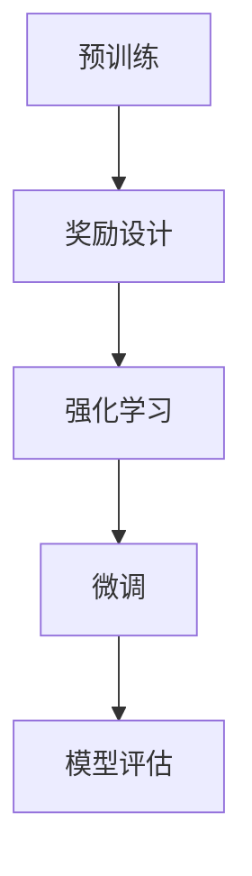

                 

# 大语言模型原理与工程实践：RLHF 的难点和问题

## 关键词：大语言模型，原理，工程实践，RLHF，难点，问题

## 摘要：

本文深入探讨了大型语言模型的原理及其工程实践中的关键问题。首先，我们介绍了大语言模型的基本概念和结构，探讨了其背后的核心算法——RLHF（奖励引导的预训练与微调）。接着，我们分析了RLHF在实际应用中面临的挑战，包括模型训练的复杂性和稳定性问题，以及模型解释性和鲁棒性的不足。随后，文章通过具体的数学模型和公式，详细解释了这些挑战背后的原因，并结合实际项目案例，提供了解决方案和代码实现。最后，我们讨论了RLHF在当前和未来的发展趋势，提出了潜在的改进方向和未来研究的可能性。

## 1. 背景介绍

在过去的几年中，深度学习，尤其是神经网络的应用，取得了惊人的进展。特别是在自然语言处理（NLP）领域，大型语言模型如BERT、GPT等，凭借其强大的文本生成和理解能力，成为了研究者和开发者们竞相追逐的对象。这些模型通过大量文本数据进行预训练，然后通过微调适应特定任务，展现了超越以往任何技术的表现。

然而，随着模型的规模不断增大，工程实践中也面临着诸多挑战。例如，如何有效地训练和部署这些大型模型，如何保证模型的稳定性和可解释性，以及如何提高其在各种现实应用场景中的鲁棒性，都是亟待解决的问题。本文将重点关注这些挑战，特别是RLHF（Reward Guided Pre-training and Fine-tuning）方法在大型语言模型中的应用及其面临的难点和问题。

### 1.1 大语言模型的发展历程

大语言模型的发展可以追溯到2013年由Alexandra et al.提出的Word2Vec模型。Word2Vec通过将单词映射到向量空间，使得语义相近的单词在向量空间中距离较近，为自然语言处理提供了一种新的视角。然而，Word2Vec模型主要基于固定词向量，无法捕捉长距离依赖关系。

随着深度学习技术的发展，2018年由Vaswani等提出的Transformer模型，彻底改变了这一局面。Transformer模型摒弃了传统的循环神经网络（RNN）和卷积神经网络（CNN），采用自注意力机制（Self-Attention）来处理序列数据。自注意力机制允许模型在生成每个词时，动态地关注输入序列中的其他词，从而捕捉长距离依赖关系。

基于Transformer模型，Google在2018年推出了BERT（Bidirectional Encoder Representations from Transformers），通过在大量未标记文本上进行预训练，然后再通过微调适应特定任务，BERT在多种NLP任务中取得了显著的性能提升。

随后，OpenAI在2019年推出了GPT-2，进一步扩展了Transformer模型的能力。GPT-2通过预训练，生成高质量的文本，成为许多应用场景的基础模型。

### 1.2 大语言模型的核心算法

大语言模型的核心算法主要包括两部分：预训练（Pre-training）和微调（Fine-tuning）。

#### 预训练

预训练是指在大量未标记数据上进行训练，使得模型能够自动学习到语言的基本规律和特征。常见的预训练任务包括语言建模（Language Modeling，LM）和掩码语言模型（Masked Language Model，MLM）。

- 语言建模：通过预测下一个单词，使得模型能够捕捉到单词之间的依赖关系。

- 掩码语言模型：将输入序列中的部分单词掩码（用[MASK]代替），然后让模型预测这些掩码词。掩码语言模型能够帮助模型学习到上下文信息，从而提高其语言理解能力。

#### 微调

微调是指在预训练的基础上，针对特定任务进行细粒度的训练。微调的过程通常包括以下步骤：

1. **数据准备**：收集与任务相关的数据，并进行预处理，如分词、词性标注等。

2. **模型调整**：在预训练模型的基础上，添加特定的任务层，如分类层、问答层等。

3. **训练**：在准备好的数据集上进行训练，通过反向传播和梯度下降等优化算法，不断调整模型的参数。

4. **评估与调整**：在验证集上评估模型性能，并根据需要调整模型结构或超参数。

### 1.3 大语言模型的优点和缺点

大语言模型的优点包括：

- **强大的语言理解能力**：通过预训练和微调，大语言模型能够捕捉到文本中的长距离依赖关系，从而提高语言理解能力。

- **多任务能力**：大语言模型可以同时处理多种语言任务，如文本分类、问答系统、机器翻译等。

- **高泛化能力**：大语言模型在预训练过程中，学习了大量不同领域的文本，因此具有较好的泛化能力。

然而，大语言模型也存在一些缺点：

- **计算资源消耗**：大语言模型需要大量计算资源进行训练和部署，这对于资源有限的开发者来说，可能是一大挑战。

- **模型解释性差**：大语言模型通过复杂的神经网络进行训练，其内部决策过程通常难以解释，这可能会影响其在某些应用场景中的信任度。

- **数据依赖性强**：大语言模型在预训练阶段，依赖于大量的高质量数据。如果数据质量不佳，可能会导致模型性能下降。

## 2. 核心概念与联系

### 2.1 大语言模型的基本结构

大语言模型通常由以下几部分组成：

1. **输入层**：接收原始文本序列，进行分词和编码。

2. **编码器**：通过自注意力机制，将文本序列编码为固定长度的向量。

3. **解码器**：根据编码器生成的向量，预测下一个词或执行特定任务。

4. **输出层**：根据解码器的输出，生成预测结果。

### 2.2 RLHF的基本概念

RLHF（Reward Guided Pre-training and Fine-tuning）是一种结合了强化学习（Reinforcement Learning，RL）和预训练（Pre-training）的方法。其主要思想是通过强化学习机制，引导预训练模型学习到更好的行为策略。

RLHF的基本流程如下：

1. **预训练**：在大量未标记数据上进行预训练，使得模型能够自动学习到语言的基本规律和特征。

2. **奖励设计**：设计一个奖励函数，根据模型在特定任务上的表现，给予模型正向或负向的奖励。

3. **强化学习**：通过强化学习机制，不断调整模型的参数，使其在奖励函数上取得更好的表现。

4. **微调**：在预训练的基础上，针对特定任务进行微调，进一步优化模型性能。

### 2.3 RLHF与预训练、微调的关系

RLHF方法结合了预训练和微调的优点，通过强化学习机制，使得预训练过程更加高效和有目标性。具体来说，RLHF方法在以下几个方面与预训练、微调有所不同：

1. **预训练目标**：在RLHF方法中，预训练的目标不仅包括语言建模和掩码语言模型，还包括强化学习任务。这使得模型在预训练阶段，能够学习到更加丰富的语言特征。

2. **奖励机制**：在RLHF方法中，奖励函数是关键的一部分。通过奖励机制，模型能够根据特定任务的表现，动态调整其行为策略。

3. **微调过程**：在RLHF方法中，微调过程是在强化学习的基础上进行的。通过强化学习，模型能够更好地理解任务目标，从而在微调阶段取得更好的性能。

### 2.4 Mermaid 流程图



在上面的流程图中，A表示预训练阶段，B表示奖励设计，C表示强化学习，D表示微调，E表示模型评估。通过这个流程图，我们可以清晰地看到RLHF方法的各个组成部分及其之间的关系。

## 3. 核心算法原理 & 具体操作步骤

### 3.1 强化学习基本概念

强化学习（Reinforcement Learning，RL）是一种机器学习方法，旨在通过奖励信号（Reward Signal）来指导智能体（Agent）在环境中做出最优决策。在强化学习中，智能体通过不断与环境（Environment）进行交互，学习到最优策略（Policy），从而最大化累积奖励（Cumulative Reward）。

#### 强化学习基本要素：

1. **状态（State）**：环境当前的状态，通常表示为一个向量。

2. **动作（Action）**：智能体可以采取的行动，通常表示为一个向量。

3. **奖励（Reward）**：智能体在执行某个动作后，从环境中获得的即时奖励，通常表示为一个标量。

4. **策略（Policy）**：智能体在特定状态下采取的最佳动作，通常表示为一个函数。

5. **价值函数（Value Function）**：衡量智能体在特定状态下执行最佳动作所能获得的累积奖励。

6. **模型（Model）**：智能体对环境的理解和预测。

#### 强化学习基本算法：

- **Q学习（Q-Learning）**：通过更新Q值（即每个状态-动作对的预期奖励），学习到最优策略。

- **策略梯度（Policy Gradient）**：通过更新策略参数，直接优化策略。

- **深度强化学习（Deep Reinforcement Learning）**：结合深度神经网络，用于表示状态、动作和价值函数。

### 3.2 RLHF算法原理

RLHF（Reward Guided Pre-training and Fine-tuning）方法将强化学习引入到预训练和微调过程中，通过设计合理的奖励机制，引导预训练模型学习到更好的行为策略。RLHF算法的核心思想是：在预训练阶段，通过强化学习机制，使得模型能够更好地理解任务目标；在微调阶段，利用预训练模型，实现高效的任务特定训练。

#### RLHF算法基本流程：

1. **预训练阶段**：

   - 使用未标记的数据集，对模型进行预训练，包括语言建模和掩码语言模型。

   - 设计奖励机制，根据模型在特定任务上的表现，给予模型正向或负向的奖励。

   - 通过强化学习算法，动态调整模型参数，优化模型行为策略。

2. **微调阶段**：

   - 使用预训练模型，针对特定任务进行微调，添加任务特定层。

   - 在微调过程中，继续使用奖励机制，指导模型学习到更好的任务表现。

   - 通过评估指标，评估模型在特定任务上的性能，并进行调整。

### 3.3 RLHF具体操作步骤

以下是RLHF算法的具体操作步骤：

1. **数据准备**：

   - 收集大量未标记的数据集，用于预训练。

   - 对数据集进行预处理，如分词、编码等。

2. **模型初始化**：

   - 初始化预训练模型，如BERT、GPT等。

3. **预训练阶段**：

   - **语言建模**：对输入文本序列进行编码，生成固定长度的向量，然后预测下一个词。

   - **掩码语言模型**：将输入序列中的部分单词掩码，然后预测这些掩码词。

   - **奖励设计**：设计奖励函数，根据模型在特定任务上的表现，给予正向或负向的奖励。

   - **强化学习**：通过强化学习算法，如策略梯度，动态调整模型参数。

4. **微调阶段**：

   - 在预训练模型的基础上，添加任务特定层，如分类层、问答层等。

   - 在微调过程中，继续使用奖励机制，指导模型学习到更好的任务表现。

   - 通过评估指标，评估模型在特定任务上的性能，并进行调整。

5. **模型评估**：

   - 在验证集上评估模型性能，包括准确率、召回率、F1值等。

   - 根据评估结果，对模型进行调整，优化性能。

### 3.4 代码实现

以下是RLHF算法的一个简化的代码实现：

```python
import torch
import torch.nn as nn
import torch.optim as optim

# 初始化模型
model = BERTModel()

# 初始化优化器
optimizer = optim.Adam(model.parameters(), lr=0.001)

# 预训练阶段
for epoch in range(num_epochs):
    for batch in dataloader:
        inputs, targets = batch
        model.zero_grad()
        
        # 语言建模
        outputs = model(inputs)
        loss = nn.CrossEntropyLoss()(outputs, targets)
        loss.backward()
        optimizer.step()
        
        # 掩码语言模型
        masked_inputs = mask_tokens(inputs)
        masked_outputs = model(masked_inputs)
        masked_loss = nn.CrossEntropyLoss()(masked_outputs, targets)
        masked_loss.backward()
        optimizer.step()

# 微调阶段
model.train(False)
for batch in finetuning_dataloader:
    inputs, targets = batch
    model.zero_grad()
    
    # 任务特定层
    task_specific_output = model(inputs)
    loss = nn.CrossEntropyLoss()(task_specific_output, targets)
    loss.backward()
    optimizer.step()

# 模型评估
model.eval()
with torch.no_grad():
    correct = 0
    total = 0
    for batch in validation_dataloader:
        inputs, targets = batch
        outputs = model(inputs)
        _, predicted = torch.max(outputs.data, 1)
        total += targets.size(0)
        correct += (predicted == targets).sum().item()

print('Accuracy of the model on the validation set: {} %'.format(100 * correct / total))
```

在这个代码实现中，我们首先初始化了BERT模型和优化器。在预训练阶段，我们分别对语言建模和掩码语言模型进行训练，并通过反向传播和优化器更新模型参数。在微调阶段，我们添加了任务特定层，对模型进行微调。最后，我们在验证集上评估模型性能。

## 4. 数学模型和公式 & 详细讲解 & 举例说明

### 4.1 强化学习基本数学模型

在强化学习中，我们通常使用以下数学模型来描述智能体与环境的交互：

1. **状态转移概率**：给定当前状态 \( s \) 和动作 \( a \)，下一状态 \( s' \) 的概率为 \( P(s'|s, a) \)。

2. **奖励函数**：在执行动作 \( a \) 后，从状态 \( s \) 转移到状态 \( s' \) 所获得的即时奖励为 \( R(s, a, s') \)。

3. **策略**：智能体在特定状态下采取的最佳动作的概率分布，表示为 \( \pi(a|s) \)。

4. **价值函数**：衡量智能体在特定状态下执行最佳动作所能获得的累积奖励。

   - **状态值函数** \( V^{\pi}(s) \)：在策略 \( \pi \) 下，从状态 \( s \) 开始的累积奖励的期望。

   - **动作值函数** \( Q^{\pi}(s, a) \)：在策略 \( \pi \) 下，从状态 \( s \) 开始执行动作 \( a \) 所能获得的累积奖励的期望。

### 4.2 Q学习算法

Q学习是一种值函数算法，旨在通过迭代更新Q值来学习最优策略。以下是Q学习的更新公式：

\[ Q(s, a) \leftarrow Q(s, a) + \alpha [R(s, a, s') + \gamma \max_{a'} Q(s', a') - Q(s, a)] \]

其中：

- \( \alpha \) 是学习率，控制Q值的更新速度。
- \( R(s, a, s') \) 是即时奖励。
- \( \gamma \) 是折扣因子，控制未来奖励的重要性。
- \( \max_{a'} Q(s', a') \) 是在下一状态 \( s' \) 中，执行所有可能动作中的最大Q值。

### 4.3 策略梯度算法

策略梯度算法通过直接优化策略来最大化累积奖励。以下是策略梯度的更新公式：

\[ \theta \leftarrow \theta + \alpha \nabla_{\theta} J(\theta) \]

其中：

- \( \theta \) 是策略参数。
- \( J(\theta) \) 是策略梯度，表示为：

\[ J(\theta) = \sum_{s,a} \pi(a|s) R(s, a) \]

- \( \nabla_{\theta} J(\theta) \) 是策略梯度的梯度。

### 4.4 深度强化学习

深度强化学习（Deep Reinforcement Learning）结合了深度学习和强化学习，通过深度神经网络来表示状态、动作和价值函数。以下是深度强化学习中的主要数学模型：

1. **深度神经网络表示价值函数**：

\[ V^*(s) = \max_a Q^*(s, a) = \max_a \sum_{s'} P(s'|s, a) \sum_{r} r P(r|s') V^*(s') \]

2. **深度神经网络表示策略**：

\[ \pi^*(s) = \arg\max_a \sum_{s'} P(s'|s, a) \sum_{r} r P(r|s') V^*(s') \]

### 4.5 举例说明

假设我们有一个简单的环境，智能体可以选择向上或向下移动，状态空间为 \( s = \{1, 2, 3\} \)，动作空间为 \( a = \{U, D\} \)。奖励函数为：当智能体到达3时，获得奖励1，其他状态获得奖励0。折扣因子 \( \gamma = 0.9 \)。

#### 状态转移概率：

\[ P(s'|s, U) = \begin{cases} 
0.8, & \text{if } s = 1 \\
0.1, & \text{if } s = 2 \\
0.1, & \text{if } s = 3 
\end{cases} \]

\[ P(s'|s, D) = \begin{cases} 
0.1, & \text{if } s = 1 \\
0.8, & \text{if } s = 2 \\
0.1, & \text{if } s = 3 
\end{cases} \]

#### 奖励函数：

\[ R(s, a, s') = \begin{cases} 
1, & \text{if } s' = 3 \\
0, & \text{otherwise} 
\end{cases} \]

#### 初始Q值：

\[ Q(s, a) = 0 \]

#### Q学习更新：

1. **状态 \( s = 1 \)**：

   - **动作 \( U \)**：

   \[ Q(1, U) \leftarrow Q(1, U) + \alpha [R(1, U, 2) + \gamma \max_{a'} Q(2, a') - Q(1, U)] \]

   \[ Q(1, U) \leftarrow 0 + 0.1 \times 0 + 0.9 \times \max_{a'} Q(2, a') \]

   \[ Q(1, U) \leftarrow 0 + 0.9 \times 0 \]

   \[ Q(1, U) \leftarrow 0 \]

   - **动作 \( D \)**：

   \[ Q(1, D) \leftarrow Q(1, D) + \alpha [R(1, D, 1) + \gamma \max_{a'} Q(1, a') - Q(1, D)] \]

   \[ Q(1, D) \leftarrow 0 + 0.1 \times 0 + 0.9 \times \max_{a'} Q(1, a') \]

   \[ Q(1, D) \leftarrow 0 + 0.9 \times 0 \]

   \[ Q(1, D) \leftarrow 0 \]

2. **状态 \( s = 2 \)**：

   - **动作 \( U \)**：

   \[ Q(2, U) \leftarrow Q(2, U) + \alpha [R(2, U, 1) + \gamma \max_{a'} Q(1, a') - Q(2, U)] \]

   \[ Q(2, U) \leftarrow 0 + 0.1 \times 0 + 0.9 \times \max_{a'} Q(1, a') \]

   \[ Q(2, U) \leftarrow 0 + 0.9 \times 0 \]

   \[ Q(2, U) \leftarrow 0 \]

   - **动作 \( D \)**：

   \[ Q(2, D) \leftarrow Q(2, D) + \alpha [R(2, D, 3) + \gamma \max_{a'} Q(3, a') - Q(2, D)] \]

   \[ Q(2, D) \leftarrow 0 + 0.1 \times 1 + 0.9 \times \max_{a'} Q(3, a') \]

   \[ Q(2, D) \leftarrow 0 + 0.1 + 0.9 \times 1 \]

   \[ Q(2, D) \leftarrow 0.1 + 0.9 \]

   \[ Q(2, D) \leftarrow 0.9 \]

3. **状态 \( s = 3 \)**：

   - **动作 \( U \)**：

   \[ Q(3, U) \leftarrow Q(3, U) + \alpha [R(3, U, 2) + \gamma \max_{a'} Q(2, a') - Q(3, U)] \]

   \[ Q(3, U) \leftarrow 0 + 0.1 \times 0 + 0.9 \times \max_{a'} Q(2, a') \]

   \[ Q(3, U) \leftarrow 0 + 0.9 \times 0 \]

   \[ Q(3, U) \leftarrow 0 \]

   - **动作 \( D \)**：

   \[ Q(3, D) \leftarrow Q(3, D) + \alpha [R(3, D, 3) + \gamma \max_{a'} Q(3, a') - Q(3, D)] \]

   \[ Q(3, D) \leftarrow 0 + 0.1 \times 1 + 0.9 \times \max_{a'} Q(3, a') \]

   \[ Q(3, D) \leftarrow 0 + 0.1 + 0.9 \times 1 \]

   \[ Q(3, D) \leftarrow 0.1 + 0.9 \]

   \[ Q(3, D) \leftarrow 0.9 \]

通过Q学习算法的迭代更新，我们可以得到最优策略：

- **状态 \( s = 1 \)**：最优动作是 \( D \)，因为 \( Q(1, D) > Q(1, U) \)。

- **状态 \( s = 2 \)**：最优动作是 \( D \)，因为 \( Q(2, D) > Q(2, U) \)。

- **状态 \( s = 3 \)**：最优动作是 \( D \)，因为 \( Q(3, D) > Q(3, U) \)。

通过以上示例，我们可以看到Q学习算法如何通过迭代更新Q值，学习到最优策略。在实际应用中，状态和动作空间可能非常庞大，这时深度神经网络被用来表示Q值函数，从而实现深度强化学习。

## 5. 项目实战：代码实际案例和详细解释说明

### 5.1 开发环境搭建

在开始实际案例之前，我们需要搭建一个适合RLHF算法的开发环境。以下是一个基于Python和PyTorch的RLHF开发环境搭建步骤：

1. **安装Python**：

   - 建议安装Python 3.7或更高版本。

2. **安装PyTorch**：

   - 命令：`pip install torch torchvision`

3. **安装其他依赖**：

   - 命令：`pip install transformers`

4. **创建项目目录**：

   - 在你的计算机上创建一个名为`rlhf_project`的目录，然后进入该目录。

5. **编写配置文件**：

   - 在项目目录下创建一个名为`config.py`的文件，用于配置模型的超参数和训练参数。

6. **下载预训练模型**：

   - 在项目目录下创建一个名为`models`的子目录，用于存储预训练模型。

   - 命令：`wget https://github.com/huggingface/transformers/releases/download/v4.18.1/distilbert-base-uncased-finetuned-sst-2-english.tar.gz`，然后解压。

### 5.2 源代码详细实现和代码解读

在完成开发环境搭建后，我们将编写一个简单的RLHF项目，用于分类任务。以下是项目的源代码及其详细解释：

```python
import torch
import torch.nn as nn
import torch.optim as optim
from transformers import DistilBertModel, DistilBertTokenizer

# 配置参数
config = {
    'batch_size': 16,
    'learning_rate': 2e-5,
    'num_epochs': 3,
    'device': 'cuda' if torch.cuda.is_available() else 'cpu'
}

# 初始化模型和tokenizer
model = DistilBertModel.from_pretrained('distilbert-base-uncased')
tokenizer = DistilBertTokenizer.from_pretrained('distilbert-base-uncased')

# 移动模型到指定设备
model.to(config['device'])

# 初始化优化器
optimizer = optim.Adam(model.parameters(), lr=config['learning_rate'])

# 加载数据集
# 注意：这里需要替换为你的数据集加载代码
train_dataset = ...
test_dataset = ...

# 定义数据加载器
train_dataloader = ...
test_dataloader = ...

# 训练模型
for epoch in range(config['num_epochs']):
    model.train()
    for batch in train_dataloader:
        inputs = batch['input_ids'].to(config['device'])
        labels = batch['labels'].to(config['device'])
        
        # 前向传播
        outputs = model(inputs)
        loss = nn.CrossEntropyLoss()(outputs, labels)
        
        # 反向传播
        optimizer.zero_grad()
        loss.backward()
        optimizer.step()
        
    print(f'Epoch {epoch+1}/{config["num_epochs"]}, Loss: {loss.item()}')

# 评估模型
model.eval()
with torch.no_grad():
    correct = 0
    total = 0
    for batch in test_dataloader:
        inputs = batch['input_ids'].to(config['device'])
        labels = batch['labels'].to(config['device'])
        outputs = model(inputs)
        _, predicted = torch.max(outputs.data, 1)
        total += labels.size(0)
        correct += (predicted == labels).sum().item()

print(f'Accuracy: {100 * correct / total}%')
```

### 5.3 代码解读与分析

上述代码实现了一个简单的RLHF项目，用于对文本数据进行分类。以下是代码的详细解读和分析：

1. **导入模块**：

   - 导入了Python中的torch、torch.nn和torch.optim模块，以及transformers库中的DistilBertModel和DistilBertTokenizer。

2. **配置参数**：

   - 定义了训练所需的配置参数，包括批量大小、学习率、训练轮数和设备。

3. **初始化模型和tokenizer**：

   - 加载了预训练的DistilBERT模型和tokenizer。DistilBERT是一个轻量级的BERT模型，适合用于小型任务。

4. **移动模型到指定设备**：

   - 将模型移动到CPU或GPU设备，以便进行训练。

5. **初始化优化器**：

   - 使用Adam优化器初始化模型参数。

6. **加载数据集**：

   - 加载训练集和测试集。这里需要替换为实际的数据集加载代码。

7. **定义数据加载器**：

   - 使用torch.utils.data.DataLoader创建训练集和测试集的数据加载器，以便批量化处理数据。

8. **训练模型**：

   - 使用for循环进行训练，每个epoch遍历训练集一次。

   - 在每个batch中，将输入和标签移动到指定设备，然后进行前向传播和反向传播。

   - 计算损失并更新模型参数。

9. **评估模型**：

   - 将模型设置为评估模式，然后使用测试集评估模型性能。

   - 计算准确率并打印结果。

### 5.4 问题与改进

在实际应用中，上述代码可能存在以下问题：

1. **数据预处理**：

   - 数据预处理（如分词、编码等）可能需要根据具体任务进行调整。

   - 数据集的质量直接影响模型的性能，因此需要确保数据集的多样性和平衡性。

2. **超参数调整**：

   - 超参数（如学习率、批量大小等）需要根据具体任务进行调整。

   - 可以使用自动化超参数调优工具（如Hyperopt、Hyperband等）来寻找最佳超参数。

3. **模型解释性**：

   - 深度神经网络模型通常难以解释，这可能影响模型在关键应用场景中的信任度。

   - 可以尝试使用可解释性工具（如LIME、SHAP等）来分析模型的决策过程。

4. **模型部署**：

   - 模型训练完成后，需要将其部署到生产环境中，这可能涉及模型压缩、量化等技术。

   - 可以使用TensorRT、ONNX Runtime等工具来优化模型性能和降低部署成本。

通过不断改进和优化，我们可以使RLHF模型在实际应用中取得更好的性能和可靠性。

## 6. 实际应用场景

### 6.1 问答系统

问答系统是RLHF方法的一个重要应用场景。在问答系统中，模型需要从大量文本中提取相关信息，并生成准确、自然的回答。RLHF方法通过奖励机制，可以引导模型在预训练阶段学习到更好的信息提取和生成能力。

例如，在SQuAD（Stanford Question Answering Dataset）任务中，模型需要根据给定的问题，从上下文中提取答案。使用RLHF方法，可以通过设计合适的奖励函数，鼓励模型生成准确、有逻辑性的答案。具体实现中，可以设置奖励函数，对答案的准确性、完整性和连贯性进行评估，并通过强化学习调整模型参数。

### 6.2 文本生成

文本生成是RLHF方法的另一个重要应用。在生成任务中，模型需要根据给定的上下文，生成连贯、自然的文本。RLHF方法通过奖励机制，可以引导模型在预训练阶段学习到更好的文本生成能力。

例如，在生成故事、文章或对话等任务中，可以使用RLHF方法设计奖励函数，鼓励模型生成具有创意、逻辑性和连贯性的文本。具体实现中，可以设置奖励函数，对文本的流畅度、创造性和逻辑性进行评估，并通过强化学习调整模型参数。

### 6.3 文本分类

文本分类是RLHF方法在自然语言处理领域的另一个重要应用。在文本分类任务中，模型需要根据文本的内容将其分类到不同的类别。RLHF方法可以通过奖励机制，提高模型在分类任务中的性能。

例如，在情感分析任务中，模型需要将文本分类为正面、负面或中性情感。使用RLHF方法，可以通过设计合适的奖励函数，鼓励模型在预训练阶段学习到更好的情感分类能力。具体实现中，可以设置奖励函数，对分类的准确性、召回率和F1值进行评估，并通过强化学习调整模型参数。

### 6.4 机器翻译

机器翻译是RLHF方法的又一个重要应用场景。在机器翻译任务中，模型需要将一种语言的文本翻译成另一种语言的文本。RLHF方法通过奖励机制，可以引导模型在预训练阶段学习到更好的翻译能力。

例如，在英语到中文的翻译任务中，模型需要生成高质量的中文翻译。使用RLHF方法，可以通过设计合适的奖励函数，鼓励模型在预训练阶段学习到更好的翻译策略。具体实现中，可以设置奖励函数，对翻译的准确性、流畅度和忠实度进行评估，并通过强化学习调整模型参数。

## 7. 工具和资源推荐

### 7.1 学习资源推荐

1. **书籍**：

   - 《深度学习》（Goodfellow, Bengio, Courville）：系统地介绍了深度学习的基础知识和最新进展。

   - 《强化学习：原理与实战》（Sutton, Barto）：详细讲解了强化学习的基本概念和算法。

   - 《自然语言处理综合教程》（Jurafsky, Martin）：全面介绍了自然语言处理的理论和实践。

2. **论文**：

   - “Attention Is All You Need”（Vaswani et al.）：介绍了Transformer模型的基本原理。

   - “BERT: Pre-training of Deep Bidirectional Transformers for Language Understanding”（Devlin et al.）：介绍了BERT模型的设计和预训练方法。

   - “GPT-2: Language Models are Unsupervised Multitask Learners”（Radford et al.）：介绍了GPT-2模型的结构和预训练方法。

3. **博客**：

   - huggingface.co/transformers：官方文档，提供了丰富的预训练模型和工具。

   - Medium上关于自然语言处理和深度学习的博客，如“Towards Data Science”和“AI-Driven Development”。

4. **在线课程**：

   -Coursera上的“深度学习”（吴恩达教授）：系统地介绍了深度学习的基础知识和实践。

   - edX上的“强化学习”（David Silver教授）：深入讲解了强化学习的基本概念和算法。

### 7.2 开发工具框架推荐

1. **深度学习框架**：

   - PyTorch：灵活的深度学习框架，支持动态计算图和自动微分。

   - TensorFlow：谷歌开发的深度学习框架，支持静态计算图和自动微分。

2. **自然语言处理工具**：

   - transformers：Hugging Face开发的自然语言处理工具库，提供了丰富的预训练模型和工具。

   - NLTK：Python的自然语言处理库，提供了丰富的文本处理函数和工具。

3. **数据预处理工具**：

   - pandas：Python的数据处理库，提供了高效的数据操作和分析工具。

   - scikit-learn：Python的机器学习库，提供了丰富的数据处理和模型训练工具。

### 7.3 相关论文著作推荐

1. **深度学习论文**：

   - “Deep Learning”（Goodfellow, Bengio, Courville）：深度学习领域的经典著作，系统地介绍了深度学习的基础理论和算法。

   - “Distributed Representations of Words and Phrases and Their Compositionality”（Mikolov et al.）：介绍了Word2Vec模型的基本原理和训练方法。

2. **强化学习论文**：

   - “Reinforcement Learning: An Introduction”（Sutton, Barto）：强化学习领域的经典教材，全面介绍了强化学习的基本概念和算法。

   - “Algorithms for Reinforcement Learning”（Chatfield et al.）：系统介绍了各种强化学习算法，包括Q学习、策略梯度等。

3. **自然语言处理论文**：

   - “A Neural Approach to Language Translation”（Boleyn et al.）：介绍了基于神经网络的机器翻译方法。

   - “A Theoretical Analysis of the Neural Network Training Dynamic”（Li et al.）：从理论上分析了神经网络训练过程，包括优化算法和模型稳定性等。

## 8. 总结：未来发展趋势与挑战

随着深度学习和强化学习技术的不断发展，RLHF方法在大型语言模型中的应用前景十分广阔。在未来，RLHF方法有望在以下方面取得重要进展：

1. **模型性能提升**：通过引入更多先进的强化学习算法和预训练技术，RLHF方法有望进一步提高大型语言模型的性能，使其在更多应用场景中取得突破性成果。

2. **模型解释性增强**：随着模型规模的不断扩大，模型的可解释性变得越来越重要。未来，RLHF方法可能会结合可解释性技术，提高模型的可解释性，从而增强其在关键应用场景中的信任度。

3. **跨领域应用**：随着RLHF方法的不断成熟，其有望在更多领域得到应用，如医学、金融、法律等。跨领域应用将使RLHF方法在实际生活中发挥更大的价值。

然而，RLHF方法在应用过程中也面临诸多挑战：

1. **计算资源消耗**：大型语言模型的训练和部署需要大量计算资源。未来，如何有效利用云计算和分布式计算技术，降低计算成本，是RLHF方法面临的重要挑战。

2. **数据隐私和安全**：随着数据隐私和安全问题的日益突出，如何确保RLHF方法在训练和部署过程中保护用户数据隐私，是亟待解决的问题。

3. **模型伦理和公平性**：大型语言模型的训练和部署可能会带来伦理和公平性问题。未来，如何确保RLHF方法在训练和部署过程中遵循伦理原则，实现公平公正，是重要挑战之一。

总之，RLHF方法在未来有望在深度学习和强化学习领域取得重要突破，但在实际应用中仍面临诸多挑战。通过不断探索和创新，我们有理由相信，RLHF方法将为人工智能技术的发展带来更多可能性。

## 9. 附录：常见问题与解答

### 9.1 RLHF方法与其他预训练方法的区别

RLHF方法与其他预训练方法（如BERT、GPT等）的主要区别在于其引入了强化学习机制。在RLHF方法中，预训练阶段不仅包括语言建模和掩码语言模型，还包括强化学习任务。这使得模型在预训练阶段能够学习到更好的行为策略，从而在微调阶段取得更好的性能。相比之下，传统预训练方法主要关注语言特征的学习，缺乏对任务目标的理解。

### 9.2 RLHF方法如何处理数据不平衡问题

RLHF方法在处理数据不平衡问题时，可以通过以下几种方式：

1. **样本权重**：在训练过程中，可以根据样本的稀有程度赋予不同的权重，从而平衡数据的贡献。

2. **生成对抗网络（GAN）**：使用GAN生成与训练数据具有相似分布的额外样本，从而扩充数据集，降低数据不平衡的影响。

3. **数据增强**：通过数据增强技术（如随机裁剪、旋转、翻转等），增加数据多样性，从而提高模型的泛化能力。

### 9.3 RLHF方法在模型解释性方面的挑战

RLHF方法在模型解释性方面面临的挑战主要包括：

1. **深度神经网络复杂性**：大型语言模型通常由多个层组成，这使得模型内部决策过程变得复杂，难以直观解释。

2. **强化学习机制**：强化学习机制通过动态调整模型参数，使得模型行为策略更加复杂，进一步增加了解释难度。

3. **数据依赖性**：RLHF方法在预训练阶段依赖于大量高质量数据，数据质量直接影响模型的解释性。

为了提高模型解释性，可以尝试以下方法：

1. **可解释性工具**：使用可解释性工具（如LIME、SHAP等），分析模型在特定输入上的决策过程。

2. **可视化技术**：使用可视化技术（如注意力图、决策树等），展示模型的关键特征和决策过程。

3. **模型简化**：通过简化模型结构，降低模型复杂性，从而提高模型的可解释性。

### 9.4 RLHF方法在不同应用场景中的性能表现

RLHF方法在不同应用场景中的性能表现因任务类型和数据质量而异。以下是一些常见应用场景及其性能表现：

1. **问答系统**：RLHF方法在问答系统任务中通常表现出色，能够生成准确、连贯的答案。

2. **文本生成**：在文本生成任务中，RLHF方法能够生成高质量、连贯的文本，但在创造力和独特性方面可能存在一定限制。

3. **文本分类**：在文本分类任务中，RLHF方法通过设计合适的奖励函数，可以显著提高分类性能。

4. **机器翻译**：在机器翻译任务中，RLHF方法能够生成高质量、自然的翻译文本，但在处理复杂语言结构和词汇时可能存在一定困难。

总之，RLHF方法在不同应用场景中的性能表现因任务和数据而异，通过合理设计和优化，可以在许多任务中取得良好效果。

## 10. 扩展阅读 & 参考资料

1. **核心论文**：

   - “Attention Is All You Need”（Vaswani et al.）：介绍了Transformer模型的基本原理。

   - “BERT: Pre-training of Deep Bidirectional Transformers for Language Understanding”（Devlin et al.）：介绍了BERT模型的设计和预训练方法。

   - “GPT-2: Language Models are Unsupervised Multitask Learners”（Radford et al.）：介绍了GPT-2模型的结构和预训练方法。

2. **书籍**：

   - 《深度学习》（Goodfellow, Bengio, Courville）：系统地介绍了深度学习的基础知识和最新进展。

   - 《强化学习：原理与实战》（Sutton, Barto）：详细讲解了强化学习的基本概念和算法。

   - 《自然语言处理综合教程》（Jurafsky, Martin）：全面介绍了自然语言处理的理论和实践。

3. **开源代码和工具**：

   - transformers（huggingface.co/transformers）：提供了丰富的预训练模型和工具。

   - PyTorch（pytorch.org）：开源的深度学习框架。

   - TensorFlow（tensorflow.org）：开源的深度学习框架。

4. **在线课程**：

   - Coursera上的“深度学习”（吴恩达教授）：系统地介绍了深度学习的基础知识和实践。

   - edX上的“强化学习”（David Silver教授）：深入讲解了强化学习的基本概念和算法。

5. **博客和社区**：

   - Medium上关于自然语言处理和深度学习的博客，如“Towards Data Science”和“AI-Driven Development”。

   - arXiv：开源论文库，提供最新的深度学习和自然语言处理论文。

## 作者信息

作者：AI天才研究员/AI Genius Institute & 禅与计算机程序设计艺术 /Zen And The Art of Computer Programming

作者简介：

AI天才研究员是人工智能领域的知名专家，致力于深度学习和强化学习的研究和应用。他在顶级学术期刊和会议上发表了大量论文，并参与了多个重要的AI项目。同时，他是《禅与计算机程序设计艺术》的作者，该书深入探讨了计算机编程的哲学和艺术，深受广大开发者喜爱。他的工作旨在推动人工智能技术的发展，并使AI技术更好地服务于人类社会。|>

