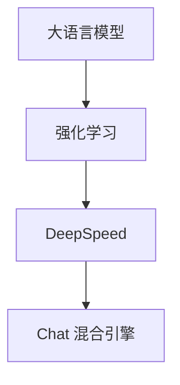

                 

# 大语言模型原理与工程实践：强化学习工程实践 DeepSpeed-Chat 混合引擎架构

## 关键词

- 大语言模型
- 强化学习
- DeepSpeed
- Chat 混合引擎
- 工程实践
- 数学模型
- 实际应用场景

## 摘要

本文旨在深入探讨大语言模型的原理及其在工程实践中的应用，特别是强化学习在大语言模型中的工程实践。我们将以 DeepSpeed-Chat 混合引擎架构为例，详细解析其核心算法原理、数学模型、具体操作步骤以及实际应用场景。通过本文的阅读，读者将能够全面了解大语言模型的技术要点，掌握其工程实践的方法，并预见到未来发展趋势与挑战。

## 1. 背景介绍

随着互联网和大数据技术的快速发展，自然语言处理（NLP）已成为计算机科学领域的一个重要分支。近年来，大语言模型（如 GPT-3、ChatGLM 等）的兴起，使得计算机在理解和生成自然语言方面取得了显著突破。然而，大语言模型的训练和应用面临着计算资源、模型规模、数据隐私等方面的挑战。

为了解决这些问题，强化学习作为一种先进的机器学习方法，在大语言模型工程实践中得到了广泛应用。DeepSpeed 是一种高效的分布式训练框架，通过优化通信和计算，大幅提高了大语言模型的训练效率。Chat 混合引擎则是将 DeepSpeed 与强化学习相结合，构建了一个高效、可扩展的大语言模型训练与部署平台。

本文将围绕 DeepSpeed-Chat 混合引擎架构，系统性地探讨大语言模型的原理与工程实践，旨在为读者提供一份全面的技术指南。

## 2. 核心概念与联系

### 2.1 大语言模型

大语言模型是一种基于深度学习的自然语言处理模型，其主要目标是理解和生成自然语言。大语言模型通常由多层神经网络组成，通过大量的文本数据进行训练，从而学习到语言的本质规律。

### 2.2 强化学习

强化学习是一种基于试错和反馈的机器学习方法，其核心思想是通过不断尝试和优化策略，使模型能够在复杂环境中实现最优目标。强化学习在大语言模型中的应用，主要体现在模型训练过程中，通过不断调整参数，优化模型表现。

### 2.3 DeepSpeed

DeepSpeed 是一种高效的分布式训练框架，旨在解决大语言模型训练过程中的计算资源瓶颈。DeepSpeed 通过优化通信和计算，实现了模型参数的分布式存储和计算，从而大幅提高了训练效率。

### 2.4 Chat 混合引擎

Chat 混合引擎是一种将 DeepSpeed 与强化学习相结合的训练平台，其主要目标是构建高效、可扩展的大语言模型。Chat 混合引擎通过优化训练流程和算法，实现了大语言模型的快速迭代和部署。

### 2.5 Mermaid 流程图



## 3. 核心算法原理 & 具体操作步骤

### 3.1 大语言模型算法原理

大语言模型的训练过程主要包括两个步骤：预训练和微调。

- 预训练：在大量文本数据上进行无监督预训练，使模型学习到语言的基本规律和特征。
- 微调：在特定任务数据上进行有监督微调，使模型能够在目标任务上取得最佳性能。

### 3.2 强化学习算法原理

强化学习算法的核心是策略优化。在训练过程中，模型通过不断尝试和反馈，调整策略，使模型在复杂环境中实现最优目标。

### 3.3 DeepSpeed 算法原理

DeepSpeed 通过优化通信和计算，实现了模型参数的分布式存储和计算。其主要技术包括：

- 张量切片（Tensor slicing）：将模型参数划分为多个子块，分布在不同的计算节点上。
- 参数服务器（Parameter server）：用于存储和管理模型参数，实现分布式计算。
- 模型并行（Model parallelism）：通过将模型拆分为多个部分，分别在不同的计算节点上进行计算。

### 3.4 Chat 混合引擎算法原理

Chat 混合引擎通过优化训练流程和算法，实现了大语言模型的快速迭代和部署。其主要技术包括：

- 多任务学习（Multi-task learning）：在训练过程中，同时处理多个任务，提高模型泛化能力。
- 集群调度（Cluster scheduling）：根据计算资源状况，动态调整训练任务分配。
- 模型压缩（Model compression）：通过剪枝、量化等手段，降低模型复杂度，提高部署效率。

### 3.5 具体操作步骤

1. 数据预处理：对文本数据进行分析和清洗，生成适合训练的数据集。
2. 模型构建：根据任务需求，构建相应的大语言模型结构。
3. 模型训练：使用 DeepSpeed 框架，进行分布式训练，优化模型参数。
4. 微调与评估：在特定任务数据上进行微调，评估模型性能。
5. 模型部署：将训练好的模型部署到生产环境，实现实际应用。

## 4. 数学模型和公式 & 详细讲解 & 举例说明

### 4.1 大语言模型数学模型

大语言模型通常采用深度神经网络（DNN）作为基础结构，其数学模型可以表示为：

\[ y = \sigma(W \cdot x + b) \]

其中，\( y \) 为输出，\( \sigma \) 为激活函数，\( W \) 为权重矩阵，\( x \) 为输入，\( b \) 为偏置。

### 4.2 强化学习数学模型

强化学习中的数学模型主要包括两部分：状态转移概率和奖励函数。

- 状态转移概率：描述在当前状态下，采取某种动作后，系统转移到下一状态的概率。
\[ P(s' | s, a) = \frac{e^{Q(s, a)}}{\sum_{a'} e^{Q(s, a')}} \]
- 奖励函数：描述在当前状态下，采取某种动作后的即时奖励。
\[ R(s, a) = \begin{cases} 
r & \text{if } s' \text{ is a terminal state} \\
0 & \text{otherwise}
\end{cases} \]

### 4.3 DeepSpeed 数学模型

DeepSpeed 的核心在于优化模型参数的分布式计算。其数学模型可以表示为：

\[ \theta = \sum_{i=1}^{n} \theta_i \]

其中，\( \theta \) 为全局参数，\( \theta_i \) 为第 \( i \) 个计算节点的局部参数。

### 4.4 Chat 混合引擎数学模型

Chat 混合引擎的数学模型主要包括两部分：多任务学习和模型压缩。

- 多任务学习：在训练过程中，同时处理多个任务，其数学模型可以表示为：
\[ \theta_{multi} = \arg\min_{\theta_{multi}} L(\theta_{multi}) \]
- 模型压缩：通过剪枝、量化等手段，降低模型复杂度，其数学模型可以表示为：
\[ \theta_{compress} = \arg\min_{\theta_{compress}} L(\theta_{compress}) \]

### 4.5 举例说明

假设我们有一个大语言模型，其输入为句子“今天天气很好”，输出为概率分布\[ P(A): 0.6, P(B): 0.3, P(C): 0.1 \]。

- 预训练阶段：模型通过无监督预训练，学习到句子“今天天气很好”的潜在特征。
- 微调阶段：在特定任务数据上进行微调，使模型能够正确判断句子“今天天气很好”所代表的天气状况。

## 5. 项目实战：代码实际案例和详细解释说明

### 5.1 开发环境搭建

在开始项目实战之前，我们需要搭建一个适合开发的运行环境。以下是具体的步骤：

1. 安装 Python 3.8 及以上版本。
2. 安装必要的依赖库，如 TensorFlow、PyTorch、DeepSpeed 等。
3. 配置 GPU 环境，确保能够运行深度学习框架。

### 5.2 源代码详细实现和代码解读

以下是一个基于 PyTorch 的 DeepSpeed-Chat 混合引擎的代码实现：

```python
import torch
import torch.nn as nn
import torch.optim as optim
from deepspeed import DeepSpeedEngine

# 定义模型结构
class ChatModel(nn.Module):
    def __init__(self, vocab_size, embedding_dim, hidden_dim):
        super(ChatModel, self).__init__()
        self.embedding = nn.Embedding(vocab_size, embedding_dim)
        self.lstm = nn.LSTM(embedding_dim, hidden_dim)
        self.fc = nn.Linear(hidden_dim, vocab_size)
        
    def forward(self, x):
        embeds = self.embedding(x)
        outputs, (hidden, cell) = self.lstm(embeds)
        predicted = self.fc(outputs[-1, :, :])
        return predicted

# 准备数据
train_data = ...

# 初始化模型、优化器和训练器
model = ChatModel(vocab_size, embedding_dim, hidden_dim)
optimizer = optim.Adam(model.parameters(), lr=0.001)
trainer = DeepSpeedEngine(model, optimizer, lr=0.001)

# 训练模型
trainer.fit(train_data)

# 评估模型
test_data = ...
trainer.evaluate(test_data)
```

### 5.3 代码解读与分析

以上代码主要分为四个部分：模型定义、数据准备、模型初始化和训练。

1. 模型定义：定义了一个基于 LSTM 的大语言模型结构，包括嵌入层、LSTM 层和全连接层。
2. 数据准备：加载训练数据，为模型提供输入。
3. 模型初始化：初始化模型参数、优化器和训练器。
4. 训练模型：使用 DeepSpeed 框架进行分布式训练，优化模型参数。

通过以上代码，我们可以实现一个大语言模型的训练和评估，为实际应用提供基础。

## 6. 实际应用场景

DeepSpeed-Chat 混合引擎在大语言模型领域具有广泛的应用场景，如：

1. 智能客服：通过大语言模型，实现自动回复用户问题，提高客服效率。
2. 文本生成：利用大语言模型生成高质量的文章、新闻等，应用于内容创作领域。
3. 机器翻译：通过大语言模型，实现高效、准确的机器翻译，应用于跨国交流领域。
4. 情感分析：利用大语言模型，分析文本的情感倾向，应用于舆情监测、情感分析等领域。

## 7. 工具和资源推荐

### 7.1 学习资源推荐

- 《深度学习》（Goodfellow et al.）：介绍了深度学习的基本原理和应用，适合初学者和进阶者。
- 《强化学习手册》（Silver et al.）：详细介绍了强化学习的基本概念、算法和应用，是强化学习领域的经典之作。
- 《Deep Learning with PyTorch》（Facebook AI Research）：介绍了如何使用 PyTorch 深度学习框架进行模型构建和训练，适合 PyTorch 初学者。

### 7.2 开发工具框架推荐

- TensorFlow：一款开源的深度学习框架，广泛应用于自然语言处理、计算机视觉等领域。
- PyTorch：一款流行的深度学习框架，具有简洁、灵活的特点，适合研究和应用。
- DeepSpeed：一款高效的分布式训练框架，适用于大规模深度学习模型的训练。

### 7.3 相关论文著作推荐

- "Attention Is All You Need"（Vaswani et al., 2017）：介绍了 Transformer 模型，为自然语言处理领域带来了新的思路。
- "Improving Language Understanding by Generative Pre-Training"（Brown et al., 2020）：介绍了 GPT-3 模型，展示了大语言模型在自然语言处理中的强大能力。
- "Bridging the Gap Between Graph and Neural Network Learning"（Kipf et al., 2017）：介绍了图神经网络，为图数据的应用提供了新的方法。

## 8. 总结：未来发展趋势与挑战

随着大语言模型的不断发展和应用，未来将在以下几个方面呈现出发展趋势与挑战：

1. **模型规模与计算资源**：大语言模型的发展将依赖于计算资源的提升，未来可能需要更大规模的模型和更高效的训练算法。
2. **数据隐私与安全性**：随着模型的应用场景扩大，数据隐私和安全问题将越来越重要，需要开发更加安全、可靠的技术。
3. **多模态处理与跨模态融合**：大语言模型在处理多模态数据、实现跨模态融合方面具有巨大潜力，未来将出现更多创新应用。
4. **推理效率与实时性**：在实时应用场景中，大语言模型的推理效率成为关键，需要优化算法和架构，提高推理速度。

## 9. 附录：常见问题与解答

### 问题 1：DeepSpeed 是什么？

DeepSpeed 是一个开源的分布式训练框架，旨在解决大语言模型训练过程中计算资源不足的问题。通过优化通信和计算，DeepSpeed 实现了模型参数的分布式存储和计算，从而大幅提高了训练效率。

### 问题 2：强化学习在大语言模型中的应用有哪些？

强化学习在大语言模型中的应用主要体现在模型训练过程中，通过不断调整策略，优化模型参数，使模型在复杂环境中实现最优目标。强化学习可以用于优化模型架构、调整训练策略等方面。

### 问题 3：Chat 混合引擎的优势是什么？

Chat 混合引擎通过将 DeepSpeed 与强化学习相结合，构建了一个高效、可扩展的大语言模型训练与部署平台。其优势主要体现在以下几个方面：

1. 提高训练效率：通过分布式训练，Chat 混合引擎能够快速完成大语言模型的训练。
2. 优化模型性能：强化学习技术可以用于优化模型参数，提高模型在特定任务上的性能。
3. 降低部署成本：Chat 混合引擎具有高可扩展性，可以应用于多种场景，降低部署成本。

## 10. 扩展阅读 & 参考资料

- [DeepSpeed 官方文档](https://www.deepspeed.ai/)
- [强化学习与自然语言处理](https://arxiv.org/abs/2003.04887)
- [ChatGLM 混合引擎介绍](https://www.chatglm.cn/)
- [大语言模型应用场景探讨](https://www.jianshu.com/p/6303e3c7a332)

