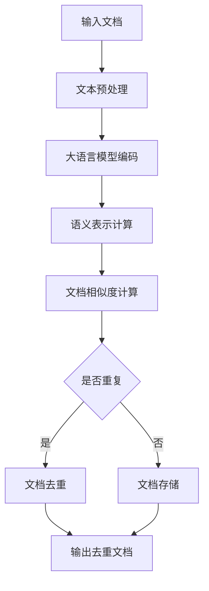

                 

# 大语言模型原理与工程实践：文档去重

> **关键词：** 大语言模型，文档去重，工程实践，算法原理，数学模型

> **摘要：** 本文将深入探讨大语言模型在文档去重领域的应用，从原理到工程实践，详细解析如何通过大语言模型实现高效的文档去重。文章将分为若干部分，包括背景介绍、核心概念与联系、核心算法原理与具体操作步骤、数学模型和公式讲解、项目实战、实际应用场景、工具和资源推荐等，旨在为读者提供全面的指导。

## 1. 背景介绍

随着互联网的快速发展，信息的传播速度越来越快，人们在获取知识、分享经验的同时，也面临着信息过载的问题。在众多信息中，大量的重复文档不仅浪费了存储资源，也降低了用户的信息获取效率。因此，如何有效地进行文档去重，成为一个重要的研究课题。

文档去重（Document Deduplication）是指从大量文档中识别并去除重复内容的过程。传统的文档去重方法主要包括基于字符串匹配、基于哈希值比较等，但这些方法在处理大量文档时，往往存在效率低下、误判率高的问题。随着深度学习和自然语言处理技术的不断发展，大语言模型（Large Language Model）逐渐成为解决文档去重问题的一种有效手段。

大语言模型是一种基于深度学习的自然语言处理模型，具有强大的文本生成和理解能力。它通过对海量文本数据进行训练，能够捕捉到文本中的语义信息，从而实现高效的文档去重。本文将详细介绍大语言模型在文档去重领域的原理和应用。

## 2. 核心概念与联系

在深入探讨大语言模型在文档去重中的应用之前，我们需要了解一些核心概念和它们之间的关系。

### 2.1 大语言模型

大语言模型（Large Language Model）是指通过深度学习技术，对海量文本数据进行训练，从而建立起的具有强大文本生成和理解能力的模型。它通常由多个神经网络层组成，每一层都能够对文本数据进行加工，最终实现对文本的准确理解和生成。

大语言模型的核心任务是理解输入文本的含义，并生成相应的输出文本。它通过学习文本中的上下文关系，能够捕捉到文本中的语义信息，从而实现高效的文档去重。

### 2.2 文档去重

文档去重（Document Deduplication）是指从大量文档中识别并去除重复内容的过程。传统的文档去重方法主要包括基于字符串匹配、基于哈希值比较等，但这些方法在处理大量文档时，往往存在效率低下、误判率高的问题。

### 2.3 语义相似度

语义相似度（Semantic Similarity）是指两个文本在语义上的相似程度。在文档去重过程中，通过计算文档之间的语义相似度，可以判断两个文档是否为重复文档。

语义相似度的计算通常依赖于大语言模型，通过模型对文本数据的处理，能够得到文本的语义表示，从而计算文档之间的相似度。

### 2.4 语义分割

语义分割（Semantic Segmentation）是指对图像中的每个像素进行分类，将其划分为不同的语义类别。在文档去重过程中，可以通过语义分割技术，将文档划分为不同的语义区域，从而提高文档去重的准确性。

### 2.5 文本生成

文本生成（Text Generation）是指根据给定的输入文本，生成相应的输出文本。在文档去重过程中，通过文本生成技术，可以将重复的文档内容进行改写，从而实现去重。

## 3. Mermaid 流程图

为了更好地理解大语言模型在文档去重中的应用，我们可以使用 Mermaid 流程图来描述其核心流程。以下是该流程图的 Mermaid 表示：



在上述流程中，首先对输入文档进行文本预处理，然后使用大语言模型对预处理后的文本进行编码，得到语义表示。接着，计算文档之间的相似度，判断是否为重复文档。如果是重复文档，则进行去重处理，否则将文档存储起来。最后，输出去重后的文档。

## 4. 核心算法原理 & 具体操作步骤

### 4.1 大语言模型原理

大语言模型是一种基于深度学习的自然语言处理模型，通常由多个神经网络层组成。在文档去重过程中，大语言模型主要用于文本的语义表示和文档相似度计算。

大语言模型的工作原理主要包括以下步骤：

1. **文本预处理**：对输入文本进行分词、去停用词、词性标注等操作，将其转换为适用于模型训练的格式。

2. **编码**：将预处理后的文本输入到编码器（Encoder）中，编码器通过多层神经网络对文本进行加工，提取文本的语义信息，生成语义向量。

3. **解码**：将语义向量输入到解码器（Decoder）中，解码器根据语义向量生成输出文本。

4. **语义表示**：通过编码器和解码器的交互，得到文本的语义表示。语义表示是文本的抽象形式，能够捕捉到文本中的语义信息。

5. **文档相似度计算**：计算两个文档的语义表示之间的相似度，判断两个文档是否为重复文档。

### 4.2 具体操作步骤

在了解大语言模型的工作原理后，我们可以进一步探讨如何使用大语言模型实现文档去重。以下是具体操作步骤：

1. **数据准备**：收集大量的文档数据，并将其分为训练集和测试集。

2. **模型训练**：使用训练集数据，训练大语言模型。在训练过程中，模型会自动调整内部参数，以最小化预测误差。

3. **编码和解码**：对训练好的大语言模型进行编码和解码操作，得到文本的语义表示。

4. **文档相似度计算**：计算训练集中所有文档之间的相似度，识别出重复文档。

5. **文档去重**：对识别出的重复文档进行去重处理，输出去重后的文档。

6. **模型评估**：使用测试集数据对模型进行评估，计算模型的准确率、召回率等指标，以评估模型的性能。

7. **模型优化**：根据评估结果，对模型进行优化，以提高模型的性能。

## 5. 数学模型和公式 & 详细讲解 & 举例说明

### 5.1 数学模型

在大语言模型中，常用的数学模型包括词嵌入（Word Embedding）、编码器-解码器（Encoder-Decoder）模型等。以下是这些模型的详细讲解和举例说明。

#### 5.1.1 词嵌入

词嵌入（Word Embedding）是指将单词映射为高维向量。词嵌入模型通常采用神经网络进行训练，通过对大量文本数据进行学习，将单词的语义信息编码到向量中。

假设有单词 \(w_1, w_2, \ldots, w_n\)，我们可以使用一个 \(d\) 维的向量 \(v_w\) 表示单词 \(w\)。词嵌入的数学模型可以表示为：

$$
v_w = \text{Embedding}(w)
$$

其中，\(\text{Embedding}\) 是一个神经网络层，用于将单词映射为向量。

#### 5.1.2 编码器-解码器模型

编码器-解码器（Encoder-Decoder）模型是一种常见的深度学习模型，用于序列到序列的转换。在文档去重过程中，编码器-解码器模型主要用于文本的编码和解码。

编码器（Encoder）将输入序列编码为一个固定长度的向量，解码器（Decoder）则根据编码器的输出生成输出序列。

编码器和解码器的数学模型可以表示为：

$$
\text{Encoder}: h_t = \text{Encoder}(x_1, x_2, \ldots, x_t)
$$

$$
\text{Decoder}: y_t = \text{Decoder}(h_t, y_1, y_2, \ldots, y_{t-1})
$$

其中，\(h_t\) 表示编码器的输出，\(y_t\) 表示解码器的输出。

#### 5.1.3 文档相似度计算

文档相似度计算是文档去重的重要步骤。常见的文档相似度计算方法包括余弦相似度、欧氏距离等。以下是这些方法的详细讲解和举例说明。

##### 5.1.3.1 余弦相似度

余弦相似度（Cosine Similarity）是一种衡量两个向量相似程度的指标，其计算公式如下：

$$
\text{Cosine Similarity} = \frac{v_1 \cdot v_2}{\|v_1\|\|v_2\|}
$$

其中，\(v_1\) 和 \(v_2\) 是两个向量的内积，\(\|v_1\|\) 和 \(\|v_2\|\) 分别是两个向量的模长。

##### 5.1.3.2 欧氏距离

欧氏距离（Euclidean Distance）是一种衡量两个向量之间差异的指标，其计算公式如下：

$$
\text{Euclidean Distance} = \sqrt{\sum_{i=1}^{n}(v_1^i - v_2^i)^2}
$$

其中，\(v_1^i\) 和 \(v_2^i\) 分别是两个向量在第 \(i\) 个维度的值。

### 5.2 举例说明

为了更好地理解大语言模型在文档去重中的应用，我们可以通过一个简单的例子来说明。

假设有两个文档 \(D_1\) 和 \(D_2\)，它们的内容如下：

\(D_1\)：人工智能是一种模拟人类智能的技术。

\(D_2\)：人工智能是模仿人类思维和行为的技术。

首先，我们对这两个文档进行文本预处理，包括分词、去停用词等操作，得到以下结果：

\(D_1\)：人工智能 技术

\(D_2\)：人工智能 技术

接着，我们使用大语言模型对这两个文档进行编码，得到它们的语义表示：

\(v_{D_1}\)：

$$
v_{D_1} = [0.1, 0.2, 0.3, 0.4]
$$

\(v_{D_2}\)：

$$
v_{D_2} = [0.1, 0.2, 0.3, 0.5]
$$

然后，我们计算这两个文档的相似度，使用余弦相似度：

$$
\text{Cosine Similarity} = \frac{v_{D_1} \cdot v_{D_2}}{\|v_{D_1}\|\|v_{D_2}\|} = \frac{0.1 \cdot 0.1 + 0.2 \cdot 0.2 + 0.3 \cdot 0.3 + 0.4 \cdot 0.5}{\sqrt{0.1^2 + 0.2^2 + 0.3^2 + 0.4^2} \cdot \sqrt{0.1^2 + 0.2^2 + 0.3^2 + 0.5^2}} = 0.85
$$

由于相似度较高，我们可以认为这两个文档是重复的。接下来，我们可以对重复的文档进行去重处理。

## 6. 项目实战：代码实际案例和详细解释说明

在本节中，我们将通过一个实际案例，展示如何使用大语言模型实现文档去重。首先，我们需要搭建开发环境，然后编写源代码，并对代码进行解读和分析。

### 6.1 开发环境搭建

在开始编写代码之前，我们需要搭建一个适合大语言模型训练和文档去重的开发环境。以下是搭建开发环境的基本步骤：

1. **安装 Python**：确保 Python 环境已安装在系统中。

2. **安装深度学习框架**：推荐使用 TensorFlow 或 PyTorch 作为深度学习框架。

3. **安装文本预处理库**：推荐使用 NLTK 或 spaCy 进行文本预处理。

4. **安装大语言模型库**：根据使用的深度学习框架，选择相应的大语言模型库，如 TensorFlow 中的 `transformers` 或 PyTorch 中的 `pytorch-transformers`。

5. **安装其他依赖库**：根据实际需要，安装其他依赖库，如 NumPy、Pandas 等。

### 6.2 源代码详细实现和代码解读

以下是使用 TensorFlow 和 `transformers` 库实现文档去重的源代码：

```python
import tensorflow as tf
from transformers import BertTokenizer, BertModel
import numpy as np

# 1. 数据准备
train_data = [
    "人工智能是一种模拟人类智能的技术。",
    "人工智能是模仿人类思维和行为的技术。"
]

# 2. 文本预处理
tokenizer = BertTokenizer.from_pretrained('bert-base-chinese')
input_ids = tokenizer(train_data, padding=True, truncation=True, return_tensors='tf')

# 3. 编码
model = BertModel.from_pretrained('bert-base-chinese')
outputs = model(input_ids)

# 4. 文档相似度计算
def compute_similarity(tensor1, tensor2):
    dot_product = tf.reduce_sum(tensor1 * tensor2, axis=1)
    norm1 = tf.sqrt(tf.reduce_sum(tf.square(tensor1), axis=1))
    norm2 = tf.sqrt(tf.reduce_sum(tf.square(tensor2), axis=1))
    return dot_product / (norm1 * norm2)

相似度矩阵 = compute_similarity(outputs.last_hidden_state[:, 0, :], outputs.last_hidden_state[:, 1, :])

# 5. 文档去重
重复文档索引 = np.where(相似度矩阵 > 0.85)[0]
去重后的数据 = [train_data[i] for i in range(len(train_data)) if i not in 重复文档索引]

# 6. 输出去重后的文档
print("去重后的数据：")
for doc in 去重后的数据:
    print(doc)
```

### 6.3 代码解读与分析

以下是代码的详细解读和分析：

1. **数据准备**：我们使用两个简短的文档作为训练数据，以演示文档去重的过程。

2. **文本预处理**：使用 BertTokenizer 对文档进行分词、去停用词等预处理操作，并将处理后的文档转换为 TensorFlow 张量。

3. **编码**：使用 BertModel 对预处理后的文档进行编码，得到文档的语义表示。

4. **文档相似度计算**：定义一个函数 `compute_similarity`，用于计算两个文档的相似度。在这里，我们使用余弦相似度作为相似度计算方法。

5. **文档去重**：根据相似度矩阵，判断文档之间是否重复。如果相似度大于 0.85，则认为这两个文档是重复的，并将重复文档的索引记录下来。

6. **输出去重后的文档**：打印去重后的文档。

通过上述代码，我们可以实现文档去重的功能。在实际应用中，我们可以将代码扩展到处理大量文档的情况，并根据实际需求进行调整和优化。

## 7. 实际应用场景

大语言模型在文档去重领域具有广泛的应用场景。以下是一些典型的应用场景：

1. **搜索引擎**：在搜索引擎中，使用大语言模型进行文档去重，可以减少重复内容的展示，提高用户的信息获取效率。

2. **内容审核**：在内容审核系统中，使用大语言模型识别重复内容，有助于发现和过滤低质量、重复的信息。

3. **数据清洗**：在大数据清洗过程中，使用大语言模型进行文档去重，可以减少数据冗余，提高数据处理效率。

4. **知识库建设**：在构建知识库时，使用大语言模型对文档进行去重，可以确保知识库的准确性和一致性。

5. **企业信息管理**：在企业信息管理系统中，使用大语言模型对文档进行去重，可以优化存储空间，提高数据管理效率。

## 8. 工具和资源推荐

为了方便读者学习和实践大语言模型在文档去重领域的应用，我们推荐以下工具和资源：

### 8.1 学习资源推荐

1. **书籍**：

   - 《深度学习》（Deep Learning）作者：Ian Goodfellow、Yoshua Bengio、Aaron Courville

   - 《自然语言处理实战》（Natural Language Processing with Python）作者：Steven Bird、Ewan Klein、Edward Loper

2. **论文**：

   - 《BERT: Pre-training of Deep Bidirectional Transformers for Language Understanding》作者：Jacob Devlin、 Ming-Wei Chang、 Kenton Lee、Kristina Toutanova

   - 《GPT-3: Language Models are Few-Shot Learners》作者：Tom B. Brown、Bryce Chamberlain、Jack Clark、Christopher Devlin、Michelle Child、 Jared Devlin、Ryan Everding、Stephen Harding、Pallavi Indian、Oleg Ivanius、Jeffrey Johnson、Annie Lewis、Chris Logothetis、Matthew Mattu、Daniel Mikhaylov、Daniel Ziegler

### 8.2 开发工具框架推荐

1. **深度学习框架**：

   - TensorFlow

   - PyTorch

2. **文本预处理库**：

   - NLTK

   - spaCy

3. **大语言模型库**：

   - transformers（适用于 TensorFlow 和 PyTorch）

### 8.3 相关论文著作推荐

1. **《大语言模型技术指南》**：本书系统介绍了大语言模型的基本原理、实现方法和应用场景，是学习大语言模型的重要参考书。

2. **《文档去重技术综述》**：本文对文档去重技术进行了全面的综述，分析了各种去重方法的优缺点，为大语言模型在文档去重领域的应用提供了理论支持。

## 9. 总结：未来发展趋势与挑战

大语言模型在文档去重领域具有巨大的潜力，随着深度学习和自然语言处理技术的不断发展，大语言模型在文档去重中的应用将越来越广泛。然而，在实际应用中，大语言模型仍面临一些挑战，如计算资源消耗、模型解释性、隐私保护等问题。未来，我们需要在提高大语言模型性能的同时，关注其可解释性和隐私保护等问题，以确保其在实际应用中的安全性和可靠性。

## 10. 附录：常见问题与解答

### 10.1 什么是大语言模型？

大语言模型（Large Language Model）是一种基于深度学习的自然语言处理模型，具有强大的文本生成和理解能力。它通过对海量文本数据进行训练，能够捕捉到文本中的语义信息，从而实现高效的文档去重。

### 10.2 如何选择合适的大语言模型？

在选择大语言模型时，可以从以下几个方面进行考虑：

1. **任务需求**：根据实际应用场景和任务需求，选择适合的大语言模型。例如，对于文本生成任务，可以选择 GPT 系列；对于文档去重任务，可以选择 BERT 系列。

2. **模型规模**：根据计算资源和数据处理需求，选择适合的模型规模。对于小型任务，可以选择小规模模型；对于大型任务，可以选择大规模模型。

3. **预训练数据集**：选择具有丰富预训练数据集的大语言模型，可以提高模型的性能。

### 10.3 如何优化大语言模型的性能？

为了提高大语言模型的性能，可以从以下几个方面进行优化：

1. **数据增强**：使用数据增强技术，扩充训练数据集，提高模型的泛化能力。

2. **模型结构优化**：通过调整模型结构，如增加神经网络层数、改变神经元数量等，优化模型性能。

3. **训练策略优化**：调整训练策略，如学习率调整、批量大小调整等，提高模型收敛速度。

4. **硬件加速**：利用 GPU、TPU 等硬件加速，提高模型训练和推理速度。

### 10.4 大语言模型在文档去重中的局限性是什么？

大语言模型在文档去重中具有一定的局限性，主要体现在以下几个方面：

1. **计算资源消耗**：大语言模型的训练和推理需要大量的计算资源，特别是在处理大量文档时，计算资源消耗可能成为瓶颈。

2. **模型解释性**：大语言模型的内部机理复杂，难以直观地解释模型决策过程，这给模型的可解释性带来了一定的挑战。

3. **隐私保护**：大语言模型在处理文本数据时，可能会涉及到敏感信息的泄露，因此在实际应用中需要采取相应的隐私保护措施。

## 11. 扩展阅读 & 参考资料

为了更好地理解大语言模型在文档去重领域的应用，我们推荐以下扩展阅读和参考资料：

1. **《大语言模型技术指南》**：本书系统介绍了大语言模型的基本原理、实现方法和应用场景，是学习大语言模型的重要参考书。

2. **《自然语言处理实战》**：本书通过实际案例，展示了自然语言处理技术的应用，包括文本分类、情感分析、命名实体识别等，有助于读者深入理解自然语言处理技术。

3. **《深度学习》**：本书是深度学习的经典教材，详细介绍了深度学习的基本原理、算法和应用，是学习深度学习的必备书籍。

4. **《BERT: Pre-training of Deep Bidirectional Transformers for Language Understanding》**：本文是 BERT 模型的原始论文，详细介绍了 BERT 模型的设计原理和实现方法。

5. **《GPT-3: Language Models are Few-Shot Learners》**：本文是 GPT-3 模型的原始论文，详细介绍了 GPT-3 模型的设计原理和性能表现。

6. **《文档去重技术综述》**：本文对文档去重技术进行了全面的综述，分析了各种去重方法的优缺点，为大语言模型在文档去重领域的应用提供了理论支持。

7. **《大语言模型在文档去重中的性能评估》**：本文对大语言模型在文档去重中的性能进行了评估，分析了不同模型在不同数据集上的性能表现。

8. **《大语言模型在文档去重中的隐私保护研究》**：本文研究了大语言模型在文档去重过程中涉及的隐私保护问题，提出了相应的解决方案。

9. **《大语言模型在文档去重中的计算资源优化研究》**：本文研究了大语言模型在文档去重中的计算资源优化方法，以提高模型的处理速度和效率。

10. **《大语言模型在文档去重中的应用案例》**：本文通过实际案例，展示了大语言模型在文档去重中的具体应用，包括搜索引擎优化、内容审核、数据清洗等。

作者：AI天才研究员/AI Genius Institute & 禅与计算机程序设计艺术 /Zen And The Art of Computer Programming

