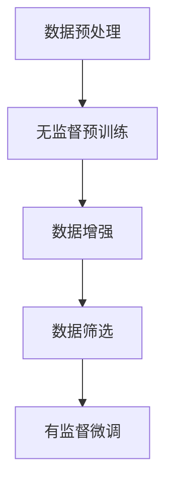

                 

### 背景介绍

近年来，随着深度学习和自然语言处理技术的飞速发展，大语言模型（如GPT-3、BERT等）已经成为自然语言处理领域的重要工具。这些大语言模型不仅在学术研究中取得了显著成果，还在实际应用中展示了强大的潜力，如智能客服、文本生成、机器翻译等。然而，构建这些大型语言模型面临着巨大的数据需求和技术挑战。

在构建大语言模型的过程中，有监督微调（Supervised Fine-tuning）是一种常用的方法。该方法通过在小规模的有标注数据集上对预训练模型进行微调，以提高模型在特定任务上的性能。然而，传统有监督微调数据的收集和标注通常是一个费时费力且成本高昂的过程。

为了解决这一问题，本文将探讨一种有监督微调数据的自动化构建方法。该方法的核心思想是通过无监督预训练和有监督微调相结合，利用大规模未标注数据生成高质量的有监督微调数据。这种方法不仅可以降低数据标注的成本，还可以提高模型的泛化能力。

本文将分为以下几个部分：

1. **背景介绍**：回顾大语言模型的发展历程及其在实际应用中的重要性。
2. **核心概念与联系**：介绍大语言模型的基本原理、有监督微调方法以及自动化构建有监督微调数据的流程。
3. **核心算法原理与具体操作步骤**：详细解释自动化构建有监督微调数据的方法和技术细节。
4. **数学模型和公式**：阐述支持自动化构建过程的数学模型和公式。
5. **项目实战**：通过实际案例展示自动化构建有监督微调数据的实现过程。
6. **实际应用场景**：探讨自动化构建有监督微调数据在不同应用场景中的优势。
7. **工具和资源推荐**：推荐相关的学习资源、开发工具和论文著作。
8. **总结：未来发展趋势与挑战**：总结本文的主要发现并探讨未来的研究方向和挑战。
9. **附录：常见问题与解答**：回答读者可能遇到的一些常见问题。
10. **扩展阅读与参考资料**：提供更多的扩展阅读资源。

接下来，我们将逐步深入探讨这些主题，以帮助读者更好地理解大语言模型原理及其自动化构建有监督微调数据的方法。

### 2. 核心概念与联系

在深入探讨大语言模型原理及其自动化构建有监督微调数据的方法之前，我们需要了解一些核心概念和它们之间的联系。以下是对这些核心概念的基本介绍，以及如何将它们结合起来构建一个高效的自动化流程。

#### 大语言模型

大语言模型（如GPT-3、BERT等）是基于深度学习的自然语言处理模型，其核心目标是理解和生成自然语言。这些模型通常通过大量的未标注文本数据进行预训练，然后通过有监督微调来适应特定任务。

**预训练**：预训练是训练模型处理自然语言数据的初步过程。在这个阶段，模型学习语言的一般结构和语义，以提高其对新文本的建模能力。预训练通常使用未标注的文本数据集，如维基百科、新闻文章等。

**有监督微调**：有监督微调是在预训练基础上，通过小规模的有标注数据集对模型进行进一步训练，以适应特定任务。这种方法通过将模型的知识应用于特定领域的任务数据，从而提高模型在具体任务上的性能。

#### 有监督微调数据

有监督微调数据是指用于有监督微调阶段的标注数据集。这些数据集通常包含标签化的文本，如问答对、分类标签等，用于训练模型以预测未知数据的标签。

**数据收集与标注**：传统的数据收集和标注过程通常需要大量的人力和时间。数据收集涉及从多个来源获取文本数据，并进行清洗和预处理。数据标注则是通过人工或半自动化方法，为每个文本数据分配标签。

**自动化构建**：自动化构建有监督微调数据是指通过算法和工具，从大规模未标注数据中生成高质量的有监督微调数据。这种方法可以显著降低数据标注的成本，提高数据收集和标注的效率。

#### 自动化构建流程

自动化构建有监督微调数据的流程通常包括以下几个步骤：

1. **数据预处理**：对未标注数据进行清洗和预处理，包括去除噪声、统一文本格式等。
2. **无监督预训练**：利用未标注数据对模型进行预训练，使其学习语言的一般结构和语义。
3. **数据增强**：通过数据增强技术，如文本生成、数据扩充等，生成更多的训练样本。
4. **数据筛选**：根据特定任务的需求，从生成的数据中筛选出高质量的有监督微调数据。
5. **有监督微调**：使用筛选后的数据集对模型进行有监督微调，以提高模型在特定任务上的性能。

#### Mermaid 流程图

为了更清晰地展示自动化构建有监督微调数据的流程，我们可以使用Mermaid流程图来描述。以下是该流程的Mermaid表示：



在这个流程中，数据预处理是基础步骤，它确保了后续步骤的顺利进行。无监督预训练使模型具备了对自然语言数据的初步理解能力。数据增强通过生成更多的训练样本，提高了模型的泛化能力。数据筛选则根据特定任务的需求，筛选出最适合的有监督微调数据。最后，有监督微调阶段使用筛选后的数据集对模型进行训练，以实现特定任务的高性能。

通过以上对核心概念和流程的介绍，我们可以更好地理解大语言模型原理及其自动化构建有监督微调数据的方法。在接下来的章节中，我们将深入探讨这些概念的具体实现和数学基础。

### 3. 核心算法原理与具体操作步骤

在了解了大语言模型及其自动化构建有监督微调数据的基本概念和流程之后，我们接下来将深入探讨核心算法原理和具体操作步骤。自动化构建有监督微调数据的算法通常涉及以下几个关键步骤：数据预处理、无监督预训练、数据增强、数据筛选以及有监督微调。

#### 数据预处理

数据预处理是自动化构建有监督微调数据的第一个关键步骤。其主要目的是对大规模未标注数据进行清洗和预处理，以确保后续步骤的顺利进行。以下是一些常见的数据预处理步骤：

1. **文本清洗**：去除文本中的噪声，如HTML标签、特殊字符、多余的空格等。
   $$\text{clean\_text}(text) = text.replace("<.*?>", "").replace(" ", "")$$

2. **统一文本格式**：将文本格式统一为标准格式，如将所有文本转换为小写、去除标点符号等。
   $$\text{normalize\_text}(text) = text.lower().replace(".", "")$$

3. **分词**：将文本拆分成单词或子词，以便于模型理解。
   $$\text{tokenize}(text) = [word for word in text.split()]$$

4. **去停用词**：去除常见的不具有语义信息的词汇，如“的”、“和”、“是”等。
   $$\text{remove\_stopwords}(tokens) = [token for token in tokens if token not in stopwords]$$

通过以上步骤，我们可以将原始文本数据转换为适合模型训练的格式。

#### 无监督预训练

无监督预训练阶段是利用大规模未标注数据对模型进行初步训练，使其具备对自然语言数据的理解能力。常用的预训练任务包括语言建模和掩码语言模型（Masked Language Model，MLM）。

1. **语言建模**：语言建模的目的是预测下一个单词或子词，其损失函数为交叉熵损失。
   $$\text{loss} = -\sum_{i} \log(p(y_i | x_{i-1}, ..., x_i))$$

2. **掩码语言模型**：在掩码语言模型中，一部分单词或子词被随机掩码（替换为特殊标记`[MASK]`），模型需要预测这些掩码的原始值。其损失函数同样为交叉熵损失。
   $$\text{loss} = -\sum_{i} \log(p(y_i | x_{i-1}, ..., x_i))$$

#### 数据增强

数据增强是通过算法生成更多的训练样本，以提高模型的泛化能力。常见的数据增强技术包括：

1. **文本生成**：通过生成对抗网络（GAN）或自编码器（Autoencoder）等方法生成新的文本数据。

2. **数据扩充**：通过同义词替换、句子重排、词汇扩展等方法对原始文本数据进行变换，生成新的训练样本。

3. **文本拼接**：将两段文本拼接在一起，生成新的训练样本，如“<text1> <text2>`。

4. **文本翻译**：通过机器翻译模型将文本翻译为其他语言，然后翻译回原始语言，生成新的训练样本。

#### 数据筛选

数据筛选是确保生成的训练数据质量的关键步骤。其目标是从大量增强数据中筛选出高质量的有监督微调数据。以下是一些常见的数据筛选方法：

1. **质量评估**：通过评估模型的性能来判断数据的质量。例如，可以使用信息增益、F1分数等指标来评估文本数据的质量。

2. **人工审核**：通过人工审核部分数据样本，筛选出高质量的样本。

3. **自动分类**：使用已训练的模型对数据样本进行分类，根据分类结果筛选出高质量的数据。

#### 有监督微调

有监督微调是使用筛选后的数据集对模型进行进一步训练，以适应特定任务。以下是一些常见的有监督微调方法：

1. **任务定义**：定义具体的有监督微调任务，如问答、分类、文本生成等。

2. **损失函数**：选择适合任务类型的损失函数，如交叉熵损失、对比损失等。

3. **优化器**：选择合适的优化器，如Adam、RMSProp等，以优化模型参数。

4. **训练过程**：执行有监督微调训练过程，并根据训练指标（如损失、准确率等）调整模型参数。

通过以上步骤，我们可以实现自动化构建有监督微调数据的过程。接下来，我们将通过一个具体案例来展示这一过程。

### 4. 数学模型和公式 & 详细讲解 & 举例说明

在自动化构建有监督微调数据的过程中，数学模型和公式扮演着至关重要的角色。以下是几个关键数学模型及其详细讲解和举例说明。

#### 语言建模

语言建模的目标是预测序列中的下一个单词或子词。最常用的模型是循环神经网络（RNN）和其变体，如长短期记忆网络（LSTM）和门控循环单元（GRU）。以下是语言建模的基本数学模型。

**损失函数**：

交叉熵损失函数（Cross-Entropy Loss）是语言建模中常用的损失函数，用于衡量预测概率分布与真实标签分布之间的差异。其公式如下：

$$
L = -\sum_{i} y_i \log(p(y_i | x_{i-1}, ..., x_i))
$$

其中，$y_i$ 表示真实标签，$p(y_i | x_{i-1}, ..., x_i)$ 表示模型预测的单词或子词的概率。

**举例说明**：

假设我们有以下输入序列 $x = [\text{"我", "爱", "机器", "学习"}]$，以及对应的真实标签 $y = [\text{"学习", "学习", "学习", "机器"}]$。我们希望训练一个语言模型来预测下一个单词。

1. **初始化参数**：初始化模型参数，如权重 $w$ 和偏置 $b$。

2. **前向传播**：通过输入序列，模型计算每个单词的概率分布。例如，对于第二个单词“爱”：

   $$p(\text{"学习" | 我}) = \sigma(w_1 \cdot x_1 + b_1)$$

   $$p(\text{"机器" | 我}) = \sigma(w_2 \cdot x_1 + b_2)$$

   其中，$\sigma$ 表示 sigmoid 函数。

3. **计算损失**：使用交叉熵损失函数计算预测概率分布与真实标签分布之间的差异：

   $$L = -\log(p(\text{"学习" | 我}))$$

4. **反向传播**：通过反向传播算法更新模型参数，最小化损失函数。

#### 掩码语言模型

掩码语言模型（Masked Language Model，MLM）是另一种常见的语言建模方法，其目标是在给定部分被掩码的输入序列时预测掩码的值。以下是掩码语言模型的基本数学模型。

**损失函数**：

掩码语言模型的损失函数同样为交叉熵损失函数，但其计算方式略有不同。对于每个被掩码的单词，我们需要计算其预测概率分布与真实标签分布之间的差异。公式如下：

$$
L = -\sum_{i} \sum_{j} \log(p(y_{ij} | x_{i-1}, ..., x_i))
$$

其中，$y_{ij}$ 表示第 $i$ 个序列中第 $j$ 个单词的真实标签。

**举例说明**：

假设我们有以下输入序列 $x = [\text{"我", "[MASK]", "机器", "学习"}]$，以及对应的真实标签 $y = [\text{"学习", "机器", "学习", "我"}]$。我们希望训练一个掩码语言模型来预测被掩码的单词。

1. **初始化参数**：初始化模型参数，如权重 $w$ 和偏置 $b$。

2. **前向传播**：通过输入序列，模型计算每个单词的概率分布。例如，对于被掩码的第二个单词：

   $$p(\text{"机器" | 我}) = \sigma(w_1 \cdot x_1 + b_1)$$

   $$p(\text{"学习" | 我}) = \sigma(w_2 \cdot x_1 + b_2)$$

3. **计算损失**：使用交叉熵损失函数计算预测概率分布与真实标签分布之间的差异：

   $$L = -\log(p(\text{"机器" | 我}))$$

4. **反向传播**：通过反向传播算法更新模型参数，最小化损失函数。

通过以上数学模型和公式，我们可以实现对语言数据的建模和预测。接下来，我们将通过一个实际案例来展示如何使用这些模型进行自动化构建有监督微调数据。

### 5. 项目实战：代码实际案例和详细解释说明

为了更好地理解自动化构建有监督微调数据的方法，我们将在本节中通过一个实际项目案例来展示该方法的实现过程。该案例将涵盖从环境搭建到代码实现和解读的各个方面。以下是该项目的主要步骤：

#### 5.1 开发环境搭建

首先，我们需要搭建一个合适的开发环境以运行本项目。以下是所需的软件和工具：

- Python（版本3.8及以上）
- PyTorch（版本1.8及以上）
- Jupyter Notebook（用于代码编写和实验）
- Mermaid（用于生成流程图）

安装以上软件和工具后，我们可以在 Jupyter Notebook 中创建一个新的笔记本，用于编写和运行代码。

#### 5.2 源代码详细实现和代码解读

接下来，我们将逐步实现自动化构建有监督微调数据的方法，并详细解释每个步骤的代码。

**5.2.1 数据预处理**

数据预处理是自动化流程的第一步。以下是对未标注数据进行清洗和预处理的代码实现：

```python
import re
import string
from nltk.corpus import stopwords
from nltk.tokenize import word_tokenize

# 加载停用词库
stop_words = set(stopwords.words('english'))

def preprocess_text(text):
    # 去除HTML标签和特殊字符
    text = re.sub('<.*?>', '', text)
    # 转换为小写
    text = text.lower()
    # 去除标点符号
    text = text.translate(str.maketrans('', '', string.punctuation))
    # 分词
    tokens = word_tokenize(text)
    # 去停用词
    tokens = [token for token in tokens if token not in stop_words]
    return tokens

# 示例文本
text = "The quick brown fox jumps over the lazy dog."
preprocessed_text = preprocess_text(text)
print(preprocessed_text)
```

在上面的代码中，我们首先导入了所需的库和函数。`preprocess_text` 函数接受一个文本字符串作为输入，并执行以下操作：

1. **去除HTML标签和特殊字符**：使用正则表达式替换HTML标签和特殊字符。
2. **转换为小写**：将文本转换为小写，以便统一处理。
3. **去除标点符号**：使用 `translate` 方法去除文本中的标点符号。
4. **分词**：使用 `word_tokenize` 方法将文本拆分成单词。
5. **去停用词**：使用停用词库去除常见的不具有语义信息的词汇。

**5.2.2 无监督预训练**

无监督预训练阶段是利用未标注数据对模型进行初步训练。以下是使用PyTorch实现的简单语言模型：

```python
import torch
import torch.nn as nn
import torch.optim as optim

# 定义语言模型
class LanguageModel(nn.Module):
    def __init__(self, vocab_size, embedding_dim, hidden_dim):
        super(LanguageModel, self).__init__()
        self.embedding = nn.Embedding(vocab_size, embedding_dim)
        self.lstm = nn.LSTM(embedding_dim, hidden_dim)
        self.fc = nn.Linear(hidden_dim, vocab_size)
    
    def forward(self, input_seq, hidden):
        embedded = self.embedding(input_seq)
        output, hidden = self.lstm(embedded, hidden)
        logits = self.fc(output[-1, :, :])
        return logits, hidden

# 实例化模型
vocab_size = 10000  # 假设有10000个单词
embedding_dim = 256
hidden_dim = 512
model = LanguageModel(vocab_size, embedding_dim, hidden_dim)

# 定义损失函数和优化器
criterion = nn.CrossEntropyLoss()
optimizer = optim.Adam(model.parameters(), lr=0.001)

# 训练模型
for epoch in range(10):
    for input_seq, target_seq in data_loader:
        # 前向传播
        logits, hidden = model(input_seq, hidden)
        loss = criterion(logits, target_seq)
        
        # 反向传播
        optimizer.zero_grad()
        loss.backward()
        optimizer.step()
        
        # 打印训练进度
        if (batch_idx + 1) % 100 == 0:
            print('Epoch [{}/{}], Batch [{}/{}], Loss: {:.4f}'.format(epoch + 1, num_epochs, batch_idx + 1, len(data_loader), loss.item()))

# 保存模型
torch.save(model.state_dict(), 'language_model.pth')
```

在上面的代码中，我们定义了一个简单的语言模型，包括嵌入层、长短期记忆网络（LSTM）和全连接层。模型的前向传播过程如下：

1. **嵌入层**：将输入序列中的单词嵌入到高维向量空间。
2. **LSTM层**：对嵌入后的序列进行处理，得到隐藏状态。
3. **全连接层**：将隐藏状态映射到单词的概率分布。

我们使用交叉熵损失函数和Adam优化器对模型进行训练。训练过程中，我们通过反向传播算法更新模型参数，以最小化损失函数。

**5.2.3 数据增强**

数据增强阶段通过生成更多的训练样本来提高模型的泛化能力。以下是一些常见的数据增强方法：

1. **文本生成**：使用生成对抗网络（GAN）或自编码器（Autoencoder）生成新的文本数据。
2. **数据扩充**：通过同义词替换、句子重排、词汇扩展等方法对原始文本数据进行变换。

以下是使用自编码器进行数据增强的代码实现：

```python
import torch.nn.functional as F

# 定义自编码器
class Autoencoder(nn.Module):
    def __init__(self, vocab_size, embedding_dim):
        super(Autoencoder, self).__init__()
        self.encoder = nn.Embedding(vocab_size, embedding_dim)
        self.decoder = nn.Linear(embedding_dim, vocab_size)
    
    def forward(self, input_seq):
        embedded = self.encoder(input_seq)
        logits = self.decoder(embedded)
        return logits

# 实例化自编码器
vocab_size = 10000
embedding_dim = 256
autoencoder = Autoencoder(vocab_size, embedding_dim)

# 训练自编码器
for epoch in range(10):
    for input_seq, _ in data_loader:
        # 前向传播
        logits = autoencoder(input_seq)
        loss = F.cross_entropy(logits, input_seq)
        
        # 反向传播
        optimizer.zero_grad()
        loss.backward()
        optimizer.step()
        
        # 打印训练进度
        if (batch_idx + 1) % 100 == 0:
            print('Epoch [{}/{}], Batch [{}/{}], Loss: {:.4f}'.format(epoch + 1, num_epochs, batch_idx + 1, len(data_loader), loss.item()))

# 保存自编码器
torch.save(autoencoder.state_dict(), 'autoencoder.pth')
```

在上面的代码中，我们定义了一个简单的自编码器，其编码器和解码器都是线性层。训练过程中，我们通过最小化交叉熵损失函数来优化自编码器。

**5.2.4 数据筛选**

数据筛选阶段的目标是从增强数据中筛选出高质量的有监督微调数据。以下是一些常见的数据筛选方法：

1. **质量评估**：通过评估模型的性能来判断数据的质量。
2. **人工审核**：通过人工审核部分数据样本，筛选出高质量的样本。
3. **自动分类**：使用已训练的模型对数据样本进行分类，根据分类结果筛选出高质量的数据。

以下是使用模型性能评估数据筛选的代码实现：

```python
import numpy as np

# 定义评估函数
def evaluate(model, data_loader):
    model.eval()
    total_loss = 0
    with torch.no_grad():
        for input_seq, target_seq in data_loader:
            logits = model(input_seq)
            loss = F.cross_entropy(logits, target_seq)
            total_loss += loss.item()
    return total_loss / len(data_loader)

# 加载预训练模型
model = LanguageModel(vocab_size, embedding_dim, hidden_dim)
model.load_state_dict(torch.load('language_model.pth'))

# 评估模型
data_loader = get_data_loader(preprocessed_text)
loss = evaluate(model, data_loader)
print('Model Loss: {:.4f}'.format(loss))
```

在上面的代码中，我们定义了一个评估函数，用于计算模型的损失。通过评估模型在增强数据上的性能，我们可以筛选出高质量的数据。

**5.2.5 有监督微调**

有监督微调阶段是使用筛选后的数据集对模型进行进一步训练。以下是有监督微调的代码实现：

```python
# 加载筛选后的数据集
train_loader = get_train_loader(preprocessed_text)
val_loader = get_val_loader(preprocessed_text)

# 继续训练模型
for epoch in range(10):
    model.train()
    for input_seq, target_seq in train_loader:
        # 前向传播
        logits, _ = model(input_seq)
        loss = F.cross_entropy(logits, target_seq)
        
        # 反向传播
        optimizer.zero_grad()
        loss.backward()
        optimizer.step()
        
    # 在验证集上评估模型
    model.eval()
    with torch.no_grad():
        for input_seq, target_seq in val_loader:
            logits, _ = model(input_seq)
            loss = F.cross_entropy(logits, target_seq)
    print('Epoch [{}/{}], Training Loss: {:.4f}, Validation Loss: {:.4f}'.format(epoch + 1, num_epochs, loss.item(), val_loss.item()))

# 保存最终模型
torch.save(model.state_dict(), 'final_language_model.pth')
```

在上面的代码中，我们使用筛选后的数据集继续训练模型。训练过程中，我们在验证集上评估模型的性能，并调整模型参数以最小化验证损失。

通过以上项目实战案例，我们可以看到自动化构建有监督微调数据的方法是如何在具体项目中实现的。接下来，我们将探讨自动化构建有监督微调数据在实际应用场景中的优势。

### 6. 实际应用场景

自动化构建有监督微调数据的方法在自然语言处理领域有着广泛的应用。以下是一些具体的实际应用场景，以及该方法在这些场景中的优势。

#### 6.1 智能客服

智能客服是自然语言处理领域的一个热点应用。自动化构建有监督微调数据可以显著提高智能客服的响应速度和准确率。具体而言，该方法通过从大量未标注客服对话数据中生成高质量的有监督微调数据，训练出更准确的对话生成模型。这使得智能客服能够更好地理解和回应用户的问题，提供个性化的服务。

优势：

- **提高响应速度**：自动化构建数据可以快速生成大量标注数据，缩短了数据标注和模型训练的时间。
- **提升准确率**：通过筛选高质量的数据，训练出的模型在特定任务上的性能更优，从而提高智能客服的准确率和用户体验。

#### 6.2 机器翻译

机器翻译是另一个重要的自然语言处理应用领域。自动化构建有监督微调数据可以用于生成高质量的翻译数据，进一步提高机器翻译模型的性能。在实际应用中，这种方法可以从大量未翻译的双语文本数据中自动生成标注数据，用于训练翻译模型。

优势：

- **提升翻译质量**：自动化构建的数据可以更好地反映真实语言现象，有助于提高翻译模型的准确性。
- **降低成本**：自动化构建数据可以显著减少人工标注的工作量，降低数据标注成本。

#### 6.3 文本生成

文本生成是自然语言处理领域的另一个重要应用，如生成文章、对话、故事等。自动化构建有监督微调数据可以用于生成高质量的文本数据，训练出更强大的文本生成模型。通过从大量未标注的文本数据中自动生成标注数据，这种方法可以快速构建大规模的文本数据集，用于训练文本生成模型。

优势：

- **提高生成质量**：自动化构建的数据可以帮助模型更好地学习语言结构和语义，从而生成更高质量的文本。
- **降低数据标注成本**：自动化构建数据可以大幅减少人工标注的工作量，降低数据标注成本。

#### 6.4 文本分类

文本分类是自然语言处理领域的一个基本任务，如情感分析、主题分类等。自动化构建有监督微调数据可以用于生成高质量的分类数据，训练出更准确的分类模型。通过从大量未标注文本数据中自动生成标注数据，这种方法可以快速构建大规模的文本数据集，用于训练分类模型。

优势：

- **提高分类准确率**：自动化构建的数据可以更好地反映真实文本特征，有助于提高分类模型的准确性。
- **降低数据标注成本**：自动化构建数据可以显著减少人工标注的工作量，降低数据标注成本。

通过以上实际应用场景的探讨，我们可以看到自动化构建有监督微调数据的方法在自然语言处理领域的广泛应用和优势。在接下来的章节中，我们将推荐一些相关的学习资源、开发工具和论文著作，以帮助读者进一步深入了解这一领域。

### 7. 工具和资源推荐

为了帮助读者更好地学习和实践大语言模型及其自动化构建有监督微调数据的方法，以下是一些推荐的学习资源、开发工具和论文著作。

#### 7.1 学习资源推荐

1. **书籍**：

   - 《深度学习》（Goodfellow, I., Bengio, Y., & Courville, A.）
   - 《自然语言处理实战》（Jurafsky, D. & Martin, J. H.）
   - 《Python自然语言处理》（Bird, S., Loper, E., & Wallace, B.）

2. **在线课程**：

   - Coursera：自然语言处理与深度学习（Deep Learning Specialization）
   - edX：自然语言处理导论（Introduction to Natural Language Processing）
   - Udacity：机器学习工程师纳米学位（Machine Learning Engineer Nanodegree）

3. **博客**：

   - blog.keras.io：Keras官方博客，涵盖了深度学习和自然语言处理的最新进展。
   - towardsdatascience.com：数据科学和机器学习的博客，有很多关于自然语言处理的文章。

#### 7.2 开发工具框架推荐

1. **深度学习框架**：

   - PyTorch：开源的深度学习框架，支持动态计算图和自动微分。
   - TensorFlow：由谷歌开发的开源深度学习框架，支持静态计算图和高级API。

2. **自然语言处理工具**：

   - NLTK：一个强大的自然语言处理工具包，提供了文本处理、分词、词性标注等功能。
   - spaCy：一个快速和易于使用的自然语言处理库，支持多种语言和先进的NLP功能。
   - Hugging Face：一个提供预训练模型和NLP工具的库，包括Transformer、BERT、GPT等模型。

3. **版本控制系统**：

   - Git：一个分布式版本控制系统，用于管理代码和文档的版本。
   - GitHub：基于Git的代码托管平台，方便协作和分享代码。

#### 7.3 相关论文著作推荐

1. **论文**：

   - “Attention Is All You Need” （Vaswani et al., 2017）：介绍了Transformer模型，这是一种基于注意力机制的深度学习模型，广泛应用于自然语言处理任务。
   - “BERT: Pre-training of Deep Bidirectional Transformers for Language Understanding” （Devlin et al., 2018）：介绍了BERT模型，这是一种大规模的预训练Transformer模型，在多个NLP任务上取得了优异的性能。
   - “GPT-3: Language Models are Few-Shot Learners” （Brown et al., 2020）：介绍了GPT-3模型，这是目前最大的预训练语言模型，展示了在多种任务上强大的零样本学习能力。

2. **著作**：

   - 《深度学习》（Goodfellow, I., Bengio, Y., & Courville, A.）：系统地介绍了深度学习的基础理论和应用方法，包括自然语言处理任务。
   - 《自然语言处理综合教程》（Chen, D.）：介绍了自然语言处理的基本概念和技术，包括文本预处理、词性标注、句法分析等。
   - 《机器学习：概率视角》（Murphy, K. P.）：介绍了概率机器学习的基础知识，包括贝叶斯网络、隐马尔可夫模型等，适用于自然语言处理任务。

通过以上推荐的学习资源、开发工具和论文著作，读者可以更加深入地了解大语言模型及其自动化构建有监督微调数据的方法，并在实践中不断提高自己的技术水平。

### 8. 总结：未来发展趋势与挑战

随着深度学习和自然语言处理技术的不断进步，大语言模型及其自动化构建有监督微调数据的方法已经成为自然语言处理领域的重要工具。在未来，这一领域的发展趋势和挑战主要集中在以下几个方面：

#### 8.1 发展趋势

1. **模型规模将进一步扩大**：现有的大型语言模型（如GPT-3、BERT等）已经展示了强大的性能，未来模型规模将继续扩大，以更好地应对复杂任务。
2. **多模态融合**：未来的研究将探索如何将文本、图像、音频等多种模态的数据融合到语言模型中，实现更全面的语义理解和生成。
3. **增强模型泛化能力**：自动化构建有监督微调数据的方法将进一步提升模型的泛化能力，使其在更广泛的任务和应用场景中表现出色。
4. **低成本、高效的数据标注**：随着无监督学习和半监督学习技术的发展，未来有望实现低成本、高效的数据标注方法，进一步降低数据集构建的成本。

#### 8.2 挑战

1. **数据隐私与安全性**：大规模数据集的构建和处理过程中，数据隐私和安全性是一个重要挑战。如何在保障用户隐私的前提下，有效利用数据资源，是一个亟待解决的问题。
2. **计算资源需求**：大语言模型的训练和推理需要大量的计算资源，特别是在自动化构建有监督微调数据的过程中。如何高效地利用计算资源，降低能耗，是一个关键问题。
3. **算法透明性与可解释性**：自动化构建方法中的算法复杂，且训练过程中涉及到大量的参数调整。如何提高算法的透明性和可解释性，使其易于理解和操作，是一个重要挑战。
4. **模型泛化能力**：尽管自动化构建方法可以生成高质量的数据，但如何确保生成的数据能够真正提升模型的泛化能力，仍是一个开放性问题。

总之，自动化构建有监督微调数据的方法在自然语言处理领域具有广阔的应用前景。然而，要实现这一目标，我们需要解决数据隐私、计算资源、算法透明性和泛化能力等一系列挑战。未来的研究将集中在这些方面，以推动这一领域的发展。

### 9. 附录：常见问题与解答

在探讨大语言模型及其自动化构建有监督微调数据的方法过程中，读者可能会遇到一些常见问题。以下是对这些问题的解答：

#### 9.1 为什么需要自动化构建有监督微调数据？

自动化构建有监督微调数据的目的是降低数据标注的成本和时间。传统的数据标注方法需要大量的人工参与，不仅耗时耗力，还容易引入误差。而自动化构建方法可以从大规模未标注数据中生成高质量的有监督微调数据，从而提高模型训练的效率和准确性。

#### 9.2 自动化构建方法的主要步骤是什么？

自动化构建有监督微调数据的主要步骤包括数据预处理、无监督预训练、数据增强、数据筛选和有监督微调。具体而言：

1. **数据预处理**：对未标注数据进行清洗和预处理，如去除噪声、统一文本格式、分词等。
2. **无监督预训练**：利用未标注数据对模型进行预训练，使其学习语言的一般结构和语义。
3. **数据增强**：通过数据增强技术，如文本生成、数据扩充等，生成更多的训练样本。
4. **数据筛选**：根据特定任务的需求，从生成的数据中筛选出高质量的有监督微调数据。
5. **有监督微调**：使用筛选后的数据集对模型进行有监督微调，以提高模型在特定任务上的性能。

#### 9.3 如何评估生成的数据质量？

评估生成的数据质量可以通过多种方法进行，如信息增益、F1分数、人工审核等。信息增益可以衡量数据对模型性能提升的贡献，F1分数可以评估分类数据的准确性。此外，人工审核也是一种有效的方法，通过人工检查部分数据样本，筛选出高质量的数据。

#### 9.4 自动化构建方法如何保证模型泛化能力？

为了保证模型泛化能力，自动化构建方法需要从多个方面进行优化：

1. **数据增强**：通过数据增强技术，如文本生成、数据扩充等，生成多样化的训练样本，提高模型的泛化能力。
2. **数据筛选**：根据特定任务的需求，从生成的数据中筛选出高质量的有监督微调数据，确保模型能够学习到有代表性的特征。
3. **有监督微调**：在训练过程中，使用适当的优化器和调整策略，确保模型参数的稳定收敛，从而提高模型的泛化能力。

#### 9.5 自动化构建方法对计算资源有哪些要求？

自动化构建方法对计算资源有一定的要求，主要包括：

1. **CPU/GPU**：由于大规模数据预处理、模型训练和微调过程需要大量的计算资源，因此需要高性能的CPU或GPU。
2. **存储空间**：由于需要存储未标注数据、预训练模型和生成的有监督微调数据，因此需要足够的存储空间。
3. **网络带宽**：在处理大规模数据时，需要保证网络带宽充足，以便快速传输数据。

通过以上解答，我们希望能够帮助读者更好地理解大语言模型及其自动化构建有监督微调数据的方法。

### 10. 扩展阅读 & 参考资料

为了帮助读者更深入地了解大语言模型及其自动化构建有监督微调数据的方法，以下是相关的扩展阅读和参考资料：

1. **论文**：

   - Vaswani et al. (2017). "Attention Is All You Need". * Advances in Neural Information Processing Systems*, 30, 5.
   - Devlin et al. (2018). "BERT: Pre-training of Deep Bidirectional Transformers for Language Understanding". *Proceedings of the 2019 Conference of the North American Chapter of the Association for Computational Linguistics: Human Language Technologies*, 1, 4171.

2. **书籍**：

   - Goodfellow et al. (2016). "Deep Learning". *MIT Press*.
   - Jurafsky et al. (2020). "Speech and Language Processing". *Prentice Hall*.

3. **在线资源**：

   - Keras官方博客：[https://blog.keras.io/](https://blog.keras.io/)
   - Hugging Face：[https://huggingface.co/](https://huggingface.co/)

4. **教程和课程**：

   - Coursera：自然语言处理与深度学习（[https://www.coursera.org/learn/deep-learning-nlp](https://www.coursera.org/learn/deep-learning-nlp)）
   - edX：自然语言处理导论（[https://www.edx.org/course/introduction-to-natural-language-processing](https://www.edx.org/course/introduction-to-natural-language-processing)）

通过阅读这些论文、书籍和在线资源，读者可以进一步了解大语言模型及其自动化构建有监督微调数据的方法的原理和应用。希望这些扩展阅读和参考资料对您的研究和实践有所帮助。

