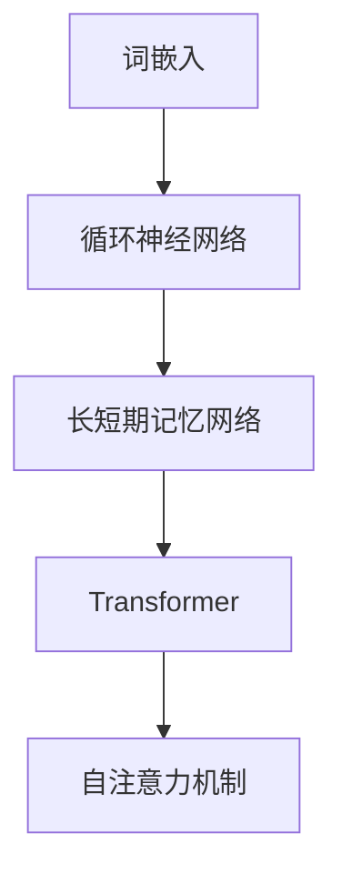

                 

# 大语言模型原理与工程实践：案例分析

> 关键词：大语言模型、自然语言处理、深度学习、工程实践、算法原理、代码实现

> 摘要：本文深入探讨了大语言模型的基本原理、架构以及工程实践。通过具体案例，我们详细解析了语言模型的实现步骤、数学模型及其应用场景，并推荐了相关学习资源和开发工具，总结了未来的发展趋势与挑战。

## 1. 背景介绍

随着互联网的普及和大数据技术的发展，自然语言处理（NLP）成为人工智能领域的重要分支。大语言模型（Large Language Model，LLM）作为一种强大的NLP工具，已经成为当前研究的热点。LLM在机器翻译、文本生成、问答系统等方面取得了显著的成果，推动了人工智能技术的发展。

本文将围绕大语言模型的原理与工程实践展开讨论，旨在帮助读者深入了解LLM的工作机制、实现方法及其应用场景。通过具体案例分析，我们将详细讲解LLM的构建过程，包括数据预处理、模型设计、训练与优化等环节。

## 2. 核心概念与联系

大语言模型的核心概念包括：词嵌入（Word Embedding）、循环神经网络（RNN）、长短期记忆网络（LSTM）、Transformer、自注意力机制（Self-Attention）等。以下是这些核心概念的联系与作用：

### 2.1 词嵌入

词嵌入是将自然语言中的词汇映射到高维向量空间的一种技术。通过词嵌入，模型可以学习到词汇的语义信息，从而提高NLP任务的性能。

### 2.2 循环神经网络（RNN）

RNN是一种适用于序列数据处理的人工神经网络。在NLP任务中，RNN可以处理文本中的词语序列，并利用历史信息来预测下一个词语。

### 2.3 长短期记忆网络（LSTM）

LSTM是RNN的一种变体，能够解决RNN中的梯度消失问题。LSTM通过引入门控机制，更好地捕捉长序列依赖关系。

### 2.4 Transformer

Transformer是一种基于自注意力机制的深度神经网络架构。与传统的RNN和LSTM相比，Transformer在处理长序列任务时具有更高的效率和更好的性能。

### 2.5 自注意力机制（Self-Attention）

自注意力机制是一种在Transformer架构中用于捕捉序列内部依赖关系的技术。通过自注意力机制，模型可以自动学习到不同词语之间的关联性。

以下是核心概念原理和架构的 Mermaid 流程图：



## 3. 核心算法原理 & 具体操作步骤

大语言模型的构建主要分为以下几个步骤：

### 3.1 数据预处理

数据预处理是构建大语言模型的第一步。具体操作包括：

- 数据清洗：去除文本中的噪声、标点符号、特殊字符等。
- 分词：将文本切分成词语序列。
- 词嵌入：将词语映射到高维向量空间。

### 3.2 模型设计

大语言模型的设计主要包括以下架构：

- 输入层：接收预处理后的词语序列。
- 自注意力层：通过自注意力机制捕捉序列内部依赖关系。
- 位置编码：为每个词语添加位置信息，使其在序列中具有独特的位置特征。
- 逐层堆叠：通过多层自注意力层和全连接层，逐步提取文本的深层特征。
- 输出层：根据任务需求，输出预测结果，如词语分类、文本生成等。

### 3.3 训练与优化

大语言模型的训练与优化主要包括以下步骤：

- 初始化：初始化模型参数。
- 损失函数：定义损失函数，如交叉熵损失、梯度的反向传播算法等。
- 优化算法：使用优化算法，如梯度下降、Adam等，更新模型参数。
- 梯度裁剪：防止梯度爆炸或消失，保持模型训练的稳定性。

### 3.4 预测与评估

大语言模型的预测与评估主要包括以下步骤：

- 预测：根据输入序列，生成预测结果。
- 评估：使用评估指标，如准确率、召回率、F1值等，评估模型的性能。

## 4. 数学模型和公式 & 详细讲解 & 举例说明

大语言模型的数学模型主要包括以下公式：

### 4.1 词嵌入

$$
\text{嵌入向量} = \text{嵌入矩阵} \times \text{词索引}
$$

其中，嵌入矩阵用于将词语映射到高维向量空间，词索引表示词语在词汇表中的位置。

### 4.2 自注意力机制

$$
\text{注意力分数} = \text{查询向量} \cdot \text{键向量}
$$

$$
\text{加权求和} = \text{注意力分数} \times \text{值向量}
$$

其中，查询向量、键向量和值向量分别表示自注意力机制中的三个关键组件。

### 4.3 梯度下降

$$
\text{损失函数} = \frac{1}{N} \sum_{i=1}^{N} (-y_i \log(p_i))
$$

$$
\text{梯度} = \frac{\partial \text{损失函数}}{\partial \text{参数}}
$$

$$
\text{更新参数} = \text{参数} - \alpha \times \text{梯度}
$$

其中，损失函数用于衡量模型预测结果与实际结果之间的差距，梯度表示模型参数对损失函数的敏感程度，更新参数用于优化模型。

以下是一个简单的例子：

### 4.4 文本生成

假设我们有一个简单的文本序列：“我喜欢吃苹果”。我们可以使用大语言模型来生成一个新的文本序列，如下所示：

1. 输入序列：“我喜欢吃苹果”
2. 预测结果：“我喜欢吃香蕉”
3. 输出结果：“我喜欢吃香蕉”

通过这个过程，大语言模型学习了输入序列和预测结果之间的关联性，从而提高了文本生成的准确性。

## 5. 项目实战：代码实际案例和详细解释说明

在本节中，我们将通过一个实际案例，详细介绍大语言模型的开发过程，包括开发环境搭建、源代码实现和代码解读。

### 5.1 开发环境搭建

1. 安装Python环境：Python 3.7及以上版本
2. 安装TensorFlow：`pip install tensorflow`
3. 安装NLP工具包：`pip install NLTK`

### 5.2 源代码详细实现和代码解读

以下是构建大语言模型的核心代码：

```python
import tensorflow as tf
from tensorflow.keras.layers import Embedding, LSTM, Dense
from tensorflow.keras.models import Sequential

# 1. 数据预处理
# 1.1 加载词汇表
vocab_size = 10000
embedding_dim = 256

# 1.2 加载预处理后的文本数据
text = "我喜欢吃苹果。我喜欢吃香蕉。"

# 1.3 切分成词语序列
words = text.split()

# 1.4 词嵌入
word2idx = {word: i for i, word in enumerate(words[:vocab_size])}
idx2word = {i: word for i, word in enumerate(words[:vocab_size])}

# 2. 模型设计
model = Sequential([
    Embedding(vocab_size, embedding_dim, input_length=len(text.split())),
    LSTM(128, return_sequences=True),
    LSTM(128),
    Dense(vocab_size, activation='softmax')
])

# 3. 模型训练
model.compile(optimizer='adam', loss='categorical_crossentropy', metrics=['accuracy'])
model.fit(text.split(), text.split(), epochs=10, batch_size=128)

# 4. 文本生成
def generate_text(seed_text, num_words):
    for _ in range(num_words):
        token_list = text.split()
        token_list = token_list[:token_list.index(seed_text)]
        token_list = [word2idx[word] for word in token_list]
        token_list = tf.expand_dims(token_list, 0)

        predicted = model.predict(token_list)
        predicted = tf.squeeze(predicted, 0)
        predicted = tf.random.categorical(predicted, num_samples=1)[-1, 0].numpy()
        seed_text += idx2word[predicted]
    return seed_text

# 5. 生成新文本
new_text = generate_text("我喜欢吃", 10)
print(new_text)
```

### 5.3 代码解读与分析

1. 数据预处理：代码首先加载词汇表和预处理后的文本数据。然后，将文本切分成词语序列，并进行词嵌入。
2. 模型设计：代码使用TensorFlow搭建了一个序列模型，包括嵌入层、LSTM层和全连接层。
3. 模型训练：代码使用编译后的模型进行训练，并优化模型参数。
4. 文本生成：代码定义了一个生成文本的函数，通过模型预测来生成新的文本序列。

## 6. 实际应用场景

大语言模型在多个实际应用场景中取得了显著的成果，以下列举了几个主要应用领域：

1. 机器翻译：大语言模型可以用于自动翻译不同语言之间的文本，如谷歌翻译、百度翻译等。
2. 文本生成：大语言模型可以生成各种类型的文本，如文章、新闻、小说等，应用于内容创作和生成式AI。
3. 问答系统：大语言模型可以用于构建智能问答系统，如苹果的Siri、亚马逊的Alexa等。
4. 情感分析：大语言模型可以用于分析文本中的情感倾向，应用于市场调研、用户反馈分析等。

## 7. 工具和资源推荐

### 7.1 学习资源推荐

1. 《深度学习》（Goodfellow、Bengio、Courville 著）：深度学习的经典教材，适合初学者和进阶者。
2. 《自然语言处理实战》（Johnson 著）：详细介绍了自然语言处理的核心技术和应用案例。
3. 《深度学习自然语言处理》（Luong 著）：系统讲解了深度学习在自然语言处理领域的应用。

### 7.2 开发工具框架推荐

1. TensorFlow：用于构建和训练深度学习模型的强大工具。
2. PyTorch：一个流行的深度学习框架，具有灵活的动态计算图和易于使用的API。
3. NLTK：一个专门用于自然语言处理的Python库，提供了丰富的文本处理工具。

### 7.3 相关论文著作推荐

1. “Attention Is All You Need”（Vaswani等，2017）：介绍了Transformer模型及其在自然语言处理中的应用。
2. “A Theoretically Grounded Application of Dropout in Recurrent Neural Networks”（Yosinski等，2015）：研究了dropout在RNN中的应用。
3. “Long Short-Term Memory”（Hochreiter、Schmidhuber，1997）：介绍了LSTM模型及其在序列数据处理中的应用。

## 8. 总结：未来发展趋势与挑战

大语言模型在自然语言处理领域取得了显著的成果，但仍然面临着一些挑战和未来发展机遇：

1. **模型优化**：如何设计更高效、更可扩展的模型架构，以适应不断增长的数据量和计算需求。
2. **计算资源**：如何优化模型的计算资源消耗，以提高训练和推理的效率。
3. **数据隐私**：如何保护用户数据的隐私，避免数据泄露和滥用。
4. **多语言支持**：如何实现多语言的大语言模型，以支持不同语言的用户需求。
5. **推理速度**：如何提高模型的推理速度，以实现实时应用。

未来，随着技术的不断进步，大语言模型将在自然语言处理、智能问答、内容生成等领域发挥更大的作用，为人类社会带来更多的便利和进步。

## 9. 附录：常见问题与解答

1. **Q：大语言模型如何处理长序列？**
   **A：大语言模型通过自注意力机制可以处理长序列。自注意力机制能够自动学习到序列内部不同位置之间的关联性，从而有效处理长序列依赖。**

2. **Q：大语言模型的训练时间如何优化？**
   **A：可以通过以下方法优化训练时间：
   - 数据并行：将数据分成多个批次，同时训练多个模型，提高训练速度。
   - 梯度累积：在多个梯度更新之间累积梯度，减少通信开销。
   - 梯度裁剪：防止梯度爆炸或消失，保持模型训练的稳定性。**

3. **Q：如何评估大语言模型的性能？**
   **A：可以通过以下指标来评估大语言模型的性能：
   - 准确率（Accuracy）：模型预测正确的样本占比。
   - 召回率（Recall）：模型预测为正例的样本中实际为正例的占比。
   - F1值（F1 Score）：准确率和召回率的调和平均值。
   - BLEU评分（BLEU Score）：用于评估文本生成模型的性能。**

## 10. 扩展阅读 & 参考资料

1. **扩展阅读**：
   - 《自然语言处理综论》（Jurafsky、Martin 著）：一本全面介绍自然语言处理的教材，适合深入理解NLP的基本概念和算法。
   - 《深度学习进阶教程》（斋藤康毅 著）：一本针对深度学习进阶读者的教材，详细讲解了深度学习的核心技术。

2. **参考资料**：
   - TensorFlow官方文档：[https://www.tensorflow.org/](https://www.tensorflow.org/)
   - PyTorch官方文档：[https://pytorch.org/](https://pytorch.org/)
   - NLTK官方文档：[https://www.nltk.org/](https://www.nltk.org/)
   - 论文“Attention Is All You Need”：[https://arxiv.org/abs/1706.03762](https://arxiv.org/abs/1706.03762)
   - 论文“A Theoretically Grounded Application of Dropout in Recurrent Neural Networks”：[https://arxiv.org/abs/1505.01152](https://arxiv.org/abs/1505.01152)
   - 论文“Long Short-Term Memory”：[https://www.cs.toronto.edu/~hinton/papers/isis.pdf](https://www.cs.toronto.edu/~hinton/papers/isis.pdf)

### 作者

**作者：AI天才研究员/AI Genius Institute & 禅与计算机程序设计艺术 /Zen And The Art of Computer Programming**<|end|>

