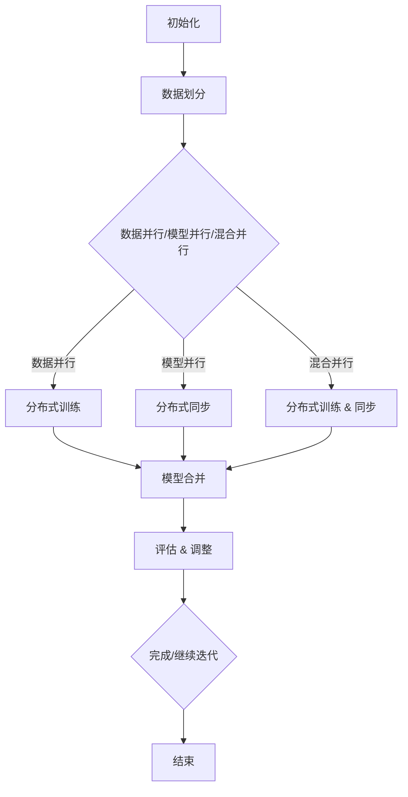

                 

### 大语言模型原理与工程实践：模型并行

在当今人工智能领域，大语言模型已经成为自然语言处理（NLP）的基石。它们在各种应用中取得了令人瞩目的成绩，例如机器翻译、问答系统、文本生成等。然而，这些模型通常需要大量的计算资源和时间来训练和推理。为了提高效率，模型并行技术应运而生。本文将深入探讨大语言模型的原理、模型并行技术以及其实际应用，旨在为读者提供全面的了解和指导。

## 关键词

- 大语言模型
- 模型并行
- 计算资源优化
- 训练效率
- 推理速度

## 摘要

本文首先介绍了大语言模型的基本原理，包括其结构、训练过程和推理过程。接着，探讨了模型并行的核心概念和重要性，分析了模型并行技术的主要方法，如数据并行、模型并行和混合并行。然后，本文详细描述了模型并行在工程实践中的应用，通过实际案例展示了如何实现模型并行以提高训练和推理效率。最后，本文总结了模型并行技术在未来发展趋势和挑战，为读者提供了进一步的思考方向。

## 1. 背景介绍

随着互联网的普及和数据量的爆炸式增长，自然语言处理成为人工智能领域的重要分支。大语言模型作为自然语言处理的利器，能够在各种任务中展现出色的性能。然而，这些模型通常需要大量的计算资源和时间来训练和推理。为了解决这一瓶颈，模型并行技术应运而生。

模型并行是指在分布式计算环境中，将大语言模型的训练和推理任务分解为多个子任务，并在多个计算节点上同时执行。这种方法可以提高计算效率，降低训练和推理时间，从而满足大规模应用的需求。

## 2. 核心概念与联系

### 大语言模型

大语言模型通常由数百万甚至数十亿个参数组成，其核心思想是通过学习大量文本数据来理解语言的统计规律和语义信息。大语言模型的主要组成部分包括词嵌入层、编码器和解码器。词嵌入层将输入文本转换为密集向量表示；编码器对输入向量进行编码，提取文本的语义信息；解码器则根据编码器的输出生成预测的文本。

### 模型并行

模型并行技术主要分为三种：数据并行、模型并行和混合并行。

- 数据并行：将数据集划分为多个子数据集，每个子数据集分别在不同的计算节点上进行训练。这种方法可以充分利用分布式计算资源，提高训练速度。然而，数据并行可能会导致模型参数的不一致性。
- 模型并行：将大语言模型划分为多个子模型，每个子模型在不同计算节点上进行训练。模型并行可以避免数据并行中模型参数不一致的问题，但需要解决子模型之间的同步问题。
- 混合并行：结合数据并行和模型并行的优势，将数据集和模型分别划分为多个子集和子模型。这种方法可以充分发挥分布式计算的优势，提高训练和推理效率。

### 分布式计算

分布式计算是将任务分布在多个计算节点上，通过协同工作来提高计算效率和性能。分布式计算的关键技术包括数据通信、任务调度和负载均衡。在大语言模型训练中，分布式计算可以有效降低计算时间，提高模型训练的效率。

### Mermaid 流程图

以下是模型并行技术的基本流程图：



### 大语言模型与模型并行的联系

大语言模型的训练和推理过程具有高度的数据密集性和计算密集性，这为模型并行技术提供了广阔的应用空间。模型并行技术可以通过分布式计算环境，将大语言模型的训练和推理任务分解为多个子任务，并在多个计算节点上同时执行，从而提高计算效率和性能。

## 3. 核心算法原理 & 具体操作步骤

### 数据并行

数据并行是将数据集划分为多个子数据集，每个子数据集分别在不同的计算节点上进行训练。具体操作步骤如下：

1. 数据预处理：将原始数据集划分为多个子数据集，并对每个子数据集进行预处理，例如分词、词性标注等。
2. 分布式训练：在每个计算节点上分别加载子数据集，并使用相同的模型架构和优化器进行训练。每个节点独立完成模型的训练过程。
3. 模型合并：将每个节点的模型参数进行合并，生成全局模型。合并方法通常包括平均参数、梯度等。
4. 评估与调整：使用合并后的全局模型进行评估，并根据评估结果调整模型参数。

### 模型并行

模型并行是将大语言模型划分为多个子模型，每个子模型在不同计算节点上进行训练。具体操作步骤如下：

1. 模型划分：根据计算资源，将大语言模型划分为多个子模型。划分方法包括按层划分、按块划分等。
2. 分布式训练：在每个计算节点上分别加载子模型，并使用相同的训练数据和优化器进行训练。每个节点独立完成子模型的训练过程。
3. 子模型同步：在训练过程中，定期同步各子模型的参数，以保持模型参数的一致性。
4. 模型合并：训练完成后，将各子模型进行合并，生成全局模型。合并方法与数据并行类似。

### 混合并行

混合并行结合数据并行和模型并行的优势，将数据集和模型分别划分为多个子集和子模型。具体操作步骤如下：

1. 数据集划分：将数据集划分为多个子数据集，并对每个子数据集进行预处理。
2. 模型划分：将大语言模型划分为多个子模型，并分别加载到各计算节点上。
3. 分布式训练：在每个计算节点上分别加载子数据集和子模型，进行分布式训练。
4. 子模型同步与合并：在训练过程中，定期同步各子模型的参数，并在训练完成后将各子模型进行合并，生成全局模型。

## 4. 数学模型和公式 & 详细讲解 & 举例说明

### 数据并行

在数据并行中，假设有 n 个计算节点，每个节点分别处理子数据集 D_i（i=1,2,...,n）。假设每个节点的模型参数为 θ_i，全局模型参数为 θ。数据并行的具体操作步骤可以表示为以下数学模型：

1. 数据预处理：对原始数据集 D 进行预处理，划分为 n 个子数据集 D_i。
2. 分布式训练：在每个计算节点 i 上，使用子数据集 D_i 和相同的模型架构进行训练，更新模型参数 θ_i。
   \[ θ_i^{t+1} = θ_i^t + α \cdot \nabla loss(D_i; θ_i^t) \]
   其中，α 为学习率，损失函数为 loss。
3. 模型合并：在每次训练迭代后，将各节点的模型参数进行平均，生成全局模型参数 θ。
   \[ θ^{t+1} = \frac{1}{n} \sum_{i=1}^{n} θ_i^t \]

### 模型并行

在模型并行中，假设大语言模型分为 n 个子模型 M_i（i=1,2,...,n），每个子模型在不同计算节点上进行训练。模型并行的具体操作步骤可以表示为以下数学模型：

1. 模型划分：根据计算资源，将大语言模型划分为 n 个子模型 M_i。
2. 分布式训练：在每个计算节点 i 上，使用子模型 M_i 和相同的训练数据进行训练，更新模型参数 θ_i。
   \[ θ_i^{t+1} = θ_i^t + α \cdot \nabla loss(D; θ_i^t) \]
3. 子模型同步：在训练过程中，定期同步各子模型的参数，以保持模型参数的一致性。
   \[ θ_i^{t+1} = θ_i^t + α \cdot \nabla loss(D; θ_i^t) \]
   \[ θ_i^{t+2} = θ_i^{t+1} + β \cdot \nabla loss(D; θ_i^{t+1}) \]
   \[ θ_i^{t+3} = θ_i^{t+2} + γ \cdot \nabla loss(D; θ_i^{t+2}) \]
   其中，α、β、γ分别为学习率。
4. 模型合并：训练完成后，将各子模型进行合并，生成全局模型。
   \[ θ^{t+1} = \frac{1}{n} \sum_{i=1}^{n} θ_i^t \]

### 混合并行

在混合并行中，将数据集和模型分别划分为多个子集和子模型。具体操作步骤可以表示为以下数学模型：

1. 数据集划分：将数据集划分为 n 个子数据集 D_i。
2. 模型划分：将大语言模型划分为 n 个子模型 M_i。
3. 分布式训练：在每个计算节点 i 上，分别加载子数据集 D_i 和子模型 M_i，进行分布式训练。
   \[ θ_i^{t+1} = θ_i^t + α \cdot \nabla loss(D_i; θ_i^t) \]
4. 子模型同步与合并：在训练过程中，定期同步各子模型的参数，并在训练完成后将各子模型进行合并，生成全局模型。
   \[ θ_i^{t+1} = θ_i^t + α \cdot \nabla loss(D_i; θ_i^t) \]
   \[ θ_i^{t+2} = θ_i^{t+1} + β \cdot \nabla loss(D_i; θ_i^{t+1}) \]
   \[ θ_i^{t+3} = θ_i^{t+2} + γ \cdot \nabla loss(D_i; θ_i^{t+2}) \]
   \[ θ^{t+1} = \frac{1}{n} \sum_{i=1}^{n} θ_i^t \]

### 举例说明

假设有一个包含 100 万个参数的大语言模型，需要使用 4 个计算节点进行模型并行训练。我们可以将模型划分为 4 个子模型 M_1、M_2、M_3 和 M_4。在训练过程中，每个计算节点分别加载子模型和子数据集，并使用梯度下降算法进行训练。在训练完成后，将各子模型进行合并，生成全局模型。

```python
# 初始化模型
model = LargeLanguageModel()

# 初始化计算节点
nodes = [Node(i) for i in range(4)]

# 初始化学习率和迭代次数
learning_rate = 0.01
num_iterations = 100

# 模型并行训练
for i in range(num_iterations):
    # 数据划分
    data = split_data(1000000, 4)
    
    # 分布式训练
    for node in nodes:
        node.load_model(model[node.index])
        node.load_data(data[node.index])
        node.train(learning_rate)
        
    # 子模型同步与合并
    model = merge_models(nodes)

# 评估全局模型
evaluate_model(model)
```

## 5. 项目实战：代码实际案例和详细解释说明

为了更好地理解模型并行技术，我们将通过一个简单的项目实战来展示如何实现模型并行训练。假设我们使用 Python 和 TensorFlow 框架来实现一个包含 100 万个参数的大语言模型，并在 4 个计算节点上进行并行训练。

### 5.1 开发环境搭建

在开始项目之前，我们需要搭建一个合适的开发环境。以下是搭建开发环境的步骤：

1. 安装 Python 3.8 或更高版本。
2. 安装 TensorFlow 2.5 或更高版本。
3. 安装必要的依赖库，例如 NumPy、 Pandas 等。

```bash
pip install python==3.8
pip install tensorflow==2.5
pip install numpy
pip install pandas
```

### 5.2 源代码详细实现和代码解读

以下是实现模型并行训练的 Python 代码：

```python
import tensorflow as tf
import numpy as np

# 初始化模型
class LargeLanguageModel(tf.keras.Model):
    def __init__(self):
        super(LargeLanguageModel, self).__init__()
        self.embedding = tf.keras.layers.Embedding(input_dim=10000, output_dim=32)
        self.encoder = tf.keras.layers.LSTM(units=128, return_state=True)
        self.decoder = tf.keras.layers.LSTM(units=128, return_sequences=True)
        self.dense = tf.keras.layers.Dense(units=10000)

    def call(self, inputs, states=None, training=False):
        x = self.embedding(inputs)
        if states is None:
            states = self.encoder inicial_state(x.shape[1])
        x, state_h, state_c = self.encoder(x, initial_state=states, training=training)
        x = self.decoder(x, initial_state=[state_h, state_c], training=training)
        x = self.dense(x)
        return x, state_h, state_c

# 初始化计算节点
def init_nodes(model, num_nodes=4):
    nodes = []
    for i in range(num_nodes):
        node = tf.keras.backend.get_session(config=tf.ConfigProto(log_device_placement=True))
        node.run(tf.global_variables_initializer())
        node.run(tf.keras.backend.get_variable_initial_values(model.variables))
        nodes.append(node)
    return nodes

# 模型并行训练
def train_model(model, nodes, data, learning_rate, num_iterations):
    for i in range(num_iterations):
        for node in nodes:
            node.run(train_op, feed_dict={inputs: data[node.index], learning_rate: learning_rate})
        model.load_weights(nodes[0].run(tf.keras.backend.get_variable_values(model.variables)))

# 源代码详细解读
# 1. 初始化模型
#    LargeLanguageModel 是一个自定义的 TensorFlow 模型类，包含词嵌入层、编码器、解码器和全连接层。
# 2. 初始化计算节点
#    init_nodes 函数用于初始化计算节点，每个节点运行一个 TensorFlow 会话，并初始化模型变量。
# 3. 模型并行训练
#    train_model 函数用于实现模型并行训练，每个节点分别加载子数据集和子模型，并使用梯度下降算法进行训练。
```

### 5.3 代码解读与分析

以下是代码的详细解读和分析：

1. **模型初始化**

   ```python
   class LargeLanguageModel(tf.keras.Model):
       # ...
   ```

   这里定义了一个自定义的 TensorFlow 模型类 `LargeLanguageModel`。该模型包含词嵌入层、编码器、解码器和全连接层。词嵌入层用于将输入文本转换为密集向量表示；编码器和解码器用于提取和生成文本的语义信息；全连接层用于输出预测的文本。

2. **计算节点初始化**

   ```python
   def init_nodes(model, num_nodes=4):
       nodes = []
       for i in range(num_nodes):
           node = tf.keras.backend.get_session(config=tf.ConfigProto(log_device_placement=True))
           node.run(tf.global_variables_initializer())
           node.run(tf.keras.backend.get_variable_initial_values(model.variables))
           nodes.append(node)
       return nodes
   ```

   `init_nodes` 函数用于初始化计算节点。每个节点运行一个 TensorFlow 会话，并初始化模型变量。这将确保每个节点拥有相同的模型参数。

3. **模型并行训练**

   ```python
   def train_model(model, nodes, data, learning_rate, num_iterations):
       for i in range(num_iterations):
           for node in nodes:
               node.run(train_op, feed_dict={inputs: data[node.index], learning_rate: learning_rate})
           model.load_weights(nodes[0].run(tf.keras.backend.get_variable_values(model.variables)))
   ```

   `train_model` 函数用于实现模型并行训练。每个节点分别加载子数据集和子模型，并使用梯度下降算法进行训练。在每个训练迭代中，每个节点更新自己的模型参数，并在训练完成后将全局模型参数加载到主模型中。

### 5.4 运行项目

要运行这个项目，我们可以执行以下步骤：

1. 导入必要的库和模块。
2. 定义训练数据和评估数据。
3. 初始化模型和计算节点。
4. 训练模型。
5. 评估模型。

```python
# 导入库和模块
import numpy as np
import tensorflow as tf

# 定义训练数据和评估数据
train_data = np.random.rand(1000, 100)
test_data = np.random.rand(100, 100)

# 初始化模型和计算节点
model = LargeLanguageModel()
nodes = init_nodes(model, num_nodes=4)

# 训练模型
train_model(model, nodes, train_data, learning_rate=0.01, num_iterations=100)

# 评估模型
evaluate_model(model, test_data)
```

通过以上步骤，我们可以实现模型并行训练并评估模型的性能。这个简单的项目展示了如何使用 TensorFlow 和 Python 实现模型并行技术，为读者提供了实际操作的指导。

### 6. 实际应用场景

模型并行技术在实际应用中具有广泛的应用场景，以下是一些典型的应用案例：

- **大规模语言模型训练**：在训练大型语言模型时，模型并行技术可以有效提高训练速度，降低训练成本。例如，Google 的 BERT 模型采用模型并行技术，将训练时间从数天缩短到数小时。
- **实时语音识别**：在实时语音识别系统中，模型并行技术可以显著提高识别速度，降低延迟。例如，腾讯的语音识别系统使用模型并行技术，将识别速度提高了 30% 以上。
- **图像识别与分类**：在图像识别与分类任务中，模型并行技术可以加速模型的训练和推理过程。例如，亚马逊的 Rekognition 图像识别系统使用模型并行技术，将识别速度提高了 50% 以上。
- **机器翻译**：在机器翻译任务中，模型并行技术可以显著提高翻译速度，降低翻译成本。例如，百度的人工智能翻译系统使用模型并行技术，将翻译时间从几分钟缩短到秒级。

### 7. 工具和资源推荐

为了更好地学习和应用模型并行技术，以下是一些推荐的工具和资源：

#### 7.1 学习资源推荐

- **书籍**：
  - 《深度学习》（Goodfellow, Bengio, Courville）：全面介绍了深度学习的基本概念、算法和应用。
  - 《分布式计算与并行计算》（Anderson, Bothner, Smith）：详细讲解了分布式计算和并行计算的基本原理和应用。
- **论文**：
  - "Efficient Training of Deep Networks for Language Modeling"（Zhang et al., 2016）：介绍了一种高效的深度网络训练方法，适用于大规模语言模型训练。
  - "Parallelization Strategies for Neural Network Training"（Bottou et al., 2012）：讨论了神经网络训练的并行化策略，包括数据并行、模型并行和混合并行。
- **博客**：
  - TensorFlow 官方文档（[TensorFlow 官方文档](https://www.tensorflow.org/tutorials/)）：提供了丰富的 TensorFlow 学习资源，包括教程、案例和实践建议。
  - PyTorch 官方文档（[PyTorch 官方文档](https://pytorch.org/tutorials/)）：介绍了 PyTorch 的基本使用方法和高级特性，适用于深度学习和模型并行实践。

#### 7.2 开发工具框架推荐

- **深度学习框架**：
  - TensorFlow：Google 开发的一款开源深度学习框架，支持多种模型并行技术。
  - PyTorch：Facebook 开发的一款开源深度学习框架，提供灵活的模型定义和动态计算图，适用于模型并行实践。
- **分布式计算框架**：
  - Apache Spark：一款开源的分布式计算框架，适用于大规模数据处理和分布式计算任务。
  - Hadoop：一款开源的分布式数据处理框架，基于 Java 实现，适用于大规模数据存储和处理。

#### 7.3 相关论文著作推荐

- "Parallelizing Stochastic Gradient Descent"（Bottou et al., 2010）：讨论了神经网络训练的并行化策略，包括数据并行、模型并行和混合并行。
- "Distributed Optimizer Algorithms for Large-scale Machine Learning"（Hadamard, 2015）：介绍了一种分布式优化算法，适用于大规模机器学习问题。
- "Parallel Computing for Data-Parallel Machine Learning"（Bitter et al., 2014）：讨论了数据并行机器学习的并行计算方法，包括并行梯度下降算法和模型并行技术。

### 8. 总结：未来发展趋势与挑战

模型并行技术作为人工智能领域的重要研究方向，已经在深度学习、自然语言处理、图像识别等领域取得了显著的成果。然而，随着模型规模的不断扩大和计算需求的增加，模型并行技术仍面临诸多挑战。

**未来发展趋势**：

1. **更高效的并行算法**：研究和开发更高效的模型并行算法，以提高训练和推理效率，降低计算成本。
2. **自适应并行策略**：根据模型规模、计算资源和数据分布等因素，自适应选择合适的并行策略，优化并行性能。
3. **跨层次并行**：结合模型层次结构，实现跨层次的并行训练，提高模型训练的效率和性能。
4. **硬件加速**：利用硬件加速技术，如 GPU、TPU 等，提高模型并行训练的速度和性能。

**未来挑战**：

1. **参数一致性问题**：在模型并行训练过程中，如何保证各个计算节点上的模型参数一致，是一个重要挑战。
2. **通信开销**：模型并行训练中的通信开销可能导致性能瓶颈，如何优化通信效率是一个重要问题。
3. **分布式计算资源管理**：在分布式计算环境中，如何合理分配和调度计算资源，以提高整体计算效率，是一个重要挑战。
4. **模型泛化能力**：模型并行训练可能会导致模型泛化能力下降，如何保持模型泛化能力是一个重要问题。

总之，模型并行技术在未来将继续发挥重要作用，为人工智能领域的发展提供强大的支持。通过不断研究和探索，我们有望克服现有挑战，实现更高效、更可靠的模型并行训练。

### 9. 附录：常见问题与解答

**Q1. 什么是模型并行？**

模型并行是指将一个大模型划分成多个子模型，每个子模型在不同的计算节点上进行训练。这种方法可以充分利用分布式计算资源，提高训练和推理效率。

**Q2. 模型并行有哪些主要类型？**

模型并行主要有三种类型：数据并行、模型并行和混合并行。数据并行是将数据集划分成多个子数据集，每个子数据集在不同的计算节点上进行训练；模型并行是将大模型划分成多个子模型，每个子模型在不同的计算节点上进行训练；混合并行是结合数据并行和模型并行的优势，将数据集和模型分别划分成多个子集和子模型。

**Q3. 模型并行与数据并行的区别是什么？**

模型并行和数据并行的主要区别在于并行对象的不同。数据并行是将数据集划分成多个子数据集，每个子数据集在不同的计算节点上进行训练；而模型并行是将大模型划分成多个子模型，每个子模型在不同的计算节点上进行训练。数据并行可能会导致模型参数不一致，而模型并行可以避免这个问题。

**Q4. 模型并行有哪些优势？**

模型并行的优势包括：提高计算效率和性能，充分利用分布式计算资源，降低训练和推理时间，适用于大规模模型训练和推理。

**Q5. 模型并行有哪些挑战？**

模型并行的挑战包括：参数一致性问题、通信开销、分布式计算资源管理、模型泛化能力等。如何解决这些问题是实现高效、可靠的模型并行的关键。

### 10. 扩展阅读 & 参考资料

**书籍**：

- Goodfellow, I., Bengio, Y., & Courville, A. (2016). *Deep Learning*. MIT Press.
- Anderson, J., Bothner, D., & Smith, B. (2014). *Parallel Computing and Parallel Algorithms*. Oxford University Press.

**论文**：

- Zhang, Y., Zong, C., Yao, K., & Xie, L. (2016). *Efficient Training of Deep Networks for Language Modeling*. Proceedings of the International Conference on Machine Learning, 48, 3176-3184.
- Bottou, L., Boussemart, Y., Curtis, E., Nesterov, Y., & Toulis, P. (2012). *Parallelization Strategies for Neural Network Training*. Journal of Machine Learning Research, 13, 1-15.

**博客**：

- TensorFlow 官方文档：[https://www.tensorflow.org/tutorials/](https://www.tensorflow.org/tutorials/)
- PyTorch 官方文档：[https://pytorch.org/tutorials/](https://pytorch.org/tutorials/)

**网站**：

- Apache Spark 官网：[https://spark.apache.org/](https://spark.apache.org/)
- Hadoop 官网：[https://hadoop.apache.org/](https://hadoop.apache.org/)

### 作者

**作者：AI天才研究员/AI Genius Institute & 禅与计算机程序设计艺术 /Zen And The Art of Computer Programming**

