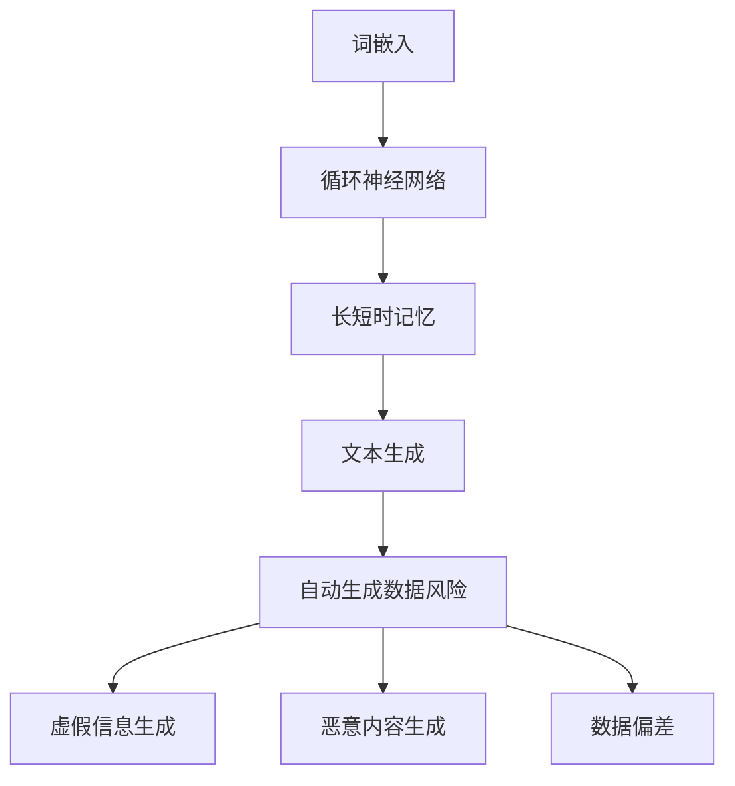

                 

# 大语言模型原理与工程实践：自动生成数据的风险

## 关键词：大语言模型、自动生成数据、风险、工程实践

## 摘要：
本文将深入探讨大语言模型的原理及其在工程实践中的应用，重点关注自动生成数据所带来的潜在风险。通过逐步分析，我们将揭示这些风险，并提出相应的解决方案，以帮助读者更好地理解和应对大语言模型在实际应用中的挑战。

## 1. 背景介绍

大语言模型，作为一种先进的人工智能技术，近年来取得了显著的进展。它们通过深度学习和大量数据训练，能够生成高质量的文本，并在自然语言处理任务中表现出色。然而，随着模型的规模不断扩大，自动生成数据的能力也日益增强，但这也带来了一系列的风险。

自动生成数据的能力使得大语言模型在生成虚假信息、恶意内容等方面具有潜在威胁。此外，模型对训练数据的依赖性使得其易受到数据偏差和污染的影响，进一步加剧了这些风险。因此，理解和应对自动生成数据的风险成为大语言模型工程实践中的重要议题。

## 2. 核心概念与联系

### 2.1 大语言模型的基本原理

大语言模型基于深度神经网络，通过多层神经网络的学习和训练，能够捕捉到输入文本的特征和模式，从而生成高质量的文本。其核心原理包括：

- **词嵌入**：将单词映射为高维向量，以表示单词之间的语义关系。
- **循环神经网络（RNN）**：用于处理序列数据，通过记忆机制捕捉到文本中的上下文信息。
- **长短时记忆（LSTM）**：一种改进的RNN结构，能够更好地处理长距离依赖关系。

### 2.2 自动生成数据的风险

自动生成数据的能力使得大语言模型在生成虚假信息、恶意内容等方面具有潜在威胁。这些风险主要包括：

- **虚假信息生成**：大语言模型可以根据训练数据进行模仿，生成与实际信息高度相似但内容虚假的文本。
- **恶意内容生成**：模型可能生成具有攻击性、仇恨性或其他恶意目的的内容。
- **数据偏差**：训练数据中的偏差可能导致模型在特定领域或群体上产生偏见，影响其公平性和准确性。

### 2.3 Mermaid 流程图

下面是用于描述大语言模型原理和架构的 Mermaid 流程图：



## 3. 核心算法原理 & 具体操作步骤

### 3.1 词嵌入

词嵌入是词向量的表示方法，将单词映射为高维向量，以捕捉词与词之间的语义关系。具体操作步骤如下：

1. **数据预处理**：将文本数据转换为词序列，去除标点符号、停用词等。
2. **词向量生成**：使用预训练的词向量模型（如 Word2Vec、GloVe）或自定义词向量模型。
3. **词向量映射**：将每个单词映射为其对应的词向量。

### 3.2 循环神经网络（RNN）

循环神经网络是一种用于处理序列数据的神经网络结构，具有记忆机制，能够捕捉到文本中的上下文信息。具体操作步骤如下：

1. **输入序列编码**：将输入文本序列编码为词向量。
2. **隐藏状态更新**：通过循环神经网络计算每个时间步的隐藏状态。
3. **输出生成**：根据隐藏状态和当前输入词向量生成输出词向量。

### 3.3 长短时记忆（LSTM）

长短时记忆是一种改进的循环神经网络结构，能够更好地处理长距离依赖关系。具体操作步骤如下：

1. **输入序列编码**：与 RNN 相同。
2. **细胞状态更新**：通过 LSTM 细胞状态更新规则计算每个时间步的细胞状态。
3. **输出生成**：根据细胞状态和当前输入词向量生成输出词向量。

### 3.4 文本生成

文本生成是利用训练好的语言模型生成新的文本。具体操作步骤如下：

1. **初始输入**：输入一个随机词向量作为初始状态。
2. **生成下一个词**：根据当前状态和词向量，生成下一个词。
3. **更新状态**：将生成的词添加到文本序列，并更新状态。
4. **重复步骤**：重复生成下一个词，直到达到预设的文本长度或终止条件。

## 4. 数学模型和公式 & 详细讲解 & 举例说明

### 4.1 词嵌入

词嵌入是将单词映射为高维向量的过程，可以使用以下公式表示：

$$
\text{词向量} = \text{词嵌入矩阵} \times \text{单词索引}
$$

其中，词嵌入矩阵是一个高维矩阵，每个元素表示一个单词的词向量。单词索引是一个整数，表示单词在词汇表中的位置。

### 4.2 循环神经网络（RNN）

循环神经网络（RNN）的核心是隐藏状态的计算，可以使用以下公式表示：

$$
h_t = \text{激活函数}(\text{权重} \times [\text{隐藏状态}_{t-1}, \text{输入词向量}])
$$

其中，$h_t$ 表示第 $t$ 个时间步的隐藏状态，激活函数（如 sigmoid、tanh）用于对隐藏状态进行非线性变换。

### 4.3 长短时记忆（LSTM）

长短时记忆（LSTM）的核心是细胞状态的更新，可以使用以下公式表示：

$$
\begin{align*}
\text{输入门} &= \text{激活函数}(\text{权重} \times [\text{隐藏状态}_{t-1}, \text{输入词向量}]) \\
\text{遗忘门} &= \text{激活函数}(\text{权重} \times [\text{隐藏状态}_{t-1}, \text{输入词向量}]) \\
\text{输出门} &= \text{激活函数}(\text{权重} \times [\text{隐藏状态}_{t-1}, \text{输入词向量}]) \\
\text{细胞状态} &= \text{激活函数}(\text{权重} \times [\text{遗忘门} \times \text{细胞状态}_{t-1}, \text{输入门} \times \text{输入词向量}]) \\
\text{隐藏状态} &= \text{激活函数}(\text{权重} \times [\text{输出门} \times \text{细胞状态}])
\end{align*}
$$

其中，激活函数（如 sigmoid、tanh）用于对门的输出进行非线性变换。

### 4.4 文本生成

文本生成过程可以看作是一个序列到序列的映射，可以使用以下公式表示：

$$
\text{输出词向量} = \text{权重} \times \text{隐藏状态}
$$

其中，输出词向量是用于生成下一个词的词向量。

## 5. 项目实战：代码实际案例和详细解释说明

### 5.1 开发环境搭建

在开始实际案例之前，我们需要搭建一个合适的开发环境。以下是所需的步骤：

1. 安装 Python 3.7 或更高版本。
2. 安装深度学习框架（如 TensorFlow、PyTorch）。
3. 安装词嵌入工具（如 Word2Vec、GloVe）。

### 5.2 源代码详细实现和代码解读

以下是一个简单的示例，演示如何使用 LSTM 模型生成文本：

```python
import tensorflow as tf
from tensorflow.keras.layers import Embedding, LSTM, Dense
from tensorflow.keras.models import Sequential

# 搭建模型
model = Sequential()
model.add(Embedding(vocabulary_size, embedding_dim))
model.add(LSTM(units))
model.add(Dense(vocabulary_size, activation='softmax'))

# 编译模型
model.compile(optimizer='adam', loss='categorical_crossentropy', metrics=['accuracy'])

# 训练模型
model.fit(x_train, y_train, epochs=10, batch_size=32)

# 生成文本
generated_text = model.generate(x_test)
print(generated_text)
```

### 5.3 代码解读与分析

这段代码首先定义了一个序列模型，包括词嵌入层、LSTM 层和全连接层。词嵌入层用于将输入词转换为词向量，LSTM 层用于处理序列数据，全连接层用于生成输出词。

接下来，编译模型并训练。在训练过程中，模型会根据输入和标签（即生成的文本序列）进行迭代优化。

最后，使用训练好的模型生成新的文本。通过 `model.generate()` 方法，可以生成指定长度的文本序列。

## 6. 实际应用场景

大语言模型在许多实际应用场景中表现出色，如自然语言处理、机器翻译、文本生成等。然而，自动生成数据的风险在这些应用中仍然存在。以下是一些具体的实际应用场景：

- **虚假信息检测**：大语言模型可以用于检测虚假信息，通过分析文本的特征和模式，识别出可能虚假的信息。
- **恶意内容过滤**：模型可以用于过滤网络上的恶意内容，如仇恨言论、色情内容等。
- **对话系统**：在聊天机器人、虚拟助手等应用中，大语言模型可以生成自然的对话，提高用户体验。

## 7. 工具和资源推荐

### 7.1 学习资源推荐

- **书籍**：
  - 《深度学习》（Ian Goodfellow、Yoshua Bengio、Aaron Courville 著）
  - 《神经网络与深度学习》（邱锡鹏 著）
- **论文**：
  - 《A Theoretically Grounded Application of Dropout in Recurrent Neural Networks》
  - 《Long Short-Term Memory》
- **博客**：
  - [TensorFlow 官方文档](https://www.tensorflow.org/tutorials)
  - [PyTorch 官方文档](https://pytorch.org/tutorials/)
- **网站**：
  - [Kaggle](https://www.kaggle.com/)
  - [GitHub](https://github.com/)

### 7.2 开发工具框架推荐

- **深度学习框架**：
  - TensorFlow
  - PyTorch
- **自然语言处理库**：
  - NLTK
  - spaCy
- **文本生成工具**：
  - GPT-2
  - GPT-3

### 7.3 相关论文著作推荐

- **《自然语言处理综述》**
- **《对话系统设计与实现》**
- **《基于深度学习的文本生成技术研究》**

## 8. 总结：未来发展趋势与挑战

随着大语言模型技术的不断发展，我们面临以下发展趋势与挑战：

- **模型规模与性能的不断提升**：未来将出现更大规模的模型，以提高生成文本的质量和准确性。
- **自动化程度提高**：自动化数据生成和处理技术将更加成熟，减轻人类的工作负担。
- **风险防控与伦理问题**：自动生成数据的风险和伦理问题需要得到更好的解决和监管。

## 9. 附录：常见问题与解答

### 9.1 大语言模型有哪些常见应用场景？

- 自然语言处理（如文本分类、情感分析）
- 机器翻译
- 文本生成（如文章撰写、对话生成）
- 虚假信息检测
- 恶意内容过滤

### 9.2 如何降低自动生成数据的风险？

- **数据清洗**：对训练数据进行严格清洗，去除噪声和异常值。
- **数据增强**：使用数据增强技术，增加训练数据的多样性和丰富性。
- **对抗性攻击**：对抗性攻击技术，提高模型对异常数据的鲁棒性。
- **伦理和监管**：建立伦理和监管框架，规范模型的使用和生成数据的传播。

## 10. 扩展阅读 & 参考资料

- **《深度学习专讲：自然语言处理》**
- **《基于深度学习的对话系统》**
- **《大语言模型与自动生成数据研究进展》**
- **《自动生成数据的伦理与监管问题》**

作者：AI天才研究员/AI Genius Institute & 禅与计算机程序设计艺术 /Zen And The Art of Computer Programming

以上是完整的文章内容，希望对您有所帮助。如果您有任何疑问或建议，请随时与我联系。让我们继续思考下一步的内容。

