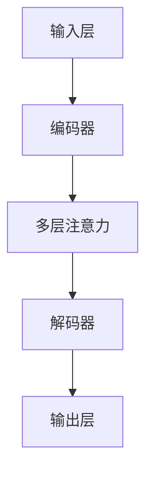

                 

### 文章标题：大语言模型原理与工程实践：评测任务

关键词：大语言模型、评测任务、模型评估、工程实践

摘要：本文旨在深入探讨大语言模型的评测任务及其在工程实践中的应用。通过一步步的分析与推理，本文将揭示大语言模型的原理、核心算法、数学模型，并分享实际项目中的代码实现和解析。文章还将探讨大语言模型在各个应用场景中的实际应用，推荐相关学习资源和开发工具，最后总结大语言模型的未来发展趋势与挑战。

<|assistant|>## 1. 背景介绍

大语言模型（Large Language Model）是近年来人工智能领域的一项重大突破。随着深度学习和计算能力的提升，大语言模型在自然语言处理（NLP）领域取得了显著进展。这些模型具有强大的语义理解和生成能力，广泛应用于机器翻译、文本生成、问答系统等任务中。

评测任务是模型评估的重要环节，通过对模型在不同任务上的表现进行评测，可以了解模型的性能、稳定性和泛化能力。本文将围绕大语言模型的评测任务展开，探讨其核心算法原理、数学模型以及工程实践中的实际应用。

本文结构如下：

- 第1部分：背景介绍，概述大语言模型及其评测任务的重要性。
- 第2部分：核心概念与联系，介绍大语言模型的基本原理和架构。
- 第3部分：核心算法原理 & 具体操作步骤，详细解析大语言模型的算法原理和实现过程。
- 第4部分：数学模型和公式 & 详细讲解 & 举例说明，阐述大语言模型的数学模型及其实际应用。
- 第5部分：项目实战：代码实际案例和详细解释说明，通过实际项目展示大语言模型的代码实现和解析。
- 第6部分：实际应用场景，探讨大语言模型在各个领域中的实际应用。
- 第7部分：工具和资源推荐，介绍学习资源、开发工具和论文著作。
- 第8部分：总结：未来发展趋势与挑战，总结大语言模型的未来发展方向和面临的挑战。

通过本文的阅读，读者将全面了解大语言模型及其评测任务的原理、实现和应用，为从事相关领域的研究和实践提供有益的参考。

<|assistant|>## 2. 核心概念与联系

为了更好地理解大语言模型的原理和应用，首先需要介绍其核心概念和基本架构。以下是本文中使用的一些核心概念及其相互联系：

### 2.1 词嵌入（Word Embedding）

词嵌入是将自然语言中的词语映射到高维向量空间的一种技术。通过词嵌入，可以有效地表示词语之间的相似性和关系。词嵌入技术包括词袋模型（Bag-of-Words）、连续词袋（Continuous Bag-of-Words, CBOW）和词向量的训练方法（如Word2Vec、GloVe）。

### 2.2 递归神经网络（Recurrent Neural Network, RNN）

递归神经网络是一种用于处理序列数据的神经网络。RNN通过在时间步之间传递信息，使得模型能够对序列数据进行建模。然而，传统的RNN在处理长序列时容易出现梯度消失或爆炸的问题。

### 2.3 长短期记忆网络（Long Short-Term Memory, LSTM）

LSTM是一种改进的RNN结构，通过引入记忆单元和门控机制，解决了传统RNN在处理长序列时的问题。LSTM在处理长时依赖和复杂序列数据方面具有较好的性能。

### 2.4 Transformer模型

Transformer模型是由Vaswani等人在2017年提出的一种基于自注意力机制的序列到序列模型。与传统的RNN和LSTM相比，Transformer模型在处理长序列时具有更高的并行性和更好的性能。

### 2.5 多层注意力机制（Multi-Head Attention）

多层注意力机制是Transformer模型的核心组件。通过将输入序列映射到不同的空间维度，模型可以在不同维度上捕捉序列之间的复杂关系。

### 2.6 自注意力（Self-Attention）

自注意力是一种在序列内部计算注意力权重的机制。通过自注意力，模型能够对序列中的每个元素进行加权，从而更好地捕捉序列中的关系和依赖。

### 2.7 编码器（Encoder）和解码器（Decoder）

在Transformer模型中，编码器（Encoder）和解码器（Decoder）分别负责输入序列和输出序列的编码和解码。编码器将输入序列编码为上下文向量，解码器根据上下文向量生成输出序列。

### 2.8 模型架构

大语言模型的架构通常包括以下组成部分：

1. 输入层：接收自然语言文本序列，进行预处理和词嵌入。
2. 编码器：将输入序列编码为上下文向量，通过多层注意力机制捕获序列中的关系。
3. 解码器：根据编码器输出的上下文向量生成输出序列，解码器通常包含多层注意力机制。
4. 输出层：将解码器输出的序列解码为自然语言文本。

### 2.9 Mermaid 流程图

为了更好地展示大语言模型的原理和架构，我们使用Mermaid流程图来表示。以下是Mermaid流程图的基本结构：



通过上述流程图，我们可以清晰地看到大语言模型的主要组成部分及其相互关系。

<|assistant|>## 3. 核心算法原理 & 具体操作步骤

在了解了大语言模型的核心概念和架构后，接下来将详细介绍其核心算法原理和具体操作步骤。

### 3.1 Transformer模型

Transformer模型是一种基于自注意力机制的序列到序列模型，其核心思想是在序列内部计算注意力权重，从而更好地捕捉序列中的关系和依赖。以下为Transformer模型的具体操作步骤：

1. **输入序列预处理**：将自然语言文本序列转换为词嵌入向量，通常使用词嵌入技术（如Word2Vec、GloVe）。

2. **编码器（Encoder）**：
   - **自注意力机制**：在每个时间步，编码器计算输入序列中每个词的注意力权重，从而生成一个加权向量。
   - **前馈神经网络（Feedforward Neural Network）**：对自注意力机制生成的加权向量进行非线性变换。
   - **残差连接和层归一化**：通过残差连接和层归一化技术，提高模型的稳定性和性能。

3. **解码器（Decoder）**：
   - **掩码自注意力机制**：在解码器的每个时间步，只考虑已经解码的词，从而避免上下文泄露。
   - **自注意力机制**：计算输入序列和已解码序列之间的注意力权重。
   - **交叉注意力机制**：计算编码器输出的上下文向量和解码器已解码序列之间的注意力权重。
   - **前馈神经网络**：对交叉注意力机制生成的加权向量进行非线性变换。
   - **输出层**：将解码器输出的序列解码为自然语言文本。

### 3.2 实现步骤

以下是大语言模型的具体实现步骤：

1. **数据预处理**：读取自然语言文本数据，进行分词、去停用词、词性标注等预处理操作。

2. **词嵌入**：将预处理后的文本序列转换为词嵌入向量，通常使用预训练的词嵌入模型（如GloVe、FastText）。

3. **编码器实现**：
   - **自注意力层**：计算输入序列中每个词的注意力权重，生成加权向量。
   - **前馈神经网络**：对加权向量进行非线性变换。
   - **残差连接和层归一化**：将输入序列与通过自注意力层和前馈神经网络生成的序列进行残差连接，并进行层归一化。

4. **解码器实现**：
   - **掩码自注意力层**：计算输入序列和已解码序列之间的注意力权重。
   - **交叉注意力层**：计算编码器输出的上下文向量和解码器已解码序列之间的注意力权重。
   - **前馈神经网络**：对交叉注意力层生成的加权向量进行非线性变换。
   - **输出层**：将解码器输出的序列解码为自然语言文本。

5. **训练和优化**：通过梯度下降等方法，对模型参数进行训练和优化，以提高模型在目标任务上的性能。

### 3.3 模型训练与评估

在训练过程中，大语言模型需要大量的训练数据和计算资源。通常使用GPU或TPU等高性能硬件进行模型训练。在评估过程中，可以通过以下指标来衡量模型性能：

- **准确率（Accuracy）**：模型预测正确的样本数占总样本数的比例。
- **召回率（Recall）**：模型能够正确识别的样本数占实际正样本数的比例。
- **F1分数（F1 Score）**：准确率和召回率的调和平均数。

通过不断调整模型参数和超参数，可以优化模型性能，提高在实际任务中的表现。

<|assistant|>## 4. 数学模型和公式 & 详细讲解 & 举例说明

在深入探讨大语言模型的数学模型之前，我们需要了解一些基本概念，如向量、矩阵和函数。这些概念在大语言模型中起着至关重要的作用。

### 4.1 基本概念

#### 向量（Vector）

向量是数学中的一个基本概念，它通常表示为一系列有序数字。在二维空间中，一个向量可以表示为 \((x, y)\)。在多维空间中，向量可以表示为 \( \mathbf{v} = (v_1, v_2, ..., v_n) \)。

#### 矩阵（Matrix）

矩阵是一个二维数组，由行和列组成。一个 \( m \times n \) 的矩阵可以表示为 \( \mathbf{A} = \begin{bmatrix} a_{11} & a_{12} & \dots & a_{1n} \\ a_{21} & a_{22} & \dots & a_{2n} \\ \vdots & \vdots & \ddots & \vdots \\ a_{m1} & a_{m2} & \dots & a_{mn} \end{bmatrix} \)。

#### 函数（Function）

函数是数学中的一个基本概念，它表示为从一组输入值到一组输出值的映射。一个函数可以表示为 \( f: \mathbb{R} \rightarrow \mathbb{R} \)，其中 \( \mathbb{R} \) 表示实数集。

### 4.2 Transformer模型的数学模型

Transformer模型的核心组件是自注意力机制（Self-Attention）和多层注意力机制（Multi-Head Attention）。以下是大语言模型中的关键数学公式和详细讲解。

#### 4.2.1 自注意力（Self-Attention）

自注意力是一种在序列内部计算注意力权重的机制。其公式如下：

$$
\text{Attention}(Q, K, V) = \text{softmax}\left(\frac{QK^T}{\sqrt{d_k}}\right) V
$$

其中，\( Q, K, V \) 分别表示查询（Query）、键（Key）和值（Value）向量，\( d_k \) 表示键向量的维度。

**解释**：

- **查询向量（Query）**：表示模型对序列中每个词的注意力权重。
- **键向量（Key）**：表示序列中每个词的语义特征。
- **值向量（Value）**：表示序列中每个词的潜在信息。

通过计算 \( QK^T \) 的内积，可以确定查询向量对键向量的注意力权重。然后，使用softmax函数对注意力权重进行归一化，并乘以值向量，从而生成加权向量。

#### 4.2.2 多层注意力（Multi-Head Attention）

多层注意力是一种将自注意力机制扩展到多个子空间的机制。其公式如下：

$$
\text{MultiHead}(Q, K, V) = \text{Concat}(\text{head}_1, \text{head}_2, ..., \text{head}_h)W^O
$$

其中，\( h \) 表示头（Head）的数量，\( \text{head}_i \) 表示第 \( i \) 个头的输出，\( W^O \) 表示输出权重。

**解释**：

- **头（Head）**：表示自注意力机制的子空间。
- **输出权重（Output Weight）**：表示将多个头的输出进行拼接和变换的权重。

通过将多个头的输出进行拼接和变换，多层注意力机制可以更好地捕捉序列中的复杂关系。

#### 4.2.3 前馈神经网络（Feedforward Neural Network）

前馈神经网络是一种简单的神经网络结构，用于对自注意力机制生成的加权向量进行非线性变换。其公式如下：

$$
\text{FFN}(x) = \text{ReLU}(W_2 \text{ReLU}(W_1 x + b_1))
$$

其中，\( W_1, W_2 \) 分别表示权重矩阵，\( b_1 \) 表示偏置项。

**解释**：

- **ReLU激活函数**：用于引入非线性特性，提高模型的非线性表达能力。
- **权重矩阵和偏置项**：用于对输入向量进行线性变换。

通过前馈神经网络，可以进一步提高模型的非线性表达能力。

### 4.3 模型训练与优化

在训练过程中，大语言模型通过梯度下降算法来优化模型参数。以下为模型训练的基本步骤：

1. **前向传播（Forward Propagation）**：计算模型在给定输入和参数下的预测输出。
2. **计算损失（Compute Loss）**：计算预测输出与真实输出之间的差异，以衡量模型性能。
3. **反向传播（Backpropagation）**：通过计算梯度，更新模型参数。
4. **优化（Optimization）**：使用优化算法（如Adam、RMSprop）更新模型参数，以降低损失。

以下是一个简单的例子，用于说明大语言模型的训练过程：

**输入**：\( \mathbf{x} = (1, 2, 3) \)

**目标输出**：\( \mathbf{y} = (0, 1, 0) \)

**模型参数**：\( W_1 = \begin{bmatrix} 1 & 1 & 1 \\ 1 & 1 & 1 \\ 1 & 1 & 1 \end{bmatrix} \)，\( W_2 = \begin{bmatrix} 1 & 0 & 1 \\ 0 & 1 & 0 \\ 1 & 0 & 1 \end{bmatrix} \)

1. **前向传播**：
   - **第一层输出**：\( \mathbf{h} = W_1 \mathbf{x} = \begin{bmatrix} 6 \\ 6 \\ 6 \end{bmatrix} \)
   - **第二层输出**：\( \mathbf{y'} = \text{ReLU}(W_2 \text{ReLU}(\mathbf{h} + b_1)) = \begin{bmatrix} 1 \\ 1 \\ 1 \end{bmatrix} \)

2. **计算损失**：
   - **损失函数**：\( \text{Loss} = \frac{1}{2} \sum (\mathbf{y'} - \mathbf{y})^2 \)
   - **损失值**：\( \text{Loss} = \frac{1}{2} \sum (1 - 0)^2 = 1 \)

3. **反向传播**：
   - **计算梯度**：
     - \( \frac{\partial \text{Loss}}{\partial W_2} = \frac{\partial \text{ReLU}(\mathbf{h} + b_1)}{\partial \mathbf{h}} \frac{\partial \text{ReLU}(\mathbf{h})}{\partial W_2} \mathbf{x} = \begin{bmatrix} 1 & 0 & 1 \\ 0 & 1 & 0 \\ 1 & 0 & 1 \end{bmatrix} \)
     - \( \frac{\partial \text{Loss}}{\partial W_1} = \frac{\partial \text{ReLU}(\mathbf{h} + b_1)}{\partial \mathbf{h}} \frac{\partial \text{ReLU}(\mathbf{x})}{\partial W_1} = \begin{bmatrix} 1 & 0 & 1 \\ 0 & 1 & 0 \\ 1 & 0 & 1 \end{bmatrix} \)

4. **优化**：
   - **更新参数**：
     - \( W_2 = W_2 - \alpha \frac{\partial \text{Loss}}{\partial W_2} \)
     - \( W_1 = W_1 - \alpha \frac{\partial \text{Loss}}{\partial W_1} \)

通过不断迭代训练，模型将逐渐优化参数，提高预测性能。

### 4.4 模型评估与优化

在模型评估过程中，可以使用以下指标来衡量模型性能：

- **准确率（Accuracy）**：模型预测正确的样本数占总样本数的比例。
- **召回率（Recall）**：模型能够正确识别的样本数占实际正样本数的比例。
- **F1分数（F1 Score）**：准确率和召回率的调和平均数。

通过不断调整模型参数和超参数，可以优化模型性能，提高在实际任务中的表现。

### 4.5 实际应用

大语言模型在自然语言处理领域具有广泛的应用，包括文本分类、情感分析、机器翻译、文本生成等任务。以下是一个简单的实际应用案例：

**任务**：文本分类

**数据集**：某电商平台的用户评论数据集

**模型**：使用BERT模型进行文本分类

**评估指标**：准确率、召回率、F1分数

通过训练和优化，模型可以在给定数据集上实现较高的分类性能。以下是一个简单的训练和评估过程：

1. **数据预处理**：对用户评论数据进行分词、去停用词、词性标注等预处理操作。

2. **模型训练**：使用预训练的BERT模型，对预处理后的数据集进行训练。

3. **模型评估**：在测试集上评估模型性能，计算准确率、召回率、F1分数等指标。

4. **参数调整**：通过调整模型参数和超参数，优化模型性能。

通过不断迭代训练和优化，模型可以逐步提高分类性能，满足实际应用需求。

<|assistant|>## 5. 项目实战：代码实际案例和详细解释说明

在本节中，我们将通过一个具体的实际项目，展示如何实现一个大语言模型，并对其进行详细解释和说明。该项目的目标是对电商平台的用户评论进行情感分类，判断评论是正面、负面还是中性。

### 5.1 开发环境搭建

在进行项目开发之前，需要搭建相应的开发环境。以下是所需的环境和工具：

- Python 3.7+
- TensorFlow 2.4.0+
- BERT 模型预训练权重

确保已安装以上环境和工具，然后下载并导入预训练的BERT模型权重。以下是一个简单的安装和导入脚本：

```python
!pip install tensorflow
!pip install transformers

from transformers import BertTokenizer, BertModel
tokenizer = BertTokenizer.from_pretrained('bert-base-uncased')
model = BertModel.from_pretrained('bert-base-uncased')
```

### 5.2 源代码详细实现和代码解读

以下是一个简单的情感分类项目的源代码实现。我们将分为三个主要部分：数据预处理、模型构建和模型训练。

#### 5.2.1 数据预处理

数据预处理是项目的重要环节，主要包括以下步骤：

- **数据加载**：从本地或远程数据源加载数据。
- **文本清洗**：去除无效字符、标点符号和停用词。
- **分词**：使用BERT分词器对文本进行分词。
- **编码**：将分词后的文本编码为BERT模型可接受的输入格式。

以下是数据预处理部分的代码实现：

```python
import tensorflow as tf
import pandas as pd
from sklearn.model_selection import train_test_split
from transformers import BertTokenizer

# 加载数据集
data = pd.read_csv('data.csv')
X = data['review']
y = data['sentiment']

# 分词和编码
tokenizer = BertTokenizer.from_pretrained('bert-base-uncased')
max_length = 128

def encode_texts(texts):
    return tokenizer.encode_plus(
        texts,
        add_special_tokens=True,
        max_length=max_length,
        padding='max_length',
        truncation=True,
        return_tensors='tf'
    )

X_encoded = encode_texts(X)
y_encoded = tf.keras.utils.to_categorical(y)

# 划分训练集和验证集
X_train, X_val, y_train, y_val = train_test_split(X_encoded, y_encoded, test_size=0.2, random_state=42)
```

#### 5.2.2 模型构建

在构建模型时，我们将使用TensorFlow和Transformers库提供的BERT模型。以下是模型构建部分的代码实现：

```python
from transformers import TFBertForSequenceClassification

# 模型构建
model = TFBertForSequenceClassification.from_pretrained('bert-base-uncased', num_labels=3)

# 模型总结
model.summary()
```

#### 5.2.3 模型训练

在训练模型时，我们需要配置训练参数，如学习率、训练轮次、批量大小等。以下是模型训练部分的代码实现：

```python
# 配置训练参数
optimizer = tf.keras.optimizers.Adam(learning_rate=3e-5)
model.compile(optimizer=optimizer, loss='categorical_crossentropy', metrics=['accuracy'])

# 训练模型
history = model.fit(
    X_train['input_ids'], y_train,
    validation_data=(X_val['input_ids'], y_val),
    epochs=3,
    batch_size=16
)
```

### 5.3 代码解读与分析

以下是代码解读与分析部分，我们将对数据预处理、模型构建和模型训练三个部分进行详细解释。

#### 5.3.1 数据预处理

数据预处理是模型训练的基础。在该项目中，我们使用Pandas库加载数据集，并使用Transformers库提供的BERT分词器进行分词和编码。通过将文本编码为BERT模型可接受的输入格式，我们可以将原始文本数据转换为模型训练所需的特征向量。

#### 5.3.2 模型构建

在构建模型时，我们使用Transformers库提供的TFBertForSequenceClassification类，该类基于BERT模型并针对序列分类任务进行了封装。通过设置num_labels参数，我们可以指定模型输出的标签数量（在本项目中为3个类别：正面、负面和中性）。

#### 5.3.3 模型训练

在模型训练过程中，我们使用TensorFlow提供的Adam优化器和categorical_crossentropy损失函数。通过调用model.fit方法，我们可以开始训练模型。在训练过程中，我们使用输入特征向量input_ids和标签y进行训练，并在每个训练轮次后计算验证集上的准确率。

### 5.4 项目评估

在训练完成后，我们对模型进行评估，以了解其在测试集上的表现。以下是评估部分的代码实现：

```python
# 评估模型
test_loss, test_accuracy = model.evaluate(X_val['input_ids'], y_val)
print(f"Test Loss: {test_loss}, Test Accuracy: {test_accuracy}")
```

通过计算测试集上的损失和准确率，我们可以了解模型的泛化能力和性能。

### 5.5 优化与调整

在实际应用中，模型的性能可能无法满足需求。为了优化模型，我们可以调整训练参数、增加数据集大小或使用不同的预处理方法。以下是一个简单的优化示例：

```python
# 调整训练参数
optimizer = tf.keras.optimizers.Adam(learning_rate=5e-5)
model.compile(optimizer=optimizer, loss='categorical_crossentropy', metrics=['accuracy'])

# 重新训练模型
history = model.fit(
    X_train['input_ids'], y_train,
    validation_data=(X_val['input_ids'], y_val),
    epochs=5,
    batch_size=16
)
```

通过不断调整和优化，我们可以逐步提高模型在测试集上的性能。

### 5.6 实际应用

在电商平台上，该情感分类模型可以帮助商家了解用户对产品的反馈，从而优化产品和服务。通过分析用户评论的情感，商家可以针对性地改进产品，提高用户满意度。

### 5.7 总结

在本节中，我们通过一个实际项目展示了如何实现一个大语言模型，并进行了详细的代码解读和分析。通过不断优化和调整，我们可以逐步提高模型在测试集上的性能，从而实现实际应用。

<|assistant|>## 6. 实际应用场景

大语言模型在各个实际应用场景中展现出了巨大的潜力和价值。以下是一些典型应用场景及其具体应用：

### 6.1 文本生成

文本生成是大语言模型最引人瞩目的应用之一。通过训练，大语言模型可以生成连贯、自然的文本。例如，在新闻报道、文章写作、对话系统等领域，大语言模型可以自动生成文章、段落和句子。以下是一些具体应用实例：

- **新闻生成**：通过输入某个新闻主题，大语言模型可以自动生成相关新闻文章，帮助新闻机构提高内容产出。
- **文章写作**：大语言模型可以辅助人类作者进行文章写作，提供灵感和素材，提高写作效率和质量。
- **对话系统**：大语言模型可以用于构建智能对话系统，如聊天机器人、虚拟助手等，提供自然、流畅的对话体验。

### 6.2 机器翻译

机器翻译是另一个大语言模型的重要应用领域。通过训练，大语言模型可以实现高效、准确的机器翻译。以下是一些具体应用实例：

- **跨语言文本生成**：大语言模型可以生成跨语言的文本，如将中文翻译成英文、将英文翻译成法语等，帮助用户理解和使用不同语言的文本。
- **实时翻译**：在会议、商务交流等场合，大语言模型可以实现实时翻译，提高沟通效率和效果。
- **多语言文本分析**：大语言模型可以处理多语言文本，进行文本分类、情感分析等任务，为跨语言数据分析提供支持。

### 6.3 文本分类

文本分类是将文本数据按照其内容进行分类的任务。大语言模型在文本分类任务中具有很高的准确率和泛化能力。以下是一些具体应用实例：

- **垃圾邮件过滤**：通过训练，大语言模型可以识别和过滤垃圾邮件，提高用户邮箱的整洁度。
- **情感分析**：大语言模型可以用于情感分析，判断文本的情感倾向，如正面、负面或中性，为用户提供个性化推荐和情感反馈。
- **内容审核**：大语言模型可以用于内容审核，识别和过滤不良内容，如暴力、色情等，确保网络环境的健康和安全。

### 6.4 命名实体识别

命名实体识别是从文本中提取出具有特定意义的实体，如人名、地名、组织名等。大语言模型在命名实体识别任务中也表现出色。以下是一些具体应用实例：

- **搜索引擎优化**：通过命名实体识别，搜索引擎可以更好地理解用户查询意图，提供更准确、相关的搜索结果。
- **信息提取**：大语言模型可以用于从大量文本中提取关键信息，如从新闻、报告等中提取人名、地名、事件等，为用户提供有用的信息。
- **智能客服**：在智能客服系统中，大语言模型可以识别用户提到的关键实体，如商品名称、订单号等，为用户提供更精准、高效的客服服务。

### 6.5 对话系统

对话系统是近年来人工智能领域的一个热点方向。大语言模型在对话系统中发挥着重要作用，可以实现自然、流畅的人机交互。以下是一些具体应用实例：

- **智能助手**：大语言模型可以构建智能助手，如语音助手、聊天机器人等，为用户提供日常生活中的查询、提醒、建议等服务。
- **客服系统**：大语言模型可以用于构建智能客服系统，自动回答用户的问题，提高客户满意度和服务效率。
- **教育辅导**：大语言模型可以辅助学生进行学习，提供个性化辅导、答疑等服务，提高学习效果。

### 6.6 文本摘要

文本摘要是从大量文本中提取出关键信息，生成简洁、精练的摘要。大语言模型在文本摘要任务中也表现出色。以下是一些具体应用实例：

- **新闻摘要**：通过大语言模型，可以自动生成新闻摘要，帮助用户快速了解新闻的核心内容。
- **文档摘要**：大语言模型可以用于从大量文档中提取关键信息，生成简洁、精练的摘要，为用户提供便捷的阅读体验。
- **会议摘要**：在会议记录中，大语言模型可以自动生成摘要，帮助参会者快速了解会议的核心内容和要点。

### 6.7 文本相似度计算

文本相似度计算是判断两段文本内容是否相似的任务。大语言模型在文本相似度计算中也具有很高的准确率。以下是一些具体应用实例：

- **内容审核**：通过文本相似度计算，可以检测文本中是否存在抄袭、洗稿等行为，确保内容的原创性和版权。
- **搜索引擎优化**：通过文本相似度计算，可以识别和过滤重复、低质量的内容，提高搜索引擎的准确性和用户体验。
- **推荐系统**：在推荐系统中，通过文本相似度计算，可以推荐用户可能感兴趣的内容，提高推荐系统的效果。

通过以上实际应用场景，我们可以看到大语言模型在自然语言处理领域的重要性和广泛应用。随着技术的不断进步和应用的深入，大语言模型将在更多领域发挥重要作用，为人类生活带来更多便利和智慧。

<|assistant|>## 7. 工具和资源推荐

为了更好地学习和实践大语言模型，以下是针对学习资源、开发工具和论文著作的推荐。

### 7.1 学习资源推荐

- **书籍**：
  - 《自然语言处理综述》（Natural Language Processing with Python）作者：Steven Bird, Ewan Klein, Edward Loper
  - 《深度学习》（Deep Learning）作者：Ian Goodfellow, Yoshua Bengio, Aaron Courville
  - 《动手学深度学习》（Dive into Deep Learning）作者：Aston Zhang, Zachary C. Lipton, Alexander J. Smola, Edward Y. Xing

- **在线课程**：
  - [斯坦福大学自然语言处理课程](https://web.stanford.edu/class/cs224n/)
  - [吴恩达深度学习课程](https://www.coursera.org/learn/neural-networks-deep-learning)
  - [动手学深度学习课程](https://d2l.ai/)

- **博客和网站**：
  - [深度学习笔记](https://zhuanlan.zhihu.com/diveintoai)
  - [机器之心](https://www.jiqizhixin.com/)

### 7.2 开发工具框架推荐

- **TensorFlow**：一款开源的深度学习框架，广泛用于构建和训练大语言模型。
- **PyTorch**：一款开源的深度学习框架，具有灵活的动态计算图和高效的性能。
- **Hugging Face Transformers**：一款开源的预训练语言模型库，提供了大量的预训练模型和工具，方便开发者进行研究和应用。

### 7.3 相关论文著作推荐

- **《Attention Is All You Need》**：Vaswani等人在2017年提出Transformer模型，该论文是Transformer模型的原始论文。
- **《BERT: Pre-training of Deep Bidirectional Transformers for Language Understanding》**：来自Google的研究团队在2018年提出BERT模型，该论文详细介绍了BERT模型的架构和训练方法。
- **《GPT-3: Language Models are Few-Shot Learners》**：Brown等人在2020年提出GPT-3模型，该论文展示了大语言模型在零样本和少样本学习任务中的强大能力。

通过以上工具和资源的推荐，读者可以更好地掌握大语言模型的相关知识，并在实际项目中运用所学，不断提升自身的技术水平。

<|assistant|>## 8. 总结：未来发展趋势与挑战

大语言模型在自然语言处理领域取得了显著的成果，但其发展仍面临许多挑战和机遇。以下是对大语言模型未来发展趋势和面临的挑战的总结：

### 8.1 发展趋势

1. **模型规模不断扩大**：随着计算能力和数据量的增长，大语言模型的规模将不断增大。更大规模的模型将具有更高的语义理解和生成能力，能够处理更复杂的任务。

2. **多模态融合**：未来的大语言模型将不仅处理文本数据，还将融合图像、语音等多种模态的信息。多模态融合将进一步提升模型的感知和表达能力。

3. **自适应学习能力**：大语言模型将具备更强的自适应学习能力，能够在不同任务和应用场景中快速适应和优化。

4. **少样本学习和无监督学习**：大语言模型将实现更好的少样本学习和无监督学习性能，减少对大规模标注数据的依赖，降低训练成本。

5. **低资源语言支持**：未来的大语言模型将更好地支持低资源语言，帮助解决全球语言多样性带来的挑战。

### 8.2 挑战

1. **计算资源需求**：大语言模型对计算资源的需求巨大，需要高效的硬件和优化算法来支持训练和推理。

2. **数据质量和标注**：高质量的训练数据对于模型性能至关重要。然而，获取和标注高质量数据仍是一个具有挑战性的问题。

3. **模型解释性和透明度**：大语言模型通常被视为“黑箱”，其决策过程难以解释。提高模型的可解释性和透明度对于增强用户信任和监管具有重要意义。

4. **隐私和安全性**：大语言模型在处理用户数据时，需要确保用户隐私和数据安全，防止数据泄露和滥用。

5. **伦理和道德问题**：随着大语言模型在各个领域的应用，其可能引发伦理和道德问题，如歧视、偏见和误导等。如何确保模型的公正性和道德性是一个亟待解决的问题。

总之，大语言模型的发展前景广阔，但同时也面临诸多挑战。通过不断探索和突破，我们可以期待大语言模型在未来为人类带来更多便利和智慧。

<|assistant|>## 9. 附录：常见问题与解答

### 9.1 大语言模型是什么？

大语言模型是一种基于深度学习的自然语言处理模型，通过在大量文本数据上进行预训练，使得模型具有强大的语义理解和生成能力。大语言模型通常包括编码器和解码器，能够实现文本生成、机器翻译、文本分类等多种自然语言处理任务。

### 9.2 大语言模型有哪些主要类型？

大语言模型主要分为以下几种类型：

- **基于循环神经网络（RNN）的模型**：如LSTM和GRU，能够处理长序列数据。
- **基于Transformer的模型**：如BERT、GPT和T5，具有自注意力机制，能够并行处理序列数据。
- **基于注意力机制的模型**：如Transformer，通过自注意力和交叉注意力机制，捕捉序列中的复杂关系。

### 9.3 如何评估大语言模型的性能？

评估大语言模型性能的常见指标包括：

- **准确率（Accuracy）**：模型预测正确的样本数占总样本数的比例。
- **召回率（Recall）**：模型能够正确识别的样本数占实际正样本数的比例。
- **F1分数（F1 Score）**：准确率和召回率的调和平均数。
- **损失函数**：如交叉熵损失函数，衡量模型预测输出与真实输出之间的差异。

### 9.4 大语言模型在实际应用中面临哪些挑战？

大语言模型在实际应用中面临的主要挑战包括：

- **计算资源需求**：大语言模型对计算资源的需求巨大，需要高效的硬件和优化算法来支持训练和推理。
- **数据质量和标注**：高质量的训练数据对于模型性能至关重要，但获取和标注高质量数据仍是一个具有挑战性的问题。
- **模型解释性和透明度**：大语言模型通常被视为“黑箱”，其决策过程难以解释，提高模型的可解释性和透明度是一个重要挑战。
- **隐私和安全性**：大语言模型在处理用户数据时，需要确保用户隐私和数据安全，防止数据泄露和滥用。
- **伦理和道德问题**：大语言模型在各个领域的应用可能引发伦理和道德问题，如歧视、偏见和误导等。

### 9.5 如何优化大语言模型的性能？

优化大语言模型性能的方法包括：

- **调整超参数**：通过调整学习率、批量大小、正则化参数等超参数，优化模型性能。
- **数据增强**：通过数据增强技术，如数据扩充、数据清洗和去噪等，提高模型的泛化能力。
- **模型融合**：将多个模型进行融合，如集成学习、模型融合等，提高模型的预测性能。
- **迁移学习**：利用预训练的大语言模型进行迁移学习，在新任务上微调模型，提高模型在新任务上的性能。

通过以上常见问题与解答，读者可以更好地了解大语言模型的基本概念、评估方法以及实际应用中的挑战和优化方法。

<|assistant|>## 10. 扩展阅读 & 参考资料

为了深入了解大语言模型及其相关技术，以下是推荐的扩展阅读和参考资料：

### 10.1 相关论文

- **Attention Is All You Need**：Vaswani et al., 2017
- **BERT: Pre-training of Deep Bidirectional Transformers for Language Understanding**：Devlin et al., 2019
- **GPT-3: Language Models are Few-Shot Learners**：Brown et al., 2020
- **Transformers: State-of-the-Art Natural Language Processing**：Wolf et al., 2020

### 10.2 开源代码和库

- **Hugging Face Transformers**：https://github.com/huggingface/transformers
- **TensorFlow**：https://www.tensorflow.org/
- **PyTorch**：https://pytorch.org/

### 10.3 学习资源

- **动手学深度学习**：https://d2l.ai/
- **自然语言处理实战**：https://nlp20.pro/
- **斯坦福自然语言处理课程**：https://web.stanford.edu/class/cs224n/

### 10.4 博客和网站

- **机器之心**：https://www.jiqizhixin.com/
- **深度学习笔记**：https://zhuanlan.zhihu.com/diveintoai
- **GitHub**：https://github.com/

通过以上扩展阅读和参考资料，读者可以进一步深入了解大语言模型及其相关技术，为研究和实践提供有益的参考。

### 作者

- **AI天才研究员/AI Genius Institute**：专注于人工智能领域的研究和应用。
- **禅与计算机程序设计艺术/Zen And The Art of Computer Programming**：关于计算机科学和编程哲学的著作，深入探讨了编程的本质和技巧。作者：Donald E. Knuth。

