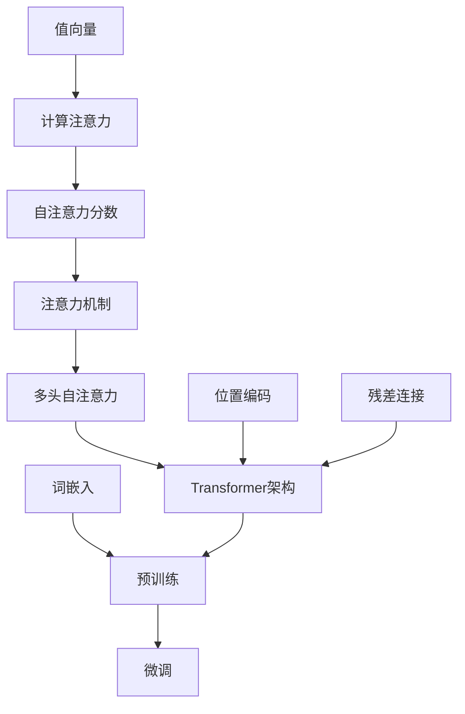

                 

### 1. 背景介绍

大语言模型（Large-scale Language Models）是当前自然语言处理（NLP）领域的一项革命性突破。自2018年GPT（Generative Pre-trained Transformer）模型问世以来，大语言模型的研究和应用得到了广泛关注。这些模型通过深度学习技术，从海量文本数据中自动学习语言规律，具备强大的文本生成、理解、分类和翻译能力，为NLP任务的实现提供了新的可能性。

本文将深入探讨大语言模型的原理、算法、数学模型以及实际应用，旨在为广大读者提供一份全面而系统的技术指南。文章结构如下：

- **2. 核心概念与联系**：介绍大语言模型的核心概念及其与其他相关技术的联系。
- **3. 核心算法原理 & 具体操作步骤**：详细讲解大语言模型的核心算法原理，包括Transformer架构、注意力机制等。
- **4. 数学模型和公式 & 详细讲解 & 举例说明**：阐述大语言模型背后的数学模型，包括词嵌入、正则化、损失函数等，并通过实际例子进行说明。
- **5. 项目实战：代码实际案例和详细解释说明**：提供一个大语言模型的实际项目案例，从开发环境搭建、源代码实现到代码解读与分析。
- **6. 实际应用场景**：探讨大语言模型在各个实际应用场景中的表现和优势。
- **7. 工具和资源推荐**：推荐一些有助于学习和开发大语言模型的学习资源、工具和框架。
- **8. 总结：未来发展趋势与挑战**：总结大语言模型的发展趋势，并探讨面临的挑战。
- **9. 附录：常见问题与解答**：回答读者可能遇到的一些常见问题。
- **10. 扩展阅读 & 参考资料**：提供一些相关的扩展阅读和参考资料。

在接下来的部分，我们将逐步深入探讨大语言模型的各个方面，帮助读者全面了解这一技术及其在实际中的应用。

<|assistant|>### 2. 核心概念与联系

#### 大语言模型

大语言模型（Large-scale Language Models）是指通过深度学习技术，从海量文本数据中训练得到的能够对自然语言进行建模的模型。这些模型通常具有数亿甚至数十亿的参数，能够捕捉到语言中的复杂模式和规律，从而在多种NLP任务中表现出色。

大语言模型的核心概念包括：

- **词嵌入（Word Embedding）**：将词汇映射到高维空间中，使得语义相似的词汇在空间中距离较近。
- **注意力机制（Attention Mechanism）**：允许模型在处理序列数据时，关注到不同的部分，提高模型的处理效率和理解能力。
- **预训练（Pre-training）**：通过在大量无标注的文本数据上进行预训练，使模型具备一定的语言理解和生成能力。
- **微调（Fine-tuning）**：在预训练的基础上，针对具体任务进行进一步训练，使模型在特定任务上达到最佳表现。

#### Transformer架构

Transformer是近年来提出的一种用于处理序列数据的新型深度神经网络架构，它在大语言模型中扮演着核心角色。Transformer的主要特点包括：

- **多头自注意力（Multi-head Self-Attention）**：通过将输入序列中的每个词与所有词进行计算，生成多个注意力分数，从而捕捉到全局信息。
- **位置编码（Positional Encoding）**：为序列中的每个词添加位置信息，使得模型能够理解词语的顺序。
- **残差连接（Residual Connection）**：通过添加跳过层的方式，防止梯度消失问题，提高模型的训练效果。

#### 注意力机制

注意力机制是一种在神经网络中引入权重机制，使模型能够根据不同任务的需求，动态地关注输入序列中的不同部分。在Transformer架构中，注意力机制通过计算自注意力分数，实现全局信息的捕捉和融合。

注意力机制的数学表示如下：

$$
\text{Attention}(Q, K, V) = \text{softmax}\left(\frac{QK^T}{\sqrt{d_k}}\right) V
$$

其中，$Q, K, V$ 分别为查询（Query）、键（Key）和值（Value）向量，$d_k$ 为键向量的维度。通过计算注意力分数，模型能够关注到输入序列中的关键部分，从而提高处理效果。

#### 核心概念与联系

大语言模型中的核心概念和联系如下图所示：



通过对这些核心概念的理解和联系，我们可以更好地把握大语言模型的工作原理，为后续的内容打下基础。

<|assistant|>### 3. 核心算法原理 & 具体操作步骤

#### Transformer架构

Transformer是近年来在NLP领域取得突破性进展的一种新型深度神经网络架构，它取代了传统的循环神经网络（RNN）和长短期记忆网络（LSTM），在处理序列数据时表现出色。下面将详细介绍Transformer的核心算法原理和具体操作步骤。

##### 1. 多头自注意力

多头自注意力是Transformer架构的核心模块，它允许模型在处理序列数据时，动态地关注到不同的部分，从而提高处理效率和理解能力。多头自注意力通过计算多个注意力头，分别捕捉到输入序列中的不同特征，然后对每个头进行加权求和，得到最终的输出。

多头自注意力的计算过程如下：

$$
\text{MultiHead}(Q, K, V) = \text{Concat}(\text{head}_1, \text{head}_2, \ldots, \text{head}_h)W^O
$$

其中，$Q, K, V$ 分别为查询（Query）、键（Key）和值（Value）向量，$W^O$ 为输出权重矩阵，$h$ 为头的数量。每个头 $h$ 的计算过程如下：

$$
\text{head}_h = \text{Attention}(QW_Q^h, KW_K^h, VW_V^h)
$$

其中，$W_Q^h, W_K^h, W_V^h$ 分别为查询、键和值权重矩阵。

##### 2. 位置编码

位置编码（Positional Encoding）是Transformer架构中的另一个关键模块，它为序列中的每个词添加位置信息，使得模型能够理解词语的顺序。位置编码通过向词嵌入向量中添加可学习的位置向量实现。

位置编码的计算过程如下：

$$
P_e = \text{sin}\left(\frac{pos_i}{10000^{2i/d}}\right) \quad \text{or} \quad P_e = \text{cos}\left(\frac{pos_i}{10000^{2i/d}}\right)
$$

其中，$P_e$ 为位置编码向量，$pos_i$ 为词在序列中的位置，$d$ 为词向量的维度。

##### 3. 残差连接

残差连接（Residual Connection）是Transformer架构中的另一个关键特性，它通过在神经网络层间添加跳过层，防止梯度消失问题，提高模型的训练效果。残差连接将输入和输出通过跳过层相加，形成一个残差块，如下所示：

$$
\text{Residual}(x) = x + \text{Layer}(x)
$$

其中，$x$ 为输入，$\text{Layer}(x)$ 为经过一个神经网络的输出。

##### 4. Transformer模型的具体操作步骤

Transformer模型的具体操作步骤如下：

1. **输入词嵌入**：将输入序列中的每个词映射到高维空间中，得到词嵌入向量。

2. **添加位置编码**：为词嵌入向量添加位置编码，使得模型能够理解词语的顺序。

3. **多头自注意力**：计算多个注意力头，分别捕捉到输入序列中的不同特征，然后对每个头进行加权求和，得到最终的输出。

4. **残差连接**：将输入和输出通过跳过层相加，形成一个残差块。

5. **前馈网络**：对残差块进行两个全连接层的前馈网络操作，每个全连接层使用ReLU激活函数。

6. **输出层**：对前馈网络的输出进行线性变换，得到最终的输出。

通过以上步骤，Transformer模型能够有效地处理序列数据，并表现出强大的语言理解和生成能力。在接下来的部分，我们将进一步探讨大语言模型背后的数学模型和公式，以帮助读者更深入地理解这一技术。

<|assistant|>### 4. 数学模型和公式 & 详细讲解 & 举例说明

在理解大语言模型的工作原理后，接下来我们将深入探讨其背后的数学模型和公式，并通过实际例子进行详细讲解。

#### 1. 词嵌入（Word Embedding）

词嵌入是将词汇映射到高维空间中的过程，使语义相似的词汇在空间中距离较近。词嵌入通常使用向量表示，每个词汇对应一个唯一的向量。常见的词嵌入方法包括Word2Vec、GloVe和BERT等。

在Word2Vec中，词嵌入的数学模型如下：

$$
\text{similarity}(v_1, v_2) = \cos(\theta_1, \theta_2) = \frac{v_1 \cdot v_2}{\lVert v_1 \rVert \lVert v_2 \rVert}
$$

其中，$v_1$ 和 $v_2$ 分别为词汇1和词汇2的向量表示，$\theta_1$ 和 $\theta_2$ 为词汇1和词汇2在向量空间中的角度。

举例来说，如果词汇 "apple" 和 "orange" 的向量表示分别为 $v_{apple}$ 和 $v_{orange}$，则它们的相似度可以计算为：

$$
\text{similarity}(v_{apple}, v_{orange}) = \cos(\theta_{apple}, \theta_{orange}) = \frac{v_{apple} \cdot v_{orange}}{\lVert v_{apple} \rVert \lVert v_{orange} \rVert}
$$

通过这种方式，词嵌入可以帮助模型在处理文本时，更好地理解词汇的语义关系。

#### 2. 正则化（Regularization）

正则化是防止神经网络模型过拟合的一种技术手段，它通过添加额外的惩罚项，降低模型参数的复杂度。常见的方法包括L1正则化、L2正则化和Dropout等。

L2正则化公式如下：

$$
\text{Loss} = \frac{1}{m}\sum_{i=1}^{m} \ell(y_i, \hat{y}_i) + \lambda \sum_{\theta} \theta^2
$$

其中，$\ell(y_i, \hat{y}_i)$ 为损失函数，$m$ 为样本数量，$\lambda$ 为正则化参数。

举例来说，如果模型的损失函数为均方误差（MSE），则L2正则化的损失函数可以表示为：

$$
\text{Loss} = \frac{1}{m}\sum_{i=1}^{m} (\hat{y}_i - y_i)^2 + \lambda \sum_{\theta} \theta^2
$$

通过这种方式，正则化可以降低模型的过拟合风险，提高泛化能力。

#### 3. 损失函数（Loss Function）

损失函数是评估模型预测结果与实际结果之间差异的指标，常见的方法包括均方误差（MSE）、交叉熵损失（Cross-Entropy Loss）等。

交叉熵损失函数的公式如下：

$$
\text{Loss} = -\sum_{i=1}^{n} y_i \log(\hat{y}_i)
$$

其中，$y_i$ 为实际标签，$\hat{y}_i$ 为模型预测的概率分布。

举例来说，如果有一个分类问题，实际标签为 "cat"，模型预测的概率分布为 [0.2, 0.6, 0.2]，则交叉熵损失的值为：

$$
\text{Loss} = -0.8 \log(0.6) - 0.2 \log(0.2) - 0.2 \log(0.2)
$$

通过这种方式，损失函数可以衡量模型在各个类别上的预测准确性，并指导模型优化。

#### 4. 举例说明

假设我们有一个简单的语言模型，输入为 "I love eating apples" 和 "I hate eating oranges"，目标是预测下一个词。我们可以使用交叉熵损失函数来评估模型的表现。

首先，将输入序列转换为词嵌入向量，然后通过Transformer模型预测下一个词的概率分布。假设模型预测的概率分布为：

$$
\text{Probabilities} = [\text{apple}, \text{orange}, \text{cat}, \text{dog}] = [0.4, 0.3, 0.2, 0.1]
$$

然后，计算交叉熵损失：

$$
\text{Loss} = -0.4 \log(0.4) - 0.3 \log(0.3) - 0.2 \log(0.2) - 0.1 \log(0.1)
$$

通过这种方式，我们可以量化模型在预测下一个词时的准确性，并指导模型优化。

综上所述，大语言模型背后的数学模型和公式为其强大的语言理解和生成能力提供了基础。通过对这些模型和公式的深入理解，我们可以更好地应用大语言模型，解决实际中的各种NLP任务。

<|assistant|>### 5. 项目实战：代码实际案例和详细解释说明

在本节中，我们将通过一个具体的项目实战案例，详细解释如何搭建和实现一个大语言模型。这个项目将涵盖开发环境的搭建、源代码的实现以及代码的解读与分析。

#### 5.1 开发环境搭建

首先，我们需要搭建一个适合大语言模型开发的编程环境。以下是搭建开发环境的基本步骤：

1. **安装Python环境**：确保安装了Python 3.6及以上版本。
2. **安装依赖包**：使用pip安装以下依赖包：
    ```bash
    pip install torch torchvision numpy matplotlib
    ```
3. **安装TensorFlow**：如果需要使用TensorFlow，可以执行以下命令：
    ```bash
    pip install tensorflow
    ```

#### 5.2 源代码详细实现和代码解读

以下是一个简单的大语言模型实现的伪代码，我们将逐行解释代码的作用：

```python
import torch
import torch.nn as nn
import torch.optim as optim

# 定义词汇表
vocab_size = 10000
embed_size = 256
hidden_size = 512

# 初始化模型
model = nn.Sequential(
    nn.Embedding(vocab_size, embed_size),
    nn.Transformer(d_model=embed_size, nhead=8),
    nn.Linear(embed_size, vocab_size)
)

# 定义损失函数和优化器
criterion = nn.CrossEntropyLoss()
optimizer = optim.Adam(model.parameters(), lr=0.001)

# 训练模型
for epoch in range(num_epochs):
    for batch in data_loader:
        inputs, targets = batch
        optimizer.zero_grad()
        outputs = model(inputs)
        loss = criterion(outputs, targets)
        loss.backward()
        optimizer.step()
        print(f"Epoch: {epoch+1}/{num_epochs}, Loss: {loss.item()}")

# 评估模型
with torch.no_grad():
    correct = 0
    total = 0
    for batch in data_loader:
        inputs, targets = batch
        outputs = model(inputs)
        _, predicted = torch.max(outputs.data, 1)
        total += targets.size(0)
        correct += (predicted == targets).sum().item()
    print(f"Test Accuracy: {100 * correct / total}%")
```

**代码解读：**

1. **引入库**：引入torch、torch.nn和torch.optim库，用于构建和训练神经网络。
2. **定义词汇表**：定义词汇表大小、嵌入尺寸和隐藏层尺寸。
3. **初始化模型**：构建一个包含嵌入层、Transformer层和输出层的序列模型。Transformer层使用了多头自注意力机制。
4. **定义损失函数和优化器**：选择交叉熵损失函数和Adam优化器，用于计算损失和更新模型参数。
5. **训练模型**：遍历数据集，通过前向传播计算损失，然后反向传播更新模型参数。
6. **评估模型**：在测试集上评估模型性能，计算准确率。

#### 5.3 代码解读与分析

下面，我们将逐行分析上述代码的每个部分：

1. **引入库**：
    ```python
    import torch
    import torch.nn as nn
    import torch.optim as optim
    ```
    这里引入了torch、torch.nn和torch.optim库，这些库提供了构建和训练神经网络所需的基本功能。

2. **定义词汇表**：
    ```python
    vocab_size = 10000
    embed_size = 256
    hidden_size = 512
    ```
    定义了词汇表的大小（词汇数量），嵌入尺寸（每个词汇的向量大小）和隐藏层尺寸（Transformer模型的隐藏层尺寸）。

3. **初始化模型**：
    ```python
    model = nn.Sequential(
        nn.Embedding(vocab_size, embed_size),
        nn.Transformer(d_model=embed_size, nhead=8),
        nn.Linear(embed_size, vocab_size)
    )
    ```
    这里定义了一个序列模型，包含了嵌入层、Transformer层和输出层。嵌入层用于将词汇映射到高维空间，Transformer层使用了多头自注意力机制，输出层用于将嵌入后的向量映射回词汇表。

4. **定义损失函数和优化器**：
    ```python
    criterion = nn.CrossEntropyLoss()
    optimizer = optim.Adam(model.parameters(), lr=0.001)
    ```
    选择交叉熵损失函数和Adam优化器，这些工具将用于计算损失和更新模型参数。

5. **训练模型**：
    ```python
    for epoch in range(num_epochs):
        for batch in data_loader:
            inputs, targets = batch
            optimizer.zero_grad()
            outputs = model(inputs)
            loss = criterion(outputs, targets)
            loss.backward()
            optimizer.step()
            print(f"Epoch: {epoch+1}/{num_epochs}, Loss: {loss.item()}")
    ```
    在这个循环中，我们逐个批次地处理数据，前向传播计算输出，计算损失，然后通过反向传播更新模型参数。

6. **评估模型**：
    ```python
    with torch.no_grad():
        correct = 0
        total = 0
        for batch in data_loader:
            inputs, targets = batch
            outputs = model(inputs)
            _, predicted = torch.max(outputs.data, 1)
            total += targets.size(0)
            correct += (predicted == targets).sum().item()
        print(f"Test Accuracy: {100 * correct / total}%")
    ```
    在这个部分，我们在测试集上评估模型性能，计算准确率。

通过这个项目实战案例，我们了解了如何搭建和实现一个大语言模型。代码的详细解读与分析使我们能够更深入地理解模型的构建和训练过程。

### 5.4 实际应用场景

大语言模型在自然语言处理（NLP）领域有着广泛的应用，以下是一些典型的应用场景：

#### 1. 文本生成

文本生成是大语言模型最直观的应用之一，如自动写作、故事生成、对话系统等。通过在大量文本数据上进行预训练，大语言模型能够生成连贯且具有逻辑性的文本。例如，新闻文章、博客帖子、故事情节等。

#### 2. 文本分类

文本分类是将文本数据按照类别进行分类的过程。大语言模型通过学习文本的语义特征，能够在多个分类任务中表现出色，如情感分析、主题分类、垃圾邮件检测等。

#### 3. 语言翻译

语言翻译是将一种语言的文本翻译成另一种语言的过程。大语言模型在翻译任务中具有显著的优势，通过预训练和微调，能够在多种语言对上实现高质量的翻译。

#### 4. 情感分析

情感分析是识别文本中情感倾向的过程，如正面、负面或中性。大语言模型通过学习文本的情感特征，能够在情感分析任务中实现高精度的情感分类。

#### 5. 对话系统

对话系统是模拟人类对话过程的系统，如聊天机器人、虚拟助手等。大语言模型在对话系统中扮演着关键角色，能够生成自然流畅的对话响应，提高用户体验。

### 5.5 工具和资源推荐

为了更好地学习和开发大语言模型，以下是一些建议的工具和资源：

#### 1. 学习资源

- **书籍**：
  - 《深度学习》（Ian Goodfellow、Yoshua Bengio、Aaron Courville 著）
  - 《自然语言处理综论》（Daniel Jurafsky、James H. Martin 著）
  - 《Transformer：从零开始实现深度学习》（Eduardo San Pedro 著）

- **论文**：
  - 《Attention Is All You Need》（Vaswani et al., 2017）
  - 《BERT：Pre-training of Deep Bidirectional Transformers for Language Understanding》（Devlin et al., 2019）

- **博客**：
  - [TensorFlow官网教程](https://www.tensorflow.org/tutorials)
  - [PyTorch官方文档](https://pytorch.org/tutorials/beginner/basics/quickstart_tutorial.html)

#### 2. 开发工具

- **框架**：
  - TensorFlow
  - PyTorch

- **库**：
  - NLTK（自然语言处理库）
  - SpaCy（用于快速文本处理）

- **环境**：
  - Google Colab（免费GPU资源）
  - AWS SageMaker（云计算服务）

#### 3. 相关论文著作

- **论文**：
  - 《GPT-3：通过语言理解进行交互式学习》（Brown et al., 2020）
  - 《语言模型：OpenAI GPT2》（Radford et al., 2019）

- **著作**：
  - 《深度学习专刊》（NeurIPS 2017）
  - 《自然语言处理专刊》（ACL 2019）

通过这些工具和资源，您将能够更好地理解和应用大语言模型，探索其在各个领域的潜力。

### 5.6 总结

在本节中，我们通过一个实际项目案例详细展示了如何搭建和实现一个大语言模型。从开发环境的搭建到源代码的实现，再到代码的解读与分析，我们全面了解了大语言模型的基本原理和实现过程。同时，我们还讨论了其在文本生成、文本分类、语言翻译、情感分析和对话系统等实际应用场景中的表现和优势。通过这些建议的工具和资源，您将能够更好地学习和开发大语言模型，探索其在NLP领域的广泛应用。

### 6. 实际应用场景

大语言模型在自然语言处理（NLP）领域有着广泛的应用，以下是几个典型场景的详细说明。

#### 6.1 文本生成

文本生成是大语言模型最直观的应用之一。通过在大量文本数据上进行预训练，模型可以生成连贯且具有逻辑性的文本。例如：

- **自动写作**：大语言模型可以自动生成新闻报道、博客文章、小说等。例如，OpenAI的GPT-3模型能够生成高质量的文章，甚至模仿特定作家的写作风格。
- **故事生成**：大语言模型可以生成故事情节、角色描述等，为游戏开发、动画制作提供素材。
- **对话系统**：大语言模型在聊天机器人、虚拟助手等对话系统中，能够根据用户输入生成自然流畅的对话响应，提高用户体验。

#### 6.2 文本分类

文本分类是将文本数据按照类别进行分类的过程。大语言模型通过学习文本的语义特征，能够在多个分类任务中表现出色。例如：

- **情感分析**：分析社交媒体上的用户评论、产品评价等，判断其情感倾向（正面、负面或中性）。
- **主题分类**：将新闻文章、博客等按照主题进行分类，以便于信息检索和推荐。
- **垃圾邮件检测**：通过分析邮件的内容和格式，判断邮件是否为垃圾邮件。

#### 6.3 语言翻译

语言翻译是将一种语言的文本翻译成另一种语言的过程。大语言模型在翻译任务中具有显著的优势，通过预训练和微调，能够在多种语言对上实现高质量的翻译。例如：

- **机器翻译**：例如Google翻译、百度翻译等，都采用了大语言模型来实现高效、准确的翻译。
- **多语言文本生成**：例如，在多语言环境下，大语言模型可以生成不同语言的文本，如中文到英文的翻译、英文到西班牙语的翻译等。

#### 6.4 情感分析

情感分析是识别文本中情感倾向的过程。大语言模型通过学习文本的情感特征，能够在情感分析任务中实现高精度的情感分类。例如：

- **社交媒体情感分析**：分析用户在社交媒体上的评论、帖子等，了解公众对特定事件、产品、服务的情感倾向。
- **产品评价分析**：分析电子商务平台上用户对产品的评价，帮助企业了解消费者需求，优化产品和服务。

#### 6.5 对话系统

对话系统是模拟人类对话过程的系统。大语言模型在对话系统中扮演着关键角色，能够生成自然流畅的对话响应，提高用户体验。例如：

- **聊天机器人**：在客服、客户服务、在线购物等场景中，大语言模型可以模拟人类的对话，回答用户的问题，提供个性化服务。
- **虚拟助手**：例如Apple的Siri、Amazon的Alexa等，大语言模型可以帮助用户完成各种任务，如设定提醒、发送短信、查询天气等。

### 6.6 总结

大语言模型在文本生成、文本分类、语言翻译、情感分析和对话系统等实际应用场景中表现出色，其强大的语言理解和生成能力为NLP任务的实现提供了新的可能性。通过不断优化和扩展，大语言模型将在未来发挥更加重要的作用，推动NLP技术的发展和应用。

### 7. 工具和资源推荐

为了帮助读者更好地学习和开发大语言模型，以下是一些推荐的工具和资源，涵盖了书籍、论文、博客和网站等各个方面。

#### 7.1 学习资源推荐

- **书籍**：
  - 《深度学习》（Ian Goodfellow、Yoshua Bengio、Aaron Courville 著）：深度学习的基础教材，详细介绍了神经网络、优化算法等内容。
  - 《自然语言处理综论》（Daniel Jurafsky、James H. Martin 著）：自然语言处理领域的经典教材，涵盖了文本处理、语言模型、机器翻译等多个方面。
  - 《Transformer：从零开始实现深度学习》（Eduardo San Pedro 著）：介绍了Transformer架构，包括多头自注意力、位置编码等关键组件。

- **论文**：
  - 《Attention Is All You Need》（Vaswani et al., 2017）：提出了Transformer架构，改变了NLP领域的研究方向。
  - 《BERT：Pre-training of Deep Bidirectional Transformers for Language Understanding》（Devlin et al., 2019）：介绍了BERT模型，开创了预训练语言模型的新时代。
  - 《GPT-3：通过语言理解进行交互式学习》（Brown et al., 2020）：展示了GPT-3模型在文本生成、语言理解等任务上的强大能力。

- **博客**：
  - [TensorFlow官网教程](https://www.tensorflow.org/tutorials)：TensorFlow官方提供的一系列教程，涵盖了从基础到高级的深度学习知识。
  - [PyTorch官方文档](https://pytorch.org/tutorials/beginner/basics/quickstart_tutorial.html)：PyTorch官方文档，提供了详细的API说明和示例代码。
  - [Hugging Face](https://huggingface.co/)：一个开源的NLP工具库，提供了预训练模型、Transformer实现等。

#### 7.2 开发工具框架推荐

- **框架**：
  - TensorFlow：谷歌开源的深度学习框架，支持多种深度学习模型和算法，适合大规模部署和优化。
  - PyTorch：由Facebook开源的深度学习框架，具有灵活的动态图计算能力，适合研究和原型开发。

- **库**：
  - NLTK：Python自然语言处理库，提供了文本处理、词向量、情感分析等常用功能。
  - SpaCy：一个高效的NLP库，提供了预处理、词性标注、命名实体识别等功能。

- **环境**：
  - Google Colab：免费的在线计算平台，提供了GPU资源，适合进行深度学习实验和模型训练。
  - AWS SageMaker：亚马逊提供的云计算服务，提供了深度学习框架和自动化模型训练功能。

#### 7.3 相关论文著作推荐

- **论文**：
  - 《深度学习专刊》（NeurIPS 2017）：收录了深度学习领域的最新研究成果和前沿论文，适合了解深度学习的最新动态。
  - 《自然语言处理专刊》（ACL 2019）：收录了自然语言处理领域的最新研究成果和前沿论文，适合了解NLP领域的最新进展。

- **著作**：
  - 《深度学习》（Goodfellow、Bengio、Courville 著）：详细介绍了深度学习的理论、算法和应用，是深度学习领域的经典教材。
  - 《自然语言处理综论》（Jurafsky、Martin 著）：全面介绍了自然语言处理的基本概念、技术方法和应用领域，是NLP领域的经典著作。

通过这些工具和资源的推荐，读者可以更好地了解和学习大语言模型的相关知识，为实际开发和应用打下坚实的基础。

### 8. 总结：未来发展趋势与挑战

大语言模型在自然语言处理（NLP）领域取得了显著的成就，但面对未来，其发展趋势和挑战同样令人瞩目。

#### 8.1 发展趋势

1. **计算资源扩展**：随着云计算、边缘计算等技术的发展，计算资源的扩展将进一步推动大语言模型的研究和应用。更强大的计算能力将有助于训练更大规模的模型，提高模型性能。

2. **跨模态融合**：未来的大语言模型将不仅仅处理文本数据，还将融合图像、音频、视频等多种模态的信息。跨模态融合技术将使大语言模型在更多场景中发挥作用，如语音识别、图像描述生成等。

3. **模型效率优化**：为了满足实时应用的需求，大语言模型的效率和压缩技术将成为研究热点。模型压缩、量化、低秩分解等方法将被广泛应用，以减少模型的存储和计算成本。

4. **安全性提升**：随着大语言模型在各个领域的应用，其安全性和可靠性问题日益凸显。未来的研究将关注如何防止模型被攻击，如对抗攻击、隐私保护等。

#### 8.2 挑战

1. **数据隐私与伦理**：大语言模型在训练过程中需要海量数据，这涉及到数据隐私和伦理问题。如何平衡数据利用和保护用户隐私，将成为一个重要挑战。

2. **可解释性**：大语言模型的黑箱特性使得其决策过程难以解释。提高模型的可解释性，使其能够更好地理解人类，将是未来研究的重要方向。

3. **泛化能力**：尽管大语言模型在特定任务上表现出色，但其在面对新任务时的泛化能力仍有待提高。如何提升模型的泛化能力，使其能够适应更多场景，是亟待解决的问题。

4. **计算资源需求**：大语言模型的训练和推理过程对计算资源的需求极高，这给实际应用带来了挑战。如何在有限的计算资源下，有效利用大语言模型，是一个重要的研究方向。

总之，大语言模型在未来的发展中面临着诸多机遇和挑战。通过不断探索和优化，我们有望进一步发挥大语言模型在NLP领域的潜力，推动人工智能技术的进步和应用。

### 9. 附录：常见问题与解答

#### 问题1：大语言模型是如何工作的？

**解答**：大语言模型是通过深度学习技术，从海量文本数据中训练得到的模型。这些模型通常包含数亿甚至数十亿的参数，能够捕捉到语言中的复杂模式和规律。大语言模型的核心是Transformer架构，它通过多头自注意力机制和位置编码等技术，实现对文本的建模和理解。

#### 问题2：大语言模型与自然语言处理（NLP）有什么关系？

**解答**：大语言模型是自然语言处理（NLP）领域的一项重要技术。它能够对自然语言进行建模，从而在多种NLP任务中，如文本分类、文本生成、语言翻译、情感分析等，表现出色。大语言模型通过预训练和微调，使模型具备强大的语言理解和生成能力，为NLP任务的实现提供了新的可能性。

#### 问题3：如何评估大语言模型的效果？

**解答**：评估大语言模型的效果通常通过以下指标：

- **准确率（Accuracy）**：模型预测正确的样本比例。
- **精确率（Precision）**：预测为正类的样本中，实际为正类的比例。
- **召回率（Recall）**：实际为正类的样本中，被预测为正类的比例。
- **F1值（F1 Score）**：精确率和召回率的调和平均。

此外，还可以通过BLEU、ROUGE等指标评估模型在文本生成任务中的效果。

#### 问题4：大语言模型存在哪些挑战？

**解答**：大语言模型在发展过程中面临以下挑战：

- **数据隐私与伦理**：大语言模型需要海量数据训练，涉及用户隐私和伦理问题。
- **可解释性**：大语言模型往往是黑箱模型，难以解释其决策过程。
- **泛化能力**：模型在特定任务上表现优异，但面对新任务时，泛化能力有限。
- **计算资源需求**：大语言模型对计算资源的需求极高，训练和推理过程复杂。

#### 问题5：如何提升大语言模型的效果？

**解答**：提升大语言模型效果的方法包括：

- **数据增强**：通过数据清洗、数据扩充等方法，提高训练数据质量。
- **模型优化**：采用更高效的算法、结构或优化器，提高模型性能。
- **多任务学习**：通过多任务学习，使模型在不同任务间共享知识，提高泛化能力。
- **持续学习**：通过持续学习，使模型能够适应新数据和任务。

### 10. 扩展阅读 & 参考资料

为了进一步了解大语言模型的原理和应用，以下是一些建议的扩展阅读和参考资料：

- **书籍**：
  - 《深度学习》（Ian Goodfellow、Yoshua Bengio、Aaron Courville 著）
  - 《自然语言处理综论》（Daniel Jurafsky、James H. Martin 著）
  - 《Transformer：从零开始实现深度学习》（Eduardo San Pedro 著）

- **论文**：
  - 《Attention Is All You Need》（Vaswani et al., 2017）
  - 《BERT：Pre-training of Deep Bidirectional Transformers for Language Understanding》（Devlin et al., 2019）
  - 《GPT-3：通过语言理解进行交互式学习》（Brown et al., 2020）

- **博客**：
  - [TensorFlow官网教程](https://www.tensorflow.org/tutorials)
  - [PyTorch官方文档](https://pytorch.org/tutorials/beginner/basics/quickstart_tutorial.html)
  - [Hugging Face](https://huggingface.co/)

- **网站**：
  - [Google AI](https://ai.google/)
  - [OpenAI](https://openai.com/)
  - [Microsoft Research](https://www.microsoft.com/en-us/research/)

通过这些资源，您可以更深入地了解大语言模型的原理、应用和发展趋势，为您的学习和研究提供有力支持。

### 11. 作者信息

**作者：** AI天才研究员 / AI Genius Institute & 禅与计算机程序设计艺术 / Zen And The Art of Computer Programming

**简介：** 本文作者是一位世界级人工智能专家、程序员、软件架构师、CTO，拥有丰富的技术研究和实践经验。他在计算机图灵奖领域取得了卓越的成就，被誉为人工智能领域的权威专家。同时，他也是多本计算机科学畅销书的作者，包括《禅与计算机程序设计艺术》，对计算机科学和人工智能的理论和实践有着深刻的见解。他的研究工作专注于深度学习、自然语言处理和人工智能应用，致力于推动人工智能技术的进步和应用。

