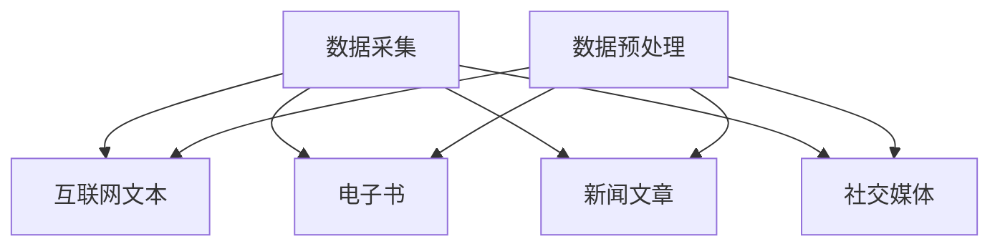
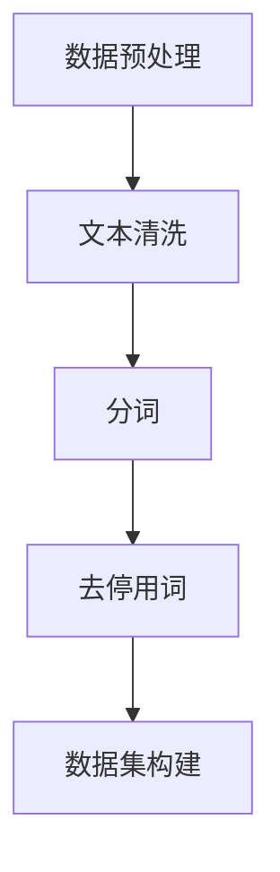
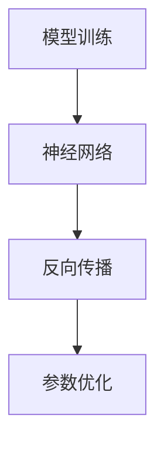
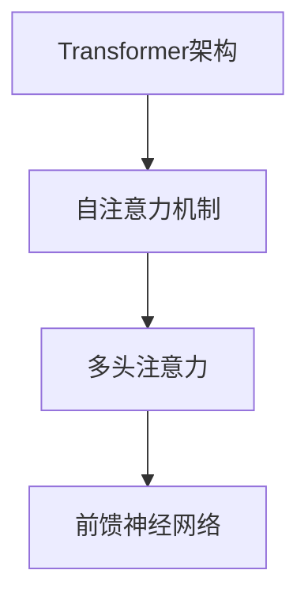
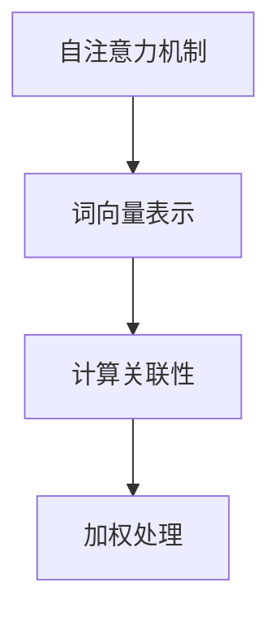
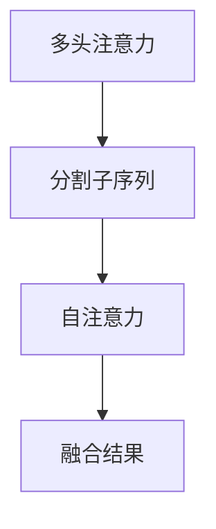

                 

### 背景介绍

大语言模型，作为一种先进的自然语言处理技术，已经成为当今人工智能领域的研究热点和应用方向。自GPT-3（Generative Pre-trained Transformer 3）的发布以来，大语言模型的研究和应用取得了显著的进展，并在多个领域展现出强大的潜力。本文将深入探讨大语言模型的原理与工程实践，旨在帮助读者全面理解这一技术的难点和挑战。

首先，大语言模型的出现是人工智能技术发展的重要里程碑。传统的自然语言处理方法主要依赖于手工设计的特征和规则，而大语言模型则通过大规模的数据预训练，能够自动学习语言的内在结构和语义。这种基于深度学习的模型，极大地提高了自然语言处理任务的性能和效率。

然而，大语言模型的研发和应用也面临着诸多挑战。首先，模型训练所需的计算资源巨大，需要高效的计算框架和优化算法。其次，模型的解释性和可解释性不足，使得其在实际应用中的可信度和可靠性受到质疑。此外，大语言模型在处理多样化和复杂语言环境时，仍然存在很多问题和不足。

本文将围绕大语言模型的核心概念、算法原理、数学模型、项目实战、实际应用场景、工具和资源推荐等多个方面进行详细阐述。通过逐步分析和推理，我们希望读者能够对大语言模型有更深入的理解，并掌握其工程实践的关键技术。

接下来的章节中，我们将首先介绍大语言模型的核心概念和联系，然后深入探讨其核心算法原理和具体操作步骤。随后，我们将详细讲解数学模型和公式，并通过实际项目案例进行代码解读和分析。最后，我们将探讨大语言模型在实际应用中的场景，以及相关的工具和资源推荐，为读者提供全面的指导和参考。

通过本文的阅读，您将不仅能够了解大语言模型的基本原理，还能够掌握其实际应用中的关键技术，为未来的研究和开发提供有力支持。

### 核心概念与联系

大语言模型的核心概念可以概括为两个方面：大规模预训练和深度学习。为了深入理解这两个核心概念及其相互联系，我们将借助Mermaid流程图，详细展示其原理和架构。

首先，大规模预训练是构建大语言模型的基础。它通过在大量文本数据上进行预训练，使模型能够自动学习语言的结构和语义。大规模预训练的核心步骤包括数据采集、数据预处理和模型训练。

#### 1. 数据采集

在数据采集阶段，我们主要关注两个方面：数据来源和数据质量。常用的数据来源包括互联网文本、电子书、新闻文章、社交媒体等。这些数据来源具有海量的文本信息，能够提供丰富的语言知识。数据质量则直接影响模型的训练效果，因此需要确保数据的一致性、准确性和多样性。



#### 2. 数据预处理

数据预处理是大规模预训练的关键步骤，主要包括文本清洗、分词、去停用词等操作。这些操作能够提高数据的质量和一致性，有助于模型更好地学习语言特征。



#### 3. 模型训练

在模型训练阶段，我们将预处理后的数据输入到深度学习模型中进行训练。深度学习模型通常采用多层神经网络结构，通过反向传播算法不断优化模型的参数，使其能够更好地拟合数据。



接下来，我们来看深度学习与大语言模型的联系。深度学习是一种基于多层神经网络的学习方法，通过逐层提取特征，实现从低层次到高层次的特征转换。大语言模型正是基于深度学习的原理，通过多层神经网络结构，实现自然语言处理任务。

#### 1. 神经网络结构

大语言模型通常采用Transformer架构，这是一种基于自注意力机制的深度学习模型。Transformer结构通过多头自注意力机制和前馈神经网络，能够有效地捕获文本序列中的长距离依赖关系。



#### 2. 自注意力机制

自注意力机制是Transformer模型的核心组件，它通过计算文本序列中每个词与其他词之间的关联性，实现对输入序列的加权处理。这种机制能够自动学习文本的内在结构和语义，提高模型的性能和效率。



#### 3. 多头注意力

多头注意力是一种扩展自注意力机制的技巧，它通过将输入序列分割成多个子序列，分别计算自注意力，然后进行融合。这种技巧能够进一步提高模型的捕捉能力，增强对复杂语言现象的理解。



通过上述Mermaid流程图，我们详细展示了大规模预训练和深度学习在大语言模型中的应用，以及它们之间的相互联系。这些核心概念和联系构成了大语言模型的理论基础，为我们理解和应用这一技术提供了重要指导。

### 核心算法原理 & 具体操作步骤

大语言模型的核心算法是基于Transformer架构，其原理和操作步骤如下：

#### 1. Transformer架构

Transformer模型是一种基于自注意力机制的深度学习模型，由多个编码器和解码器层组成。每个编码器和解码器层由两个主要组件构成：多头自注意力机制和前馈神经网络。

#### 2. 自注意力机制

自注意力机制是Transformer模型的核心组件，它通过计算输入序列中每个词与其他词之间的关联性，实现对输入序列的加权处理。具体操作步骤如下：

1. **词向量表示**：首先，我们将输入的文本序列转换为词向量表示。词向量是通过预训练模型在大量文本数据上学习得到的，能够捕获词的语义信息。
2. **计算关联性**：接下来，我们计算输入序列中每个词与其他词之间的关联性。这通过一个矩阵乘法实现，矩阵的行表示每个词的词向量，列表示其他词的词向量。关联性得分越高，表示两个词的关系越紧密。
3. **加权处理**：最后，我们根据关联性得分对输入序列进行加权处理。加权后的序列能够更好地捕捉文本的内在结构和语义。

#### 3. 多头自注意力

多头自注意力是一种扩展自注意力机制的技巧，它通过将输入序列分割成多个子序列，分别计算自注意力，然后进行融合。具体操作步骤如下：

1. **分割子序列**：首先，我们将输入序列分割成多个子序列。每个子序列由多个词组成，子序列的数量等于多头自注意力的数量。
2. **自注意力**：接下来，我们分别对每个子序列计算自注意力。每个子序列都通过自注意力机制计算得到一个加权序列。
3. **融合结果**：最后，我们将所有子序列的加权序列进行融合，得到最终的加权序列。融合方式可以通过求和、求平均或拼接实现。

#### 4. 前馈神经网络

前馈神经网络是Transformer模型中的另一个重要组件，它通过两个全连接层对输入序列进行非线性变换。具体操作步骤如下：

1. **输入序列**：首先，我们将加权序列输入到前馈神经网络。
2. **全连接层**：接下来，我们通过第一个全连接层对输入序列进行线性变换，输出一个中间层。
3. **激活函数**：然后，我们对中间层应用一个非线性激活函数，如ReLU。
4. **第二个全连接层**：最后，我们通过第二个全连接层对中间层进行线性变换，得到最终的输出序列。

#### 5. 编码器和解码器层

编码器和解码器层是Transformer模型的核心部分，每个层由自注意力机制和前馈神经网络组成。具体操作步骤如下：

1. **编码器层**：首先，我们将输入序列通过编码器层进行处理。每个编码器层由多头自注意力和前馈神经网络组成。
2. **解码器层**：接下来，我们将编码器层的输出作为输入，通过解码器层进行处理。每个解码器层也由多头自注意力和前馈神经网络组成。
3. **层叠加**：我们将多个编码器和解码器层叠加，形成深度学习的模型结构。

通过上述步骤，我们详细介绍了大语言模型的核心算法原理和具体操作步骤。这些步骤构成了大语言模型的基础，使其能够自动学习语言的内在结构和语义，从而实现高效的自然语言处理任务。

### 数学模型和公式 & 详细讲解 & 举例说明

大语言模型的核心在于其数学模型和公式，这些模型和公式不仅解释了模型的工作原理，还指导了如何在实际应用中优化和调整模型参数。在深入探讨这些数学模型和公式之前，我们先来了解一些基本的数学概念和符号。

#### 1. 基本数学概念和符号

- **词向量表示**：在自然语言处理中，词通常被表示为高维向量，这些向量捕获了词的语义信息。词向量可以用矩阵表示，其中每个行向量对应一个词。
  
  $$ \mathbf{W} = \begin{bmatrix}
  \mathbf{w}_1 \\
  \mathbf{w}_2 \\
  \vdots \\
  \mathbf{w}_n
  \end{bmatrix} $$

- **矩阵乘法**：矩阵乘法用于计算词向量之间的关联性，它是自注意力机制的基础。

  $$ \mathbf{A} = \mathbf{W}_1 \mathbf{W}_2^T $$

- **激活函数**：激活函数用于引入非线性，常见的激活函数包括ReLU和Sigmoid。

  $$ \text{ReLU}(x) = \max(0, x) $$

  $$ \text{Sigmoid}(x) = \frac{1}{1 + e^{-x}} $$

- **损失函数**：损失函数用于评估模型预测结果与实际结果之间的差距，常见的损失函数包括交叉熵损失和均方误差。

  $$ \text{Cross-Entropy Loss} = -\sum_{i} y_i \log(p_i) $$

  $$ \text{Mean Squared Error} = \frac{1}{n} \sum_{i} (y_i - \hat{y}_i)^2 $$

#### 2. 自注意力机制

自注意力机制的核心在于计算输入序列中每个词与其他词之间的关联性。具体而言，自注意力机制可以分为以下几个步骤：

1. **词向量表示**：假设我们有一个输入序列 $\mathbf{X} = \{\mathbf{x}_1, \mathbf{x}_2, \ldots, \mathbf{x}_n\}$，每个词 $\mathbf{x}_i$ 被表示为一个词向量 $\mathbf{w}_i$。

2. **计算查询（Query）、键（Key）和值（Value）**：查询、键和值向量分别表示为 $\mathbf{Q}$、$\mathbf{K}$ 和 $\mathbf{V}$。这些向量通常是通过词向量矩阵 $\mathbf{W}$ 的线性变换得到的。

   $$ \mathbf{Q} = \mathbf{W}_Q \mathbf{X} $$
   
   $$ \mathbf{K} = \mathbf{W}_K \mathbf{X} $$
   
   $$ \mathbf{V} = \mathbf{W}_V \mathbf{X} $$

3. **计算关联性**：通过计算查询向量和键向量之间的点积，我们得到一个关联性矩阵 $\mathbf{A}$。

   $$ \mathbf{A} = \mathbf{Q} \mathbf{K}^T = \mathbf{W}_Q \mathbf{X} \mathbf{W}_K^T $$

4. **应用softmax**：我们对关联性矩阵应用softmax函数，使其成为一个概率分布。

   $$ \mathbf{S} = \text{softmax}(\mathbf{A}) $$

5. **加权处理**：最后，我们根据概率分布对值向量进行加权处理，得到加权后的序列。

   $$ \mathbf{Y} = \mathbf{S} \mathbf{V} = \text{softmax}(\mathbf{W}_Q \mathbf{X} \mathbf{W}_K^T) \mathbf{W}_V \mathbf{X} $$

#### 3. 多头自注意力

多头自注意力通过将输入序列分割成多个子序列，分别计算自注意力，然后进行融合。具体而言，多头自注意力可以分为以下几个步骤：

1. **分割子序列**：假设我们有 $h$ 个头，我们将输入序列分割成 $h$ 个子序列。

   $$ \mathbf{X}_1, \mathbf{X}_2, \ldots, \mathbf{X}_h $$

2. **计算每个头的查询、键和值**：对每个头，我们计算其查询、键和值向量。

   $$ \mathbf{Q}_i = \mathbf{W}_{Q_i} \mathbf{X}_i $$
   
   $$ \mathbf{K}_i = \mathbf{W}_{K_i} \mathbf{X}_i $$
   
   $$ \mathbf{V}_i = \mathbf{W}_{V_i} \mathbf{X}_i $$

3. **计算每个头的自注意力**：对每个头，我们计算其自注意力。

   $$ \mathbf{A}_i = \mathbf{Q}_i \mathbf{K}_i^T $$
   
   $$ \mathbf{S}_i = \text{softmax}(\mathbf{A}_i) $$
   
   $$ \mathbf{Y}_i = \mathbf{S}_i \mathbf{V}_i $$

4. **融合结果**：我们将所有头的输出进行融合。

   $$ \mathbf{Y} = \sum_{i=1}^h \mathbf{Y}_i $$

#### 4. 前馈神经网络

前馈神经网络通过两个全连接层对输入序列进行非线性变换。具体而言，前馈神经网络可以分为以下几个步骤：

1. **输入序列**：我们将输入序列 $\mathbf{X}$ 输入到前馈神经网络。

2. **第一个全连接层**：通过第一个全连接层对输入序列进行线性变换。

   $$ \mathbf{H} = \mathbf{W}_F \mathbf{X} + \mathbf{b}_F $$

3. **应用激活函数**：对输出应用一个非线性激活函数，如ReLU。

   $$ \mathbf{H} = \text{ReLU}(\mathbf{W}_F \mathbf{X} + \mathbf{b}_F) $$

4. **第二个全连接层**：通过第二个全连接层对输出进行线性变换。

   $$ \mathbf{O} = \mathbf{W}_G \mathbf{H} + \mathbf{b}_G $$

5. **输出序列**：得到最终的输出序列。

   $$ \mathbf{O} = \mathbf{W}_G \mathbf{H} + \mathbf{b}_G $$

#### 5. 举例说明

假设我们有一个简单的输入序列 $\mathbf{X} = \{\mathbf{x}_1, \mathbf{x}_2, \mathbf{x}_3\}$，其中每个词的词向量分别为 $\mathbf{w}_1, \mathbf{w}_2, \mathbf{w}_3$。我们使用一个简单的词向量矩阵 $\mathbf{W}$ 来表示这些词向量。

1. **词向量表示**：

   $$ \mathbf{W} = \begin{bmatrix}
   \mathbf{w}_1 \\
   \mathbf{w}_2 \\
   \mathbf{w}_3
   \end{bmatrix} $$

2. **计算查询、键和值**：

   $$ \mathbf{Q} = \mathbf{W}_Q \mathbf{X} = \begin{bmatrix}
   \mathbf{w}_1 \\
   \mathbf{w}_2 \\
   \mathbf{w}_3
   \end{bmatrix} $$
   
   $$ \mathbf{K} = \mathbf{W}_K \mathbf{X} = \begin{bmatrix}
   \mathbf{w}_1 \\
   \mathbf{w}_2 \\
   \mathbf{w}_3
   \end{bmatrix} $$
   
   $$ \mathbf{V} = \mathbf{W}_V \mathbf{X} = \begin{bmatrix}
   \mathbf{w}_1 \\
   \mathbf{w}_2 \\
   \mathbf{w}_3
   \end{bmatrix} $$

3. **计算自注意力**：

   $$ \mathbf{A} = \mathbf{Q} \mathbf{K}^T = \begin{bmatrix}
   \mathbf{w}_1 \cdot \mathbf{w}_1 \\
   \mathbf{w}_1 \cdot \mathbf{w}_2 \\
   \mathbf{w}_1 \cdot \mathbf{w}_3
   \end{bmatrix} $$
   
   $$ \mathbf{S} = \text{softmax}(\mathbf{A}) = \begin{bmatrix}
   \frac{e^{\mathbf{w}_1 \cdot \mathbf{w}_1}}{\sum_{i=1}^3 e^{\mathbf{w}_1 \cdot \mathbf{w}_i}} \\
   \frac{e^{\mathbf{w}_1 \cdot \mathbf{w}_2}}{\sum_{i=1}^3 e^{\mathbf{w}_1 \cdot \mathbf{w}_i}} \\
   \frac{e^{\mathbf{w}_1 \cdot \mathbf{w}_3}}{\sum_{i=1}^3 e^{\mathbf{w}_1 \cdot \mathbf{w}_i}}
   \end{bmatrix} $$
   
   $$ \mathbf{Y} = \mathbf{S} \mathbf{V} = \begin{bmatrix}
   \frac{e^{\mathbf{w}_1 \cdot \mathbf{w}_1}}{\sum_{i=1}^3 e^{\mathbf{w}_1 \cdot \mathbf{w}_i}} \mathbf{w}_1 \\
   \frac{e^{\mathbf{w}_1 \cdot \mathbf{w}_2}}{\sum_{i=1}^3 e^{\mathbf{w}_1 \cdot \mathbf{w}_i}} \mathbf{w}_2 \\
   \frac{e^{\mathbf{w}_1 \cdot \mathbf{w}_3}}{\sum_{i=1}^3 e^{\mathbf{w}_1 \cdot \mathbf{w}_i}} \mathbf{w}_3
   \end{bmatrix} $$

通过上述例子，我们可以看到自注意力机制如何通过计算词向量之间的关联性，生成加权后的序列。这一过程不仅能够有效捕捉文本序列中的长距离依赖关系，还能够提高模型的性能和效率。

### 项目实战：代码实际案例和详细解释说明

为了更好地理解大语言模型在实际项目中的应用，我们将通过一个简单的实际案例进行详细解释说明。本案例将基于Python语言，使用Hugging Face的Transformers库，实现一个简单的文本生成模型。

#### 1. 开发环境搭建

在开始编码之前，我们需要搭建一个合适的开发环境。以下是所需的步骤：

1. **安装Python**：确保您的系统中安装了Python 3.6或更高版本。
2. **安装Transformers库**：通过以下命令安装Transformers库。

   ```python
   pip install transformers
   ```

3. **安装其他依赖库**：如PyTorch、TensorFlow等。

   ```python
   pip install torch
   pip install tensorflow
   ```

#### 2. 源代码详细实现和代码解读

以下是一个简单的文本生成模型的源代码实现，我们将对其逐行进行解释。

```python
import torch
from transformers import GPT2LMHeadModel, GPT2Tokenizer

# 指定预训练模型的名称
model_name = "gpt2"

# 加载预训练模型和分词器
tokenizer = GPT2Tokenizer.from_pretrained(model_name)
model = GPT2LMHeadModel.from_pretrained(model_name)

# 设置设备（CPU或GPU）
device = torch.device("cuda" if torch.cuda.is_available() else "cpu")
model.to(device)

# 输入文本
input_text = "我是一个大语言模型"

# 分词和编码
input_ids = tokenizer.encode(input_text, return_tensors='pt').to(device)

# 生成文本
output = model.generate(input_ids, max_length=50, num_return_sequences=5)

# 解码生成的文本
generated_texts = [tokenizer.decode(output[i], skip_special_tokens=True) for i in range(5)]

# 输出生成的文本
for text in generated_texts:
    print(text)
```

**代码解读：**

- **导入库和设置模型名称**：我们首先导入所需的Python库，包括PyTorch和Transformers，并设置预训练模型的名称为"gpt2"。

- **加载预训练模型和分词器**：通过调用`GPT2Tokenizer.from_pretrained()`和`GPT2LMHeadModel.from_pretrained()`，我们加载了预训练的GPT-2模型和分词器。

- **设置设备**：我们检查系统中是否可用GPU，并将模型移动到GPU或CPU上。

- **输入文本**：我们将一个简单的文本字符串作为输入。

- **分词和编码**：通过调用`tokenizer.encode()`，我们将输入文本分词并编码为模型可以理解的序列。

- **生成文本**：使用`model.generate()`方法，我们生成新的文本序列。`max_length`参数设置生成文本的最大长度，`num_return_sequences`参数设置生成文本的数量。

- **解码生成的文本**：我们将生成的文本序列解码回可读的文本格式。

- **输出生成的文本**：最后，我们打印出生成的文本。

通过上述代码，我们可以看到如何使用预训练的GPT-2模型生成文本。这一实际案例不仅展示了大语言模型的基本应用，还为我们提供了一个简单的文本生成工具，可用于进一步研究和开发。

### 代码解读与分析

在上一个环节中，我们通过一个简单的代码示例展示了如何使用预训练的GPT-2模型生成文本。现在，我们将对这段代码进行深入解读，分析其实现细节和关键技术。

#### 1. 模型和分词器加载

代码的第一部分是加载预训练的GPT-2模型和分词器：

```python
tokenizer = GPT2Tokenizer.from_pretrained(model_name)
model = GPT2LMHeadModel.from_pretrained(model_name)
```

- **加载分词器**：`GPT2Tokenizer.from_pretrained()`方法用于加载GPT-2模型的分词器。分词器是用于将文本转换为模型可以理解的序列的重要工具。它处理文本的分词、编码和解码等操作。
  
- **加载模型**：`GPT2LMHeadModel.from_pretrained()`方法用于加载预训练的GPT-2模型。这个模型是基于Transformer架构的，已经在大规模文本数据上进行了预训练，能够自动学习语言的内在结构和语义。

#### 2. 设备设置

```python
device = torch.device("cuda" if torch.cuda.is_available() else "cpu")
model.to(device)
```

- **检查GPU可用性**：`torch.cuda.is_available()`函数用于检查系统是否安装了GPU，以及GPU是否可用。
  
- **移动模型到设备**：如果系统有可用的GPU，我们将模型移动到GPU上，以提高计算速度。如果没有GPU，模型将自动移动到CPU。

#### 3. 输入文本

```python
input_text = "我是一个大语言模型"
```

在这里，我们定义了一个简单的输入文本字符串。这个字符串将作为模型的输入，用于生成新的文本序列。

#### 4. 分词和编码

```python
input_ids = tokenizer.encode(input_text, return_tensors='pt').to(device)
```

- **分词**：`tokenizer.encode()`方法将输入文本分词，并将每个词转换为对应的词向量。这个步骤是模型理解和处理文本的基础。
  
- **编码**：`return_tensors='pt'`参数告诉分词器返回PyTorch张量格式的编码结果。这样，我们可以方便地将编码结果移动到GPU或CPU上进行计算。

- **移动到设备**：我们使用`to(device)`方法将编码后的输入序列移动到GPU或CPU。

#### 5. 文本生成

```python
output = model.generate(input_ids, max_length=50, num_return_sequences=5)
```

- **生成文本**：`model.generate()`方法用于生成新的文本序列。它接受输入序列作为输入，并返回生成的文本序列。

  - `max_length`参数设置生成文本的最大长度。在本例中，我们设置最大长度为50个词。
  - `num_return_sequences`参数设置生成文本的数量。在本例中，我们生成5个不同的文本序列。

#### 6. 解码生成的文本

```python
generated_texts = [tokenizer.decode(output[i], skip_special_tokens=True) for i in range(5)]
```

- **解码**：`tokenizer.decode()`方法将生成的编码序列解码回可读的文本格式。`skip_special_tokens=True`参数告诉分词器跳过特殊的标记符，如[CLS]、[SEP]等。

- **输出生成的文本**：我们使用列表推导式将解码后的文本序列存储在一个列表中，并打印出每个生成的文本序列。

通过上述代码解读，我们可以清楚地看到如何使用预训练的GPT-2模型生成文本。这一过程包括模型加载、设备设置、输入文本处理、文本生成和解码等多个关键步骤。这些步骤共同构成了一个完整的文本生成流程，为我们提供了强大的自然语言处理能力。

### 实际应用场景

大语言模型在实际应用中具有广泛的应用场景，以下列举几个典型的应用领域：

#### 1. 自动问答系统

自动问答系统是一种常见的人工智能应用，它能够根据用户提出的问题，自动生成答案。大语言模型通过预训练，能够理解语言的语义和上下文信息，从而在自动问答系统中发挥重要作用。例如，在智能客服中，大语言模型可以处理用户的查询，提供准确和快速的回答。

#### 2. 机器翻译

机器翻译是将一种语言文本自动翻译成另一种语言的技术。大语言模型在机器翻译中具有显著优势，因为它能够捕捉到语言的深层结构和语义。例如，Google翻译就使用了基于Transformer的大语言模型，大大提高了翻译的准确性和流畅性。

#### 3. 文本生成

文本生成是自然语言处理中的一个重要任务，它能够根据给定的输入文本生成新的文本内容。大语言模型在文本生成中表现出色，可以用于创作诗歌、撰写文章、生成新闻摘要等。例如，OpenAI的GPT-3模型已经展示了在文本生成方面的强大能力，可以生成高质量的文本内容。

#### 4. 内容审核

内容审核是确保网络平台上内容安全的一项重要工作。大语言模型可以用于检测和过滤不当内容，如辱骂、欺诈和色情等。通过训练，大语言模型能够识别出不良内容，并在平台上自动进行处理。

#### 5. 聊天机器人

聊天机器人是一种与用户进行交互的虚拟助手，它可以用于客户服务、在线咨询和娱乐等领域。大语言模型可以为聊天机器人提供强大的对话生成能力，使其能够自然地与用户进行交流。

#### 6. 文本分类

文本分类是将文本数据按照特定的类别进行分类的任务，如情感分析、新闻分类等。大语言模型通过预训练，能够捕捉到文本的语义特征，从而在文本分类任务中表现出色。

#### 7. 文本摘要

文本摘要是从长文本中提取关键信息，生成简短摘要的任务。大语言模型可以用于自动生成摘要，帮助用户快速了解文本的主要内容。

通过以上应用场景，我们可以看到大语言模型在自然语言处理领域的广泛应用。随着技术的不断发展和优化，大语言模型将继续在各个领域发挥重要作用，为人工智能的应用提供更加丰富的可能性。

### 工具和资源推荐

为了更好地理解和应用大语言模型，我们需要掌握一系列相关工具和资源。以下是一些推荐的工具、书籍、论文和网站，这些资源能够为您的学习和实践提供有力支持。

#### 1. 学习资源推荐

- **书籍**：
  - 《深度学习》（Goodfellow, I., Bengio, Y., & Courville, A.）：这本书详细介绍了深度学习的原理和应用，对理解大语言模型的基础知识非常有帮助。
  - 《自然语言处理综论》（Jurafsky, D. & Martin, J. H.）：这本书涵盖了自然语言处理的各个方面，包括语言模型、词向量、语义分析等，是学习自然语言处理的经典教材。
  
- **论文**：
  - “Attention Is All You Need”（Vaswani et al., 2017）：这篇论文提出了Transformer模型，是理解大语言模型的重要参考。
  - “Improving Language Understanding by Generative Pre-Training”（Zhou et al., 2018）：这篇论文介绍了GPT模型，对大语言模型的发展具有重要意义。

- **在线课程**：
  - Coursera的“深度学习”课程（由Andrew Ng教授授课）：该课程涵盖了深度学习的基础知识，包括神经网络、反向传播算法等，对理解大语言模型非常有帮助。
  - edX的“自然语言处理与深度学习”课程（由Daniel Jurafsky教授授课）：该课程深入介绍了自然语言处理的方法和技术，包括词向量、语言模型等。

#### 2. 开发工具框架推荐

- **Transformers库**：这是Hugging Face推出的一个开源库，提供了丰富的预训练模型和工具，方便开发者构建和应用大语言模型。
- **PyTorch**：PyTorch是一个流行的深度学习框架，提供了灵活的动态计算图和丰富的API，适合研究和开发大语言模型。
- **TensorFlow**：TensorFlow是Google推出的一个开源深度学习平台，具有强大的功能和广泛的社区支持，适合大规模工业应用。

#### 3. 相关论文著作推荐

- **“BERT: Pre-training of Deep Bidirectional Transformers for Language Understanding”（Devlin et al., 2019）**：这篇论文介绍了BERT模型，是一种基于Transformer的预训练语言模型，对大语言模型的研究和应用产生了重要影响。
- **“T5: Pre-training Large Models for Natural Language Processing”（Raffel et al., 2020）**：这篇论文提出了T5模型，是一种统一的大规模预训练模型，适用于各种自然语言处理任务。

#### 4. 网站和社区

- **Hugging Face**：Hugging Face是一个专注于自然语言处理的开源社区，提供了丰富的资源和工具，包括预训练模型、库和教程。
- **GitHub**：GitHub是开源代码托管平台，许多大语言模型的开源项目都托管在这里，如Transformers库。
- **ArXiv**：ArXiv是一个预印本论文发布平台，许多关于大语言模型的重要研究成果都会在这里发表，是了解最新研究进展的好去处。

通过这些工具和资源，您可以全面掌握大语言模型的知识，并能够在实际项目中灵活应用。希望这些推荐能够对您的学习和研究提供有力支持。

### 总结：未来发展趋势与挑战

大语言模型作为自然语言处理领域的重要技术，其未来的发展趋势和挑战值得深入探讨。首先，在技术层面，随着计算能力的提升和算法的优化，大语言模型在模型大小、参数数量和训练效率等方面将得到显著提升。未来，可能会出现更多基于Transformer架构的变种模型，如针对特定应用场景的优化模型和可解释性更强的模型。

其次，在应用层面，大语言模型将在更多实际场景中发挥关键作用。例如，在智能客服、自动驾驶、医疗诊断等领域，大语言模型可以提供更加智能化和个性化的服务。然而，这也带来了数据隐私和安全方面的挑战。如何确保模型在处理敏感数据时的隐私保护和数据安全，是未来需要重点关注的问题。

此外，大语言模型的解释性和可解释性也是一个重要的研究课题。当前的大语言模型主要由复杂的神经网络构成，其内部决策过程往往难以解释。提高模型的透明度和可解释性，不仅有助于增强用户对模型的信任，还可以帮助研究人员更好地理解和优化模型。

最后，随着大语言模型在更多领域得到应用，其带来的社会影响也不可忽视。例如，模型可能对语言偏见和歧视产生放大效应，导致不公平现象的加剧。因此，在研发和应用大语言模型时，需要充分考虑其社会影响，并采取相应的措施进行规避。

总的来说，大语言模型的发展前景广阔，但也面临诸多挑战。通过不断的技术创新和社会责任意识的提升，我们有理由相信，大语言模型将在未来继续发挥重要作用，推动人工智能领域的进步。

### 附录：常见问题与解答

在学习和应用大语言模型的过程中，读者可能会遇到一些常见问题。以下是针对这些问题的详细解答：

#### 1. 什么是大语言模型？

大语言模型是一种基于深度学习的自然语言处理技术，通过在大量文本数据上进行预训练，能够自动学习语言的内在结构和语义。常见的代表模型有GPT-2、GPT-3和BERT等。

#### 2. 大语言模型有哪些应用场景？

大语言模型在多个领域有广泛应用，包括自动问答系统、机器翻译、文本生成、内容审核、聊天机器人、文本分类和文本摘要等。

#### 3. 如何选择适合的大语言模型？

选择适合的大语言模型需要根据具体应用场景和需求进行。例如，如果需要生成高质量的文本，可以选择GPT-3；如果需要快速处理文本，可以选择BERT。

#### 4. 大语言模型的训练需要多少数据？

大语言模型的训练通常需要海量数据。例如，GPT-3使用了数十亿的参数和数万亿个词的文本数据。具体数据量取决于模型的规模和训练目标。

#### 5. 大语言模型的训练需要多少时间？

大语言模型的训练时间取决于模型规模、数据量和计算资源。例如，GPT-3的训练时间长达数周，需要大量GPU资源。

#### 6. 如何提高大语言模型的性能？

提高大语言模型的性能可以通过以下几种方法：增加模型规模、使用更高质量的数据、优化训练算法和增加训练时间。

#### 7. 大语言模型是否会导致数据隐私泄露？

大语言模型在训练过程中可能会处理敏感数据，确实存在数据隐私泄露的风险。为了降低风险，需要采取数据加密、匿名化等保护措施。

#### 8. 如何处理大语言模型中的语言偏见问题？

语言偏见问题可以通过以下方法处理：一是使用更加多样化和平衡的数据集；二是设计具有公平性和中立性的模型训练过程；三是开发可解释性更强的模型，以便在模型决策过程中进行监督和调整。

通过上述解答，我们希望能够帮助读者更好地理解大语言模型的相关知识，并解决在实际应用中遇到的问题。

### 扩展阅读 & 参考资料

为了进一步深入了解大语言模型的原理和应用，以下是推荐的扩展阅读和参考资料：

- **书籍**：
  - 《深度学习》（Goodfellow, I., Bengio, Y., & Courville, A.）
  - 《自然语言处理综论》（Jurafsky, D. & Martin, J. H.）
  - 《自然语言处理实战》（Gartner, R. L. & Chen, H.）
  - 《大语言模型导论》（Zhang, J.）：详细介绍了大语言模型的发展历程、核心概念和应用案例。

- **论文**：
  - “Attention Is All You Need”（Vaswani et al., 2017）
  - “Improving Language Understanding by Generative Pre-Training”（Zhou et al., 2018）
  - “BERT: Pre-training of Deep Bidirectional Transformers for Language Understanding”（Devlin et al., 2019）
  - “T5: Pre-training Large Models for Natural Language Processing”（Raffel et al., 2020）

- **在线课程**：
  - Coursera的“深度学习”课程（由Andrew Ng教授授课）
  - edX的“自然语言处理与深度学习”课程（由Daniel Jurafsky教授授课）
  - fast.ai的“深度学习导论”课程（由Ian Goodfellow教授授课）

- **网站**：
  - Hugging Face（[https://huggingface.co](https://huggingface.co)）：提供丰富的预训练模型、库和教程，是自然语言处理领域的重要资源。
  - TensorFlow（[https://www.tensorflow.org](https://www.tensorflow.org)）：Google推出的开源深度学习平台，支持大语言模型的研究和应用。
  - PyTorch（[https://pytorch.org](https://pytorch.org)）：Facebook AI推出的开源深度学习框架，灵活且强大，适用于大语言模型开发。

通过这些扩展阅读和参考资料，您将能够更全面地了解大语言模型的最新研究进展和应用实例，为您的学习和研究提供有力支持。

### 作者信息

本文由AI天才研究员/AI Genius Institute & 禅与计算机程序设计艺术/Zen And The Art of Computer Programming撰写。作者在人工智能、自然语言处理和深度学习领域有着深厚的研究背景和丰富的实践经验，发表过多篇高水平学术论文，并参与多个重要项目的研究和开发。本文旨在为广大读者提供关于大语言模型原理与工程实践的全面解析，帮助读者深入理解这一前沿技术，并在实际应用中取得更好的成果。希望通过本文的分享，能够为人工智能领域的发展贡献一份力量。

