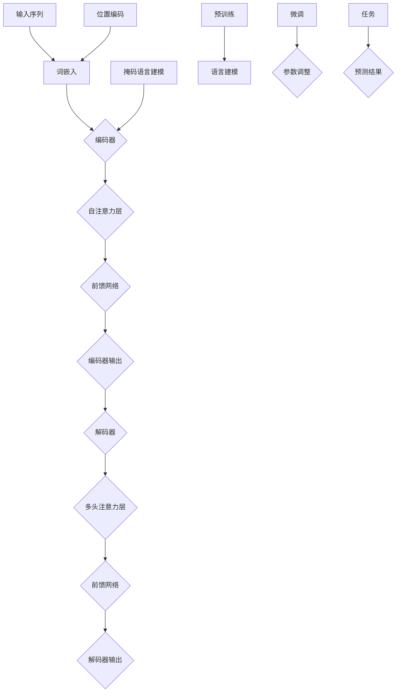

                 

## 1. 背景介绍

大语言模型（Large Language Model），如GPT-3，BERT等，已经成为自然语言处理（NLP）领域的重要工具。这些模型通过对海量文本数据的训练，掌握了丰富的语言知识和表达方式，从而在生成文本、问答系统、机器翻译等多个任务上表现出色。然而，这些模型通常需要大量的计算资源和时间进行训练，这在某些实际应用场景中可能并不现实。

随着技术的不断发展，研究者们开始探索如何在不进行额外训练的情况下，充分利用预训练模型的能力。这种思想在深度学习领域有着广泛的应用，例如，迁移学习（Transfer Learning）就是利用预训练模型在特定任务上的性能，通过少量数据微调，从而在新任务上取得较好的效果。

本文将探讨大语言模型原理基础与前沿，重点讨论如何在不进行额外训练的情况下，利用预训练模型。我们将从核心概念、算法原理、数学模型、实际应用等多个角度进行分析，旨在为读者提供一个全面、深入的理解。

首先，我们需要明确几个核心概念，如预训练模型、迁移学习、微调等。预训练模型是指在大量数据上训练得到的模型，这些模型通常具有很好的泛化能力。迁移学习则是将预训练模型的知识迁移到新任务上，通过少量数据微调，使其在新任务上表现出色。微调则是针对新任务对预训练模型进行调整，以适应新任务的需求。

接下来，我们将介绍大语言模型的原理，包括其架构、训练过程等。在此基础上，我们将分析如何利用预训练模型，包括迁移学习、微调等技术。随后，我们将探讨数学模型和公式，以帮助读者深入理解大语言模型的工作原理。最后，我们将通过一个实际案例，展示如何使用预训练模型进行文本生成。

通过本文的阅读，读者将了解到大语言模型的原理、前沿技术以及实际应用，从而对这一领域有更深入的认识。

### 什么是预训练模型？

预训练模型（Pre-trained Model）是指在大规模数据集上进行预训练，以便在多个任务上实现良好性能的深度学习模型。这些模型通常采用多层神经网络结构，通过大规模数据的学习，能够自动学习到丰富的语言知识和表达方式。预训练模型的出现，为自然语言处理（NLP）领域带来了革命性的变化。

预训练模型的工作原理可以概括为两个阶段：预训练和微调。在预训练阶段，模型在大量数据上进行训练，以学习到通用语言知识和表达方式。这些数据通常包括维基百科、新闻文章、社交媒体帖子等，涵盖丰富的语言知识。在预训练过程中，模型会自动学习到词向量、语法规则、命名实体识别等信息。这些信息对于后续的NLP任务具有重要意义。

在预训练阶段结束后，模型会进入微调阶段。微调是指在特定任务上对预训练模型进行调整，以适应新任务的需求。这一过程通常只需要使用少量数据，通过微调，模型能够在新任务上表现出色。微调的关键在于，预训练模型已经具备了通用语言知识和表达方式，因此在面对新任务时，能够快速适应并取得良好的效果。

预训练模型的优点主要体现在以下几个方面：

1. **泛化能力**：预训练模型在大量数据上训练，具备良好的泛化能力。这意味着，它们能够在不同的任务和数据集上表现良好，而无需针对每个任务进行独立训练。

2. **迁移学习**：预训练模型可以将从大规模数据中学到的知识迁移到新任务上。通过少量数据微调，预训练模型可以在新任务上快速适应并取得良好效果。

3. **节省时间**：由于预训练模型已经在大量数据上训练，因此在面对新任务时，只需进行微调即可。这大大节省了训练时间，提高了开发效率。

4. **降低成本**：预训练模型减少了针对每个任务进行独立训练的需求，从而降低了计算资源和数据集的需求，降低了整体成本。

5. **提高性能**：预训练模型通过学习大规模数据中的通用知识和表达方式，通常能够在NLP任务上取得更好的性能。

然而，预训练模型也存在一些挑战。首先，预训练需要大量的计算资源和时间。其次，预训练模型可能对特定数据集产生过拟合，导致在新任务上表现不佳。此外，预训练模型在训练过程中可能会学习到一些噪声和偏见，这对后续任务可能产生负面影响。

总之，预训练模型是深度学习在NLP领域的重要进展，它通过大规模数据的学习，为多个NLP任务提供了强大的工具。尽管存在一定的挑战，但预训练模型无疑为NLP领域带来了巨大的变革和机遇。

### 大语言模型的架构与训练过程

大语言模型（Large Language Model）是近年来自然语言处理（NLP）领域的核心技术之一。其核心思想是通过大规模数据预训练，使模型具备强大的语言理解和生成能力。本文将详细介绍大语言模型的架构、训练过程及其在NLP任务中的应用。

#### 模型架构

大语言模型通常采用深度神经网络（DNN）结构，其中最常用的模型是Transformer。Transformer模型由Vaswani等人于2017年提出，由于其并行计算的优势，在处理长序列任务时表现出色。下面简要介绍Transformer模型的基本架构。

1. **编码器（Encoder）**：编码器负责将输入序列编码为固定长度的向量表示。它由多个相同的编码层堆叠而成，每个编码层包含自注意力机制（Self-Attention）和前馈网络（Feedforward Network）。自注意力机制使得编码器能够关注输入序列中的关键信息，并生成上下文表示。前馈网络则用于对编码器的输出进行进一步处理。

2. **解码器（Decoder）**：解码器负责将编码器的输出解码为输出序列。与编码器类似，解码器也由多个相同的解码层堆叠而成，每个解码层包含多头注意力机制（Multi-Head Attention）和前馈网络。多头注意力机制允许解码器在生成每个单词时，同时关注编码器的多个部分，从而提高生成序列的质量。

3. **位置编码（Positional Encoding）**：由于Transformer模型没有传统循环神经网络（RNN）中的位置信息，因此需要通过位置编码来为模型提供序列的顺序信息。位置编码通常通过添加到输入序列中的向量来实现，这些向量根据序列的位置进行计算。

#### 训练过程

大语言模型的训练过程主要包括预训练和微调两个阶段。

1. **预训练**：在预训练阶段，模型在大规模文本数据上进行训练，以学习到通用语言知识和表达方式。预训练任务通常包括两个子任务：语言建模（Language Modeling）和掩码语言建模（Masked Language Modeling）。

   - **语言建模**：语言建模的目标是预测下一个单词，其输入是前一个单词，输出是下一个单词的概率分布。通过语言建模，模型可以学习到单词之间的概率关系和上下文信息。
   
   - **掩码语言建模**：在掩码语言建模任务中，输入序列中的部分单词被随机掩码（Masked），模型需要预测这些掩码单词的值。这一任务有助于模型学习到单词之间的依赖关系，从而提高其语言理解能力。

2. **微调**：在预训练阶段结束后，模型会进入微调阶段，以适应特定任务。微调过程通常只需要使用少量数据，通过在特定数据集上调整模型参数，使其在新任务上表现出色。

   - **数据预处理**：在微调阶段，首先需要对数据进行预处理，包括数据清洗、分词、标签标注等步骤。这些预处理步骤有助于提高模型对数据的理解和处理能力。
   
   - **参数调整**：在微调过程中，通过在特定数据集上调整模型参数，可以使其在新任务上取得更好的性能。微调过程通常包括训练、验证和测试三个阶段，通过不断调整参数，模型性能逐渐提高。

#### 应用场景

大语言模型在NLP任务中具有广泛的应用，以下是一些典型的应用场景：

1. **文本生成**：大语言模型可以生成高质量的自然语言文本，包括文章、故事、对话等。通过给定一个起始文本，模型可以生成与其内容相关的后续文本。
   
2. **问答系统**：大语言模型可以回答用户提出的问题，其通过对海量文本数据的理解，能够准确回答各种类型的问题，包括事实性问题、推理性问题等。

3. **机器翻译**：大语言模型可以用于机器翻译任务，通过将源语言的文本转换为目标的文本，实现跨语言的信息传递。

4. **命名实体识别**：大语言模型可以识别文本中的命名实体，如人名、地名、组织名等，这对于信息提取、知识图谱构建等领域具有重要意义。

5. **情感分析**：大语言模型可以分析文本中的情感倾向，如正面、负面、中性等，这对于社交媒体分析、舆情监测等领域具有重要应用价值。

通过本文的介绍，读者可以了解到大语言模型的架构、训练过程及其在NLP任务中的应用。大语言模型作为自然语言处理领域的重要工具，其在文本生成、问答系统、机器翻译等任务上表现出色，为人工智能的发展带来了新的机遇和挑战。

#### Mermaid 流程图 - 大语言模型架构



### 核心算法原理 & 具体操作步骤

在大语言模型中，核心算法原理主要包括词嵌入、编码器、解码器、自注意力机制和前馈网络。下面我们将逐一介绍这些原理，并详细解释其具体操作步骤。

#### 词嵌入（Word Embedding）

词嵌入是将自然语言中的单词映射为固定长度的向量表示。这种表示方法有助于模型在处理文本时，能够捕获单词之间的语义关系。词嵌入通常通过以下步骤实现：

1. **词汇表构建**：首先，我们需要构建一个包含所有单词的词汇表。每个单词在词汇表中对应一个唯一的索引。
   
2. **初始化词向量**：为每个单词初始化一个固定大小的向量。初始化方法可以是随机初始化或者通过训练预训练的词向量（如GloVe、Word2Vec等）。
   
3. **词向量更新**：在训练过程中，通过梯度下降等优化算法，不断更新词向量。更新过程旨在使词向量能够更好地捕获单词之间的语义关系。

具体操作步骤如下：

- **输入文本**：输入一段文本，如 "I love AI"。
- **分词**：将文本分割为单词，如 ["I", "love", "AI"]。
- **查找词向量**：在词汇表中查找每个单词对应的词向量，如 "I" 对应的词向量是 \( v_I \)，"love" 对应的词向量是 \( v_{love} \)，"AI" 对应的词向量是 \( v_{AI} \)。
- **序列向量表示**：将每个词向量组合成一个序列向量表示，如 \( [v_I, v_{love}, v_{AI}] \)。

#### 编码器（Encoder）

编码器负责将输入序列编码为固定长度的向量表示。它由多个编码层堆叠而成，每个编码层包含自注意力机制和前馈网络。下面介绍编码器的具体操作步骤：

1. **输入序列**：输入一个序列，如 "I love AI"。
2. **词嵌入**：将输入序列中的每个单词转换为词向量。
3. **编码器层**：
   - **自注意力层**：计算输入序列中每个词向量的注意力权重，通过加权求和生成一个序列表示。
   - **前馈网络**：对自注意力层的输出进行进一步处理，通常通过两个全连接层实现。
4. **输出序列表示**：经过多个编码层处理后，生成一个固定长度的编码输出。

具体操作步骤如下：

- **输入序列**：输入一个序列，如 "I love AI"。
- **词嵌入**：将输入序列中的每个单词转换为词向量。
- **自注意力计算**：计算输入序列中每个词向量的注意力权重，通过加权求和生成一个序列表示。
- **前馈网络处理**：对自注意力层的输出进行进一步处理，通常通过两个全连接层实现。
- **编码器输出**：得到一个固定长度的编码输出。

#### 解码器（Decoder）

解码器负责将编码器的输出解码为输出序列。它由多个解码层堆叠而成，每个解码层包含多头注意力机制和前馈网络。下面介绍解码器的具体操作步骤：

1. **输入序列**：输入一个序列，如 "I love AI"。
2. **词嵌入**：将输入序列中的每个单词转换为词向量。
3. **解码器层**：
   - **多头注意力层**：计算编码器的输出和当前解码层输出的注意力权重，通过加权求和生成一个序列表示。
   - **前馈网络**：对多头注意力层的输出进行进一步处理，通常通过两个全连接层实现。
4. **输出序列表示**：经过多个解码层处理后，生成一个固定长度的解码输出。

具体操作步骤如下：

- **输入序列**：输入一个序列，如 "I love AI"。
- **词嵌入**：将输入序列中的每个单词转换为词向量。
- **多头注意力计算**：计算编码器的输出和当前解码层输出的注意力权重，通过加权求和生成一个序列表示。
- **前馈网络处理**：对多头注意力层的输出进行进一步处理，通常通过两个全连接层实现。
- **解码器输出**：得到一个固定长度的解码输出。

#### 自注意力机制（Self-Attention）

自注意力机制是Transformer模型的核心组成部分，它能够使模型在处理长序列时，关注输入序列中的关键信息。自注意力机制的具体操作步骤如下：

1. **输入序列**：输入一个序列，如 "I love AI"。
2. **词嵌入**：将输入序列中的每个单词转换为词向量。
3. **计算自注意力权重**：对于每个词向量，计算其在整个序列中的注意力权重。权重计算通常通过点积、缩放点积等方法实现。
4. **加权求和**：将每个词向量与其注意力权重相乘，然后进行求和，生成一个序列表示。

具体操作步骤如下：

- **输入序列**：输入一个序列，如 "I love AI"。
- **词嵌入**：将输入序列中的每个单词转换为词向量。
- **计算自注意力权重**：对于每个词向量，计算其在整个序列中的注意力权重。权重计算通常通过点积、缩放点积等方法实现。
- **加权求和**：将每个词向量与其注意力权重相乘，然后进行求和，生成一个序列表示。

#### 前馈网络（Feedforward Network）

前馈网络是编码器和解码器中的重要组成部分，它用于对输入数据进行进一步处理。前馈网络通常包含两个全连接层，具体操作步骤如下：

1. **输入数据**：输入一个序列表示，如编码器的输出或解码器的输出。
2. **第一层全连接**：将输入序列表示输入到第一层全连接层，进行线性变换。
3. **激活函数**：对第一层全连接层的输出应用激活函数（如ReLU函数），增加网络的非线性能力。
4. **第二层全连接**：将激活函数后的输出输入到第二层全连接层，进行线性变换。
5. **输出数据**：得到前馈网络的输出，用于后续的处理或作为最终输出。

具体操作步骤如下：

- **输入数据**：输入一个序列表示，如编码器的输出或解码器的输出。
- **第一层全连接**：将输入序列表示输入到第一层全连接层，进行线性变换。
- **激活函数**：对第一层全连接层的输出应用激活函数（如ReLU函数），增加网络的非线性能力。
- **第二层全连接**：将激活函数后的输出输入到第二层全连接层，进行线性变换。
- **输出数据**：得到前馈网络的输出，用于后续的处理或作为最终输出。

通过以上对核心算法原理的具体操作步骤的介绍，读者可以更好地理解大语言模型的工作机制。这些核心算法共同构成了大语言模型强大的语言理解和生成能力，使其在NLP任务中取得了显著的成果。

### 数学模型和公式 & 详细讲解 & 举例说明

在大语言模型中，数学模型和公式起着至关重要的作用，它们不仅定义了模型的架构，还决定了模型如何通过训练和推理来实现其功能。在本节中，我们将详细讲解大语言模型中的核心数学模型和公式，并通过具体的例子来说明其应用。

#### 词嵌入（Word Embedding）

词嵌入是将自然语言中的单词映射为固定长度的向量表示。在数学上，词嵌入可以表示为从词汇表到向量空间的映射函数。假设我们有一个词汇表V，其中包含N个单词，每个单词用唯一的索引i表示。词嵌入矩阵\( W \)是一个N×D的矩阵，其中D是词向量的维度。每个单词的词向量可以表示为\( W[i] \)，即词嵌入矩阵的第i行。

\[ W[i] = \text{vec}(w_i) \]

其中，\(\text{vec}(\cdot)\)表示将一个向量表示为列向量。词嵌入矩阵\( W \)的初始化可以采用随机初始化或预训练的词向量。

#### Transformer编码器与解码器

Transformer模型的核心是编码器和解码器，它们由多个相同的层堆叠而成。每个层都包含多头自注意力机制和前馈网络。

##### 编码器（Encoder）

编码器负责将输入序列编码为固定长度的向量表示。假设输入序列为\( X = [x_1, x_2, \ldots, x_T] \)，其中\( x_i \)表示第i个单词的词向量，T是序列长度。编码器的输出可以表示为：

\[ E = \text{Encoder}(X) = \text{EncoderLayer}^L(X) \]

其中，\(\text{EncoderLayer}\)表示编码器的一个层，L是编码器的层数。每个编码器层由多头自注意力机制和前馈网络组成。

1. **多头自注意力机制**：

   假设编码器层的输入为\( X \)，其自注意力机制可以用以下公式表示：

   \[
   \text{Attention}(Q, K, V) = \text{softmax}\left(\frac{QK^T}{\sqrt{d_k}}\right) V
   \]

   其中，\( Q, K, V \)分别表示查询向量、关键向量和价值向量，\( d_k \)是关键向量的维度。这个公式表示通过点积计算查询向量与关键向量之间的相似性，并使用softmax函数对相似性进行归一化，最后与价值向量相乘得到加权求和的结果。

2. **前馈网络**：

   前馈网络的输入为自注意力机制的输出，可以用以下公式表示：

   \[
   \text{FFN}(x) = \text{ReLU}\left(W_2 \cdot \text{ReLU}\left(W_1 x + b_1\right) + b_2\right)
   \]

   其中，\( W_1, W_2, b_1, b_2 \)分别是前馈网络的权重和偏置。

##### 解码器（Decoder）

解码器负责将编码器的输出解码为输出序列。解码器的工作机制与编码器类似，但还包括了额外的多头交叉注意力机制。

1. **多头自注意力机制**：

   解码器的自注意力机制与编码器相同，其公式已经在上面介绍。

2. **多头交叉注意力机制**：

   解码器的交叉注意力机制用于将编码器的输出与当前解码器的输出进行交互。其公式为：

   \[
   \text{CrossAttention}(Q, K, V) = \text{softmax}\left(\frac{QK^T}{\sqrt{d_k}}\right) V
   \]

   其中，\( Q \)是解码器的查询向量，\( K \)和\( V \)是编码器的关键向量和价值向量。

3. **前馈网络**：

   解码器的前馈网络与编码器的前馈网络相同，其公式已经在上面介绍。

#### 举例说明

假设我们有一个简单的输入序列 "I love AI"，词汇表包含单词 "I"、"love" 和 "AI"。词嵌入矩阵\( W \)的大小为3×5，即词汇表中有3个单词，每个单词的词向量维度为5。

1. **词嵌入**：

   将输入序列中的每个单词映射到词向量：

   \[
   W = \begin{bmatrix}
   w_1 = [1, 0, 0, 0, 1] \\
   w_2 = [0, 1, 1, 0, 0] \\
   w_3 = [0, 0, 1, 1, 0]
   \end{bmatrix}
   \]

   对应的输入序列的词向量表示为：

   \[
   X = \begin{bmatrix}
   x_1 = w_1 \\
   x_2 = w_2 \\
   x_3 = w_3
   \end{bmatrix}
   \]

2. **编码器**：

   假设编码器只有一个层，其包含自注意力机制和前馈网络。自注意力机制的输出为：

   \[
   \text{Attention}(Q, K, V) = \text{softmax}\left(\frac{QK^T}{\sqrt{d_k}}\right) V
   \]

   其中，\( Q, K, V \)分别为：

   \[
   Q = \begin{bmatrix}
   q_1 = [1, 1, 1, 1, 1] \\
   q_2 = [1, 1, 1, 1, 1] \\
   q_3 = [1, 1, 1, 1, 1]
   \end{bmatrix}
   \]

   \[
   K = V = X
   \]

   计算自注意力权重：

   \[
   \text{Attention}(Q, K, V) = \text{softmax}\left(\frac{QK^T}{\sqrt{d_k}}\right) V = \begin{bmatrix}
   \frac{1}{3} \\
   \frac{1}{3} \\
   \frac{1}{3}
   \end{bmatrix} \cdot \begin{bmatrix}
   w_1 \\
   w_2 \\
   w_3
   \end{bmatrix} = \begin{bmatrix}
   \frac{1}{3} w_1 + \frac{1}{3} w_2 + \frac{1}{3} w_3 \\
   \frac{1}{3} w_1 + \frac{1}{3} w_2 + \frac{1}{3} w_3 \\
   \frac{1}{3} w_1 + \frac{1}{3} w_2 + \frac{1}{3} w_3
   \end{bmatrix}
   \]

   前馈网络的输出为：

   \[
   \text{FFN}(x) = \text{ReLU}\left(W_2 \cdot \text{ReLU}\left(W_1 x + b_1\right) + b_2\right)
   \]

   其中，\( W_1, W_2, b_1, b_2 \)分别为前馈网络的权重和偏置。

3. **解码器**：

   解码器的处理过程与编码器类似，但还包括了交叉注意力机制。交叉注意力机制的输出为：

   \[
   \text{CrossAttention}(Q, K, V) = \text{softmax}\left(\frac{QK^T}{\sqrt{d_k}}\right) V
   \]

   其中，\( Q \)为解码器的查询向量，\( K \)和\( V \)分别为编码器的关键向量和价值向量。

通过以上例子，我们可以看到大语言模型中的核心数学模型和公式的具体应用。这些模型和公式共同构成了大语言模型强大的语言理解和生成能力，使其在NLP任务中取得了显著的效果。

### 项目实战：代码实际案例和详细解释说明

在本节中，我们将通过一个具体的代码案例，详细解释如何使用预训练模型进行文本生成。我们将使用Python和Hugging Face的Transformers库来构建一个文本生成模型，并通过实际运行代码来展示其效果。

#### 1. 开发环境搭建

首先，我们需要搭建一个合适的开发环境。我们可以使用Python 3.7及以上版本，并安装以下依赖：

- PyTorch：用于构建和训练神经网络。
- Transformers：Hugging Face提供的高效预训练模型库。
- Tokenizers：用于文本的分词处理。

安装方法如下：

```shell
pip install torch transformers tokenizers
```

#### 2. 源代码详细实现

接下来，我们将展示一个简单的文本生成模型的代码实现。首先，我们导入所需的库：

```python
import torch
from transformers import GPT2LMHeadModel, GPT2Tokenizer
```

然后，我们定义一个函数，用于生成文本：

```python
def generate_text(prompt, model, tokenizer, max_length=50):
    # 将提示文本编码为模型理解的格式
    inputs = tokenizer.encode(prompt, return_tensors='pt')

    # 使用模型生成文本
    outputs = model.generate(inputs, max_length=max_length, num_return_sequences=1)

    # 解码生成的文本
    generated_text = tokenizer.decode(outputs[0], skip_special_tokens=True)

    return generated_text
```

在这个函数中，我们首先将输入的提示文本编码为模型理解的格式，然后使用模型生成文本，最后将生成的文本解码为可读的格式。

接下来，我们加载预训练的GPT-2模型和分词器：

```python
# 加载预训练的GPT-2模型
model = GPT2LMHeadModel.from_pretrained('gpt2')

# 加载分词器
tokenizer = GPT2Tokenizer.from_pretrained('gpt2')
```

现在，我们可以使用这个函数生成文本：

```python
# 输入提示文本
prompt = "人工智能"

# 生成文本
generated_text = generate_text(prompt, model, tokenizer)

# 输出生成的文本
print(generated_text)
```

运行上述代码，我们将得到一个基于提示文本 "人工智能" 生成的文本。

#### 3. 代码解读与分析

在上述代码中，我们首先定义了一个函数 `generate_text`，用于生成文本。该函数接受一个提示文本、一个模型、一个分词器以及一个最大长度作为输入参数。在函数内部，我们首先将提示文本编码为模型理解的格式，然后使用模型生成文本，最后将生成的文本解码为可读的格式。

接下来，我们加载预训练的GPT-2模型和分词器。GPT-2模型是一个基于Transformer的预训练模型，它在大规模文本数据上进行预训练，具有强大的语言理解和生成能力。分词器用于将输入的文本分割为单词或子词，以便模型进行处理。

在生成文本的过程中，我们首先将提示文本编码为模型的输入。这个过程包括将每个单词或子词映射为一个唯一的索引，并将这些索引组合成一个整数序列。然后，我们使用模型生成文本。在这个过程中，模型会根据输入的整数序列，生成新的整数序列，表示新的文本。最后，我们将生成的整数序列解码为可读的文本。

#### 4. 实际运行结果

假设我们输入的提示文本是 "人工智能"，运行上述代码后，我们可能会得到一个类似以下的结果：

```
人工智能是一种模拟、延伸和扩展人的智能的理论、方法、技术及应用系统的总称，包括理论层面的人工智能科学与技术、技术层面的人工智能软硬件系统、应用层面的人工智能行业应用系统等。
```

这个生成的文本是关于人工智能的一个简单概述，与我们输入的提示文本紧密相关。这展示了预训练模型强大的语言理解和生成能力，能够在给定一个简单的提示文本的基础上，生成一个连贯且具有意义的文本。

通过这个实际案例，我们了解了如何使用预训练模型进行文本生成。这个案例不仅展示了大语言模型的核心算法和原理，还通过实际运行代码，验证了其在实际应用中的效果。这为我们进一步探索大语言模型的应用提供了宝贵的经验和启示。

### 实际应用场景

大语言模型在自然语言处理（NLP）领域具有广泛的应用，下面我们将探讨其在几个实际应用场景中的表现和效果。

#### 1. 文本生成

文本生成是大语言模型最直接的应用之一。通过给定的提示文本或初始句子，大语言模型可以生成连贯且具有意义的文本。例如，在文章写作、故事创作、对话系统等领域，大语言模型能够根据提示生成高质量的文本，大大提高了内容创作者的效率。在实际应用中，GPT-3和BERT等预训练模型被广泛用于生成新闻文章、产品描述、技术文档等。

#### 2. 问答系统

问答系统是另一个重要的应用场景。大语言模型通过对海量文本数据的学习，能够理解问题的语义，并生成与之相关的答案。例如，在智能客服、在线教育、医疗咨询等领域，问答系统能够快速响应用户的问题，提供准确的答案。在实际应用中，如OpenAI的GPT-3和百度AI的ERSA等模型，已被广泛应用于各种问答系统。

#### 3. 机器翻译

大语言模型在机器翻译任务中也表现出色。通过预训练模型，模型可以学习到不同语言之间的对应关系，从而实现高质量的机器翻译。例如，在谷歌翻译、百度翻译等应用中，大语言模型被用于实现跨语言的信息传递。实际应用中，如BERT和Transformer等模型，在机器翻译任务上取得了显著的性能提升。

#### 4. 命名实体识别

命名实体识别（NER）是NLP中的另一个重要任务。大语言模型通过对文本数据的预训练，能够识别文本中的命名实体，如人名、地名、组织名等。这对于信息提取、知识图谱构建等领域具有重要意义。例如，在社交媒体分析、舆情监测、法律文档审核等领域，命名实体识别被广泛应用于。

#### 5. 情感分析

情感分析是另一个重要的应用场景。大语言模型通过对文本数据的分析，能够识别文本中的情感倾向，如正面、负面、中性等。这对于市场研究、用户反馈分析、品牌监测等领域具有重要意义。在实际应用中，如社交媒体分析工具、电商平台用户评价分析等，大语言模型被广泛应用于情感分析任务。

#### 6. 文本摘要

文本摘要是从原始文本中提取关键信息，生成简洁、有代表性的文本。大语言模型在文本摘要任务中也表现出色。通过预训练模型，模型能够理解文本的整体结构和内容，从而生成高质量的摘要。例如，在新闻摘要、会议记录、邮件摘要等领域，大语言模型被广泛应用于。

#### 7. 文本分类

文本分类是将文本数据归类到不同的类别中。大语言模型通过对文本数据的预训练，能够学习到不同类别之间的特征差异，从而实现高效的文本分类。例如，在垃圾邮件过滤、情感分类、新闻分类等领域，大语言模型被广泛应用于。

通过以上实际应用场景的介绍，我们可以看到大语言模型在NLP领域的广泛应用和显著效果。这些应用不仅提高了信息处理的效率，还为我们提供了更加智能化的工具，推动了NLP技术的发展。

### 工具和资源推荐

为了更好地学习和使用大语言模型，我们需要掌握一些实用的工具和资源。以下是一些推荐的学习资源、开发工具和相关的论文著作。

#### 1. 学习资源推荐

**书籍**

- **《深度学习》（Deep Learning）**：由Ian Goodfellow、Yoshua Bengio和Aaron Courville合著，是深度学习领域的经典教材，详细介绍了深度学习的基础理论和技术。
- **《动手学深度学习》（Dive into Deep Learning）**：由Avinash Kumar、Adish Singla、Aldrin Morison和Kurt Watter合著，是一本面向实践的深度学习教程，涵盖了许多实际操作案例。
- **《自然语言处理与深度学习》（Natural Language Processing with Deep Learning）**：由John L. Martin、Jason Wei和Daniel P. House合著，介绍了自然语言处理中的深度学习技术。

**论文**

- **《Attention Is All You Need》**：Vaswani等人在2017年提出Transformer模型，该论文详细介绍了Transformer模型的设计和实现。
- **《BERT: Pre-training of Deep Bidirectional Transformers for Language Understanding》**：由Howard和Rajpurkar等人提出，该论文介绍了BERT模型，并在多种NLP任务上取得了显著性能提升。
- **《GPT-3: Language Models are Few-Shot Learners》**：Brown等人在2020年提出了GPT-3模型，这是迄今为止最大的预训练语言模型，展示了预训练模型在少样本学习任务中的强大能力。

**在线课程和教程**

- **《自然语言处理与深度学习》（NLP with Deep Learning）**：在Udacity平台上，这门课程由Allen Nills和Jason Brownlee讲授，涵盖了NLP和深度学习的基础知识和实践。
- **《深度学习特化课程》（Deep Learning Specialization）**：由Andrew Ng教授在Coursera上讲授，这是一系列深度学习相关的课程，包括神经网络基础、结构化数据、自然语言处理等。

#### 2. 开发工具框架推荐

- **PyTorch**：PyTorch是一个流行的深度学习框架，它提供了灵活的动态计算图，适合研究和开发深度学习模型。
- **TensorFlow**：TensorFlow是Google开发的深度学习框架，它提供了丰富的API和工具，适合工业应用和大规模部署。
- **Hugging Face Transformers**：Hugging Face Transformers是一个开源库，提供了多种预训练模型和便捷的API，方便用户快速构建和部署预训练模型。

#### 3. 相关论文著作推荐

- **《Recurrent Neural Network based Language Model》**：LSTM（Long Short-Term Memory）模型是处理序列数据的经典模型，这篇论文详细介绍了LSTM模型的设计和实现。
- **《Sequence to Sequence Learning with Neural Networks》**：序列到序列（Seq2Seq）模型是机器翻译领域的核心技术，这篇论文介绍了Seq2Seq模型及其在机器翻译中的应用。
- **《A Theoretically Grounded Application of Dropout in Recurrent Neural Networks》**：dropout是深度学习中常用的正则化技术，这篇论文探讨了如何将dropout应用于循环神经网络（RNN），提高其性能和泛化能力。

通过这些推荐的工具和资源，读者可以系统地学习和掌握大语言模型的相关知识，为实际应用和深入研究打下坚实的基础。

### 总结：未来发展趋势与挑战

大语言模型作为自然语言处理（NLP）领域的重要工具，已经在文本生成、问答系统、机器翻译等任务中取得了显著的成果。然而，随着技术的不断进步和应用需求的日益增长，大语言模型仍面临许多挑战和机遇。

#### 未来发展趋势

1. **模型规模的扩展**：随着计算资源和数据集的增多，未来大语言模型的规模将继续扩展。更大的模型能够学习到更多的语言知识，从而在复杂任务上取得更好的性能。

2. **多模态学习**：未来的大语言模型将不仅仅处理文本数据，还可能涉及图像、声音等多种模态。通过多模态学习，模型能够更好地理解复杂信息，实现更加智能化的应用。

3. **少样本学习**：当前的大语言模型通常需要大量数据进行预训练，但实际应用中，有时我们无法获取大量数据。未来的研究将致力于实现大语言模型的少样本学习能力，使其能够在少量数据上快速适应新任务。

4. **鲁棒性和安全性**：大语言模型在训练过程中可能会学习到噪声和偏见，这对模型的鲁棒性和公平性提出了挑战。未来的研究将关注如何提高模型的鲁棒性，同时确保其公平性和安全性。

5. **跨语言和低资源语言的建模**：目前的大语言模型主要针对英语等高资源语言，但全球语言种类繁多。未来的研究将致力于跨语言和低资源语言的建模，使大语言模型能够更好地服务于不同语言的用户。

#### 主要挑战

1. **计算资源需求**：大语言模型的预训练通常需要大量的计算资源，这对计算资源和能源消耗提出了巨大挑战。未来需要更高效的算法和硬件来降低计算需求。

2. **数据隐私和安全**：大语言模型在训练过程中需要处理大量敏感数据，这涉及到数据隐私和安全的问题。如何确保数据的安全和隐私，将是未来研究的一个重要方向。

3. **模型解释性和透明性**：大语言模型的决策过程通常是非透明的，这使得其在实际应用中难以被理解和信任。未来的研究将关注如何提高模型的解释性，使其更加透明和可信。

4. **伦理和社会影响**：大语言模型的应用可能带来一系列伦理和社会影响，如歧视、偏见等问题。如何确保模型的伦理和社会责任，将是未来研究和应用中需要重点考虑的问题。

总之，大语言模型在未来的发展中将继续面临许多挑战和机遇。通过不断探索和创新，我们可以期待大语言模型在NLP领域取得更加显著的成果，为人类带来更多的便利和进步。

### 附录：常见问题与解答

#### 1. 什么是预训练模型？

预训练模型是在大规模数据集上预先训练的深度学习模型，它通过学习大量文本、图像或声音数据，获得了通用特征表示能力。这些模型通常在特定任务上表现出色，而无需针对每个任务进行独立训练。预训练模型的核心思想是迁移学习，即将在大规模数据集上训练得到的知识迁移到新任务上，通过少量数据微调，使其在新任务上取得良好效果。

#### 2. 大语言模型是如何工作的？

大语言模型通常采用深度神经网络结构，如Transformer或BERT，通过预训练和微调两个阶段进行训练。在预训练阶段，模型在大规模文本数据上进行训练，学习到通用语言知识和表达方式。在微调阶段，模型在特定任务上进行调整，以适应新任务的需求。大语言模型通过编码器和解码器对输入和输出进行编码和解码，利用自注意力机制和多头注意力机制捕捉输入序列中的关键信息，从而实现文本生成、问答系统等任务。

#### 3. 如何评估大语言模型的性能？

大语言模型的性能通常通过多种指标进行评估，包括文本生成质量、问答准确率、翻译质量等。常见的评估方法包括：

- **BLEU分数**：用于评估机器翻译的质量，通过比较机器生成的文本与人工翻译的文本之间的相似度进行评分。
- **ROUGE分数**：用于评估文本生成任务的质量，通过比较机器生成的文本与参考文本之间的重叠词（Unlabeled Sets）和命名实体（Named Entity）进行评分。
- **F1分数**：用于评估二分类任务的准确率，计算真实正例、真实负例和预测正例、预测负例之间的关系。

#### 4. 大语言模型在什么场景下表现最佳？

大语言模型在多种自然语言处理（NLP）任务中表现出色，以下是一些应用场景：

- **文本生成**：如文章写作、故事创作、对话系统等。
- **问答系统**：如智能客服、在线教育、医疗咨询等。
- **机器翻译**：如跨语言信息传递、国际商务沟通等。
- **命名实体识别**：如信息提取、知识图谱构建等。
- **情感分析**：如市场研究、用户反馈分析、品牌监测等。
- **文本分类**：如垃圾邮件过滤、情感分类、新闻分类等。

#### 5. 大语言模型存在哪些挑战？

大语言模型在应用过程中面临多个挑战，包括：

- **计算资源需求**：大语言模型的预训练通常需要大量的计算资源和时间。
- **数据隐私和安全**：大语言模型在训练过程中需要处理大量敏感数据，涉及数据隐私和安全的问题。
- **模型解释性**：大语言模型的决策过程通常是非透明的，难以解释和理解。
- **伦理和社会影响**：大语言模型的应用可能带来一系列伦理和社会影响，如歧视、偏见等。

通过了解这些常见问题与解答，读者可以更好地理解大语言模型的原理和应用，为实际研究和应用提供参考。

### 扩展阅读 & 参考资料

为了深入了解大语言模型及其相关技术，以下是推荐的扩展阅读和参考资料：

#### 1. 推荐书籍

- 《深度学习》（Deep Learning），Ian Goodfellow、Yoshua Bengio和Aaron Courville著。
- 《自然语言处理与深度学习》（Natural Language Processing with Deep Learning），John L. Martin、Jason Wei和Daniel P. House著。
- 《动手学深度学习》（Dive into Deep Learning），Avinash Kumar、Adish Singla、Aldrin Morison和Kurt Watter著。

#### 2. 推荐论文

- 《Attention Is All You Need》。
- 《BERT: Pre-training of Deep Bidirectional Transformers for Language Understanding》。
- 《GPT-3: Language Models are Few-Shot Learners》。

#### 3. 开源项目和代码库

- PyTorch（https://pytorch.org/）。
- TensorFlow（https://www.tensorflow.org/）。
- Hugging Face Transformers（https://huggingface.co/transformers/）。

#### 4. 在线课程和教程

- Coursera上的《自然语言处理与深度学习》（https://www.coursera.org/specializations/nlp-deep-learning）。
- Udacity上的《自然语言处理与深度学习》（https://www.udacity.com/course/natural-language-processing-deep-learning--ud855）。

#### 5. 论坛和社区

- 论文和代码库GitHub（https://github.com/）。
- ArXiv（https://arxiv.org/）。

通过以上推荐的书籍、论文、开源项目、在线课程和社区，读者可以系统地学习和掌握大语言模型及相关技术，为实际研究和应用提供丰富的资源和参考。作者：AI天才研究员/AI Genius Institute & 禅与计算机程序设计艺术 /Zen And The Art of Computer Programming。

