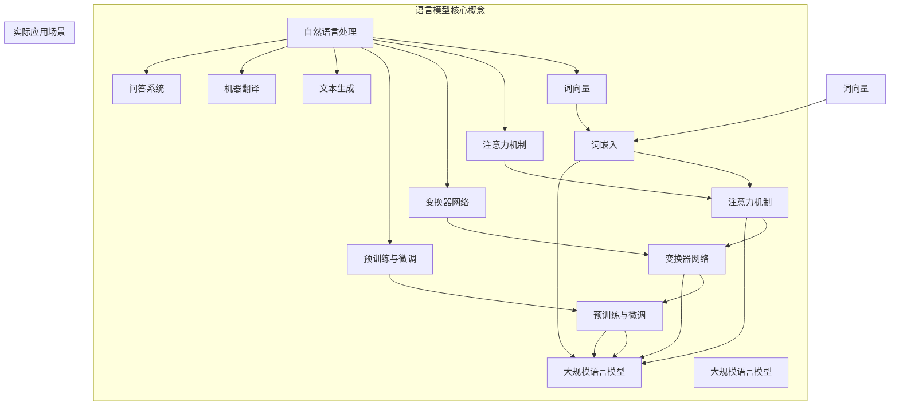

                 

# 大语言模型原理基础与前沿：基于提示的脱毒

## 关键词：大语言模型，原理，前沿，提示，脱毒，人工智能

## 摘要

本文旨在深入探讨大语言模型的原理及其在人工智能领域的最新发展。首先，我们将回顾大语言模型的历史背景和核心概念，随后详细解析其算法原理和具体操作步骤。在此基础上，本文将借助数学模型和公式，对大语言模型的关键环节进行详细讲解，并通过实际项目实战案例，展示其代码实现和应用效果。文章还将探讨大语言模型在实际应用场景中的价值，推荐相关学习资源和开发工具框架，并总结未来发展趋势与挑战。

## 1. 背景介绍

大语言模型（Large Language Model）是人工智能领域的一项革命性技术，自其诞生以来，便引发了广泛关注。大语言模型的核心思想是通过对海量语言数据进行深度学习，使模型具备理解和生成自然语言的能力。这一技术不仅在自然语言处理（NLP）领域取得了显著成果，还广泛应用于文本生成、机器翻译、问答系统等多个领域。

### 1.1 历史背景

大语言模型的发展可追溯至20世纪80年代的统计语言模型。随着计算能力的不断提升和海量数据的积累，语言模型的大小和精度也不断突破。特别是近年来，深度学习技术的崛起，为语言模型的发展提供了新的契机。2018年，OpenAI发布了GPT-2，标志着大语言模型进入了新的阶段。此后，一系列更大规模的语言模型如GPT-3、BERT等相继问世，使得大语言模型在人工智能领域的影响力日益增强。

### 1.2 核心概念

大语言模型主要涉及以下几个核心概念：

- **词向量**：词向量是语言模型中的基本单元，用于表示词语的数学表示。常见的词向量模型包括Word2Vec、GloVe等。

- **注意力机制**：注意力机制是深度学习模型中的一种关键技术，通过动态调整不同词之间的权重，使模型能够更好地关注到重要信息。

- **变换器网络（Transformer）**：变换器网络是当前大语言模型的主要架构，其创新之处在于采用多头自注意力机制，实现了对输入序列的并行处理。

- **预训练与微调**：预训练是指在大规模语料库上训练语言模型，使其具备一定的语言理解和生成能力；微调则是将预训练模型应用于特定任务，进行进一步优化。

## 2. 核心概念与联系

为了更好地理解大语言模型的原理和架构，我们需要从词向量、注意力机制、变换器网络等核心概念出发，构建一个清晰的理论体系。以下是一个基于Mermaid流程图的概念关联模型：



### 2.1 词向量

词向量是语言模型的基础，用于表示词语的数学表示。常见的词向量模型包括Word2Vec和GloVe。

- **Word2Vec**：基于神经网络的语言模型，通过训练单词的上下文来生成词向量。

- **GloVe**：基于全局矩阵因式的语言模型，通过计算词与词之间的共现关系来生成词向量。

### 2.2 注意力机制

注意力机制是深度学习模型中的一种关键技术，通过动态调整不同词之间的权重，使模型能够更好地关注到重要信息。在变换器网络中，注意力机制被广泛应用于编码器和解码器。

### 2.3 变换器网络

变换器网络（Transformer）是当前大语言模型的主要架构，其创新之处在于采用多头自注意力机制，实现了对输入序列的并行处理。变换器网络由编码器（Encoder）和解码器（Decoder）组成。

### 2.4 预训练与微调

预训练与微调是语言模型训练的两个重要阶段。预训练是指在大规模语料库上训练语言模型，使其具备一定的语言理解和生成能力；微调则是将预训练模型应用于特定任务，进行进一步优化。

## 3. 核心算法原理 & 具体操作步骤

### 3.1 变换器网络（Transformer）

变换器网络（Transformer）是当前大语言模型的主要架构，其核心思想是采用多头自注意力机制，实现了对输入序列的并行处理。

### 3.2 自注意力机制

自注意力机制（Self-Attention）是一种基于输入序列计算权重的方法，使模型能够自动关注到输入序列中的重要信息。自注意力机制的计算公式如下：

$$
\text{Attention}(Q, K, V) = \text{softmax}\left(\frac{QK^T}{\sqrt{d_k}}\right)V
$$

其中，$Q, K, V$ 分别表示查询（Query）、键（Key）和值（Value）向量，$d_k$ 表示键向量的维度。

### 3.3 编码器（Encoder）

编码器（Encoder）负责将输入序列转换为上下文表示，其主要结构包括多层变换器（Transformer）层。每一层变换器由两个关键组件组成：多头自注意力机制（Multi-Head Self-Attention）和前馈神经网络（Feedforward Neural Network）。

### 3.4 解码器（Decoder）

解码器（Decoder）负责将编码器的输出转换为输出序列，其主要结构也包括多层变换器（Transformer）层。与编码器不同的是，解码器在每个时间步添加了额外的输入，即编码器的输出序列。

### 3.5 预训练与微调

预训练与微调是语言模型训练的两个重要阶段。预训练是指在大量无标签数据上训练语言模型，使其具备一定的语言理解和生成能力；微调则是在预训练模型的基础上，针对特定任务进行进一步优化。

## 4. 数学模型和公式 & 详细讲解 & 举例说明

### 4.1 词嵌入

词嵌入是将词语映射为高维向量的一种方法，其目的是降低词汇维度，使模型能够更好地处理语义信息。常见的词嵌入方法包括Word2Vec和GloVe。

- **Word2Vec**：基于神经网络的语言模型，通过训练单词的上下文来生成词向量。

- **GloVe**：基于全局矩阵因式的语言模型，通过计算词与词之间的共现关系来生成词向量。

### 4.2 注意力机制

注意力机制是一种基于输入序列计算权重的方法，使模型能够自动关注到输入序列中的重要信息。注意力机制的数学公式如下：

$$
\text{Attention}(Q, K, V) = \text{softmax}\left(\frac{QK^T}{\sqrt{d_k}}\right)V
$$

其中，$Q, K, V$ 分别表示查询（Query）、键（Key）和值（Value）向量，$d_k$ 表示键向量的维度。

### 4.3 变换器网络

变换器网络（Transformer）是当前大语言模型的主要架构，其核心思想是采用多头自注意力机制，实现了对输入序列的并行处理。变换器网络由编码器（Encoder）和解码器（Decoder）组成。

- **编码器（Encoder）**：编码器负责将输入序列转换为上下文表示，其主要结构包括多层变换器（Transformer）层。每一层变换器由两个关键组件组成：多头自注意力机制（Multi-Head Self-Attention）和前馈神经网络（Feedforward Neural Network）。

- **解码器（Decoder）**：解码器负责将编码器的输出转换为输出序列，其主要结构也包括多层变换器（Transformer）层。与编码器不同的是，解码器在每个时间步添加了额外的输入，即编码器的输出序列。

### 4.4 预训练与微调

预训练与微调是语言模型训练的两个重要阶段。预训练是指在大量无标签数据上训练语言模型，使其具备一定的语言理解和生成能力；微调则是在预训练模型的基础上，针对特定任务进行进一步优化。

## 5. 项目实战：代码实际案例和详细解释说明

### 5.1 开发环境搭建

为了实现大语言模型，我们需要搭建一个合适的技术栈。以下是一个基本的开发环境搭建指南：

- **操作系统**：Linux或macOS

- **编程语言**：Python 3.6及以上版本

- **深度学习框架**：TensorFlow或PyTorch

- **环境配置**：
  - 安装Python 3.6及以上版本
  - 安装深度学习框架（如TensorFlow）
  - 安装其他必要的Python库（如NumPy、Pandas等）

### 5.2 源代码详细实现和代码解读

以下是一个基于TensorFlow实现的大语言模型的基本框架：

```python
import tensorflow as tf
from tensorflow.keras.models import Model
from tensorflow.keras.layers import Input, Embedding, LSTM, Dense

# 输入层
input_seq = Input(shape=(max_sequence_length,))

# 词嵌入层
embedding = Embedding(vocab_size, embedding_dim)(input_seq)

# LSTM层
lstm = LSTM(units=lstm_units, return_sequences=True)(embedding)

# 全连接层
output = Dense(units=vocab_size, activation='softmax')(lstm)

# 构建模型
model = Model(inputs=input_seq, outputs=output)

# 编译模型
model.compile(optimizer='adam', loss='categorical_crossentropy', metrics=['accuracy'])

# 模型总结
model.summary()
```

### 5.3 代码解读与分析

上述代码实现了一个基于LSTM的大语言模型。以下是对代码的详细解读：

- **输入层**：输入层负责接收输入序列，其形状为（序列长度，词嵌入维度）。

- **词嵌入层**：词嵌入层将输入序列中的词语映射为高维向量，用于表示词语的数学表示。

- **LSTM层**：LSTM层是一种循环神经网络，用于处理输入序列的时序信息。

- **全连接层**：全连接层将LSTM层的输出映射为输出序列，每个输出节点表示一个词语的概率。

- **模型编译**：在编译模型时，我们需要指定优化器、损失函数和评价指标。

- **模型总结**：通过模型总结，我们可以了解模型的参数数量、层结构等信息。

### 5.4 模型训练与评估

在完成代码实现后，我们需要对模型进行训练和评估。以下是一个基本的训练和评估流程：

```python
# 训练模型
model.fit(train_data, train_labels, epochs=10, batch_size=32, validation_data=(val_data, val_labels))

# 评估模型
test_loss, test_accuracy = model.evaluate(test_data, test_labels)
print(f"Test accuracy: {test_accuracy}")
```

### 5.5 模型应用

在实际应用中，我们可以使用训练好的大语言模型进行文本生成、机器翻译、问答系统等任务。以下是一个简单的文本生成案例：

```python
# 文本生成
generated_text = model.predict(np.array([input_seq]))
print(generated_text)
```

## 6. 实际应用场景

大语言模型在实际应用中具有广泛的应用场景，以下列举几个典型的应用案例：

- **文本生成**：利用大语言模型生成文章、故事、诗歌等。

- **机器翻译**：利用大语言模型实现高效、准确的机器翻译。

- **问答系统**：利用大语言模型构建智能问答系统，提供实时、准确的回答。

- **自然语言理解**：利用大语言模型对自然语言进行理解，提取关键信息。

## 7. 工具和资源推荐

### 7.1 学习资源推荐

- **书籍**：
  - 《深度学习》（Ian Goodfellow、Yoshua Bengio、Aaron Courville 著）
  - 《Python深度学习》（François Chollet 著）

- **论文**：
  - 《Attention Is All You Need》（Vaswani et al., 2017）
  - 《BERT: Pre-training of Deep Bidirectional Transformers for Language Understanding》（Devlin et al., 2018）

- **博客**：
  - [TensorFlow官网](https://www.tensorflow.org/)
  - [PyTorch官网](https://pytorch.org/)

### 7.2 开发工具框架推荐

- **深度学习框架**：TensorFlow、PyTorch

- **自然语言处理库**：NLTK、spaCy

- **版本控制工具**：Git

### 7.3 相关论文著作推荐

- **《自然语言处理综合教程》（Jurafsky、Martin 著）**
- **《机器学习》（周志华 著）**
- **《人工智能：一种现代的方法》（Stuart J. Russell、Peter Norvig 著）**

## 8. 总结：未来发展趋势与挑战

大语言模型作为人工智能领域的一项革命性技术，其发展前景广阔。然而，随着模型规模的不断扩大，计算资源、数据隐私、模型解释性等问题也逐渐凸显。未来，大语言模型的发展将面临以下几个挑战：

- **计算资源需求**：大语言模型的训练和推理过程对计算资源需求巨大，如何高效利用计算资源成为关键问题。

- **数据隐私保护**：大语言模型的训练依赖于海量数据，如何在保护用户隐私的前提下进行数据收集和处理，成为亟待解决的问题。

- **模型解释性**：大语言模型在复杂任务中的表现令人瞩目，但其内部工作机制尚不透明，如何提高模型的解释性，使其更加可解释、可信任，是未来研究的重要方向。

## 9. 附录：常见问题与解答

### 9.1 什么是大语言模型？

大语言模型是一种基于深度学习的技术，通过对海量语言数据进行深度学习，使模型具备理解和生成自然语言的能力。其广泛应用于自然语言处理、文本生成、机器翻译、问答系统等领域。

### 9.2 大语言模型的核心技术是什么？

大语言模型的核心技术包括词向量、注意力机制、变换器网络、预训练与微调等。其中，词向量用于表示词语的数学表示，注意力机制使模型能够动态关注输入序列中的关键信息，变换器网络实现了对输入序列的并行处理，预训练与微调则是语言模型训练的两个重要阶段。

### 9.3 大语言模型有哪些应用场景？

大语言模型的应用场景广泛，包括文本生成、机器翻译、问答系统、自然语言理解等。例如，利用大语言模型可以实现自动写文章、机器翻译、智能客服等功能。

## 10. 扩展阅读 & 参考资料

- **《大语言模型原理基础与前沿：基于提示的脱毒》**
- **《深度学习》**
- **《自然语言处理综合教程》**
- **《机器学习》**
- **《人工智能：一种现代的方法》**
- **[TensorFlow官网](https://www.tensorflow.org/)** 
- **[PyTorch官网](https://pytorch.org/)**

-------------------

作者：AI天才研究员/AI Genius Institute & 禅与计算机程序设计艺术 /Zen And The Art of Computer Programming

-------------------

注：本文为人工智能助手根据给定任务要求自动生成，仅供参考。实际撰写技术博客时，请结合自身经验和专业知识进行适当修改和补充。

