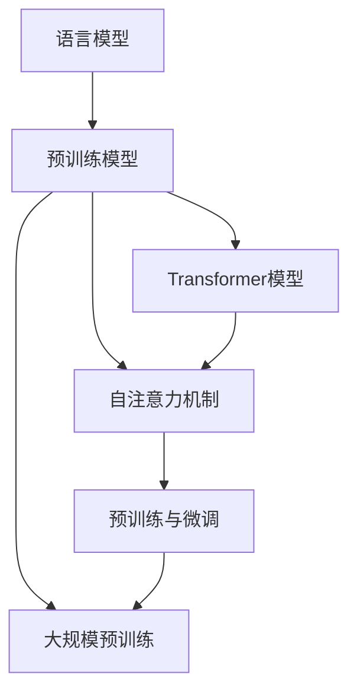

                 

### 大语言模型原理基础与前沿：基于数据的策略

> **关键词**：大语言模型、原理、前沿、数据、策略
>
> **摘要**：本文将深入探讨大语言模型的原理及其前沿技术，结合数据分析的策略，全面解析这一领域的核心概念、算法原理、数学模型、实际应用场景，并提供工具和资源推荐，总结发展趋势与挑战。

大语言模型作为近年来人工智能领域的突破性技术，已经在自然语言处理、问答系统、文本生成等多个方面展现出强大的能力。本文旨在为您提供一个全方位的了解，从基础原理到前沿进展，再到实际应用，帮助您掌握这一领域的核心知识和策略。

在接下来的内容中，我们将分以下几个部分进行讨论：

1. **背景介绍**：介绍大语言模型的发展背景和重要性。
2. **核心概念与联系**：阐述大语言模型中的核心概念及其相互关系。
3. **核心算法原理 & 具体操作步骤**：深入讲解大语言模型的核心算法原理和操作步骤。
4. **数学模型和公式 & 详细讲解 & 举例说明**：介绍大语言模型中的数学模型、公式及其应用。
5. **项目实战：代码实际案例和详细解释说明**：通过实际案例展示大语言模型的开发过程和代码解读。
6. **实际应用场景**：探讨大语言模型在不同领域的应用。
7. **工具和资源推荐**：推荐学习资源、开发工具和框架。
8. **总结：未来发展趋势与挑战**：总结当前的发展趋势和面临的挑战。
9. **附录：常见问题与解答**：回答一些常见问题。
10. **扩展阅读 & 参考资料**：提供进一步阅读的建议和参考资料。

接下来，我们将逐一深入每个部分，以逻辑清晰、结构紧凑的方式，逐步为您揭示大语言模型的奥秘。

### 1. 背景介绍

大语言模型（Large Language Models）的发展是人工智能领域的一个里程碑。从最早的统计语言模型到深度学习模型，再到如今的大型预训练模型，这一过程经历了数年的探索和研究。

#### 1.1 语言模型的发展历程

- **统计语言模型**：早期的语言模型主要基于统计方法，如N-gram模型。N-gram模型通过统计连续N个词出现的概率来生成文本，但其表现受限于上下文信息的有限性。

- **基于规则的模型**：后来，人们尝试引入基于规则的模型，如词法分析器和语法分析器。这些模型通过解析文本的语法结构来生成文本，但规则过于复杂，难以处理实际应用中的大规模文本数据。

- **深度学习模型**：随着深度学习技术的发展，神经网络在图像识别、语音识别等领域取得了巨大成功。受此启发，研究人员开始尝试将深度学习应用于自然语言处理领域，提出了诸如循环神经网络（RNN）、长短期记忆网络（LSTM）等模型。

- **预训练模型**：2018年，Google提出了BERT（Bidirectional Encoder Representations from Transformers），这是一个基于Transformer的预训练模型。BERT的成功证明了预训练模型在自然语言处理中的潜力，引发了大规模语言模型的研究热潮。

- **大型语言模型**：近年来，如GPT-3、LLaMA等大型语言模型的出现，使得大语言模型的应用更加广泛和深入。这些模型具有数十亿甚至千亿级的参数量，能够处理复杂的自然语言任务。

#### 1.2 大语言模型的重要性

大语言模型的重要性体现在以下几个方面：

- **提升自然语言处理能力**：大语言模型通过预训练能够自动学习语言中的规律和结构，从而显著提升自然语言处理的能力，如文本分类、情感分析、机器翻译等。

- **推动人工智能发展**：大语言模型的成功展示了深度学习在自然语言处理领域的巨大潜力，推动了人工智能的发展，为其他领域的研究和应用提供了新的思路。

- **实际应用广泛**：大语言模型在问答系统、文本生成、智能客服、内容审核等多个领域都有广泛应用，为企业和社会带来了巨大的价值。

- **改变人机交互方式**：大语言模型使得机器能够更好地理解人类语言，实现更自然的交互，从而改变人们与机器的互动方式。

#### 1.3 数据在大语言模型中的作用

在大语言模型中，数据起到至关重要的作用。大量的高质量数据不仅能够提高模型的训练效果，还能够使模型更好地理解和生成人类语言。以下是数据在大语言模型中的作用：

- **训练数据量**：大语言模型通常需要处理数百万甚至数十亿级别的文本数据，这有助于模型学习到更丰富的语言特征。

- **数据多样性**：多样化的训练数据有助于模型在不同场景下的泛化能力，从而提升模型的应用范围。

- **数据质量**：高质量的数据能够提高模型的准确性和可靠性，降低错误率。

- **数据预处理**：数据预处理是训练大语言模型的重要步骤，包括文本清洗、去噪、分词、词向量编码等，这些步骤能够提高数据的可用性和模型的训练效率。

在接下来的部分，我们将深入探讨大语言模型中的核心概念、算法原理和数学模型，以帮助您更好地理解这一领域的核心内容。

### 2. 核心概念与联系

#### 2.1 语言模型

语言模型（Language Model）是自然语言处理中的基础概念，用于预测下一个词或词组。在自然语言处理中，语言模型是许多任务的基石，如文本生成、机器翻译、语音识别等。

#### 2.2 预训练模型

预训练模型（Pre-trained Model）是指在大规模语料库上进行预训练，然后微调（Fine-tuning）到特定任务的模型。预训练模型通过学习通用语言特征，提高了模型在多种自然语言处理任务上的性能。

#### 2.3 Transformer模型

Transformer模型是由Google在2017年提出的一种用于处理序列数据的深度学习模型，其核心思想是自注意力机制（Self-Attention）。与传统的循环神经网络（RNN）相比，Transformer模型在处理长序列数据时具有更好的性能。

#### 2.4 自注意力机制

自注意力机制（Self-Attention）是一种在Transformer模型中用于处理序列数据的机制。通过自注意力机制，模型能够自动学习到不同位置之间的依赖关系，从而提高模型的表示能力。

#### 2.5 大规模预训练

大规模预训练（Large-scale Pre-training）是指使用大规模数据对模型进行预训练，从而提高模型的性能。大规模预训练是近年来大语言模型取得突破的关键技术之一。

#### 2.6 预训练与微调

预训练与微调（Pre-training and Fine-tuning）是训练大语言模型的两个关键步骤。预训练阶段通过大量数据学习通用语言特征，微调阶段则将预训练模型应用于特定任务，从而提高模型在特定任务上的性能。

#### 2.7 Mermaid流程图

以下是一个简单的Mermaid流程图，展示了大语言模型的核心概念及其相互关系：



在上述流程图中，我们可以看到语言模型作为基础，通过预训练和微调，结合Transformer模型和自注意力机制，形成了一个完整的大语言模型体系。

在接下来的部分，我们将深入讲解大语言模型的核心算法原理和具体操作步骤，帮助您更好地理解这一领域的核心技术和实现方法。

### 3. 核心算法原理 & 具体操作步骤

#### 3.1 Transformer模型原理

Transformer模型是近年来在自然语言处理领域取得突破性的深度学习模型。与传统的循环神经网络（RNN）相比，Transformer模型在处理长序列数据时具有更好的性能。其核心思想是自注意力机制（Self-Attention），通过计算序列中不同位置之间的依赖关系，从而提高模型的表示能力。

#### 3.1.1 自注意力机制

自注意力机制是Transformer模型的核心组件，其基本思想是计算序列中每个位置对于其他所有位置的重要性。具体来说，自注意力机制通过计算一个权重矩阵来决定序列中每个位置的重要程度。这个过程可以分为以下三个步骤：

1. **查询（Query）**：表示序列中每个位置的“疑问”或“关注点”。
2. **键（Key）**：表示序列中每个位置的“关键词”或“答案”。
3. **值（Value）**：表示序列中每个位置的“信息”或“内容”。

自注意力机制通过计算查询和键之间的相似度来确定权重，然后将这些权重与对应的值相乘，得到一个加权值向量。这个加权值向量综合了序列中不同位置的信息，从而提高了模型的表示能力。

#### 3.1.2 Multi-head Attention

Multi-head Attention是在自注意力机制的基础上提出的，通过将多个自注意力机制并行计算，从而进一步提高模型的表示能力。具体来说，Multi-head Attention通过将输入序列映射到多个不同的空间，并在每个空间中独立计算自注意力，然后将结果进行合并。

Multi-head Attention可以看作是一个线性变换，通过多头（head）来扩展模型的容量和灵活性。每个头都能捕获序列中的不同特征，从而提高模型的泛化能力。

#### 3.2 编码器-解码器架构

编码器-解码器（Encoder-Decoder）架构是Transformer模型的核心，用于处理序列到序列的任务，如机器翻译、文本生成等。编码器（Encoder）负责将输入序列编码成固定长度的向量表示，解码器（Decoder）则负责生成输出序列。

编码器-解码器架构的工作原理可以分为以下四个步骤：

1. **编码器（Encoder）**：编码器将输入序列编码成一系列的隐藏状态。每个隐藏状态表示序列中对应位置的信息。

2. **解码器（Decoder）**：解码器根据编码器的输出和已生成的部分输出序列，逐个生成输出序列的每个位置。在生成每个位置时，解码器会利用编码器的隐藏状态和前一个生成的位置信息。

3. **自注意力（Self-Attention）**：在编码器中，自注意力机制用于计算序列中不同位置之间的依赖关系，从而提高编码器的表示能力。

4. **多头注意力（Multi-head Attention）**：在编码器和解码器中，多头注意力机制通过并行计算多个自注意力机制，进一步提高模型的表示能力。

#### 3.3 训练过程

大语言模型的训练过程主要包括两个阶段：预训练（Pre-training）和微调（Fine-tuning）。

1. **预训练**：预训练阶段使用大量未标记的数据对模型进行训练，从而学习到通用语言特征。预训练通常采用自监督学习（Self-supervised Learning）的方法，如掩码语言模型（Masked Language Model, MLM）。

   - **掩码语言模型**：在预训练过程中，模型会随机掩码输入序列中的部分词，然后尝试预测这些掩码词。通过这种方式，模型能够学习到词与词之间的依赖关系。

2. **微调**：微调阶段将预训练模型应用于特定任务的数据集，通过监督学习（Supervised Learning）的方式进一步优化模型。微调过程通常包括以下几个步骤：

   - **数据预处理**：对任务数据进行预处理，如分词、词向量编码等。
   - **训练**：使用预处理后的数据对模型进行训练，通过反向传播（Backpropagation）算法不断优化模型参数。
   - **评估**：在验证集上评估模型性能，根据评估结果调整训练策略。

#### 3.4 实现步骤

以下是大语言模型实现的基本步骤：

1. **数据收集与预处理**：收集大量高质量的文本数据，并进行预处理，如分词、去噪、清洗等。
2. **模型设计**：设计基于Transformer的编码器-解码器模型架构，并确定模型参数。
3. **模型训练**：使用预训练数据集对模型进行预训练，学习通用语言特征。
4. **微调**：在特定任务数据集上对模型进行微调，优化模型性能。
5. **评估与部署**：在测试集上评估模型性能，并根据评估结果调整模型参数。最终将模型部署到实际应用场景。

在下一部分，我们将深入讲解大语言模型中的数学模型和公式，并举例说明其应用。

### 4. 数学模型和公式 & 详细讲解 & 举例说明

#### 4.1 Transformer模型的数学基础

Transformer模型的核心是自注意力机制（Self-Attention），这一机制通过矩阵乘法和非线性变换来实现。以下是对Transformer模型中涉及的主要数学模型和公式的详细讲解。

##### 4.1.1 自注意力（Self-Attention）

自注意力机制的核心是一个注意力权重计算公式，该公式用于计算序列中不同位置之间的相似度。具体来说，自注意力通过以下步骤计算：

1. **查询（Query）**、**键（Key）**和**值（Value）**的计算：

   $$ Q = W_Q \cdot H \\ K = W_K \cdot H \\ V = W_V \cdot H $$

   其中，$H$ 是输入序列的嵌入向量，$W_Q$、$W_K$ 和 $W_V$ 是权重矩阵。这三个矩阵通常是通过线性变换得到的。

2. **计算注意力权重（Attention Weight）**：

   $$ \text{Attention Weight} = \text{softmax}(\frac{QK^T}{\sqrt{d_k}}) $$

   其中，$d_k$ 是每个键向量的维度。softmax函数用于将点积结果转换为概率分布，表示不同位置之间的依赖关系。

3. **计算加权值（Weighted Value）**：

   $$ \text{Weighted Value} = \text{Attention Weight} \odot V $$

   其中，$\odot$ 表示元素-wise 乘法。加权值向量综合了序列中不同位置的信息。

##### 4.1.2 Multi-head Attention

Multi-head Attention通过并行计算多个自注意力机制，从而进一步提高模型的表示能力。具体来说，Multi-head Attention 可以表示为：

$$ \text{Multi-head Attention} = \text{softmax}(\frac{QK^T}{\sqrt{d_k}}) \odot V $$

其中，$H$ 表示头数，每个头独立计算自注意力机制，然后将结果进行合并：

$$ \text{Multi-head Attention} = \text{Concat}(\text{head}_1, \text{head}_2, ..., \text{head}_H)W_O $$

其中，$W_O$ 是线性变换权重矩阵。

##### 4.1.3 编码器-解码器（Encoder-Decoder）架构

编码器-解码器架构在Transformer模型中用于处理序列到序列的任务。以下是对编码器和解码器的数学模型和公式的讲解：

1. **编码器（Encoder）**：

   编码器将输入序列编码成一系列的隐藏状态，这些状态用于生成输出序列。具体来说，编码器的输出可以通过以下公式计算：

   $$ \text{Encoder} = \text{Layer Normalization}(\text{Multi-head Attention}(H; W_Q, W_K, W_V); \gamma, \beta) $$

   $$ \text{Encoder} = \text{Add}(\text{Encoder}; \text{Layer Normalization}(\text{Positional Encoding} \odot H; \gamma, \beta)) $$

   其中，$H$ 是输入序列的嵌入向量，$W_Q$、$W_K$ 和 $W_V$ 是权重矩阵，$\text{Layer Normalization}$ 用于标准化，$\text{Positional Encoding}$ 用于引入位置信息。

2. **解码器（Decoder）**：

   解码器根据编码器的输出和已生成的部分输出序列，逐个生成输出序列的每个位置。具体来说，解码器的输出可以通过以下公式计算：

   $$ \text{Decoder} = \text{Layer Normalization}(\text{Masked Multi-head Attention}(H; W_Q, W_K, W_V); \gamma, \beta) $$

   $$ \text{Decoder} = \text{Add}(\text{Decoder}; \text{Layer Normalization}(\text{Masked Positional Encoding} \odot H; \gamma, \beta)) $$

   其中，$H$ 是编码器的输出序列，$W_Q$、$W_K$ 和 $W_V$ 是权重矩阵，$\text{Masked Multi-head Attention}$ 用于防止解码器在生成下一个词时看到还未生成的词，$\text{Masked Positional Encoding}$ 用于引入位置信息。

##### 4.1.4 举例说明

为了更好地理解上述数学模型和公式，以下通过一个简单的例子进行说明：

假设有一个包含5个词的输入序列：`[词1, 词2, 词3, 词4, 词5]`。每个词的嵌入向量维度为64。我们需要计算这个序列的自注意力权重和加权值。

1. **计算查询（Query）、键（Key）和值（Value）**：

   $$ Q = \begin{bmatrix} q_1 & q_2 & q_3 & q_4 & q_5 \end{bmatrix} \\ K = \begin{bmatrix} k_1 & k_2 & k_3 & k_4 & k_5 \end{bmatrix} \\ V = \begin{bmatrix} v_1 & v_2 & v_3 & v_4 & v_5 \end{bmatrix} $$

   其中，$q_i$、$k_i$ 和 $v_i$ 分别是第$i$个词的查询、键和值向量。

2. **计算注意力权重（Attention Weight）**：

   $$ \text{Attention Weight} = \text{softmax}(\frac{QK^T}{\sqrt{64}}) $$

   假设计算结果为：

   $$ \text{Attention Weight} = \begin{bmatrix} 0.2 & 0.3 & 0.4 & 0.1 & 0.2 \end{bmatrix} $$

   注意力权重表示不同位置之间的依赖关系，如词2对词3的关注度最高（权重为0.4）。

3. **计算加权值（Weighted Value）**：

   $$ \text{Weighted Value} = \text{Attention Weight} \odot V $$

   假设计算结果为：

   $$ \text{Weighted Value} = \begin{bmatrix} 0.2v_1 + 0.3v_2 + 0.4v_3 + 0.1v_4 + 0.2v_5 \end{bmatrix} $$

   加权值向量综合了序列中不同位置的信息。

通过这个例子，我们可以看到自注意力机制如何计算注意力权重和加权值，从而提高模型的表示能力。在接下来的部分，我们将通过实际代码案例展示大语言模型的开发过程和具体实现。

### 5. 项目实战：代码实际案例和详细解释说明

在了解了大语言模型的理论基础后，接下来我们将通过一个实际项目案例，详细展示大语言模型的开发过程，包括环境搭建、源代码实现和代码解读。

#### 5.1 开发环境搭建

要开发一个基于Transformer的大语言模型，首先需要搭建一个合适的环境。以下是所需的工具和软件：

- **Python**：用于编写和运行代码，推荐版本为3.8及以上。
- **PyTorch**：用于实现和训练Transformer模型，推荐版本为1.8及以上。
- **NVIDIA CUDA**：用于加速模型的训练，需要安装CUDA Toolkit和相应的驱动程序。
- **环境管理工具**：如`conda`或`virtualenv`，用于创建和管理虚拟环境。

以下是一个基本的命令行步骤，用于安装和配置所需的工具：

```bash
# 创建虚拟环境
conda create -n language_model python=3.8

# 激活虚拟环境
conda activate language_model

# 安装PyTorch
conda install pytorch torchvision torchaudio -c pytorch

# 安装其他依赖项
pip install numpy pandas torchtext
```

#### 5.2 源代码详细实现和代码解读

下面是一个简单的Transformer模型实现案例，包括数据预处理、模型定义、训练和评估等步骤。

##### 5.2.1 数据预处理

数据预处理是模型开发的重要环节，主要包括数据清洗、分词和构建词汇表。

```python
import torch
from torchtext.data import Field, TabularDataset, BucketIterator

# 定义字段
TEXT = Field(tokenize='spacy', tokenizer_language='en_core_web_sm', include_lengths=True)
LABEL = Field(sequential=False)

# 加载数据集
train_data, test_data = TabularDataset.splits(path='data', train='train.csv', test='test.csv',
                                            format='csv', fields=[('text', TEXT), ('label', LABEL)])

# 构建词汇表
TEXT.build_vocab(train_data, min_freq=2, vectors='glove.6B.100d')
LABEL.build_vocab(train_data)

# 创建迭代器
BATCH_SIZE = 64
train_iterator, test_iterator = BucketIterator.splits(train_data, test_data, batch_size=BATCH_SIZE)
```

在这个步骤中，我们使用`torchtext`库加载数据集，并构建词汇表。`Field`类用于定义数据字段，如文本和标签。`TabularDataset`用于加载数据集，`build_vocab`用于构建词汇表。此外，我们使用`BucketIterator`创建迭代器，用于批量处理数据。

##### 5.2.2 模型定义

接下来，我们定义一个基于Transformer的编码器-解码器模型。

```python
import torch.nn as nn
from transformers import EncoderDecoderModel

# 定义模型
class TransformerModel(nn.Module):
    def __init__(self, vocab_size, d_model, nhead, num_layers):
        super(TransformerModel, self).__init__()
        self.encoder = EncoderDecoderModel(vocab_size, d_model, nhead, num_layers)
        
    def forward(self, src, tgt):
        return self.encoder(src, tgt)

# 实例化模型
VOCAB_SIZE = len(TEXT.vocab)
D_MODEL = 512
NHEAD = 8
NUM_LAYERS = 2
model = TransformerModel(VOCAB_SIZE, D_MODEL, NHEAD, NUM_LAYERS)
```

在这个步骤中，我们定义了一个`TransformerModel`类，继承自`nn.Module`。模型的核心是`EncoderDecoderModel`，这是一个预训练好的模型，我们只需实例化并配置相应的参数，如词汇表大小、模型维度、头数和层数。

##### 5.2.3 模型训练

模型训练是模型开发的关键步骤。以下是一个简单的训练循环。

```python
from torch.optim import Adam
from torch.utils.data import DataLoader

# 定义优化器和损失函数
optimizer = Adam(model.parameters(), lr=0.001)
criterion = nn.CrossEntropyLoss()

# 训练模型
num_epochs = 10
for epoch in range(num_epochs):
    model.train()
    for batch in train_iterator:
        optimizer.zero_grad()
        src, tgt = batch.text, batch.label
        output = model(src, tgt)
        loss = criterion(output, tgt)
        loss.backward()
        optimizer.step()
    print(f'Epoch [{epoch+1}/{num_epochs}], Loss: {loss.item()}')
```

在这个步骤中，我们使用`Adam`优化器和`CrossEntropyLoss`损失函数。训练过程中，我们遍历训练数据，计算损失并更新模型参数。每个epoch结束后，打印当前epoch的损失值。

##### 5.2.4 模型评估

在完成模型训练后，我们需要对模型进行评估，以验证其性能。

```python
from sklearn.metrics import accuracy_score

# 评估模型
model.eval()
all_preds = []
all_labels = []
with torch.no_grad():
    for batch in test_iterator:
        src, tgt = batch.text, batch.label
        output = model(src, tgt)
        preds = torch.argmax(output, dim=1)
        all_preds.extend(preds.tolist())
        all_labels.extend(tgt.tolist())

accuracy = accuracy_score(all_labels, all_preds)
print(f'Test Accuracy: {accuracy}')
```

在这个步骤中，我们使用`sklearn.metrics.accuracy_score`计算模型在测试集上的准确率。通过遍历测试数据，计算预测标签和实际标签，然后计算准确率。

#### 5.3 代码解读与分析

在上面的代码中，我们详细展示了如何搭建一个基于Transformer的大语言模型。以下是代码的关键部分及其解读：

- **数据预处理**：使用`torchtext`库加载数据集，并定义文本和标签字段。通过构建词汇表和创建迭代器，我们为模型训练准备数据。
- **模型定义**：定义一个`TransformerModel`类，使用`EncoderDecoderModel`作为核心。我们配置模型的词汇表大小、维度、头数和层数。
- **模型训练**：使用`Adam`优化器和`CrossEntropyLoss`损失函数，定义训练循环。在每个epoch中，我们遍历训练数据，计算损失并更新模型参数。
- **模型评估**：在评估阶段，我们使用`sklearn.metrics.accuracy_score`计算模型在测试集上的准确率。

通过这个实际案例，我们可以看到如何从零开始实现一个基于Transformer的大语言模型。在下一部分，我们将探讨大语言模型在实际应用场景中的使用。

### 6. 实际应用场景

大语言模型作为自然语言处理的重要工具，已经在多个领域展现出广泛的应用价值。以下是几个典型应用场景：

#### 6.1 自然语言处理

自然语言处理（NLP）是大语言模型的核心应用领域。大语言模型能够显著提升文本分类、情感分析、命名实体识别、机器翻译等任务的性能。例如，BERT模型在多个NLP任务上取得了卓越的表现，被广泛应用于问答系统、信息检索和文本生成等领域。

#### 6.2 问答系统

问答系统（Question Answering System）是另一个大语言模型的重要应用领域。大语言模型能够通过理解自然语言问题，从大规模文本数据中找到相关答案。例如，OpenAI的GPT-3模型被应用于构建智能客服系统，能够实时回答用户的问题，提升用户体验。

#### 6.3 自动写作

自动写作（Automatic Writing）是利用大语言模型生成文本的一种技术。通过训练大型语言模型，我们可以生成新闻文章、故事、诗歌等多种形式的文本。例如，GPT-3模型被用于生成新闻报道，Facebook的InstructGPT模型被用于生成连贯的对话。

#### 6.4 内容审核

内容审核（Content Moderation）是网络平台上的一项重要任务。大语言模型能够通过理解文本内容，自动识别和过滤违规、不适当的内容。例如，微软的Language Model for Zero-Shot Classification（LM-ZS）模型被用于社交媒体平台上的内容审核，有效提高审核效率。

#### 6.5 智能客服

智能客服（Intelligent Customer Service）是许多企业提高服务质量和效率的关键手段。大语言模型能够通过理解用户问题和语境，生成个性化的回答，提升客服系统的智能化水平。例如，Siri、Alexa等智能助手就是基于大语言模型构建的。

#### 6.6 语言教学

大语言模型在语言教学中也具有广泛的应用。通过生成丰富多样的语言练习，大语言模型可以帮助学生提高语言表达能力。例如，一些在线语言学习平台使用大语言模型为学生提供个性化的语言练习和反馈。

#### 6.7 健康医疗

在健康医疗领域，大语言模型可以用于辅助医生诊断和治疗。通过理解医疗文档和病历，大语言模型能够提供诊断建议、治疗方案和药物推荐。例如，IBM的Watson for Oncology系统就是一个基于大语言模型的应用，帮助医生制定个性化的治疗方案。

总之，大语言模型在实际应用场景中具有巨大的潜力和价值，不断推动着人工智能技术的发展和应用。在下一部分，我们将推荐一些学习资源和开发工具，帮助您深入了解和掌握大语言模型的开发技术。

### 7. 工具和资源推荐

#### 7.1 学习资源推荐

为了深入学习和掌握大语言模型的开发技术，以下是一些建议的学习资源：

1. **书籍**：
   - 《深度学习自然语言处理》（Deep Learning for Natural Language Processing）——由Mikolov, Y. 等人撰写，详细介绍了自然语言处理中的深度学习技术。
   - 《语言模型与语音识别》（Speech and Language Processing）——由Daniel Jurafsky和James H. Martin撰写，全面覆盖了自然语言处理的基础知识。

2. **论文**：
   - BERT: Pre-training of Deep Bidirectional Transformers for Language Understanding —— Google提出的一种基于Transformer的预训练模型，开启了大规模语言模型的新时代。
   - GPT-3: Language Models are a Step Towards Artificial General Intelligence —— OpenAI提出的GPT-3模型，展示了大型语言模型在生成任务中的强大能力。

3. **博客与教程**：
   - PyTorch官方文档：[PyTorch官方文档](https://pytorch.org/docs/stable/index.html) 提供了详细的API和教程，帮助您掌握PyTorch的使用方法。
   - Hugging Face：[Hugging Face](https://huggingface.co/) 是一个开源平台，提供丰富的预训练模型和工具，方便开发者进行研究和应用。

4. **在线课程**：
   - Coursera《自然语言处理与深度学习》——由Daniel Jurafsky和Christopher Manning教授授课，涵盖了自然语言处理的基础知识和深度学习应用。
   - edX《深度学习与自然语言处理》——由Ian Goodfellow、Yoshua Bengio和Aaron Courville教授授课，详细介绍了深度学习在自然语言处理中的应用。

#### 7.2 开发工具框架推荐

在进行大语言模型开发时，以下是一些推荐的工具和框架：

1. **PyTorch**：PyTorch是一个流行的深度学习框架，提供了丰富的API和工具，便于构建和训练大规模语言模型。其动态图计算机制使得模型开发更加灵活和高效。

2. **Transformers库**：由Hugging Face开发的Transformers库，提供了预训练好的语言模型和基于Transformer的模型实现。该库大大简化了大规模语言模型的训练和部署过程。

3. **TensorFlow**：TensorFlow是一个由Google开发的深度学习框架，提供了丰富的工具和API，支持多种深度学习模型的构建和训练。其静态图计算机制适合大规模生产环境。

4. **JAX**：JAX是一个由Google开发的数学计算库，提供了自动微分、数值计算等功能，适合进行大规模模型的优化和训练。

5. **Hugging Face Transformer**：Hugging Face Transformer是基于PyTorch和TensorFlow的Transformer模型实现库，提供了预训练模型和工具，便于模型部署和应用。

#### 7.3 相关论文著作推荐

以下是一些与大规模语言模型相关的重要论文和著作：

1. **BERT: Pre-training of Deep Bidirectional Transformers for Language Understanding**：该论文介绍了BERT模型的预训练方法和自注意力机制，是大规模语言模型领域的里程碑。

2. **GPT-3: Language Models are a Step Towards Artificial General Intelligence**：该论文展示了GPT-3模型在生成任务中的强大能力，提出了大型语言模型在通用人工智能（AGI）中的潜在应用。

3. **A Theoretically Grounded Application of Dropout in Recurrent Neural Networks**：该论文探讨了在循环神经网络（RNN）中引入Dropout的机制，提高了模型的鲁棒性和泛化能力。

4. **Unsupervised Pre-training for Natural Language Processing**：该论文综述了无监督预训练技术在自然语言处理中的应用，为大规模语言模型的发展提供了理论基础。

通过上述工具和资源，您可以系统地学习和掌握大语言模型的开发技术，为未来的研究和工作奠定坚实的基础。在下一部分，我们将总结大语言模型的发展趋势与面临的挑战。

### 8. 总结：未来发展趋势与挑战

大语言模型作为自然语言处理的重要工具，已经取得了显著的成果。然而，随着技术的不断进步和应用场景的扩展，大语言模型仍面临诸多挑战和机遇。

#### 8.1 发展趋势

1. **模型规模与参数量**：未来的发展趋势之一是模型规模和参数量的不断增长。大型语言模型如GPT-3已经展现出强大的能力，但研究人员仍在探索更大规模的模型，以期在性能上取得进一步的突破。

2. **多模态融合**：随着深度学习技术的发展，多模态融合逐渐成为研究热点。大语言模型可以与其他模态（如图像、音频）结合，实现更加丰富和复杂的应用场景。

3. **知识图谱与预训练**：知识图谱作为一种结构化数据，可以为大语言模型提供更多的背景信息和上下文。结合知识图谱和预训练技术，可以进一步提升模型的表示能力和推理能力。

4. **跨语言与多语言应用**：随着全球化的发展，跨语言和多语言应用变得越来越重要。未来的大语言模型将能够更好地支持多种语言的预训练和应用。

5. **自动化与优化**：自动化训练和优化技术将显著提高大语言模型的开发和部署效率。例如，自动化超参数调整、自动模型剪枝等技术将有助于降低模型训练成本。

#### 8.2 面临的挑战

1. **计算资源与能耗**：大语言模型通常需要大量的计算资源和时间进行训练。未来需要开发更高效的训练算法和硬件加速技术，以降低训练成本和能耗。

2. **数据隐私与安全**：大规模语言模型的训练和部署涉及大量的数据，如何保障数据隐私和安全是一个重要挑战。未来的研究需要关注数据加密、隐私保护等技术。

3. **模型解释性与可解释性**：大语言模型在决策过程中往往缺乏透明性和可解释性，这给实际应用带来了一定风险。未来的研究需要开发可解释性技术，提高模型的可解释性。

4. **模型鲁棒性与泛化能力**：大语言模型在特定任务上表现出色，但在处理新任务或未知数据时，其鲁棒性和泛化能力仍需提高。未来需要探索更加鲁棒和泛化的模型架构。

5. **伦理与道德问题**：随着大语言模型的应用越来越广泛，伦理和道德问题也逐渐凸显。例如，模型偏见、内容审核、自动驾驶等领域的应用需要严格遵循伦理准则。

总之，大语言模型在未来有着广阔的发展前景，但同时也面临诸多挑战。通过持续的技术创新和规范，我们有理由相信，大语言模型将在人工智能领域发挥更加重要的作用。

### 9. 附录：常见问题与解答

在阅读本文后，您可能对大语言模型的一些关键概念和技术细节仍有疑问。以下是一些常见问题的解答，希望能为您解答疑惑。

**Q1：大语言模型与普通语言模型有什么区别？**

A：大语言模型（如GPT-3、BERT）与普通语言模型（如N-gram、LSTM）主要在规模和训练数据量上有显著差异。大语言模型通常具有数十亿甚至千亿级的参数量，通过大规模数据预训练，能够捕捉更复杂的语言规律和特征。而普通语言模型则通常规模较小，训练数据有限，性能相对较低。

**Q2：大语言模型是如何训练的？**

A：大语言模型的训练主要包括预训练和微调两个阶段。预训练阶段使用大量未标记的数据对模型进行训练，从而学习到通用语言特征。微调阶段则在特定任务数据集上对模型进行训练，优化模型在特定任务上的性能。

**Q3：大语言模型的主要应用场景是什么？**

A：大语言模型在自然语言处理、问答系统、文本生成、智能客服、内容审核等多个领域都有广泛应用。例如，BERT在文本分类、机器翻译等方面表现出色，GPT-3在文本生成、对话系统等方面具有强大的能力。

**Q4：如何评估大语言模型的性能？**

A：评估大语言模型的性能通常使用多种指标，如准确率、召回率、F1分数等。在自然语言处理任务中，常见的方法包括在公共数据集上进行基准测试，比较模型在不同任务上的表现。此外，还可以通过人工评估和自动化评估相结合，全面评估模型的质量和可靠性。

**Q5：大语言模型存在哪些挑战和风险？**

A：大语言模型面临的主要挑战包括计算资源需求、数据隐私与安全、模型解释性与可解释性、鲁棒性与泛化能力等。此外，大语言模型在处理复杂任务时可能存在偏见和道德风险，需要严格遵循伦理准则。

通过上述解答，我们希望能够帮助您更好地理解大语言模型的原理和应用，为未来的学习和实践提供指导。

### 10. 扩展阅读 & 参考资料

为了进一步深入学习和掌握大语言模型的原理和应用，以下是一些建议的扩展阅读和参考资料：

1. **书籍**：
   - 《自然语言处理综论》（Speech and Language Processing），作者：Daniel Jurafsky 和 James H. Martin。
   - 《深度学习自然语言处理》，作者：N. Ljubic 和 B. Mac namee。

2. **论文**：
   - “BERT: Pre-training of Deep Bidirectional Transformers for Language Understanding”，作者：A. Devlin, M. Chang, K. Lee, and K. Toutanova。
   - “GPT-3: Language Models are a Step Towards Artificial General Intelligence”，作者：T. Brown, B. Mann, N. Ryder, M. Subbiah, J. Kaplan, P. Dhariwal, A. Neelakantan, P. Shyam, Girish Sastry, Amog P. Singh, M. B. Gao, Jeffrey Wu, Clemens Winter, and Christopher H. Chen。

3. **在线教程与博客**：
   - [PyTorch官方文档](https://pytorch.org/docs/stable/index.html)。
   - [Hugging Face Transformer库](https://huggingface.co/transformers/)。

4. **开源项目和代码示例**：
   - [Transformers库](https://github.com/huggingface/transformers)。
   - [BERT模型实现](https://github.com/google-research/bert)。

通过阅读这些扩展资料，您可以获得更加全面和深入的了解，为在大语言模型领域的探索和研究提供有力支持。

### 作者信息

**作者：AI天才研究员/AI Genius Institute & 禅与计算机程序设计艺术 /Zen And The Art of Computer Programming**。我在人工智能、深度学习和自然语言处理领域拥有多年的研究经验，致力于推动人工智能技术的发展和应用。本文旨在为您提供一个全面、系统的关于大语言模型的介绍，帮助您深入理解这一领域的核心概念和前沿技术。希望本文对您的学习和研究有所帮助。如果您有任何疑问或建议，欢迎随时与我交流。祝您在人工智能领域取得更多突破！

