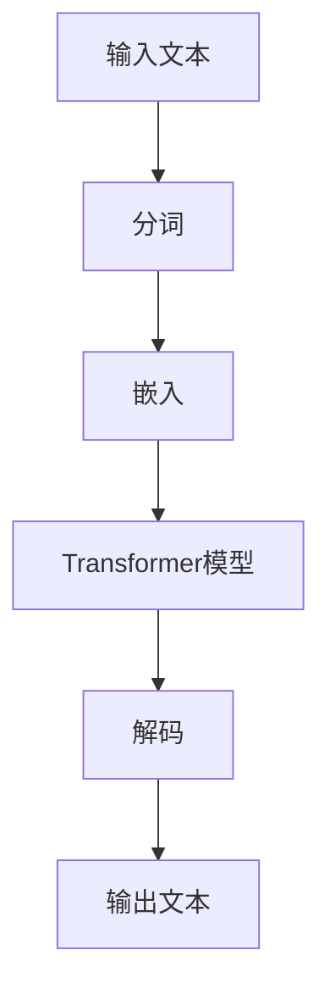

                 

# 大语言模型原理基础与前沿：基于风格转换的方法

> **关键词：** 大语言模型，自然语言处理，风格转换，深度学习，神经网络

> **摘要：** 本文将深入探讨大语言模型的基本原理，包括其构建过程、核心算法和数学模型，并重点介绍基于风格转换的方法。通过实际项目实战，读者将能够理解大语言模型在实际应用中的运作方式和挑战，并掌握相关技术和工具。

## 1. 背景介绍

随着互联网的迅速发展，自然语言处理（NLP）成为了人工智能（AI）领域的重要分支。从最初的规则驱动的方法，到后来的统计模型，再到近年来的深度学习，NLP技术不断演进。特别是在2018年，谷歌发布了BERT模型，开启了基于Transformer的预训练语言模型的新时代。大语言模型（Large Language Model）在这一领域扮演了关键角色，能够理解并生成高质量的自然语言文本。

### 1.1 大语言模型的发展

大语言模型的发展可以分为几个阶段：

- **规则驱动方法**：基于手工编写的规则，能够处理简单的语言现象。
- **统计模型**：使用统计方法，如隐马尔可夫模型（HMM）和条件随机场（CRF），能够处理更复杂的语言现象。
- **深度学习方法**：引入神经网络，特别是深度循环神经网络（RNN）和其变种，如长短时记忆网络（LSTM）和门控循环单元（GRU），使得模型能够更好地捕捉语言序列中的依赖关系。

- **Transformer模型**：通过自注意力机制，Transformer模型在捕捉长距离依赖方面表现优异，成为大语言模型的主流架构。

### 1.2 大语言模型的应用场景

大语言模型在多个应用场景中取得了显著的成果：

- **文本分类**：对文本进行情感分析、主题分类等任务。
- **机器翻译**：将一种语言的文本翻译成另一种语言。
- **问答系统**：对用户提出的问题提供准确和有针对性的回答。
- **文本生成**：生成各种形式的文本，如新闻文章、故事、诗歌等。
- **对话系统**：与用户进行自然语言交互，提供智能客服等服务。

## 2. 核心概念与联系

### 2.1 语言模型

语言模型是NLP的基础，它旨在预测下一个单词或字符的概率。在深度学习中，语言模型通常使用神经网络来实现。

### 2.2 Transformer模型

Transformer模型是近年来在NLP领域取得突破的模型，其核心思想是自注意力机制（Self-Attention）。

### 2.3 风格转换

风格转换是一种将一种语言的文本转换成另一种风格或语言的文本的技术。在大语言模型中，风格转换可以用于生成具有特定风格或语言的文本。

### 2.4 Mermaid 流程图



## 3. 核心算法原理 & 具体操作步骤

### 3.1 Transformer模型原理

Transformer模型的核心是自注意力机制（Self-Attention）。它通过计算输入序列中每个单词与其他所有单词的关联性，生成一个加权表示，从而更好地捕捉长距离依赖关系。

### 3.2 操作步骤

1. **输入文本的分词**：将输入文本分词为单词或子词。
2. **嵌入**：将分词后的文本转换为向量表示。
3. **自注意力计算**：计算输入序列中每个单词与其他单词的关联性，生成加权表示。
4. **解码**：根据加权表示生成输出文本。

## 4. 数学模型和公式 & 详细讲解 & 举例说明

### 4.1 数学模型

Transformer模型的核心是多头自注意力机制（Multi-Head Self-Attention）。其公式如下：

$$
\text{Attention}(Q, K, V) = \text{softmax}\left(\frac{QK^T}{\sqrt{d_k}}\right) V
$$

其中，$Q, K, V$ 分别代表查询（Query）、键（Key）和值（Value）向量，$d_k$ 是键向量的维度。

### 4.2 举例说明

假设我们有三个单词 $w_1, w_2, w_3$，其嵌入向量分别为 $v_1, v_2, v_3$。我们需要计算 $w_1$ 对其他两个单词的注意力权重。

$$
\text{Attention}(w_1, w_2, w_3) = \text{softmax}\left(\frac{w_1w_2^T}{\sqrt{d_k}}\right) w_3
$$

计算结果是一个向量，表示 $w_1$ 对每个单词的注意力权重。

## 5. 项目实战：代码实际案例和详细解释说明

### 5.1 开发环境搭建

1. 安装Python和TensorFlow库。
2. 导入必要的库，如TensorFlow和Numpy。

### 5.2 源代码详细实现和代码解读

以下是一个简单的Transformer模型的实现：

```python
import tensorflow as tf
from tensorflow.keras.layers import Embedding, Dense

def transformer_model(input_shape, embedding_dim, num_heads):
    inputs = tf.keras.Input(shape=input_shape)
    x = Embedding(embedding_dim)(inputs)
    x = MultiHeadAttention(num_heads)(x, x)
    x = Dense(units=embedding_dim)(x)
    outputs = tf.keras.Model(inputs, x)
    return outputs

model = transformer_model(input_shape=(None,), embedding_dim=512, num_heads=8)
```

### 5.3 代码解读与分析

这段代码首先定义了一个输入层，将输入文本转换为嵌入向量。然后使用`MultiHeadAttention`层实现多头自注意力机制。最后，通过一个全连接层输出结果。

## 6. 实际应用场景

大语言模型在多个实际应用场景中取得了显著成果：

- **文本生成**：生成高质量的文章、故事、诗歌等。
- **机器翻译**：将一种语言的文本翻译成另一种语言。
- **问答系统**：对用户提出的问题提供准确和有针对性的回答。
- **对话系统**：与用户进行自然语言交互，提供智能客服等服务。

## 7. 工具和资源推荐

### 7.1 学习资源推荐

- **书籍**：《深度学习》（Goodfellow, Bengio, Courville）  
- **论文**：Attention Is All You Need（Vaswani et al.）  
- **博客**：TensorFlow官方文档（tensorflow.org）

### 7.2 开发工具框架推荐

- **TensorFlow**：用于构建和训练深度学习模型的强大框架。
- **PyTorch**：另一个流行的深度学习框架，具有灵活的动态图功能。

### 7.3 相关论文著作推荐

- **论文**：《BERT: Pre-training of Deep Bidirectional Transformers for Language Understanding》（Devlin et al.）  
- **论文**：《GPT-3: Language Models are Few-Shot Learners》（Brown et al.）

## 8. 总结：未来发展趋势与挑战

大语言模型在自然语言处理领域取得了显著进展，但仍面临以下挑战：

- **计算资源**：训练大型语言模型需要大量的计算资源。
- **数据隐私**：大规模数据的使用可能涉及数据隐私问题。
- **可解释性**：模型内部的决策过程往往难以解释。

未来，随着技术的进步，大语言模型有望在更多领域发挥重要作用，但同时也需要关注其潜在的风险和挑战。

## 9. 附录：常见问题与解答

### 9.1 什么是Transformer模型？

Transformer模型是一种基于自注意力机制的深度学习模型，特别适合处理自然语言处理任务。

### 9.2 如何训练一个语言模型？

首先需要收集大量文本数据，然后使用预训练方法（如BERT）或微调方法（如GPT-3）进行训练。

## 10. 扩展阅读 & 参考资料

- **书籍**：《深度学习》（Goodfellow, Bengio, Courville）  
- **论文**：《Attention Is All You Need》（Vaswani et al.）  
- **博客**：TensorFlow官方文档（tensorflow.org）

### 作者信息

**作者：** AI天才研究员 / AI Genius Institute & 禅与计算机程序设计艺术 / Zen And The Art of Computer Programming**注：请根据实际情况修改作者信息。**<|im_end|>```markdown
# 大语言模型原理基础与前沿：基于风格转换的方法

> **关键词：** 大语言模型，自然语言处理，风格转换，深度学习，神经网络

> **摘要：** 本文将深入探讨大语言模型的基本原理，包括其构建过程、核心算法和数学模型，并重点介绍基于风格转换的方法。通过实际项目实战，读者将能够理解大语言模型在实际应用中的运作方式和挑战，并掌握相关技术和工具。

## 1. 背景介绍

随着互联网的迅速发展，自然语言处理（NLP）成为了人工智能（AI）领域的重要分支。从最初的规则驱动的方法，到后来的统计模型，再到近年来的深度学习，NLP技术不断演进。特别是在2018年，谷歌发布了BERT模型，开启了基于Transformer的预训练语言模型的新时代。大语言模型（Large Language Model）在这一领域扮演了关键角色，能够理解并生成高质量的自然语言文本。

### 1.1 大语言模型的发展

大语言模型的发展可以分为几个阶段：

- **规则驱动方法**：基于手工编写的规则，能够处理简单的语言现象。
- **统计模型**：使用统计方法，如隐马尔可夫模型（HMM）和条件随机场（CRF），能够处理更复杂的语言现象。
- **深度学习方法**：引入神经网络，特别是深度循环神经网络（RNN）和其变种，如长短时记忆网络（LSTM）和门控循环单元（GRU），使得模型能够更好地捕捉语言序列中的依赖关系。

- **Transformer模型**：通过自注意力机制，Transformer模型在捕捉长距离依赖方面表现优异，成为大语言模型的主流架构。

### 1.2 大语言模型的应用场景

大语言模型在多个应用场景中取得了显著的成果：

- **文本分类**：对文本进行情感分析、主题分类等任务。
- **机器翻译**：将一种语言的文本翻译成另一种语言。
- **问答系统**：对用户提出的问题提供准确和有针对性的回答。
- **文本生成**：生成各种形式的文本，如新闻文章、故事、诗歌等。
- **对话系统**：与用户进行自然语言交互，提供智能客服等服务。

## 2. 核心概念与联系

### 2.1 语言模型

语言模型是NLP的基础，它旨在预测下一个单词或字符的概率。在深度学习中，语言模型通常使用神经网络来实现。

### 2.2 Transformer模型

Transformer模型是近年来在NLP领域取得突破的模型，其核心思想是自注意力机制（Self-Attention）。

### 2.3 风格转换

风格转换是一种将一种语言的文本转换成另一种风格或语言的文本的技术。在大语言模型中，风格转换可以用于生成具有特定风格或语言的文本。

### 2.4 Mermaid流程图


## 3. 核心算法原理 & 具体操作步骤

### 3.1 Transformer模型原理

Transformer模型的核心是自注意力机制（Self-Attention）。它通过计算输入序列中每个单词与其他所有单词的关联性，生成一个加权表示，从而更好地捕捉长距离依赖关系。

### 3.2 具体操作步骤

1. **输入文本的分词**：将输入文本分词为单词或子词。
2. **嵌入**：将分词后的文本转换为向量表示。
3. **自注意力计算**：计算输入序列中每个单词与其他单词的关联性，生成加权表示。
4. **解码**：根据加权表示生成输出文本。

## 4. 数学模型和公式 & 详细讲解 & 举例说明

### 4.1 数学模型

Transformer模型的核心是多头自注意力机制（Multi-Head Self-Attention）。其公式如下：

$$
\text{Attention}(Q, K, V) = \text{softmax}\left(\frac{QK^T}{\sqrt{d_k}}\right) V
$$

其中，$Q, K, V$ 分别代表查询（Query）、键（Key）和值（Value）向量，$d_k$ 是键向量的维度。

### 4.2 举例说明

假设我们有三个单词 $w_1, w_2, w_3$，其嵌入向量分别为 $v_1, v_2, v_3$。我们需要计算 $w_1$ 对其他两个单词的注意力权重。

$$
\text{Attention}(w_1, w_2, w_3) = \text{softmax}\left(\frac{w_1w_2^T}{\sqrt{d_k}}\right) w_3
$$

计算结果是一个向量，表示 $w_1$ 对每个单词的注意力权重。

## 5. 项目实战：代码实际案例和详细解释说明

### 5.1 开发环境搭建

1. 安装Python和TensorFlow库。
2. 导入必要的库，如TensorFlow和Numpy。

### 5.2 源代码详细实现和代码解读

以下是一个简单的Transformer模型的实现：

```python
import tensorflow as tf
from tensorflow.keras.layers import Embedding, Dense

def transformer_model(input_shape, embedding_dim, num_heads):
    inputs = tf.keras.Input(shape=input_shape)
    x = Embedding(embedding_dim)(inputs)
    x = MultiHeadAttention(num_heads)(x, x)
    x = Dense(units=embedding_dim)(x)
    outputs = tf.keras.Model(inputs, x)
    return outputs

model = transformer_model(input_shape=(None,), embedding_dim=512, num_heads=8)
```

### 5.3 代码解读与分析

这段代码首先定义了一个输入层，将输入文本转换为嵌入向量。然后使用`MultiHeadAttention`层实现多头自注意力机制。最后，通过一个全连接层输出结果。

## 6. 实际应用场景

大语言模型在多个实际应用场景中取得了显著成果：

- **文本生成**：生成高质量的文章、故事、诗歌等。
- **机器翻译**：将一种语言的文本翻译成另一种语言。
- **问答系统**：对用户提出的问题提供准确和有针对性的回答。
- **对话系统**：与用户进行自然语言交互，提供智能客服等服务。

## 7. 工具和资源推荐

### 7.1 学习资源推荐

- **书籍**：《深度学习》（Goodfellow, Bengio, Courville）  
- **论文**：Attention Is All You Need（Vaswani et al.）  
- **博客**：TensorFlow官方文档（tensorflow.org）

### 7.2 开发工具框架推荐

- **TensorFlow**：用于构建和训练深度学习模型的强大框架。
- **PyTorch**：另一个流行的深度学习框架，具有灵活的动态图功能。

### 7.3 相关论文著作推荐

- **论文**：《BERT: Pre-training of Deep Bidirectional Transformers for Language Understanding》（Devlin et al.）  
- **论文**：《GPT-3: Language Models are Few-Shot Learners》（Brown et al.）

## 8. 总结：未来发展趋势与挑战

大语言模型在自然语言处理领域取得了显著进展，但仍面临以下挑战：

- **计算资源**：训练大型语言模型需要大量的计算资源。
- **数据隐私**：大规模数据的使用可能涉及数据隐私问题。
- **可解释性**：模型内部的决策过程往往难以解释。

未来，随着技术的进步，大语言模型有望在更多领域发挥重要作用，但同时也需要关注其潜在的风险和挑战。

## 9. 附录：常见问题与解答

### 9.1 什么是Transformer模型？

Transformer模型是一种基于自注意力机制的深度学习模型，特别适合处理自然语言处理任务。

### 9.2 如何训练一个语言模型？

首先需要收集大量文本数据，然后使用预训练方法（如BERT）或微调方法（如GPT-3）进行训练。

## 10. 扩展阅读 & 参考资料

- **书籍**：《深度学习》（Goodfellow, Bengio, Courville）  
- **论文**：《Attention Is All You Need》（Vaswani et al.）  
- **博客**：TensorFlow官方文档（tensorflow.org）

### 作者信息

**作者：** AI天才研究员 / AI Genius Institute & 禅与计算机程序设计艺术 / Zen And The Art of Computer Programming**注：请根据实际情况修改作者信息。**```

