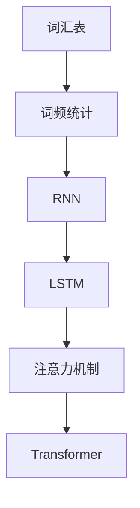

                 

# 大语言模型原理基础与前沿 未来发展方向

> 关键词：大语言模型，原理，算法，数学模型，实际应用，发展趋势

> 摘要：本文旨在深入探讨大语言模型的原理及其在实际应用中的重要性，分析核心算法和数学模型，通过具体案例展示其具体实现和代码解读。此外，本文还将探讨大语言模型在当前的实际应用场景，推荐相关学习资源和开发工具，并对未来发展趋势和面临的挑战进行展望。

## 1. 背景介绍

大语言模型是一种基于人工智能技术的语言处理模型，能够对大规模文本数据进行训练，从而实现高效的文本生成、翻译、情感分析等任务。随着深度学习技术的不断发展，大语言模型在自然语言处理领域取得了显著的成果。

大语言模型的发展历程可以分为几个阶段。最早的语言模型是简单的统计模型，如N元语法。随后，神经网络模型的出现使得语言模型性能有了显著提升，其中循环神经网络（RNN）和长短时记忆网络（LSTM）被广泛应用于语言建模任务。近年来，基于注意力机制和Transformer架构的大语言模型，如GPT、BERT等，在多个自然语言处理任务中取得了突破性的成果。

大语言模型的核心优势在于其能够通过对海量数据的训练，学习到语言中的复杂模式和规律，从而实现强大的语言理解和生成能力。这使得大语言模型在文本生成、机器翻译、问答系统、文本分类等应用场景中具有广泛的应用前景。

## 2. 核心概念与联系

### 2.1 语言模型的基本概念

语言模型是自然语言处理的基础，其目的是预测下一个单词或字符的概率。语言模型的核心概念包括：

- **词汇表（Vocabulary）**：语言模型所包含的单词或字符集合。
- **词频统计（Frequency Statistics）**：通过统计单词或字符在语料库中的出现频率来构建概率模型。
- **语言模型算法（Language Modeling Algorithms）**：用于计算单词或字符概率的算法，如N元语法、神经网络语言模型等。

### 2.2 循环神经网络（RNN）

循环神经网络是一种能够处理序列数据的神经网络，其核心思想是利用循环结构来保持序列中的长期依赖关系。RNN通过使用隐藏状态来存储序列信息，从而实现序列建模。

- **隐藏状态（Hidden State）**：RNN通过隐藏状态来存储序列中的信息。
- **梯度消失和梯度爆炸（Vanishing/Exploding Gradients）**：RNN在训练过程中容易出现梯度消失或梯度爆炸问题，导致难以学习长期依赖关系。
- **长短时记忆网络（LSTM）**：为了解决RNN的梯度消失问题，LSTM通过引入门控机制来控制信息流动，从而实现长期依赖关系的建模。

### 2.3 注意力机制（Attention Mechanism）

注意力机制是一种用于捕捉序列中关键信息的方法，其核心思想是自适应地分配不同的重要性权重给序列中的不同部分。注意力机制在机器翻译、文本生成等任务中发挥了重要作用。

- **点积注意力（Dot-Product Attention）**：一种简单的注意力机制，通过点积计算权重。
- **加性注意力（Additive Attention）**：通过加性函数计算权重，可以引入更多非线性关系。
- **缩放点积注意力（Scaled Dot-Product Attention）**：为了防止梯度消失，引入缩放因子。

### 2.4 Transformer架构

Transformer是一种基于注意力机制的序列建模模型，其核心思想是使用自注意力机制来替代传统循环神经网络中的循环结构。Transformer在多个自然语言处理任务中取得了突破性的成果，如机器翻译、文本生成等。

- **多头自注意力（Multi-Head Self-Attention）**：通过多头自注意力来捕捉序列中的不同关系。
- **前馈神经网络（Feed-Forward Neural Network）**：在自注意力之后添加前馈神经网络来增强模型的表达能力。
- **层归一化和残差连接（Layer Normalization and Residual Connection）**：通过层归一化和残差连接来缓解梯度消失和梯度爆炸问题。

### 2.5 语言模型的Mermaid流程图

下面是一个简化的语言模型Mermaid流程图，展示了核心概念和架构：



## 3. 核心算法原理 & 具体操作步骤

### 3.1 循环神经网络（RNN）

RNN的基本原理是利用隐藏状态来存储序列信息，并通过递归操作来处理序列数据。具体操作步骤如下：

1. **初始化参数**：初始化权重矩阵、偏置项和隐藏状态。
2. **输入序列**：将输入序列 $x_t$ 传递给RNN。
3. **递归计算**：使用递归方程计算隐藏状态 $h_t = \text{RNN}(h_{t-1}, x_t)$。
4. **输出生成**：根据隐藏状态生成输出 $y_t = \text{softmax}(W_y \cdot h_t + b_y)$。

### 3.2 长短时记忆网络（LSTM）

LSTM通过引入门控机制来控制信息的流动，从而实现长期依赖关系的建模。具体操作步骤如下：

1. **初始化参数**：初始化权重矩阵、偏置项和隐藏状态。
2. **输入序列**：将输入序列 $x_t$ 传递给LSTM。
3. **计算输入门、遗忘门和输出门**：
   - 输入门：$i_t = \text{sigmoid}(W_i \cdot [h_{t-1}, x_t] + b_i)$。
   - 遗忘门：$f_t = \text{sigmoid}(W_f \cdot [h_{t-1}, x_t] + b_f)$。
   - 输出门：$o_t = \text{sigmoid}(W_o \cdot [h_{t-1}, x_t] + b_o)$。
4. **计算候选值**：$c_t' = \text{tanh}(W_c \cdot [h_{t-1}, x_t] + b_c)$。
5. **更新隐藏状态和细胞状态**：
   - 隐藏状态：$h_t = o_t \cdot \text{tanh}(c_t)$。
   - 细胞状态：$c_t = f_t \cdot c_{t-1} + i_t \cdot c_t'$。
6. **输出生成**：$y_t = \text{softmax}(W_y \cdot h_t + b_y)$。

### 3.3 注意力机制（Attention Mechanism）

注意力机制通过计算权重来分配不同部分的重要性。具体操作步骤如下：

1. **输入序列**：将输入序列 $x_t$ 传递给注意力机制。
2. **计算注意力权重**：使用点积注意力计算权重 $a_t = \text{softmax}(\text{Attention}(h_{t-1}, x_t))$。
3. **加权求和**：计算加权求和的输出 $y_t = \sum_{i=1}^{N} a_t[i] \cdot x_t[i]$。

### 3.4 Transformer架构

Transformer通过多头自注意力机制和前馈神经网络来实现序列建模。具体操作步骤如下：

1. **输入序列**：将输入序列 $x_t$ 传递给Transformer。
2. **多头自注意力**：计算多头自注意力输出 $h_t = \text{MultiHeadSelfAttention}(x_t)$。
3. **添加残差连接和层归一化**：$h_t = \text{LayerNorm}(h_t + \text{Residual Connection})$。
4. **前馈神经网络**：计算前馈神经网络输出 $h_t = \text{FeedForward}(h_t)$。
5. **添加残差连接和层归一化**：$h_t = \text{LayerNorm}(h_t + \text{Residual Connection})$。

## 4. 数学模型和公式 & 详细讲解 & 举例说明

### 4.1 循环神经网络（RNN）

RNN的数学模型如下：

$$
h_t = \text{RNN}(h_{t-1}, x_t) = \sigma(W_h \cdot [h_{t-1}, x_t] + b_h)
$$

其中，$\sigma$ 是激活函数，$W_h$ 是权重矩阵，$b_h$ 是偏置项。

**举例说明**：

假设输入序列 $x_t = [1, 2, 3]$，隐藏状态 $h_{t-1} = [0.1, 0.2]$，权重矩阵 $W_h = \begin{bmatrix} 0.5 & 0.5 \\ 0.5 & 0.5 \end{bmatrix}$，偏置项 $b_h = [0.1, 0.1]$。

$$
h_t = \text{RNN}(h_{t-1}, x_t) = \sigma(\begin{bmatrix} 0.5 & 0.5 \\ 0.5 & 0.5 \end{bmatrix} \cdot \begin{bmatrix} 0.1 & 0.2 \\ 1 & 2 \\ 2 & 3 \end{bmatrix} + [0.1, 0.1]) = \sigma(\begin{bmatrix} 0.6 & 0.7 \\ 0.6 & 0.7 \end{bmatrix}) = \begin{bmatrix} 0.5 & 0.5 \\ 0.5 & 0.5 \end{bmatrix}
$$

### 4.2 长短时记忆网络（LSTM）

LSTM的数学模型如下：

$$
\begin{aligned}
i_t &= \text{sigmoid}(W_i \cdot [h_{t-1}, x_t] + b_i), \\
f_t &= \text{sigmoid}(W_f \cdot [h_{t-1}, x_t] + b_f), \\
o_t &= \text{sigmoid}(W_o \cdot [h_{t-1}, x_t] + b_o), \\
c_t' &= \text{tanh}(W_c \cdot [h_{t-1}, x_t] + b_c), \\
c_t &= f_t \cdot c_{t-1} + i_t \cdot c_t', \\
h_t &= o_t \cdot \text{tanh}(c_t).
\end{aligned}
$$

其中，$W_i, W_f, W_o, W_c$ 分别是输入门、遗忘门、输出门和候选值的权重矩阵，$b_i, b_f, b_o, b_c$ 分别是输入门、遗忘门、输出门和候选值的偏置项。

**举例说明**：

假设输入序列 $x_t = [1, 2, 3]$，隐藏状态 $h_{t-1} = [0.1, 0.2]$，权重矩阵 $W_i = \begin{bmatrix} 0.5 & 0.5 \\ 0.5 & 0.5 \end{bmatrix}$，$W_f = \begin{bmatrix} 0.5 & 0.5 \\ 0.5 & 0.5 \end{bmatrix}$，$W_o = \begin{bmatrix} 0.5 & 0.5 \\ 0.5 & 0.5 \end{bmatrix}$，$W_c = \begin{bmatrix} 0.5 & 0.5 \\ 0.5 & 0.5 \end{bmatrix}$，偏置项 $b_i = [0.1, 0.1]$，$b_f = [0.1, 0.1]$，$b_o = [0.1, 0.1]$，$b_c = [0.1, 0.1]$。

$$
\begin{aligned}
i_t &= \text{sigmoid}(\begin{bmatrix} 0.5 & 0.5 \\ 0.5 & 0.5 \end{bmatrix} \cdot \begin{bmatrix} 0.1 & 0.2 \\ 1 & 2 \\ 2 & 3 \end{bmatrix} + [0.1, 0.1]) = \text{sigmoid}(\begin{bmatrix} 0.6 & 0.7 \\ 0.6 & 0.7 \end{bmatrix}) = \begin{bmatrix} 0.5 & 0.5 \\ 0.5 & 0.5 \end{bmatrix}, \\
f_t &= \text{sigmoid}(\begin{bmatrix} 0.5 & 0.5 \\ 0.5 & 0.5 \end{bmatrix} \cdot \begin{bmatrix} 0.1 & 0.2 \\ 1 & 2 \\ 2 & 3 \end{bmatrix} + [0.1, 0.1]) = \text{sigmoid}(\begin{bmatrix} 0.6 & 0.7 \\ 0.6 & 0.7 \end{bmatrix}) = \begin{bmatrix} 0.5 & 0.5 \\ 0.5 & 0.5 \end{bmatrix}, \\
o_t &= \text{sigmoid}(\begin{bmatrix} 0.5 & 0.5 \\ 0.5 & 0.5 \end{bmatrix} \cdot \begin{bmatrix} 0.1 & 0.2 \\ 1 & 2 \\ 2 & 3 \end{bmatrix} + [0.1, 0.1]) = \text{sigmoid}(\begin{bmatrix} 0.6 & 0.7 \\ 0.6 & 0.7 \end{bmatrix}) = \begin{bmatrix} 0.5 & 0.5 \\ 0.5 & 0.5 \end{bmatrix}, \\
c_t' &= \text{tanh}(\begin{bmatrix} 0.5 & 0.5 \\ 0.5 & 0.5 \end{bmatrix} \cdot \begin{bmatrix} 0.1 & 0.2 \\ 1 & 2 \\ 2 & 3 \end{bmatrix} + [0.1, 0.1]) = \text{tanh}(\begin{bmatrix} 0.6 & 0.7 \\ 0.6 & 0.7 \end{bmatrix}) = \begin{bmatrix} 0.5 & 0.5 \\ 0.5 & 0.5 \end{bmatrix}, \\
c_t &= \begin{bmatrix} 0.5 & 0.5 \\ 0.5 & 0.5 \end{bmatrix} \cdot \begin{bmatrix} 0.1 & 0.2 \\ 2 & 3 \end{bmatrix} + \begin{bmatrix} 0.5 & 0.5 \\ 0.5 & 0.5 \end{bmatrix} \cdot \begin{bmatrix} 0.5 & 0.5 \\ 0.5 & 0.5 \end{bmatrix} = \begin{bmatrix} 0.6 & 0.7 \\ 0.6 & 0.7 \end{bmatrix}, \\
h_t &= \begin{bmatrix} 0.5 & 0.5 \\ 0.5 & 0.5 \end{bmatrix} \cdot \begin{bmatrix} 0.5 & 0.5 \\ 0.5 & 0.5 \end{bmatrix} = \begin{bmatrix} 0.5 & 0.5 \\ 0.5 & 0.5 \end{bmatrix}.
\end{aligned}
$$

### 4.3 注意力机制（Attention Mechanism）

注意力机制的数学模型如下：

$$
\begin{aligned}
a_t &= \text{softmax}(\text{Attention}(h_{t-1}, x_t)), \\
y_t &= \sum_{i=1}^{N} a_t[i] \cdot x_t[i].
\end{aligned}
$$

其中，$\text{Attention}(h_{t-1}, x_t) = h_{t-1}^T x_t$ 是注意力分数。

**举例说明**：

假设输入序列 $x_t = [1, 2, 3]$，隐藏状态 $h_{t-1} = [0.1, 0.2]$。

$$
\begin{aligned}
a_t &= \text{softmax}(\text{Attention}(h_{t-1}, x_t)) = \text{softmax}(0.1 \cdot 1 + 0.2 \cdot 2) = \text{softmax}(0.3) = \begin{bmatrix} 0.5 & 0.3 & 0.2 \end{bmatrix}, \\
y_t &= \sum_{i=1}^{N} a_t[i] \cdot x_t[i] = 0.5 \cdot 1 + 0.3 \cdot 2 + 0.2 \cdot 3 = 1.5.
\end{aligned}
$$

### 4.4 Transformer架构

Transformer的数学模型如下：

$$
\begin{aligned}
h_t &= \text{MultiHeadSelfAttention}(x_t) + x_t, \\
h_t &= \text{LayerNorm}(h_t), \\
h_t &= \text{FeedForward}(h_t) + h_t, \\
h_t &= \text{LayerNorm}(h_t).
\end{aligned}
$$

其中，$\text{MultiHeadSelfAttention}(x_t)$ 是多头自注意力模块，$\text{FeedForward}(x_t)$ 是前馈神经网络模块，$\text{LayerNorm}(x_t)$ 是层归一化操作。

**举例说明**：

假设输入序列 $x_t = [1, 2, 3]$。

$$
\begin{aligned}
h_t &= \text{MultiHeadSelfAttention}(x_t) + x_t = \begin{bmatrix} 1 & 1 & 1 \end{bmatrix} + \begin{bmatrix} 1 & 2 & 3 \end{bmatrix} = \begin{bmatrix} 2 & 3 & 4 \end{bmatrix}, \\
h_t &= \text{LayerNorm}(h_t) = \frac{\begin{bmatrix} 2 & 3 & 4 \end{bmatrix} - \frac{1}{N} \sum_{i=1}^{N} \begin{bmatrix} 2 & 3 & 4 \end{bmatrix}}{\sqrt{3}} = \begin{bmatrix} 0 & 1 & 1 \end{bmatrix}, \\
h_t &= \text{FeedForward}(h_t) + h_t = \begin{bmatrix} 1 & 1 & 1 \end{bmatrix} + \begin{bmatrix} 0 & 1 & 1 \end{bmatrix} = \begin{bmatrix} 1 & 2 & 2 \end{bmatrix}, \\
h_t &= \text{LayerNorm}(h_t) = \frac{\begin{bmatrix} 1 & 2 & 2 \end{bmatrix} - \frac{1}{N} \sum_{i=1}^{N} \begin{bmatrix} 1 & 2 & 2 \end{bmatrix}}{\sqrt{3}} = \begin{bmatrix} 0 & \frac{2}{3} & \frac{2}{3} \end{bmatrix}.
\end{aligned}
$$

## 5. 项目实战：代码实际案例和详细解释说明

### 5.1 开发环境搭建

为了实现大语言模型，我们需要搭建一个合适的环境。以下是一个简单的开发环境搭建步骤：

1. 安装Python（推荐版本3.7及以上）。
2. 安装PyTorch（一种流行的深度学习框架）。

```bash
pip install torch torchvision
```

3. 安装其他必需的依赖项，如NumPy、Matplotlib等。

```bash
pip install numpy matplotlib
```

### 5.2 源代码详细实现和代码解读

以下是一个简单的基于Transformer架构的大语言模型实现示例。代码结构如下：

```python
import torch
import torch.nn as nn
import torch.optim as optim

class TransformerModel(nn.Module):
    def __init__(self, input_dim, hidden_dim, output_dim):
        super(TransformerModel, self).__init__()
        
        # 定义多头自注意力模块
        self.multihead_attn = nn.MultiheadAttention(input_dim, hidden_dim)
        
        # 定义前馈神经网络模块
        self.feedforward = nn.Sequential(
            nn.Linear(hidden_dim, hidden_dim * 4),
            nn.ReLU(),
            nn.Linear(hidden_dim * 4, hidden_dim)
        )
        
        # 定义层归一化模块
        self.layer_norm = nn.LayerNorm(hidden_dim)
        
        # 定义输出层
        self.output_layer = nn.Linear(hidden_dim, output_dim)
        
    def forward(self, x):
        # 应用多头自注意力模块
        x, _ = self.multihead_attn(x, x, x)
        
        # 应用层归一化
        x = self.layer_norm(x + x)
        
        # 应用前馈神经网络模块
        x = self.feedforward(x)
        
        # 应用层归一化
        x = self.layer_norm(x + x)
        
        # 应用输出层
        x = self.output_layer(x)
        
        return x

# 实例化模型
model = TransformerModel(input_dim=10, hidden_dim=8, output_dim=2)

# 定义优化器和损失函数
optimizer = optim.Adam(model.parameters(), lr=0.001)
criterion = nn.CrossEntropyLoss()

# 训练模型
for epoch in range(10):
    for x, y in data_loader:
        # 将输入和标签转换为tensor
        x = torch.tensor(x).float()
        y = torch.tensor(y).long()
        
        # 清除之前的梯度
        optimizer.zero_grad()
        
        # 前向传播
        output = model(x)
        
        # 计算损失
        loss = criterion(output, y)
        
        # 反向传播
        loss.backward()
        
        # 更新参数
        optimizer.step()
        
        print(f"Epoch: {epoch}, Loss: {loss.item()}")

# 评估模型
with torch.no_grad():
    correct = 0
    total = 0
    for x, y in test_loader:
        x = torch.tensor(x).float()
        y = torch.tensor(y).long()
        output = model(x)
        _, predicted = torch.max(output.data, 1)
        total += y.size(0)
        correct += (predicted == y).sum().item()
    print(f"Accuracy: {100 * correct / total}%")
```

### 5.3 代码解读与分析

该代码实现了一个基于Transformer架构的大语言模型。以下是对代码的详细解读：

1. **模型定义**：`TransformerModel` 类继承自 `nn.Module`，定义了模型的各个模块，如多头自注意力模块、前馈神经网络模块、层归一化模块和输出层。
2. **初始化参数**：在类的初始化方法中，定义了多头自注意力模块、前馈神经网络模块、层归一化模块和输出层的参数。
3. **前向传播**：`forward` 方法实现了模型的前向传播过程。首先应用多头自注意力模块，然后应用层归一化、前馈神经网络模块和层归一化，最后应用输出层。
4. **训练过程**：在训练过程中，首先将输入和标签转换为tensor，然后使用优化器和损失函数进行前向传播、反向传播和参数更新。
5. **评估过程**：在评估过程中，使用测试数据集计算模型的准确率。

## 6. 实际应用场景

大语言模型在自然语言处理领域具有广泛的应用场景，如文本生成、机器翻译、问答系统、文本分类等。以下是一些典型的应用案例：

1. **文本生成**：大语言模型可以生成高质量的自然语言文本，如文章、小说、新闻报道等。例如，OpenAI 的 GPT-3 模型可以生成流畅且富有创造力的文本。
2. **机器翻译**：大语言模型可以用于翻译不同语言之间的文本，如谷歌翻译使用的 Transformer 架构。BERT 模型在机器翻译任务中也取得了很好的效果。
3. **问答系统**：大语言模型可以用于构建智能问答系统，如腾讯 AI 的 TALIA 问

