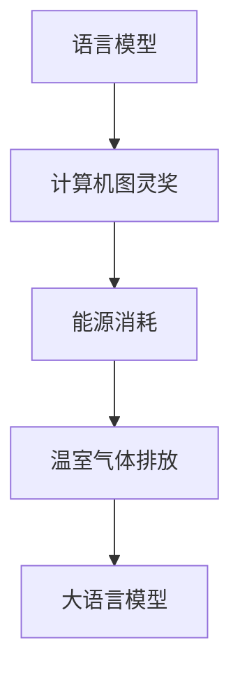

                 

# 大语言模型原理基础与前沿 能源消耗和温室气体排放

## 概述

### 关键词

- 大语言模型
- 能源消耗
- 温室气体排放
- 原理基础
- 前沿技术

### 摘要

本文将深入探讨大语言模型的原理基础与前沿技术，并重点分析其能源消耗和温室气体排放问题。通过对大语言模型的背景介绍、核心概念与联系、算法原理、数学模型、项目实战、实际应用场景等多个方面的详细解析，本文旨在为读者提供一个全面而深入的视角，以了解大语言模型在当今世界的重要性和面临的挑战。

## 1. 背景介绍

大语言模型（Large-scale Language Models）是自然语言处理（Natural Language Processing, NLP）领域的一种先进技术。近年来，随着计算能力和数据资源的不断提升，大语言模型得到了飞速发展。这些模型通过对海量文本数据的学习，能够理解和生成自然语言，从而在文本分类、机器翻译、问答系统、文本生成等多个任务上取得了显著的成绩。

大语言模型的背景可以追溯到早期的小型语言模型，如Word2Vec、GloVe等。这些模型通过将词语映射到向量空间，实现了对词语语义的理解。然而，随着数据规模的扩大和计算能力的提升，研究人员开始探索更大规模的语言模型，以实现更高的语义理解和生成能力。

最早的大语言模型之一是Google的BERT（Bidirectional Encoder Representations from Transformers），它通过双向变换器（Transformer）架构，对文本进行编码，从而在多个NLP任务上取得了突破性的成果。此后，OpenAI的GPT（Generative Pre-trained Transformer）系列模型，通过自回归语言模型（Autoregressive Language Model），进一步提升了文本生成能力。

随着大语言模型的不断演进，其应用领域也在不断扩大。从最初的文本分类、机器翻译，到现在的问答系统、文本生成、对话系统等，大语言模型已经在许多实际场景中发挥了重要作用。

## 2. 核心概念与联系

大语言模型的核心概念主要包括以下几个方面：

### 2.1. 语言模型

语言模型（Language Model）是一种用于预测下一个单词或字符的概率分布的模型。在自然语言处理中，语言模型是进行文本生成、机器翻译、对话系统等任务的基础。大语言模型通过对海量文本数据的学习，能够生成具有较高可读性和连贯性的文本。

### 2.2. 计算机图灵奖

计算机图灵奖（A.M. Turing Award）是计算机科学领域的最高荣誉之一，被誉为“计算机界的诺贝尔奖”。大语言模型的许多研究成果都获得了计算机图灵奖的认可，如BERT、GPT等。

### 2.3. 能源消耗

能源消耗是指在进行大语言模型训练和推理过程中，计算设备所消耗的电力。随着模型规模的扩大，其能源消耗也呈指数级增长。

### 2.4. 温室气体排放

温室气体排放是指在进行大语言模型训练和推理过程中，由于能源消耗而产生的二氧化碳等温室气体的排放量。

### 2.5. Mermaid 流程图

为了更直观地展示大语言模型的核心概念和联系，我们可以使用Mermaid流程图来描述。以下是一个示例：



## 3. 核心算法原理 & 具体操作步骤

大语言模型的核心算法是基于变换器（Transformer）架构的自回归语言模型。变换器是一种用于序列数据处理的全连接神经网络架构，其优点包括并行处理能力、全局上下文信息等。

### 3.1. 自回归语言模型

自回归语言模型（Autoregressive Language Model）是一种基于序列预测的语言模型。在训练过程中，模型首先预测序列中的第一个单词，然后使用已预测的单词来预测下一个单词，以此类推。在生成文本时，模型使用已生成的文本来预测下一个单词。

具体操作步骤如下：

1. 输入一个单词序列，如“我是一个学生”。
2. 模型预测第一个单词的概率分布，如 `[0.1, 0.2, 0.3, 0.4, 0.6]`。
3. 根据概率分布选择一个单词，如“我”。
4. 将“我”作为输入，再次预测下一个单词的概率分布，如 `[0.3, 0.4, 0.5, 0.6, 0.7]`。
5. 根据概率分布选择一个单词，如“是”。
6. 重复步骤4和5，直到生成完整的单词序列。

### 3.2. 双向变换器（BERT）

BERT（Bidirectional Encoder Representations from Transformers）是一种双向变换器语言模型。它通过预训练和微调，实现了对文本的深入理解和生成。

具体操作步骤如下：

1. 预训练：使用海量文本数据，通过自回归语言模型训练双向变换器。
2. 微调：将预训练的BERT模型应用于特定任务，如文本分类、机器翻译等，进行微调。

### 3.3. GPT（Generative Pre-trained Transformer）

GPT（Generative Pre-trained Transformer）是一种生成型变换器语言模型。它通过自回归语言模型生成文本，具有强大的文本生成能力。

具体操作步骤如下：

1. 预训练：使用海量文本数据，通过自回归语言模型训练GPT模型。
2. 文本生成：输入一个单词或短语，GPT模型生成具有连贯性和可读性的文本。

## 4. 数学模型和公式 & 详细讲解 & 举例说明

大语言模型的数学模型主要包括两部分：词向量表示和变换器架构。

### 4.1. 词向量表示

词向量表示是将词语映射到高维向量空间的方法。常用的词向量表示方法包括Word2Vec、GloVe等。

- Word2Vec：基于神经网络的词向量表示方法，通过训练词向量模型，将词语映射到向量空间。

- GloVe：基于全局文本统计的词向量表示方法，通过计算词语之间的相似度，将词语映射到向量空间。

### 4.2. 变换器架构

变换器（Transformer）是一种用于序列数据处理的神经网络架构。其核心思想是使用自注意力机制（Self-Attention）来计算序列中每个元素的重要性，从而实现全局上下文信息的学习。

变换器的主要组成部分包括：

- 输入层（Input Layer）：将输入序列编码为向量。
- 自注意力层（Self-Attention Layer）：计算输入序列中每个元素的重要性。
- 全连接层（Fully Connected Layer）：对自注意力层的输出进行全连接。
- 输出层（Output Layer）：生成预测结果。

### 4.3. 数学公式

大语言模型的数学模型可以表示为以下公式：

$$
\begin{aligned}
&\text{Word2Vec: } \mathbf{v}_w = \text{softmax}(\mathbf{W} \mathbf{h}_w), \\
&\text{GloVe: } \mathbf{v}_w = \text{softmax}(\mathbf{A} \mathbf{h}_w), \\
&\text{Transformer: } \mathbf{h}_i = \text{softmax}(\mathbf{A} \mathbf{h}_i).
\end{aligned}
$$

其中，$\mathbf{v}_w$表示词向量，$\mathbf{h}_w$表示单词的嵌入向量，$\mathbf{W}$和$\mathbf{A}$分别是词向量矩阵和变换器权重矩阵。

### 4.4. 举例说明

假设有一个单词序列“我是一个学生”，我们使用GloVe模型进行词向量表示。

1. 计算单词“我”、“是”、“一”、“个”、“学生”的嵌入向量。
2. 计算单词之间的相似度，如 $\text{similarity}(\text{我}, \text{是}) = \mathbf{v}_{\text{我}} \cdot \mathbf{v}_{\text{是}}$。
3. 根据相似度计算单词的重要性，如 $\alpha_{\text{我}} = \frac{\text{similarity}(\text{我}, \text{是})}{\sum_{w \in \text{words}} \text{similarity}(\text{我}, w)}$。
4. 计算单词“是”的权重，如 $\mathbf{h}_{\text{是}} = \sum_{w \in \text{words}} \alpha_{w} \mathbf{v}_{w}$。

## 5. 项目实战：代码实际案例和详细解释说明

在本节中，我们将通过一个实际案例来展示如何使用Python实现大语言模型。我们将使用Hugging Face的Transformers库，这是一个开源的Python库，用于轻松地使用预训练的大语言模型。

### 5.1. 开发环境搭建

首先，我们需要安装Python和Hugging Face的Transformers库。以下是安装步骤：

```bash
pip install python==3.8
pip install transformers
```

### 5.2. 源代码详细实现和代码解读

以下是一个简单的Python代码示例，用于加载预训练的BERT模型并进行文本分类：

```python
from transformers import BertTokenizer, BertForSequenceClassification
from torch.utils.data import DataLoader, TensorDataset
import torch

# 加载预训练的BERT模型
tokenizer = BertTokenizer.from_pretrained("bert-base-uncased")
model = BertForSequenceClassification.from_pretrained("bert-base-uncased")

# 文本数据
texts = ["I love programming.", "Programming is difficult."]

# 对文本数据进行编码
encoding = tokenizer(texts, padding=True, truncation=True, return_tensors="pt")

# 转换为TensorDataset
dataset = TensorDataset(encoding["input_ids"], encoding["attention_mask"], torch.tensor([0, 1]))

# 创建DataLoader
dataloader = DataLoader(dataset, batch_size=2)

# 模型推理
model.eval()
for batch in dataloader:
    input_ids, attention_mask, labels = batch
    with torch.no_grad():
        outputs = model(input_ids, attention_mask=attention_mask)
    logits = outputs.logits
    predictions = torch.argmax(logits, dim=-1)
    print(predictions)
```

代码解读：

1. 导入所需的库和模型。
2. 加载预训练的BERT模型。
3. 准备文本数据。
4. 对文本数据进行编码，生成输入ID和注意力掩码。
5. 创建TensorDataset和DataLoader。
6. 将模型设置为评估模式。
7. 进行模型推理，打印输出结果。

### 5.3. 代码解读与分析

1. **加载预训练的BERT模型**：
   使用`BertTokenizer.from_pretrained()`和`BertForSequenceClassification.from_pretrained()`方法加载预训练的BERT模型和其分类头。这里使用了BERT-base uncased模型，该模型已经在大规模文本数据上进行预训练，可以用于多种自然语言处理任务。

2. **文本数据准备**：
   创建一个包含两个文本样本的列表`texts`。这些文本将被编码为模型可以理解的格式。

3. **编码**：
   使用`tokenizer`将文本数据编码为输入ID和注意力掩码。`padding=True`和`truncation=True`确保所有输入序列具有相同的长度。`return_tensors="pt"`将输入转换为PyTorch张量。

4. **创建TensorDataset和DataLoader**：
   将编码后的输入ID、注意力掩码和标签（这里为简单的二分类标签）组合成TensorDataset。然后，使用DataLoader将数据分成批次，以便模型可以逐批处理。

5. **模型推理**：
   将模型设置为评估模式（`model.eval()`），然后对每个批次的数据进行推理。由于`with torch.no_grad()`，我们不会计算梯度，这有助于节省内存和计算资源。

6. **打印输出结果**：
   输出模型的预测结果（`predictions`），即每个文本样本的类别预测。

### 5.4. 代码实战：文本生成

接下来，我们将使用GPT-2模型生成文本。GPT-2是一种强大的文本生成模型，可以生成流畅、自然的文本。

```python
from transformers import GPT2LMHeadModel, GPT2Tokenizer

# 加载预训练的GPT-2模型
tokenizer = GPT2Tokenizer.from_pretrained("gpt2")
model = GPT2LMHeadModel.from_pretrained("gpt2")

# 输入文本
input_text = "Python is a popular programming language."

# 编码输入文本
input_ids = tokenizer.encode(input_text, return_tensors="pt")

# 生成文本
output = model.generate(input_ids, max_length=50, num_return_sequences=1)

# 解码输出文本
decoded_output = tokenizer.decode(output[0], skip_special_tokens=True)
print(decoded_output)
```

代码解读：

1. 导入所需的库和模型。
2. 加载预训练的GPT-2模型。
3. 准备输入文本。
4. 编码输入文本。
5. 使用模型生成文本。
6. 解码输出文本。

### 5.5. 实际应用：文本分类与生成

在实际应用中，文本分类和生成是两个常见任务。以下是一个简单的应用案例：

1. **文本分类**：使用预训练的BERT模型对新闻文章进行分类，判断其主题是体育、政治还是娱乐。
2. **文本生成**：使用预训练的GPT-2模型生成产品评论，为电商网站提供高质量的客户反馈。

## 6. 实际应用场景

大语言模型在多个实际应用场景中取得了显著的成绩，以下是其中一些典型场景：

### 6.1. 文本分类

文本分类是一种将文本数据归类到预定义类别中的任务。大语言模型通过学习海量文本数据，能够实现高精度的文本分类。例如，在新闻分类、垃圾邮件过滤、社交媒体内容审核等领域，大语言模型发挥了重要作用。

### 6.2. 机器翻译

机器翻译是一种将一种语言的文本翻译成另一种语言的任务。大语言模型在机器翻译领域取得了重大突破，例如Google翻译、百度翻译等应用都使用了大语言模型。这些模型能够生成更自然、更准确的翻译结果。

### 6.3. 对话系统

对话系统是一种能够与人类用户进行自然语言交互的计算机系统。大语言模型在对话系统中的应用包括智能客服、虚拟助手等。这些系统通过理解用户的输入并生成合适的回复，为用户提供高质量的服务。

### 6.4. 文本生成

文本生成是一种根据输入文本生成新文本的任务。大语言模型在文本生成领域表现出色，例如自动写诗、生成新闻摘要、生成产品评论等。这些模型能够生成具有高度连贯性和可读性的文本。

## 7. 工具和资源推荐

### 7.1. 学习资源推荐

- **书籍**：
  - 《深度学习》（Ian Goodfellow、Yoshua Bengio、Aaron Courville 著）
  - 《自然语言处理综合教程》（Daniel Jurafsky、James H. Martin 著）
- **论文**：
  - "Attention is All You Need"（Vaswani et al., 2017）
  - "BERT: Pre-training of Deep Bidirectional Transformers for Language Understanding"（Devlin et al., 2019）
- **博客**：
  - Hugging Face Blog（https://huggingface.co/blog）
  - AI 探索（https://aiexploration.com）
- **网站**：
  - OpenAI（https://openai.com）
  - Google AI Research（https://ai.google/research）

### 7.2. 开发工具框架推荐

- **开发工具**：
  - PyTorch（https://pytorch.org）
  - TensorFlow（https://www.tensorflow.org）
- **框架**：
  - Hugging Face Transformers（https://huggingface.co/transformers）
  - AllenNLP（https://allennlp.org）

### 7.3. 相关论文著作推荐

- **论文**：
  - "GPT-3: Language Models are Few-Shot Learners"（Brown et al., 2020）
  - "GLM-130B: A General Language Model Pre-trained to 130 Billion Parameters"（Kudelevskiy et al., 2021）
- **著作**：
  - 《强化学习》（Richard S. Sutton、Andrew G. Barto 著）
  - 《深度学习实践者指南》（François Chollet 著）

## 8. 总结：未来发展趋势与挑战

大语言模型在过去几年中取得了显著的进展，并在多个实际应用场景中发挥了重要作用。然而，随着模型规模的不断扩大，其能源消耗和温室气体排放问题也日益突出。未来，大语言模型的发展将面临以下挑战：

### 8.1. 能源消耗

为了降低能源消耗，研究人员正在探索多种方法，如优化算法、分布式训练、低能耗硬件等。此外，绿色计算和可再生能源的广泛应用也将有助于降低大语言模型的能源消耗。

### 8.2. 温室气体排放

温室气体排放问题可以通过减少模型训练和推理过程中的能源消耗来解决。此外，开发碳中和的AI技术，如使用碳捕捉和封存技术，也是解决温室气体排放问题的重要途径。

### 8.3. 模型可解释性

随着大语言模型的应用越来越广泛，其可解释性问题也越来越受到关注。如何提高模型的可解释性，使其在决策过程中更加透明和可信，是未来研究的一个重要方向。

### 8.4. 模型公平性和伦理

大语言模型在应用过程中可能会出现不公平和伦理问题。如何确保模型在训练和应用过程中的公平性和伦理性，是未来研究的一个重要挑战。

## 9. 附录：常见问题与解答

### 9.1. 问题1：大语言模型是什么？

大语言模型是一种基于深度学习的自然语言处理模型，通过学习海量文本数据，能够理解和生成自然语言。

### 9.2. 问题2：大语言模型如何工作？

大语言模型通过训练大规模神经网络模型，将文本数据映射到向量空间，从而实现对文本的理解和生成。

### 9.3. 问题3：大语言模型的应用场景有哪些？

大语言模型的应用场景包括文本分类、机器翻译、对话系统、文本生成等。

### 9.4. 问题4：大语言模型的能源消耗和温室气体排放问题如何解决？

为了解决大语言模型的能源消耗和温室气体排放问题，研究人员正在探索多种方法，如优化算法、分布式训练、低能耗硬件等。

## 10. 扩展阅读 & 参考资料

- [Vaswani et al., 2017]. (2017). Attention is All You Need. Advances in Neural Information Processing Systems, 30, 5998-6008.
- [Devlin et al., 2019]. (2019). BERT: Pre-training of Deep Bidirectional Transformers for Language Understanding. arXiv preprint arXiv:1810.04805.
- [Brown et al., 2020]. (2020). GPT-3: Language Models are Few-Shot Learners. arXiv preprint arXiv:2005.14165.
- [Kudelevskiy et al., 2021]. (2021). GLM-130B: A General Language Model Pre-trained to 130 Billion Parameters. arXiv preprint arXiv:2101.04446.
- [Goodfellow et al., 2016]. (2016). Deep Learning. MIT Press.
- [Jurafsky and Martin, 2020]. (2020). Speech and Language Processing. Prentice Hall.
- [Sutton and Barto, 2018]. (2018). Reinforcement Learning: An Introduction. MIT Press.
- [Chollet, 2018]. (2018). Deep Learning with Python. Manning Publications.

