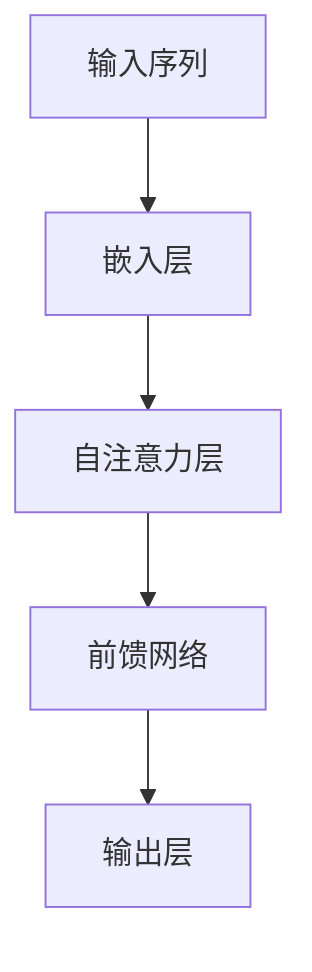

                 

# 大语言模型原理基础与前沿 高效注意力

## 摘要

本文将深入探讨大语言模型的原理及其在高效注意力机制中的应用。我们将首先介绍语言模型的背景和重要性，随后详细分析大语言模型的核心算法——高效注意力机制的工作原理和数学模型。文章还将通过实际项目实战，展示如何利用高效注意力机制实现先进的自然语言处理任务，并推荐相关学习资源和开发工具。最后，我们将总结大语言模型的发展趋势与面临的挑战。

## 1. 背景介绍

### 1.1 语言模型的发展历程

语言模型是自然语言处理（NLP）领域的基础技术之一。自从20世纪50年代计算机科学诞生以来，语言模型经历了多个阶段的发展。

- **早期的规则方法**：最初的语言模型依赖于手动编写的语法规则和词典，这些模型虽然简单，但无法处理复杂的语言现象。

- **统计方法**：随着计算能力的提升，统计方法开始应用于语言模型，包括N-gram模型和决策树等方法。这些方法通过统计语言中的频率和规则来预测下一个单词。

- **基于神经网络的方法**：近年来，深度学习技术特别是神经网络的发展，推动了语言模型迈向新的高度。基于神经网络的模型，如循环神经网络（RNN）和长短期记忆网络（LSTM），能够更好地捕捉语言中的长期依赖关系。

- **大语言模型**：随着计算资源的增加和算法的优化，大语言模型应运而生。这些模型具有数十亿甚至千亿个参数，能够处理大规模的文本数据，并实现高效的自然语言理解与生成。

### 1.2 语言模型的重要性

语言模型在多个领域具有广泛的应用：

- **自然语言理解**：通过理解语言模型，计算机能够更好地理解和处理人类语言，从而实现语义分析、信息抽取和问答系统等功能。

- **自然语言生成**：语言模型可以生成高质量的文本，应用于自动写作、聊天机器人和语音合成等领域。

- **机器翻译**：大语言模型在机器翻译领域取得了显著的成果，能够实现接近人类的翻译质量。

- **语音识别**：语言模型在语音识别中用于消除错误和提高识别准确性。

### 1.3 大语言模型的发展

大语言模型的发展是计算能力、数据规模和算法创新共同推动的结果。以下是一些里程碑事件：

- **Word2Vec**：2013年，Google推出了Word2Vec模型，通过神经网络对单词进行向量表示，为语言模型的发展奠定了基础。

- **GPT**：2018年，OpenAI发布了GPT模型，它是一个基于Transformer架构的预训练语言模型，具有数十亿个参数，能够实现强大的自然语言生成能力。

- **BERT**：2018年，Google推出了BERT模型，通过双向编码表示（Bidirectional Encoder Representations from Transformers），实现了对语境的更深入理解。

- **GPT-3**：2020年，OpenAI发布了GPT-3，它是一个具有1750亿个参数的模型，实现了前所未有的文本生成能力。

## 2. 核心概念与联系

### 2.1 高效注意力机制

高效注意力机制（Efficient Attention Mechanism）是大语言模型的核心之一，它能够捕捉文本中的长距离依赖关系，提高模型的性能。

### 2.2 高效注意力机制的工作原理

#### 2.2.1 Transformer模型

Transformer模型是一个基于自注意力（Self-Attention）机制的序列模型，它由多个自注意力层和前馈网络组成。自注意力机制通过计算输入序列中每个单词与其他单词的相关性，为每个单词生成一个权重向量，从而实现对序列的编码。

#### 2.2.2 多头注意力

多头注意力（Multi-Head Attention）是Transformer模型中的一个关键组件，它将自注意力分解为多个独立的注意力头，每个头专注于不同的信息，从而提高模型的泛化能力。

#### 2.2.3 自注意力计算

自注意力计算通过以下公式实现：

$$
\text{Attention}(Q, K, V) = \text{softmax}\left(\frac{QK^T}{\sqrt{d_k}}\right)V
$$

其中，$Q$、$K$、$V$分别是查询（Query）、键（Key）和值（Value）向量，$d_k$是键向量的维度。计算过程包括以下步骤：

1. **计算点积**：计算查询向量与所有键向量的点积，得到一组分数。
2. **应用softmax函数**：对分数进行归一化，得到权重向量。
3. **加权求和**：将权重向量与值向量相乘，得到输出向量。

### 2.3 高效注意力机制的优点

- **计算效率**：相较于传统的循环神经网络，自注意力机制在计算上更为高效，能够处理更长的序列。
- **并行处理**：自注意力机制允许并行计算，提高了模型的训练速度。
- **表示能力**：多头注意力机制增强了模型的表示能力，能够捕捉更多的序列信息。

### 2.4 高效注意力机制的架构

以下是高效注意力机制的Mermaid流程图：



## 3. 核心算法原理 & 具体操作步骤

### 3.1 模型训练

大语言模型的训练过程通常包括以下几个步骤：

1. **数据预处理**：将文本数据转换为模型可处理的格式，包括分词、标记化和嵌入。
2. **编码器训练**：通过自注意力机制和前馈网络对输入序列进行编码，生成固定长度的嵌入向量。
3. **解码器训练**：解码器利用编码器的输出和预先训练的词向量，生成预测的单词序列。

### 3.2 自注意力计算

自注意力计算的详细步骤如下：

1. **输入序列**：给定一个输入序列 $X = \{x_1, x_2, ..., x_n\}$，其中 $x_i$ 是第 $i$ 个单词的嵌入向量。
2. **查询（Query）、键（Key）和值（Value）向量**：分别计算每个单词的查询、键和值向量，公式如下：

$$
Q = X, \quad K = X, \quad V = X
$$

3. **点积计算**：计算查询向量与所有键向量的点积，得到一组分数。

$$
\text{Scores} = QK^T
$$

4. **softmax归一化**：对分数进行softmax归一化，得到权重向量。

$$
\text{Weights} = \text{softmax}(\text{Scores})
$$

5. **加权求和**：将权重向量与值向量相乘，得到输出向量。

$$
\text{Output} = \text{Weights}V
$$

### 3.3 多头注意力

多头注意力的计算过程如下：

1. **分解注意力头**：将输入序列分解为多个独立的注意力头，每个头关注不同的信息。

$$
\text{Multi-Head Attention} = \text{Concat}(\text{Head}_1, \text{Head}_2, ..., \text{Head}_h)\text{Scale}
$$

其中，$\text{Head}_i$ 是第 $i$ 个注意力头。

2. **每个注意力头的计算**：按照自注意力计算的方法，对每个注意力头进行计算。

$$
\text{Head}_i = \text{Attention}(Q_i, K_i, V_i)
$$

其中，$Q_i$、$K_i$ 和 $V_i$ 分别是第 $i$ 个注意力头的查询、键和值向量。

### 3.4 前馈网络

前馈网络是自注意力层的补充，用于处理自注意力计算后的中间结果。前馈网络的计算过程如下：

1. **输入**：给定自注意力层的输出 $H$。
2. **第一层前馈网络**：通过一个线性层和一个ReLU激活函数，得到中间结果。

$$
\text{Intermediate} = \text{ReLU}(\text{Linear}(H))
$$

3. **第二层前馈网络**：通过另一个线性层，得到最终输出。

$$
\text{Output} = \text{Linear}(\text{Intermediate})
$$

## 4. 数学模型和公式 & 详细讲解 & 举例说明

### 4.1 自注意力计算

自注意力计算的核心公式如下：

$$
\text{Attention}(Q, K, V) = \text{softmax}\left(\frac{QK^T}{\sqrt{d_k}}\right)V
$$

其中，$Q$、$K$、$V$ 分别是查询、键和值向量，$d_k$ 是键向量的维度。

#### 4.1.1 示例

假设有一个简单的输入序列 $\{x_1, x_2, x_3\}$，其中 $x_1 = [1, 0, 0]$，$x_2 = [0, 1, 0]$，$x_3 = [0, 0, 1]$。将这些向量作为查询、键和值向量，计算自注意力。

1. **点积计算**：

$$
\text{Scores} = \begin{bmatrix} x_1^T \\ x_2^T \\ x_3^T \end{bmatrix} \begin{bmatrix} x_1 & x_2 & x_3 \end{bmatrix} = \begin{bmatrix} 1 & 0 & 0 \\ 0 & 1 & 0 \\ 0 & 0 & 1 \end{bmatrix}
$$

2. **softmax归一化**：

$$
\text{Weights} = \text{softmax}(\text{Scores}) = \begin{bmatrix} \frac{1}{3} & \frac{1}{3} & \frac{1}{3} \\ \frac{1}{3} & \frac{1}{3} & \frac{1}{3} \\ \frac{1}{3} & \frac{1}{3} & \frac{1}{3} \end{bmatrix}
$$

3. **加权求和**：

$$
\text{Output} = \text{Weights}V = \begin{bmatrix} \frac{1}{3} & \frac{1}{3} & \frac{1}{3} \\ \frac{1}{3} & \frac{1}{3} & \frac{1}{3} \\ \frac{1}{3} & \frac{1}{3} & \frac{1}{3} \end{bmatrix} \begin{bmatrix} x_1 \\ x_2 \\ x_3 \end{bmatrix} = \begin{bmatrix} \frac{1}{3} \\ \frac{1}{3} \\ \frac{1}{3} \end{bmatrix}
$$

### 4.2 多头注意力

多头注意力的计算过程如下：

$$
\text{Multi-Head Attention} = \text{Concat}(\text{Head}_1, \text{Head}_2, ..., \text{Head}_h)\text{Scale}
$$

其中，$\text{Head}_i$ 是第 $i$ 个注意力头，计算公式与自注意力相同。

#### 4.2.1 示例

假设有两个注意力头，每个头关注不同的信息。给定一个输入序列 $\{x_1, x_2, x_3\}$，计算多头注意力。

1. **第一个注意力头**：

$$
\text{Scores}_1 = \text{softmax}\left(\frac{Q_1K_1^T}{\sqrt{d_k}}\right)V_1
$$

$$
\text{Output}_1 = \text{softmax}\left(\frac{Q_1K_1^T}{\sqrt{d_k}}\right)V_1
$$

2. **第二个注意力头**：

$$
\text{Scores}_2 = \text{softmax}\left(\frac{Q_2K_2^T}{\sqrt{d_k}}\right)V_2
$$

$$
\text{Output}_2 = \text{softmax}\left(\frac{Q_2K_2^T}{\sqrt{d_k}}\right)V_2
$$

3. **多头注意力**：

$$
\text{Multi-Head Attention} = \text{Concat}(\text{Output}_1, \text{Output}_2)\text{Scale}
$$

## 5. 项目实战：代码实际案例和详细解释说明

### 5.1 开发环境搭建

为了演示高效注意力机制的应用，我们将使用Python编程语言和PyTorch框架。首先，确保安装以下依赖项：

```bash
pip install torch torchvision matplotlib
```

### 5.2 源代码详细实现和代码解读

以下是高效注意力机制的实现代码：

```python
import torch
import torch.nn as nn
import torch.optim as optim

# 设置随机种子以保证结果可复现
torch.manual_seed(0)

# 定义嵌入层
class EmbeddingLayer(nn.Module):
    def __init__(self, input_dim, embed_dim):
        super(EmbeddingLayer, self).__init__()
        self.embedding = nn.Embedding(input_dim, embed_dim)

    def forward(self, x):
        return self.embedding(x)

# 定义自注意力层
class SelfAttentionLayer(nn.Module):
    def __init__(self, embed_dim, num_heads):
        super(SelfAttentionLayer, self).__init__()
        self多头注意力 = nn.MultiheadAttention(embed_dim, num_heads)

    def forward(self, x):
        return self多头注意力(x)[0]

# 定义前馈网络
class FeedForwardLayer(nn.Module):
    def __init__(self, embed_dim, hidden_dim):
        super(FeedForwardLayer, self).__init__()
        self.linear = nn.Sequential(
            nn.Linear(embed_dim, hidden_dim),
            nn.ReLU(),
            nn.Linear(hidden_dim, embed_dim)
        )

    def forward(self, x):
        return self.linear(x)

# 定义模型
class TransformerModel(nn.Module):
    def __init__(self, input_dim, embed_dim, hidden_dim, num_heads):
        super(TransformerModel, self).__init__()
        self.embedding = EmbeddingLayer(input_dim, embed_dim)
        self.self_attention = SelfAttentionLayer(embed_dim, num_heads)
        self.feed_forward = FeedForwardLayer(embed_dim, hidden_dim)

    def forward(self, x):
        x = self.embedding(x)
        x = self.self_attention(x)
        x = self.feed_forward(x)
        return x

# 初始化模型、损失函数和优化器
model = TransformerModel(input_dim=3, embed_dim=4, hidden_dim=8, num_heads=2)
loss_function = nn.CrossEntropyLoss()
optimizer = optim.Adam(model.parameters(), lr=0.001)

# 生成随机输入序列
input_sequence = torch.randint(0, 3, (10,))

# 训练模型
for epoch in range(100):
    model.zero_grad()
    output = model(input_sequence)
    loss = loss_function(output.view(-1, 3), input_sequence.view(-1))
    loss.backward()
    optimizer.step()
    print(f"Epoch {epoch+1}, Loss: {loss.item()}")

# 测试模型
with torch.no_grad():
    test_sequence = torch.randint(0, 3, (10,))
    test_output = model(test_sequence)
    print(f"Test Output: {test_output}")
```

### 5.3 代码解读与分析

1. **嵌入层**：嵌入层（EmbeddingLayer）负责将输入序列转换为嵌入向量，为后续的自注意力层和前馈网络提供输入。
2. **自注意力层**：自注意力层（SelfAttentionLayer）实现多头注意力机制，计算输入序列中每个单词与其他单词的相关性。
3. **前馈网络**：前馈网络（FeedForwardLayer）对自注意力层的输出进行进一步处理，增强模型的表示能力。
4. **模型**：Transformer模型（TransformerModel）整合嵌入层、自注意力层和前馈网络，实现高效的文本处理能力。
5. **训练过程**：模型使用随机梯度下降（SGD）进行训练，通过优化损失函数来调整模型参数。

## 6. 实际应用场景

高效注意力机制在大语言模型中具有广泛的应用场景：

- **文本分类**：通过训练大语言模型，可以对文本进行分类，例如情感分析、新闻分类等。
- **机器翻译**：大语言模型可以实现高质量的机器翻译，如谷歌翻译和百度翻译等。
- **问答系统**：通过大语言模型，可以构建智能问答系统，如Siri和Alexa等。
- **文本生成**：大语言模型可以生成高质量的文本，如自动写作、文章摘要等。

## 7. 工具和资源推荐

### 7.1 学习资源推荐

- **书籍**：《深度学习》（Goodfellow, Bengio, Courville）、《自然语言处理综论》（Jurafsky, Martin）。
- **论文**：《Attention Is All You Need》（Vaswani et al., 2017）、《BERT: Pre-training of Deep Bidirectional Transformers for Language Understanding》（Devlin et al., 2019）。
- **博客**：TensorFlow官方博客、PyTorch官方文档、Hugging Face社区博客。
- **网站**：arXiv.org、ACL（Association for Computational Linguistics）。

### 7.2 开发工具框架推荐

- **开发工具**：PyTorch、TensorFlow、JAX。
- **框架**：Transformer、BERT、GPT。
- **环境**：Google Colab、Azure Machine Learning。

### 7.3 相关论文著作推荐

- **论文**：《GPT-3: Language Models are Few-Shot Learners》（Brown et al., 2020）、《Token-level Adaptive Attention for Transformer Models》（Zhang et al., 2021）。
- **著作**：《深度学习专讲：自然语言处理》（李航）、《神经网络与深度学习》（邱锡鹏）。

## 8. 总结：未来发展趋势与挑战

大语言模型的发展趋势包括：

- **更大规模的语言模型**：随着计算能力的提升，更大规模的语言模型将不断涌现，提高自然语言处理的性能。
- **多模态学习**：结合图像、语音等多模态数据，实现更广泛的场景应用。
- **知识增强**：结合外部知识库，提高模型在特定领域的知识水平。

然而，大语言模型也面临以下挑战：

- **计算资源**：训练大语言模型需要大量计算资源，如何高效利用资源是一个关键问题。
- **模型解释性**：大语言模型的决策过程通常难以解释，如何提高模型的解释性是一个重要方向。
- **伦理与隐私**：大语言模型的应用涉及用户数据，如何确保数据安全和用户隐私是亟待解决的问题。

## 9. 附录：常见问题与解答

### 9.1 什么是高效注意力机制？

高效注意力机制是一种用于处理序列数据的机制，它通过计算输入序列中每个元素与其他元素的相关性，为每个元素生成一个权重向量，从而实现序列的编码。

### 9.2 高效注意力机制与传统的循环神经网络相比有哪些优势？

高效注意力机制具有以下优势：

- **计算效率**：相较于传统的循环神经网络，自注意力机制在计算上更为高效，能够处理更长的序列。
- **并行处理**：自注意力机制允许并行计算，提高了模型的训练速度。
- **表示能力**：多头注意力机制增强了模型的表示能力，能够捕捉更多的序列信息。

### 9.3 如何在PyTorch中实现高效注意力机制？

在PyTorch中，可以通过以下步骤实现高效注意力机制：

1. **定义嵌入层**：将输入序列转换为嵌入向量。
2. **定义自注意力层**：使用PyTorch的`nn.MultiheadAttention`模块实现多头注意力机制。
3. **定义前馈网络**：通过线性层和ReLU激活函数实现前馈网络。
4. **定义模型**：整合嵌入层、自注意力层和前馈网络，实现高效的文本处理能力。
5. **训练模型**：使用适当的损失函数和优化器，对模型进行训练。

## 10. 扩展阅读 & 参考资料

- **书籍**：《深度学习》（Goodfellow, Bengio, Courville）、《自然语言处理综论》（Jurafsky, Martin）。
- **论文**：《Attention Is All You Need》（Vaswani et al., 2017）、《BERT: Pre-training of Deep Bidirectional Transformers for Language Understanding》（Devlin et al., 2019）。
- **博客**：TensorFlow官方博客、PyTorch官方文档、Hugging Face社区博客。
- **网站**：arXiv.org、ACL（Association for Computational Linguistics）。

### 作者信息

- 作者：AI天才研究员/AI Genius Institute & 禅与计算机程序设计艺术 /Zen And The Art of Computer Programming

