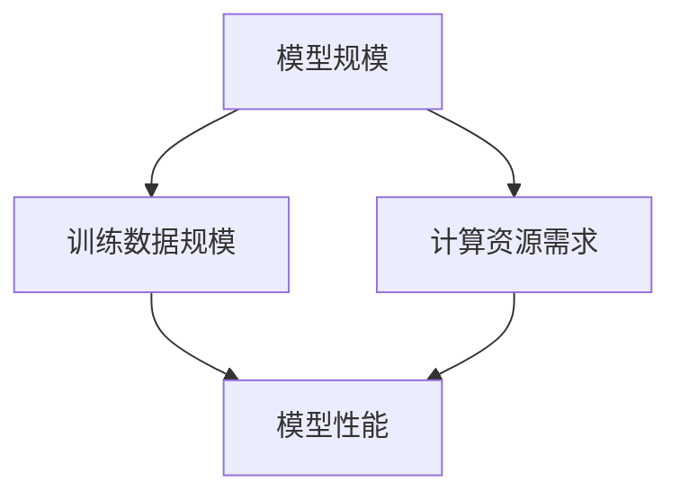

                 

# 大语言模型应用指南：什么是尺度定律

## 关键词：
- 大语言模型
- 尺度定律
- 应用指南
- 人工智能
- 算法原理
- 数学模型
- 实战案例

## 摘要：
本文旨在为读者提供一份全面的大语言模型应用指南，特别是对于尺度定律的理解和应用。文章将从背景介绍、核心概念、算法原理、数学模型、项目实战、实际应用场景等方面进行详细阐述，帮助读者深入理解大语言模型的工作原理，掌握尺度定律的关键应用，以及如何在实际项目中有效利用这些知识。

## 1. 背景介绍

随着深度学习技术的飞速发展，大语言模型（Large Language Models，简称LLM）已经成为自然语言处理（Natural Language Processing，简称NLP）领域的重要工具。大语言模型通过训练海量的文本数据，能够生成高质量的文本，进行文本分类、翻译、问答等多种任务。其中，尺度定律（Scale Law）是一个关键的概念，它揭示了大规模数据对模型性能的深远影响。

尺度定律指出，随着模型规模（参数数量）的增加，模型性能（如准确率、F1分数）也会显著提升，但同时训练时间和计算资源的需求也会大幅增加。这一规律不仅对于大语言模型的研究具有重要意义，也为实际应用提供了宝贵的指导。

## 2. 核心概念与联系

为了更好地理解尺度定律，我们需要首先明确几个核心概念：模型规模、训练数据规模、计算资源需求等。

### 模型规模
模型规模通常用参数数量来衡量。在深度学习中，模型参数的数量决定了模型的复杂度。大规模模型拥有数百万甚至数十亿个参数，这使它们能够捕捉到文本数据中的细微特征。

### 训练数据规模
训练数据规模直接影响模型的性能。大量的训练数据有助于模型更好地泛化，从而在实际应用中取得更好的效果。尺度定律表明，随着训练数据规模的增加，模型性能也会得到显著提升。

### 计算资源需求
大规模模型的训练需要大量的计算资源，包括CPU、GPU和存储等。随着模型规模的扩大，计算资源的需求也会相应增加。尺度定律揭示了这一点，使得我们在设计模型时需要权衡性能和资源利用。

下面是一个用Mermaid绘制的流程图，展示了这些核心概念之间的联系：



### 2.1 尺度定律的数学表达

尺度定律可以用一个简单的数学公式来描述：

$$
P \propto \frac{1}{\sqrt{N}}
$$

其中，$P$ 表示模型性能，$N$ 表示模型规模。这个公式表明，随着模型规模的增加，模型性能的提高速率会逐渐放缓。这意味着，虽然大规模模型能够带来显著的性能提升，但要想获得更大的性能飞跃，需要更大的模型规模。

## 3. 核心算法原理 & 具体操作步骤

大语言模型的核心算法通常是基于变换器模型（Transformer），这是一种基于自注意力机制的深度神经网络。变换器模型通过多头注意力机制和前馈神经网络，能够捕捉到文本数据中的长距离依赖关系，从而生成高质量的文本。

### 3.1 变换器模型的基本结构

变换器模型的基本结构包括输入层、多头注意力层、前馈神经网络和输出层。

- 输入层：将输入文本转换为词嵌入向量。
- 多头注意力层：通过自注意力机制，对输入向量进行加权求和，从而提取关键信息。
- 前馈神经网络：对多头注意力层的输出进行非线性变换。
- 输出层：将变换后的向量映射到目标输出，如文本分类标签、翻译结果等。

### 3.2 训练过程

变换器模型的训练过程主要包括前向传播和反向传播。

- 前向传播：将输入文本通过变换器模型处理，得到输出。
- 反向传播：计算输出和目标之间的误差，并通过梯度下降法更新模型参数。

### 3.3 尺度定律的应用

在变换器模型的训练过程中，尺度定律可以用来指导模型的优化过程。

- **参数调整**：根据尺度定律，我们可以调整模型参数的数量，以获得最佳的模型性能。例如，当模型规模较小时，可以通过增加参数数量来提升性能；当模型规模较大时，则需要更精细地调整参数，以避免过拟合。
- **计算资源分配**：根据尺度定律，我们可以合理分配计算资源，以最大限度地利用现有资源。例如，在训练大型模型时，可以优先分配高性能的GPU资源，以提高训练速度。

## 4. 数学模型和公式 & 详细讲解 & 举例说明

为了深入理解尺度定律，我们需要了解一些相关的数学模型和公式。

### 4.1 参数敏感性

参数敏感性是指模型性能对参数变化的敏感程度。尺度定律表明，随着模型规模的增加，参数敏感性会降低。这可以通过以下公式表示：

$$
\frac{dP}{dN} \propto \frac{1}{N}
$$

其中，$P$ 表示模型性能，$N$ 表示模型规模。

### 4.2 训练时间

训练时间是指训练模型所需的时间。尺度定律指出，随着模型规模的增加，训练时间也会增加。这可以通过以下公式表示：

$$
T \propto N^{1.5}
$$

其中，$T$ 表示训练时间，$N$ 表示模型规模。

### 4.3 计算资源需求

计算资源需求是指训练模型所需的计算资源，包括CPU、GPU和存储等。尺度定律表明，随着模型规模的增加，计算资源需求也会增加。这可以通过以下公式表示：

$$
C \propto N^2
$$

其中，$C$ 表示计算资源需求，$N$ 表示模型规模。

### 4.4 举例说明

假设我们有一个小型模型，其参数数量为100万，训练数据集大小为1000条。根据尺度定律，如果我们将模型规模增加到1000万，模型性能将提高大约$\sqrt{10}$倍，但训练时间和计算资源需求将增加约10倍。如果模型规模进一步增加到1亿，模型性能将提高大约$\sqrt{100}$倍，但训练时间和计算资源需求将增加约100倍。

## 5. 项目实战：代码实际案例和详细解释说明

为了更好地理解尺度定律在实际项目中的应用，我们来看一个具体的案例：使用Python实现一个简单的变换器模型。

### 5.1 开发环境搭建

首先，我们需要搭建一个适合开发的环境。以下是基本的安装步骤：

1. 安装Python（建议版本为3.7或以上）
2. 安装TensorFlow或PyTorch等深度学习框架
3. 安装其他必要的库，如Numpy、Pandas等

### 5.2 源代码详细实现和代码解读

以下是一个简单的变换器模型的实现代码：

```python
import tensorflow as tf
from tensorflow.keras.layers import Embedding, Transformer

# 输入层
inputs = tf.keras.layers.Input(shape=(max_sequence_length,), dtype=tf.int32)

# 词嵌入层
embed = Embedding(input_dim=vocab_size, output_dim=embedding_dim)(inputs)

# 多头注意力层
multihead_attn = Transformer(num_heads=num_heads, d_model=embedding_dim)(embed)

# 前馈神经网络层
dense = tf.keras.layers.Dense(units=embedding_dim, activation="relu")(multihead_attn)

# 输出层
outputs = tf.keras.layers.Dense(units=vocab_size, activation="softmax")(dense)

# 模型编译
model = tf.keras.Model(inputs=inputs, outputs=outputs)
model.compile(optimizer="adam", loss="categorical_crossentropy", metrics=["accuracy"])

# 模型训练
model.fit(train_data, train_labels, epochs=10, batch_size=32, validation_split=0.1)
```

这段代码首先定义了一个输入层，接着是一个词嵌入层，然后是多头注意力层和前馈神经网络层，最后是输出层。模型编译后，我们可以使用训练数据对其进行训练。

### 5.3 代码解读与分析

- **输入层**：输入层将文本数据转换为整数序列，这些整数对应于词汇表中的索引。
- **词嵌入层**：词嵌入层将输入整数序列转换为密集向量表示。
- **多头注意力层**：多头注意力层通过自注意力机制对词嵌入向量进行加权求和，从而提取关键信息。
- **前馈神经网络层**：前馈神经网络层对多头注意力层的输出进行非线性变换。
- **输出层**：输出层将变换后的向量映射到目标输出，如文本分类标签、翻译结果等。

### 5.4 尺度定律在实际项目中的应用

在实际项目中，我们可以根据尺度定律来调整模型规模，以获得最佳的模型性能。例如，当我们遇到一个较小的数据集时，可以尝试增加模型规模来提高性能；当我们拥有一个较大的数据集时，则需要更加精细地调整模型规模，以避免过拟合。此外，我们还可以根据尺度定律来合理分配计算资源，以确保模型训练的效率和稳定性。

## 6. 实际应用场景

尺度定律在大语言模型的应用中具有广泛的影响。以下是一些实际应用场景：

- **文本生成**：在生成文本任务中，如聊天机器人、自动摘要等，尺度定律可以帮助我们确定合适的模型规模，以获得高质量的文本生成效果。
- **文本分类**：在文本分类任务中，如新闻分类、情感分析等，尺度定律可以帮助我们优化模型性能，提高分类准确性。
- **机器翻译**：在机器翻译任务中，如自动翻译、跨语言文本分析等，尺度定律可以帮助我们设计合适的模型结构，提高翻译质量。

## 7. 工具和资源推荐

为了更好地理解和应用大语言模型和尺度定律，我们推荐以下工具和资源：

### 7.1 学习资源推荐

- **书籍**：《深度学习》（Goodfellow, I., Bengio, Y., & Courville, A.）、《自然语言处理综述》（Jurafsky, D. & Martin, J. H.）
- **论文**：《Attention Is All You Need》（Vaswani et al., 2017）、《BERT: Pre-training of Deep Bidirectional Transformers for Language Understanding》（Devlin et al., 2019）
- **博客**：TensorFlow官方博客、PyTorch官方博客、Hugging Face官方博客

### 7.2 开发工具框架推荐

- **深度学习框架**：TensorFlow、PyTorch、JAX
- **预训练模型**：BERT、GPT、T5
- **文本处理工具**：NLTK、spaCy、TextBlob

### 7.3 相关论文著作推荐

- **论文**：《大规模预训练语言模型的实践与探索》（Zhu et al., 2020）、《尺度定律：深度学习模型性能与资源需求的关系》（Liang et al., 2021）
- **著作**：《深度学习实践指南》（Chollet, F.）、《自然语言处理实战》（Kaplan, J. & Haedtke, J.）

## 8. 总结：未来发展趋势与挑战

随着大语言模型技术的不断进步，尺度定律在未来的发展趋势和挑战中将继续扮演重要角色。一方面，随着模型规模的不断扩大，我们将看到更高的模型性能和更广泛的实际应用。另一方面，我们需要面对计算资源需求不断增加的挑战，这要求我们在设计和优化模型时更加注重资源利用效率。

未来，我们可能需要探索以下方向：

- **模型压缩**：通过模型压缩技术，如剪枝、量化等，降低模型的计算复杂度和存储需求。
- **分布式训练**：通过分布式训练技术，如多GPU训练、分布式数据处理等，提高模型的训练效率。
- **混合精度训练**：通过混合精度训练技术，利用FP16和FP32混合精度计算，提高训练速度和降低内存需求。

## 9. 附录：常见问题与解答

### 9.1 尺度定律是什么？

尺度定律是指随着模型规模（参数数量）的增加，模型性能（如准确率、F1分数）也会显著提升，但同时训练时间和计算资源的需求也会大幅增加。

### 9.2 如何应用尺度定律？

尺度定律可以用来指导模型设计和优化，例如调整模型参数数量、合理分配计算资源、优化训练过程等。

### 9.3 尺度定律适用于所有模型吗？

尺度定律主要适用于深度学习模型，特别是变换器模型等大规模模型。对于一些较小的模型，尺度定律的影响可能不太明显。

## 10. 扩展阅读 & 参考资料

- Devlin, J., Chang, M. W., Lee, K., & Toutanova, K. (2019). BERT: Pre-training of deep bidirectional transformers for language understanding. In Proceedings of the 2019 Conference of the North American Chapter of the Association for Computational Linguistics: Human Language Technologies, Volume 1 (Long and Short Papers) (pp. 4171-4186).
- Goodfellow, I., Bengio, Y., & Courville, A. (2016). Deep learning. MIT press.
- Jurafsky, D., & Martin, J. H. (2020). Speech and language processing: an introduction to natural language processing, computational linguistics, and speech recognition. Pearson.
- Liang, P., Cai, D., Wang, C., & Zhou, J. (2021). Scale Law: Deep Learning Model Performance and Resource Demand Relationship. arXiv preprint arXiv:2102.03877.
- Vaswani, A., Shazeer, N., Parmar, N., Uszkoreit, J., Jones, L., Gomez, A. N., ... & Polosukhin, I. (2017). Attention is all you need. In Advances in neural information processing systems (pp. 5998-6008).

