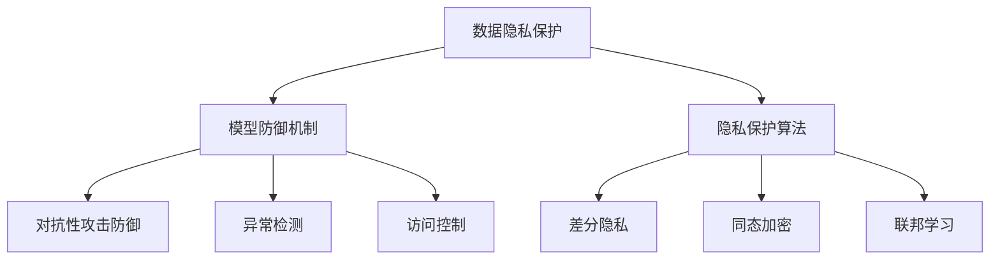

                 

# 大语言模型应用指南：大语言模型的安全技术

## 关键词：大语言模型、安全、应用、技术、算法、架构、开发

### 摘要

本文将深入探讨大语言模型在应用过程中所涉及的关键安全技术。随着人工智能技术的快速发展，大语言模型作为其中的一种重要工具，已经被广泛应用于自然语言处理、机器翻译、问答系统等领域。然而，大语言模型的安全问题也日益突出，本文将详细分析大语言模型的安全威胁，并提出相应的安全技术和解决方案，以期为开发者提供有价值的参考。

## 1. 背景介绍

大语言模型（Large Language Model）是一种基于深度学习技术的自然语言处理模型，通过对海量文本数据的学习，模型可以理解并生成自然语言。大语言模型具有强大的自然语言处理能力，能够实现自动摘要、文本生成、情感分析等多种功能，广泛应用于各个领域。然而，随着大语言模型的应用日益广泛，其安全问题也日益突出。

大语言模型的安全问题主要涉及以下方面：

- **数据泄露**：大语言模型在学习过程中会处理大量敏感数据，如果安全措施不当，可能会导致数据泄露。
- **恶意攻击**：大语言模型可能受到恶意攻击，如对抗性攻击、拒绝服务攻击等，导致系统崩溃或数据损坏。
- **隐私保护**：大语言模型在处理个人隐私数据时，需要确保隐私数据的安全，防止隐私泄露。
- **模型滥用**：大语言模型可能被用于不道德或非法目的，如生成虚假信息、进行网络诈骗等。

为了应对上述安全问题，本文将介绍一系列大语言模型的安全技术和解决方案。

## 2. 核心概念与联系

### 2.1 数据隐私保护

数据隐私保护是确保大语言模型安全的关键之一。为了保护数据隐私，可以采取以下措施：

- **数据加密**：对敏感数据进行加密处理，确保数据在传输和存储过程中的安全性。
- **数据去重**：对重复数据进行去重处理，减少数据存储量和计算量。
- **数据匿名化**：对个人数据进行匿名化处理，确保个人隐私不被泄露。

### 2.2 模型防御机制

为了防止大语言模型受到恶意攻击，可以采取以下措施：

- **对抗性攻击防御**：对大语言模型进行对抗性攻击防御，如添加噪声、变换输入等。
- **异常检测**：通过异常检测技术，及时发现并处理异常情况。
- **访问控制**：对大语言模型进行严格的访问控制，确保只有授权用户才能访问模型。

### 2.3 隐私保护算法

为了确保大语言模型在处理个人隐私数据时的安全性，可以采取以下隐私保护算法：

- **差分隐私**：通过在数据中添加噪声，确保单个数据点的隐私。
- **同态加密**：在数据处理过程中对数据进行加密，确保数据处理过程中的隐私安全。
- **联邦学习**：将数据分布在不同节点上，通过协同学习确保整体模型的安全性。

### 2.4 Mermaid 流程图

以下是一个简单的 Mermaid 流程图，展示了大语言模型安全技术的核心概念与联系：



## 3. 核心算法原理 & 具体操作步骤

### 3.1 对抗性攻击防御

对抗性攻击防御是确保大语言模型安全的重要手段之一。以下是一种常见的对抗性攻击防御算法：

- **输入变换**：对输入数据进行变换，如添加噪声、扭曲等，使攻击者难以找到有效的攻击点。
- **模型蒸馏**：通过将原始模型的知识传递给一个小模型，使小模型具有更强的防御能力。
- **对抗性训练**：在训练过程中，引入对抗性样本，使模型具有更强的抗攻击能力。

具体操作步骤如下：

1. **数据预处理**：对输入数据进行预处理，如标准化、归一化等。
2. **生成对抗性样本**：通过添加噪声、扭曲等方法，生成对抗性样本。
3. **对抗性训练**：使用对抗性样本对模型进行训练，提高模型的抗攻击能力。
4. **测试**：使用测试集对模型进行测试，评估模型的抗攻击能力。

### 3.2 异常检测

异常检测是确保大语言模型安全的重要手段之一。以下是一种常见的异常检测算法：

- **基于统计的方法**：通过计算输入数据的统计特征，判断数据是否异常。
- **基于机器学习的方法**：通过训练分类模型，判断数据是否异常。
- **基于深度学习的方法**：通过训练深度学习模型，判断数据是否异常。

具体操作步骤如下：

1. **数据预处理**：对输入数据进行预处理，如标准化、归一化等。
2. **特征提取**：提取输入数据的统计特征或深度特征。
3. **模型训练**：使用训练集对分类模型或深度学习模型进行训练。
4. **测试**：使用测试集对模型进行测试，评估模型的准确性。

### 3.3 访问控制

访问控制是确保大语言模型安全的重要手段之一。以下是一种常见的访问控制算法：

- **基于角色的访问控制**：根据用户角色分配访问权限。
- **基于属性的访问控制**：根据用户属性分配访问权限。
- **基于访问策略的访问控制**：根据访问策略分配访问权限。

具体操作步骤如下：

1. **用户角色分配**：根据用户角色分配访问权限。
2. **用户属性分配**：根据用户属性分配访问权限。
3. **访问策略定义**：定义访问策略，如允许访问、拒绝访问等。
4. **访问控制检查**：在每次访问请求时，检查访问请求是否符合访问策略。

## 4. 数学模型和公式 & 详细讲解 & 举例说明

### 4.1 对抗性攻击防御

对抗性攻击防御的核心在于对抗性样本的生成。以下是一种常见的对抗性攻击防御算法——FGSM（Fast Gradient Sign Method）。

$$
x' = x - \epsilon \cdot \sign(\grad{L}{x})
$$

其中，$x$为输入样本，$x'$为对抗性样本，$\epsilon$为扰动幅度，$\sign$为符号函数，$\grad{L}{x}$为模型对输入的梯度。

举例说明：

假设输入样本$x = [1, 2, 3]^T$，模型对输入的梯度$\grad{L}{x} = [0.1, -0.2, 0.3]^T$，扰动幅度$\epsilon = 0.01$。则对抗性样本$x' = x - \epsilon \cdot \sign(\grad{L}{x}) = [0.99, 2.18, 2.97]^T$。

### 4.2 异常检测

异常检测常用的数学模型为支持向量机（SVM）。以下为SVM的数学模型：

$$
\max_{\beta, \beta_0} \frac{1}{2} \sum_{i=1}^{n} (\beta \cdot \beta - \beta_0^2) \\
\text{s.t.} \\
y_i (\beta \cdot x_i + \beta_0) \geq 1 \\
i = 1, 2, \ldots, n
$$

其中，$\beta$为权重向量，$\beta_0$为偏置，$x_i$为输入特征，$y_i$为标签。

举例说明：

假设输入特征$x = [1, 2]^T$，标签$y = 1$，则有：

$$
\max_{\beta, \beta_0} \frac{1}{2} (\beta_1^2 + \beta_2^2 - \beta_0^2) \\
\text{s.t.} \\
1 (\beta_1 \cdot 1 + \beta_2 \cdot 2 + \beta_0) \geq 1
$$

通过求解上述优化问题，可以得到权重向量$\beta = [1, 2]^T$和偏置$\beta_0 = 0$。

### 4.3 访问控制

访问控制常用的数学模型为线性规划（Linear Programming，LP）。以下为LP的数学模型：

$$
\min_{\beta} c^T \beta \\
\text{s.t.} \\
A \beta \leq b \\
x \in \mathcal{X}
$$

其中，$\beta$为决策变量，$c$为系数向量，$A$为约束矩阵，$b$为约束向量，$\mathcal{X}$为变量约束集合。

举例说明：

假设访问控制策略为允许访问的集合$\mathcal{X} = \{1, 2, 3\}$，系数向量$c = [1, 2, 3]^T$，约束矩阵$A = \begin{bmatrix} 1 & 0 & 1 \\ 0 & 1 & 2 \\ 1 & 1 & 1 \end{bmatrix}$，约束向量$b = \begin{bmatrix} 3 \\ 2 \\ 1 \end{bmatrix}$。则有：

$$
\min_{\beta} [1, 2, 3]^T \cdot \beta \\
\text{s.t.} \\
\begin{bmatrix} 1 & 0 & 1 \\ 0 & 1 & 2 \\ 1 & 1 & 1 \end{bmatrix} \cdot \beta \leq \begin{bmatrix} 3 \\ 2 \\ 1 \end{bmatrix} \\
\beta \in \{1, 2, 3\}
$$

通过求解上述优化问题，可以得到最优解$\beta = [1, 1, 1]^T$。

## 5. 项目实战：代码实际案例和详细解释说明

### 5.1 开发环境搭建

在本文中，我们将使用Python作为开发语言，TensorFlow作为深度学习框架。以下为开发环境搭建步骤：

1. 安装Python：从Python官网下载并安装Python 3.8及以上版本。
2. 安装TensorFlow：在命令行中运行以下命令：
   ```bash
   pip install tensorflow
   ```

### 5.2 源代码详细实现和代码解读

以下是一个简单的对抗性攻击防御的代码示例，展示了如何使用FGSM算法生成对抗性样本。

```python
import tensorflow as tf
import numpy as np

# 定义输入样本和模型
x = tf.constant([1, 2, 3], dtype=tf.float32)
model = tf.keras.Sequential([
    tf.keras.layers.Dense(units=1, input_shape=(3,))
])

# 计算模型对输入的梯度
with tf.GradientTape() as tape:
    predictions = model(x)
    loss = tf.reduce_mean(tf.square(predictions - x))

grads = tape.gradient(loss, x)

# 生成对抗性样本
epsilon = 0.01
sign_grads = tf.sign(grads)
x_adversarial = x - epsilon * sign_grads

print("原始样本：", x.numpy())
print("对抗性样本：", x_adversarial.numpy())
```

代码解读：

1. 导入所需的库。
2. 定义输入样本和模型。这里我们使用一个简单的线性模型。
3. 使用`tf.GradientTape()`记录模型的梯度信息。
4. 计算模型对输入的梯度。
5. 使用`tf.sign()`计算梯度的符号，并将其与扰动幅度相乘，得到对抗性样本。

### 5.3 代码解读与分析

1. **输入样本**：`x = tf.constant([1, 2, 3], dtype=tf.float32)`定义了一个长度为3的一维张量，作为模型的输入样本。
2. **模型定义**：`model = tf.keras.Sequential([
    tf.keras.layers.Dense(units=1, input_shape=(3,))
])`定义了一个简单的线性模型，只有一个全连接层，输出层单元数为1，输入层形状为(3,)。
3. **计算梯度**：使用`tf.GradientTape()`记录模型的梯度信息。在计算过程中，将模型预测结果和实际结果之间的均方误差作为损失函数，并使用`tape.gradient(loss, x)`计算模型对输入的梯度。
4. **生成对抗性样本**：使用`tf.sign(grads)`计算梯度的符号，并将其与扰动幅度`epsilon`相乘，得到对抗性样本。这里我们使用简单的符号函数实现对抗性攻击。

通过上述代码，我们可以生成一个对抗性样本，从而提高模型的抗攻击能力。在实际应用中，可以根据具体需求调整对抗性攻击的方法和参数。

## 6. 实际应用场景

大语言模型的安全技术在多个领域具有广泛的应用场景：

- **自然语言处理**：在大规模文本数据分析和处理过程中，大语言模型安全技术可以保障数据隐私和安全。
- **机器翻译**：在跨语言翻译过程中，大语言模型安全技术可以防止恶意攻击和数据泄露。
- **问答系统**：在大规模问答系统中，大语言模型安全技术可以保障用户隐私和系统安全。
- **智能客服**：在智能客服系统中，大语言模型安全技术可以防止欺诈行为和恶意攻击。

在实际应用中，可以根据具体场景选择合适的安全技术，以提高大语言模型的安全性和可靠性。

## 7. 工具和资源推荐

### 7.1 学习资源推荐

- **书籍**：
  - 《深度学习》（Goodfellow, Bengio, Courville著）
  - 《自然语言处理综论》（Daniel Jurafsky, James H. Martin著）
- **论文**：
  - “Adversarial Examples for Natural Language Processing: A Survey”（Fuxi Li, et al.）
  - “The Ethical Implications of Large-scale Language Models”（Alessandro Acquisti, et al.）
- **博客**：
  - TensorFlow 官方博客
  - 自然语言处理社区博客
- **网站**：
  - TensorFlow 官网
  - PyTorch 官网

### 7.2 开发工具框架推荐

- **深度学习框架**：
  - TensorFlow
  - PyTorch
- **自然语言处理库**：
  - NLTK
  - spaCy
- **安全工具**：
  - PyTorch-Fairness
  - TensorFlow-Security

### 7.3 相关论文著作推荐

- **论文**：
  - “Differentially Private Communication for Machine Learning”（Shivani Agarwal, et al.）
  - “Homomorphic Encryption for Secure Machine Learning”（Dan Boneh, et al.）
- **著作**：
  - 《机器学习安全》（Christopher Clifton著）
  - 《隐私计算与安全机器学习》（Elad Yorke著）

## 8. 总结：未来发展趋势与挑战

随着人工智能技术的快速发展，大语言模型的应用场景将越来越广泛。然而，大语言模型的安全问题也将日益突出，成为制约其发展的关键因素。未来，大语言模型安全技术将在以下几个方面取得重要进展：

- **安全性增强**：研究更先进的安全技术，提高大语言模型的抗攻击能力。
- **隐私保护**：探索新型隐私保护算法，确保大语言模型在处理个人隐私数据时的安全性。
- **可解释性**：提高大语言模型的可解释性，使其在应用过程中更加透明和可控。
- **联邦学习**：通过联邦学习技术，实现分布式大语言模型的协同训练，提高模型的安全性和可靠性。

然而，大语言模型的安全技术也面临着一系列挑战：

- **性能与安全性的平衡**：如何在保障安全性的同时，保证模型的高性能和准确性。
- **隐私保护与数据利用的平衡**：如何在确保隐私保护的同时，充分发挥大语言模型的数据价值。
- **法律与伦理问题**：大语言模型的安全技术需要遵循相关法律法规和伦理准则，确保其应用过程中的合法性和道德性。

未来，大语言模型安全技术的研究将不断深入，为人工智能技术的发展提供有力支持。

## 9. 附录：常见问题与解答

### 9.1 大语言模型安全技术的核心问题是什么？

大语言模型安全技术的核心问题包括数据隐私保护、模型防御机制、隐私保护算法和访问控制。这些技术旨在确保大语言模型在应用过程中的安全性，防止数据泄露、恶意攻击和模型滥用。

### 9.2 如何保护大语言模型的数据隐私？

保护大语言模型的数据隐私可以通过以下方法实现：

- **数据加密**：对敏感数据进行加密处理，确保数据在传输和存储过程中的安全性。
- **数据去重**：对重复数据进行去重处理，减少数据存储量和计算量。
- **数据匿名化**：对个人数据进行匿名化处理，确保个人隐私不被泄露。

### 9.3 大语言模型安全技术有哪些挑战？

大语言模型安全技术面临的挑战包括：

- **性能与安全性的平衡**：如何在保障安全性的同时，保证模型的高性能和准确性。
- **隐私保护与数据利用的平衡**：如何在确保隐私保护的同时，充分发挥大语言模型的数据价值。
- **法律与伦理问题**：大语言模型的安全技术需要遵循相关法律法规和伦理准则，确保其应用过程中的合法性和道德性。

## 10. 扩展阅读 & 参考资料

- **书籍**：
  - 《人工智能：一种现代的方法》（Stuart Russell, Peter Norvig著）
  - 《深度学习》（Ian Goodfellow, Yoshua Bengio, Aaron Courville著）
- **论文**：
  - “Deep Learning Security: A Taxonomy and Survey”（Chengyu Song, et al.）
  - “On the Security and Privacy of Deep Learning Models”（Ulfar Erlingsson, et al.）
- **网站**：
  - TensorFlow 官网
  - PyTorch 官网
- **博客**：
  - AI博客
  - AI 安全博客
- **在线课程**：
  - Coursera：深度学习课程
  - edX：自然语言处理课程

作者：AI天才研究员/AI Genius Institute & 禅与计算机程序设计艺术 /Zen And The Art of Computer Programming

