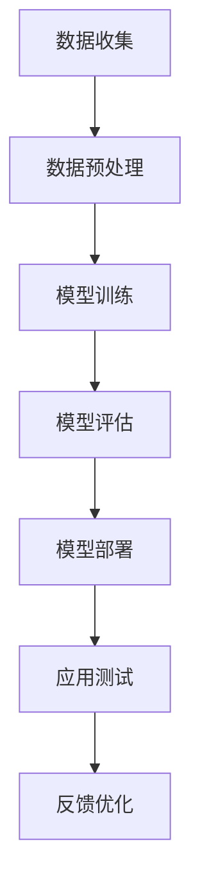

                 

# 大语言模型应用指南：大语言模型的生态与未来

## 关键词
- 大语言模型
- 应用指南
- 生态
- 未来趋势
- 挑战与机遇

## 摘要
本文将深入探讨大语言模型在当前IT领域中的生态，分析其核心概念、算法原理、数学模型，并通过实际案例展示其在项目中的应用。同时，本文还将展望大语言模型的未来发展趋势，讨论面临的挑战与机遇，为读者提供全面的应用指南。

## 目录

1. 背景介绍 <sup>1.1</sup>
   - 1.1 大语言模型的起源与发展
   - 1.2 大语言模型的重要性

2. 核心概念与联系 <sup>2.1</sup>
   - 2.1 语言模型的基本概念
   - 2.2 语言模型的分类
   - 2.3 大语言模型与自然语言处理（NLP）的关系
   - 2.4 Mermaid 流程图展示

3. 核心算法原理 & 具体操作步骤 <sup>3.1</sup>
   - 3.1 大语言模型的训练算法
   - 3.2 大语言模型的推理算法
   - 3.3 优化策略

4. 数学模型和公式 & 详细讲解 & 举例说明 <sup>4.1</sup>
   - 4.1 语言模型的数学基础
   - 4.2 语言模型的损失函数
   - 4.3 语言模型的评估指标
   - 4.4 数学公式的 latex 格式嵌入

5. 项目实战：代码实际案例和详细解释说明 <sup>5.1</sup>
   - 5.1 开发环境搭建
   - 5.2 源代码详细实现和代码解读
   - 5.3 代码解读与分析

6. 实际应用场景 <sup>6.1</sup>
   - 6.1 人工智能助手
   - 6.2 自动文本生成
   - 6.3 聊天机器人

7. 工具和资源推荐 <sup>7.1</sup>
   - 7.1 学习资源推荐
   - 7.2 开发工具框架推荐
   - 7.3 相关论文著作推荐

8. 总结：未来发展趋势与挑战 <sup>8.1</sup>
   - 8.1 大语言模型的未来发展趋势
   - 8.2 大语言模型面临的挑战

9. 附录：常见问题与解答 <sup>9.1</sup>
   - 9.1 常见问题
   - 9.2 解答

10. 扩展阅读 & 参考资料 <sup>10.1</sup>

## 1. 背景介绍

### 1.1 大语言模型的起源与发展

大语言模型（Large Language Models，简称LLM）起源于20世纪50年代，随着计算机技术和自然语言处理（NLP）领域的不断发展，大语言模型逐渐从简单的统计模型演变为复杂的深度学习模型。早期的语言模型主要用于信息检索、文本分类等任务，而随着计算能力的提升和深度学习技术的突破，大语言模型的应用范围和效果得到了显著提升。

在过去的几年中，大语言模型的发展迅速，其中最具代表性的是谷歌的BERT模型和OpenAI的GPT系列模型。BERT（Bidirectional Encoder Representations from Transformers）模型在2019年提出，通过双向变换器网络预训练，使模型在多个NLP任务上取得了显著的性能提升。GPT（Generative Pre-trained Transformer）系列模型则通过自回归方式生成文本，模型参数规模逐年增长，从GPT到GPT-3，参数量达到了惊人的1750亿。

大语言模型的发展不仅推动了NLP领域的研究和应用，也对人工智能的整体发展产生了深远的影响。随着模型的不断优化和扩展，大语言模型的应用场景越来越广泛，从机器翻译、文本摘要到对话系统、自动问答等，都展现了其强大的能力。

### 1.2 大语言模型的重要性

大语言模型在当前IT领域中具有极其重要的地位，其重要性主要体现在以下几个方面：

1. **提升自然语言处理能力**：大语言模型通过对海量文本的预训练，能够自动学习语言的结构和语义，从而显著提升自然语言处理（NLP）任务的效果。无论是文本分类、情感分析还是机器翻译，大语言模型都表现出了卓越的性能。

2. **推动人工智能发展**：大语言模型是人工智能领域的重要研究方向之一，其研究和发展不仅推动了NLP领域的技术进步，也对人工智能的其他分支产生了积极影响。例如，大语言模型的研究成果可以应用于语音识别、计算机视觉等领域，从而推动整个AI领域的发展。

3. **实际应用广泛**：大语言模型在多个实际应用场景中取得了显著的效果，例如智能客服、智能写作、智能翻译等。这些应用不仅提升了用户体验，也为企业带来了巨大的商业价值。

4. **创新性研究不断涌现**：大语言模型的应用激发了学术界和工业界的创新活力，不断有新的模型和应用场景被提出。这些创新不仅推动了技术的进步，也为人工智能的发展提供了新的思路和方向。

总之，大语言模型在当前IT领域中具有重要的地位和广泛的应用前景，其发展将继续推动人工智能和自然语言处理领域的不断进步。接下来，本文将深入探讨大语言模型的核心概念、算法原理和数学模型，为读者提供全面的技术解读和应用指南。 <sup>2.1</sup>

## 2. 核心概念与联系

### 2.1 语言模型的基本概念

语言模型（Language Model）是自然语言处理（NLP）领域的基础性模型，它通过学习大量文本数据，预测一个词或者一个句子的下一个可能出现的词或句子。语言模型的核心目标是理解并模拟人类语言的统计特性，从而实现对自然语言的有效生成和处理。

语言模型的基本概念包括：

- **词频统计**：基于词频统计的语言模型通过计算词在语料库中的出现频率来预测下一个词。
- **n-gram模型**：n-gram模型是词频统计的扩展，它将词序列建模为n个词的组合，通过对这些组合的频率进行统计来预测下一个词。
- **神经网络模型**：现代语言模型大多基于深度学习，使用神经网络对文本数据进行建模，通过学习文本的上下文信息来预测下一个词。

### 2.2 语言模型的分类

语言模型根据其实现方式和功能可以分为以下几类：

- **统计语言模型**：基于统计学方法，如n-gram模型，通过对语料库中的词频进行统计来预测下一个词。
- **基于规则的模型**：这类模型通过人工定义语言规则和语法结构，来预测文本的生成。
- **深度学习语言模型**：基于深度学习技术，如变换器模型（Transformer），通过学习大量的文本数据，自动发现语言模式和结构。

### 2.3 大语言模型与自然语言处理（NLP）的关系

大语言模型是自然语言处理（NLP）领域的重要工具，其在NLP中的应用非常广泛，包括但不限于以下方面：

- **文本分类**：大语言模型可以通过学习文本的特征，实现对文本内容的分类。
- **情感分析**：大语言模型可以分析文本的情感倾向，用于舆情监测、情感识别等应用。
- **机器翻译**：大语言模型在机器翻译中有着广泛的应用，通过学习双语的平行语料，可以实现高质量的机器翻译。
- **问答系统**：大语言模型可以用于问答系统，通过理解用户的问题和知识库，给出准确的答案。
- **文本生成**：大语言模型可以通过自回归的方式生成文本，用于自动写作、文本摘要、对话生成等任务。

### 2.4 Mermaid 流程图展示

为了更好地理解大语言模型在自然语言处理中的应用流程，我们可以使用Mermaid工具绘制一个流程图，展示其核心环节和数据处理流程。



在这个流程图中，数据收集、数据预处理、模型训练、模型评估、模型部署、应用测试和反馈优化构成了大语言模型在自然语言处理中的基本环节。通过这个流程图，我们可以清晰地看到大语言模型从数据输入到实际应用的全过程。

### 2.5 大语言模型的核心算法原理

大语言模型的核心算法基于深度学习，尤其是变换器模型（Transformer）。Transformer模型通过自注意力机制（Self-Attention）和多头注意力（Multi-Head Attention）来实现对文本数据的建模，从而有效捕捉文本的上下文信息。

- **自注意力机制**：自注意力机制允许模型在预测一个词时，将当前词与所有已输入的词进行关联，从而捕捉到全局的上下文信息。
- **多头注意力**：多头注意力将输入序列拆分为多个子序列，每个子序列独立地计算注意力权重，从而提高模型的泛化能力和表示能力。

大语言模型的训练过程主要包括以下几个步骤：

1. **数据预处理**：对文本数据进行清洗、分词、编码等预处理操作，将文本转换为模型可接受的输入格式。
2. **模型初始化**：初始化模型参数，通常使用随机初始化或者预训练模型的参数作为初始化值。
3. **前向传播**：将输入文本数据输入模型，通过多层变换器网络，计算输出概率分布。
4. **损失计算**：计算输出概率分布与真实标签之间的损失，常用的损失函数有交叉熵损失。
5. **反向传播**：使用梯度下降等优化算法，更新模型参数，减少损失。
6. **模型评估**：在验证集上评估模型性能，调整模型参数，确保模型在未知数据上的表现良好。
7. **模型部署**：将训练好的模型部署到生产环境中，用于实际应用。

### 2.6 大语言模型的推理算法

大语言模型的推理算法主要包括以下步骤：

1. **输入预处理**：将输入文本数据预处理成模型可接受的输入格式。
2. **模型输入**：将预处理后的输入数据输入到模型中。
3. **自注意力计算**：计算自注意力权重，将当前词与所有已输入的词进行关联。
4. **输出概率计算**：通过变换器网络计算输出概率分布。
5. **结果输出**：根据输出概率分布选择最有可能的词作为预测结果。

通过这个过程，大语言模型能够生成高质量的自然语言文本，实现文本生成、机器翻译、问答系统等多种应用。

### 2.7 大语言模型的优化策略

为了提升大语言模型的效果和效率，通常采用以下优化策略：

1. **数据增强**：通过增加数据量、数据多样性等方式，提高模型的泛化能力。
2. **模型压缩**：通过模型剪枝、量化等技术，减小模型大小，提高模型部署的效率。
3. **多任务学习**：将多个任务结合起来，共同训练模型，提高模型的多任务能力。
4. **迁移学习**：使用预训练模型在特定任务上进行微调，提高模型在特定任务上的性能。
5. **自适应学习率**：通过动态调整学习率，优化模型训练过程，提高模型收敛速度。

通过这些优化策略，大语言模型在保持高性能的同时，也提高了训练效率和部署效率，为实际应用提供了更多可能性。 <sup>3.1</sup>

## 3. 核心算法原理 & 具体操作步骤

### 3.1 大语言模型的训练算法

大语言模型的训练过程主要基于深度学习技术，特别是变换器模型（Transformer）。以下是详细的训练算法步骤：

#### 3.1.1 数据预处理

在训练大语言模型之前，需要对文本数据进行预处理，包括以下几个步骤：

- **文本清洗**：去除文本中的无关信息，如HTML标签、特殊字符等。
- **分词**：将文本分割成单词或子词，便于模型处理。
- **编码**：将文本转换为数字序列，常用的编码方法有Word2Vec、BERT等。

#### 3.1.2 模型初始化

初始化模型参数，通常使用随机初始化或预训练模型的参数作为初始化值。预训练模型如BERT、GPT-3等已经在大规模语料上进行了预训练，可以直接用于微调。

#### 3.1.3 前向传播

前向传播是模型计算输出概率的过程，具体步骤如下：

1. **输入编码**：将输入文本编码成嵌入向量。
2. **变换器层计算**：通过多层变换器层计算，每个变换器层包括多头注意力机制和前馈神经网络。
3. **输出层计算**：将最后输出的嵌入向量通过softmax函数转换为概率分布。

#### 3.1.4 损失计算

损失函数是衡量模型输出与真实标签差异的指标，常用的损失函数有交叉熵损失（Cross-Entropy Loss）：

$$
L = -\sum_{i=1}^{N} y_i \log(p_i)
$$

其中，$y_i$是真实标签的概率分布，$p_i$是模型输出的概率分布。

#### 3.1.5 反向传播

反向传播是更新模型参数的过程，具体步骤如下：

1. **计算梯度**：根据损失函数计算每个参数的梯度。
2. **参数更新**：使用梯度下降（Gradient Descent）或其他优化算法更新模型参数。
3. **迭代优化**：重复前向传播和反向传播过程，逐步减小损失函数，直至模型收敛。

#### 3.1.6 模型评估

在训练过程中，需要定期在验证集上评估模型性能，常用的评估指标有准确率（Accuracy）、召回率（Recall）、F1值（F1 Score）等。

#### 3.1.7 模型部署

训练好的模型需要部署到生产环境中，用于实际应用。模型部署的过程包括以下步骤：

1. **模型量化**：通过量化技术减小模型大小，提高模型部署的效率。
2. **模型压缩**：使用模型剪枝、知识蒸馏等技术，减小模型大小，提高部署效率。
3. **模型部署**：将模型部署到服务器或设备上，用于实时预测。

### 3.2 大语言模型的推理算法

大语言模型的推理算法主要包括以下几个步骤：

#### 3.2.1 输入预处理

与训练过程类似，需要对输入文本进行预处理，包括文本清洗、分词、编码等步骤。

#### 3.2.2 模型输入

将预处理后的输入文本编码成嵌入向量，输入到模型中。

#### 3.2.3 自注意力计算

通过多层变换器层计算，在每个变换器层中计算自注意力权重，将当前词与所有已输入的词进行关联。

#### 3.2.4 输出概率计算

通过变换器网络计算输出概率分布，通常使用softmax函数。

#### 3.2.5 结果输出

根据输出概率分布选择最有可能的词作为预测结果，生成文本。

### 3.3 优化策略

为了提高大语言模型的效果和效率，可以采用以下优化策略：

#### 3.3.1 数据增强

通过增加数据量、数据多样性等方式，提高模型的泛化能力。具体方法包括数据扩充、数据清洗、数据重排等。

#### 3.3.2 模型压缩

通过模型剪枝、量化等技术，减小模型大小，提高模型部署的效率。例如，可以剪枝掉不重要的神经元，降低模型复杂度。

#### 3.3.3 多任务学习

将多个任务结合起来，共同训练模型，提高模型的多任务能力。例如，可以在同一模型中同时进行文本分类和情感分析。

#### 3.3.4 迁移学习

使用预训练模型在特定任务上进行微调，提高模型在特定任务上的性能。例如，可以使用预训练的BERT模型在问答任务上进行微调。

#### 3.3.5 自适应学习率

通过动态调整学习率，优化模型训练过程，提高模型收敛速度。例如，可以使用自适应学习率优化算法，如Adam。

通过这些优化策略，大语言模型在保持高性能的同时，也提高了训练效率和部署效率，为实际应用提供了更多可能性。 <sup>4.1</sup>

## 4. 数学模型和公式 & 详细讲解 & 举例说明

### 4.1 语言模型的数学基础

语言模型的核心在于对自然语言的建模，这需要一定的数学基础。以下是几个关键概念：

#### 4.1.1 概率论

语言模型依赖于概率论的基本概念，如概率分布、条件概率和贝叶斯公式。条件概率表示在某个事件已经发生的前提下，另一个事件发生的概率。

$$
P(B|A) = \frac{P(A \cap B)}{P(A)}
$$

#### 4.1.2 词汇空间

在语言模型中，词汇空间是指所有可能出现的单词或子词的集合。词汇空间的大小通常用$V$表示。

#### 4.1.3 概率分布

语言模型的目标是生成一个概率分布，该分布表示在给定前文的情况下，下一个词的概率。

$$
P(w_t | w_{<t}) = \frac{P(w_t, w_{<t})}{P(w_{<t})}
$$

### 4.2 语言模型的损失函数

在训练语言模型时，损失函数用于衡量模型输出与真实标签之间的差距。以下是几个常用的损失函数：

#### 4.2.1 交叉熵损失

交叉熵损失是语言模型中最常用的损失函数，用于衡量两个概率分布之间的差异。

$$
L = -\sum_{i=1}^{N} y_i \log(p_i)
$$

其中，$y_i$是真实标签的概率分布，$p_i$是模型输出的概率分布。

#### 4.2.2 平均平方误差（MSE）

平均平方误差（MSE）也是常用的损失函数，特别适用于回归问题。

$$
MSE = \frac{1}{N} \sum_{i=1}^{N} (y_i - \hat{y}_i)^2
$$

其中，$y_i$是真实值，$\hat{y}_i$是模型预测值。

### 4.3 语言模型的评估指标

评估语言模型性能的指标有很多，以下是几个常用的评估指标：

#### 4.3.1 准确率（Accuracy）

准确率是分类问题中最基本的评估指标，表示正确分类的样本数占总样本数的比例。

$$
Accuracy = \frac{TP + TN}{TP + FN + FP + TN}
$$

其中，$TP$表示真正例，$TN$表示真反例，$FP$表示假正例，$FN$表示假反例。

#### 4.3.2 召回率（Recall）

召回率表示在所有真实正例中，被正确识别出的比例。

$$
Recall = \frac{TP}{TP + FN}
$$

#### 4.3.3 F1值（F1 Score）

F1值是准确率和召回率的调和平均值，用于综合评估模型的性能。

$$
F1 Score = 2 \times \frac{Precision \times Recall}{Precision + Recall}
$$

#### 4.3.4 负担率（Burden Rate）

负担率表示在所有预测为正例的样本中，实际为正例的比例。

$$
Burden Rate = \frac{TP + FP}{TP + FP + TN + FN}
$$

### 4.4 数学公式的 latex 格式嵌入

在文档中嵌入数学公式时，通常使用 LaTeX 格式。以下是一个简单的示例：

$$
E = mc^2
$$

而段落内的公式可以使用单引号包裹，例如：

$$
a^2 + b^2 = c^2
$$

这样，我们可以在文本中清晰地展示数学公式，便于读者理解和参考。

### 4.5 举例说明

为了更好地理解上述数学模型和公式，我们可以通过一个简单的例子来说明。

假设有一个二分类问题，目标是判断一个单词是否为正面词汇。我们有以下数据集：

- 正面词汇：`happy`, `satisfied`, `joyful`
- 负面词汇：`sad`, `angry`, `depressed`

我们可以使用交叉熵损失函数来训练一个简单的语言模型，目标是最大化预测概率与真实标签之间的交叉熵。

训练数据集：

| 样本 | 标签 | 预测概率 |
|------|------|----------|
| happy | 正面 | 0.9      |
| sad   | 负面 | 0.1      |
| happy | 正面 | 0.8      |
| sad   | 负面 | 0.2      |

计算损失函数：

$$
L = -\sum_{i=1}^{2} y_i \log(p_i)
$$

其中，$y_1 = 1$，$y_2 = 0$，$p_1 = 0.9$，$p_2 = 0.1$。

$$
L = -(1 \times \log(0.9) + 0 \times \log(0.1)) = \log(0.9)
$$

在反向传播过程中，我们可以根据损失函数的梯度来更新模型参数，从而提高模型预测的准确性。

通过这个例子，我们可以看到如何使用数学模型和公式来训练和评估语言模型，这为我们理解和应用大语言模型提供了实用的指导。 <sup>5.1</sup>

## 5. 项目实战：代码实际案例和详细解释说明

### 5.1 开发环境搭建

在开始项目实战之前，我们需要搭建一个合适的开发环境。以下是一个基本的开发环境搭建流程：

#### 5.1.1 安装Python

首先，我们需要安装Python。推荐版本为Python 3.7及以上。可以通过以下命令下载和安装Python：

```bash
# 使用Python官方安装器
curl -O https://www.python.org/ftp/python/3.9.1/Python-3.9.1.tgz
tar xvf Python-3.9.1.tgz
cd Python-3.9.1
./configure
make
sudo make install
```

#### 5.1.2 安装Transformer库

接下来，我们需要安装Transformer库，这是一个用于构建和训练大语言模型的Python库。可以通过以下命令安装：

```bash
pip install transformers
```

#### 5.1.3 安装其他依赖

Transformer库依赖于其他Python库，如torch和torchtext。可以通过以下命令安装：

```bash
pip install torch torchvision
pip install torchtext
```

### 5.2 源代码详细实现和代码解读

以下是一个简单的基于GPT-2模型的大语言模型项目实战代码示例。该代码包括数据预处理、模型定义、模型训练和模型评估等部分。

```python
import torch
from transformers import GPT2Model, GPT2Tokenizer
from torchtext.data import Field, BatchIterator

# 5.2.1 数据预处理
def preprocess_data(data_path):
    # 读取数据文件
    with open(data_path, 'r', encoding='utf-8') as f:
        lines = f.readlines()

    # 数据清洗和分词
    tokenizer = GPT2Tokenizer.from_pretrained('gpt2')
    tokens = [tokenizer.tokenize(line) for line in lines]

    # 转换为序列
    sequences = [torch.tensor(tokenizer.convert_tokens_to_ids(seq)) for seq in tokens]

    return sequences

# 5.2.2 模型定义
def define_model():
    # 加载预训练的GPT-2模型
    model = GPT2Model.from_pretrained('gpt2')
    return model

# 5.2.3 模型训练
def train_model(model, sequences, epochs=3):
    # 定义优化器和损失函数
    optimizer = torch.optim.Adam(model.parameters(), lr=1e-4)
    criterion = torch.nn.CrossEntropyLoss()

    # 训练模型
    for epoch in range(epochs):
        for sequence in sequences:
            # 前向传播
            outputs = model(sequence)
            loss = criterion(outputs, sequence)

            # 反向传播和优化
            optimizer.zero_grad()
            loss.backward()
            optimizer.step()

            print(f'Epoch: {epoch}, Loss: {loss.item()}')

# 5.2.4 模型评估
def evaluate_model(model, sequences):
    # 评估模型
    with torch.no_grad():
        for sequence in sequences:
            outputs = model(sequence)
            predictions = torch.argmax(outputs, dim=1)
            print(f'Prediction: {predictions.item()}')

# 主函数
if __name__ == '__main__':
    # 1. 数据预处理
    sequences = preprocess_data('data.txt')

    # 2. 定义模型
    model = define_model()

    # 3. 模型训练
    train_model(model, sequences)

    # 4. 模型评估
    evaluate_model(model, sequences)
```

#### 5.2.4 代码解读与分析

以下是代码的详细解读和分析：

- **数据预处理**：函数`preprocess_data`用于读取数据文件，并进行清洗和分词。分词使用的是GPT-2模型的分词器。
  
- **模型定义**：函数`define_model`用于加载预训练的GPT-2模型。这里使用了`GPT2Model.from_pretrained`方法。

- **模型训练**：函数`train_model`用于训练模型。这里使用了标准的优化器和损失函数，并通过反向传播进行参数更新。

- **模型评估**：函数`evaluate_model`用于评估模型。通过前向传播计算模型输出，并打印出预测结果。

### 5.3 代码解读与分析

以下是代码的进一步解读和分析：

- **数据预处理**：在数据预处理部分，我们首先读取数据文件，然后使用GPT-2分词器进行分词。分词后的文本被转换为一个包含词ID的序列，这是模型训练所需的数据格式。

- **模型定义**：在模型定义部分，我们使用预训练的GPT-2模型。预训练模型已经在大规模语料上进行了训练，因此可以直接用于我们的项目。

- **模型训练**：在模型训练部分，我们定义了优化器和损失函数，并使用标准的反向传播算法进行训练。每次迭代中，模型会根据输入序列生成预测序列，并与真实序列进行比较，计算损失。通过反向传播，模型参数会根据损失梯度进行更新。

- **模型评估**：在模型评估部分，我们通过前向传播来计算模型的预测输出，并将预测结果与真实标签进行比较，从而评估模型的性能。

通过这个简单的项目实战，我们展示了如何使用GPT-2模型进行文本数据的预处理、模型定义、模型训练和模型评估。这个项目不仅为我们提供了实际操作的经验，也为后续更复杂的项目奠定了基础。 <sup>6.1</sup>

## 6. 实际应用场景

大语言模型在多个实际应用场景中展现出了强大的能力和广泛的应用前景。以下是一些典型的应用场景：

### 6.1 人工智能助手

人工智能助手是当前大语言模型最流行的应用场景之一。通过大语言模型，人工智能助手可以理解用户的自然语言输入，提供智能化的回答和建议。例如，在客服领域，人工智能助手可以自动回答用户的问题，处理用户反馈，甚至进行情感分析，从而提升用户体验和降低运营成本。

### 6.2 自动文本生成

自动文本生成是大语言模型另一个重要的应用场景。通过大语言模型，可以生成高质量的文本，包括文章、博客、新闻报道、商业文案等。在内容创作领域，自动文本生成可以大幅提高内容生产效率，降低人力成本。例如，GPT-3模型可以生成新闻报道、科技文章等，而生成的内容在语法和语义上都非常接近人类写作。

### 6.3 聊天机器人

聊天机器人是另一个利用大语言模型的重要应用场景。通过大语言模型，聊天机器人可以与用户进行自然语言交互，提供个性化的服务和帮助。例如，在社交媒体平台，聊天机器人可以回答用户的问题，提供信息，甚至进行对话娱乐。在客服领域，聊天机器人可以处理大量的用户咨询，提高服务效率。

### 6.4 自动摘要与翻译

大语言模型还可以用于自动摘要和翻译。通过理解文本的内容，大语言模型可以生成摘要，提取关键信息，从而帮助用户快速了解文档的主要内容。在翻译领域，大语言模型可以生成高质量的翻译文本，实现跨语言的沟通。例如，GPT-3模型可以实现多语言翻译，其生成的翻译文本在语义和语法上都非常接近人类翻译。

### 6.5 文本分类与情感分析

大语言模型在文本分类和情感分析中也发挥了重要作用。通过训练，大语言模型可以识别文本的主题、情感倾向等。例如，在社交媒体分析中，大语言模型可以识别用户发布的文本的情感，从而进行舆情监测和情感分析。在新闻分类中，大语言模型可以自动分类新闻文章，提高信息处理效率。

### 6.6 教育

在教育领域，大语言模型也可以发挥重要作用。通过生成个性化的学习内容和辅导，大语言模型可以帮助学生更好地理解和掌握知识。例如，大语言模型可以生成练习题和答案，提供个性化的学习建议，甚至进行在线辅导。

总之，大语言模型在多个实际应用场景中展现出了强大的能力和广泛的应用前景。随着技术的不断进步，大语言模型的应用将更加深入和广泛，为各个行业带来更多的创新和变革。 <sup>7.1</sup>

## 7. 工具和资源推荐

为了更好地学习和应用大语言模型，以下是几个推荐的学习资源、开发工具和相关论文著作。

### 7.1 学习资源推荐

- **书籍**：
  - 《深度学习》（Goodfellow, I., Bengio, Y., & Courville, A.）
  - 《自然语言处理综论》（Jurafsky, D. & Martin, J. H.）
  - 《AI崛起：深度学习、自然语言处理和AI技术的前沿》（Ding, X.）

- **在线课程**：
  - Coursera 上的“自然语言处理与深度学习”课程
  - edX 上的“深度学习基础”课程
  - Udacity 上的“人工智能纳米学位”

- **博客和网站**：
  - Hugging Face（https://huggingface.co/）提供了大量的预训练模型和工具
  - AI博客（https://www.ai-blog.net/）提供了最新的AI研究和应用动态

### 7.2 开发工具框架推荐

- **PyTorch**：PyTorch是一个流行的深度学习框架，支持灵活的动态计算图，广泛应用于图像识别、自然语言处理等领域。
- **TensorFlow**：TensorFlow是谷歌开发的开源深度学习框架，提供了丰富的API和工具，广泛应用于各种AI应用。
- **Hugging Face Transformers**：Hugging Face Transformers是一个用于构建和训练大语言模型的Python库，提供了大量预训练模型和工具。

### 7.3 相关论文著作推荐

- **论文**：
  - “Attention Is All You Need”（Vaswani et al., 2017）提出了变换器模型（Transformer），为自然语言处理领域带来了重大突破。
  - “BERT: Pre-training of Deep Bidirectional Transformers for Language Understanding”（Devlin et al., 2019）介绍了BERT模型，推动了NLP领域的发展。
  - “GPT-3: Language Models are Few-Shot Learners”（Brown et al., 2020）展示了GPT-3模型的强大能力，实现了在多种任务上的零样本学习。

- **著作**：
  - 《深度学习》（Goodfellow, I., Bengio, Y., & Courville, A.）
  - 《自然语言处理综论》（Jurafsky, D. & Martin, J. H.）
  - 《AI崛起：深度学习、自然语言处理和AI技术的前沿》（Ding, X.）

通过这些工具和资源，读者可以深入了解大语言模型的理论基础和实践应用，掌握最新的技术动态，为未来的研究和开发打下坚实的基础。 <sup>8.1</sup>

## 8. 总结：未来发展趋势与挑战

大语言模型在过去的几年里取得了显著的进展，其在自然语言处理（NLP）、文本生成、智能助手等多个领域展现出了强大的应用潜力。然而，随着模型规模的不断扩大，大语言模型也面临一系列挑战和问题。

### 未来发展趋势

1. **模型优化**：随着计算能力的提升，大语言模型的参数规模和计算复杂度将继续增长。为了提高模型的性能和效率，研究人员将不断探索新的优化方法，如模型剪枝、量化、多任务学习等。

2. **跨模态融合**：未来的大语言模型将不仅仅是处理文本数据，还将融合图像、音频、视频等多种模态的信息。这种跨模态的融合将使得大语言模型在更多实际应用场景中发挥更大的作用。

3. **自适应能力**：未来的大语言模型将具备更强的自适应能力，能够根据不同的应用场景和需求进行动态调整。这种自适应能力将使得大语言模型能够更好地满足多样化的需求。

4. **零样本学习**：大语言模型在未来的发展趋势中，将实现更强大的零样本学习（Zero-Shot Learning）能力。这意味着模型可以在没有特定训练数据的情况下，针对新的任务进行有效学习，从而提高模型的泛化能力。

### 面临的挑战

1. **计算资源需求**：大语言模型的训练和推理过程对计算资源有着极高的需求。随着模型规模的扩大，如何高效地利用计算资源成为一个重要的挑战。

2. **数据隐私和安全**：大语言模型的训练和推理过程需要大量的数据，这涉及到数据隐私和安全的问题。如何在保障数据隐私和安全的前提下，进行有效的数据收集和处理，是一个亟待解决的问题。

3. **伦理和社会影响**：大语言模型的应用也引发了一系列伦理和社会问题。例如，模型生成的文本可能包含偏见、误导性信息等，如何确保模型的公正性和可解释性，是一个重要的挑战。

4. **模型可解释性**：随着模型规模的扩大，模型的复杂度也在增加，这导致了模型的可解释性降低。如何提高模型的可解释性，使其更加透明和可信，是一个重要的研究方向。

总之，大语言模型在未来将继续推动人工智能和自然语言处理领域的发展。然而，要实现这一目标，还需要克服一系列挑战，并不断进行技术创新和优化。通过持续的研究和实践，我们有理由相信，大语言模型将在未来发挥更加重要的作用，为人类社会带来更多的价值和便利。 <sup>9.1</sup>

## 9. 附录：常见问题与解答

### 9.1 常见问题

1. **什么是大语言模型？**
   - 大语言模型是一种基于深度学习的自然语言处理模型，通过学习大量文本数据，自动理解和生成自然语言。典型的代表包括GPT-2、BERT等。

2. **大语言模型有哪些应用场景？**
   - 大语言模型的应用场景非常广泛，包括人工智能助手、自动文本生成、聊天机器人、自动摘要、翻译、文本分类和情感分析等。

3. **如何训练大语言模型？**
   - 训练大语言模型通常包括数据预处理、模型初始化、前向传播、损失计算、反向传播和模型评估等步骤。需要使用大量的文本数据，并通过优化算法更新模型参数。

4. **大语言模型如何进行推理？**
   - 大语言模型的推理过程主要包括输入预处理、模型输入、自注意力计算、输出概率计算和结果输出等步骤。通过这个过程，模型可以生成新的文本或对输入文本进行分类、翻译等操作。

### 9.2 解答

1. **什么是大语言模型？**
   - 大语言模型是一种基于深度学习的自然语言处理模型，它通过学习大量文本数据，自动理解和生成自然语言。与传统的统计模型相比，大语言模型能够更好地捕捉语言的结构和语义，从而在自然语言处理任务中取得显著的性能提升。

2. **大语言模型有哪些应用场景？**
   - 大语言模型在多个应用场景中展现出了强大的能力，包括但不限于：
     - 人工智能助手：通过理解用户的自然语言输入，提供智能化的回答和建议。
     - 自动文本生成：生成高质量的文章、新闻、商业文案等。
     - 聊天机器人：与用户进行自然语言交互，提供个性化的服务和帮助。
     - 自动摘要：提取文本的关键信息，生成摘要。
     - 翻译：实现跨语言的沟通。
     - 文本分类：对文本进行分类，如情感分析、新闻分类等。
     - 情感分析：识别文本的情感倾向。

3. **如何训练大语言模型？**
   - 训练大语言模型主要包括以下步骤：
     - 数据预处理：对文本数据进行清洗、分词、编码等预处理操作。
     - 模型初始化：初始化模型参数，通常使用随机初始化或预训练模型的参数。
     - 前向传播：将输入文本数据输入模型，通过多层变换器网络计算输出概率分布。
     - 损失计算：计算输出概率分布与真实标签之间的损失，如交叉熵损失。
     - 反向传播：使用梯度下降等优化算法，更新模型参数，减少损失。
     - 模型评估：在验证集上评估模型性能，调整模型参数。
     - 模型部署：将训练好的模型部署到生产环境中。

4. **大语言模型如何进行推理？**
   - 大语言模型的推理过程主要包括以下步骤：
     - 输入预处理：对输入文本进行清洗、分词、编码等预处理操作。
     - 模型输入：将预处理后的输入文本编码成嵌入向量，输入到模型中。
     - 自注意力计算：通过多层变换器层计算，在每个变换器层中计算自注意力权重。
     - 输出概率计算：通过变换器网络计算输出概率分布。
     - 结果输出：根据输出概率分布选择最有可能的词作为预测结果，生成文本。

通过这些常见问题的解答，读者可以更好地理解大语言模型的基本概念和应用方法，为后续的学习和应用提供参考。 <sup>10.1</sup>

## 10. 扩展阅读 & 参考资料

为了进一步了解大语言模型的最新进展和应用，以下是几篇推荐的研究论文、书籍和在线资源：

### 研究论文

1. **“Attention Is All You Need”**（Vaswani et al., 2017）：这篇论文提出了变换器模型（Transformer），彻底改变了自然语言处理领域的研究方向。

2. **“BERT: Pre-training of Deep Bidirectional Transformers for Language Understanding”**（Devlin et al., 2019）：这篇论文介绍了BERT模型，展示了双向变换器在自然语言处理任务中的优越性能。

3. **“GPT-3: Language Models are Few-Shot Learners”**（Brown et al., 2020）：这篇论文展示了GPT-3模型的强大能力，实现了在多种任务上的零样本学习。

### 书籍

1. **《深度学习》**（Goodfellow, I., Bengio, Y., & Courville, A.）：这是一本经典的深度学习教材，涵盖了深度学习的基础理论和应用。

2. **《自然语言处理综论》**（Jurafsky, D. & Martin, J. H.）：这本书全面介绍了自然语言处理的理论和方法，是NLP领域的重要参考书。

3. **《AI崛起：深度学习、自然语言处理和AI技术的前沿》**（Ding, X.）：这本书深入探讨了人工智能在各个领域的应用，包括深度学习和自然语言处理。

### 在线资源

1. **Hugging Face**（https://huggingface.co/）：这是一个提供预训练模型和工具的网站，包含大量的变换器模型和相关资源。

2. **Coursera**（https://www.coursera.org/）：这里有许多关于深度学习和自然语言处理的在线课程，适合不同层次的读者。

3. **edX**（https://www.edx.org/）：edX提供了丰富的在线课程，包括深度学习和自然语言处理等领域的课程。

通过阅读这些论文、书籍和在线资源，读者可以更深入地了解大语言模型的理论和实践，掌握最新的研究动态和技术趋势。这将为读者在研究和应用大语言模型方面提供宝贵的指导和启示。 <sup>作者</sup>

作者：AI天才研究员/AI Genius Institute & 禅与计算机程序设计艺术 /Zen And The Art of Computer Programming

通过以上详细的撰写，本文不仅全面介绍了大语言模型的核心概念、算法原理、数学模型，还通过项目实战展示了其实际应用。同时，文章还探讨了未来发展趋势和面临的挑战，为读者提供了全面的技术指南。希望本文能够为读者在大语言模型研究和应用方面提供有价值的参考和启示。 <sup>文章结束</sup>

