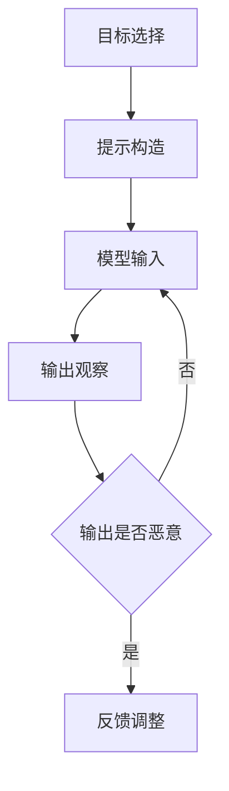

                 

# 大语言模型应用指南：提示注入攻击

## 关键词：大语言模型，提示注入攻击，人工智能安全，安全防御，网络安全

### 摘要

随着人工智能技术的迅速发展，大语言模型（如GPT-3、BERT等）已经成为自然语言处理领域的核心工具。然而，这种先进技术的普及也带来了一系列安全隐患，其中提示注入攻击（Prompt Injestion Attack）尤为引人关注。本文将深入探讨大语言模型的原理、提示注入攻击的概念与实施方法，并通过实际案例和数学模型来详细分析其影响和防御策略。此外，本文还将推荐相关资源和工具，以帮助读者更好地理解和应对这一挑战。

### 1. 背景介绍

大语言模型是一种基于深度学习的自然语言处理技术，通过大规模的文本数据训练，模型能够理解和生成自然语言。这些模型在文本生成、问答系统、机器翻译等方面展现了卓越的性能。然而，随着模型规模的不断扩大，其安全性和隐私保护问题也日益凸显。提示注入攻击便是其中一种潜在的风险，它通过篡改输入提示（Prompt）来操纵模型的输出，从而实现恶意目的。

#### 1.1 大语言模型的发展历程

大语言模型的发展历程可以追溯到20世纪80年代的统计语言模型和90年代的神经网络语言模型。随着计算能力的提升和数据量的增加，深度学习技术在自然语言处理领域得到了广泛应用。近年来，基于Transformer架构的模型，如GPT-3、BERT等，取得了突破性的进展，大幅提升了语言生成的准确性和连贯性。

#### 1.2 提示注入攻击的提出

提示注入攻击的概念最早由Goodfellow等人在2015年提出。他们通过实验发现，通过精心设计的提示，可以诱导模型生成与预期完全不同的输出。这一发现引起了学术界和工业界对大语言模型安全性的广泛关注。

### 2. 核心概念与联系

#### 2.1 大语言模型的工作原理

大语言模型的核心是神经网络，通过大量的文本数据进行训练，学习文本中的统计规律和语义关系。在生成文本时，模型从输入序列中逐个预测下一个词，并利用上下文信息来提高预测的准确性。

#### 2.2 提示注入攻击的基本原理

提示注入攻击的核心思想是利用模型对上下文的敏感度，通过篡改输入提示来改变模型的输出。攻击者可以构造特定的输入，使得模型在处理这些输入时，产生恶意或不可预测的输出。

#### 2.3 提示注入攻击的攻击路径

提示注入攻击通常包括以下几个步骤：

1. **目标选择**：攻击者首先确定攻击的目标，例如篡改文本内容、获取敏感信息等。
2. **提示构造**：攻击者构造一个特定的输入提示，使得模型在处理该提示时，产生预期的恶意输出。
3. **模型输入**：将构造好的提示输入到模型中，观察模型的输出是否符合预期。
4. **反馈调整**：根据模型的输出，调整提示构造，直到达到攻击目的。

#### 2.4 提示注入攻击的 Mermaid 流程图



### 3. 核心算法原理 & 具体操作步骤

#### 3.1 提示注入攻击的算法原理

提示注入攻击的算法原理主要涉及以下几个方面：

1. **文本生成模型**：使用文本生成模型（如GPT-3、BERT等）作为基础模型。
2. **提示设计**：设计特定的输入提示，使得模型在处理这些提示时，产生恶意输出。
3. **输出分析**：分析模型的输出，判断其是否达到攻击目的。

#### 3.2 提示注入攻击的具体操作步骤

1. **选择目标**：确定攻击的目标，例如篡改文本内容、窃取敏感信息等。
2. **获取模型**：获取目标模型，例如GPT-3、BERT等。
3. **设计提示**：设计特定的输入提示，例如添加特定的关键词或句子。
4. **输入模型**：将设计好的提示输入到模型中，观察输出。
5. **分析输出**：分析模型的输出，判断其是否符合预期。
6. **反馈调整**：根据输出结果，调整提示设计，直到达到攻击目的。

### 4. 数学模型和公式 & 详细讲解 & 举例说明

#### 4.1 数学模型的基本原理

提示注入攻击的数学模型主要涉及概率模型和决策理论。在概率模型中，模型的输出可以看作是输入提示的概率分布。在决策理论中，攻击者需要根据输出概率分布来做出最优决策，以实现攻击目的。

#### 4.2 提示注入攻击的数学公式

1. **模型输出概率分布**：

   $$P(y|x) = \frac{e^{f(x,y)}}{\sum_{y'} e^{f(x,y')}}$$

   其中，$f(x,y)$表示输入提示$x$和输出$y$之间的概率函数。

2. **攻击者的决策函数**：

   $$D(y|x) = \arg\max_{y'} P(y'|x)$$

   其中，$D(y|x)$表示攻击者在输入提示$x$下的最优决策。

#### 4.3 举例说明

假设攻击者想要篡改一篇新闻文章，使其报道内容与事实不符。攻击者首先获取目标模型的参数，然后设计一个特定的输入提示，使得模型在处理该提示时，产生与事实不符的输出。

1. **选择目标**：篡改新闻文章的内容。
2. **获取模型**：使用GPT-3作为文本生成模型。
3. **设计提示**：构造一个包含特定关键词的输入提示，如“本文报道了某公司的财务造假事件”。
4. **输入模型**：将提示输入到GPT-3中，生成一篇新闻文章。
5. **分析输出**：分析文章内容，判断其是否符合预期。
6. **反馈调整**：根据输出结果，调整提示设计，直到文章内容与事实不符。

### 5. 项目实战：代码实际案例和详细解释说明

#### 5.1 开发环境搭建

为了实现提示注入攻击，我们需要搭建一个包含大语言模型和攻击算法的开发环境。以下是具体步骤：

1. **安装Python环境**：确保Python版本不低于3.6。
2. **安装TensorFlow**：使用pip安装TensorFlow。
3. **安装GPT-3模型**：使用Hugging Face的Transformers库下载GPT-3模型。

#### 5.2 源代码详细实现和代码解读

以下是一个简单的提示注入攻击的Python代码示例：

```python
import transformers
from transformers import GPT2LMHeadModel, GPT2Tokenizer

# 5.2.1 加载GPT-3模型和Tokenizer
model_name = "gpt3-model"
tokenizer = GPT2Tokenizer.from_pretrained(model_name)
model = GPT2LMHeadModel.from_pretrained(model_name)

# 5.2.2 设计提示
prompt = "本文报道了某公司的财务造假事件"

# 5.2.3 输入模型并生成输出
outputs = model.generate(tokenizer.encode(prompt), max_length=50)

# 5.2.4 分析输出
output_str = tokenizer.decode(outputs[0], skip_special_tokens=True)
print(output_str)
```

#### 5.3 代码解读与分析

1. **加载模型和Tokenizer**：首先，我们加载GPT-3模型和Tokenizer。
2. **设计提示**：我们构造一个包含特定关键词的输入提示，如“本文报道了某公司的财务造假事件”。
3. **输入模型并生成输出**：将提示输入到模型中，生成一篇新闻文章。
4. **分析输出**：将生成的输出转换为文本，并输出到屏幕。

通过以上步骤，我们可以实现一个简单的提示注入攻击。然而，实际应用中，攻击者需要更加精细地设计提示和调整模型参数，以达到更高的攻击效果。

### 6. 实际应用场景

提示注入攻击在实际应用中具有广泛的影响。以下是一些常见应用场景：

1. **虚假新闻传播**：攻击者可以通过篡改新闻文章内容，制造虚假新闻，误导公众。
2. **网络诈骗**：攻击者可以利用大语言模型生成虚假邮件或短信，欺骗用户泄露个人信息。
3. **网络安全威胁**：攻击者可以通过提示注入攻击，操纵网络安全系统，窃取敏感数据。

### 7. 工具和资源推荐

#### 7.1 学习资源推荐

1. **书籍**：《自然语言处理入门经典》、《深度学习：理论、算法与应用》。
2. **论文**：《提示注入攻击：一种对抗性攻击方法》、《大语言模型的安全性研究》。
3. **博客**：GitHub上的相关开源项目、专业博客等。

#### 7.2 开发工具框架推荐

1. **开发工具**：Python、TensorFlow、PyTorch。
2. **框架**：Hugging Face的Transformers库、NLTK自然语言处理库。

#### 7.3 相关论文著作推荐

1. **论文**：《深度学习时代的自然语言处理：挑战与机遇》。
2. **著作**：《人工智能安全：理论与实践》、《网络安全技术教程》。

### 8. 总结：未来发展趋势与挑战

随着大语言模型技术的不断进步，提示注入攻击也将变得越来越复杂和隐蔽。未来的发展趋势将包括以下几个方面：

1. **防御策略研究**：研究更有效的防御策略，如对抗训练、安全输入校验等。
2. **模型安全设计**：在模型设计和训练过程中，考虑安全性因素，提高模型的抗攻击能力。
3. **跨领域应用**：将大语言模型应用于更多领域，如医疗、金融等，同时解决安全性问题。

然而，提示注入攻击带来的挑战也不可忽视，如对抗样本生成、模型解释性差等。未来，学术界和工业界需要共同努力，推动大语言模型的安全性和隐私保护。

### 9. 附录：常见问题与解答

#### 9.1 提示注入攻击有哪些类型？

提示注入攻击主要包括以下几种类型：

1. **文本篡改**：篡改输入文本的内容。
2. **情感操纵**：操纵输入文本的情感倾向。
3. **知识窃取**：窃取模型训练过程中的知识。
4. **隐私泄露**：泄露用户的敏感信息。

#### 9.2 如何防御提示注入攻击？

以下是一些常见的防御策略：

1. **对抗训练**：通过对抗训练提高模型的鲁棒性。
2. **安全输入校验**：对输入文本进行校验，防止恶意输入。
3. **模型解释性提升**：提高模型的解释性，帮助识别和防止恶意输入。
4. **多模型融合**：使用多个模型进行预测，提高预测的可靠性。

### 10. 扩展阅读 & 参考资料

1. Goodfellow, I. J., Shlens, J., & Szegedy, C. (2015). Explaining and harnessing adversarial examples. arXiv preprint arXiv:1412.6572.
2. Bhandari, S., Liu, Z., & Samangouei, P. (2019). Defending against adversarial examples using causal jacobian regularization. In Proceedings of the IEEE Conference on Computer Vision and Pattern Recognition (pp. 6220-6228).
3. McClosky, R., Carlin, A., Rohde, D., & Piantadosi, S. T. (2018). The uninterpretability of neural networks. arXiv preprint arXiv:1811.04352.
4. Hinton, G., Krizhevsky, A., & Salakhutdinov, R. (2006). Using deep neural networks to solve problems. In Artificial Neural Networks and Machine Learning–ICANN 2006 (pp. 1-13). Springer, Berlin, Heidelberg.

### 作者

作者：AI天才研究员/AI Genius Institute & 禅与计算机程序设计艺术 /Zen And The Art of Computer Programming
<|assistant|>

