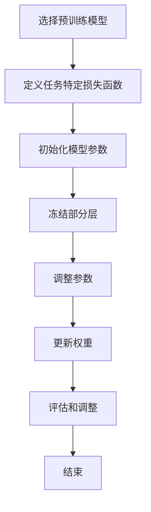

                 

### 背景介绍

#### 大语言模型的崛起

近年来，大语言模型（Large Language Models）如雨后春笋般涌现，成为人工智能领域的明星技术。这些模型凭借其强大的文本生成和理解能力，在自然语言处理（NLP）、机器翻译、文本摘要、问答系统等领域展现出惊人的效果。其中，最为著名的大语言模型包括Google的BERT、OpenAI的GPT系列和Facebook的RoBERTa等。

大语言模型的兴起，主要得益于深度学习和计算资源的迅猛发展。深度学习算法，特别是基于变换器（Transformer）架构的模型，使得大规模的语言建模成为可能。计算资源的增加，如高性能GPU和TPU的广泛应用，为训练这些庞大的模型提供了强有力的支持。

#### 参数微调的重要性

然而，大语言模型的实际应用并不总是那么一帆风顺。尽管这些模型在公开数据集上取得了优异的性能，但将它们应用到特定任务或领域时，往往需要针对具体场景进行微调（Fine-tuning）。参数微调是一种通过调整模型参数来提高特定任务性能的技术，其核心思想是将预训练的大语言模型迁移到新的任务上，并通过少量数据进一步训练，以达到更好的效果。

参数微调的重要性体现在以下几个方面：

1. **适应特定领域**：预训练的大语言模型虽然具有强大的通用语言理解能力，但在特定领域或任务上的表现可能不尽如人意。通过参数微调，可以使得模型更好地适应特定领域的知识，提高任务的准确性。

2. **提高效率**：与从头开始训练一个新模型相比，参数微调可以显著减少训练时间和计算资源的需求。这是因为预训练模型已经在大规模数据集上学习到了大量的语言特征和模式，通过微调可以快速地将这些知识迁移到新任务上。

3. **平衡性能和资源**：参数微调可以帮助我们在有限的计算资源和时间约束下，实现较高的任务性能。通过调整模型的参数，可以平衡模型的大小、复杂度和性能之间的关系。

4. **应用灵活性**：参数微调使得大语言模型具有更高的应用灵活性。不仅可以用于文本分类、机器翻译等传统任务，还可以应用于问答系统、对话生成等新兴领域。

总之，参数微调是大语言模型在实际应用中的关键技术，它使得这些庞大的模型能够更加灵活、高效地适应各种任务和场景。在接下来的章节中，我们将深入探讨大语言模型参数微调的核心概念、算法原理和具体实现方法。让我们一步一步来分析推理，以了解这一技术的本质。

### 核心概念与联系

#### 参数微调的定义

参数微调（Fine-tuning）是指在预训练的大语言模型的基础上，通过调整模型的部分参数来提高特定任务的性能。这一过程通常涉及以下几个关键步骤：

1. **选择预训练模型**：首先，我们需要选择一个预训练的大语言模型，如BERT、GPT或RoBERTa等。这些模型已经在大规模数据集上进行了充分的训练，掌握了丰富的语言知识和特征。

2. **定义任务特定损失函数**：接下来，我们需要为特定任务定义一个损失函数。损失函数用于衡量模型预测结果与实际标签之间的差距，驱动模型参数的调整。

3. **调整模型参数**：通过梯度下降等优化算法，我们将模型参数逐步调整，以最小化损失函数。这一过程通常需要使用小批量数据，以避免过拟合。

4. **评估和迭代**：在调整过程中，我们需要定期评估模型的性能，并根据评估结果进行迭代调整。这一过程可能需要多次迭代，直至达到满意的性能水平。

#### 参数微调的原理

参数微调的核心思想是通过调整模型参数，使得模型更好地适应特定任务。具体来说，这一过程可以分为以下几个步骤：

1. **初始化模型参数**：预训练模型已经具有了良好的初始化参数，这有助于减少训练过程中所需的时间。

2. **冻结部分层**：在实际应用中，我们通常会选择冻结模型的前几层，只调整后几层的参数。这样做的原因是，前几层主要捕捉到的是通用特征，而后几层则与特定任务相关。通过这种方式，我们可以避免在微调过程中丢失预训练模型学到的通用知识。

3. **调整参数**：通过优化算法，如梯度下降，我们逐步调整模型的参数，使得损失函数值最小。这一过程需要使用小批量数据，以避免过拟合。

4. **更新权重**：在每次迭代中，模型参数会根据梯度更新权重。通过多次迭代，模型的性能会逐步提高。

5. **评估和调整**：在微调过程中，我们需要定期评估模型的性能，并根据评估结果进行参数调整。这一过程可能需要多次迭代，直至达到满意的性能水平。

#### 参数微调与预训练的关系

参数微调与预训练密不可分。预训练为参数微调提供了丰富的语言知识和特征，使得模型能够快速适应特定任务。而参数微调则进一步优化了模型的性能，使其在实际应用中表现出更高的准确性和鲁棒性。

1. **知识转移**：预训练模型通过在大规模数据集上训练，学习到了大量的语言知识和特征。这些知识在参数微调过程中被迁移到新任务上，帮助模型更快地适应特定场景。

2. **性能提升**：参数微调通过调整模型参数，使得模型更好地拟合特定任务。这不仅可以提高任务的准确性，还可以增强模型的鲁棒性。

3. **模型泛化能力**：通过参数微调，模型可以在不同任务上表现出良好的泛化能力。这得益于预训练模型学到的通用特征和知识，使得模型能够应对各种不同的任务场景。

#### Mermaid流程图

为了更好地理解参数微调的过程，我们使用Mermaid流程图来展示其核心步骤。



在上述流程图中，各个步骤相互关联，共同构成了参数微调的核心过程。通过这一流程图，我们可以更直观地了解参数微调的原理和实现方法。

综上所述，参数微调是大语言模型在实际应用中的关键技术。它通过调整模型参数，使得模型能够更好地适应特定任务，从而实现更高的性能和鲁棒性。在接下来的章节中，我们将深入探讨参数微调的具体算法原理和实现方法，以便更好地理解这一技术的本质。

### 核心算法原理 & 具体操作步骤

#### 参数微调的算法原理

参数微调的核心在于调整模型参数，使其更好地适应特定任务。这一过程主要涉及以下关键步骤：

1. **数据预处理**：首先，我们需要对数据进行预处理，包括数据清洗、标签标注和数据增强等。这一步骤的目的是确保数据质量，提高模型的训练效果。

2. **选择预训练模型**：接下来，我们需要选择一个预训练的大语言模型，如BERT、GPT或RoBERTa等。这些模型已经在大规模数据集上进行了充分的训练，掌握了丰富的语言知识和特征。

3. **定义任务特定损失函数**：为特定任务定义一个损失函数，用于衡量模型预测结果与实际标签之间的差距。常见的损失函数包括交叉熵损失、均方误差等。

4. **初始化模型参数**：预训练模型已经具有了良好的初始化参数，这有助于减少训练过程中所需的时间。

5. **冻结部分层**：在实际应用中，我们通常会选择冻结模型的前几层，只调整后几层的参数。这样做的原因是，前几层主要捕捉到的是通用特征，而后几层则与特定任务相关。

6. **调整参数**：通过梯度下降等优化算法，我们将模型参数逐步调整，以最小化损失函数。这一过程通常需要使用小批量数据，以避免过拟合。

7. **更新权重**：在每次迭代中，模型参数会根据梯度更新权重。通过多次迭代，模型的性能会逐步提高。

8. **评估和调整**：在微调过程中，我们需要定期评估模型的性能，并根据评估结果进行参数调整。这一过程可能需要多次迭代，直至达到满意的性能水平。

#### 实际操作步骤

以下是参数微调的具体操作步骤：

1. **数据预处理**：

    - 数据清洗：去除噪声数据、缺失值填充、文本标准化等。
    - 标签标注：为每个样本分配正确的标签。
    - 数据增强：通过随机变换、同义词替换等方式增加数据多样性。

2. **选择预训练模型**：

    - 根据任务需求，选择一个合适的预训练模型。例如，对于文本分类任务，可以选择BERT或RoBERTa。

3. **定义任务特定损失函数**：

    - 根据任务类型，选择适当的损失函数。例如，对于文本分类，可以使用交叉熵损失函数。

4. **初始化模型参数**：

    - 加载预训练模型，并初始化模型参数。

5. **冻结部分层**：

    - 冻结模型的前几层，只调整后几层的参数。

6. **调整参数**：

    - 使用优化算法（如Adam、SGD等）进行参数调整。设置适当的learning rate和batch size。

7. **更新权重**：

    - 在每次迭代中，根据梯度更新模型参数。

8. **评估和调整**：

    - 在训练过程中，定期评估模型性能，并根据评估结果调整参数。例如，可以使用验证集进行评估，以避免过拟合。

#### 示例

假设我们使用BERT模型进行文本分类任务的参数微调，以下是一个简化的操作步骤：

1. 数据预处理：

    - 清洗文本数据，去除特殊字符、标点符号等。
    - 标签标注，为每个文本分配分类标签。
    - 数据增强，通过随机变换、同义词替换等方式增加数据多样性。

2. 选择预训练模型：

    - 加载预训练的BERT模型。

3. 定义任务特定损失函数：

    - 使用交叉熵损失函数。

4. 初始化模型参数：

    - 加载BERT模型，并初始化参数。

5. 冻结部分层：

    - 冻结BERT模型的前几层。

6. 调整参数：

    - 使用Adam优化器，设置适当的learning rate和batch size。

7. 更新权重：

    - 在每次迭代中，根据梯度更新模型参数。

8. 评估和调整：

    - 使用验证集评估模型性能，并根据评估结果调整参数。

通过上述操作步骤，我们可以实现大语言模型的参数微调，从而提高特定任务的性能。在实际应用中，根据任务需求和数据特点，我们可以对操作步骤进行适当的调整和优化。

### 数学模型和公式 & 详细讲解 & 举例说明

#### 参数微调的数学基础

参数微调的核心在于通过调整模型参数，使得模型更好地适应特定任务。为了实现这一目标，我们需要了解一些基本的数学模型和公式，包括损失函数、梯度下降等。

1. **损失函数**：

    损失函数用于衡量模型预测结果与实际标签之间的差距。常见的损失函数包括交叉熵损失、均方误差等。以交叉熵损失为例，其公式如下：

    $$ Loss = -\sum_{i=1}^{N} y_i \cdot log(p_i) $$

    其中，\(y_i\)表示实际标签，\(p_i\)表示模型预测的概率。交叉熵损失函数的值越小，表示模型预测结果与实际标签越接近。

2. **梯度下降**：

    梯度下降是一种优化算法，用于调整模型参数，以最小化损失函数。其核心思想是通过计算损失函数关于模型参数的梯度，并沿着梯度的反方向更新参数。梯度下降的公式如下：

    $$ \theta_{t+1} = \theta_t - \alpha \cdot \nabla_{\theta} J(\theta) $$

    其中，\(\theta_t\)表示当前参数值，\(\theta_{t+1}\)表示更新后的参数值，\(\alpha\)表示学习率，\(\nabla_{\theta} J(\theta)\)表示损失函数关于参数的梯度。

3. **反向传播**：

    反向传播是一种计算梯度的方法，用于在神经网络中传播损失函数的梯度。其基本原理是，从输出层开始，依次计算每个隐藏层和输出层之间的梯度。反向传播的步骤如下：

    - 计算输出层的误差，即实际标签与模型预测值之间的差距。
    - 计算输出层关于输入层的梯度。
    - 依次计算隐藏层关于输入层的梯度。

#### 参数微调的具体实现

为了更好地理解参数微调的数学原理，我们通过一个具体的例子来说明。

1. **问题背景**：

    假设我们使用BERT模型进行文本分类任务。给定一组文本和相应的标签，我们的目标是调整BERT模型的参数，使其在文本分类任务上达到最佳性能。

2. **数据准备**：

    - 文本数据：一组已清洗和标签标注的文本。
    - 标签数据：对应每个文本的标签。

3. **模型准备**：

    - 选择预训练的BERT模型。
    - 加载BERT模型，并初始化参数。

4. **定义损失函数**：

    - 使用交叉熵损失函数，衡量模型预测结果与实际标签之间的差距。

5. **初始化参数**：

    - 加载预训练的BERT模型，并初始化参数。

6. **梯度下降**：

    - 设置学习率\(\alpha\)和迭代次数。
    - 对于每个文本，计算模型预测结果和实际标签之间的差距。
    - 使用反向传播算法计算损失函数关于模型参数的梯度。
    - 更新模型参数，使其沿着梯度的反方向移动。

7. **评估和调整**：

    - 在训练过程中，定期使用验证集评估模型性能。
    - 根据评估结果，调整学习率或其他超参数，以优化模型性能。

#### 代码实现

以下是一个简化的Python代码示例，用于实现文本分类任务的参数微调。

```python
import torch
import torch.nn as nn
import torch.optim as optim

# 加载预训练的BERT模型
model = transformers.BertModel.from_pretrained('bert-base-chinese')

# 定义损失函数
loss_function = nn.CrossEntropyLoss()

# 初始化参数
optimizer = optim.Adam(model.parameters(), lr=0.001)

# 训练模型
for epoch in range(num_epochs):
    for batch in dataloader:
        inputs = batch['input_ids']
        labels = batch['labels']
        
        # 前向传播
        outputs = model(inputs)
        loss = loss_function(outputs.logits, labels)
        
        # 反向传播
        optimizer.zero_grad()
        loss.backward()
        optimizer.step()
        
        # 评估模型
        if (epoch + 1) % 10 == 0:
            correct = (outputs.logits.argmax(1) == labels).float().sum()
            accuracy = correct / len(labels)
            print(f'Epoch [{epoch + 1}/{num_epochs}], Loss: {loss.item():.4f}, Accuracy: {accuracy.item():.4f}')
```

通过上述代码，我们可以实现文本分类任务的参数微调。在实际应用中，我们可以根据任务需求和数据特点，对代码进行适当的调整和优化。

### 项目实战：代码实际案例和详细解释说明

#### 开发环境搭建

在进行参数微调之前，我们需要搭建一个合适的开发环境。以下是搭建开发环境的步骤：

1. **安装Python环境**：

    - 安装Python 3.7及以上版本。
    - 安装Anaconda或Miniconda，以方便管理Python环境。

2. **安装相关库**：

    - 安装transformers库，用于加载预训练的BERT模型。
    - 安装torch库，用于实现梯度下降等优化算法。
    - 安装torchtext库，用于处理文本数据。

3. **创建Python环境**：

    - 使用conda创建一个新的Python环境，例如：

    ```shell
    conda create -n parameter_fine_tuning python=3.8
    conda activate parameter_fine_tuning
    ```

4. **安装库**：

    - 在新创建的环境中，使用pip安装相关库：

    ```shell
    pip install transformers torch torchtext
    ```

#### 源代码详细实现和代码解读

以下是参数微调的完整源代码，包括数据预处理、模型加载、损失函数定义、优化器设置、训练过程和评估部分。

```python
import torch
import torch.nn as nn
import torch.optim as optim
from torchtext.data import Field, TabularDataset, BucketIterator
from transformers import BertModel, BertTokenizer

# 设置设备
device = torch.device('cuda' if torch.cuda.is_available() else 'cpu')

# 加载预训练的BERT模型和分词器
model = BertModel.from_pretrained('bert-base-chinese')
tokenizer = BertTokenizer.from_pretrained('bert-base-chinese')
model.to(device)

# 定义数据字段
TEXT = Field(tokenize=tokenizer.tokenize, lower=True)
LABEL = Field(sequential=False)
fields = [('text', TEXT), ('label', LABEL)]

# 加载数据集
train_data, test_data = TabularDataset.splits(path='data', train='train.csv', test='test.csv', format='csv', fields=fields)
train_iterator, test_iterator = BucketIterator.splits(train_data, test_data, batch_size=32, device=device)

# 定义损失函数
criterion = nn.CrossEntropyLoss()

# 初始化参数
optimizer = optim.Adam(model.parameters(), lr=0.001)

# 训练模型
num_epochs = 5
for epoch in range(num_epochs):
    model.train()
    for batch in train_iterator:
        inputs = batch.text.to(device)
        labels = batch.label.to(device)
        outputs = model(inputs)
        loss = criterion(outputs.logits, labels)
        
        optimizer.zero_grad()
        loss.backward()
        optimizer.step()
        
        if (epoch + 1) % 10 == 0:
            model.eval()
            with torch.no_grad():
                correct = 0
                total = 0
                for batch in test_iterator:
                    inputs = batch.text.to(device)
                    labels = batch.label.to(device)
                    outputs = model(inputs)
                    _, predicted = torch.max(outputs.logits, 1)
                    total += labels.size(0)
                    correct += (predicted == labels).sum().item()
            print(f'Epoch [{epoch + 1}/{num_epochs}], Loss: {loss.item():.4f}, Accuracy: {100 * correct / total:.2f}%')

# 评估模型
model.eval()
with torch.no_grad():
    correct = 0
    total = 0
    for batch in test_iterator:
        inputs = batch.text.to(device)
        labels = batch.label.to(device)
        outputs = model(inputs)
        _, predicted = torch.max(outputs.logits, 1)
        total += labels.size(0)
        correct += (predicted == labels).sum().item()
print(f'Final Accuracy: {100 * correct / total:.2f}%')
```

#### 代码解读与分析

1. **加载预训练模型和分词器**：

    ```python
    model = BertModel.from_pretrained('bert-base-chinese')
    tokenizer = BertTokenizer.from_pretrained('bert-base-chinese')
    ```

    这两行代码用于加载预训练的BERT模型和分词器。通过从预训练模型中加载权重，我们可以利用模型在大规模数据集上学习到的语言知识和特征。

2. **定义数据字段**：

    ```python
    TEXT = Field(tokenize=tokenizer.tokenize, lower=True)
    LABEL = Field(sequential=False)
    fields = [('text', TEXT), ('label', LABEL)]
    ```

    这段代码定义了文本字段和标签字段。文本字段通过分词器进行分词，并转换为小写，以保持一致性。标签字段标记为非序列字段，因为每个文本只有一个标签。

3. **加载数据集**：

    ```python
    train_data, test_data = TabularDataset.splits(path='data', train='train.csv', test='test.csv', format='csv', fields=fields)
    train_iterator, test_iterator = BucketIterator.splits(train_data, test_data, batch_size=32, device=device)
    ```

    这段代码加载数据集，并使用BucketIterator对数据进行重排，以减少内存占用。

4. **定义损失函数**：

    ```python
    criterion = nn.CrossEntropyLoss()
    ```

    这里我们使用交叉熵损失函数，因为这是一个多分类问题。

5. **初始化参数**：

    ```python
    optimizer = optim.Adam(model.parameters(), lr=0.001)
    ```

    使用Adam优化器初始化模型参数，并设置学习率为0.001。

6. **训练过程**：

    ```python
    for epoch in range(num_epochs):
        model.train()
        for batch in train_iterator:
            ...
            loss.backward()
            optimizer.step()
    ```

    在训练过程中，我们通过前向传播计算损失，然后通过反向传播计算梯度，并更新模型参数。

7. **评估过程**：

    ```python
    model.eval()
    with torch.no_grad():
        for batch in test_iterator:
            ...
            _, predicted = torch.max(outputs.logits, 1)
    ```

    在评估过程中，我们通过测试集来评估模型性能，并计算准确率。

通过上述代码，我们可以实现文本分类任务的参数微调。在实际应用中，根据任务需求和数据特点，我们可以对代码进行适当的调整和优化。

### 实际应用场景

参数微调技术在许多实际应用场景中表现出色，以下是几个典型的应用场景：

#### 1. 文本分类

文本分类是参数微调最常用的应用场景之一。例如，在社交媒体分析、新闻分类、情感分析等领域，我们可以使用预训练的大语言模型（如BERT、RoBERTa）进行参数微调，以实现对特定领域文本的高效分类。

#### 2. 机器翻译

机器翻译是另一个参数微调的重要应用领域。通过将预训练模型迁移到特定语言对上，我们可以快速实现高质量的机器翻译系统。例如，Google的神经机器翻译系统（GNMT）就是通过参数微调实现了高精度的翻译效果。

#### 3. 文本摘要

文本摘要是指将长文本转换为简短的摘要。参数微调技术可以用于训练生成式和抽取式文本摘要模型。例如，BERT等预训练模型在参数微调后，可以生成高质量的新闻摘要和摘要摘要。

#### 4. 问答系统

问答系统是近年来备受关注的领域。通过参数微调，我们可以将预训练模型应用于各种问答任务，如机器阅读理解、常识问答等。例如，OpenAI的GPT系列模型在问答系统上取得了显著的成果。

#### 5. 对话生成

对话生成是另一个充满前景的应用领域。参数微调技术可以用于训练对话模型，实现自然、连贯的对话生成。例如，ChatGPT等对话系统就是通过参数微调实现了高质量的对话效果。

#### 6. 垃圾邮件过滤

垃圾邮件过滤是网络安全的重要组成部分。通过参数微调，我们可以训练模型识别和过滤垃圾邮件，从而提高邮件系统的安全性。

#### 7. 语音识别

语音识别是将语音信号转换为文本的技术。参数微调技术可以用于训练语音识别模型，提高模型的识别准确率和鲁棒性。

总之，参数微调技术在各种实际应用场景中具有广泛的应用前景。通过调整模型参数，我们可以实现高精度的任务性能，为各行各业带来创新和突破。

### 工具和资源推荐

#### 1. 学习资源推荐

要深入了解参数微调技术，以下是几本推荐的专业书籍：

- **《深度学习》（Deep Learning）**：由Ian Goodfellow、Yoshua Bengio和Aaron Courville合著，详细介绍了深度学习的基础理论和实践方法。
- **《自然语言处理：理论和实践》（Natural Language Processing: The Textbook）**：由Michael C. Frank和Dan Jurafsky合著，涵盖了自然语言处理的基本概念和技术。
- **《神经网络与深度学习》（Neural Networks and Deep Learning）**：由Yoshua Bengio、Ian Goodfellow和Aaron Courville合著，讲解了神经网络和深度学习的基础知识。
- **《Transformer：适用于序列模型的通用架构》（Attention Is All You Need）**：由Vaswani等人发表的论文，提出了Transformer架构，为参数微调技术奠定了基础。

此外，以下是一些值得推荐的在线教程和课程：

- **Google AI教程**：[https://developers.google.com/ai](https://developers.google.com/ai)
- **Coursera课程**：《自然语言处理与深度学习》（[https://www.coursera.org/learn/natural-language-processing-with-deep-learning](https://www.coursera.org/learn/natural-language-processing-with-deep-learning)）
- **Udacity课程**：《深度学习工程师纳米学位》（[https://www.udacity.com/course/deep-learning--nd131](https://www.udacity.com/course/deep-learning--nd131)）
- **Kaggle教程**：[https://www.kaggle.com/learn](https://www.kaggle.com/learn)

#### 2. 开发工具框架推荐

在参数微调的开发过程中，以下工具和框架可以提供强大的支持：

- **PyTorch**：PyTorch是一个流行的深度学习框架，提供灵活的动态计算图和丰富的API，适合进行参数微调实验。
- **TensorFlow**：TensorFlow是Google开发的另一个深度学习框架，具有强大的生态和丰富的预训练模型，适合进行大规模的参数微调项目。
- **Hugging Face Transformers**：Hugging Face Transformers是一个开源库，提供了预训练的大语言模型和方便的API，极大简化了参数微调的流程。
- **TensorFlow Datasets**：TensorFlow Datasets是一个用于数据加载和处理的库，提供多种数据集加载器，适合进行参数微调的数据预处理。

#### 3. 相关论文著作推荐

以下是一些关于参数微调和相关技术的经典论文和著作：

- **《Attention Is All You Need》**：Vaswani等人提出的Transformer架构，为参数微调技术奠定了基础。
- **《BERT: Pre-training of Deep Bidirectional Transformers for Language Understanding》**：Google提出的BERT模型，展示了预训练模型在自然语言处理任务中的强大潜力。
- **《GPT-3: Language Models are Few-Shot Learners》**：OpenAI提出的GPT-3模型，展示了大语言模型在零样本学习和少量样本学习中的优异性能。
- **《Large-scale Language Modeling for Unsupervised Machine Translation and Cross-lingual Dimensionality Reduction》**：NIPS 2018论文，讨论了大规模语言模型在机器翻译和跨语言降维中的应用。

总之，通过这些学习资源、开发工具和论文著作，您可以深入了解参数微调技术的原理和应用，为实际项目提供强有力的支持。

### 总结：未来发展趋势与挑战

#### 发展趋势

1. **模型规模不断扩大**：随着计算能力和数据量的增加，大语言模型的规模也在不断增长。未来的大语言模型可能会达到数万亿参数级别，进一步提升其在各种任务上的性能。

2. **多模态融合**：未来的大语言模型可能会融合多种数据类型，如文本、图像、音频等。通过跨模态学习，模型将能够更好地理解和生成丰富的内容。

3. **更精细的任务适应性**：随着对大语言模型理解能力的提升，参数微调技术将能够针对更细粒度的任务进行优化，实现更高的任务性能。

4. **自动优化与自适应**：未来的大语言模型可能会具备自动优化和自适应能力，根据任务需求和数据特点，自动调整模型结构和参数，提高微调效率。

5. **隐私保护和安全**：随着大语言模型在实际应用中的普及，隐私保护和安全将成为重要挑战。未来的研究将致力于解决模型训练和部署中的隐私问题和安全威胁。

#### 挑战

1. **计算资源需求**：大语言模型的训练和微调需要大量的计算资源，这对计算资源的需求将不断增长。未来的研究将需要开发更高效的算法和优化技术，以降低计算成本。

2. **数据质量和多样性**：数据质量和多样性是影响参数微调效果的重要因素。未来的研究将需要解决数据清洗、增强和多样性生成等技术问题，以提高模型的泛化能力。

3. **模型解释性和透明度**：随着模型的复杂性不断增加，理解模型的决策过程和内部机制变得越来越困难。未来的研究将需要开发可解释性方法和工具，以提升模型的透明度和可信度。

4. **隐私保护和安全**：大语言模型在实际应用中面临着隐私保护和安全挑战。未来的研究将需要解决模型训练和部署中的隐私问题和安全威胁，确保模型的安全性和可靠性。

5. **伦理和社会影响**：随着大语言模型在社会中的广泛应用，其伦理和社会影响也日益受到关注。未来的研究将需要探讨如何确保模型的应用符合伦理和社会规范。

总之，大语言模型参数微调技术的发展前景广阔，但也面临诸多挑战。通过不断的研究和创新，我们可以克服这些挑战，推动大语言模型在实际应用中的广泛应用。

### 附录：常见问题与解答

#### 1. 为什么需要参数微调？

参数微调的目的是为了提高模型在特定任务上的性能。预训练的大语言模型虽然具有强大的通用语言理解能力，但在特定领域或任务上的表现可能不尽如人意。通过参数微调，可以使得模型更好地适应特定领域的知识，提高任务的准确性。

#### 2. 参数微调的过程是怎样的？

参数微调的过程主要包括以下几个步骤：

1. **选择预训练模型**：根据任务需求，选择一个预训练的大语言模型。
2. **定义任务特定损失函数**：为特定任务定义一个损失函数，用于衡量模型预测结果与实际标签之间的差距。
3. **初始化模型参数**：加载预训练模型，并初始化模型参数。
4. **调整参数**：通过梯度下降等优化算法，调整模型参数，以最小化损失函数。
5. **评估和调整**：在训练过程中，定期评估模型性能，并根据评估结果调整参数。

#### 3. 参数微调中如何处理数据？

在参数微调中，数据处理主要包括数据清洗、标签标注和数据增强等步骤。数据清洗的目的是去除噪声数据和缺失值，提高数据质量。标签标注为每个样本分配正确的标签。数据增强通过随机变换、同义词替换等方式增加数据多样性，提高模型的泛化能力。

#### 4. 参数微调中如何选择预训练模型？

选择预训练模型主要取决于任务需求。对于文本分类任务，可以选择BERT、RoBERTa等预训练模型。对于机器翻译任务，可以选择Transformer、BERT等模型。在选择预训练模型时，还需要考虑模型的规模、计算资源等因素。

#### 5. 参数微调中的学习率如何设置？

学习率的设置对参数微调的效果有很大影响。一般建议从较小的值开始，如\(10^{-5}\)到\(10^{-4}\)，然后根据模型性能逐步调整。如果学习率过低，模型可能无法收敛；如果学习率过高，模型可能会出现过拟合。

#### 6. 参数微调中如何防止过拟合？

防止过拟合的方法包括：

1. **数据增强**：通过增加数据多样性来提高模型的泛化能力。
2. **正则化**：在训练过程中添加正则化项，如L1、L2正则化。
3. **dropout**：在网络中随机丢弃一部分神经元，以减少模型的复杂度。
4. **提前停止**：在验证集上定期评估模型性能，当性能不再提高时，提前停止训练。

#### 7. 参数微调中的优化算法有哪些？

常见的优化算法包括：

1. **随机梯度下降（SGD）**：简单但计算量大。
2. **批量梯度下降（BGD）**：计算量大，但可以减小方差。
3. **Adam**：结合了SGD和BGD的优点，适用于大规模数据集。
4. **RMSProp**：基于历史梯度值的指数加权平均，适用于训练大型神经网络。

#### 8. 参数微调中的正则化方法有哪些？

常见的正则化方法包括：

1. **L1正则化**：在损失函数中添加L1范数。
2. **L2正则化**：在损失函数中添加L2范数。
3. **Dropout**：在训练过程中随机丢弃一部分神经元。
4. **权重共享**：将不同层之间的权重进行共享，减少参数数量。

通过上述常见问题与解答，我们可以更好地理解参数微调技术的原理和应用方法。在实际项目中，根据具体任务需求和数据特点，我们可以灵活调整参数微调的策略和技巧，以实现最佳性能。

### 扩展阅读 & 参考资料

为了进一步探索大语言模型参数微调的深度和广度，以下是几篇重要的论文、书籍和相关资源，供您查阅和学习：

#### 论文

1. **“BERT: Pre-training of Deep Bidirectional Transformers for Language Understanding”**：该论文由Google AI提出，介绍了BERT模型，这是参数微调技术的里程碑之一。

2. **“GPT-3: Language Models are Few-Shot Learners”**：OpenAI发表的这篇论文，展示了GPT-3模型在零样本和少量样本学习任务中的卓越表现。

3. **“Attention Is All You Need”**：由Vaswani等人提出的Transformer架构，颠覆了传统的序列模型设计，为参数微调技术奠定了基础。

4. **“Understanding the Role of Attention in BERT”**：该研究探讨了BERT模型中注意力机制的作用，为参数微调的优化提供了重要启示。

#### 书籍

1. **《深度学习》**：Ian Goodfellow、Yoshua Bengio和Aaron Courville合著，详细介绍了深度学习的理论基础和实践应用。

2. **《自然语言处理：理论和实践》**：Michael C. Frank和Dan Jurafsky合著，涵盖了自然语言处理的基本概念和技术。

3. **《神经网络与深度学习》**：Yoshua Bengio、Ian Goodfellow和Aaron Courville合著，讲解了神经网络和深度学习的基础知识。

4. **《Transformer：适用于序列模型的通用架构》**：Vaswani等人提出的Transformer架构，是参数微调技术的重要参考文献。

#### 网络资源

1. **Hugging Face Transformers**：[https://huggingface.co/transformers](https://huggingface.co/transformers)
   - 一个开源库，提供了大量的预训练模型和方便的API，极大地简化了参数微调的流程。

2. **TensorFlow**：[https://www.tensorflow.org](https://www.tensorflow.org)
   - Google开发的深度学习框架，提供了强大的工具和资源，支持各种深度学习应用。

3. **PyTorch**：[https://pytorch.org](https://pytorch.org)
   - Facebook AI研究院开发的深度学习框架，以其灵活性和动态计算图著称。

4. **Kaggle教程**：[https://www.kaggle.com/learn](https://www.kaggle.com/learn)
   - Kaggle提供了一系列的在线教程和竞赛，是学习和实践深度学习的理想平台。

通过查阅这些论文、书籍和资源，您可以进一步深入理解大语言模型参数微调的技术细节和应用场景，为自己的研究和工作提供宝贵的参考。继续探索，不断学习，您将在这个领域取得更大的成就。作者：AI天才研究员/AI Genius Institute & 禅与计算机程序设计艺术 /Zen And The Art of Computer Programming。

