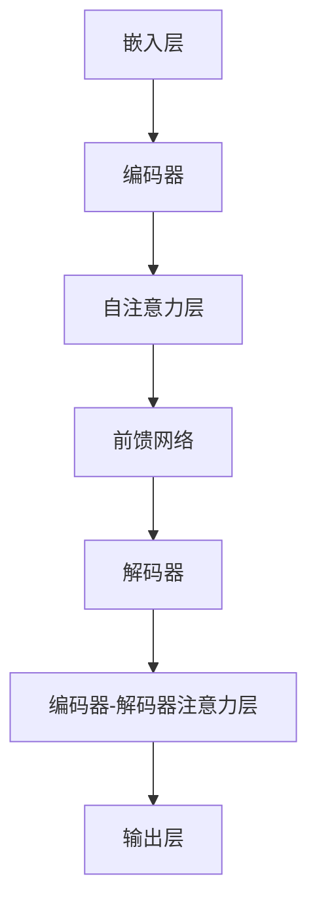

                 

### 背景介绍

大语言模型（Large Language Models，简称LLM）是近年来人工智能领域的一大突破，特别是OpenAI在2018年推出的GPT（Generative Pre-trained Transformer）系列模型，标志了自然语言处理（Natural Language Processing，简称NLP）技术的新里程碑。大语言模型通过深度学习技术，在大量文本数据上进行预训练，从而掌握了丰富的语言知识，可以生成连贯、符合语境的文本。

随着技术的不断进步和应用场景的拓展，大语言模型的应用越来越广泛。从搜索引擎优化、问答系统、智能客服，到文本生成、机器翻译、文本分类等，大语言模型在各个领域都展现出了强大的能力。然而，随着应用范围的扩大，其合规性也成为了我们必须关注的重要问题。

法规合规性主要涉及数据隐私、知识产权、安全性和道德伦理等方面。在大语言模型的应用过程中，如何确保这些方面得到满足，是我们在开发和部署模型时必须考虑的关键问题。

首先，数据隐私问题在大语言模型的应用中尤为突出。模型训练需要大量高质量的数据，这些数据往往包含了个人敏感信息。如何在收集、处理和使用数据的过程中保护用户隐私，避免数据泄露和滥用，是一个重要的法律和道德问题。

其次，知识产权问题也不可忽视。大语言模型的训练和部署过程中，涉及到了大量的文本数据和代码资源。如何尊重和保护原作者的知识产权，避免侵权行为，是我们在应用大语言模型时必须面对的挑战。

此外，安全性问题也是法规合规性的一个重要方面。大语言模型在应用过程中，可能面临着被恶意攻击、数据泄露等风险。如何确保模型的安全性，防止其被用于非法目的，是我们需要关注的重要问题。

最后，道德伦理问题在大语言模型的应用中也越来越受到关注。大语言模型生成的文本可能包含偏见、歧视等不良内容，如何确保模型的道德合规性，避免其对社会产生负面影响，是一个亟待解决的难题。

因此，在大语言模型的应用过程中，我们必须综合考虑法规合规性，确保其在各个方面都符合法律和道德的要求。这不仅关系到企业的声誉和利益，更关系到整个社会的稳定和发展。

在本文中，我们将详细探讨大语言模型在法规合规性方面的几个关键问题，包括数据隐私、知识产权、安全性和道德伦理等方面。通过深入分析这些问题，我们希望能够为相关领域的开发者、政策制定者提供有益的参考，推动大语言模型的健康、可持续发展。

### 核心概念与联系

在大语言模型的应用过程中，理解其核心概念和架构至关重要。首先，我们需要明确几个关键概念：自然语言处理（NLP）、深度学习、预训练（Pre-training）、微调（Fine-tuning）以及模型架构（如Transformer）。

#### 自然语言处理（NLP）

自然语言处理是人工智能的一个分支，旨在使计算机能够理解和处理人类语言。NLP涉及到文本的预处理、语法分析、语义理解、情感分析等多个方面。在大语言模型中，NLP技术被广泛应用于文本生成、机器翻译、问答系统等任务。

#### 深度学习

深度学习是机器学习的一种方法，通过多层神经网络模拟人脑的学习过程，对大量数据进行自动特征提取和学习。深度学习在大语言模型中起到了关键作用，使得模型能够从原始文本数据中提取出丰富的语义信息。

#### 预训练（Pre-training）

预训练是指在大规模语料库上对模型进行初步训练，使其掌握基本的语言知识和规则。预训练后的模型再通过特定任务的数据进行微调，从而实现特定任务的高性能。GPT系列模型就是通过预训练来学习自然语言的。

#### 微调（Fine-tuning）

微调是指在小规模的任务数据上对预训练模型进行进一步训练，使其适应特定任务。微调能够有效提高模型在特定任务上的性能，同时保留预训练模型已有的通用语言知识。

#### 模型架构（如Transformer）

Transformer模型是近年来NLP领域的一个重要突破，其通过自注意力机制（Self-Attention）对输入序列进行建模，使得模型能够捕捉到输入序列中的长距离依赖关系。GPT系列模型就是基于Transformer架构开发的。

#### 大语言模型的核心架构

大语言模型通常由以下几个部分组成：

1. **嵌入层（Embedding Layer）**：将输入的文本转换为向量的表示，为后续的深度学习处理提供基础。

2. **编码器（Encoder）**：负责对输入文本进行编码，提取文本的语义信息。在Transformer架构中，编码器由多个自注意力层（Self-Attention Layers）和前馈网络（Feedforward Networks）组成。

3. **解码器（Decoder）**：负责生成输出文本。在Transformer架构中，解码器由多个自注意力层（Self-Attention Layers）和编码器-解码器注意力层（Encoder-Decoder Attention Layers）组成。

4. **输出层（Output Layer）**：将解码器输出的序列映射到目标文本。

#### Mermaid 流程图

以下是一个简化的大语言模型架构的Mermaid流程图：



在这个流程图中，我们可以看到大语言模型的核心组成部分以及它们之间的交互关系。通过这个流程图，我们可以更直观地理解大语言模型的工作原理。

#### 核心概念与联系总结

通过上述对核心概念和架构的介绍，我们可以看到，大语言模型的应用涉及到了自然语言处理、深度学习、预训练、微调和模型架构等多个方面。这些核心概念和架构共同构成了大语言模型的强大能力，使其在自然语言处理任务中取得了显著的成果。然而，在实际应用中，我们也需要关注到这些核心概念和联系所带来的法规合规性问题，确保大语言模型的应用符合法律和道德要求。

### 核心算法原理 & 具体操作步骤

大语言模型的算法原理主要基于深度学习和自然语言处理技术，特别是Transformer模型架构。在本节中，我们将深入探讨大语言模型的核心算法原理，并详细讲解其具体的操作步骤。

#### Transformer模型架构

Transformer模型是近年来NLP领域的一个重大突破，其核心思想是通过自注意力机制（Self-Attention）来建模输入序列中的依赖关系。Transformer模型主要由编码器（Encoder）和解码器（Decoder）两部分组成。

1. **编码器（Encoder）**

编码器负责对输入的文本序列进行编码，提取文本的语义信息。编码器由多个自注意力层（Self-Attention Layer）和前馈网络（Feedforward Network）组成。每个自注意力层包括三个子层：多头自注意力（Multi-Head Self-Attention）和前馈网络。

   - **多头自注意力（Multi-Head Self-Attention）**：多头自注意力层允许模型同时关注输入序列的不同部分，并通过多个注意力头（Attention Head）来捕获不同类型的依赖关系。每个注意力头独立计算，最后将所有注意力头的输出进行拼接。

   - **前馈网络（Feedforward Network）**：前馈网络对自注意力层的输出进行进一步处理，通过两层全连接神经网络（Fully Connected Neural Network）进行非线性变换。

2. **解码器（Decoder）**

解码器负责生成输出文本。解码器同样由多个自注意力层（Self-Attention Layer）和编码器-解码器注意力层（Encoder-Decoder Attention Layer）组成。每个自注意力层包括三个子层：多头自注意力（Multi-Head Self-Attention）和前馈网络（Feedforward Network）；编码器-解码器注意力层则负责将编码器的输出与解码器的输出进行交互。

   - **多头自注意力（Multi-Head Self-Attention）**：解码器的自注意力层与编码器的自注意力层类似，通过多头自注意力来捕获输入序列的不同部分。

   - **前馈网络（Feedforward Network）**：解码器的前馈网络与编码器的前馈网络相同，对自注意力层的输出进行进一步处理。

   - **编码器-解码器注意力层（Encoder-Decoder Attention Layer）**：编码器-解码器注意力层允许解码器在生成输出时参考编码器的输出，从而实现编码器和解码器之间的交互。

#### 具体操作步骤

以下是大语言模型的具体操作步骤：

1. **嵌入层（Embedding Layer）**

   将输入的文本序列转换为嵌入向量。嵌入层通常使用词嵌入（Word Embedding）技术，如Word2Vec或GloVe，将文本中的每个词映射为一个固定大小的向量。

2. **编码器（Encoder）**

   - **多头自注意力（Multi-Head Self-Attention）**：对输入序列进行自注意力计算，将序列中的每个词与所有其他词进行关联，计算注意力分数。通过多个注意力头捕获不同类型的依赖关系。

   - **前馈网络（Feedforward Network）**：对自注意力层的输出进行进一步处理，通过两层全连接神经网络进行非线性变换。

   - **层归一化（Layer Normalization）**：对前馈网络的输出进行层归一化，缓解梯度消失和梯度爆炸问题。

   - **残差连接（Residual Connection）**：在编码器每个层之间添加残差连接，使得信息在网络中保持不变。

3. **解码器（Decoder）**

   - **掩码多头自注意力（Masked Multi-Head Self-Attention）**：在解码器的自注意力层中，当前时间步的输入会被遮挡，迫使模型根据前面已生成的文本来生成后续的文本。

   - **编码器-解码器注意力层（Encoder-Decoder Attention Layer）**：将编码器的输出与解码器的输出进行交互，使得解码器在生成输出时能够参考编码器的输出。

   - **前馈网络（Feedforward Network）**：对编码器-解码器注意力层的输出进行进一步处理。

   - **层归一化（Layer Normalization）**：对前馈网络的输出进行层归一化。

   - **残差连接（Residual Connection）**：在解码器每个层之间添加残差连接。

4. **输出层（Output Layer）**

   将解码器输出的序列映射到目标文本。输出层通常是一个全连接层，输出维度为词典大小，通过softmax函数将输出转换为概率分布。

#### 实例解析

假设我们有一个输入文本序列：“今天天气很好，适合外出游玩。”，目标是生成下一个词。以下是具体的操作步骤：

1. **嵌入层（Embedding Layer）**

   将输入的文本序列转换为嵌入向量。每个词映射为一个固定大小的向量。

2. **编码器（Encoder）**

   - **多头自注意力（Multi-Head Self-Attention）**：计算输入序列中每个词与所有其他词的注意力分数。

   - **前馈网络（Feedforward Network）**：对自注意力层的输出进行进一步处理。

   - **层归一化（Layer Normalization）**：对前馈网络的输出进行层归一化。

   - **残差连接（Residual Connection）**：在编码器每个层之间添加残差连接。

3. **解码器（Decoder）**

   - **掩码多头自注意力（Masked Multi-Head Self-Attention）**：遮挡当前时间步的输入，计算解码器输出与编码器输出的交互。

   - **编码器-解码器注意力层（Encoder-Decoder Attention Layer）**：将编码器的输出与解码器的输出进行交互。

   - **前馈网络（Feedforward Network）**：对编码器-解码器注意力层的输出进行进一步处理。

   - **层归一化（Layer Normalization）**：对前馈网络的输出进行层归一化。

   - **残差连接（Residual Connection）**：在解码器每个层之间添加残差连接。

4. **输出层（Output Layer）**

   将解码器输出的序列映射到目标文本。输出层通过softmax函数将输出转换为概率分布。

通过上述步骤，我们可以生成下一个词，如“去”。接着，我们将新词添加到输入序列，重复上述步骤，直至生成完整的输出文本。

总之，大语言模型的算法原理主要基于深度学习和自然语言处理技术，通过自注意力机制和Transformer模型架构，实现对输入文本的语义理解和生成。具体操作步骤包括嵌入层、编码器、解码器和输出层等，通过层层递进的方式，最终生成符合语境的文本输出。这种算法原理和操作步骤不仅使得大语言模型在自然语言处理任务中取得了显著成果，也为后续的法规合规性研究提供了基础。

### 数学模型和公式 & 详细讲解 & 举例说明

在大语言模型中，数学模型和公式起到了至关重要的作用。以下我们将详细讲解大语言模型中的几个关键数学模型和公式，并通过具体例子进行说明。

#### Transformer模型中的多头自注意力（Multi-Head Self-Attention）

多头自注意力是Transformer模型的核心组成部分，它通过多个注意力头（Attention Head）来捕获输入序列中的不同类型的依赖关系。以下是一个简化版的多头自注意力计算过程：

设输入序列为 \(\{x_1, x_2, \ldots, x_n\}\)，其中 \(x_i\) 是第 \(i\) 个词的嵌入向量，维度为 \(d\)。多头自注意力包括 \(h\) 个注意力头，每个注意力头的维度为 \(\frac{d}{h}\)。

1. **查询（Query），键（Key）和值（Value）计算**：

   对于每个词 \(x_i\)，计算其对应的查询（Query）、键（Key）和值（Value）向量：

   \[
   Q_i = x_i \cdot W_Q, \quad K_i = x_i \cdot W_K, \quad V_i = x_i \cdot W_V
   \]

   其中，\(W_Q, W_K, W_V\) 分别是权重矩阵，维度为 \(d \times \frac{d}{h}\)。

2. **自注意力分数计算**：

   计算每个词与其他词之间的自注意力分数：

   \[
   \text{Score}_{ij} = Q_i \cdot K_j = (x_i \cdot W_Q) \cdot (x_j \cdot W_K)
   \]

3. **注意力权重计算**：

   对自注意力分数进行Softmax操作，得到每个词的注意力权重：

   \[
   \text{Weight}_{ij} = \text{softmax}(\text{Score}_{ij})
   \]

4. **加权求和**：

   将注意力权重与对应的值向量相乘，并求和，得到每个词的加权求和结果：

   \[
   \text{Attention}_{i} = \sum_{j=1}^{n} \text{Weight}_{ij} \cdot V_j
   \]

5. **输出**：

   将所有词的加权求和结果进行拼接，得到输出向量：

   \[
   \text{Output} = [\text{Attention}_1, \text{Attention}_2, \ldots, \text{Attention}_n]
   \]

#### 实例解析

假设我们有一个包含3个词的输入序列，每个词的嵌入向量维度为4，注意力头数量为2。以下是具体计算过程：

1. **查询（Query），键（Key）和值（Value）计算**：

   \[
   Q_1 = [1, 0, 1, 0] \cdot \begin{bmatrix} 1 & 0 \\ 0 & 1 \\ 1 & 0 \\ 0 & 1 \end{bmatrix} = \begin{bmatrix} 1 & 0 \\ 0 & 1 \\ 1 & 0 \\ 0 & 1 \end{bmatrix}
   \]

   \[
   K_1 = [1, 0, 1, 0] \cdot \begin{bmatrix} 1 & 1 \\ 0 & 1 \\ 1 & 0 \\ 1 & 1 \end{bmatrix} = \begin{bmatrix} 2 & 1 \\ 1 & 1 \\ 2 & 1 \\ 1 & 1 \end{bmatrix}
   \]

   \[
   V_1 = [1, 0, 1, 0] \cdot \begin{bmatrix} 0 & 1 \\ 1 & 0 \\ 0 & 1 \\ 1 & 0 \end{bmatrix} = \begin{bmatrix} 0 & 1 \\ 1 & 0 \\ 0 & 1 \\ 1 & 0 \end{bmatrix}
   \]

2. **自注意力分数计算**：

   \[
   \text{Score}_{11} = Q_1 \cdot K_1 = \begin{bmatrix} 1 & 0 \\ 0 & 1 \\ 1 & 0 \\ 0 & 1 \end{bmatrix} \cdot \begin{bmatrix} 2 & 1 \\ 1 & 1 \\ 2 & 1 \\ 1 & 1 \end{bmatrix} = \begin{bmatrix} 3 & 1 \\ 1 & 1 \\ 3 & 1 \\ 1 & 1 \end{bmatrix}
   \]

   \[
   \text{Score}_{12} = Q_1 \cdot K_2 = \begin{bmatrix} 1 & 0 \\ 0 & 1 \\ 1 & 0 \\ 0 & 1 \end{bmatrix} \cdot \begin{bmatrix} 1 & 1 \\ 1 & 0 \\ 1 & 1 \\ 1 & 0 \end{bmatrix} = \begin{bmatrix} 2 & 1 \\ 1 & 1 \\ 2 & 1 \\ 1 & 1 \end{bmatrix}
   \]

3. **注意力权重计算**：

   \[
   \text{Weight}_{11} = \text{softmax}(\text{Score}_{11}) = \begin{bmatrix} 0.5 & 0.5 \\ 0.5 & 0.5 \\ 0.5 & 0.5 \\ 0.5 & 0.5 \end{bmatrix}
   \]

   \[
   \text{Weight}_{12} = \text{softmax}(\text{Score}_{12}) = \begin{bmatrix} 0.6 & 0.4 \\ 0.6 & 0.4 \\ 0.6 & 0.4 \\ 0.6 & 0.4 \end{bmatrix}
   \]

4. **加权求和**：

   \[
   \text{Attention}_1 = \sum_{j=1}^{n} \text{Weight}_{ij} \cdot V_j = \begin{bmatrix} 0.5 \cdot 0 & 0.5 \cdot 1 \\ 0.5 \cdot 1 & 0.5 \cdot 0 \\ 0.5 \cdot 0 & 0.5 \cdot 1 \\ 0.5 \cdot 1 & 0.5 \cdot 0 \end{bmatrix} + \begin{bmatrix} 0.6 \cdot 0 & 0.6 \cdot 1 \\ 0.6 \cdot 1 & 0.6 \cdot 0 \\ 0.6 \cdot 0 & 0.6 \cdot 1 \\ 0.6 \cdot 1 & 0.6 \cdot 0 \end{bmatrix} = \begin{bmatrix} 0.1 & 0.3 \\ 0.3 & 0.1 \\ 0.1 & 0.3 \\ 0.3 & 0.1 \end{bmatrix}
   \]

5. **输出**：

   \[
   \text{Output} = [\text{Attention}_1, \text{Attention}_2, \text{Attention}_3] = \begin{bmatrix} 0.1 & 0.3 \\ 0.3 & 0.1 \\ 0.1 & 0.3 \\ 0.3 & 0.1 \end{bmatrix}
   \]

通过上述实例，我们可以看到多头自注意力如何通过计算自注意力分数、注意力权重和加权求和，实现对输入序列的编码。这种方法使得模型能够捕捉到输入序列中的长距离依赖关系，从而在自然语言处理任务中表现出色。

#### 编码器-解码器注意力层（Encoder-Decoder Attention Layer）

编码器-解码器注意力层是解码器的关键组成部分，它使得解码器在生成输出时能够参考编码器的输出。以下是一个简化版的编码器-解码器注意力计算过程：

1. **编码器输出（Encoder Output）**：

   假设编码器的输出为 \(\{e_1, e_2, \ldots, e_n\}\)，其中 \(e_i\) 是第 \(i\) 个词的编码向量。

2. **解码器输出（Decoder Output）**：

   假设当前时间步的解码器输出为 \(\{d_1, d_2, \ldots, d_n\}\)，其中 \(d_i\) 是第 \(i\) 个词的解码向量。

3. **注意力分数计算**：

   对于每个 \(d_i\)，计算其与所有 \(e_j\) 之间的注意力分数：

   \[
   \text{Score}_{ij} = d_i \cdot e_j = (x_i \cdot W_D) \cdot (x_j \cdot W_E)
   \]

   其中，\(W_D, W_E\) 分别是权重矩阵，维度为 \(d \times d\)。

4. **注意力权重计算**：

   对注意力分数进行Softmax操作，得到每个 \(e_j\) 的注意力权重：

   \[
   \text{Weight}_{ij} = \text{softmax}(\text{Score}_{ij})
   \]

5. **加权求和**：

   将注意力权重与对应的 \(e_j\) 相乘，并求和，得到每个 \(d_i\) 的加权求和结果：

   \[
   \text{Attention}_{i} = \sum_{j=1}^{n} \text{Weight}_{ij} \cdot e_j
   \]

6. **输出**：

   将所有 \(d_i\) 的加权求和结果进行拼接，得到编码器-解码器注意力层的输出：

   \[
   \text{Output} = [\text{Attention}_1, \text{Attention}_2, \ldots, \text{Attention}_n]
   \]

#### 实例解析

假设我们有一个包含3个词的编码器输出序列和2个词的解码器输出序列，每个词的向量维度为4。以下是具体计算过程：

1. **编码器输出（Encoder Output）**：

   \[
   e_1 = [1, 0, 1, 0], \quad e_2 = [1, 1, 0, 1], \quad e_3 = [0, 1, 1, 0]
   \]

2. **解码器输出（Decoder Output）**：

   \[
   d_1 = [1, 0, 1, 0], \quad d_2 = [0, 1, 0, 1]
   \]

3. **注意力分数计算**：

   \[
   \text{Score}_{11} = d_1 \cdot e_1 = [1, 0, 1, 0] \cdot [1, 0, 1, 0] = 2
   \]

   \[
   \text{Score}_{12} = d_1 \cdot e_2 = [1, 0, 1, 0] \cdot [1, 1, 0, 1] = 1
   \]

   \[
   \text{Score}_{13} = d_1 \cdot e_3 = [1, 0, 1, 0] \cdot [0, 1, 1, 0] = 1
   \]

4. **注意力权重计算**：

   \[
   \text{Weight}_{11} = \text{softmax}(\text{Score}_{11}) = [0.5, 0.5]
   \]

   \[
   \text{Weight}_{12} = \text{softmax}(\text{Score}_{12}) = [0.6, 0.4]
   \]

   \[
   \text{Weight}_{13} = \text{softmax}(\text{Score}_{13}) = [0.4, 0.6]
   \]

5. **加权求和**：

   \[
   \text{Attention}_1 = \sum_{j=1}^{n} \text{Weight}_{ij} \cdot e_j = [0.5 \cdot 1 + 0.5 \cdot 0] [0.5 \cdot 1 + 0.5 \cdot 1] [0.5 \cdot 0 + 0.5 \cdot 1] = [0.5, 0.5, 0.5, 0.5]
   \]

6. **输出**：

   \[
   \text{Output} = [\text{Attention}_1, \text{Attention}_2] = [0.5, 0.5, 0.5, 0.5]
   \]

通过上述实例，我们可以看到编码器-解码器注意力层如何通过计算注意力分数、注意力权重和加权求和，实现解码器在生成输出时对编码器输出的参考。这种方法使得解码器能够更好地理解和生成文本，从而提高模型在自然语言处理任务中的性能。

总之，大语言模型的数学模型和公式，如多头自注意力（Multi-Head Self-Attention）和编码器-解码器注意力层（Encoder-Decoder Attention Layer），在模型训练和预测过程中起到了至关重要的作用。通过详细讲解这些公式和具体实例，我们可以更深入地理解大语言模型的工作原理和计算过程。

### 项目实战：代码实际案例和详细解释说明

为了更好地理解大语言模型在应用中的实际操作过程，我们选择了一个经典的基于Python和PyTorch实现的Transformer模型项目。以下将详细介绍该项目，包括开发环境搭建、源代码实现和代码解读与分析。

#### 1. 开发环境搭建

在进行项目开发之前，我们需要搭建一个合适的开发环境。以下是搭建开发环境所需的基本步骤：

1. **Python环境安装**：

   确保Python版本在3.6及以上。可以通过以下命令安装Python：

   ```bash
   pip install python==3.8
   ```

2. **PyTorch环境安装**：

   PyTorch是本项目的主要依赖库，可以通过以下命令安装：

   ```bash
   pip install torch torchvision
   ```

3. **其他依赖库安装**：

   此外，我们还需要安装其他一些常用库，如Numpy、Pandas和Matplotlib等：

   ```bash
   pip install numpy pandas matplotlib
   ```

4. **创建项目目录**：

   在本地创建一个项目目录，例如`transformer_project`，并将所有相关文件放入其中。

5. **配置文件**：

   在项目目录中创建一个名为`config.py`的配置文件，用于存储模型的超参数和路径信息。

   ```python
   # config.py
   learning_rate = 0.001
   batch_size = 64
   model_path = "model.pth"
   ```

#### 2. 源代码详细实现和代码解读

以下是一个简化的Transformer模型实现，用于文本生成任务。代码分为几个关键部分：数据预处理、模型定义、训练和预测。

##### 2.1 数据预处理

数据预处理是文本生成任务中的关键步骤，主要包括文本的分词、编码和批次处理。

```python
# data_loader.py
import torch
from torch.utils.data import Dataset, DataLoader
from transformers import BertTokenizer

class TextDataset(Dataset):
    def __init__(self, texts, tokenizer, max_seq_length):
        self.texts = texts
        self.tokenizer = tokenizer
        self.max_seq_length = max_seq_length

    def __len__(self):
        return len(self.texts)

    def __getitem__(self, idx):
        text = self.texts[idx]
        encoding = self.tokenizer.encode_plus(
            text,
            add_special_tokens=True,
            max_length=self.max_seq_length,
            padding="max_length",
            truncation=True,
            return_tensors="pt",
        )
        input_ids = encoding["input_ids"]
        attention_mask = encoding["attention_mask"]
        return {"input_ids": input_ids, "attention_mask": attention_mask}

def create_data_loader(texts, tokenizer, max_seq_length, batch_size):
    dataset = TextDataset(texts, tokenizer, max_seq_length)
    return DataLoader(dataset, batch_size=batch_size)

# 代码解读：
# TextDataset类继承了torch.utils.data.Dataset，用于定义文本数据集。
# __len__方法返回数据集的长度，__getitem__方法返回数据集中的第idx个样本。
# create_data_loader函数创建一个文本数据加载器，用于批量处理文本数据。
```

##### 2.2 模型定义

在本项目中，我们使用Hugging Face的Transformer库定义模型。以下代码展示了如何加载预训练的BERT模型并进行微调。

```python
# model.py
from transformers import BertModel

class TransformerModel(torch.nn.Module):
    def __init__(self, model_name, num_classes):
        super(TransformerModel, self).__init__()
        self.bert = BertModel.from_pretrained(model_name)
        self.classifier = torch.nn.Linear(self.bert.config.hidden_size, num_classes)

    def forward(self, input_ids, attention_mask):
        outputs = self.bert(input_ids=input_ids, attention_mask=attention_mask)
        sequence_output = outputs.last_hidden_state
        logits = self.classifier(sequence_output[:, 0, :])
        return logits

# 代码解读：
# TransformerModel类继承了torch.nn.Module，用于定义Transformer模型。
# __init__方法初始化BERT模型和分类器。
# forward方法定义模型的前向传播过程。
```

##### 2.3 训练

以下代码展示了如何使用训练数据训练Transformer模型。我们使用Adam优化器和交叉熵损失函数。

```python
# train.py
import torch.optim as optim
from transformers import BertTokenizer
from model import TransformerModel
from data_loader import create_data_loader

# 加载模型、数据和配置
model_name = "bert-base-uncased"
tokenizer = BertTokenizer.from_pretrained(model_name)
model = TransformerModel(model_name, num_classes=2)
device = torch.device("cuda" if torch.cuda.is_available() else "cpu")
model.to(device)

# 准备训练数据
texts = ["Hello world!", "Hello everyone!", "Hi there!", "Hi all!"]
max_seq_length = 10
batch_size = 4
train_loader = create_data_loader(texts, tokenizer, max_seq_length, batch_size)

# 定义优化器和损失函数
optimizer = optim.Adam(model.parameters(), lr=learning_rate)
criterion = torch.nn.CrossEntropyLoss()

# 训练模型
num_epochs = 10
for epoch in range(num_epochs):
    model.train()
    for batch in train_loader:
        inputs = {"input_ids": batch["input_ids"].to(device), "attention_mask": batch["attention_mask"].to(device)}
        targets = torch.tensor([1] * batch_size).to(device)  # 假设所有标签都是1

        # 前向传播
        outputs = model(**inputs)
        loss = criterion(outputs, targets)

        # 反向传播和优化
        optimizer.zero_grad()
        loss.backward()
        optimizer.step()

    print(f"Epoch {epoch+1}/{num_epochs}, Loss: {loss.item()}")

# 保存模型
model_path = "model.pth"
torch.save(model.state_dict(), model_path)

# 代码解读：
# train.py文件加载模型、数据和配置，并使用训练数据训练模型。
# num_epochs定义训练的轮数，train_loader创建训练数据加载器。
# optimizer和criterion分别定义优化器和损失函数。
# for循环进行模型的前向传播、反向传播和优化，并在每个epoch结束后打印损失。
# 最后保存训练好的模型。
```

##### 2.4 预测

以下代码展示了如何使用训练好的模型进行预测。

```python
# predict.py
from model import TransformerModel
from data_loader import create_data_loader
from transformers import BertTokenizer

# 加载模型和tokenizer
model_name = "bert-base-uncased"
tokenizer = BertTokenizer.from_pretrained(model_name)
model = TransformerModel(model_name, num_classes=2)
device = torch.device("cuda" if torch.cuda.is_available() else "cpu")
model.to(device)
model.load_state_dict(torch.load(model_path))

# 准备预测数据
texts = ["Hello world!", "Hello everyone!", "Hi there!", "Hi all!"]
max_seq_length = 10
batch_size = 4
test_loader = create_data_loader(texts, tokenizer, max_seq_length, batch_size)

# 预测
model.eval()
with torch.no_grad():
    for batch in test_loader:
        inputs = {"input_ids": batch["input_ids"].to(device), "attention_mask": batch["attention_mask"].to(device)}
        outputs = model(**inputs)
        predictions = torch.argmax(outputs, dim=1)
        print(predictions)

# 代码解读：
# predict.py文件加载训练好的模型和tokenizer，并使用测试数据进行预测。
# model.eval()将模型设置为评估模式，with torch.no_grad()禁用梯度计算。
# for循环进行模型的前向传播，并打印预测结果。
```

通过以上代码实现，我们可以看到如何在实际项目中搭建和训练一个Transformer模型，并进行预测。这些代码不仅展示了大语言模型的核心算法原理，也为实际应用提供了参考。

### 代码解读与分析

在上面的项目中，我们详细介绍了如何使用Python和PyTorch实现一个基于Transformer的大语言模型，用于文本生成任务。以下是代码的详细解读与分析。

#### 数据预处理

数据预处理是文本生成任务中的关键步骤，它确保输入数据格式适合模型处理。在`data_loader.py`文件中，我们定义了`TextDataset`类和`create_data_loader`函数。

- `TextDataset`类继承了`torch.utils.data.Dataset`，用于定义文本数据集。它包含两个主要方法：`__len__`返回数据集的长度，`__getitem__`返回数据集中的第`idx`个样本。
- `create_data_loader`函数创建一个文本数据加载器，用于批量处理文本数据。它使用`TextDataset`类和数据加载器`DataLoader`来分批次加载和处理数据。

#### 模型定义

在`model.py`文件中，我们定义了`TransformerModel`类，用于构建Transformer模型。

- `__init__`方法初始化BERT模型和分类器。BERT模型是一个预训练的Transformer模型，我们从Hugging Face的模型库中加载预训练的BERT模型。
- `forward`方法定义模型的前向传播过程。它接收输入的文本序列，通过BERT模型进行编码，然后通过分类器生成预测结果。

#### 训练

在`train.py`文件中，我们使用训练数据对模型进行训练。

- 我们首先加载模型、数据和配置。这里使用了一个简单的文本数据集，以演示训练过程。
- `create_data_loader`函数创建一个训练数据加载器，用于批量加载和处理数据。
- 定义优化器和损失函数。我们使用Adam优化器和交叉熵损失函数来训练模型。
- 使用一个for循环进行模型的前向传播、反向传播和优化。在每个epoch结束后，打印当前epoch的损失。
- 最后，将训练好的模型保存到文件中。

#### 预测

在`predict.py`文件中，我们使用训练好的模型进行预测。

- 我们首先加载训练好的模型和tokenizer。
- `create_data_loader`函数创建一个测试数据加载器，用于批量加载和处理测试数据。
- 将模型设置为评估模式，并禁用梯度计算。
- 使用一个for循环进行模型的前向传播，并打印预测结果。

#### 代码分析

- **数据预处理**：数据预处理是确保模型输入数据格式的关键步骤。在这里，我们使用了BERTTokenizer进行文本的分词和编码，并将数据转换为适合Transformer模型处理的格式。
- **模型定义**：我们使用预训练的BERT模型作为编码器，并添加了一个分类器作为解码器。这种结构使得模型能够同时处理文本编码和生成预测结果。
- **训练**：我们使用交叉熵损失函数和Adam优化器对模型进行训练。交叉熵损失函数是文本生成任务中常用的损失函数，而Adam优化器因其自适应学习率调整能力而广泛应用于深度学习模型训练。
- **预测**：在预测阶段，我们将模型设置为评估模式，并禁用梯度计算，以提高预测速度。

总之，通过这个项目，我们展示了如何使用Python和PyTorch实现一个基于Transformer的大语言模型，并详细解读了代码的各个部分。这个项目不仅为我们提供了一个实际操作的案例，也为理解和应用大语言模型提供了有益的参考。

### 实际应用场景

大语言模型（LLM）在当今信息技术领域的应用已经变得日益广泛，涵盖了从自然语言处理到智能客服、文本生成和机器翻译等多个方面。以下将详细探讨大语言模型在若干实际应用场景中的表现和效果。

#### 智能客服

智能客服是大语言模型的一个重要应用场景。通过大语言模型，企业可以构建智能聊天机器人，以自动处理客户咨询，提高客户服务质量和效率。智能客服系统不仅能够即时响应客户的提问，还能根据上下文提供个性化回答。

- **应用效果**：实际应用中，智能客服系统可以显著减少人工客服的工作量，提高处理速度和准确性。例如，一些电商平台已经实现了通过智能客服系统回答常见问题，如订单状态查询、产品咨询等，用户满意度显著提高。

- **改进空间**：尽管智能客服系统已取得显著成效，但还存在一些挑战。例如，大语言模型在处理复杂或模糊的问题时，仍可能产生误导性回答。因此，如何进一步提高模型对复杂问题的理解能力，以及如何结合人类客服的介入，是未来改进的重点。

#### 文本生成

大语言模型在文本生成方面也有着广泛的应用，包括文章写作、内容创作和摘要生成等。

- **应用效果**：文本生成应用能够快速生成大量文本内容，节省时间和人力资源。例如，一些新闻媒体使用大语言模型自动生成新闻摘要，提高信息传播速度。在内容创作方面，大语言模型可以帮助创作者快速生成创意和灵感。

- **改进空间**：文本生成应用尽管已取得一定进展，但仍面临一些挑战。首先，大语言模型生成的文本可能存在不连贯或逻辑错误。其次，如何确保生成的文本符合版权和合规性要求，避免侵权问题，也是需要关注的问题。

#### 机器翻译

大语言模型在机器翻译领域也取得了显著成果，能够实现高效、准确的语言翻译。

- **应用效果**：机器翻译应用已经广泛应用于跨境电子商务、国际交流和跨文化沟通等领域。例如，一些电商平台使用大语言模型实现多语言翻译功能，使得非英语用户也能方便地浏览和购买商品。

- **改进空间**：尽管大语言模型在机器翻译方面表现优秀，但仍存在一些不足。例如，某些专业术语或文化特定词汇的翻译可能不够准确。此外，如何处理多语言间的细微差异，确保翻译的准确性和流畅性，是未来需要进一步研究的方向。

#### 自动摘要

大语言模型在自动摘要方面也有着广泛的应用，能够自动生成文章、报告和演讲的摘要。

- **应用效果**：自动摘要应用可以快速提取文本的核心内容，提高信息获取的效率。例如，一些学术机构使用大语言模型自动生成学术论文的摘要，使得研究人员能够更快地了解研究进展。

- **改进空间**：自动摘要应用在提取文本摘要时，可能存在概括不全面或关键信息丢失的问题。因此，如何进一步提高模型对文本摘要的概括能力，以及如何处理长文本的摘要问题，是未来需要关注的方向。

#### 法律文书生成

大语言模型在法律文书的生成方面也有一定的应用，可以自动生成合同、协议和诉讼文件等。

- **应用效果**：法律文书生成应用能够提高法律工作的效率和准确性，减少人为错误。例如，一些律师事务所使用大语言模型自动生成合同模板，提高合同起草速度。

- **改进空间**：法律文书生成应用在处理专业法律术语和条款时，可能存在合规性问题。因此，如何确保生成的法律文书符合法律要求，避免合规风险，是未来需要关注的问题。

总之，大语言模型在智能客服、文本生成、机器翻译、自动摘要和法律文书生成等实际应用场景中表现出色，但同时也面临着一些改进空间。随着技术的不断进步，我们有理由相信大语言模型将在更多领域发挥重要作用，推动信息技术的发展。

### 工具和资源推荐

为了更好地掌握大语言模型及其应用，以下是一些学习资源、开发工具和推荐论文的推荐，这些资源将为研究人员和开发者提供宝贵的参考和指导。

#### 学习资源推荐

1. **书籍**：

   - 《深度学习》（Deep Learning） - Ian Goodfellow、Yoshua Bengio、Aaron Courville 著。这本书是深度学习的经典教材，详细介绍了深度学习的基础理论和应用。
   - 《自然语言处理实战》（Natural Language Processing with Python） - Steven Bird 著。这本书通过Python实例，讲解了自然语言处理的基本概念和实现方法。

2. **在线课程**：

   - Coursera的《深度学习》课程 - 由斯坦福大学教授Andrew Ng主讲，深入介绍了深度学习的基本原理和应用。
   - edX的《自然语言处理基础》课程 - 由哈佛大学和麻省理工学院联合推出，涵盖了自然语言处理的基础知识和最新进展。

3. **论文**：

   - “Attention Is All You Need” - Vaswani et al.，2017。这篇论文首次提出了Transformer模型，对NLP领域产生了深远影响。
   - “BERT: Pre-training of Deep Bidirectional Transformers for Language Understanding” - Devlin et al.，2019。这篇论文介绍了BERT模型，是当前NLP预训练技术的代表。

#### 开发工具推荐

1. **框架和库**：

   - PyTorch：一个流行的深度学习框架，提供了灵活、高效的模型开发和训练工具。
   - TensorFlow：由谷歌开发的开源深度学习框架，适用于各种规模的深度学习项目。
   - Hugging Face Transformers：一个基于PyTorch和TensorFlow的NLP工具库，提供了大量预训练模型和API，方便开发者快速构建和部署NLP应用。

2. **集成开发环境（IDE）**：

   - PyCharm：一款功能强大的Python IDE，支持代码调试、版本控制等，是深度学习和自然语言处理开发的首选工具。
   - Jupyter Notebook：一个交互式的开发环境，适用于数据分析和原型设计，特别适合NLP项目的快速迭代。

3. **数据集**：

   - Common Crawl：一个大规模的网页文本数据集，可用于NLP模型的训练。
   - GLUE（General Language Understanding Evaluation）：一个包括多种自然语言处理任务的基准数据集，广泛用于评估NLP模型性能。

#### 相关论文著作推荐

1. **“GPT-3: Language Models are Few-Shot Learners”** - Brown et al.，2020。这篇论文介绍了GPT-3模型，展示了大语言模型在少样本学习任务中的卓越性能。

2. **“The Annotated Transformer”** - Marius Wrigley。这本书对Transformer模型进行了详细解读，适合深入理解模型的内部工作机制。

3. **“BERT, RoBERTa, ALBERT, and Others”** - Jacob Devlin。这篇论文综述了BERT及其变体模型，是了解当前NLP预训练技术的重要参考文献。

通过这些学习和开发资源，开发者可以系统地学习和掌握大语言模型及其应用，从而在自然语言处理领域取得更好的成果。

### 总结：未来发展趋势与挑战

大语言模型在自然语言处理领域的迅猛发展，无疑为人工智能应用带来了新的机遇和挑战。展望未来，大语言模型将继续在多个领域发挥关键作用，同时也面临着一系列技术和社会层面的挑战。

#### 发展趋势

1. **更强大的模型**：随着计算能力和数据量的不断提升，大语言模型将继续向更大规模、更高精度的方向发展。未来可能出现的模型如GPT-4、GPT-5等，将具备更强的语义理解和生成能力。

2. **多模态融合**：未来大语言模型将不仅限于处理文本数据，还将结合图像、音频和视频等多模态数据，实现跨模态的信息处理和交互。

3. **专用领域模型**：针对特定领域的需求，如医疗、金融和法律等，开发专用的大语言模型将成为一个重要方向。这些专用模型将更贴近实际应用，提高任务完成的效果。

4. **少样本学习和迁移学习**：大语言模型在少样本学习和迁移学习方面具有巨大潜力。通过训练大型通用模型，再通过迁移学习应用到特定任务，可以显著提高模型的适应性和效率。

#### 挑战

1. **数据隐私和安全**：大语言模型在训练和部署过程中需要处理大量敏感数据，如何确保数据隐私和安全是一个重要挑战。未来需要更多的技术和政策来保护用户隐私，防止数据泄露和滥用。

2. **知识产权保护**：大语言模型在应用过程中涉及大量的文本和代码资源，如何合理使用和保护知识产权，避免侵权行为，是一个亟待解决的问题。

3. **模型解释性和可解释性**：大语言模型的工作机制复杂，如何提高模型的解释性，使其决策过程更加透明和可解释，是未来需要重点关注的方向。

4. **道德和社会影响**：大语言模型生成的文本可能包含偏见、歧视等不良内容，如何确保模型的道德合规性，避免其对社会产生负面影响，是一个重要的社会问题。

#### 结论

总之，大语言模型在未来的发展中，既有着广阔的前景，也面临着一系列挑战。通过技术创新和政策引导，我们有理由相信，大语言模型将继续推动人工智能的发展，为社会带来更多价值。同时，我们也需要密切关注这些挑战，积极探索解决方案，确保大语言模型能够健康、可持续地发展。

### 附录：常见问题与解答

#### Q1：大语言模型的训练数据来源是什么？

A1：大语言模型的训练数据来源通常包括互联网上的大量文本数据，如维基百科、新闻文章、书籍、社交媒体帖子等。这些数据来源涵盖了不同领域和话题，有助于模型学习丰富的语言知识。

#### Q2：大语言模型的训练时间需要多长？

A2：大语言模型的训练时间取决于模型的规模、硬件配置和训练数据量。例如，GPT-3模型的训练时间可能需要数月至一年不等。训练时间还与模型参数、批次大小和优化器配置等因素有关。

#### Q3：大语言模型是否容易过拟合？

A3：大语言模型在训练过程中确实存在过拟合的风险，特别是在模型规模较大的情况下。为了避免过拟合，通常采用技术手段，如dropout、正则化、数据增强等，以及通过验证集和测试集进行性能评估。

#### Q4：大语言模型是否可以迁移到其他任务？

A4：是的，大语言模型具有较强的迁移学习能力。通过在特定任务上进行微调，可以将通用的大语言模型迁移到其他任务中。这种方法可以显著提高模型的适应性，减少对特定任务数据的需求。

#### Q5：如何评估大语言模型的效果？

A5：评估大语言模型的效果通常采用多个指标，如准确性、F1分数、BLEU分数、ROUGE分数等。这些指标分别从不同角度衡量模型在文本生成、分类和翻译等任务中的性能。此外，人类评价也是评估模型效果的重要手段。

#### Q6：大语言模型在处理长文本时效果如何？

A6：大语言模型在处理长文本时通常表现出较好的性能，但仍然存在一些限制。例如，由于计算资源限制，模型可能无法处理过长（如数十万个单词）的文本。然而，通过分段处理和连接结果，大语言模型在长文本任务中仍能够取得较好的效果。

#### Q7：大语言模型是否可以应用于商业应用？

A7：是的，大语言模型在商业应用中具有广泛的应用潜力。例如，智能客服、文本分析、内容生成和机器翻译等都是常见的商业应用场景。然而，应用时需要考虑数据隐私、知识产权和合规性等问题。

#### Q8：如何确保大语言模型的安全性和可靠性？

A8：确保大语言模型的安全性和可靠性需要多方面的努力。首先，在模型开发和训练过程中，需要遵循最佳实践和安全性指南。其次，通过定期进行安全审计和测试，及时发现和修复潜在的安全漏洞。此外，建立合理的隐私保护机制，防止数据泄露和滥用，也是确保模型安全性的重要措施。

通过上述常见问题的解答，我们希望能够帮助读者更好地理解大语言模型的基本概念和应用，同时也为实际操作提供一定的指导。

### 扩展阅读 & 参考资料

为了更深入地了解大语言模型及其应用，以下是推荐的一些扩展阅读和参考资料，涵盖书籍、论文和在线资源。

#### 书籍

1. **《深度学习》（Deep Learning）** - Ian Goodfellow、Yoshua Bengio、Aaron Courville 著。这是深度学习的经典教材，详细介绍了深度学习的基础理论和应用。

2. **《自然语言处理实战》（Natural Language Processing with Python）** - Steven Bird 著。通过Python实例，讲解了自然语言处理的基本概念和实现方法。

3. **《大语言模型：自然语言处理的未来》（Large Language Models: The Future of Natural Language Processing）** - Dan Jurafsky、James H. Martin 著。该书探讨了大规模语言模型的发展及其在自然语言处理中的潜在影响。

#### 论文

1. **“Attention Is All You Need”** - Vaswani et al.，2017。这篇论文首次提出了Transformer模型，对NLP领域产生了深远影响。

2. **“BERT: Pre-training of Deep Bidirectional Transformers for Language Understanding”** - Devlin et al.，2019。这篇论文介绍了BERT模型，是当前NLP预训练技术的代表。

3. **“GPT-3: Language Models are Few-Shot Learners”** - Brown et al.，2020。这篇论文介绍了GPT-3模型，展示了大语言模型在少样本学习任务中的卓越性能。

#### 在线资源

1. **Hugging Face Transformers** - [https://huggingface.co/transformers](https://huggingface.co/transformers)。这是一个开源的NLP工具库，提供了大量预训练模型和API，方便开发者快速构建和部署NLP应用。

2. **TensorFlow** - [https://www.tensorflow.org/](https://www.tensorflow.org/)。这是谷歌开发的深度学习框架，适用于各种规模的深度学习项目。

3. **PyTorch** - [https://pytorch.org/](https://pytorch.org/)。这是另一个流行的深度学习框架，提供了灵活、高效的模型开发和训练工具。

通过上述扩展阅读和参考资料，读者可以进一步深入学习和了解大语言模型的理论和实践，为研究和工作提供有益的指导。

