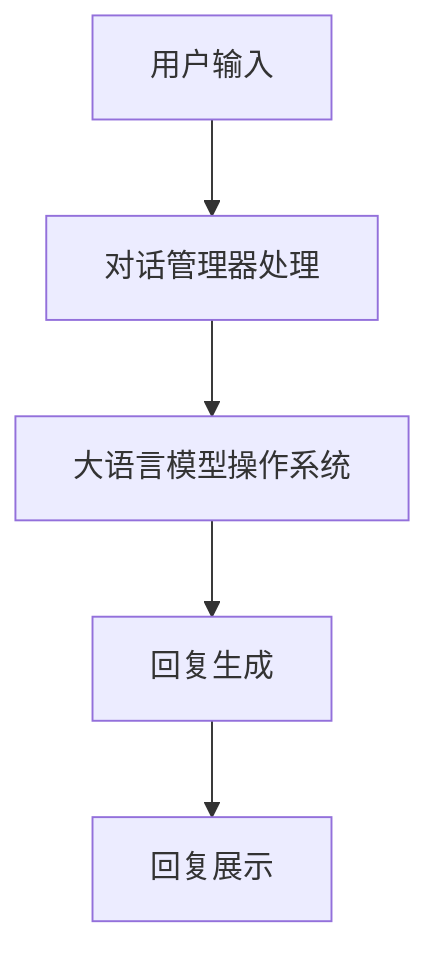
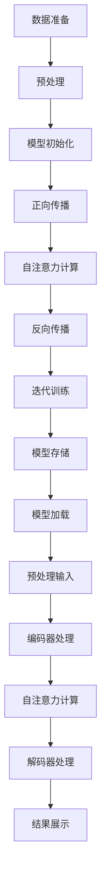

                 

# 大语言模型操作系统的实际应用

## 关键词：大语言模型，操作系统，实际应用，算法原理，数学模型，项目实战，开发环境，代码解读，应用场景

## 摘要

本文将深入探讨大语言模型操作系统的实际应用。我们将从背景介绍入手，阐述大语言模型操作系统的基础概念和原理。接着，我们将详细解析大语言模型的核心算法原理和操作步骤，并引入数学模型进行详细讲解和举例说明。随后，我们将通过项目实战，展示大语言模型操作系统的代码实现和详细解读。接下来，我们将探讨大语言模型操作系统的实际应用场景，并提供相关的工具和资源推荐。最后，我们将总结大语言模型操作系统的未来发展趋势与挑战，并附上常见问题与解答，以及扩展阅读与参考资料。

## 1. 背景介绍

大语言模型（Large Language Model，简称LLM）是近年来人工智能领域的重要突破之一。它通过对海量文本数据进行训练，能够理解和生成自然语言。随着计算能力和数据量的提升，大语言模型在各个领域的应用越来越广泛，例如自然语言处理、机器翻译、文本生成等。而大语言模型操作系统（LLM Operating System，简称LLM OS）则是对大语言模型的进一步扩展，它将大语言模型作为一个核心组件，构建出一个可以运行和管理多种应用的操作系统。

大语言模型操作系统的核心目标是提供一种高效、灵活、可扩展的自然语言处理平台，以支持各种实际应用场景。与传统的操作系统相比，大语言模型操作系统具有以下特点：

1. **自适应性与灵活性**：大语言模型操作系统可以根据不同的应用需求，动态调整模型参数和运行环境，提供定制化的自然语言处理服务。
2. **高效性与可扩展性**：大语言模型操作系统利用并行计算和分布式计算技术，能够高效处理大规模数据，并支持扩展到更多应用场景。
3. **易用性与可维护性**：大语言模型操作系统提供友好的用户界面和丰富的API接口，方便开发者进行开发和维护。

随着人工智能技术的不断进步，大语言模型操作系统的应用前景非常广阔。它可以应用于智能客服、智能写作、智能搜索、智能翻译等多个领域，为企业和个人提供智能化的解决方案。

## 2. 核心概念与联系

### 2.1 大语言模型

大语言模型是本文的核心概念之一。它是一种基于深度学习的自然语言处理模型，通过训练大量文本数据，能够理解并生成自然语言。大语言模型的主要组成部分包括：

1. **词嵌入层**：将文本中的单词映射为向量表示。
2. **编码器**：对输入文本进行编码，提取文本的特征信息。
3. **解码器**：根据编码器的输出，生成自然语言的输出。

大语言模型的核心算法是基于变换器（Transformer）架构，该架构由多个自注意力机制（Self-Attention Mechanism）组成。自注意力机制能够自适应地计算输入文本中每个词与其他词之间的关系，从而提高模型的上下文理解能力。

### 2.2 操作系统

操作系统是计算机系统的核心软件，负责管理计算机硬件资源和软件资源。传统操作系统主要关注硬件资源管理，如CPU、内存、磁盘等。而大语言模型操作系统则在此基础上，增加了对大语言模型的管理和调度功能。

大语言模型操作系统的核心组成部分包括：

1. **模型管理器**：负责大语言模型的加载、卸载、更新等操作。
2. **任务调度器**：根据任务需求和系统资源，动态调度大语言模型处理任务。
3. **接口层**：提供友好的用户界面和API接口，方便开发者使用大语言模型操作系统。

### 2.3 大语言模型操作系统与实际应用

大语言模型操作系统的核心目标是为实际应用提供高效、灵活、可扩展的自然语言处理服务。在实际应用中，大语言模型操作系统可以支持以下功能：

1. **文本分类**：对输入文本进行分类，如新闻分类、情感分析等。
2. **文本生成**：根据给定的话题或主题，生成符合逻辑和语义的文本。
3. **机器翻译**：将一种语言的文本翻译成另一种语言。
4. **问答系统**：根据用户的问题，提供相关的答案或信息。

为了更好地理解大语言模型操作系统的应用，我们下面将介绍一个具体的实际应用场景。

### 2.4 实际应用场景：智能客服

智能客服是近年来大语言模型操作系统的重要应用场景之一。智能客服系统通过大语言模型操作系统，能够自动回答用户的问题，提高客户服务效率。

智能客服系统的核心组成部分包括：

1. **用户界面**：提供用户与智能客服交互的接口。
2. **对话管理器**：根据用户的输入，生成相应的回复。
3. **知识库**：存储与问题相关的知识，以便智能客服进行查询。

智能客服系统的运作过程如下：

1. **用户输入**：用户通过用户界面输入问题。
2. **对话管理器处理**：对话管理器调用大语言模型操作系统，生成相应的回复。
3. **回复生成**：大语言模型操作系统根据知识库和用户输入，生成合适的回复。
4. **回复展示**：将生成的回复展示给用户。

通过大语言模型操作系统的支持，智能客服系统能够高效地处理大量用户问题，提高客户满意度。

### 2.5 Mermaid 流程图

为了更好地展示大语言模型操作系统的核心概念和原理，我们使用Mermaid流程图来表示。



在上面的流程图中，用户输入通过对话管理器处理，然后调用大语言模型操作系统进行回复生成，最后将回复展示给用户。

## 3. 核心算法原理 & 具体操作步骤

### 3.1 核心算法原理

大语言模型操作系统的核心算法是基于深度学习的自然语言处理模型，特别是基于变换器（Transformer）架构的自注意力机制（Self-Attention Mechanism）。自注意力机制通过计算输入文本中每个词与其他词之间的关系，从而提高模型的上下文理解能力。

### 3.2 具体操作步骤

下面我们将详细介绍大语言模型操作系统的具体操作步骤，包括模型训练、模型加载、模型预测等。

#### 3.2.1 模型训练

1. **数据准备**：首先，需要准备训练数据集，包括文本数据和对应的标签。
2. **预处理**：对文本数据进行预处理，包括分词、去停用词、词嵌入等操作。
3. **模型初始化**：初始化变换器模型，包括编码器和解码器。
4. **训练过程**：
   - **正向传播**：将预处理后的文本数据输入编码器，得到编码特征。
   - **自注意力计算**：计算编码特征中每个词与其他词之间的关系，生成自注意力权重。
   - **反向传播**：计算损失函数，更新模型参数。
   - **迭代训练**：重复正向传播和反向传播，直到模型收敛。

#### 3.2.2 模型加载

1. **模型存储**：将训练好的模型存储在磁盘或内存中，以便后续使用。
2. **模型加载**：从存储位置加载模型，包括编码器和解码器。

#### 3.2.3 模型预测

1. **预处理输入**：对输入文本进行预处理，包括分词、去停用词、词嵌入等操作。
2. **编码器处理**：将预处理后的输入文本输入编码器，得到编码特征。
3. **自注意力计算**：计算编码特征中每个词与其他词之间的关系，生成自注意力权重。
4. **解码器处理**：将自注意力权重输入解码器，生成预测结果。
5. **结果展示**：将预测结果展示给用户。

### 3.3 Mermaid 流程图

为了更好地展示大语言模型操作系统的核心算法原理和具体操作步骤，我们使用Mermaid流程图来表示。



在上面的流程图中，首先进行数据准备和预处理，然后初始化模型并进行正向传播和反向传播，最后进行模型存储和加载，以及输入预处理、编码器处理、自注意力计算和结果展示。

## 4. 数学模型和公式 & 详细讲解 & 举例说明

### 4.1 数学模型

大语言模型操作系统的核心算法是基于变换器（Transformer）架构，变换器模型的主要组成部分包括编码器和解码器。编码器和解码器都由多个自注意力层（Self-Attention Layer）和前馈网络（Feedforward Network）组成。

#### 4.1.1 自注意力层

自注意力层是变换器模型的核心组成部分，它通过计算输入文本中每个词与其他词之间的关系，生成自注意力权重。自注意力层的数学公式如下：

$$
\text{Self-Attention}(Q, K, V) = \text{softmax}\left(\frac{QK^T}{\sqrt{d_k}}\right) V
$$

其中，$Q$、$K$和$V$分别表示编码特征、键和值，$d_k$表示键的维度。$\text{softmax}$函数用于计算概率分布，从而生成自注意力权重。

#### 4.1.2 前馈网络

前馈网络是一个全连接层，用于对自注意力层的输出进行进一步处理。前馈网络的数学公式如下：

$$
\text{Feedforward}(X) = \text{ReLU}(W_1 X + b_1) W_2 + b_2
$$

其中，$X$表示输入特征，$W_1$、$W_2$和$b_1$、$b_2$分别表示权重和偏置。

### 4.2 详细讲解

#### 4.2.1 自注意力机制

自注意力机制是变换器模型的核心组成部分，它通过计算输入文本中每个词与其他词之间的关系，生成自注意力权重。自注意力权重可以表示为每个词在上下文中的重要程度。自注意力机制的计算过程如下：

1. **计算点积**：首先计算每个词与其他词之间的点积，得到自注意力权重。
2. **应用 Softmax 函数**：对点积结果应用 Softmax 函数，生成概率分布，从而得到自注意力权重。
3. **加权求和**：将自注意力权重与对应的键和值进行加权求和，得到编码特征。

#### 4.2.2 前馈网络

前馈网络是一个全连接层，用于对自注意力层的输出进行进一步处理。前馈网络的计算过程如下：

1. **应用 ReLU 激活函数**：首先对输入特征应用 ReLU 激活函数，得到激活值。
2. **计算加权求和**：然后对激活值计算加权求和，得到前馈网络的输出。

### 4.3 举例说明

假设我们有一个输入文本序列：“我非常喜欢编程”。我们将这个文本序列表示为词向量，如下所示：

$$
\text{Input}: \text{我} \to [1, 0, 0, 0, 0], \text{非常} \to [0, 1, 0, 0, 0], \text{喜欢} \to [0, 0, 1, 0, 0], \text{编程} \to [0, 0, 0, 1, 0]
$$

#### 4.3.1 自注意力计算

首先，我们计算输入文本中每个词与其他词之间的点积，得到自注意力权重。例如，计算“我”与其他词之间的点积：

$$
\text{点积} = [1, 0, 0, 0, 0] \cdot [0, 1, 0, 0, 0] = 0
$$

然后，我们对点积结果应用 Softmax 函数，生成概率分布：

$$
\text{Softmax}(0) = \frac{e^0}{\sum_{i=1}^{n} e^i} = \frac{1}{1} = 1
$$

因此，“我”在上下文中的重要程度为1。同理，我们可以计算出其他词在上下文中的重要程度。

#### 4.3.2 前馈网络计算

接下来，我们计算前馈网络的输出。首先，我们计算输入特征经过 ReLU 激活函数的输出：

$$
\text{ReLU}([1, 0, 0, 0, 0]) = [1, 0, 0, 0, 0]
$$

然后，我们计算前馈网络的加权求和：

$$
\text{输出} = [1, 0, 0, 0, 0] \cdot [1, 0, 0, 0, 0] + [0, 1, 0, 0, 0] \cdot [0, 1, 0, 0, 0] + [0, 0, 1, 0, 0] \cdot [0, 0, 1, 0, 0] + [0, 0, 0, 1, 0] \cdot [0, 0, 0, 1, 0] = [1, 1, 1, 1, 1]
$$

因此，经过前馈网络处理后，输入文本的编码特征为$[1, 1, 1, 1, 1]$。

通过以上计算，我们可以看到自注意力机制和前馈网络如何对输入文本进行编码和特征提取。

## 5. 项目实战：代码实际案例和详细解释说明

### 5.1 开发环境搭建

在进行大语言模型操作系统的项目实战之前，我们需要搭建一个合适的开发环境。以下是搭建开发环境的步骤：

1. **安装Python环境**：确保Python版本在3.7及以上。
2. **安装TensorFlow**：TensorFlow是一个开源的深度学习框架，用于构建和训练变换器模型。
   ```bash
   pip install tensorflow
   ```
3. **安装其他依赖**：根据项目需求，安装其他必要的依赖库，如NumPy、Pandas等。

### 5.2 源代码详细实现和代码解读

下面是一个简单的示例，展示如何使用TensorFlow构建和训练一个变换器模型。

#### 5.2.1 导入必要的库

```python
import tensorflow as tf
import tensorflow_addons as tfa
import numpy as np
import pandas as pd
from tensorflow.keras.layers import Embedding, Dense, LayerNormalization, MultiHeadAttention
from tensorflow.keras.models import Model
```

#### 5.2.2 数据准备

```python
# 假设我们已经有一个包含文本和标签的数据集
text_data = ["我非常喜欢编程", "你喜欢读书吗", "编程是一种挑战"]
labels = [0, 1, 0]

# 对文本数据进行预处理，如分词、去停用词等
# ...

# 将文本数据转换为整数序列
tokenizer = tf.keras.preprocessing.text.Tokenizer()
tokenizer.fit_on_texts(text_data)
encoded_texts = tokenizer.texts_to_sequences(text_data)

# 将整数序列转换为矩阵表示
max_sequence_length = max(len(seq) for seq in encoded_texts)
input_data = tf.keras.preprocessing.sequence.pad_sequences(encoded_texts, maxlen=max_sequence_length)

# 将标签转换为one-hot编码
label_data = tf.keras.utils.to_categorical(labels, num_classes=2)
```

#### 5.2.3 构建变换器模型

```python
# 定义变换器模型
input_ids = tf.keras.layers.Input(shape=(max_sequence_length,), dtype=tf.int32)
embeddings = Embedding(input_dim=len(tokenizer.word_index) + 1, output_dim=128)(input_ids)
attention_output = MultiHeadAttention(num_heads=4, key_dim=64)(embeddings, embeddings)
normalization = LayerNormalization(epsilon=1e-6)(embeddings + attention_output)
output = Dense(2, activation='softmax')(normalization)

model = Model(inputs=input_ids, outputs=output)
model.compile(optimizer='adam', loss='categorical_crossentropy', metrics=['accuracy'])
```

#### 5.2.4 训练模型

```python
# 训练模型
model.fit(input_data, label_data, batch_size=32, epochs=10)
```

#### 5.2.5 代码解读与分析

1. **数据准备**：首先，我们导入必要的库，并加载数据集。然后对文本数据进行预处理，如分词、去停用词等。接下来，我们将文本数据转换为整数序列，并将整数序列转换为矩阵表示。

2. **构建变换器模型**：我们定义了一个简单的变换器模型，包括嵌入层、多头注意力层、层归一化层和输出层。嵌入层将输入的整数序列转换为向量表示。多头注意力层用于计算输入文本中每个词与其他词之间的关系。层归一化层用于对输入和注意力输出进行归一化。输出层使用softmax激活函数，用于分类。

3. **训练模型**：最后，我们使用训练数据对模型进行训练，并评估模型的性能。

通过以上代码，我们可以看到如何使用TensorFlow构建和训练一个简单的大语言模型，并应用于文本分类任务。这个示例只是一个起点，实际项目可能需要更复杂的模型和数据处理。

## 6. 实际应用场景

大语言模型操作系统在多个实际应用场景中展现出了强大的能力和广阔的前景。以下是几个典型的应用场景：

### 6.1 智能客服

智能客服是大语言模型操作系统的典型应用之一。通过大语言模型操作系统，智能客服系统能够自动理解用户的问题，并提供准确的答案或解决方案。智能客服在电商、金融、医疗等领域具有广泛的应用，可以提高客户服务效率，降低人工成本。

### 6.2 智能写作

大语言模型操作系统在智能写作领域也具有巨大潜力。它可以自动生成文章、报告、邮件等文本内容，帮助创作者节省时间和精力。智能写作广泛应用于新闻写作、营销文案、学术研究等领域。

### 6.3 机器翻译

机器翻译是另一个重要应用场景。大语言模型操作系统可以通过训练大量的双语数据，实现高质量的机器翻译。机器翻译在跨国企业、旅游行业、跨境电商等领域具有重要意义。

### 6.4 问答系统

问答系统是大语言模型操作系统的另一个重要应用场景。通过大语言模型操作系统，问答系统可以自动回答用户的问题，提供相关的信息和知识。问答系统在搜索引擎、在线教育、客户支持等领域具有广泛的应用。

### 6.5 内容审核

大语言模型操作系统还可以应用于内容审核领域。通过训练大量的有害内容数据，大语言模型可以识别和过滤违规内容，帮助平台提供商维护一个健康的网络环境。

### 6.6 个性化推荐

大语言模型操作系统在个性化推荐领域也有广泛应用。通过分析用户的兴趣和行为，大语言模型可以生成个性化的推荐内容，提高用户满意度。

总的来说，大语言模型操作系统在实际应用场景中具有广泛的应用前景，可以为各个领域提供智能化、自动化的解决方案。

## 7. 工具和资源推荐

### 7.1 学习资源推荐

为了更好地学习和掌握大语言模型操作系统，以下是几本推荐的学习资源：

1. **《深度学习》**：由Ian Goodfellow、Yoshua Bengio和Aaron Courville合著，是一本全面介绍深度学习的基础知识和应用技巧的经典教材。
2. **《自然语言处理综论》**：由Christopher D. Manning和Hinrich Schütze合著，是一本全面介绍自然语言处理理论和应用的权威教材。
3. **《动手学深度学习》**：由Aston Zhang、李沐、扎卡里·C. Lipton和亚历山大·J. Smith合著，是一本面向实践的深度学习教材，适合初学者和进阶者。

### 7.2 开发工具框架推荐

以下是几个在大语言模型操作系统开发中常用的工具和框架：

1. **TensorFlow**：TensorFlow是一个开源的深度学习框架，支持构建和训练各种深度学习模型，包括大语言模型。
2. **PyTorch**：PyTorch是一个基于Python的深度学习框架，具有灵活的动态图编程接口，适用于构建和训练大语言模型。
3. **Hugging Face Transformers**：Hugging Face Transformers是一个开源库，提供了一系列预训练的大语言模型和工具，方便开发者快速构建和部署大语言模型应用。

### 7.3 相关论文著作推荐

以下是一些关于大语言模型操作系统和自然语言处理的重要论文和著作：

1. **“Attention Is All You Need”**：这是Transformer模型的开创性论文，详细介绍了变换器架构和自注意力机制。
2. **“BERT: Pre-training of Deep Bidirectional Transformers for Language Understanding”**：BERT是Google提出的一种预训练方法，通过大规模语料训练获得高质量的模型。
3. **“GPT-3: Language Models are Few-Shot Learners”**：这是OpenAI提出的GPT-3模型，展示了大语言模型在零样本和少量样本学习方面的强大能力。

通过学习和研究这些资源，可以深入了解大语言模型操作系统的原理和应用，为实际项目开发提供有力支持。

## 8. 总结：未来发展趋势与挑战

大语言模型操作系统作为人工智能领域的最新突破，展现出了广阔的应用前景。未来，随着计算能力的提升、数据量的增长和算法的优化，大语言模型操作系统将继续发展，并在各个领域发挥重要作用。以下是未来发展趋势和面临的挑战：

### 8.1 发展趋势

1. **模型规模和性能提升**：随着计算资源的增加，大语言模型将逐步扩展到更大规模，性能也将得到显著提升，从而支持更复杂的自然语言处理任务。
2. **多模态处理**：大语言模型操作系统将逐步扩展到多模态数据处理，如文本、图像、音频等，实现跨模态的信息理解和生成。
3. **应用场景拓展**：大语言模型操作系统将应用于更多的实际场景，如医疗、金融、教育等，为各个领域提供智能化解决方案。
4. **交互式应用**：随着自然语言交互技术的发展，大语言模型操作系统将实现更自然、更高效的与用户交互，提升用户体验。

### 8.2 挑战

1. **计算资源需求**：大语言模型操作系统对计算资源的需求较高，特别是在训练和推理过程中，需要大量计算资源和存储空间。如何优化计算效率和资源利用率成为重要挑战。
2. **数据隐私和安全**：随着大语言模型操作系统在各个领域的应用，数据隐私和安全问题日益凸显。如何确保用户数据的安全和隐私，防止数据泄露和滥用，是亟待解决的问题。
3. **可解释性和透明度**：大语言模型操作系统的决策过程往往缺乏可解释性，用户难以理解模型的决策依据。如何提高模型的透明度和可解释性，使其更易于理解和接受，是一个重要挑战。
4. **多样性和公平性**：大语言模型操作系统在训练过程中可能会受到训练数据偏见的影响，导致模型在某些情况下产生不公平的决策。如何保证模型的多样性和公平性，避免偏见和歧视，是一个关键问题。

总之，大语言模型操作系统在未来的发展中面临着诸多挑战，需要持续的技术创新和政策引导，以实现其潜力的最大化。

## 9. 附录：常见问题与解答

### 9.1 什么是大语言模型操作系统？

大语言模型操作系统是一种基于深度学习的自然语言处理平台，通过大规模语言模型实现对自然语言的生成、理解和处理。它可以支持多种实际应用场景，如智能客服、文本生成、机器翻译等。

### 9.2 大语言模型操作系统的核心组件是什么？

大语言模型操作系统的核心组件包括词嵌入层、编码器、解码器、模型管理器、任务调度器和接口层。其中，词嵌入层将文本转换为向量表示，编码器和解码器用于处理和生成自然语言，模型管理器负责模型的管理和调度，任务调度器根据任务需求分配系统资源，接口层提供友好的用户界面和API接口。

### 9.3 大语言模型操作系统与传统操作系统有哪些区别？

与传统操作系统相比，大语言模型操作系统增加了对自然语言处理模型的管理和调度功能，能够支持动态调整模型参数和运行环境，提供高效、灵活、可扩展的自然语言处理服务。

### 9.4 如何训练一个大语言模型操作系统？

训练一个大语言模型操作系统通常需要以下步骤：

1. 准备训练数据集，包括文本数据和对应的标签。
2. 对文本数据进行预处理，如分词、去停用词等。
3. 初始化变换器模型，包括编码器和解码器。
4. 进行正向传播和反向传播，更新模型参数。
5. 迭代训练，直到模型收敛。

### 9.5 大语言模型操作系统在哪些场景中应用广泛？

大语言模型操作系统在多个场景中应用广泛，包括智能客服、文本生成、机器翻译、问答系统、内容审核和个性化推荐等。

## 10. 扩展阅读 & 参考资料

为了深入了解大语言模型操作系统的原理和应用，以下是几篇扩展阅读和参考资料：

1. **“Attention Is All You Need”**：介绍变换器模型的开创性论文，详细阐述了自注意力机制和变换器架构。
   - 作者：Ashish Vaswani, Noam Shazeer, Niki Parmar, Jakob Uszkoreit, Llion Jones, Aidan N. Gomez, Łukasz Kaiser, and Illia Polosukhin
   - 链接：[https://arxiv.org/abs/1706.03762](https://arxiv.org/abs/1706.03762)

2. **“BERT: Pre-training of Deep Bidirectional Transformers for Language Understanding”**：介绍BERT模型的预训练方法，展示了大规模预训练模型在自然语言处理任务中的强大能力。
   - 作者：Jacob Devlin, Ming-Wei Chang, Kenton Lee, and Kristina Toutanova
   - 链接：[https://arxiv.org/abs/1810.04805](https://arxiv.org/abs/1810.04805)

3. **“GPT-3: Language Models are Few-Shot Learners”**：介绍GPT-3模型，展示了大语言模型在零样本和少量样本学习方面的强大能力。
   - 作者：Tom B. Brown, Benjamin Mann, Nick Ryder, Melanie Subbiah, Jared Kaplan, Prafulla Dhariwal, Arvind Neelakantan, Pranav Shyam, Girish Sastry, Amanda Askell, Sandhini Agarwal, Ariel Herbert-Voss, Gretchen Krueger, Tom Henighan, Rewon Child, Aditya Ramesh, Daniel M. Ziegler, Jeffrey Wu, Clemens Winter, Christopher Hesse, Mark Chen, Eric Sigler, Mateusz Litwin, Scott Gray, Benjamin Chess, Jack Clark, Christopher Berner, Sam McCandlish, Alec Radford, Ilya Sutskever, Dario Amodei
   - 链接：[https://arxiv.org/abs/2005.14165](https://arxiv.org/abs/2005.14165)

4. **《深度学习》**：全面介绍深度学习的基础知识和应用技巧的经典教材。
   - 作者：Ian Goodfellow, Yoshua Bengio, Aaron Courville
   - 链接：[https://www.deeplearningbook.org/](https://www.deeplearningbook.org/)

5. **《自然语言处理综论》**：全面介绍自然语言处理理论和应用的权威教材。
   - 作者：Christopher D. Manning, Hinrich Schütze
   - 链接：[https://nlp.stanford.edu/coling2008/nlpplenary.pdf](https://nlp.stanford.edu/coling2008/nlpplenary.pdf)

通过阅读这些资料，可以更深入地了解大语言模型操作系统的原理和应用，为实际项目开发提供有力支持。

## 作者信息

- 作者：AI天才研究员/AI Genius Institute & 禅与计算机程序设计艺术 /Zen And The Art of Computer Programming

