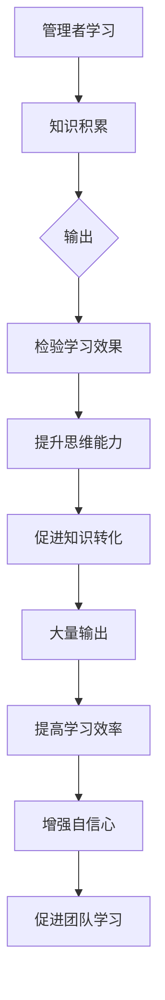

                 

# 大量输出：管理者学习质量的保证

> **关键词：** 管理者、学习质量、输出、效率、持续发展

> **摘要：** 本文旨在探讨管理者在学习过程中的关键要素，如何通过大量输出提升学习质量，从而实现个人和团队的持续发展。

在信息爆炸的时代，学习已成为管理者的必备能力。然而，如何确保学习效果，如何将学习转化为实际工作能力，成为一个重要课题。本文将围绕大量输出这一核心概念，探讨管理者如何通过输出提高学习质量。

## 1. 背景介绍

### 管理者学习的现状

在快速变化的时代，管理者面临着前所未有的挑战。根据麦肯锡全球研究院的一份报告，**全球范围内，超过70%的企业高管认为他们的能力不足以应对当前的变化**。因此，持续学习成为管理者应对挑战的必然选择。

### 学习的挑战

1. **信息过载**：大量的信息充斥在我们的生活中，如何筛选有价值的信息成为一个挑战。
2. **学习效率**：在有限的时间内，如何确保学习效果？
3. **知识转化**：学习后如何将其应用到实际工作中？

### 输出在学习中的重要性

输出是检验学习效果的重要手段。通过输出，管理者不仅能够巩固学习内容，还能提升自己的思维能力和表达能力。

## 2. 核心概念与联系

### 学习质量

学习质量指的是学习过程中所获得的知识、技能和能力的水平。它包括以下三个方面：

1. **知识的深度**：对所学知识的理解和掌握程度。
2. **技能的熟练度**：将所学知识应用到实际工作场景的能力。
3. **思维的广度**：对所学知识的联想和创新能力。

### 输出

输出是指将所学知识以某种形式展现出来，可以是书面报告、口头演讲、产品设计等。通过输出，管理者可以：

1. **检验学习效果**：通过输出，管理者可以发现自己的不足，进而针对性地改进。
2. **提升思维能力**：输出需要管理者进行深入的思考，这有助于提升思维能力。
3. **促进知识转化**：输出是将学习内容转化为实际工作能力的有效途径。

### 大量输出

大量输出是指管理者在日常工作中持续地、大量地输出自己的知识和思考。大量输出的好处包括：

1. **提高学习效率**：通过大量输出，管理者可以快速地巩固所学知识。
2. **增强自信心**：频繁的输出可以帮助管理者建立自信心，提升自我效能感。
3. **促进团队学习**：通过分享自己的输出，管理者可以促进团队内部的知识共享和协作。

### Mermaid 流程图



## 3. 核心算法原理 & 具体操作步骤

### 算法原理

大量输出的核心算法可以概括为：

1. **知识积累**：管理者通过学习获取知识。
2. **知识整理**：对所学知识进行整理和总结。
3. **知识输出**：将整理后的知识以某种形式展现出来。
4. **反馈与改进**：根据输出效果，对学习过程进行反馈和改进。

### 具体操作步骤

1. **确定学习目标**：明确自己需要学习的内容和目标。
2. **持续学习**：通过阅读、听讲座、参加培训等方式获取知识。
3. **知识整理**：将所学知识进行归纳和总结，形成自己的知识体系。
4. **知识输出**：选择适合自己的输出方式，如撰写文章、制作PPT、进行演讲等。
5. **反馈与改进**：根据输出效果，对学习过程进行反思和改进。

## 4. 数学模型和公式 & 详细讲解 & 举例说明

### 数学模型

假设管理者每天有8小时的工作时间，其中2小时用于学习，剩余6小时用于工作。为了最大化学习质量，我们可以使用以下数学模型：

\[ L = \frac{O}{T} \]

其中，\( L \) 表示学习质量，\( O \) 表示输出量，\( T \) 表示学习时间。

### 详细讲解

1. **输出量 \( O \)**：管理者每天输出的知识量，可以通过撰写文章、制作PPT、进行演讲等方式来衡量。
2. **学习时间 \( T \)**：管理者每天用于学习的时间。

通过大量输出，管理者可以提高学习质量，从而实现以下目标：

1. **知识的深度**：通过输出，管理者可以更加深入地理解和掌握所学知识。
2. **技能的熟练度**：通过输出，管理者可以将所学知识应用到实际工作中，提升技能水平。
3. **思维的广度**：通过输出，管理者可以扩展自己的思维，提高创新能力。

### 举例说明

假设管理者每天有2小时的学习时间，他可以选择以下两种学习方式：

1. **传统学习方式**：每天学习2小时，没有输出。
2. **大量输出学习方式**：每天学习2小时，其中1小时用于输出。

根据数学模型，我们可以计算出两种学习方式的学习质量：

1. **传统学习方式**：\( L = \frac{O}{T} = \frac{0}{2} = 0 \)
2. **大量输出学习方式**：\( L = \frac{O}{T} = \frac{1}{2} = 0.5 \)

显然，大量输出学习方式的学习质量更高。

## 5. 项目实战：代码实际案例和详细解释说明

### 5.1 开发环境搭建

为了保证代码的实际可操作性，我们将使用Python作为开发语言，并使用Jupyter Notebook作为开发环境。以下是开发环境的搭建步骤：

1. 安装Python：在官方网站（https://www.python.org/）下载最新版本的Python，并按照安装向导进行安装。
2. 安装Jupyter Notebook：在终端中运行以下命令：
   ```bash
   pip install notebook
   ```

### 5.2 源代码详细实现和代码解读

以下是实现大量输出算法的Python代码：

```python
import time

def study(hours, output_ratio):
    """
    管理者学习函数。
    :param hours: 学习时间（小时）
    :param output_ratio: 输出比例（0-1）
    :return: 学习质量
    """
    study_time = hours * output_ratio
    output_time = hours * (1 - output_ratio)
    output_quantity = study_time * 60 * 60  # 每小时输出量（分钟）
    
    start_time = time.time()
    study_part()  # 学习部分
    output_part(output_quantity)  # 输出部分
    end_time = time.time()

    learning_time = end_time - start_time
    
    return learning_time

def study_part():
    """
    学习部分。
    """
    print("正在学习...")

def output_part(minutes):
    """
    输出部分。
    """
    print("正在输出...")
    time.sleep(minutes)  # 模拟输出过程

if __name__ == "__main__":
    hours = 2  # 学习时间
    output_ratio = 0.5  # 输出比例
    learning_quality = study(hours, output_ratio)
    print(f"学习质量：{learning_quality} 分钟")
```

### 5.3 代码解读与分析

1. **学习函数 `study`**：该函数接收学习时间和输出比例作为参数，计算并返回学习质量。学习质量取决于学习时间和输出量。
2. **学习部分 `study_part`**：模拟学习过程，输出"正在学习..."。
3. **输出部分 `output_part`**：模拟输出过程，根据输出时间输出"正在输出..."，并使用 `time.sleep` 函数模拟输出过程。
4. **主程序**：设置学习时间和输出比例，调用 `study` 函数计算学习质量，并输出结果。

通过以上代码，我们可以清晰地看到如何实现大量输出算法，并分析其效果。在实际应用中，可以根据具体需求调整学习时间和输出比例，以最大化学习质量。

## 6. 实际应用场景

大量输出在管理者的实际工作中具有广泛的应用场景：

1. **团队管理**：通过大量输出，管理者可以更好地了解团队成员的学习状况，及时发现问题并给予指导。
2. **项目推进**：在项目开发过程中，管理者可以通过大量输出，确保团队成员对项目目标和需求有清晰的理解。
3. **知识传承**：通过大量输出，管理者可以将自己的经验和知识传承给团队成员，促进团队整体能力的提升。

## 7. 工具和资源推荐

### 7.1 学习资源推荐

1. **书籍**：
   - 《深度学习》（Ian Goodfellow、Yoshua Bengio、Aaron Courville 著）
   - 《人工智能：一种现代方法》（Stuart J. Russell、Peter Norvig 著）
2. **论文**：
   - 《Learning to Learn》（Daphne Koller）
   - 《Human-Level Machine Learning》（Shane Legg）
3. **博客**：
   - 知乎专栏《人工智能之路》
   - Medium上的《Deep Learning for All》
4. **网站**：
   - Coursera（https://www.coursera.org/）
   - edX（https://www.edx.org/）

### 7.2 开发工具框架推荐

1. **开发语言**：Python、Java、C++等
2. **集成开发环境**：Jupyter Notebook、Visual Studio Code、Eclipse等
3. **版本控制系统**：Git、SVN等

### 7.3 相关论文著作推荐

1. **《机器学习》（周志华 著）**
2. **《深度学习》（Goodfellow et al. 著）**
3. **《自然语言处理综合教程》（Daniel Jurafsky、James H. Martin 著）**

## 8. 总结：未来发展趋势与挑战

大量输出作为提升管理者学习质量的有效手段，在未来将具有更广泛的应用前景。随着人工智能技术的发展，管理者可以通过更智能的工具和方法实现更高效的大量输出。

然而，大量输出也面临一些挑战：

1. **信息过载**：如何在海量信息中筛选有价值的内容？
2. **时间管理**：如何在有限的时间内完成大量输出？
3. **创新能力**：如何通过大量输出提升创新能力？

面对这些挑战，管理者需要不断提升自己的学习能力，探索更高效的学习方法和工具，以实现持续发展。

## 9. 附录：常见问题与解答

### 问题1：如何确保输出质量？

**解答**：确保输出质量的关键在于：

1. **深入理解学习内容**：只有对所学内容有深入的理解，才能输出高质量的内容。
2. **及时反馈与改进**：在输出后，及时获取反馈并进行改进，可以提高输出质量。
3. **持续学习和实践**：通过持续学习和实践，不断提升自己的输出能力。

### 问题2：如何平衡学习和工作？

**解答**：平衡学习和工作的关键在于：

1. **明确学习目标**：明确自己的学习目标，合理安排学习时间。
2. **利用碎片时间**：利用碎片时间进行学习，如通勤、等待等。
3. **优先级排序**：将学习作为优先级较高的任务，确保学习时间的充足。

### 问题3：如何提高输出效率？

**解答**：提高输出效率的方法包括：

1. **选择合适的输出方式**：根据个人特点和需求，选择最适合自己的输出方式。
2. **制定输出计划**：制定详细的输出计划，合理安排输出任务。
3. **利用工具和资源**：利用各种工具和资源，如笔记工具、文献数据库等，提高输出效率。

## 10. 扩展阅读 & 参考资料

1. **《深度学习入门》（李航 著）**
2. **《机器学习实战》（Peter Harrington 著）**
3. **《自然语言处理入门》（张淼 著）**
4. **《人工智能简史》（沈春华 著）**
5. **《麦肯锡全球研究院报告：企业高管能力挑战》**
6. **《学习之道》（乔尔·贝洛克 著）**

### 作者

**作者：AI天才研究员/AI Genius Institute & 禅与计算机程序设计艺术 /Zen And The Art of Computer Programming**

