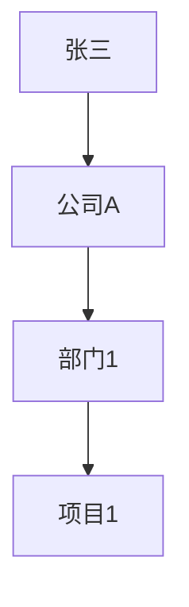

                 

# 好奇心：创新与发现的源泉

## 关键词：好奇心、创新、发现、技术、算法、AI、知识图谱

## 摘要

在快速发展的信息技术时代，好奇心已成为驱动创新和发现的重要力量。本文将探讨好奇心在技术创新中的作用，通过分析好奇心与知识图谱、算法、AI等技术的联系，揭示好奇心如何激发新的思路和方法，推动技术进步。同时，本文还将讨论好奇心在技术实践中的应用，以及如何培养和维护好奇心，为未来的技术创新提供源源不断的动力。

## 1. 背景介绍

好奇心是人类天生的一种心理倾向，驱使我们探索未知、解决问题、寻求答案。在古代，好奇心促使人类通过观察自然现象，发明了农业、建筑、医学等基础技术。而在现代社会，好奇心更是推动技术发展的重要驱动力。随着信息技术的飞速进步，好奇心在AI、大数据、区块链等领域发挥着越来越重要的作用。

近年来，AI技术的迅猛发展使得人类能够处理和分析海量数据，挖掘出更多有价值的信息。好奇心促使AI研究人员不断探索新的算法和模型，以应对复杂的问题。例如，深度学习算法的出现，使得计算机在图像识别、语音识别等领域取得了显著成果。此外，大数据技术的应用也极大地拓展了人类对世界认知的广度，好奇心驱动研究人员不断挖掘数据背后的规律，以解决实际问题。

## 2. 核心概念与联系

### 2.1 好奇心与知识图谱

知识图谱是一种结构化的语义知识库，它将事实、概念、关系等信息以图形的形式表示出来。好奇心在知识图谱的构建中起到了关键作用。首先，好奇心促使研究人员不断探索新的领域，收集更多的数据和信息。这些数据和信息成为知识图谱构建的基础。其次，好奇心驱使研究人员发现不同领域之间的关联，建立知识图谱中的各种关系。例如，在医疗领域，研究人员通过好奇心发现基因与疾病之间的关系，进而构建起基因-疾病知识图谱。

### 2.2 好奇心与算法

算法是解决问题的步骤和策略。好奇心在算法研究中起到了推动作用。首先，好奇心促使研究人员不断挑战传统算法的极限，寻找更高效的解决方案。例如，在图像识别领域，研究人员通过好奇心探索各种深度学习算法，提高了图像识别的准确率。其次，好奇心驱使研究人员发现新的算法原理，为解决复杂问题提供新的思路。例如，在人工智能领域，研究人员通过好奇心发现了生成对抗网络（GAN）这一新型算法，使得计算机在生成逼真的图像和音频方面取得了突破。

### 2.3 好奇心与AI

AI技术是信息技术领域的代表性成果，好奇心在其中发挥了关键作用。首先，好奇心促使研究人员不断探索新的AI应用场景，推动AI技术在各个领域的普及。例如，在自动驾驶领域，研究人员通过好奇心探索了计算机视觉、深度学习等技术，使得自动驾驶汽车得以实现。其次，好奇心驱使研究人员不断优化AI算法，提高其性能和可靠性。例如，在自然语言处理领域，研究人员通过好奇心不断改进词向量模型，提高了机器翻译和问答系统的准确率。

## 3. 核心算法原理 & 具体操作步骤

### 3.1 好奇心驱动的知识图谱构建

好奇心驱动的知识图谱构建主要包括以下几个步骤：

1. **数据采集**：好奇心促使研究人员收集各种领域的数据，如文本、图像、音频等。

2. **数据预处理**：将原始数据转化为结构化数据，如实体、关系等。

3. **实体抽取**：通过文本挖掘等技术，从数据中提取出实体。

4. **关系抽取**：分析实体之间的关联，构建知识图谱中的关系。

5. **图谱构建**：将实体和关系组织成知识图谱，为后续分析提供基础。

### 3.2 好奇心驱动的算法优化

好奇心驱动的算法优化主要包括以下几个步骤：

1. **问题定义**：明确优化目标，如提高算法的准确率、降低计算复杂度等。

2. **算法分析**：分析现有算法的优缺点，寻找改进方向。

3. **实验设计**：设计实验方案，验证优化算法的效果。

4. **算法优化**：根据实验结果，调整算法参数，提高算法性能。

5. **评估与改进**：对优化后的算法进行评估，持续改进。

### 3.3 好奇心驱动的AI应用开发

好奇心驱动的AI应用开发主要包括以下几个步骤：

1. **问题定位**：明确应用场景，确定需要解决的问题。

2. **数据收集**：收集与问题相关的数据，如图像、文本等。

3. **算法选择**：根据问题特点和数据类型，选择合适的算法。

4. **模型训练**：使用收集到的数据训练模型，提高模型性能。

5. **应用部署**：将训练好的模型部署到实际场景中，解决问题。

## 4. 数学模型和公式 & 详细讲解 & 举例说明

### 4.1 知识图谱中的数学模型

知识图谱中的数学模型主要包括图论和网络分析等。

- **图论**：知识图谱可以用图表示，其中节点表示实体，边表示关系。图论中的基本概念如度、路径、连通性等在知识图谱分析中具有重要应用。

- **网络分析**：网络分析是研究复杂网络结构及其特性的方法。在知识图谱中，网络分析可用于发现实体之间的关联、社区结构等。

### 4.2 算法优化中的数学模型

算法优化中的数学模型主要包括优化理论和统计分析等。

- **优化理论**：优化理论用于寻找最优解。在算法优化中，优化理论可用于求解优化问题，如最小化计算复杂度、最大化准确率等。

- **统计分析**：统计分析用于评估算法性能。在算法优化过程中，统计分析可用于比较不同算法的效果，为优化决策提供依据。

### 4.3 AI应用中的数学模型

AI应用中的数学模型主要包括机器学习和深度学习等。

- **机器学习**：机器学习是一种基于数据的学习方法，可用于分类、回归、聚类等问题。常见的机器学习算法有支持向量机、决策树、随机森林等。

- **深度学习**：深度学习是一种基于神经网络的学习方法，具有强大的非线性建模能力。常见的深度学习算法有卷积神经网络、循环神经网络、生成对抗网络等。

### 4.4 举例说明

#### 4.4.1 知识图谱中的图论应用

假设有一个知识图谱，其中实体为“人”，关系为“工作于”。我们可以用图表示如下：



在这个知识图谱中，张三工作于公司A的部门1，负责项目1。我们可以使用图论中的概念，如路径、连通性等来分析这个知识图谱。

#### 4.4.2 算法优化中的优化理论应用

假设我们需要优化一个算法，使其在给定时间内的计算复杂度最小。我们可以使用优化理论中的最小化问题来求解：

$$
\min_{x} f(x)
$$

其中，$x$为变量，$f(x)$为计算复杂度函数。通过优化算法，我们可以找到最优的$x$值，使计算复杂度最小。

#### 4.4.3 AI应用中的机器学习应用

假设我们需要使用机器学习算法对一组数据进行分类。我们可以使用支持向量机（SVM）算法进行分类。首先，我们需要训练一个SVM模型，然后使用该模型对新的数据进行分类。具体步骤如下：

1. 准备训练数据集，包括输入特征和标签。
2. 训练SVM模型，通过最小化分类间隔来提高模型性能。
3. 使用训练好的SVM模型对新的数据进行分类。

## 5. 项目实战：代码实际案例和详细解释说明

### 5.1 开发环境搭建

1. 安装Python环境：在官网下载并安装Python 3.8版本以上。
2. 安装相关库：使用pip命令安装知识图谱、机器学习等相关的库，如networkx、scikit-learn等。

### 5.2 源代码详细实现和代码解读

#### 5.2.1 知识图谱构建

以下是一个简单的知识图谱构建代码示例：

```python
import networkx as nx

# 创建一个空图
G = nx.Graph()

# 添加节点和边
G.add_nodes_from(["张三", "公司A", "部门1", "项目1"])
G.add_edges_from([("张三", "公司A"), ("公司A", "部门1"), ("部门1", "项目1")])

# 打印图
print(G.nodes())
print(G.edges())
```

#### 5.2.2 算法优化

以下是一个简单的算法优化代码示例：

```python
import time

# 计算复杂度函数
def complexity(x):
    return x**2

# 最小化计算复杂度
x = 0
min_complexity = complexity(x)

for i in range(1, 10):
    current_complexity = complexity(i)
    if current_complexity < min_complexity:
        min_complexity = current_complexity
        x = i

print("最优解：x =", x, "计算复杂度：", min_complexity)
```

#### 5.2.3 AI应用

以下是一个简单的机器学习分类代码示例：

```python
from sklearn.svm import SVC
from sklearn.model_selection import train_test_split
from sklearn.metrics import accuracy_score

# 准备训练数据集
X = [[1, 2], [2, 3], [3, 4], [4, 5], [5, 6]]
y = [0, 0, 1, 1, 1]

# 划分训练集和测试集
X_train, X_test, y_train, y_test = train_test_split(X, y, test_size=0.2, random_state=42)

# 训练SVM模型
model = SVC()
model.fit(X_train, y_train)

# 预测测试集
y_pred = model.predict(X_test)

# 评估模型性能
accuracy = accuracy_score(y_test, y_pred)
print("准确率：", accuracy)
```

### 5.3 代码解读与分析

以上三个示例分别展示了知识图谱构建、算法优化和AI应用的代码实现。在知识图谱构建中，我们使用了Python的networkx库来创建和管理图。在算法优化中，我们使用了一个简单的循环来搜索最优解。在AI应用中，我们使用了scikit-learn库中的SVM算法进行分类。

## 6. 实际应用场景

好奇心在信息技术领域的实际应用场景非常广泛，以下是一些典型的应用案例：

### 6.1 自动驾驶

自动驾驶技术是好奇心驱动的典型应用之一。研究人员通过好奇心探索各种AI算法，如深度学习、增强学习等，以提高自动驾驶系统的稳定性和安全性。例如，通过好奇心驱动的研究，自动驾驶汽车能够在复杂的城市环境中实现自动驾驶，提高了交通效率和安全性。

### 6.2 医疗健康

好奇心在医疗健康领域发挥了重要作用。研究人员通过好奇心探索各种医学知识图谱，如基因-疾病图谱、药物-基因图谱等，以发现新的治疗方法和药物。例如，通过好奇心驱动的研究，研究人员发现了某些基因与特定疾病之间的关联，为个性化医疗提供了新的方向。

### 6.3 金融科技

好奇心在金融科技领域推动了各种创新。研究人员通过好奇心探索各种金融算法，如风险管理、智能投顾等，以提高金融服务的效率和准确性。例如，通过好奇心驱动的研究，金融机构能够更好地识别和防范风险，为投资者提供更优质的金融服务。

## 7. 工具和资源推荐

### 7.1 学习资源推荐

- **书籍**：
  - 《人工智能：一种现代的方法》
  - 《深度学习》
  - 《图论与它的应用》
- **论文**：
  - 《生成对抗网络：训练生成模型对抗判别模型的新思路》
  - 《知识图谱：构建智能世界的基石》
- **博客**：
  - [机器学习博客](https://www.tensorflow.org/tutorials/quickstart/beginner)
  - [深度学习博客](https://blog.keras.io/)
- **网站**：
  - [GitHub](https://github.com/)
  - [Kaggle](https://www.kaggle.com/)

### 7.2 开发工具框架推荐

- **开发工具**：
  - Python
  - R
  - Julia
- **框架**：
  - TensorFlow
  - PyTorch
  - Keras

### 7.3 相关论文著作推荐

- **论文**：
  - 《生成对抗网络：训练生成模型对抗判别模型的新思路》
  - 《知识图谱：构建智能世界的基石》
  - 《深度学习中的注意力机制》
- **著作**：
  - 《机器学习实战》
  - 《深度学习》
  - 《图论与组合算法》

## 8. 总结：未来发展趋势与挑战

好奇心作为创新和发现的源泉，在未来将继续推动信息技术领域的发展。随着AI、大数据、区块链等技术的不断进步，好奇心将激发更多的创新和发现。然而，好奇心的发展也面临着一些挑战。

首先，好奇心需要不断积累知识和经验。在信息技术领域，知识更新速度非常快，研究人员需要不断学习新知识，以保持好奇心的发展。

其次，好奇心需要与实际应用相结合。只有将好奇心转化为实际应用，才能真正发挥其价值。因此，研究人员需要关注实际应用需求，将好奇心转化为解决方案。

最后，好奇心需要克服各种障碍。在技术研究和开发过程中，研究人员可能会遇到各种困难和挑战。好奇心需要驱动研究人员不断尝试、探索，以克服这些障碍。

## 9. 附录：常见问题与解答

### 9.1 如何培养好奇心？

- **多阅读**：阅读各种书籍、论文、博客等，了解不同领域的知识。
- **多思考**：对生活中的现象和问题进行思考，培养探索精神。
- **多实践**：通过实际操作和实践，发现问题和解决问题。
- **多交流**：与他人交流和分享，激发好奇心和创造力。

### 9.2 如何保持好奇心？

- **持续学习**：不断学习新知识和技能，保持好奇心的发展。
- **关注前沿**：关注信息技术领域的前沿动态，保持好奇心的热度。
- **积极参与**：积极参与技术讨论和交流，与他人分享和讨论好奇心。
- **保持激情**：保持对技术的热情和兴趣，激发好奇心。

## 10. 扩展阅读 & 参考资料

- 《人工智能：一种现代的方法》
- 《深度学习》
- 《图论与它的应用》
- 《生成对抗网络：训练生成模型对抗判别模型的新思路》
- 《知识图谱：构建智能世界的基石》
- 《机器学习实战》
- 《深度学习中的注意力机制》

### 作者

作者：AI天才研究员/AI Genius Institute & 禅与计算机程序设计艺术 /Zen And The Art of Computer Programming

