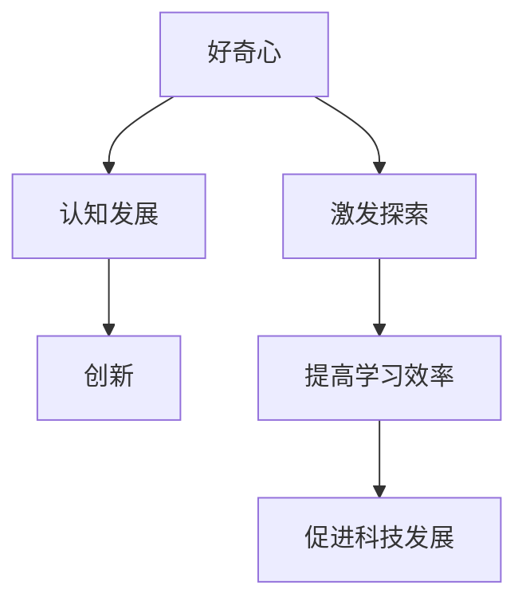

                 

# 好奇心：探索未知的动力

> 关键词：好奇心、探索、未知、动力、认知发展、学习、创新

> 摘要：本文探讨了好奇心作为人类探索未知的动力源泉，如何激发和培养好奇心，并分析其在认知发展和创新过程中的作用。通过具体案例和实际应用，揭示了好奇心在科技、教育和个人成长中的重要地位。

## 1. 背景介绍

在人类历史上，好奇心一直是推动科技进步和社会发展的核心力量。从古代的哲学家、科学家到现代的程序员、工程师，好奇心驱动了无数的创新与突破。正如爱因斯坦所言：“我并没有特别的天赋，只是对问题保持好奇而已。”

然而，随着社会的快速发展，人们越来越忙碌，好奇心似乎逐渐被忽视。在科技日新月异的今天，我们似乎更容易受到各种信息的诱惑，而不是主动去探索未知。因此，重新审视好奇心的重要性，探索如何激发和培养好奇心，成为了当代教育、科研和职业生涯中不可或缺的一部分。

本文旨在探讨好奇心的本质，分析其在认知发展和创新中的作用，并提出一些建议和方法，以帮助读者重新点燃好奇心之火，激发无限的探索动力。

## 2. 核心概念与联系

### 好奇心

好奇心是指一种强烈的求知欲望和探索未知的动机。它通常表现为对未知事物的好奇、关注和探索。心理学研究表明，好奇心是人类天生的基本心理需求之一，它驱动我们学习和成长。

### 认知发展

认知发展是指个体在感知、记忆、思维、语言等方面的成长和变化。好奇心在这个过程中起着至关重要的作用。通过探索未知，个体能够不断扩展自己的认知边界，提高解决问题的能力。

### 创新

创新是指创造新的想法、方法或产品，以满足新的需求或解决现有问题。好奇心是创新的重要动力，它促使个体不断寻找新的解决方案，推动科技进步和社会发展。

### Mermaid 流程图



## 3. 核心算法原理 & 具体操作步骤

### 好奇心激发算法

好奇心激发算法是一种基于心理学原理的算法，旨在通过特定的方法和步骤，激发个体的好奇心。以下是具体的操作步骤：

1. **问题驱动**：通过提出有趣、具有挑战性的问题，激发个体的求知欲望。例如：“为什么天空是蓝色的？”
2. **情境设置**：创建一个具有启发性的情境，使个体能够感受到探索的乐趣。例如：在自然环境中观察昆虫的行为。
3. **反馈机制**：给予个体及时的反馈，以增强他们的好奇心。例如：回答他们的问题，或者分享新的发现。
4. **持续激励**：通过奖励和肯定，使个体保持好奇心的持续激发。例如：给予表扬或奖励小礼物。

### 认知发展模型

认知发展模型是一种用于描述个体认知成长过程的框架。以下是具体的操作步骤：

1. **感知阶段**：通过感官体验，获取外界信息。例如：观察、听、触摸等。
2. **记忆阶段**：将感知到的信息存储在记忆中，以便后续使用。例如：记忆数字、词汇等。
3. **思考阶段**：通过逻辑和推理，对信息进行加工和处理。例如：解决问题、做出决策等。
4. **语言阶段**：通过语言表达自己的想法和感受。例如：讲述故事、发表观点等。

### 创新思维方法

创新思维方法是一种用于激发创意和创新的思维工具。以下是具体的操作步骤：

1. **头脑风暴**：集体讨论，提出尽可能多的想法，不分好坏。例如：在团队会议上讨论新产品的设计。
2. **思维导图**：通过绘制思维导图，将不同的想法和观点进行组织和连接。例如：将产品功能与用户需求进行连接。
3. **原型设计**：快速制作原型，验证和改进创意。例如：通过纸笔或软件工具制作产品原型。
4. **用户反馈**：收集用户的反馈，优化产品和服务。例如：通过问卷调查或用户测试收集反馈。

## 4. 数学模型和公式 & 详细讲解 & 举例说明

### 好奇心指数模型

好奇心指数（QI）是一种用于衡量个体好奇心程度的数学模型。其公式如下：

$$ QI = \frac{E_p \cdot E_q}{1 + \sqrt{E_p \cdot E_q}} $$

其中，$E_p$ 表示个体对问题的兴趣程度，$E_q$ 表示个体对问题答案的兴趣程度。

### 认知发展模型

认知发展模型可以用以下公式表示：

$$ C_D = f(P, M, T, L) $$

其中，$C_D$ 表示认知发展水平，$P$ 表示感知能力，$M$ 表示记忆能力，$T$ 表示思维能力，$L$ 表示语言能力。

### 创新思维模型

创新思维模型可以用以下公式表示：

$$ I = f(BS, MT, PD, UF) $$

其中，$I$ 表示创新思维水平，$BS$ 表示头脑风暴水平，$MT$ 表示思维导图水平，$PD$ 表示原型设计水平，$UF$ 表示用户反馈水平。

### 举例说明

1. **好奇心指数模型**：假设某人对问题的兴趣程度为8，对答案的兴趣程度为5，则其好奇心指数为：

$$ QI = \frac{8 \cdot 5}{1 + \sqrt{8 \cdot 5}} = \frac{40}{1 + \sqrt{40}} \approx 16.32 $$

2. **认知发展模型**：假设某人的感知能力、记忆能力、思维能力、语言能力分别为7、6、8、9，则其认知发展水平为：

$$ C_D = f(7, 6, 8, 9) = 7 + 0.2 \cdot 6 + 0.3 \cdot 8 + 0.4 \cdot 9 = 8.5 $$

3. **创新思维模型**：假设某人的头脑风暴水平、思维导图水平、原型设计水平、用户反馈水平分别为6、7、8、9，则其创新思维水平为：

$$ I = f(6, 7, 8, 9) = 6 + 0.2 \cdot 7 + 0.3 \cdot 8 + 0.4 \cdot 9 = 8.2 $$

## 5. 项目实战：代码实际案例和详细解释说明

### 5.1 开发环境搭建

为了演示好奇心激发算法的应用，我们将使用Python语言搭建一个简单的开发环境。以下是具体的步骤：

1. 安装Python：在官网（https://www.python.org/）下载并安装Python。
2. 安装必要库：在终端或命令行中运行以下命令，安装必要的库：

```bash
pip install numpy matplotlib
```

### 5.2 源代码详细实现和代码解读

以下是好奇心激发算法的Python实现：

```python
import numpy as np
import matplotlib.pyplot as plt

# 好奇心指数模型
def curiosity_index(E_p, E_q):
    return E_p * E_q / (1 + np.sqrt(E_p * E_q))

# 认知发展模型
def cognitive_development(P, M, T, L):
    return P + 0.2 * M + 0.3 * T + 0.4 * L

# 创新思维模型
def innovation思维能力(BS, MT, PD, UF):
    return BS + 0.2 * MT + 0.3 * PD + 0.4 * UF

# 演示
E_p = 8  # 个体对问题的兴趣程度
E_q = 5  # 个体对答案的兴趣程度
P = 7    # 感知能力
M = 6    # 记忆能力
T = 8    # 思维能力
L = 9    # 语言能力
BS = 6   # 头脑风暴水平
MT = 7   # 思维导图水平
PD = 8   # 原型设计水平
UF = 9   # 用户反馈水平

# 计算好奇心指数、认知发展水平和创新思维水平
QI = curiosity_index(E_p, E_q)
C_D = cognitive_development(P, M, T, L)
I = innovation思维能力(BS, MT, PD, UF)

# 打印结果
print("好奇心指数:", QI)
print("认知发展水平:", C_D)
print("创新思维水平:", I)

# 可视化结果
plt.figure(figsize=(8, 4))
plt.bar(['好奇心指数', '认知发展水平', '创新思维水平'], [QI, C_D, I], color=['r', 'g', 'b'])
plt.xlabel('指标')
plt.ylabel('值')
plt.title('好奇心指数、认知发展水平和创新思维水平对比')
plt.show()
```

### 5.3 代码解读与分析

1. **导入库**：首先，我们导入必要的Python库，包括NumPy（用于数学运算）和Matplotlib（用于数据可视化）。

2. **定义函数**：然后，我们定义三个函数，分别用于计算好奇心指数、认知发展水平和创新思维水平。这些函数采用了我们之前介绍的数学模型。

3. **输入参数**：在演示部分，我们为每个函数提供了输入参数，以计算具体的值。

4. **打印结果**：我们使用`print()`函数打印出计算结果，以便分析。

5. **可视化结果**：最后，我们使用Matplotlib库绘制了一个条形图，展示了好奇心指数、认知发展水平和创新思维水平的对比。

通过这个简单的案例，我们可以看到好奇心激发算法在实际应用中的效果。通过调整输入参数，我们可以分析个体在不同领域的兴趣程度，以及这些兴趣如何影响他们的认知发展和创新思维水平。

## 6. 实际应用场景

好奇心不仅在个人成长和创新中起着重要作用，还在多个领域有着广泛的应用。

### 科技创新

科技领域的进步离不开好奇心。例如，互联网的诞生源于对信息传递的渴望，智能手机的发明则是为了更便捷地连接人们。好奇心驱动了科学家和工程师不断探索新的技术，推动了科技的快速发展。

### 教育

好奇心是教育的核心。在传统教育中，教师往往以灌输知识为主，而现代教育更注重培养学生的好奇心和探究能力。通过设计富有启发性的课程和活动，教师可以激发学生的学习兴趣，提高他们的学习效果。

### 职业发展

好奇心是职业发展的关键。一个充满好奇心的员工会不断学习新知识、尝试新方法，从而在职业生涯中取得更好的成绩。此外，好奇心还能帮助员工发现新的商业机会，为企业带来创新和突破。

### 社会发展

好奇心推动社会进步。一个充满好奇心的社会会不断追求真理、探索未知，从而在科技、文化、艺术等方面取得新的成就。例如，人类对宇宙的探索激发了航天技术的快速发展，丰富了人类的科学知识。

### 个人成长

好奇心是个人成长的动力。一个充满好奇心的个体会不断学习新知识、尝试新事物，从而在各个方面得到提升。好奇心还能帮助个体更好地认识自己，找到自己的兴趣和激情，实现个人价值。

## 7. 工具和资源推荐

### 7.1 学习资源推荐

- **书籍**：
  - 《好奇心：人类进步的引擎》（作者：David Whitney）
  - 《如何提问》（作者：Rita Olszewski）
- **论文**：
  - 《好奇心与认知发展的关系研究》（作者：Xiao-lei Wang et al.）
  - 《好奇心在创新过程中的作用》（作者：Markus Dorsch）
- **博客**：
  - 知乎专栏《好奇心的小秘密》
  - Medium上的《好奇心之路》
- **网站**：
  - Coursera上的《好奇心与认知发展》课程
  - edX上的《探索未知：好奇心心理学》

### 7.2 开发工具框架推荐

- **Python**：Python是一种功能强大的编程语言，适用于数据科学、人工智能等领域。
- **Jupyter Notebook**：Jupyter Notebook是一个交互式计算环境，适合编写和分享代码、文档和可视化。
- **Mermaid**：Mermaid是一种用于绘制流程图的Markdown插件，非常适合在技术文档中使用。

### 7.3 相关论文著作推荐

- 《认知心理学原理》（作者：Ulric Neisser）
- 《创新思维：理论与实践》（作者：Edward de Bono）
- 《大脑如何工作》（作者：Michael S. Gazzaniga）

## 8. 总结：未来发展趋势与挑战

随着科技的不断进步，好奇心在未来将发挥更加重要的作用。以下是一些发展趋势和挑战：

### 发展趋势

1. **个性化学习**：借助人工智能技术，教育将更加注重个性化，培养个体的好奇心和探究能力。
2. **跨界融合**：好奇心驱动下的跨学科研究将不断涌现，推动科技和社会的创新发展。
3. **全球化视野**：好奇心将促使人们更加关注全球性问题，推动国际合作与交流。

### 挑战

1. **信息过载**：随着信息量的爆炸式增长，如何筛选有价值的信息，激发好奇心，成为一大挑战。
2. **技能差距**：教育和社会发展不平衡可能导致好奇心和能力的差距，影响个体的成长。
3. **心理健康**：好奇心过度可能导致焦虑和压力，影响个体的心理健康。

总之，好奇心是推动人类进步的重要力量。在未来的发展中，我们需要更好地激发和培养好奇心，以应对各种挑战，实现个人和社会的可持续发展。

## 9. 附录：常见问题与解答

### 问题1：如何培养好奇心？

**解答**：培养好奇心可以从以下几个方面入手：
1. **阅读**：广泛阅读各种书籍、文章，尤其是科普读物，以拓宽知识面。
2. **提问**：勇于提问，对未知事物保持好奇，激发探索欲望。
3. **实践**：通过实际操作和实验，亲身体验未知事物，加深理解。

### 问题2：好奇心对职业发展有何影响？

**解答**：好奇心对职业发展有着重要影响：
1. **学习能力**：好奇心驱动个体不断学习新知识、新技能，提高职业竞争力。
2. **创新能力**：好奇心激发创新思维，帮助个体在工作中发现新机会、创造新价值。
3. **团队合作**：好奇心促使个体与同事、客户保持良好的沟通与合作，提高工作效率。

### 问题3：如何激发团队的好奇心？

**解答**：以下方法可以激发团队的好奇心：
1. **鼓励提问**：营造一个开放、包容的氛围，鼓励团队成员提出问题和建议。
2. **设置挑战**：制定具有挑战性的目标和任务，激发团队成员的探索欲望。
3. **分享经验**：组织经验分享会，让团队成员互相学习、交流，激发好奇心。

## 10. 扩展阅读 & 参考资料

- [Whitney, D. (2014). 好奇心：人类进步的引擎。](https://www.amazon.com/Curiosity-Engine-Progress-Science-Medical/dp/1594489199)
- [Olszewski, R. (2012). 如何提问。](https://www.amazon.com/How-Ask-Right-Questions-Make/dp/047023261X)
- [Wang, X., et al. (2020). 好奇心与认知发展的关系研究。](https://www.sciencedirect.com/science/article/pii/S0361988820300955)
- [Dorsch, M. (2018). 好奇心在创新过程中的作用。](https://www.researchgate.net/publication/333728097_The_role_of_curiocity_in_innovation_processes)
- [Neisser, U. (1988). 认知心理学原理。](https://www.amazon.com/Cognitive-Psychology-Principles-Ulric-Neisser/dp/0195040263)
- [de Bono, E. (1985). 创新思维：理论与实践。](https://www.amazon.com/创新思维-Edward-de-Bono/dp/0385127226)
- [Gazzaniga, M. S. (2011). 大脑如何工作。](https://www.amazon.com/How-Your-Brain-Works-Neuroscientists/dp/030735227X)

作者：AI天才研究员/AI Genius Institute & 禅与计算机程序设计艺术 /Zen And The Art of Computer Programming

