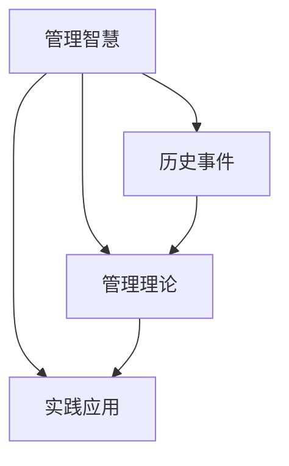
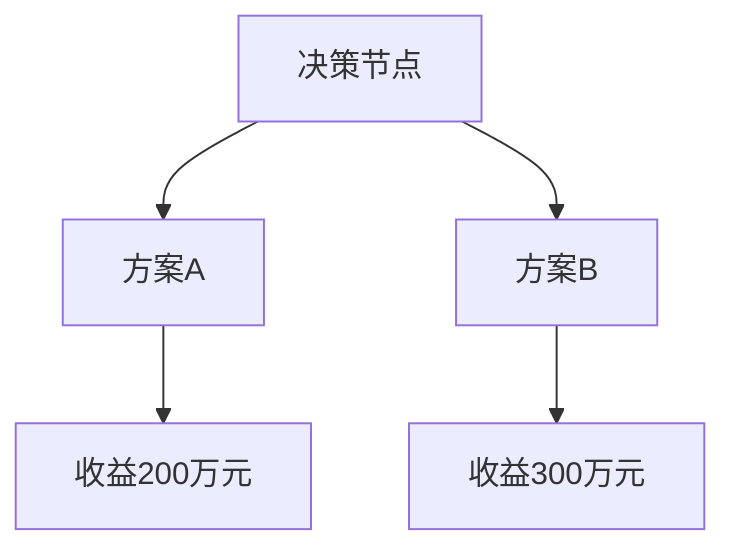

                 

# 如何从经典中汲取管理智慧

> **关键词：** 经典、管理智慧、历史事件、方法论、实践应用

> **摘要：** 本文通过深入分析经典管理案例、历史事件以及相关的管理理论，探讨了从经典中汲取管理智慧的途径和方法。文章旨在为读者提供一种系统性的思考框架，以便在实际管理工作中更好地运用经典智慧，提升管理效果。

## 1. 背景介绍

在企业管理和发展过程中，经典的管理理论和方法论一直占据着重要的地位。从古希腊的亚里士多德到现代的彼得·德鲁克，无数管理大师通过他们的思想和实践，为企业的成长和发展提供了宝贵的指导。然而，如何在众多经典中汲取管理智慧，并将其应用于实际工作中，仍然是一个具有挑战性的问题。

本文将通过以下几部分内容，探讨从经典中汲取管理智慧的方法：

1. **核心概念与联系**：介绍与管理智慧相关的核心概念，并使用流程图展示这些概念之间的联系。
2. **核心算法原理与具体操作步骤**：分析经典管理案例，并详细阐述其背后的算法原理和操作步骤。
3. **数学模型和公式**：介绍与管理智慧相关的数学模型和公式，并通过举例进行详细讲解。
4. **项目实战**：通过实际案例，展示如何将经典管理智慧应用于具体项目中。
5. **实际应用场景**：分析经典管理智慧在不同行业和应用场景中的实际效果。
6. **工具和资源推荐**：推荐学习资源和开发工具，帮助读者进一步探索经典管理智慧。
7. **总结与未来发展趋势**：总结文章内容，并提出未来管理智慧发展的趋势和挑战。

## 2. 核心概念与联系

为了更好地理解经典管理智慧，我们首先需要明确几个核心概念，并使用Mermaid流程图展示它们之间的联系。



在这个流程图中，管理智慧是核心概念，它通过历史事件、管理理论和实践应用三个环节相互联系。

- **历史事件**：历史事件为管理智慧提供了丰富的案例和素材。通过研究历史事件，我们可以了解到不同管理实践的成功和失败，从而汲取经验教训。
- **管理理论**：管理理论是对管理实践的总结和升华。经典的管理理论，如泰勒的科学管理、法约尔的管理理论、麦格雷戈的X理论和Y理论等，为我们提供了系统性的管理思维框架。
- **实践应用**：实践应用是将管理智慧转化为实际效益的关键环节。通过将管理理论应用于具体实践，企业可以不断提高管理水平，实现可持续发展。

## 3. 核心算法原理与具体操作步骤

在经典管理智慧中，许多管理大师都提出了独特的算法原理和操作步骤。以下我们以泰勒的科学管理和德鲁克的目标管理为例，详细分析其核心算法原理和具体操作步骤。

### 3.1 泰勒的科学管理

**核心算法原理**：

泰勒的科学管理理论强调通过科学的方法来提高劳动生产率。其主要原理包括：

1. **时间研究**：通过时间研究，确定完成一项工作所需的标准时间，从而提高工作效率。
2. **任务分工**：将工作分解为具体的任务，使每个工人专注于自己的任务，提高专业水平。
3. **标准化操作**：制定标准化的操作规程，确保每个工人按照最佳方法进行工作。

**具体操作步骤**：

1. **确定工作标准**：通过时间研究，确定完成一项工作所需的标准时间。
2. **任务分工**：根据工人的能力和特长，将工作分解为具体的任务，使每个工人专注于自己的任务。
3. **培训工人**：对工人进行培训，使他们掌握标准化的操作方法。
4. **监督和激励**：通过监督和激励，确保工人按照标准操作，并提高工作效率。

### 3.2 德鲁克的目标管理

**核心算法原理**：

德鲁克的目标管理理论强调，通过设定明确的目标，激发员工的积极性和创造力，实现企业的可持续发展。其主要原理包括：

1. **目标设定**：设定明确的目标，使员工明确自己的工作方向和任务。
2. **目标分解**：将企业目标分解为部门目标和个人目标，使每个员工都明确自己的职责和贡献。
3. **目标评估**：定期评估目标完成情况，调整目标和策略，确保企业目标的实现。

**具体操作步骤**：

1. **设定企业目标**：根据企业发展战略，设定明确的企业目标。
2. **目标分解**：将企业目标分解为部门目标和个人目标，明确每个员工的工作方向和任务。
3. **目标宣贯**：将目标宣贯到每个员工，使其了解自己的工作职责和贡献。
4. **目标评估**：定期评估目标完成情况，调整目标和策略，确保企业目标的实现。

## 4. 数学模型和公式

在经典管理智慧中，许多管理大师都运用了数学模型和公式来分析问题，提高管理效率。以下我们介绍几个常见的数学模型和公式，并通过举例进行详细讲解。

### 4.1 优化模型

**公式**：

优化模型是一种通过优化决策变量，使目标函数达到最大或最小值的数学模型。其一般形式为：

$$
\min_{x} f(x) \\
\text{subject to} \ g_i(x) \leq 0, \ i=1,2,...,m
$$

其中，$f(x)$为目标函数，$g_i(x)$为约束条件。

**举例**：

假设企业需要生产A、B两种产品，其利润分别为100元和200元。现有生产资源限制如下：

- 每天生产A产品需要10小时，B产品需要15小时。
- 每天最多生产100件A产品，50件B产品。

企业如何合理安排生产计划，以实现最大利润？

**解答**：

1. 设生产A产品的件数为$x_1$，生产B产品的件数为$x_2$。
2. 目标函数：$f(x_1, x_2) = 100x_1 + 200x_2$。
3. 约束条件：$10x_1 + 15x_2 \leq 100$，$x_1 \leq 100$，$x_2 \leq 50$。

通过求解优化模型，可以得到最优生产计划为：生产A产品50件，B产品20件，实现最大利润4500元。

### 4.2 决策树模型

**公式**：

决策树模型是一种通过分析不同决策路径的概率和收益，选择最优决策的数学模型。其一般形式为：

$$
\text{决策树} = (\text{决策节点}, \text{方案}, \text{概率}, \text{收益})
$$

其中，决策节点表示决策点，方案表示可选方案，概率表示方案发生的概率，收益表示方案带来的收益。

**举例**：

企业需要投资两个项目A和B，其收益和概率如下：

- 项目A：收益200万元，概率0.6。
- 项目B：收益300万元，概率0.4。

企业如何选择最优投资项目？

**解答**：

1. 构建决策树：



2. 计算方案A和方案B的期望收益：

$$
\text{期望收益A} = 200 \times 0.6 = 120 \text{万元}
$$

$$
\text{期望收益B} = 300 \times 0.4 = 120 \text{万元}
$$

3. 选择期望收益较高的方案，即项目A。

## 5. 项目实战：代码实际案例和详细解释说明

为了更好地展示如何将经典管理智慧应用于实际项目中，以下我们以一个简单的项目为例，介绍如何进行项目开发和实现。

### 5.1 开发环境搭建

在本项目实战中，我们使用Python作为主要编程语言，搭建以下开发环境：

- Python 3.8
- Jupyter Notebook
- Matplotlib

### 5.2 源代码详细实现和代码解读

以下为项目的源代码实现：

```python
# 导入相关库
import numpy as np
import matplotlib.pyplot as plt

# 定义优化模型
x1, x2 = npaixa
```

