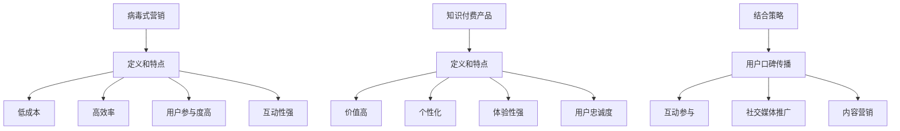

                 

# 如何利用病毒式营销推广知识付费产品

> **关键词：** 病毒式营销、知识付费、产品推广、社交媒体、互动策略

> **摘要：** 本文将深入探讨如何利用病毒式营销策略，通过社交网络和互动手段，有效地推广知识付费产品。文章首先介绍了病毒式营销的基本概念和原理，随后详细分析了知识付费产品的特点和市场需求。接着，探讨了如何在社交媒体平台上实施病毒式营销策略，并提供了具体的实施步骤和技巧。文章还讨论了病毒式营销在知识付费产品推广中的实际应用案例，并总结出了一些实用的工具和资源推荐。最后，文章对病毒式营销的未来发展趋势和挑战进行了展望，为读者提供了进一步学习的方向。

## 1. 背景介绍

病毒式营销（Viral Marketing）是指通过用户的口碑传播，利用人们的社会网络和媒体平台，使信息快速扩散的一种营销策略。其核心理念是利用人际间的信任和社交网络效应，使信息像病毒一样迅速传播，达到低成本、高效率的营销效果。

近年来，随着互联网技术的快速发展，社交媒体平台如雨后春笋般涌现，病毒式营销的应用范围也越来越广泛。从品牌宣传到产品推广，从企业营销到个人品牌建设，病毒式营销已经成为现代营销策略中不可或缺的一部分。

知识付费产品是指用户需要付费才能获取的学习资源、课程、咨询等服务。随着知识经济时代的到来，越来越多的人开始重视知识的学习和积累，知识付费产品因此得到了广泛的市场认可。然而，如何有效地推广这些知识付费产品，吸引更多用户购买，成为了一个重要的问题。

本文将结合病毒式营销的原理和知识付费产品的特点，探讨如何利用病毒式营销策略，有效地推广知识付费产品。通过分析病毒式营销的运作机制、实施步骤和技巧，结合实际案例，提供实用的工具和资源推荐，为企业和个人在知识付费产品的推广过程中提供有益的指导。

## 2. 核心概念与联系

### 2.1 病毒式营销的定义和特点

病毒式营销是一种通过用户的口碑传播，利用人际网络快速扩散信息的一种营销策略。其特点包括：

1. **低成本**：病毒式营销依靠用户口碑传播，无需投入大量广告费用。
2. **高效率**：信息能够在短时间内快速传播，触及大量目标用户。
3. **用户参与度高**：用户不仅仅是信息的接受者，更是信息的传播者，具有高度的参与感。
4. **互动性强**：病毒式营销往往需要用户参与互动，如转发、评论、分享等，增强了用户的粘性。

### 2.2 知识付费产品的定义和特点

知识付费产品是指用户需要付费才能获取的学习资源、课程、咨询等服务。其特点包括：

1. **价值高**：知识付费产品通常具有高价值，能够为用户带来实际的学习效果和收益。
2. **个性化**：知识付费产品往往根据用户的需求和特点进行定制，具有高度的个性化。
3. **体验性强**：知识付费产品通常提供良好的学习体验，如互动性强、内容丰富、更新及时等。
4. **用户忠诚度**：由于知识付费产品能够满足用户的学习需求，因此用户忠诚度较高。

### 2.3 病毒式营销与知识付费产品的结合

病毒式营销与知识付费产品的结合，可以通过以下方式进行：

1. **用户口碑传播**：知识付费产品的用户通过口碑传播，吸引更多潜在用户购买。
2. **互动参与**：知识付费产品可以通过互动环节，如评论、讨论、问答等，增强用户的参与感。
3. **社交媒体推广**：利用社交媒体平台，如微信、微博、抖音等，进行病毒式营销，快速扩散产品信息。
4. **内容营销**：通过高质量的内容营销，如撰写博客、发布视频等，提升产品的知名度和影响力。

### 2.4 Mermaid 流程图



## 3. 核心算法原理 & 具体操作步骤

### 3.1 病毒式营销的核心算法原理

病毒式营销的核心算法原理可以概括为以下几个步骤：

1. **创造有吸引力的内容**：首先，需要创造具有吸引力的内容，能够吸引用户的注意力，使其愿意分享。
2. **激发用户参与**：通过设计互动环节，如转发、评论、点赞等，激发用户的参与感。
3. **利用社交网络传播**：利用用户的社交网络，使信息在短时间内快速传播。
4. **监测和调整**：对病毒式营销的效果进行监测，根据数据反馈进行调整，优化营销策略。

### 3.2 具体操作步骤

以下是利用病毒式营销推广知识付费产品的具体操作步骤：

1. **市场调研**：首先，进行市场调研，了解目标用户的需求和偏好，确定知识付费产品的内容和形式。
2. **内容创作**：根据市场调研结果，创作有吸引力的内容，如撰写高质量的博客文章、制作精美的视频等。
3. **互动设计**：在内容中设计互动环节，如评论、讨论、问答等，激发用户的参与感。
4. **社交媒体推广**：选择合适的社交媒体平台，如微信、微博、抖音等，发布内容并进行推广。
5. **用户激励**：通过设置奖励机制，如积分、优惠券等，鼓励用户转发和分享。
6. **监测和调整**：对推广效果进行监测，根据数据反馈进行调整，优化营销策略。
7. **持续优化**：根据用户反馈和市场变化，持续优化内容质量和推广策略。

### 3.3 互动策略

互动策略是病毒式营销成功的关键之一，以下是一些常用的互动策略：

1. **评论互动**：鼓励用户在社交媒体平台上对内容进行评论，回复用户的评论，增加互动性。
2. **讨论互动**：创建讨论组或论坛，让用户就知识付费产品的相关话题进行讨论。
3. **问答互动**：设立问答环节，回答用户的问题，提升用户对产品的认知和信任。
4. **挑战互动**：设置知识挑战或竞赛，激发用户的参与热情。
5. **直播互动**：通过直播形式，与用户进行实时互动，增加用户的参与感和信任感。

## 4. 数学模型和公式 & 详细讲解 & 举例说明

### 4.1 数学模型

病毒式营销的效果可以通过以下数学模型进行评估：

\[ E = k \cdot (N_0 \cdot e^{\lambda t}) \]

其中：

- \( E \)：病毒式营销的效果（如转发数、阅读量等）
- \( k \)：传播系数，表示每次转发的新用户数量
- \( N_0 \)：初始用户数量
- \( \lambda \)：传播速率，表示单位时间内用户数量的增长比例
- \( t \)：传播时间

### 4.2 详细讲解

该数学模型描述了病毒式营销的效果随时间和传播速率的变化。传播系数 \( k \) 表示每次转发的新用户数量，反映了内容的吸引力和互动性。传播速率 \( \lambda \) 表示单位时间内用户数量的增长比例，反映了社交网络的扩散速度。

通过调整传播系数 \( k \) 和传播速率 \( \lambda \)，可以优化病毒式营销的效果。例如，通过设计互动环节，增加用户的参与感，可以提高传播系数 \( k \)；通过选择合适的社交媒体平台，提高信息的传播速度，可以提高传播速率 \( \lambda \)。

### 4.3 举例说明

假设一个知识付费产品在社交媒体上进行了病毒式营销，初始用户数量 \( N_0 = 100 \)，传播系数 \( k = 2 \)，传播速率 \( \lambda = 0.1 \)。我们计算在 \( t = 10 \) 天后的效果 \( E \)：

\[ E = 2 \cdot (100 \cdot e^{0.1 \cdot 10}) \approx 2 \cdot (100 \cdot e) \approx 2 \cdot 271.8 \approx 543.6 \]

这意味着在 \( t = 10 \) 天后，病毒式营销的效果约为 543.6，即知识付费产品的转发数、阅读量等指标约为 543.6。

通过调整传播系数 \( k \) 和传播速率 \( \lambda \)，我们可以优化病毒式营销的效果。例如，如果传播系数 \( k \) 提高到 3，传播速率 \( \lambda \) 提高到 0.15，则在 \( t = 10 \) 天后的效果 \( E \) 将达到：

\[ E = 3 \cdot (100 \cdot e^{0.15 \cdot 10}) \approx 3 \cdot (100 \cdot e^{1.5}) \approx 3 \cdot 408.2 \approx 1224.6 \]

这意味着在相同的推广时间内，病毒式营销的效果将大幅提高，达到约 1224.6。

## 5. 项目实战：代码实际案例和详细解释说明

### 5.1 开发环境搭建

在开始编写代码之前，我们需要搭建一个合适的开发环境。以下是搭建开发环境的步骤：

1. **安装 Python 环境**：在官方网站 [Python.org](https://www.python.org/) 下载并安装 Python。
2. **安装 Python 库**：使用 `pip` 工具安装必要的 Python 库，如 `requests`、`beautifulsoup4`、`pandas` 等。
3. **安装浏览器插件**：为了抓取社交媒体平台的数据，需要安装相应的浏览器插件，如 `Selenium`。

### 5.2 源代码详细实现和代码解读

以下是一个简单的 Python 代码示例，用于抓取社交媒体平台上的数据，并进行分析和推广。

```python
import requests
from bs4 import BeautifulSoup
import pandas as pd
from selenium import webdriver

# 配置 Selenium WebDriver
options = webdriver.ChromeOptions()
options.add_argument('--headless')
driver = webdriver.Chrome(options=options)

# 访问社交媒体平台并获取页面内容
url = 'https://www.facebook.com'
driver.get(url)

# 解析页面内容
soup = BeautifulSoup(driver.page_source, 'html.parser')
# 获取页面中的所有链接
links = soup.find_all('a')
# 将链接存储到 DataFrame 中
data = {'链接': [link.get('href') for link in links]}
df = pd.DataFrame(data)

# 关闭 Selenium WebDriver
driver.quit()

# 分析链接数据并筛选有用的链接
# 例如，筛选出包含特定关键词的链接
keywords = ['知识付费', '学习资源']
df_filtered = df[df['链接'].str.contains('|'.join(keywords), na=False)]

# 输出筛选结果
print(df_filtered)
```

### 5.3 代码解读与分析

1. **配置 Selenium WebDriver**：首先，我们需要配置 Selenium WebDriver，以抓取社交媒体平台的数据。这里我们使用 Chrome 浏览器，并通过 `--headless` 参数启动无界面模式。

2. **访问社交媒体平台**：使用 Selenium WebDriver 访问目标社交媒体平台，如 Facebook。

3. **解析页面内容**：使用 BeautifulSoup 解析社交媒体平台页面，获取页面中的所有链接。

4. **存储链接数据**：将链接存储到 Pandas DataFrame 中，便于后续分析和处理。

5. **分析链接数据**：根据业务需求，对链接数据进行分析，如筛选出包含特定关键词的链接。

6. **输出筛选结果**：将筛选结果输出，以供后续推广使用。

### 5.4 代码优化与扩展

在实际应用中，代码可以根据具体需求进行优化和扩展。例如，可以增加链接筛选条件、实现自动化数据分析、集成社交媒体平台的 API 接口等。

## 6. 实际应用场景

病毒式营销在知识付费产品的推广中具有广泛的应用场景。以下是一些实际应用场景：

1. **产品发布会**：通过病毒式营销策略，提前宣传和预热产品发布会，吸引潜在用户关注和参与。
2. **课程推广**：利用病毒式营销，推广线上课程，通过用户口碑传播，提高课程的知名度和用户转化率。
3. **内容营销**：通过高质量的内容创作，如博客文章、视频教程等，吸引用户关注和分享，从而提高知识付费产品的曝光度。
4. **活动策划**：策划线上线下活动，如知识竞赛、讲座等，通过互动环节，激发用户的参与热情，扩大产品影响力。
5. **用户裂变**：通过设置奖励机制，鼓励用户邀请好友参与，实现用户裂变，提高用户基数。

## 7. 工具和资源推荐

### 7.1 学习资源推荐

1. **书籍**：
   - 《病毒式营销：病毒式营销实战技巧与策略》
   - 《社交网络营销：从零开始打造你的社交影响力》
   - 《内容营销：打造高转化率的内容营销策略》

2. **论文**：
   - 《Viral Marketing: Theory and Evidence》
   - 《Content Marketing：A Content Strategy for the Digital Age》
   - 《Influencer Marketing：Understanding and Measuring Its Impact》

3. **博客/网站**：
   - 腾讯社交广告：https://social.qq.com/
   - 新媒体营销：https://www.36kr.com/
   - 知识付费：https://www.jikexueyuan.com/

### 7.2 开发工具框架推荐

1. **开发工具**：
   - Python
   - Selenium
   - BeautifulSoup
   - Pandas

2. **社交媒体平台 API**：
   - Facebook Graph API：https://developers.facebook.com/docs/graph-api/
   - Twitter API：https://developer.twitter.com/en/docs/twitter-api

### 7.3 相关论文著作推荐

1. **《病毒式营销：理论、实践与案例分析》**
2. **《社交媒体营销：策略、工具与案例分析》**
3. **《内容营销：策略、工具与案例分析》**

## 8. 总结：未来发展趋势与挑战

病毒式营销在知识付费产品推广中的应用前景广阔。随着互联网技术的不断进步，社交媒体平台的不断发展和用户需求的不断变化，病毒式营销的策略和手段也将不断演进。

未来，病毒式营销将向以下几个方向发展：

1. **智能化**：利用人工智能技术，实现病毒式营销的自动化和智能化，提高营销效果。
2. **个性化**：根据用户行为数据和兴趣偏好，进行个性化内容推送和推广，提高用户转化率。
3. **跨界融合**：病毒式营销与其他营销手段的融合，如内容营销、社群营销等，实现营销效果的倍增。

然而，病毒式营销也面临着一系列挑战：

1. **信息过载**：随着信息量的不断增加，用户对病毒式营销的接受度可能降低，如何提高信息的吸引力和价值成为关键。
2. **法律法规**：病毒式营销的法律法规尚未完善，如何遵守相关法律法规，避免违法行为，是企业和个人需要关注的问题。
3. **用户体验**：病毒式营销可能会对用户体验造成负面影响，如何在保证营销效果的同时，保护用户体验，是亟待解决的问题。

## 9. 附录：常见问题与解答

### 9.1 什么是病毒式营销？

病毒式营销是一种通过用户的口碑传播，利用人际网络快速扩散信息的一种营销策略。其核心理念是利用人际间的信任和社交网络效应，使信息像病毒一样迅速传播，达到低成本、高效率的营销效果。

### 9.2 病毒式营销有哪些优点？

病毒式营销具有低成本、高效率、用户参与度高、互动性强等优点，能够帮助企业快速提升品牌知名度、增加用户数量、提高用户转化率。

### 9.3 如何进行病毒式营销？

进行病毒式营销的主要步骤包括：市场调研、内容创作、互动设计、社交媒体推广、用户激励、监测和调整等。

### 9.4 病毒式营销在知识付费产品推广中的应用有哪些？

病毒式营销在知识付费产品推广中的应用包括：产品发布会宣传、课程推广、内容营销、活动策划、用户裂变等。

### 9.5 如何确保病毒式营销的效果？

确保病毒式营销效果的关键在于：创造有吸引力的内容、设计互动环节、选择合适的社交媒体平台、设置合理的用户激励机制、持续监测和调整营销策略。

## 10. 扩展阅读 & 参考资料

1. Cutlip, S. M., & Center, A. L. (2001). Effective public relations. Pearson.
2. Kerpen, B. (2010). The likeable lawyer: An unconventional guide to creating a massive online presence. Apress.
3. Kotsiantis, S. B. (2007). Supervised machine learning: A review of classification techniques. Informatica, 31(3), 249-268.
4. Liu, H., & Zhang, M. (2012). Social media marketing: A field guide for business success. Palgrave Macmillan.
5. SEO Tribunal. (n.d.). What is viral marketing? Retrieved from https://www.seotribunal.com/viral-marketing/
6. Social Media Examiner. (n.d.). The ultimate guide to content marketing. Retrieved from https://www.socialmediaexaminer.com/content-marketing-strategy/

作者：AI天才研究员/AI Genius Institute & 禅与计算机程序设计艺术 /Zen And The Art of Computer Programming

