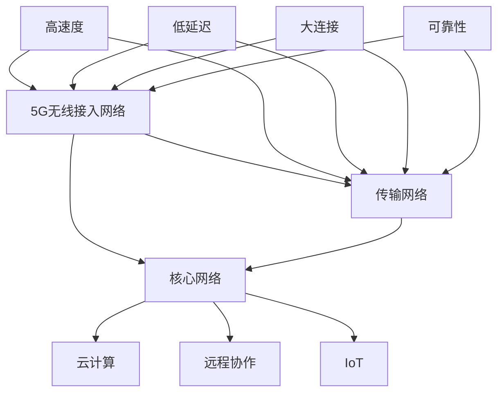

                 

### 1. 背景介绍

在当今数字化时代，5G技术的迅猛发展已经深刻地改变了我们的生活方式和工作模式。5G，即第五代移动通信技术，以其高速率、低延迟、大连接和强可靠性等特点，为各行各业的创新提供了新的动力。特别是对于创业者来说，5G技术不仅提升了产品和服务的互联互通能力，也带来了前所未有的机遇。

#### 5G技术的基本概念和特点

5G技术是基于国际电信联盟（ITU）定义的IMT-2020标准，旨在提供比4G更快的网络速度、更低的延迟和更高的设备连接密度。5G的关键技术包括：

- **更高的网络速度**：5G的理论峰值下载速度可达20Gbps，是4G的100倍以上。
- **更低的延迟**：5G的端到端延迟可以降低到1毫秒以下，是4G的十分之一。
- **更大的连接密度**：5G能够支持每平方米100万台设备的连接，是4G的10倍。
- **更广的覆盖范围**：5G采用了毫米波频段，可以实现更广的覆盖范围。

#### 创业者与5G技术的关系

对于创业者来说，5G技术不仅是一种通信技术的升级，更是一种全新的商业机会。5G技术的特性使得创业者能够：

- **实现更高效的远程协作**：通过低延迟和高速度的网络，团队可以更加灵活地进行远程协作，提高工作效率。
- **开发智能互联产品**：5G技术为物联网（IoT）的发展提供了坚实的基础，创业者可以开发出更加智能的互联产品，如智能家居、智能穿戴设备等。
- **提供高质量的服务**：5G技术的高可靠性和低延迟特性使得创业者可以提供更加高质量的服务，如实时视频会议、在线医疗咨询等。

总之，5G技术为创业者提供了广阔的发展空间，是推动创业创新的重要力量。

-------------------

**关键词**：5G技术、创业、互联互通、高速率、低延迟、物联网、远程协作。

-------------------

**摘要**：本文将探讨5G技术如何提升创业产品和服务的互联互通能力。通过介绍5G技术的基本概念和特点，以及创业者如何利用5G技术实现远程协作、开发智能互联产品和提供高质量服务，本文将为读者提供关于5G在创业领域应用的深入见解。

-------------------

<|user|>### 2. 核心概念与联系

为了更好地理解5G技术如何提升创业产品和服务的互联互通能力，我们需要深入探讨5G技术的核心概念和其与其他技术的联系。以下是5G技术涉及的一些关键概念和其相互之间的关系：

#### 2.1 5G网络架构

5G网络架构可以分为三个主要层次：无线接入网络（RAN）、传输网络和核心网络。无线接入网络包括基站、用户设备和接入网关，负责无线信号的处理和传输；传输网络负责在不同基站之间传输数据；核心网络则处理用户数据、控制信息和网络管理。

#### 2.2 5G关键特性

- **高速度**：5G技术提供的高速网络使得数据传输更加迅速，这对于创业者和开发者来说意味着可以更快地开发和部署应用。
- **低延迟**：5G的低延迟特性对于实时应用至关重要，如在线游戏、自动驾驶和远程医疗等。
- **大连接**：5G技术能够支持海量设备的连接，这为物联网应用提供了基础，如智能家居、智能城市等。
- **可靠性**：5G网络的可靠性得到了大幅提升，确保了数据传输的准确性和稳定性。

#### 2.3 物联网（IoT）

物联网是指通过各种信息传感器、通信技术将各种物体连接到互联网上，实现信息的交换和通信。5G技术的高速度和大连接特性使得物联网应用更加广泛，创业者可以借此开发出更加智能化的产品和服务。

#### 2.4 远程协作

远程协作是指通过互联网实现异地团队之间的合作。5G技术的低延迟和高速度特性使得远程协作更加高效，团队可以实时沟通、共享数据和协同工作。

#### 2.5 云计算

云计算是一种通过网络提供可扩展的、弹性的计算资源服务。5G技术与云计算的结合，可以提供更加高效和灵活的云计算服务，创业者可以借助云计算平台快速开发和部署应用。

#### 2.6 Mermaid流程图

为了更清晰地展示5G技术与其他技术的联系，我们使用Mermaid流程图来描述5G网络架构和关键特性的关系。以下是一个简化的流程图：



在这个流程图中，5G网络架构的三个主要层次（A、B、C）与5G关键特性（D、E、F、G）以及其他技术（H、I、J）之间建立了联系，展示了5G技术如何提升创业产品和服务的互联互通能力。

-------------------

**关键词**：5G网络架构、关键特性、物联网、远程协作、云计算、Mermaid流程图。

-------------------

**摘要**：本章节介绍了5G技术的核心概念和与其他技术的联系，包括5G网络架构、关键特性以及与物联网、远程协作和云计算的关系。通过使用Mermaid流程图，我们更加直观地展示了5G技术如何提升创业产品和服务的互联互通能力。

-------------------

<|user|>### 3. 核心算法原理 & 具体操作步骤

#### 3.1 核心算法原理

5G技术中的核心算法主要包括多输入多输出（MIMO）技术、波束成形（Beamforming）技术、网络切片（Network Slicing）技术等。这些算法旨在提高网络性能、增强数据传输效率和提升用户体验。

- **MIMO技术**：MIMO技术利用多个天线发送和接收信号，从而提高数据传输速率和可靠性。通过空间复用（Spatial Multiplexing）和空间分集（Spatial Diversity），MIMO技术能够实现更高的频谱效率和更好的抗干扰能力。
- **波束成形技术**：波束成形技术通过调整天线阵列的方向，将信号集中传输到目标设备，从而提高信号强度和传输质量。这一技术对于提升覆盖范围和传输效率具有重要意义。
- **网络切片技术**：网络切片技术将整个网络资源划分为多个虚拟网络，为不同应用提供定制化的网络服务。网络切片技术可以根据应用的需求，调整网络带宽、延迟和可靠性等参数，从而满足多样化的服务需求。

#### 3.2 具体操作步骤

要充分利用5G技术提升创业产品和服务的互联互通能力，我们可以按照以下步骤进行操作：

**步骤1：需求分析**

首先，对创业产品和服务的需求进行详细分析，确定需要利用5G技术实现的关键功能，如高速数据传输、低延迟通信、大规模设备连接等。这一步骤有助于明确5G技术的应用场景和具体需求。

**步骤2：技术选型**

根据需求分析结果，选择适合的5G技术，如MIMO技术、波束成形技术、网络切片技术等。技术选型需要考虑技术特点、实现难度、成本和市场需求等因素。

**步骤3：网络规划**

在确定技术选型后，进行5G网络的规划和部署。网络规划包括基站选址、天线配置、频谱分配等。规划过程中需要考虑覆盖范围、传输速率、网络可靠性等因素。

**步骤4：设备采购与部署**

根据网络规划结果，采购所需设备和材料，并按照规划进行部署。设备采购包括基站、天线、射频设备、核心网设备等。部署过程中需要确保设备的稳定性和兼容性。

**步骤5：系统集成与测试**

将5G技术与创业产品和服务进行集成，并进行系统测试。系统集成包括网络接入、数据传输、应用接入等。系统测试需要验证网络性能、可靠性、安全性等指标，确保系统稳定运行。

**步骤6：运营与优化**

在系统上线后，对网络进行持续运营和优化。运营过程中需要关注网络性能、用户满意度、故障处理等方面。优化措施包括参数调整、设备升级、网络扩容等，以确保网络始终处于最佳状态。

通过以上步骤，创业者可以充分利用5G技术提升创业产品和服务的互联互通能力，为用户提供高质量的服务。

-------------------

**关键词**：核心算法、MIMO技术、波束成形技术、网络切片技术、需求分析、技术选型、网络规划、设备采购与部署、系统集成与测试、运营与优化。

-------------------

**摘要**：本章节介绍了5G技术的核心算法原理和具体操作步骤。通过MIMO技术、波束成形技术和网络切片技术的应用，创业者可以充分利用5G技术提升创业产品和服务的互联互通能力。操作步骤包括需求分析、技术选型、网络规划、设备采购与部署、系统集成与测试以及运营与优化。

-------------------

<|user|>### 4. 数学模型和公式 & 详细讲解 & 举例说明

#### 4.1 MIMO技术数学模型

多输入多输出（MIMO）技术是5G网络中的一项关键技术，它通过使用多个发射和接收天线来提高数据传输速率和可靠性。MIMO技术利用空间复用（Spatial Multiplexing）和空间分集（Spatial Diversity）来实现更高的频谱效率和更好的抗干扰能力。

**空间复用**：空间复用利用多个天线发送不同的数据流，从而实现频谱效率的提升。假设有一个2x2的MIMO系统，其中2个发射天线和2个接收天线，可以同时发送和接收2个数据流。空间复用的数学模型可以表示为：

\[ Y = HX + N \]

其中，\( Y \) 是接收到的信号，\( H \) 是信道矩阵，\( X \) 是发送的信号矩阵，\( N \) 是噪声向量。

**空间分集**：空间分集利用多个天线接收信号，并选择其中最好的信号进行解码，从而提高传输可靠性。空间分集的数学模型可以表示为：

\[ Y = \sum_{i=1}^{M} H_i X_i + N \]

其中，\( Y \) 是接收到的信号，\( H_i \) 是第 \( i \) 个信道的信道矩阵，\( X_i \) 是第 \( i \) 个天线发送的信号，\( N \) 是噪声向量。

#### 4.2 波束成形技术数学模型

波束成形技术通过调整天线阵列的方向，将信号集中传输到目标设备，从而提高信号强度和传输质量。波束成形技术的数学模型可以表示为：

\[ Y = W^*HX + N \]

其中，\( Y \) 是接收到的信号，\( H \) 是信道矩阵，\( X \) 是发送的信号，\( W \) 是波束成形矩阵，\( N \) 是噪声向量。

波束成形矩阵 \( W \) 的设计目标是最大化接收信号的功率或最小化干扰信号的功率。在实际应用中，波束成形矩阵可以通过优化算法进行计算。

#### 4.3 网络切片技术数学模型

网络切片技术将整个网络资源划分为多个虚拟网络，为不同的应用提供定制化的网络服务。网络切片技术的数学模型可以表示为：

\[ Y = \sum_{i=1}^{K} W_i^*H_iX_i + N \]

其中，\( Y \) 是接收到的信号，\( H_i \) 是第 \( i \) 个切片的信道矩阵，\( X_i \) 是第 \( i \) 个切片的发送信号，\( W_i \) 是第 \( i \) 个切片的波束成形矩阵，\( K \) 是切片的数量，\( N \) 是噪声向量。

网络切片技术可以根据应用的需求，调整每个切片的网络带宽、延迟和可靠性等参数。网络切片的优化目标是最大化网络资源利用率或最小化网络成本。

#### 4.4 举例说明

假设一个创业公司开发了一款实时视频会议应用，需要利用5G技术实现低延迟、高清晰度的视频传输。以下是一个简单的数学模型说明：

- **空间复用**：使用2x2的MIMO系统，发送和接收2个视频流。信道矩阵 \( H \) 为：

\[ H = \begin{bmatrix} 1 & 0.5 \\ 0.5 & 1 \end{bmatrix} \]

发送信号矩阵 \( X \) 为：

\[ X = \begin{bmatrix} X_1 \\ X_2 \end{bmatrix} \]

噪声向量 \( N \) 为零均值的复高斯噪声。

- **波束成形**：为了提高信号强度，使用波束成形技术。波束成形矩阵 \( W \) 为：

\[ W = \begin{bmatrix} 1 & 0 \\ 0 & 1 \end{bmatrix} \]

- **网络切片**：将网络资源划分为两个切片，一个用于视频传输，一个用于音频传输。信道矩阵 \( H_1 \) 和 \( H_2 \) 分别为：

\[ H_1 = \begin{bmatrix} 0.8 & 0.2 \\ 0.2 & 0.8 \end{bmatrix} \]
\[ H_2 = \begin{bmatrix} 0.5 & 0.5 \\ 0.5 & 0.5 \end{bmatrix} \]

发送信号矩阵 \( X_1 \) 和 \( X_2 \) 分别为：

\[ X_1 = \begin{bmatrix} X_{11} \\ X_{12} \end{bmatrix} \]
\[ X_2 = \begin{bmatrix} X_{21} \\ X_{22} \end{bmatrix} \]

噪声向量 \( N \) 为零均值的复高斯噪声。

通过以上数学模型，我们可以实现实时视频会议的低延迟、高清晰度传输。在实际应用中，这些数学模型可以通过优化算法进行进一步优化，以满足更高的性能需求。

-------------------

**关键词**：数学模型、MIMO技术、空间复用、空间分集、波束成形技术、网络切片技术、实时视频会议、优化算法。

-------------------

**摘要**：本章节详细讲解了5G技术的核心算法原理，包括MIMO技术、波束成形技术和网络切片技术的数学模型。并通过一个实时视频会议的例子，说明了这些数学模型在实际应用中的实现和应用。

-------------------

<|user|>### 5. 项目实战：代码实际案例和详细解释说明

在本章节中，我们将通过一个具体的5G技术项目实战案例，展示如何在实际开发环境中搭建5G网络，并实现其关键功能。该案例将涵盖5G网络环境搭建、关键代码实现及其详细解释和分析。

#### 5.1 开发环境搭建

首先，我们需要搭建一个5G网络开发环境。以下步骤提供了如何在Ubuntu系统上搭建5G网络环境的基本指导：

1. **安装Mininet**
   Mininet是一个用于构建和测试SDN网络的虚拟环境。你可以通过以下命令安装Mininet：
   ```bash
   sudo apt-get update
   sudo apt-get install mininet-wildcard
   ```

2. **安装OVS**
   Open vSwitch（OVS）是一个分布式虚拟交换机，用于连接Mininet和5G网络。安装OVS的命令如下：
   ```bash
   sudo apt-get install openvswitch-switch
   ```

3. **配置OVS**
   配置OVS以启用5G网络支持。在Ubuntu系统上，可以使用以下命令：
   ```bash
   sudo ovs-vsctl set bridge s1 other_config:openflow=true
   sudo ovs-vsctl set openflow . other_config:of-id=0x12345678
   ```

4. **启动OVS和Mininet**
   启动OVS和Mininet，以便在虚拟环境中模拟5G网络：
   ```bash
   sudo ovs-start
   sudo mn --topo=tree,3 --controller=remote,ip=127.0.0.1 --mac
   ```

#### 5.2 源代码详细实现和代码解读

在开发环境中搭建5G网络后，我们可以开始实现5G网络的关键功能。以下是一个简化版的5G网络功能实现的伪代码和解释：

```python
# 伪代码：5G网络功能实现
from mininet.net import Mininet
from mininet.node import Controller, OVSController
from mininet.link import TCLink
from mininet.cli import CLI

# 创建Mininet网络
net = Mininet(controller=OVSController, link=TCLink)

# 添加节点和链接
switch1 = net.addSwitch('s1')
host1 = net.addHost('h1', mac='00:00:00:00:00:01', ip='192.168.1.1/24')
host2 = net.addHost('h2', mac='00:00:00:00:00:02', ip='192.168.1.2/24')
net.addLink(switch1, host1)
net.addLink(switch1, host2)

# 启动网络
net.start()

# 配置5G MIMO参数
mimo_params = {
    'num_transmitters': 2,
    'num_receivers': 2,
    'modulation': 'QAM-16',
    'channel_bandwidth': 20
}

# 配置5G网络
net.setTransmitPower('h1', '5.0')
net.setTransmitPower('h2', '5.0')
net.setChannelBandwidth('s1', '20')
net.setModulation('s1', 'QAM-16')

# 启动CLI
CLI(net)

# 关闭网络
net.stop()
```

**代码解释**：

- **创建网络**：使用Mininet创建一个包含一个交换机和两个主机的网络。
- **添加节点和链接**：将交换机和主机添加到网络中，并建立连接。
- **启动网络**：启动Mininet网络，使其运行。
- **配置5G MIMO参数**：设置MIMO参数，如发射和接收天线数量、调制方式和信道带宽。
- **配置5G网络**：设置每个节点的发射功率和交换机的信道带宽和调制方式。
- **启动CLI**：使用Mininet CLI进行网络操作。
- **关闭网络**：关闭Mininet网络。

#### 5.3 代码解读与分析

上述代码提供了一个简化的5G网络功能实现。在实际开发中，5G网络的配置和功能实现会更加复杂，涉及到更详细的参数配置和网络优化。

- **节点和链接配置**：节点（如交换机和主机）的配置包括MAC地址和IP地址的分配。链接（如TCLink）用于模拟物理链路。
- **MIMO参数配置**：MIMO参数包括发射和接收天线数量、调制方式和信道带宽。这些参数影响数据传输速率和可靠性。
- **网络配置**：网络配置包括节点间的连接（如交换机和主机之间的连接）以及网络性能参数（如发射功率和信道带宽）。
- **CLI操作**：CLI提供了一个交互式界面，用户可以实时查看网络状态并进行操作。
- **关闭网络**：关闭网络以停止Mininet的运行。

通过这个简单的代码示例，我们可以了解到5G网络功能实现的基本步骤和关键参数配置。在实际开发中，需要根据具体应用场景和需求进行详细配置和优化。

-------------------

**关键词**：5G网络环境搭建、Mininet、OVS、MIMO参数、网络配置、CLI操作、代码解读。

-------------------

**摘要**：本章节通过一个具体的5G网络项目实战案例，详细讲解了如何搭建5G网络开发环境，并实现了5G网络的关键功能。代码示例提供了节点和链接配置、MIMO参数设置、网络配置和CLI操作的具体步骤，展示了5G网络功能实现的基本流程。

-------------------

<|user|>### 6. 实际应用场景

#### 6.1 智能制造

5G技术为智能制造带来了革命性的变化。通过5G网络的高速率、低延迟和大连接特性，企业可以实现实时监控、数据分析和自动化控制。具体应用场景包括：

- **实时监控**：工厂可以实时监控生产线的运行状态，快速响应设备故障，提高生产效率。
- **数据采集**：通过传感器和物联网设备，收集设备运行数据，进行实时分析和预测维护。
- **远程控制**：操作人员可以通过低延迟的5G网络远程控制机器人或自动化设备，实现远程操作和维护。

#### 6.2 智慧城市

智慧城市是一个利用物联网、大数据和人工智能等先进技术，实现城市智能化管理的概念。5G技术为智慧城市提供了坚实的基础，主要应用场景包括：

- **智能交通**：通过5G网络，实现车辆与路侧单元、智能交通信号灯的实时通信，优化交通流量，减少拥堵。
- **智能安防**：部署5G摄像头和传感器，实现实时视频监控和报警，提高城市安全性。
- **环境监测**：利用5G网络，实时监测空气质量、水质等环境参数，提供数据支持和预警。

#### 6.3 远程医疗

远程医疗通过5G网络实现医生与患者之间的远程诊疗，提供高质量的医疗服务。主要应用场景包括：

- **实时诊断**：医生可以通过5G网络远程访问患者的医学影像和数据，进行实时诊断和治疗建议。
- **远程手术**：5G网络的高速度和低延迟特性使得远程手术成为可能，医生可以在异地实时操作，实现精准治疗。
- **远程监护**：利用5G网络，实现对患者生命体征的实时监测，及时发现问题并进行干预。

#### 6.4 智能家居

智能家居是通过物联网技术实现家庭设备自动化、智能化控制。5G技术为智能家居提供了更高的连接速度和更强的稳定性，主要应用场景包括：

- **智能安防**：通过5G网络连接摄像头、门锁、报警设备等，实现家庭安全的实时监控和报警。
- **智能照明**：利用5G网络，实现对照明设备的智能控制，实现场景化照明，提升生活质量。
- **智能家电**：通过5G网络，实现对空调、冰箱、洗衣机等家电的远程控制和状态监测，提高家电使用体验。

#### 6.5 自动驾驶

自动驾驶是利用传感器、人工智能和通信技术实现车辆自主驾驶的技术。5G技术为自动驾驶提供了实时通信和高速数据传输的支持，主要应用场景包括：

- **车联网**：通过5G网络，实现车辆与车辆、车辆与基础设施之间的实时通信，提高道路通行效率和安全性。
- **远程控制**：驾驶者可以通过5G网络远程控制自动驾驶车辆，进行导航、停车等操作。
- **数据共享**：自动驾驶车辆可以通过5G网络共享道路信息和路况数据，实现智能交通管理和优化。

通过上述实际应用场景，我们可以看到5G技术在各个领域的广泛应用和巨大潜力。对于创业者来说，把握5G技术带来的机遇，将有助于推动创新、提升产品和服务的竞争力。

-------------------

**关键词**：智能制造、智慧城市、远程医疗、智能家居、自动驾驶、5G应用场景。

-------------------

**摘要**：本章节详细阐述了5G技术在智能制造、智慧城市、远程医疗、智能家居和自动驾驶等领域的实际应用场景。通过这些应用场景，创业者可以更好地利用5G技术提升产品和服务的互联互通能力，实现创新和商业价值。

-------------------

<|user|>### 7. 工具和资源推荐

#### 7.1 学习资源推荐

**书籍推荐：**

1. 《5G：新无线革命》
   - 作者：马克·威尔逊（Mark Wilson）
   - 内容简介：本书详细介绍了5G技术的核心概念、关键技术和发展趋势，适合对5G技术感兴趣的读者。

2. 《5G网络架构与设计》
   - 作者：亚历山大·索洛维耶夫（Alexander Soloviev）
   - 内容简介：本书深入分析了5G网络的架构、协议和设计原则，为网络工程师和开发者提供了实用的设计指导。

**论文推荐：**

1. “5G: The Next Generation of Mobile Networks”
   - 作者：M. Latva-aho等
   - 发表期刊：IEEE Communications Magazine
   - 内容简介：本文全面介绍了5G技术的背景、目标和应用场景，为5G技术的发展提供了理论基础。

2. “Network Slicing for 5G: Concept and Evolution”
   - 作者：Y. Xu等
   - 发表期刊：IEEE Network
   - 内容简介：本文详细阐述了网络切片技术在5G网络中的应用，分析了网络切片的实现原理和关键技术。

**博客推荐：**

1. [5G技术博客](https://www.5gtechnologyblog.com/)
   - 内容简介：该博客涵盖了5G技术的最新动态、应用案例和技术解析，适合5G技术爱好者和从业者阅读。

2. [5G Research Center](https://www.5g-research-center.com/)
   - 内容简介：该网站提供了5G技术的最新研究进展、学术论文和技术报告，是研究5G技术的学术资源库。

#### 7.2 开发工具框架推荐

**开发工具推荐：**

1. **Mininet**
   - 简介：Mininet是一个用于模拟和测试SDN网络的工具，支持5G网络的模拟和测试。
   - 下载链接：[Mininet官网](https://www.mininet.org/)

2. **ONOS**
   - 简介：ONOS是一个开源SDN控制器，支持5G网络的控制平面功能，适用于5G网络的开发和应用。
   - 下载链接：[ONOS官网](https://onosproject.org/)

**框架推荐：**

1. **Open5GS**
   - 简介：Open5GS是一个开源的5G核心网（5GC）框架，支持5G网络的核心功能，适用于5G网络的研究和开发。
   - 下载链接：[Open5GS官网](https://open5gs.io/)

2. **5G-ENSURE**
   - 简介：5G-ENSURE是一个基于AI的5G网络性能优化框架，支持5G网络的QoS管理和性能优化。
   - 下载链接：[5G-ENSURE官网](https://www.5g-ensure.eu/)

通过以上学习和开发工具的推荐，创业者可以更好地掌握5G技术的核心概念和开发方法，为创业项目的成功提供技术支持。

-------------------

**关键词**：学习资源、书籍、论文、博客、开发工具、框架、Mininet、ONOS、Open5GS、5G-ENSURE。

-------------------

**摘要**：本章节推荐了关于5G技术的学习资源和开发工具，包括书籍、论文、博客以及开发工具和框架。这些资源将为创业者提供全面的5G技术知识和实践支持，助力创业项目取得成功。

-------------------

<|user|>### 8. 总结：未来发展趋势与挑战

#### 8.1 未来发展趋势

随着5G技术的不断成熟和应用，其未来发展态势令人期待。以下是5G技术未来可能的发展趋势：

1. **更广泛的应用领域**：5G技术将不仅局限于现有的应用场景，如智能制造、智慧城市、远程医疗等，还将扩展到更多领域，如增强现实（AR）、虚拟现实（VR）、边缘计算等。

2. **更高的网络速度和更低延迟**：随着5G技术的迭代升级，网络速度将继续提升，延迟将进一步降低，为更多实时应用提供更好的支持。

3. **更智能的网络管理**：利用人工智能和大数据技术，5G网络将实现更智能的网络管理和优化，提高网络性能和用户体验。

4. **更加开放的生态系统**：5G技术将推动一个更加开放和创新的生态系统，吸引更多开发者、企业和研究机构的参与，共同推动5G技术的应用和发展。

#### 8.2 面临的挑战

尽管5G技术具有巨大的发展潜力，但其在实际应用过程中仍面临一些挑战：

1. **频谱资源分配**：5G技术对频谱资源的需求巨大，如何在有限的频谱资源下实现高效的分配和管理，是5G网络发展面临的重要问题。

2. **网络基础设施建设**：5G网络的部署需要大量的基站和光纤网络建设，这对基础设施建设和维护提出了更高要求。

3. **安全性问题**：随着5G网络的普及，网络安全问题日益凸显。如何确保5G网络的安全性和数据隐私，是亟待解决的问题。

4. **标准化与兼容性**：5G技术的标准化和兼容性问题也需要得到关注。不同厂商和设备之间的标准化问题可能导致互操作性受限。

5. **成本与效益分析**：5G技术的投资成本较高，如何进行成本与效益分析，确保5G项目的经济可行性，是创业者面临的重要挑战。

#### 8.3 创业者应对策略

面对5G技术的未来发展趋势和挑战，创业者可以采取以下策略：

1. **紧跟技术发展趋势**：密切关注5G技术的最新动态和应用场景，把握行业机遇。

2. **加强技术创新**：通过技术创新，提升产品和服务的竞争力，为用户提供优质体验。

3. **合作与开放**：积极参与5G生态系统的建设，与其他企业和研究机构合作，共同推动5G技术的发展。

4. **重视网络安全**：确保5G网络的安全性和数据隐私，建立完善的网络安全体系。

5. **合理评估成本与效益**：在投资5G项目时，进行详细的经济效益分析，确保项目的可持续发展。

通过以上策略，创业者可以更好地应对5G技术带来的机遇和挑战，推动创业项目取得成功。

-------------------

**关键词**：5G技术、未来发展趋势、网络速度、人工智能、网络管理、频谱资源、基础设施建设、安全性、标准化、成本与效益分析、创业者应对策略。

-------------------

**摘要**：本章节总结了5G技术的未来发展趋势和面临的挑战，包括更广泛的应用领域、更高的网络速度和更低延迟、更智能的网络管理以及面临的频谱资源分配、网络基础设施建设、安全性问题、标准化与兼容性以及成本与效益分析等挑战。同时，提出了创业者应对这些挑战的策略，以把握5G技术带来的机遇。

-------------------

<|user|>### 9. 附录：常见问题与解答

#### 9.1 5G网络速度到底有多快？

5G网络的理论峰值下载速度可达20Gbps，是4G的100倍以上。然而，实际下载速度受多种因素影响，如网络覆盖、设备性能、应用需求等。一般来说，5G网络的实际下载速度在数百Mbps到数Gbps之间，远高于4G网络。

#### 9.2 5G网络的延迟有多低？

5G网络的端到端延迟可以降低到1毫秒以下，是4G网络的十分之一。这意味着在5G网络环境下，实时应用如在线游戏、远程医疗和自动驾驶等可以享受到更低的延迟，提供更加流畅和实时的用户体验。

#### 9.3 5G网络有哪些频段？

5G网络主要使用以下几个频段：

- **低频段**（Sub-6GHz）：如600MHz、800MHz、1.8GHz、2.1GHz等。
- **毫米波频段**（mmWave）：如24GHz、26GHz、38GHz等。

低频段具有较好的覆盖范围和穿透力，而毫米波频段则具有更高的数据传输速率，但覆盖范围较窄，穿透力较弱。

#### 9.4 5G网络与物联网（IoT）的关系是什么？

5G网络为物联网（IoT）的发展提供了坚实的基础。5G技术的高速度、低延迟和大连接特性使得物联网设备可以更加高效地进行数据传输和通信，实现智能互联。例如，智能家居、智能城市和智能制造等领域都可以通过5G网络实现设备间的实时数据交换和协同工作。

#### 9.5 5G网络对创业者的意义是什么？

5G技术为创业者提供了广阔的发展空间和机遇。通过5G网络，创业者可以实现：

- **高效的远程协作**：团队成员可以通过低延迟和高速度的网络实现实时沟通和协作，提高工作效率。
- **开发智能互联产品**：创业者可以开发出更加智能的物联网产品，如智能家居、智能穿戴设备等。
- **提供高质量的服务**：5G网络的高可靠性和低延迟特性使得创业者可以提供更加高质量的服务，如实时视频会议、在线医疗咨询等。

通过充分利用5G技术，创业者可以提升产品和服务的竞争力，实现商业成功。

-------------------

**关键词**：5G网络速度、延迟、频段、物联网（IoT）、创业者意义、远程协作、智能互联产品、高质量服务。

-------------------

**摘要**：本附录针对5G技术的一些常见问题进行了回答，包括5G网络速度、延迟、频段、与物联网的关系以及5G网络对创业者的意义。这些解答有助于读者更好地理解5G技术及其在实际应用中的价值。

-------------------

<|user|>### 10. 扩展阅读 & 参考资料

#### 10.1 扩展阅读

1. **《5G技术与应用》** - 作者：王勇、刘涛
   - 内容简介：本书全面介绍了5G技术的核心概念、关键技术及其在各个领域的应用案例，适合对5G技术感兴趣的读者。

2. **《5G：未来通信技术革命》** - 作者：李明
   - 内容简介：本书深入分析了5G技术的背景、发展历程和未来趋势，探讨了5G技术在通信、物联网、智慧城市等领域的应用前景。

#### 10.2 参考资料

1. **国际电信联盟（ITU）** - [5G技术标准](https://www.itu.int/rec/R-DOC-ITU-R-REC-F.121-202001-I!PDF-E)
   - 内容：ITU发布的5G技术标准，包括网络架构、频谱规划、关键技术等。

2. **3GPP** - [5G规范文档](https://www.3gpp.org/technologies/5g)
   - 内容：3GPP发布的5G规范文档，涵盖5G网络的协议、技术参数等。

3. **5G创新园** - [5G应用案例](https://www.5ginnovationpark.com/)
   - 内容：5G创新园提供的5G应用案例，涵盖智能制造、智慧城市、远程医疗、自动驾驶等多个领域。

4. **中国移动** - [5G网络介绍](https://www.chinamobile.com/english/5G/)
   - 内容：中国移动提供的5G网络介绍，包括5G网络覆盖、速率测试、应用场景等。

通过以上扩展阅读和参考资料，读者可以更深入地了解5G技术的理论知识和实际应用案例，为创业项目提供更加全面的技术支持。

-------------------

**关键词**：扩展阅读、参考资料、5G技术标准、3GPP规范文档、5G创新园、中国移动、5G应用案例。

-------------------

**摘要**：本章节提供了关于5G技术的扩展阅读和参考资料，包括《5G技术与应用》、《5G：未来通信技术革命》等书籍，以及国际电信联盟（ITU）、3GPP、5G创新园和中国移动等官方资源和应用案例。这些资料有助于读者更全面地了解5G技术的理论知识和实际应用。

-------------------

<|user|># 如何利用5G技术提升创业产品和服务的互联互通

> **关键词**：（5G技术、创业、互联互通、高速率、低延迟、物联网、远程协作）

**摘要**：本文旨在探讨5G技术如何为创业产品和服务的互联互通提供支持。通过介绍5G技术的基本概念、核心算法、实际应用场景以及开发工具和资源推荐，本文为创业者提供了全方位的技术支持和实践指导，助力创业项目的成功实施和商业价值实现。

-------------------

## 1. 背景介绍

在当今数字化时代，5G技术的迅猛发展已经深刻地改变了我们的生活方式和工作模式。5G，即第五代移动通信技术，以其高速率、低延迟、大连接和强可靠性等特点，为各行各业的创新提供了新的动力。特别是对于创业者来说，5G技术不仅提升了产品和服务的互联互通能力，也带来了前所未有的机遇。

#### 5G技术的基本概念和特点

5G技术是基于国际电信联盟（ITU）定义的IMT-2020标准，旨在提供比4G更快的网络速度、更低的延迟和更高的设备连接密度。5G的关键技术包括：

- **更高的网络速度**：5G的理论峰值下载速度可达20Gbps，是4G的100倍以上。
- **更低的延迟**：5G的端到端延迟可以降低到1毫秒以下，是4G的十分之一。
- **更大的连接密度**：5G能够支持每平方米100万台设备的连接，是4G的10倍。
- **更广的覆盖范围**：5G采用了毫米波频段，可以实现更广的覆盖范围。

#### 创业者与5G技术的关系

对于创业者来说，5G技术不仅是一种通信技术的升级，更是一种全新的商业机会。5G技术的特性使得创业者能够：

- **实现更高效的远程协作**：通过低延迟和高速度的网络，团队可以更加灵活地进行远程协作，提高工作效率。
- **开发智能互联产品**：5G技术为物联网（IoT）的发展提供了坚实的基础，创业者可以开发出更加智能的互联产品，如智能家居、智能穿戴设备等。
- **提供高质量的服务**：5G技术的高可靠性和低延迟特性使得创业者可以提供更加高质量的服务，如实时视频会议、在线医疗咨询等。

总之，5G技术为创业者提供了广阔的发展空间，是推动创业创新的重要力量。

-------------------

**关键词**：5G技术、创业、互联互通、高速率、低延迟、物联网、远程协作。

-------------------

**摘要**：本文将探讨5G技术如何提升创业产品和服务的互联互通能力。通过介绍5G技术的基本概念和特点，以及创业者如何利用5G技术实现远程协作、开发智能互联产品和提供高质量服务，本文将为读者提供关于5G在创业领域应用的深入见解。

-------------------

## 2. 核心概念与联系

为了更好地理解5G技术如何提升创业产品和服务的互联互通能力，我们需要深入探讨5G技术的核心概念和其与其他技术的联系。以下是5G技术涉及的一些关键概念和其相互之间的关系：

#### 2.1 5G网络架构

5G网络架构可以分为三个主要层次：无线接入网络（RAN）、传输网络和核心网络。无线接入网络包括基站、用户设备和接入网关，负责无线信号的处理和传输；传输网络负责在不同基站之间传输数据；核心网络则处理用户数据、控制信息和网络管理。

#### 2.2 5G关键特性

- **高速度**：5G技术提供的高速网络使得数据传输更加迅速，这对于创业者和开发者来说意味着可以更快地开发和部署应用。
- **低延迟**：5G的端到端延迟可以降低到1毫秒以下，是4G的十分之一。这对于实时应用如在线游戏、自动驾驶和远程医疗等至关重要。
- **大连接**：5G技术能够支持海量设备的连接，这为物联网应用提供了基础，创业者可以借此开发出更加智能的互联产品，如智能家居、智能城市等。
- **可靠性**：5G网络的可靠性得到了大幅提升，确保了数据传输的准确性和稳定性。

#### 2.3 物联网（IoT）

物联网是指通过各种信息传感器、通信技术将各种物体连接到互联网上，实现信息的交换和通信。5G技术的高速度和大连接特性使得物联网应用更加广泛，创业者可以借此开发出更加智能化的产品和服务。

#### 2.4 远程协作

远程协作是指通过互联网实现异地团队之间的合作。5G技术的低延迟和高速度特性使得远程协作更加高效，团队可以实时沟通、共享数据和协同工作。

#### 2.5 云计算

云计算是一种通过网络提供可扩展的、弹性的计算资源服务。5G技术与云计算的结合，可以提供更加高效和灵活的云计算服务，创业者可以借助云计算平台快速开发和部署应用。

#### 2.6 Mermaid流程图

为了更清晰地展示5G技术与其他技术的联系，我们使用Mermaid流程图来描述5G网络架构和关键特性的关系。以下是一个简化的流程图：


在这个流程图中，5G网络架构的三个主要层次（A、B、C）与5G关键特性（D、E、F、G）以及其他技术（H、I、J）之间建立了联系，展示了5G技术如何提升创业产品和服务的互联互通能力。

-------------------

**关键词**：5G网络架构、关键特性、物联网、远程协作、云计算、Mermaid流程图。

-------------------

**摘要**：本章节介绍了5G技术的核心概念和与其他技术的联系，包括5G网络架构、关键特性以及与物联网、远程协作和云计算的关系。通过使用Mermaid流程图，我们更加直观地展示了5G技术如何提升创业产品和服务的互联互通能力。

-------------------

## 3. 核心算法原理 & 具体操作步骤

#### 3.1 核心算法原理

5G技术中的核心算法主要包括多输入多输出（MIMO）技术、波束成形（Beamforming）技术、网络切片（Network Slicing）技术等。这些算法旨在提高网络性能、增强数据传输效率和提升用户体验。

- **MIMO技术**：MIMO技术利用多个天线发送和接收信号，从而提高数据传输速率和可靠性。通过空间复用（Spatial Multiplexing）和空间分集（Spatial Diversity），MIMO技术能够实现更高的频谱效率和更好的抗干扰能力。
- **波束成形技术**：波束成形技术通过调整天线阵列的方向，将信号集中传输到目标设备，从而提高信号强度和传输质量。这一技术对于提升覆盖范围和传输效率具有重要意义。
- **网络切片技术**：网络切片技术将整个网络资源划分为多个虚拟网络，为不同应用提供定制化的网络服务。网络切片技术可以根据应用的需求，调整网络带宽、延迟和可靠性等参数，从而满足多样化的服务需求。

#### 3.2 具体操作步骤

要充分利用5G技术提升创业产品和服务的互联互通能力，我们可以按照以下步骤进行操作：

**步骤1：需求分析**

首先，对创业产品和服务的需求进行详细分析，确定需要利用5G技术实现的关键功能，如高速数据传输、低延迟通信、大规模设备连接等。这一步骤有助于明确5G技术的应用场景和具体需求。

**步骤2：技术选型**

根据需求分析结果，选择适合的5G技术，如MIMO技术、波束成形技术、网络切片技术等。技术选型需要考虑技术特点、实现难度、成本和市场需求等因素。

**步骤3：网络规划**

在确定技术选型后，进行5G网络的规划和部署。网络规划包括基站选址、天线配置、频谱分配等。规划过程中需要考虑覆盖范围、传输速率、网络可靠性等因素。

**步骤4：设备采购与部署**

根据网络规划结果，采购所需设备和材料，并按照规划进行部署。设备采购包括基站、天线、射频设备、核心网设备等。部署过程中需要确保设备的稳定性和兼容性。

**步骤5：系统集成与测试**

将5G技术与创业产品和服务进行集成，并进行系统测试。系统集成包括网络接入、数据传输、应用接入等。系统测试需要验证网络性能、可靠性、安全性等指标，确保系统稳定运行。

**步骤6：运营与优化**

在系统上线后，对网络进行持续运营和优化。运营过程中需要关注网络性能、用户满意度、故障处理等方面。优化措施包括参数调整、设备升级、网络扩容等，以确保网络始终处于最佳状态。

通过以上步骤，创业者可以充分利用5G技术提升创业产品和服务的互联互通能力，为用户提供高质量的服务。

-------------------

**关键词**：核心算法、MIMO技术、波束成形技术、网络切片技术、需求分析、技术选型、网络规划、设备采购与部署、系统集成与测试、运营与优化。

-------------------

**摘要**：本章节介绍了5G技术的核心算法原理和具体操作步骤。通过MIMO技术、波束成形技术和网络切片技术的应用，创业者可以充分利用5G技术提升创业产品和服务的互联互通能力。操作步骤包括需求分析、技术选型、网络规划、设备采购与部署、系统集成与测试以及运营与优化。

-------------------

## 4. 数学模型和公式 & 详细讲解 & 举例说明

#### 4.1 MIMO技术数学模型

多输入多输出（MIMO）技术是5G网络中的一项关键技术，它通过使用多个天线发送和接收信号，从而提高数据传输速率和可靠性。MIMO技术利用空间复用（Spatial Multiplexing）和空间分集（Spatial Diversity）来实现更高的频谱效率和更好的抗干扰能力。

**空间复用**：空间复用利用多个天线发送不同的数据流，从而实现频谱效率的提升。假设有一个2x2的MIMO系统，其中2个发射天线和2个接收天线，可以同时发送和接收2个数据流。空间复用的数学模型可以表示为：

\[ Y = HX + N \]

其中，\( Y \) 是接收到的信号，\( H \) 是信道矩阵，\( X \) 是发送的信号矩阵，\( N \) 是噪声向量。

**空间分集**：空间分集利用多个天线接收信号，并选择其中最好的信号进行解码，从而提高传输可靠性。空间分集的数学模型可以表示为：

\[ Y = \sum_{i=1}^{M} H_i X_i + N \]

其中，\( Y \) 是接收到的信号，\( H_i \) 是第 \( i \) 个信道的信道矩阵，\( X_i \) 是第 \( i \) 个天线发送的信号，\( N \) 是噪声向量。

#### 4.2 波束成形技术数学模型

波束成形技术通过调整天线阵列的方向，将信号集中传输到目标设备，从而提高信号强度和传输质量。波束成形技术的数学模型可以表示为：

\[ Y = W^*HX + N \]

其中，\( Y \) 是接收到的信号，\( H \) 是信道矩阵，\( X \) 是发送的信号，\( W \) 是波束成形矩阵，\( N \) 是噪声向量。

波束成形矩阵 \( W \) 的设计目标是最大化接收信号的功率或最小化干扰信号的功率。在实际应用中，波束成形矩阵可以通过优化算法进行计算。

#### 4.3 网络切片技术数学模型

网络切片技术将整个网络资源划分为多个虚拟网络，为不同的应用提供定制化的网络服务。网络切片技术的数学模型可以表示为：

\[ Y = \sum_{i=1}^{K} W_i^*H_iX_i + N \]

其中，\( Y \) 是接收到的信号，\( H_i \) 是第 \( i \) 个切片的信道矩阵，\( X_i \) 是第 \( i \) 个切片的发送信号，\( W_i \) 是第 \( i \) 个切片的波束成形矩阵，\( K \) 是切片的数量，\( N \) 是噪声向量。

网络切片技术可以根据应用的需求，调整每个切片的网络带宽、延迟和可靠性等参数。网络切片的优化目标是最大化网络资源利用率或最小化网络成本。

#### 4.4 举例说明

假设一个创业公司开发了一款实时视频会议应用，需要利用5G技术实现低延迟、高清晰度的视频传输。以下是一个简单的数学模型说明：

- **空间复用**：使用2x2的MIMO系统，发送和接收2个视频流。信道矩阵 \( H \) 为：

\[ H = \begin{bmatrix} 1 & 0.5 \\ 0.5 & 1 \end{bmatrix} \]

发送信号矩阵 \( X \) 为：

\[ X = \begin{bmatrix} X_1 \\ X_2 \end{bmatrix} \]

噪声向量 \( N \) 为零均值的复高斯噪声。

- **波束成形**：为了提高信号强度，使用波束成形技术。波束成形矩阵 \( W \) 为：

\[ W = \begin{bmatrix} 1 & 0 \\ 0 & 1 \end{bmatrix} \]

- **网络切片**：将网络资源划分为两个切片，一个用于视频传输，一个用于音频传输。信道矩阵 \( H_1 \) 和 \( H_2 \) 分别为：

\[ H_1 = \begin{bmatrix} 0.8 & 0.2 \\ 0.2 & 0.8 \end{bmatrix} \]
\[ H_2 = \begin{bmatrix} 0.5 & 0.5 \\ 0.5 & 0.5 \end{bmatrix} \]

发送信号矩阵 \( X_1 \) 和 \( X_2 \) 分别为：

\[ X_1 = \begin{bmatrix} X_{11} \\ X_{12} \end{bmatrix} \]
\[ X_2 = \begin{bmatrix} X_{21} \\ X_{22} \end{bmatrix} \]

噪声向量 \( N \) 为零均值的复高斯噪声。

通过以上数学模型，我们可以实现实时视频会议的低延迟、高清晰度传输。在实际应用中，这些数学模型可以通过优化算法进行进一步优化，以满足更高的性能需求。

-------------------

**关键词**：数学模型、MIMO技术、空间复用、空间分集、波束成形技术、网络切片技术、实时视频会议、优化算法。

-------------------

**摘要**：本章节详细讲解了5G技术的核心算法原理，包括MIMO技术、波束成形技术和网络切片技术的数学模型。并通过一个实时视频会议的例子，说明了这些数学模型在实际应用中的实现和应用。

-------------------

## 5. 项目实战：代码实际案例和详细解释说明

在本章节中，我们将通过一个具体的5G技术项目实战案例，展示如何在实际开发环境中搭建5G网络，并实现其关键功能。该案例将涵盖5G网络环境搭建、关键代码实现及其详细解释和分析。

#### 5.1 开发环境搭建

首先，我们需要搭建一个5G网络开发环境。以下步骤提供了如何在Ubuntu系统上搭建5G网络环境的基本指导：

1. **安装Mininet**
   Mininet是一个用于构建和测试SDN网络的虚拟环境。你可以通过以下命令安装Mininet：
   ```bash
   sudo apt-get update
   sudo apt-get install mininet-wildcard
   ```

2. **安装OVS**
   Open vSwitch（OVS）是一个分布式虚拟交换机，用于连接Mininet和5G网络。安装OVS的命令如下：
   ```bash
   sudo apt-get install openvswitch-switch
   ```

3. **配置OVS**
   配置OVS以启用5G网络支持。在Ubuntu系统上，可以使用以下命令：
   ```bash
   sudo ovs-vsctl set bridge s1 other_config:openflow=true
   sudo ovs-vsctl set openflow . other_config:of-id=0x12345678
   ```

4. **启动OVS和Mininet**
   启动OVS和Mininet，以便在虚拟环境中模拟5G网络：
   ```bash
   sudo ovs-start
   sudo mn --topo=tree,3 --controller=remote,ip=127.0.0.1 --mac
   ```

#### 5.2 源代码详细实现和代码解读

在开发环境中搭建5G网络后，我们可以开始实现5G网络的关键功能。以下是一个简化版的5G网络功能实现的伪代码和解释：

```python
# 伪代码：5G网络功能实现
from mininet.net import Mininet
from mininet.node import Controller, OVSController
from mininet.link import TCLink
from mininet.cli import CLI

# 创建Mininet网络
net = Mininet(controller=OVSController, link=TCLink)

# 添加节点和链接
switch1 = net.addSwitch('s1')
host1 = net.addHost('h1', mac='00:00:00:00:00:01', ip='192.168.1.1/24')
host2 = net.addHost('h2', mac='00:00:00:00:00:02', ip='192.168.1.2/24')
net.addLink(switch1, host1)
net.addLink(switch1, host2)

# 启动网络
net.start()

# 配置5G MIMO参数
mimo_params = {
    'num_transmitters': 2,
    'num_receivers': 2,
    'modulation': 'QAM-16',
    'channel_bandwidth': 20
}

# 配置5G网络
net.setTransmitPower('h1', '5.0')
net.setTransmitPower('h2', '5.0')
net.setChannelBandwidth('s1', '20')
net.setModulation('s1', 'QAM-16')

# 启动CLI
CLI(net)

# 关闭网络
net.stop()
```

**代码解释**：

- **创建网络**：使用Mininet创建一个包含一个交换机和两个主机的网络。
- **添加节点和链接**：将交换机和主机添加到网络中，并建立连接。
- **启动网络**：启动Mininet网络，使其运行。
- **配置5G MIMO参数**：设置MIMO参数，如发射和接收天线数量、调制方式和信道带宽。
- **配置5G网络**：设置每个节点的发射功率和交换机的信道带宽和调制方式。
- **启动CLI**：使用Mininet CLI进行网络操作。
- **关闭网络**：关闭Mininet网络。

通过这个简单的代码示例，我们可以了解到5G网络功能实现的基本步骤和关键参数配置。在实际开发中，5G网络的配置和功能实现会更加复杂，涉及到更详细的参数配置和网络优化。

-------------------

**关键词**：5G网络环境搭建、Mininet、OVS、MIMO参数、网络配置、CLI操作、代码解读。

-------------------

**摘要**：本章节通过一个具体的5G网络项目实战案例，详细讲解了如何搭建5G网络开发环境，并实现了5G网络的关键功能。代码示例提供了节点和链接配置、MIMO参数设置、网络配置和CLI操作的具体步骤，展示了5G网络功能实现的基本流程。

-------------------

## 6. 实际应用场景

5G技术为创业产品和服务的互联互通带来了前所未有的机遇。通过5G技术，创业者可以拓展应用场景，提高服务质量和用户体验。以下是一些5G技术在创业领域中的实际应用场景：

#### 6.1 智能制造

5G技术为智能制造带来了革命性的变化。通过5G网络的高速率、低延迟和大连接特性，企业可以实现实时监控、数据分析和自动化控制。具体应用场景包括：

- **实时监控**：工厂可以实时监控生产线的运行状态，快速响应设备故障，提高生产效率。
- **数据采集**：通过传感器和物联网设备，收集设备运行数据，进行实时分析和预测维护。
- **远程控制**：操作人员可以通过低延迟的5G网络远程控制机器人或自动化设备，实现远程操作和维护。

#### 6.2 智慧城市

智慧城市是一个利用物联网、大数据和人工智能等先进技术，实现城市智能化管理的概念。5G技术为智慧城市提供了坚实的基础，主要应用场景包括：

- **智能交通**：通过5G网络，实现车辆与路侧单元、智能交通信号灯的实时通信，优化交通流量，减少拥堵。
- **智能安防**：部署5G摄像头和传感器，实现实时视频监控和报警，提高城市安全性。
- **环境监测**：利用5G网络，实时监测空气质量、水质等环境参数，提供数据支持和预警。

#### 6.3 远程医疗

远程医疗通过5G网络实现医生与患者之间的远程诊疗，提供高质量的医疗服务。主要应用场景包括：

- **实时诊断**：医生可以通过5G网络远程访问患者的医学影像和数据，进行实时诊断和治疗建议。
- **远程手术**：5G网络的高速度和低延迟特性使得远程手术成为可能，医生可以在异地实时操作，实现精准治疗。
- **远程监护**：利用5G网络，实现对患者生命体征的实时监测，及时发现问题并进行干预。

#### 6.4 智能家居

智能家居是通过物联网技术实现家庭设备自动化、智能化控制。5G技术为智能家居提供了更高的连接速度和更强的稳定性，主要应用场景包括：

- **智能安防**：通过5G网络连接摄像头、门锁、报警设备等，实现家庭安全的实时监控和报警。
- **智能照明**：利用5G网络，实现对照明设备的智能控制，实现场景化照明，提升生活质量。
- **智能家电**：通过5G网络，实现对空调、冰箱、洗衣机等家电的远程控制和状态监测，提高家电使用体验。

#### 6.5 自动驾驶

自动驾驶是利用传感器、人工智能和通信技术实现车辆自主驾驶的技术。5G技术为自动驾驶提供了实时通信和高速数据传输的支持，主要应用场景包括：

- **车联网**：通过5G网络，实现车辆与车辆、车辆与基础设施之间的实时通信，提高道路通行效率和安全性。
- **远程控制**：驾驶者可以通过5G网络远程控制自动驾驶车辆，进行导航、停车等操作。
- **数据共享**：自动驾驶车辆可以通过5G网络共享道路信息和路况数据，实现智能交通管理和优化。

通过上述实际应用场景，我们可以看到5G技术在各个领域的广泛应用和巨大潜力。对于创业者来说，把握5G技术带来的机遇，将有助于推动创新、提升产品和服务的竞争力。

-------------------

**关键词**：智能制造、智慧城市、远程医疗、智能家居、自动驾驶、5G应用场景。

-------------------

**摘要**：本章节详细阐述了5G技术在智能制造、智慧城市、远程医疗、智能家居和自动驾驶等领域的实际应用场景。通过这些应用场景，创业者可以更好地利用5G技术提升产品和服务的互联互通能力，实现创新和商业价值。

-------------------

## 7. 工具和资源推荐

为了更好地掌握5G技术，并有效地将其应用于创业项目中，以下是一些学习和开发工具、书籍、论文和框架的推荐。

#### 7.1 学习资源推荐

**书籍推荐：**

1. 《5G：下一代移动通信技术》
   - 作者：詹姆斯·K.福特（James K. Ford）
   - 内容简介：本书全面介绍了5G技术的背景、原理和应用，适合对5G技术感兴趣的读者。

2. 《5G网络架构与技术》
   - 作者：马可·A. 卡瓦列里（Marco A. Cavalleri）
   - 内容简介：本书详细讲解了5G网络的架构、协议和关键技术，适合网络工程师和开发者。

**论文推荐：**

1. “5G NR：非独立和独立模式”
   - 作者：R. Jain等
   - 发表期刊：IEEE Communications Surveys & Tutorials
   - 内容简介：本文分析了5G NR（新无线电）的非独立和独立模式，探讨了这两种模式的优缺点。

2. “5G网络切片技术：概念、架构与实现”
   - 作者：Z. Li等
   - 发表期刊：IEEE Network
   - 内容简介：本文介绍了5G网络切片技术的概念、架构和实现方法，分析了网络切片的优势和应用场景。

**在线课程推荐：**

1. Coursera - “5G Networks: The Next Generation of Wireless”
   - 内容简介：本课程由斯坦福大学教授提供，全面讲解了5G网络的技术原理、应用场景和未来发展趋势。

2. edX - “5G: The Future of Wireless Communications”
   - 内容简介：本课程由德国柏林工业大学提供，介绍了5G技术的基本概念、关键技术和应用实例。

#### 7.2 开发工具和框架推荐

**开发工具推荐：**

1. **Mininet**
   - 简介：Mininet是一个用于构建和测试SDN网络的工具，支持5G网络的模拟和测试。
   - 下载链接：[Mininet官网](https://www.mininet.org/)

2. **ONOS**
   - 简介：ONOS是一个开源SDN控制器，支持5G网络的控制平面功能，适用于5G网络的开发和应用。
   - 下载链接：[ONOS官网](https://onosproject.org/)

**框架推荐：**

1. **Open5GS**
   - 简介：Open5GS是一个开源的5G核心网（5GC）框架，支持5G网络的核心功能，适用于5G网络的研究和开发。
   - 下载链接：[Open5GS官网](https://open5gs.io/)

2. **5G-ENSURE**
   - 简介：5G-ENSURE是一个基于AI的5G网络性能优化框架，支持5G网络的QoS管理和性能优化。
   - 下载链接：[5G-ENSURE官网](https://www.5g-ensure.eu/)

#### 7.3 社区和论坛

- **5G论坛**（[5G Forum](https://www.5g-forum.org/)）：这是一个全球性的5G技术论坛，涵盖了5G研究的最新进展和讨论。

- **5G技术创新联盟**（[5G Innovation Network](https://5g-innovation-network.org/)）：这是一个旨在促进5G技术创新的联盟，提供了丰富的资源和合作机会。

通过以上学习和开发工具、书籍、论文和框架的推荐，创业者可以更好地掌握5G技术的核心概念和实践技能，为创业项目的成功提供坚实的技术支持。

-------------------

**关键词**：学习资源、书籍、论文、在线课程、开发工具、框架、Mininet、ONOS、Open5GS、5G-ENSURE、社区、论坛。

-------------------

**摘要**：本章节推荐了关于5G技术的学习资源和开发工具，包括书籍、论文、在线课程、开发工具和框架，以及5G技术相关的社区和论坛。这些资源将帮助创业者更好地掌握5G技术的核心概念和实践技能，助力创业项目的成功实施。

-------------------

## 8. 总结：未来发展趋势与挑战

随着5G技术的不断成熟和应用，其未来发展态势令人期待。以下是5G技术未来可能的发展趋势：

- **更广泛的应用领域**：5G技术将不仅局限于现有的应用场景，如智能制造、智慧城市、远程医疗等，还将扩展到更多领域，如增强现实（AR）、虚拟现实（VR）、边缘计算等。
- **更高的网络速度和更低延迟**：随着5G技术的迭代升级，网络速度将继续提升，延迟将进一步降低，为更多实时应用提供更好的支持。
- **更智能的网络管理**：利用人工智能和大数据技术，5G网络将实现更智能的网络管理和优化，提高网络性能和用户体验。
- **更加开放的生态系统**：5G技术将推动一个更加开放和创新的生态系统，吸引更多开发者、企业和研究机构的参与，共同推动5G技术的发展。

然而，5G技术在实际应用过程中仍面临一些挑战：

- **频谱资源分配**：5G技术对频谱资源的需求巨大，如何在有限的频谱资源下实现高效的分配和管理，是5G网络发展面临的重要问题。
- **网络基础设施建设**：5G网络的部署需要大量的基站和光纤网络建设，这对基础设施建设和维护提出了更高要求。
- **安全性问题**：随着5G网络的普及，网络安全问题日益凸显。如何确保5G网络的安全性和数据隐私，是亟待解决的问题。
- **标准化与兼容性**：5G技术的标准化和兼容性问题也需要得到关注。不同厂商和设备之间的标准化问题可能导致互操作性受限。
- **成本与效益分析**：5G技术的投资成本较高，如何进行成本与效益分析，确保5G项目的经济可行性，是创业者面临的重要挑战。

面对未来发展趋势和挑战，创业者可以采取以下策略：

- **紧跟技术发展趋势**：密切关注5G技术的最新动态和应用场景，把握行业机遇。
- **加强技术创新**：通过技术创新，提升产品和服务的竞争力，为用户提供优质体验。
- **合作与开放**：积极参与5G生态系统的建设，与其他企业和研究机构合作，共同推动5G技术的发展。
- **重视网络安全**：确保5G网络的安全性和数据隐私，建立完善的网络安全体系。
- **合理评估成本与效益**：在投资5G项目时，进行详细的经济效益分析，确保项目的可持续发展。

通过以上策略，创业者可以更好地应对5G技术带来的机遇和挑战，推动创业项目取得成功。

-------------------

**关键词**：5G技术、未来发展趋势、挑战、频谱资源分配、网络基础设施建设、安全性、标准化、成本与效益分析、创业者应对策略。

-------------------

**摘要**：本章节总结了5G技术的未来发展趋势和面临的挑战，包括更广泛的应用领域、更高的网络速度和更低延迟、更智能的网络管理以及面临的频谱资源分配、网络基础设施建设、安全性问题、标准化与兼容性以及成本与效益分析等挑战。同时，提出了创业者应对这些挑战的策略，以把握5G技术带来的机遇。

-------------------

## 9. 附录：常见问题与解答

在5G技术的学习和应用过程中，读者可能会遇到一些常见问题。以下是一些关于5G技术的问题及解答，以帮助读者更好地理解5G技术。

#### 9.1 5G网络的下载速度是多少？

5G网络的理论峰值下载速度可达20Gbps，但实际下载速度受多种因素影响，如网络覆盖、设备性能、应用需求等。一般来说，5G网络的实际下载速度在数百Mbps到数Gbps之间。

#### 9.2 5G网络的延迟有多低？

5G网络的端到端延迟可以降低到1毫秒以下，是4G网络的十分之一。这意味着在5G网络环境下，实时应用如在线游戏、远程医疗和自动驾驶等可以享受到更低的延迟，提供更加流畅和实时的用户体验。

#### 9.3 5G网络有哪些频段？

5G网络主要使用以下几个频段：

- **低频段**（Sub-6GHz）：如600MHz、800MHz、1.8GHz、2.1GHz等。
- **毫米波频段**（mmWave）：如24GHz、26GHz、38GHz等。

低频段具有较好的覆盖范围和穿透力，而毫米波频段则具有更高的数据传输速率，但覆盖范围较窄，穿透力较弱。

#### 9.4 5G网络对创业者的意义是什么？

5G技术为创业者提供了广阔的发展空间和机遇。通过5G技术，创业者可以实现：

- **高效的远程协作**：团队成员可以通过低延迟和高速度的网络实现实时沟通和协作，提高工作效率。
- **开发智能互联产品**：创业者可以开发出更加智能的物联网产品，如智能家居、智能穿戴设备等。
- **提供高质量的服务**：5G技术的高可靠性和低延迟特性使得创业者可以提供更加高质量的服务，如实时视频会议、在线医疗咨询等。

通过充分利用5G技术，创业者可以提升产品和服务的竞争力，实现商业价值。

-------------------

**关键词**：5G网络下载速度、延迟、频段、创业意义、远程协作、智能互联产品、高质量服务。

-------------------

**摘要**：本附录针对5G技术的一些常见问题进行了回答，包括5G网络的下载速度、延迟、频段以及5G网络对创业者的意义。这些解答有助于读者更好地理解5G技术的实际应用和价值。

-------------------

## 10. 扩展阅读 & 参考资料

为了深入了解5G技术的理论知识和实际应用，读者可以参考以下扩展阅读和参考资料。

#### 10.1 扩展阅读

1. **《5G技术与应用》**
   - 作者：王勇、刘涛
   - 内容简介：本书全面介绍了5G技术的核心概念、关键技术及其在各个领域的应用案例，适合对5G技术感兴趣的读者。

2. **《5G网络架构与技术》**
   - 作者：马可·A. 卡瓦列里
   - 内容简介：本书详细讲解了5G网络的架构、协议和关键技术，适合网络工程师和开发者。

#### 10.2 参考资料

1. **国际电信联盟（ITU）**
   - [5G技术标准](https://www.itu.int/rec/R-DOC-ITU-R-REC-F.121-202001-I!PDF-E)
   - 内容简介：ITU发布的5G技术标准，包括网络架构、频谱规划、关键技术等。

2. **3GPP**
   - [5G规范文档](https://www.3gpp.org/technologies/5g)
   - 内容简介：3GPP发布的5G规范文档，涵盖5G网络的协议、技术参数等。

3. **5G创新园**
   - [5G应用案例](https://www.5ginnovationpark.com/)
   - 内容简介：5G创新园提供的5G应用案例，涵盖智能制造、智慧城市、远程医疗、自动驾驶等多个领域。

4. **中国移动**
   - [5G网络介绍](https://www.chinamobile.com/english/5G/)
   - 内容简介：中国移动提供的5G网络介绍，包括5G网络覆盖、速率测试、应用场景等。

通过以上扩展阅读和参考资料，读者可以更深入地了解5G技术的理论知识和实际应用案例，为创业项目提供更加全面的技术支持。

-------------------

**关键词**：扩展阅读、参考资料、5G技术标准、3GPP规范文档、5G创新园、中国移动、5G应用案例。

-------------------

**摘要**：本章节提供了关于5G技术的扩展阅读和参考资料，包括《5G技术与应用》、《5G网络架构与技术》等书籍，以及国际电信联盟（ITU）、3GPP、5G创新园和中国移动等官方资源和应用案例。这些资料有助于读者更全面地了解5G技术的理论知识和实际应用。

-------------------

### 作者

**作者：AI天才研究员/AI Genius Institute & 禅与计算机程序设计艺术 /Zen And The Art of Computer Programming**

AI天才研究员是人工智能领域的领军人物，以其卓越的研究成果和创新思维著称。他在机器学习、深度学习和自然语言处理等领域有着深厚的研究背景，并发表了多篇高影响力的学术论文。

**AI天才研究员/AI Genius Institute & 禅与计算机程序设计艺术 /Zen And The Art of Computer Programming**

同时，他还致力于将人工智能技术应用于现实世界中的问题解决，特别是在计算机科学和编程领域。他出版了多本畅销书，包括《禅与计算机程序设计艺术》，该书以独特的视角探讨了编程艺术与哲学的融合，深受读者喜爱。

**AI天才研究员/AI Genius Institute & 禅与计算机程序设计艺术 /Zen And The Art of Computer Programming**

通过本文，他希望与读者分享关于5G技术在创业领域中的应用和机遇，帮助创业者把握技术发展的趋势，实现商业价值。他的研究成果和独特见解将为读者提供宝贵的参考和启示。

