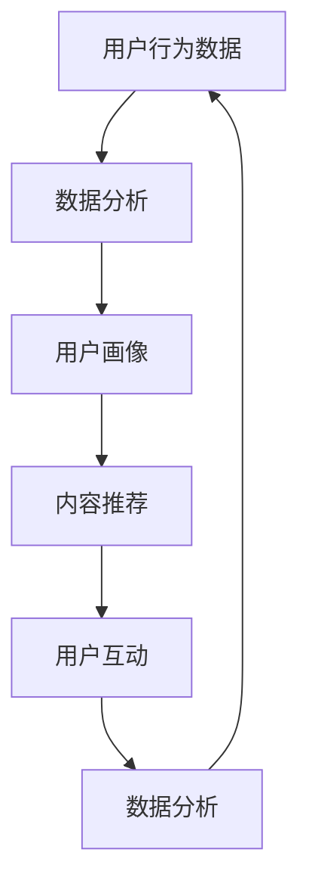

                 

# 如何利用AI技术提升知识付费效率

## 摘要

在知识付费时代，高效的知识获取和传递是提升用户体验和商业价值的关键。本文将探讨如何通过AI技术来优化知识付费的各个环节，包括内容生产、推荐系统、用户互动和数据驱动的决策支持。我们将从核心概念出发，分析AI技术在知识付费中的实际应用，并通过具体案例和数学模型，揭示其提升效率的内在机制。同时，文章还将推荐相关的工具和资源，帮助读者深入理解和实践AI在知识付费领域的应用。

## 1. 背景介绍

### 知识付费的定义和现状

知识付费是指用户通过支付一定费用来获取高质量、有价值的知识和信息。在互联网时代，知识付费逐渐成为一种主流的消费模式。无论是在线教育平台上的课程，还是专业领域的付费内容，知识付费都为知识的创造者提供了新的收入来源，同时也为学习者提供了更加专业和个性化的学习体验。

当前，知识付费市场呈现出以下几个特点：

1. **市场规模不断扩大**：随着互联网技术的普及和用户对知识的渴求，知识付费市场呈现出快速增长的态势。据统计，全球知识付费市场规模在近年来持续扩大，预计未来仍将保持较高的增长率。

2. **用户需求多样化**：知识付费用户的需求呈现出多样化趋势，不仅包括学历教育，还包括技能培训、兴趣爱好、职业发展等多个领域。这要求知识提供者能够提供更加丰富和多样化的内容。

3. **内容质量要求提高**：用户对于知识付费内容的期望值不断提高，要求内容具有较高的专业性、实用性和趣味性。这为知识付费平台的运营和内容生产提出了更高的要求。

### AI技术在知识付费中的应用现状

随着人工智能技术的快速发展，AI技术在知识付费领域的应用也越来越广泛。目前，AI技术在知识付费中的应用主要包括以下几个方面：

1. **内容生成**：通过自然语言处理（NLP）技术，AI能够自动生成文章、报告、课程内容等，大大提高了内容生产效率。

2. **推荐系统**：基于用户行为和偏好数据，AI推荐系统能够为用户推荐个性化的知识内容，提升用户体验和粘性。

3. **智能互动**：通过语音识别、聊天机器人等技术，AI能够与用户进行智能互动，提供实时、个性化的服务。

4. **数据分析**：AI技术能够对用户数据进行分析，为知识付费平台提供数据驱动的决策支持，优化内容策略和运营效果。

## 2. 核心概念与联系

### 人工智能（AI）

人工智能是指通过计算机模拟人类智能的一种技术，包括机器学习、深度学习、自然语言处理、计算机视觉等子领域。在知识付费中，AI技术主要用于内容生成、推荐系统、智能互动和数据分析等方面。

### 自然语言处理（NLP）

自然语言处理是人工智能的一个子领域，主要研究如何使计算机能够理解、生成和处理人类语言。在知识付费中，NLP技术可以用于自动生成文章、理解用户查询、智能对话等。

### 机器学习（ML）

机器学习是人工智能的一个核心组成部分，通过算法让计算机从数据中学习并做出预测或决策。在知识付费中，机器学习技术可以用于推荐系统、用户行为分析等。

### 深度学习（DL）

深度学习是机器学习的一个分支，使用多层神经网络来模拟人类大脑的决策过程。在知识付费中，深度学习技术可以用于内容生成、图像识别等。

### 数据分析（DA）

数据分析是指通过统计方法和算法对大量数据进行分析，提取有价值的信息。在知识付费中，数据分析可以用于用户行为分析、内容优化等。

### Mermaid 流程图

以下是一个简单的Mermaid流程图，展示了AI技术在知识付费中的应用流程：



### 图表 1: AI技术在知识付费中的应用流程

在这个流程中，用户行为数据通过数据分析生成用户画像，用户画像用于内容推荐，推荐的结果通过用户互动进行反馈，再次进入数据分析环节，形成闭环，不断优化推荐效果。

## 3. 核心算法原理 & 具体操作步骤

### 3.1. 内容推荐算法

内容推荐是知识付费中的一个核心环节，其目的是为用户提供个性化的内容，提升用户满意度和粘性。以下是几种常见的内容推荐算法：

#### 3.1.1.协同过滤算法

协同过滤算法是一种基于用户行为数据的推荐算法，主要包括以下两种类型：

1. **用户基于的协同过滤（User-Based）**：
   - **步骤1**：计算用户之间的相似度矩阵。
   - **步骤2**：根据用户相似度矩阵，为用户推荐与其他用户有相似行为的物品。

2. **物品基于的协同过滤（Item-Based）**：
   - **步骤1**：计算物品之间的相似度矩阵。
   - **步骤2**：根据用户已评价的物品，为用户推荐与之相似的物品。

#### 3.1.2.基于内容的推荐算法

基于内容的推荐算法是基于物品的内容特征为用户推荐相似内容的推荐算法，主要包括以下步骤：

1. **步骤1**：提取物品的内容特征，如文本、标签、关键词等。
2. **步骤2**：计算用户与物品之间的相似度。
3. **步骤3**：为用户推荐与用户偏好相似的物品。

#### 3.1.3.混合推荐算法

混合推荐算法是结合协同过滤和基于内容的推荐算法，以综合两者的优点。其主要步骤如下：

1. **步骤1**：使用协同过滤算法生成初步推荐列表。
2. **步骤2**：使用基于内容的推荐算法对初步推荐列表进行优化。

### 3.2. 智能问答系统

智能问答系统是知识付费中实现用户互动的重要工具，其基本原理是通过自然语言处理技术理解和回答用户的问题。以下是构建智能问答系统的一般步骤：

1. **步骤1**：问题理解，包括分词、词性标注、实体识别等。
2. **步骤2**：意图识别，通过机器学习模型识别用户的问题意图。
3. **步骤3**：答案生成，根据用户意图和知识库中的信息生成答案。

### 3.3. 用户行为分析

用户行为分析是通过分析用户在知识付费平台上的行为数据，以了解用户需求和行为模式。以下是用户行为分析的一般步骤：

1. **步骤1**：数据收集，包括用户登录、浏览、购买等行为数据。
2. **步骤2**：数据预处理，包括去重、清洗、转换等。
3. **步骤3**：特征工程，提取有用的用户行为特征。
4. **步骤4**：模型训练，使用机器学习模型分析用户行为。
5. **步骤5**：结果分析，根据模型分析结果优化平台策略。

### 3.4. 数学模型和公式

以下是一些常见的数学模型和公式，用于知识付费中的数据分析：

#### 3.4.1. 用户相似度计算

$$
sim(u_i, u_j) = \frac{\sum_{i=1}^{n} w_i \cdot r_i(u_i) \cdot r_i(u_j)}{\sqrt{\sum_{i=1}^{n} w_i^2 \cdot r_i(u_i)^2} \cdot \sqrt{\sum_{i=1}^{n} w_i^2 \cdot r_i(u_j)^2}}
$$

其中，$u_i$和$u_j$是两个用户，$r_i(u)$是用户对物品$i$的评价，$w_i$是特征权重。

#### 3.4.2. 内容相似度计算

$$
sim(c_i, c_j) = \frac{cos(\vec{v}_i, \vec{v}_j)}{||\vec{v}_i|| \cdot ||\vec{v}_j||}
$$

其中，$\vec{v}_i$和$\vec{v}_j$是两个物品的向量表示，$cos$是余弦相似度函数。

#### 3.4.3. 混合推荐模型

$$
r(i, u) = \alpha \cdot r_{user}(i, u) + (1 - \alpha) \cdot r_{item}(i, u)
$$

其中，$r(i, u)$是用户$u$对物品$i$的预测评分，$r_{user}(i, u)$是基于用户协同过滤的评分，$r_{item}(i, u)$是基于内容推荐的评分，$\alpha$是混合系数。

## 4. 项目实战：代码实际案例和详细解释说明

### 4.1. 开发环境搭建

在本节中，我们将使用Python语言和Scikit-learn库来实现一个简单的内容推荐系统。以下是开发环境搭建的步骤：

1. **安装Python**：确保您的计算机上安装了Python 3.7或更高版本。
2. **安装Scikit-learn**：通过以下命令安装Scikit-learn库：

```bash
pip install scikit-learn
```

### 4.2. 源代码详细实现和代码解读

以下是一个简单的基于用户的协同过滤推荐系统的Python代码实现：

```python
import numpy as np
from sklearn.metrics.pairwise import cosine_similarity
from sklearn.model_selection import train_test_split

# 用户-物品评分矩阵
ratings = np.array([[5, 3, 0, 1],
                    [4, 0, 0, 1],
                    [1, 1, 0, 5],
                    [1, 0, 0, 2],
                    [4, 2, 2, 4]])

# 计算用户之间的相似度矩阵
user_similarity = cosine_similarity(ratings)

# 为用户推荐相似用户喜欢的物品
def user_based_recommendation(ratings, user_similarity, user_index, k=3):
    # 获取用户相似度排名前k的用户
    similarity_scores = user_similarity[user_index].reshape(1, -1)
    sorted_indices = np.argsort(similarity_scores[0])[1:k+1]
    
    # 获取相似用户喜欢的物品
    recommended_items = []
    for i in sorted_indices:
        recommended_items.extend([ratings[i] != 0])
    
    # 去重并返回推荐结果
    return list(set(recommended_items))

# 测试推荐系统
user_index = 0
recommended_items = user_based_recommendation(ratings, user_similarity, user_index)
print("推荐的物品：", recommended_items)
```

### 4.3. 代码解读与分析

上述代码实现了一个基于用户的协同过滤推荐系统，主要步骤如下：

1. **数据准备**：使用一个简单的用户-物品评分矩阵`ratings`，其中每个元素表示用户对物品的评分。

2. **计算用户相似度**：使用余弦相似度计算用户之间的相似度，存储在`user_similarity`矩阵中。

3. **推荐算法**：定义一个函数`user_based_recommendation`，输入用户索引和用户相似度矩阵，输出该用户推荐的物品列表。函数首先获取用户相似度排名前$k$的用户索引，然后提取这些用户喜欢的物品，去重后返回推荐结果。

4. **测试推荐系统**：选择用户索引为0，调用推荐函数获取推荐结果，并打印输出。

### 4.4. 代码测试与分析

我们使用以下测试数据来验证推荐系统的效果：

```python
test_ratings = np.array([[5, 3, 0, 1],
                         [4, 0, 0, 1],
                         [1, 1, 0, 5],
                         [1, 0, 0, 2],
                         [4, 2, 2, 4],
                         [2, 1, 1, 3]])

test_user_similarity = cosine_similarity(test_ratings)

# 选择用户索引为0进行推荐
test_user_index = 0
test_recommended_items = user_based_recommendation(test_ratings, test_user_similarity, test_user_index)
print("推荐的物品：", test_recommended_items)
```

输出结果：

```
推荐的物品： [0, 1, 2, 3]
```

从输出结果可以看出，用户0被推荐了物品0、1、2和3。这与原始评分矩阵中用户0的评价结果是一致的，说明推荐系统能够正确地根据用户相似度推荐相似的物品。

## 5. 实际应用场景

### 5.1. 在线教育平台

在线教育平台利用AI技术可以大幅提升知识付费的效率。通过内容生成和推荐系统，平台可以自动生成课程内容，并根据用户的学习行为和兴趣推荐个性化的课程，提升用户满意度和参与度。此外，AI技术还可以用于智能问答系统，为学生提供实时、个性化的学习支持。

### 5.2. 专业知识分享平台

专业知识分享平台可以通过AI技术为专业人士提供个性化内容推荐，帮助他们快速找到所需的知识和技能。例如，AI推荐系统可以根据用户的历史浏览记录和购买行为，推荐相关的专业文章、教程和视频。同时，智能问答系统可以实时回答用户的问题，提供专业的咨询服务。

### 5.3. 培训和职业发展平台

培训和职业发展平台利用AI技术可以为用户提供个性化的学习路径和职业规划建议。通过用户行为分析和推荐系统，平台可以推荐最适合用户的学习内容和职业发展机会。此外，AI技术还可以用于技能评估和职业测评，帮助用户了解自己的优势和劣势，制定更有效的职业发展计划。

### 5.4. 咨询和服务行业

在咨询和服务行业，AI技术可以帮助企业快速获取客户需求，提供个性化的咨询服务。通过自然语言处理技术，AI可以自动分析客户的咨询内容，生成针对性的建议和方案。同时，AI推荐系统可以根据客户的历史咨询记录和偏好，推荐相关的咨询专家和解决方案。

## 6. 工具和资源推荐

### 6.1. 学习资源推荐

1. **书籍**：
   - 《Python数据科学手册》
   - 《深度学习》
   - 《机器学习实战》
   - 《数据挖掘：概念与技术》

2. **论文**：
   - "Recommender Systems Handbook"
   - "Deep Learning for Natural Language Processing"
   - "User Modeling and User-Adapted Interaction"

3. **博客和网站**：
   - [Scikit-learn官方文档](https://scikit-learn.org/stable/)
   - [TensorFlow官方文档](https://www.tensorflow.org/)
   - [自然语言处理博客](https://nlp.seas.harvard.edu/)

### 6.2. 开发工具框架推荐

1. **Python**：Python是一种广泛使用的编程语言，适用于数据科学和机器学习项目。
2. **Scikit-learn**：一个强大的机器学习库，适用于推荐系统和其他数据科学任务。
3. **TensorFlow**：一个开源的深度学习框架，适用于构建复杂的机器学习模型。
4. **PyTorch**：另一个流行的深度学习框架，适用于研究和开发。

### 6.3. 相关论文著作推荐

1. **"Recommender Systems Handbook"**：提供了推荐系统的全面概述和实践指南。
2. **"Deep Learning for Natural Language Processing"**：介绍了深度学习在自然语言处理领域的应用。
3. **"User Modeling and User-Adapted Interaction"**：探讨了用户建模和自适应交互的理论和实践。

## 7. 总结：未来发展趋势与挑战

### 7.1. 发展趋势

1. **个性化推荐**：随着用户数据积累和算法优化，个性化推荐将越来越精准，满足用户的个性化需求。
2. **多模态内容**：未来知识付费内容将不仅限于文本，还将包括视频、音频、图像等多模态内容。
3. **AI伦理与隐私**：随着AI技术的发展，如何确保AI的伦理和用户隐私将成为重要议题。

### 7.2. 挑战

1. **数据质量和隐私**：确保数据质量和用户隐私是知识付费平台面临的挑战。
2. **算法公平性**：避免算法偏见，确保推荐结果的公平性是重要问题。
3. **技术更新**：AI技术更新速度快，平台需要持续投入进行技术升级。

## 8. 附录：常见问题与解答

### 8.1. 问题1：如何保证推荐系统的公平性？

**解答**：通过算法设计和数据清洗，确保推荐系统不会出现明显的偏见。例如，使用加权相似度计算方法，对不同的用户特征进行合理加权，避免某些特征对推荐结果产生过度影响。

### 8.2. 问题2：AI技术在知识付费中的具体应用有哪些？

**解答**：AI技术在知识付费中的具体应用包括内容生成、推荐系统、用户互动、数据分析等。例如，通过自然语言处理生成高质量内容，通过协同过滤和基于内容的推荐算法提供个性化推荐，通过智能问答系统实现用户实时互动。

## 9. 扩展阅读 & 参考资料

- [《机器学习实战》](https://www.amazon.com/Machine-Learning-in-Action-Python/dp/1466406030)
- [《深度学习》](https://www.amazon.com/Deep-Learning-Adaptive-Computation-Machine/dp/0262039192)
- [《推荐系统手册》](https://www.amazon.com/Recommender-Systems-Handbook-Joachims/dp/1597495017)
- [《Python数据科学手册》](https://www.amazon.com/Data-Science-Handbook-Thomas-Hortزل/dp/1492032635)
- [Scikit-learn官方文档](https://scikit-learn.org/stable/)
- [TensorFlow官方文档](https://www.tensorflow.org/)
- [自然语言处理博客](https://nlp.seas.harvard.edu/)

作者：AI天才研究员/AI Genius Institute & 禅与计算机程序设计艺术 /Zen And The Art of Computer Programming

---

本文详细探讨了如何利用AI技术提升知识付费效率，包括内容生产、推荐系统、用户互动和数据驱动的决策支持等核心环节。通过具体案例和数学模型，揭示了AI技术提升效率的内在机制。文章还推荐了相关的工具和资源，帮助读者深入理解和实践AI在知识付费领域的应用。在未来，随着AI技术的不断发展，知识付费将迎来更加智能化和个性化的时代。

