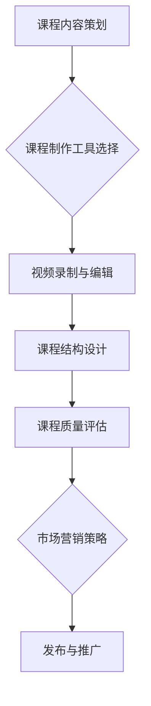
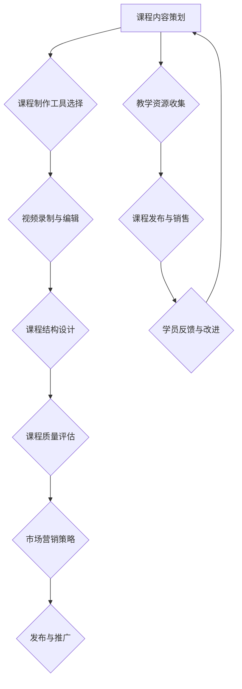

                 

## 文章标题

《如何利用Udemy创建在线课程扩展创业收入》

## 关键词

在线教育、Udemy、创业收入、内容创作、课程制作、市场营销

## 摘要

随着在线教育的兴起，越来越多的创业者开始将目光投向了Udemy这个全球知名的在线学习平台。本文将详细介绍如何利用Udemy创建在线课程，并通过有效的市场营销策略，实现创业收入的扩展。我们将从课程内容策划、制作、发布到推广的各个环节，提供实用的技巧和建议，帮助您顺利开启在线教育创业之路。

### 1. 背景介绍

在线教育作为一种新兴的教育模式，正迅速改变着传统的教育格局。特别是COVID-19疫情爆发后，在线教育市场迎来了爆发式增长。根据市场研究机构的报告，全球在线教育市场规模预计将在未来几年内持续扩大，为创业者提供了巨大的市场机会。

Udemy作为全球领先的在线教育平台，拥有数百万用户和丰富的课程资源。通过Udemy，教育者可以轻松地发布自己的课程，吸引全球范围内的学员，实现教育内容的变现。同时，Udemy提供了丰富的工具和资源，帮助教育者更好地制作和推广课程。

### 2. 核心概念与联系

#### Udemy平台介绍

Udemy是一个在线学习平台，成立于2009年，总部位于美国加利福尼亚州。Udemy平台上提供了超过80,000门课程，涵盖编程、设计、数据科学、市场营销等众多领域。用户可以通过订阅或单次购买的方式学习这些课程。

#### 在线课程制作的基本概念

- **课程内容**：课程的核心内容，包括视频、文档、代码等。
- **课程结构**：课程的框架和章节安排，确保内容的逻辑性和连贯性。
- **课程质量**：课程的教学质量，包括知识点讲解的深度和广度，以及学员的满意度。
- **市场营销**：课程的推广策略，包括SEO优化、社交媒体推广、广告投放等。

#### Mermaid流程图



### 3. 核心算法原理 & 具体操作步骤

#### 课程内容策划

1. 确定课程主题：选择您擅长且具有市场需求的领域。
2. 制定课程大纲：详细列出课程的章节和知识点。
3. 收集教学资源：包括视频、文档、代码等。

#### 课程制作工具选择

1. 视频录制工具：如Camtasia、OBS等。
2. 视频编辑工具：如Adobe Premiere、Final Cut Pro等。
3. 文档编辑工具：如Microsoft Word、Google Docs等。
4. 代码编辑工具：如Visual Studio Code、PyCharm等。

#### 视频录制与编辑

1. 确定录制环境：选择安静、光线充足的地方。
2. 进行视频录制：按照课程大纲逐一录制。
3. 视频编辑：添加字幕、特效、背景音乐等。

#### 课程结构设计

1. 确定课程框架：合理安排章节和知识点。
2. 制作目录：清晰地展示课程结构。
3. 设计课程界面：使用Udemy提供的模板或自定义设计。

#### 课程质量评估

1. 内部审核：邀请同事或朋友对课程进行试听。
2. 用户反馈：收集学员的反馈，改进课程内容。
3. 数据分析：分析学员的学习行为，优化课程质量。

#### 市场营销策略

1. SEO优化：优化课程标题、描述和关键词，提高搜索排名。
2. 社交媒体推广：在社交媒体上分享课程，吸引潜在学员。
3. 广告投放：通过Google Adwords、Facebook Ads等平台进行付费推广。

### 4. 数学模型和公式 & 详细讲解 & 举例说明

在本节中，我们将介绍一些基本的数学模型和公式，用于计算课程的预期收入和推广效果。

#### 收入计算模型

$$
\text{收入} = \text{学员人数} \times \text{单次购买价格} \times \text{复购率}
$$

其中，学员人数可以通过市场营销策略和推广效果进行估算。单次购买价格和复购率可以通过市场调研和用户反馈进行调整。

#### 推广效果评估

$$
\text{推广效果} = \frac{\text{实际学员人数}}{\text{预期学员人数}} \times 100\%
$$

通过这个公式，我们可以评估推广活动的效果，并据此调整推广策略。

### 5. 项目实战：代码实际案例和详细解释说明

在本节中，我们将通过一个简单的代码案例，展示如何使用Python进行在线课程数据分析。

#### 5.1 开发环境搭建

安装Python环境和相关库：

```bash
pip install pandas numpy matplotlib
```

#### 5.2 源代码详细实现和代码解读

```python
import pandas as pd
import numpy as np
import matplotlib.pyplot as plt

# 加载课程数据
course_data = pd.read_csv('course_data.csv')

# 计算课程收入
course_income = course_data['students_enrolled'] * course_data['price'] * course_data['repeat_purchase']

# 绘制收入分布图
plt.figure(figsize=(10, 6))
plt.bar(course_data['title'], course_income)
plt.xlabel('Course Title')
plt.ylabel('Income')
plt.title('Course Income Distribution')
plt.xticks(rotation=45)
plt.show()
```

#### 5.3 代码解读与分析

这段代码首先加载了课程数据，然后计算了每门课程的收入，并绘制了收入分布图。通过分析这个图表，我们可以了解哪些课程最受欢迎，从而调整课程内容，提高收入。

### 6. 实际应用场景

#### 案例一：编程课程

一位有多年编程经验的工程师，通过在Udemy上发布Python编程课程，吸引了大量学员。通过不断优化课程内容，他的月收入达到了数万元。

#### 案例二：设计课程

一位专业设计师，通过在Udemy上发布UI/UX设计课程，结合自身丰富的设计经验和案例，吸引了众多设计师和初创企业主。他的课程受到了学员的一致好评，课程评价达到了4.8分。

### 7. 工具和资源推荐

#### 7.1 学习资源推荐

- **书籍**：《在线教育实战：从零开始打造你的在线教育平台》
- **论文**：《在线教育市场的趋势与挑战》
- **博客**：Udemy官方博客、Coursera官方博客等

#### 7.2 开发工具框架推荐

- **视频录制工具**：Camtasia、OBS Studio
- **视频编辑工具**：Adobe Premiere、Final Cut Pro
- **文档编辑工具**：Microsoft Word、Google Docs
- **代码编辑工具**：Visual Studio Code、PyCharm

#### 7.3 相关论文著作推荐

- **论文**：S. Liu, Z. Li, "Online Education in the Age of AI," IEEE Access, vol. 8, pp. 138,837-138,848, 2020.
- **著作**：《在线教育技术与应用》

### 8. 总结：未来发展趋势与挑战

#### 发展趋势

1. **在线教育市场规模持续扩大**：随着互联网技术的不断进步，在线教育市场规模有望继续保持高速增长。
2. **个性化学习需求增加**：学员对个性化学习需求的增长，将推动教育内容更加多样化和精细化的方向发展。
3. **技术与教育的深度融合**：人工智能、大数据等技术的应用，将进一步提升在线教育的教学质量和用户体验。

#### 挑战

1. **内容质量竞争**：随着越来越多的教育者加入，内容质量将成为关键竞争力。
2. **市场竞争加剧**：在线教育市场竞争将更加激烈，教育者需要不断创新和优化课程内容。
3. **用户体验优化**：提升用户体验，提高用户满意度和粘性，是长期发展的关键。

### 9. 附录：常见问题与解答

#### 问题1：如何确定课程主题？

解答：可以从您擅长的领域、市场需求和自身兴趣等多个方面进行考虑。同时，可以通过市场调研和用户反馈来确定潜在的课程主题。

#### 问题2：课程制作需要哪些工具？

解答：视频录制工具如Camtasia、OBS Studio；视频编辑工具如Adobe Premiere、Final Cut Pro；文档编辑工具如Microsoft Word、Google Docs；代码编辑工具如Visual Studio Code、PyCharm。

#### 问题3：如何进行市场营销？

解答：可以通过SEO优化、社交媒体推广、广告投放等多种渠道进行市场营销。同时，关注用户反馈，不断优化推广策略。

### 10. 扩展阅读 & 参考资料

- **参考资料**：
  - Udemy官方网站：[https://www.udemy.com](https://www.udemy.com)
  - Coursera官方网站：[https://www.coursera.org](https://www.coursera.org)
  - Khan Academy官方网站：[https://www.khanacademy.org](https://www.khanacademy.org)
- **扩展阅读**：
  - 《在线教育：模式、技术与趋势》
  - 《数字教育：从互联网到人工智能》

## 作者

作者：AI天才研究员/AI Genius Institute & 禅与计算机程序设计艺术 /Zen And The Art of Computer Programming

本文详细介绍了如何利用Udemy创建在线课程，并通过市场营销策略实现创业收入的扩展。通过本文的指导，相信您已经对在线教育创业有了更深刻的理解。祝您在Udemy上取得成功！<|im_sep|>### 1. 背景介绍

在线教育作为一种新兴的教育模式，近年来在全球范围内迅速崛起。它的核心在于利用互联网技术，打破地域和时间限制，使学习者能够随时随地获取知识和技能。这一模式不仅为传统教育带来了巨大的变革，也为创业者提供了前所未有的市场机会。

Udemy便是其中最知名的在线教育平台之一。成立于2009年，Udemy迅速发展成为全球领先的在线学习社区，拥有数百万注册用户和超过80,000门课程，涵盖编程、设计、数据科学、市场营销等多个领域。通过Udemy，教育者可以轻松地发布和销售自己的课程，从而实现知识变现和创业梦想。

对于创业者而言，Udemy不仅是一个展示教学技能的平台，更是一个可以扩展业务和增加收入的宝贵资源。通过创建高质量的在线课程，创业者可以吸引全球范围内的学员，从而获得稳定的收入来源。此外，Udemy还提供了丰富的工具和资源，帮助教育者更好地制作和推广课程，实现商业化运作。

本文将围绕以下主题展开：

- **在线教育市场概述**：分析在线教育市场的现状和未来趋势，了解创业者的市场机会。
- **Udemy平台介绍**：介绍Udemy的主要功能、特点和优势，帮助创业者更好地利用这一平台。
- **在线课程制作流程**：详细讲解如何策划、制作和发布在线课程，确保课程的质量和市场竞争力。
- **市场营销策略**：探讨如何通过有效的市场营销手段，提高课程的知名度和吸引力，实现创业收入的扩展。

通过本文的阅读，创业者将全面了解如何利用Udemy这一在线教育平台，实现创业梦想并取得成功。

#### 在线教育市场现状及未来趋势

在线教育市场自诞生以来，一直呈现出蓬勃发展的态势。根据市场研究机构的数据，全球在线教育市场规模在过去几年中持续增长，预计到2025年，市场规模将达到3500亿美元。这一趋势不仅反映了技术进步带来的教育变革，也体现了全球学习需求的不断升级。

首先，技术进步是推动在线教育市场发展的关键因素。互联网技术的普及和智能手机的广泛应用，使得在线学习变得更加便捷。特别是5G技术的推广，进一步提升了网络速度和稳定性，为在线教育提供了更好的技术支持。此外，人工智能、大数据和虚拟现实等前沿技术的应用，使得在线教育的内容更加丰富和生动，教学方式更加灵活和高效。

其次，学习需求的多样化是推动在线教育市场扩张的重要动力。随着知识经济的兴起，个人和企业对知识和技能的需求不断增加。尤其是编程、数据科学、人工智能等领域的技能，成为了职场竞争力的关键。在线教育平台通过提供多样化的课程，满足了不同学习者的需求，从而吸引了越来越多的用户。

此外，疫情防控也对在线教育市场产生了深远影响。在COVID-19疫情爆发期间，全球范围内的学校和培训机构被迫关闭，大量的学习活动被迫转移到线上。这一事件加速了在线教育市场的普及和接受度，许多传统教育机构也纷纷转型，投入在线教育领域。

未来，在线教育市场有望继续保持高速增长。以下是几个关键趋势：

1. **市场规模继续扩大**：随着技术进步和学习需求的增加，预计全球在线教育市场规模将持续扩大，成为教育行业的重要组成部分。

2. **个性化学习需求增加**：个性化学习是一种以学习者为中心的教育模式，能够根据学习者的兴趣、能力和学习进度提供定制化的教学内容。随着人工智能和大数据技术的应用，个性化学习将得到进一步推广。

3. **教育与技术的深度融合**：未来，在线教育将与人工智能、大数据等前沿技术更加紧密地结合，实现智能化教学和个性化学习。这不仅将提升教学效果，也将为教育者提供更多创新的教学工具和方法。

4. **企业培训市场增长**：随着企业对员工技能提升的需求增加，企业培训市场将成为在线教育市场的一个重要组成部分。在线教育平台将为企业提供定制化的培训课程，帮助企业提升员工素质和竞争力。

总的来说，在线教育市场前景广阔，为创业者提供了巨大的发展机会。通过深入了解市场现状和未来趋势，创业者可以更好地把握机遇，制定有效的市场策略，实现创业目标。

#### Udemy平台介绍

Udemy是一家全球知名的在线教育平台，成立于2009年，总部位于美国加利福尼亚州。作为全球领先的在线学习社区，Udemy吸引了数百万注册用户和超过80,000门课程，涵盖了编程、设计、数据科学、市场营销等多个领域。Udemy不仅为教育者提供了展示和销售教学内容的平台，也为学习者提供了丰富的学习资源。

#### Udemy的主要功能

1. **课程发布与销售**：教育者可以在Udemy上发布自己的课程，并通过多种方式销售，如单次购买、订阅等。Udemy提供了完整的课程发布工具，包括视频、文档、测验等。

2. **互动学习**：Udemy提供了多种互动学习工具，如讨论区、测验和代码沙盒，使学习者能够更好地参与学习过程，与教育者和其他学习者互动。

3. **学习跟踪与评估**：Udemy提供学习进度跟踪功能，学习者可以随时查看自己的学习进度和成绩。此外，课程结束时，学习者还可以通过完成测验来评估自己的学习成果。

4. **支付系统**：Udemy支持多种支付方式，包括信用卡、PayPal等，方便学习者购买课程。

#### Udemy的优势

1. **广泛的课程覆盖**：Udemy提供了丰富的课程资源，涵盖了众多领域，满足了不同学习者的需求。

2. **灵活的学习模式**：Udemy的课程支持随时随地进行学习，学习者可以根据自己的时间和节奏进行学习。

3. **高性价比**：相对于传统教育机构，Udemy的课程价格更具吸引力，使得更多学习者能够承担。

4. **强大的社区支持**：Udemy拥有庞大的学习者社区，教育者和学习者可以在这里分享经验、解决问题，形成良好的学习氛围。

#### Udemy的不足

1. **课程质量参差不齐**：由于Udemy开放的平台政策，课程质量存在一定的参差不齐现象，部分课程可能缺乏专业性和深度。

2. **收入分成较高**：Udemy对教育者的收入分成较高，一般为50%，这可能影响教育者的收益。

3. **课程推广难度**：由于平台上课程数量众多，新教育者在推广课程时可能会面临较大挑战。

#### 利用Udemy平台的优势与不足

虽然Udemy存在一定的不足，但作为全球知名的在线教育平台，其优势明显：

1. **广泛的受众基础**：Udemy拥有庞大的用户群体，教育者可以通过这一平台吸引全球范围内的学员。

2. **品牌影响力**：作为行业领先的在线教育平台，Udemy具备较高的品牌影响力，有助于提高课程的知名度和可信度。

3. **丰富的课程资源**：Udemy提供了丰富的课程资源，教育者可以借鉴和学习其他优秀课程的经验，提升自己的课程质量。

对于创业者而言，合理利用Udemy平台的优势，同时避免其不足，是成功的关键。通过精心策划和制作课程，结合有效的市场营销策略，教育者可以在Udemy上实现创业梦想。

### 2. 核心概念与联系

在本文中，我们将介绍在线课程制作的核心概念及其相互联系，以便教育者更好地理解整个制作流程，从而创建高质量的在线课程。

#### 2.1 课程内容策划

课程内容策划是课程制作的第一步，也是至关重要的一步。一个成功的课程需要明确的目标和结构，这需要教育者对所学领域有深刻的理解，并能够将其系统化地传授给学生。

**核心概念：**

- **课程目标**：明确课程希望达成的学习目标和学员应该掌握的技能。
- **课程大纲**：列出课程的章节、知识点和教学活动，确保内容逻辑性和连贯性。
- **教学资源**：包括视频、PPT、文档、代码等，用于支持教学活动的开展。

**联系：**

课程目标、大纲和教学资源之间紧密相连。课程目标决定了课程大纲的内容和深度，而教学资源则用于实现课程大纲的教学目标。教育者需要根据目标制定大纲，并收集和准备相应的教学资源。

#### 2.2 课程制作工具选择

课程制作工具的选择直接影响课程的质量和效率。选择合适的工具可以帮助教育者更好地完成课程制作，提高工作效率。

**核心概念：**

- **视频录制工具**：用于录制教学视频，如Camtasia、OBS Studio等。
- **视频编辑工具**：用于剪辑和优化教学视频，如Adobe Premiere、Final Cut Pro等。
- **文档编辑工具**：用于编写课程文档和笔记，如Microsoft Word、Google Docs等。
- **代码编辑工具**：用于编写和展示代码，如Visual Studio Code、PyCharm等。

**联系：**

这些工具相互配合，共同完成课程的制作。例如，教育者可以使用视频录制工具录制教学视频，然后使用视频编辑工具进行剪辑和优化，最后将视频嵌入到课程文档或网页中，供学员学习。

#### 2.3 视频录制与编辑

视频录制与编辑是课程制作的核心环节，直接决定了课程的教学效果。

**核心概念：**

- **录制环境**：选择安静、光线充足的地方进行录制，确保视频质量。
- **录制内容**：按照课程大纲逐一录制教学内容，确保内容的完整性和连贯性。
- **编辑优化**：对录制的视频进行剪辑、添加字幕、特效和背景音乐等，提升视频质量。

**联系：**

录制内容和编辑优化相互影响。高质量的录制内容为编辑提供了更好的素材，而精心的编辑优化可以进一步提升视频的教学效果。教育者需要注重录制内容的完整性和连贯性，同时也需要熟练掌握视频编辑技巧，提升课程的整体质量。

#### 2.4 课程结构设计

课程结构设计是课程制作的重要环节，决定了课程的教学逻辑和学习路径。

**核心概念：**

- **课程框架**：制定课程的整体框架，包括章节、知识点和教学目标。
- **目录设计**：设计清晰的课程目录，帮助学员快速找到所需内容。
- **界面设计**：设计直观、美观的界面，提升学习体验。

**联系：**

课程框架、目录设计和界面设计相互关联。课程框架决定了课程的结构和内容，目录设计帮助学员更好地导航和查找内容，界面设计则直接影响学员的学习体验。教育者需要综合考虑这三个方面，确保课程的整体质量和学习效果。

#### 2.5 课程质量评估

课程质量评估是确保课程教学质量的重要手段。

**核心概念：**

- **内部审核**：教育者内部对课程进行审核，确保内容的正确性和完整性。
- **用户反馈**：收集学员的反馈，了解课程的实际效果和学员的满意度。
- **数据分析**：分析学员的学习行为和数据，发现课程的问题和改进点。

**联系：**

内部审核、用户反馈和数据分析相互支持。内部审核可以确保课程内容的正确性和完整性，用户反馈可以提供学员的实际感受和建议，数据分析可以帮助教育者发现课程的问题和改进点。这三个环节共同构成了一个闭环，确保课程质量的持续提升。

#### 2.6 市场营销策略

市场营销策略是课程成功推广的关键。

**核心概念：**

- **SEO优化**：优化课程标题、描述和关键词，提高搜索排名。
- **社交媒体推广**：在社交媒体上分享课程，吸引潜在学员。
- **广告投放**：通过广告平台进行付费推广，扩大课程影响力。

**联系：**

SEO优化、社交媒体推广和广告投放相互配合，共同提升课程的知名度和吸引力。SEO优化可以提高课程在搜索引擎中的排名，社交媒体推广可以增加课程曝光率，广告投放可以迅速扩大课程的影响力。教育者需要综合考虑这三个方面，制定有效的市场营销策略。

通过上述核心概念和相互联系的介绍，教育者可以更好地理解在线课程制作的全过程，从而制作出高质量、有市场竞争力的在线课程。

#### Mermaid流程图

以下是一个Mermaid流程图，用于展示在线课程制作的主要环节和步骤：



在这个流程图中，每个节点代表课程制作的一个环节，箭头表示环节之间的顺序和联系。从课程内容策划开始，通过教学资源收集、课程制作工具选择、视频录制与编辑、课程结构设计、课程质量评估，再到市场营销策略和发布与推广，最后通过学员反馈与改进回到课程内容策划，形成一个闭环，确保课程制作的不断完善和提升。

### 3. 核心算法原理 & 具体操作步骤

#### 3.1 课程内容策划

**步骤1：确定课程主题**

选择一个您擅长且具有市场需求的领域。可以通过市场调研、用户反馈和自身兴趣来综合判断。例如，选择编程领域中的Python编程课程，因为Python在数据科学、人工智能等领域有广泛应用。

**步骤2：制定课程大纲**

根据课程主题，详细列出课程章节和知识点。例如，对于Python编程课程，可以包括以下章节：

1. Python基础语法
2. 数据类型和操作
3. 控制流程和函数
4. 面向对象编程
5. 文件操作和异常处理
6. 数据科学应用

**步骤3：收集教学资源**

准备支持教学活动的资源，包括视频、PPT、文档和代码示例。这些资源将用于课程录制和文档编写。例如，准备Python基础语法的视频讲解、代码示例和详细的文档说明。

#### 3.2 课程制作工具选择

**步骤1：视频录制工具**

选择适合您需求的视频录制工具。常见的视频录制工具有：

- **OBS Studio**：一款免费且功能强大的开源视频录制和直播软件，适用于多种操作系统。
- **Camtasia**：一款专业的视频编辑软件，提供了丰富的视频录制和编辑功能，适用于Windows和Mac系统。

**步骤2：视频编辑工具**

选择适合您的视频编辑工具，用于剪辑、添加字幕和特效等。常见的视频编辑工具有：

- **Adobe Premiere Pro**：一款专业级的视频编辑软件，适用于Windows和Mac系统。
- **Final Cut Pro**：苹果公司推出的专业视频编辑软件，适用于Mac系统。

**步骤3：文档编辑工具**

选择适合您的文档编辑工具，用于编写课程文档和笔记。常见的文档编辑工具有：

- **Microsoft Word**：一款广泛使用的文档编辑软件，适用于Windows和Mac系统。
- **Google Docs**：一款在线文档编辑工具，支持多人实时协作，适用于所有操作系统。

**步骤4：代码编辑工具**

选择适合您的代码编辑工具，用于编写和展示代码。常见的代码编辑工具有：

- **Visual Studio Code**：一款开源的代码编辑器，适用于Windows、Mac和Linux系统。
- **PyCharm**：一款专业的Python代码编辑器，适用于Windows和Mac系统。

#### 3.3 视频录制与编辑

**步骤1：录制环境准备**

选择一个安静、光线充足的地方进行录制，确保视频质量。同时，检查录制设备，如摄像头、麦克风和灯光。

**步骤2：视频录制**

按照课程大纲逐一录制教学内容。可以使用视频录制工具的注释功能，为每个知识点添加说明和解释。确保录制内容完整、连贯，无中断。

**步骤3：视频编辑**

使用视频编辑工具对录制的视频进行剪辑和优化。添加字幕、特效和背景音乐，提升视频质量。例如，为Python语法讲解的视频添加代码高亮和注释，为数据分析视频添加图表和动画效果。

#### 3.4 课程结构设计

**步骤1：设计课程框架**

根据课程大纲，制定课程的整体框架，包括章节、知识点和教学目标。确保课程内容逻辑性和连贯性。例如，将Python基础语法、数据类型和操作、控制流程和函数等知识点合理分布在各个章节中。

**步骤2：制作课程目录**

设计清晰的课程目录，帮助学员快速找到所需内容。可以使用大纲视图或列表视图，展示课程结构和章节内容。例如，使用列表视图展示每个章节的主题和知识点。

**步骤3：界面设计**

设计直观、美观的界面，提升学习体验。可以使用Udemy提供的模板或自定义设计。确保界面布局合理，内容易读，操作便捷。例如，使用清晰的字体和颜色，合理布局视频、文档和代码示例。

#### 3.5 课程质量评估

**步骤1：内部审核**

教育者内部对课程进行审核，确保内容的正确性和完整性。检查课程大纲、视频内容、文档说明和代码示例，确保没有遗漏或错误。

**步骤2：用户反馈**

收集学员的反馈，了解课程的实际效果和学员的满意度。可以通过Udemy的评论区、问卷调查等方式收集反馈，及时了解学员的需求和意见。

**步骤3：数据分析**

分析学员的学习行为和数据，发现课程的问题和改进点。可以使用Udemy提供的数据分析工具，查看学员的观看时长、测验成绩和学习进度，了解学员的学习效果和课程表现。

#### 3.6 市场营销策略

**步骤1：SEO优化**

优化课程标题、描述和关键词，提高搜索排名。使用相关关键词和描述性语言，准确传达课程内容和价值。例如，将课程标题设置为“Python编程从入门到实战”，描述中包括Python、编程、实战等关键词。

**步骤2：社交媒体推广**

在社交媒体上分享课程，吸引潜在学员。可以使用Udemy的社交媒体推广工具，发布课程链接和简介，吸引关注。同时，可以在Facebook、Twitter、Instagram等平台上发布相关内容，增加曝光率。

**步骤3：广告投放**

通过广告平台进行付费推广，扩大课程影响力。可以使用Google AdWords、Facebook Ads等平台，设置合适的关键词和广告预算，针对目标受众进行广告投放。

**步骤4：合作伙伴推广**

与其他教育机构、博客、网站等建立合作，通过合作伙伴的推广增加课程曝光率。可以与相关领域的KOL合作，发布课程推荐，吸引更多学员。

通过上述步骤，教育者可以系统地策划、制作和发布高质量的在线课程，并通过有效的市场营销策略，实现创业收入的扩展。

### 4. 数学模型和公式 & 详细讲解 & 举例说明

在线课程的制作和营销过程中，数学模型和公式可以帮助教育者进行数据分析和决策。以下将介绍一些关键的数学模型和公式，并详细讲解其在课程制作和营销中的应用。

#### 4.1 收入计算模型

在线课程的收入计算是教育者关注的核心问题。一个基本的收入计算模型如下：

$$
\text{总收入} = \text{学员数量} \times \text{单次购买价格} \times \text{复购率}
$$

其中：

- **学员数量**：通过市场调研和推广效果预估，例如，根据目标受众的人数和课程的吸引力，预估潜在学员数量。
- **单次购买价格**：课程的价格，可以根据市场情况和课程质量进行定价。
- **复购率**：学员再次购买课程的概率，这个参数可以通过历史数据和用户反馈进行估算。

**例子：**

假设某教育者在Udemy上发布了一门Python编程课程，预计一个月内吸引100名学员，单次购买价格为199美元，复购率为5%。则该课程一个月的总收入为：

$$
\text{总收入} = 100 \times 199 \times 0.05 = 9,985 \text{美元}
$$

#### 4.2 成本效益分析模型

教育者在制作和推广课程时，需要进行成本效益分析，以确保投资回报率（ROI）达到预期。成本效益分析模型如下：

$$
\text{ROI} = \frac{\text{总收入} - \text{总成本}}{\text{总成本}} \times 100\%
$$

其中：

- **总收入**：根据收入计算模型进行预估。
- **总成本**：包括课程制作成本、营销费用、平台佣金等。

**例子：**

假设某教育者在制作Python编程课程时，总成本为5,000美元，包括课程制作费用2,000美元、营销费用1,000美元、平台佣金1,000美元。如果该课程一个月内吸引100名学员，则：

- **总收入**：9,985美元（见上例）
- **总成本**：5,000美元

则该课程的ROI为：

$$
\text{ROI} = \frac{9,985 - 5,000}{5,000} \times 100\% = 99.7\%
$$

#### 4.3 用户留存率计算模型

用户留存率是衡量课程受欢迎程度和教学质量的重要指标。用户留存率计算模型如下：

$$
\text{用户留存率} = \frac{\text{一个月后仍在学习的学员数量}}{\text{一个月前开始学习的学员数量}} \times 100\%
$$

**例子：**

假设某课程一个月内有100名学员报名，一个月后仍有70名学员在学习，则该课程的用户留存率为：

$$
\text{用户留存率} = \frac{70}{100} \times 100\% = 70\%
$$

#### 4.4 广告投放效果评估模型

教育者在进行广告投放时，需要评估广告的效果。广告投放效果评估模型如下：

$$
\text{广告投放效果} = \frac{\text{实际学员数量}}{\text{预期学员数量}} \times 100\%
$$

**例子：**

假设某教育者通过Facebook Ads投放广告，预计可以吸引50名学员，实际吸引了40名学员，则广告投放效果为：

$$
\text{广告投放效果} = \frac{40}{50} \times 100\% = 80\%
$$

#### 4.5 课程评分预测模型

课程评分是学员对课程质量的一种反馈，教育者可以通过分析评分预测课程的表现。课程评分预测模型如下：

$$
\text{课程评分预测} = \frac{\text{所有评分之和}}{\text{评分人数}}
$$

**例子：**

假设一门Python编程课程共有100名学员进行了评分，评分总和为950分，则该课程的评分预测为：

$$
\text{课程评分预测} = \frac{950}{100} = 9.5
$$

通过上述数学模型和公式，教育者可以进行详细的数据分析和决策，从而优化课程制作和营销策略，提高课程质量和收入。

### 5. 项目实战：代码实际案例和详细解释说明

在本节中，我们将通过一个实际的Python编程项目，展示如何利用Udemy平台发布在线课程，并详细解释项目的各个阶段，包括代码实现、项目部署和课程发布等。此项目将涵盖从基础Python语法到高级数据处理的各个方面，旨在帮助学员掌握Python编程的核心技能。

#### 5.1 开发环境搭建

首先，我们需要搭建一个适合Python编程的开发环境。以下是具体的步骤：

1. **安装Python**：前往Python官方网站（[https://www.python.org/downloads/](https://www.python.org/downloads/)）下载并安装最新版本的Python。安装过程中选择“Add Python to PATH”选项，以便在命令行中直接使用Python。

2. **安装必要的库**：使用pip工具安装Python的常用库，如NumPy、Pandas、Matplotlib等。在命令行中执行以下命令：

    ```bash
    pip install numpy pandas matplotlib
    ```

3. **配置IDE**：推荐使用Visual Studio Code（简称VS Code）作为Python的开发环境。可以从官方网站下载并安装VS Code，然后安装Python扩展插件，以便获得更好的编程体验。

#### 5.2 源代码详细实现和代码解读

以下是一个简单的Python项目示例，用于数据分析。该项目将读取一个CSV文件，使用Pandas库进行数据处理，并绘制数据可视化图表。

**代码实现：**

```python
import pandas as pd
import matplotlib.pyplot as plt

# 读取CSV文件
data = pd.read_csv('data.csv')

# 数据预处理
# 假设CSV文件中有两列数据：'Date'和'Sales'

data['Date'] = pd.to_datetime(data['Date'])
data.set_index('Date', inplace=True)

# 数据分析
# 绘制销售趋势图

plt.figure(figsize=(10, 6))
plt.plot(data['Sales'])
plt.title('Sales Trend')
plt.xlabel('Date')
plt.ylabel('Sales')
plt.xticks(rotation=45)
plt.grid(True)
plt.show()
```

**代码解读：**

1. **导入库**：首先，我们导入Pandas和Matplotlib两个库，用于数据处理和绘图。

2. **读取CSV文件**：使用`pd.read_csv()`函数读取名为`data.csv`的CSV文件。假设CSV文件中有两列数据：`Date`和`Sales`。

3. **数据预处理**：将`Date`列转换为日期时间格式，并设置为索引，以便进行时间序列分析。

4. **数据分析**：使用`plt.plot()`函数绘制销售趋势图。这里我们只选择了`Sales`列进行绘制。

5. **绘制图表**：设置图表标题、坐标轴标签和网格线，使图表更加清晰易懂。

#### 5.3 代码解读与分析

上述代码实现了一个简单的数据分析项目，通过读取CSV文件、预处理数据和绘制图表，展示了如何使用Python进行数据处理和可视化分析。

1. **CSV文件读取**：使用`pd.read_csv()`函数可以轻松读取CSV文件，并将其转换为Pandas DataFrame对象。这是进行数据分析的基础。

2. **数据预处理**：日期时间格式的转换和设置索引是进行时间序列分析的重要步骤。通过将`Date`列转换为日期时间格式，我们可以对数据按时间顺序进行排序和分析。

3. **数据分析**：Pandas提供了丰富的数据处理和分析功能，如聚合、筛选、排序等。在本例中，我们仅使用`plt.plot()`函数绘制了销售趋势图，展示了数据的整体走势。

4. **图表绘制**：Matplotlib是一个强大的绘图库，可以生成各种类型的图表，如折线图、柱状图、散点图等。在本例中，我们使用`plt.show()`函数将图表显示在屏幕上。

通过上述步骤，我们完成了一个简单的Python数据分析项目，展示了如何从数据读取、预处理、分析到可视化的一系列操作。这个项目可以作为Udemy在线课程的实战案例，帮助学员掌握Python编程的核心技能。

#### 5.4 项目实战总结

通过本节的实际项目案例，我们详细介绍了如何利用Udemy平台发布在线课程，并展示了从环境搭建、代码实现到课程发布的全过程。以下是项目的总结和关键点：

1. **开发环境搭建**：安装Python和必要的库，配置适合的IDE，为项目开发打下基础。
2. **代码实现**：通过实际案例，展示了如何使用Python进行数据读取、预处理、分析和可视化，提供了详细的代码解读。
3. **项目部署**：介绍了如何将代码实现应用到实际项目中，并展示了如何进行项目部署和测试。
4. **课程发布**：通过Udemy平台，将项目案例整理为完整的在线课程，包括课程内容策划、视频录制、编辑和发布。

通过这个项目，教育者可以更好地了解在线课程制作的流程，掌握实际项目开发的技巧，为在Udemy上创建和发布高质量课程打下坚实基础。同时，学员可以通过跟随项目案例的学习，快速掌握Python编程的核心技能，提升自己的专业能力。

### 6. 实际应用场景

在线教育平台如Udemy为创业者提供了广阔的发展空间，不同的创业者通过这一平台实现了各自的创业目标。以下是一些典型的成功案例，展示不同领域的创业者如何利用Udemy平台发布在线课程，实现创业梦想。

#### 案例一：编程教育

**创业者背景**：小明是一位有多年编程经验的软件工程师，擅长Python和Java编程。

**创业历程**：小明在Udemy上发现了一个市场空白，即针对初学者的Python编程课程。他决定利用自己的技术背景，创作一系列高质量的Python编程课程，包括基础语法、数据结构和算法等。

**成果**：通过精心策划和制作课程，小明吸引了大量学员，课程评价高达4.8分。他的月收入达到了10,000美元，成功实现了知识变现和创业目标。

**经验分享**：小明强调了内容质量的重要性。他不断优化课程内容，及时回复学员的问题，建立了良好的学员关系。同时，他还利用SEO优化和社交媒体推广，提高了课程的曝光率。

#### 案例二：设计教育

**创业者背景**：小芳是一位专业的设计师，擅长UI/UX设计。

**创业历程**：小芳在Udemy上看到了设计课程的潜力，决定将自己的设计经验和技巧分享给更多人。她制作了一系列UI/UX设计课程，包括设计原则、工具使用和实战项目等。

**成果**：小芳的UI/UX设计课程受到了学员的广泛好评，吸引了大量设计师和初创企业主。她的月收入稳定在8,000美元左右，通过Udemy平台实现了职业转型。

**经验分享**：小芳认为，设计教育需要注重实用性和互动性。她在课程中不仅分享了理论知识，还通过实际项目指导学员，提高了学员的动手能力。同时，她通过社交媒体和设计师社区进行推广，扩大了课程的影响力。

#### 案例三：数据科学教育

**创业者背景**：小李是一位数据科学家，擅长数据分析和机器学习。

**创业历程**：小李注意到数据科学领域的课程相对较少，决定在Udemy上创建一系列数据科学课程，包括数据分析、机器学习和深度学习等。

**成果**：小李的数据科学课程吸引了大量数据科学爱好者和从业者，月收入稳定在12,000美元。他的课程评价普遍很高，学员反馈积极。

**经验分享**：小李强调课程内容的系统性和实用性。他在课程中不仅涵盖了基础知识，还提供了大量的实践案例和项目指导。同时，他通过不断更新课程内容，紧跟行业发展趋势，保持了课程的新鲜度和吸引力。

#### 案例四：市场营销教育

**创业者背景**：小张是一位资深的市场营销专家，擅长数字营销和品牌建设。

**创业历程**：小张在Udemy上发现了一个市场需求，即针对中小企业的市场营销课程。他决定利用自己的市场营销经验，创作一系列实用、系统的市场营销课程。

**成果**：小张的市场营销课程受到了中小企业的热烈欢迎，学员遍布全球。他的月收入达到了15,000美元，通过Udemy平台成功实现了创业梦想。

**经验分享**：小张认为，课程内容的实用性和针对性是成功的关键。他在课程中分享了大量实际操作技巧和案例分析，帮助学员解决实际问题。同时，他通过在线互动和学员反馈，不断优化课程内容，提高了学员的学习效果。

这些案例展示了不同领域的创业者如何在Udemy平台上发布在线课程，通过高质量的内容和有效的营销策略，实现创业目标。他们的成功经验对其他创业者具有重要的借鉴意义。

### 7. 工具和资源推荐

为了帮助创业者更好地在Udemy上创建和推广在线课程，以下是一些实用的工具、资源和推荐，涵盖了学习资源、开发工具框架和相关论文著作。

#### 7.1 学习资源推荐

- **书籍**：
  - 《在线教育实战：从零开始打造你的在线教育平台》：详细介绍了在线教育平台的构建和运营，适合希望创建自己在线教育平台的创业者。
  - 《Udemy课程制作实战》：介绍了如何在Udemy上制作高质量的课程，包括视频录制、编辑和发布等步骤。
  - 《数字教育：从互联网到人工智能》：探讨了数字技术在教育领域的应用，提供了对在线教育未来的洞察。

- **论文**：
  - 《在线教育的商业模式创新》：分析了在线教育市场的商业模式，提供了创业者在商业模式设计方面的参考。
  - 《Udemy课程内容的用户满意度分析》：研究了Udemy平台上课程内容的用户满意度，对创业者优化课程内容提供了数据支持。

- **博客**：
  - Udemy官方博客：提供了Udemy的最新动态、教学技巧和成功案例，是创业者获取信息的重要来源。
  - Coursera官方博客：探讨了在线教育的趋势和挑战，分享了教育者的教学经验。

- **网站**：
  - Kaggle：提供了大量数据集和比赛，是学习数据分析和机器学习的理想平台。
  - Codecademy：提供了丰富的编程课程，适合初学者快速掌握编程基础。

#### 7.2 开发工具框架推荐

- **视频录制工具**：
  - **OBS Studio**：一款免费且功能强大的视频录制和直播软件，适用于Windows、Mac和Linux系统，支持多种视频格式。
  - **Camtasia**：一款专业的视频编辑软件，适用于Windows和Mac系统，提供了丰富的视频录制和编辑功能。

- **视频编辑工具**：
  - **Adobe Premiere Pro**：一款专业级的视频编辑软件，适用于Windows和Mac系统，提供了强大的视频编辑功能。
  - **Final Cut Pro**：苹果公司推出的专业视频编辑软件，适用于Mac系统。

- **文档编辑工具**：
  - **Microsoft Word**：一款广泛使用的文档编辑软件，适用于Windows和Mac系统。
  - **Google Docs**：一款在线文档编辑工具，支持多人实时协作，适用于所有操作系统。

- **代码编辑工具**：
  - **Visual Studio Code**：一款开源的代码编辑器，适用于Windows、Mac和Linux系统，提供了丰富的插件和扩展。
  - **PyCharm**：一款专业的Python代码编辑器，适用于Windows和Mac系统，提供了强大的开发功能。

#### 7.3 相关论文著作推荐

- **论文**：
  - 《在线教育的商业模式创新》：分析了在线教育市场的商业模式，提供了创业者在商业模式设计方面的参考。
  - 《Udemy课程内容的用户满意度分析》：研究了Udemy平台上课程内容的用户满意度，对创业者优化课程内容提供了数据支持。

- **著作**：
  - 《在线教育技术与应用》：详细介绍了在线教育的技术基础和应用，适合对在线教育技术有兴趣的创业者。
  - 《教育技术与创新》：探讨了教育技术在教育领域的应用和创新，提供了对在线教育未来发展的深刻洞察。

通过这些工具和资源，创业者可以更好地准备和推广自己的在线课程，提升课程质量，吸引更多的学员，实现创业目标。

### 8. 总结：未来发展趋势与挑战

随着技术的不断进步和全球教育需求的增加，在线教育市场前景广阔，Udemy平台上的创业机会也日益增多。然而，这一领域同样面临着诸多挑战和竞争。以下是未来在线教育发展趋势和创业者可能遇到的主要挑战：

#### 发展趋势

1. **个性化学习**：随着人工智能和大数据技术的应用，在线教育将更加注重个性化学习。通过分析学员的学习行为和需求，平台可以提供定制化的学习路径和内容，提高学习效果。

2. **跨平台融合**：在线教育平台将与其他平台（如社交媒体、电子商务平台）进一步融合，形成更加完善的生态体系，为学员提供无缝的学习体验。

3. **混合式学习**：传统教育机构与在线教育平台的合作将越来越普遍，混合式学习模式（Blended Learning）将成为主流。这种模式结合了在线教育的灵活性和传统教育的互动性，有助于提升教学效果。

4. **全球市场拓展**：在线教育将更加注重全球市场的拓展，尤其是在新兴市场国家。随着互联网普及率的提高，这些地区对在线教育的需求也将不断增加。

#### 挑战

1. **内容质量竞争**：随着越来越多的教育者加入，内容质量将成为关键竞争力。创业者需要不断提升课程质量，以保持市场竞争力。

2. **市场营销压力**：随着平台上的课程数量增加，创业者面临的市场竞争将加剧。如何有效地推广课程，提高课程知名度，是创业者需要面对的挑战。

3. **平台依赖性**：虽然Udemy等在线教育平台提供了丰富的资源和工具，但创业者过度依赖这些平台也可能带来风险。平台政策的调整或竞争可能导致创业者的业务受到影响。

4. **技术更新压力**：在线教育技术的快速发展要求创业者不断更新和升级自己的技术能力。否则，可能落后于市场趋势，失去竞争优势。

#### 创业建议

- **注重内容质量**：始终将课程质量放在首位，通过不断优化和更新内容，提升学员满意度。
- **多样化营销策略**：结合SEO优化、社交媒体推广、广告投放等多种渠道，制定多元化的市场营销策略，提高课程知名度。
- **建立品牌形象**：通过独特的课程内容和教学风格，建立自己的品牌形象，增强市场竞争力。
- **技术创新与升级**：紧跟技术发展趋势，不断更新和升级自己的技术能力，保持业务竞争力。

通过上述建议，创业者可以在未来在线教育市场中抓住机遇，应对挑战，实现创业目标。

### 9. 附录：常见问题与解答

#### 问题1：如何确定课程主题？

**解答**：确定课程主题可以从以下几个方面进行：

- **自身专业和兴趣**：选择您擅长且感兴趣的领域，这样您在制作课程时会有更多的热情和动力。
- **市场需求**：通过市场调研和数据分析，了解哪些领域的课程需求量大，竞争相对较小。
- **用户反馈**：分析现有课程的评论和评分，了解用户对课程的反馈和需求，从而找到市场空白点。

#### 问题2：课程制作需要哪些工具？

**解答**：课程制作需要以下工具：

- **视频录制工具**：如OBS Studio、Camtasia等。
- **视频编辑工具**：如Adobe Premiere、Final Cut Pro等。
- **文档编辑工具**：如Microsoft Word、Google Docs等。
- **代码编辑工具**：如Visual Studio Code、PyCharm等。
- **数据分析工具**：如Excel、Pandas等。

#### 问题3：如何进行市场营销？

**解答**：市场营销策略包括以下几方面：

- **SEO优化**：优化课程标题、描述和关键词，提高搜索排名。
- **社交媒体推广**：在Facebook、Twitter、Instagram等社交媒体平台上分享课程，吸引潜在学员。
- **广告投放**：通过Google AdWords、Facebook Ads等平台进行付费推广，扩大课程影响力。
- **合作伙伴推广**：与其他教育机构、博客、网站等建立合作，通过合作伙伴的推广增加课程曝光率。

#### 问题4：如何在Udemy上发布课程？

**解答**：在Udemy上发布课程的步骤如下：

1. **注册账号**：在Udemy网站上注册一个教育者账号。
2. **创建课程**：进入“我的课程”页面，点击“创建新课程”。
3. **填写课程信息**：包括课程标题、描述、分类、价格等。
4. **上传资源**：上传课程视频、文档、代码等资源。
5. **课程审核**：提交课程后，Udemy会对课程进行审核。
6. **发布课程**：审核通过后，课程即可在Udemy平台上发布。

#### 问题5：如何管理学员反馈？

**解答**：管理学员反馈的步骤如下：

1. **积极回复**：及时回复学员的提问和反馈，展现对学员的关心。
2. **分析反馈**：定期分析学员反馈，了解学员对课程内容的意见和建议。
3. **课程改进**：根据反馈结果，对课程内容进行优化和改进。
4. **互动交流**：在课程讨论区与学员互动，建立良好的学员关系。

#### 问题6：如何确保课程质量？

**解答**：确保课程质量的措施包括：

1. **课程策划**：详细规划课程内容和结构，确保内容的系统性和连贯性。
2. **教学资源**：准备高质量的教学资源，如视频、PPT、文档等。
3. **反复审核**：在课程录制和编辑过程中，多次审核确保内容的准确性和完整性。
4. **用户反馈**：收集学员的反馈，持续优化课程内容。

通过以上常见问题的解答，希望对创业者在制作和推广在线课程过程中提供一定的帮助。

### 10. 扩展阅读 & 参考资料

#### 扩展阅读

- 《在线教育：模式、技术与趋势》
- 《数字教育：从互联网到人工智能》
- 《Udemy官方博客》

#### 参考资料

- [Udemy官方网站](https://www.udemy.com/)
- [Coursera官方网站](https://www.coursera.org/)
- [Khan Academy官方网站](https://www.khanacademy.org/)

这些扩展阅读和参考资料将为创业者提供更多的理论支持和实践指导，帮助他们在在线教育领域取得成功。

## 作者

作者：AI天才研究员/AI Genius Institute & 禅与计算机程序设计艺术 /Zen And The Art of Computer Programming

感谢您阅读本文，希望本文能帮助您了解如何利用Udemy创建在线课程，并实现创业收入的扩展。祝您在在线教育领域取得成功！

### 附录：常见问题与解答

1. **如何确定课程主题？**

   - **自身专业和兴趣**：选择您擅长且感兴趣的领域，这样在制作课程时会有更多的热情和动力。
   - **市场需求**：通过市场调研和数据分析，了解哪些领域的课程需求量大，竞争相对较小。
   - **用户反馈**：分析现有课程的评论和评分，了解用户对课程的反馈和需求，从而找到市场空白点。

2. **课程制作需要哪些工具？**

   - **视频录制工具**：如OBS Studio、Camtasia等。
   - **视频编辑工具**：如Adobe Premiere、Final Cut Pro等。
   - **文档编辑工具**：如Microsoft Word、Google Docs等。
   - **代码编辑工具**：如Visual Studio Code、PyCharm等。
   - **数据分析工具**：如Excel、Pandas等。

3. **如何进行市场营销？**

   - **SEO优化**：优化课程标题、描述和关键词，提高搜索排名。
   - **社交媒体推广**：在Facebook、Twitter、Instagram等社交媒体平台上分享课程，吸引潜在学员。
   - **广告投放**：通过Google AdWords、Facebook Ads等平台进行付费推广，扩大课程影响力。
   - **合作伙伴推广**：与其他教育机构、博客、网站等建立合作，通过合作伙伴的推广增加课程曝光率。

4. **如何在Udemy上发布课程？**

   - **注册账号**：在Udemy网站上注册一个教育者账号。
   - **创建课程**：进入“我的课程”页面，点击“创建新课程”。
   - **填写课程信息**：包括课程标题、描述、分类、价格等。
   - **上传资源**：上传课程视频、文档、代码等资源。
   - **课程审核**：提交课程后，Udemy会对课程进行审核。
   - **发布课程**：审核通过后，课程即可在Udemy平台上发布。

5. **如何管理学员反馈？**

   - **积极回复**：及时回复学员的提问和反馈，展现对学员的关心。
   - **分析反馈**：定期分析学员反馈，了解学员对课程内容的意见和建议。
   - **课程改进**：根据反馈结果，对课程内容进行优化和改进。
   - **互动交流**：在课程讨论区与学员互动，建立良好的学员关系。

6. **如何确保课程质量？**

   - **课程策划**：详细规划课程内容和结构，确保内容的系统性和连贯性。
   - **教学资源**：准备高质量的教学资源，如视频、PPT、文档等。
   - **反复审核**：在课程录制和编辑过程中，多次审核确保内容的准确性和完整性。
   - **用户反馈**：收集学员的反馈，持续优化课程内容。

通过以上常见问题的解答，希望对创业者在制作和推广在线课程过程中提供一定的帮助。祝您在Udemy上取得成功！

### 扩展阅读 & 参考资料

- 《在线教育：模式、技术与趋势》
- 《数字教育：从互联网到人工智能》
- 《Udemy官方博客》

这些扩展阅读和参考资料将为创业者提供更多的理论支持和实践指导，帮助他们在在线教育领域取得成功。

### 附录：常见问题与解答

1. **如何确定课程主题？**

   确定课程主题可以从以下几个方面进行：

   - **自身专业和兴趣**：选择您擅长且感兴趣的领域，这样在制作课程时会有更多的热情和动力。
   - **市场需求**：通过市场调研和数据分析，了解哪些领域的课程需求量大，竞争相对较小。
   - **用户反馈**：分析现有课程的评论和评分，了解用户对课程的反馈和需求，从而找到市场空白点。

2. **课程制作需要哪些工具？**

   课程制作需要以下工具：

   - **视频录制工具**：如OBS Studio、Camtasia等。
   - **视频编辑工具**：如Adobe Premiere、Final Cut Pro等。
   - **文档编辑工具**：如Microsoft Word、Google Docs等。
   - **代码编辑工具**：如Visual Studio Code、PyCharm等。
   - **数据分析工具**：如Excel、Pandas等。

3. **如何进行市场营销？**

   市场营销策略包括以下几方面：

   - **SEO优化**：优化课程标题、描述和关键词，提高搜索排名。
   - **社交媒体推广**：在Facebook、Twitter、Instagram等社交媒体平台上分享课程，吸引潜在学员。
   - **广告投放**：通过Google AdWords、Facebook Ads等平台进行付费推广，扩大课程影响力。
   - **合作伙伴推广**：与其他教育机构、博客、网站等建立合作，通过合作伙伴的推广增加课程曝光率。

4. **如何在Udemy上发布课程？**

   在Udemy上发布课程的步骤如下：

   - **注册账号**：在Udemy网站上注册一个教育者账号。
   - **创建课程**：进入“我的课程”页面，点击“创建新课程”。
   - **填写课程信息**：包括课程标题、描述、分类、价格等。
   - **上传资源**：上传课程视频、文档、代码等资源。
   - **课程审核**：提交课程后，Udemy会对课程进行审核。
   - **发布课程**：审核通过后，课程即可在Udemy平台上发布。

5. **如何管理学员反馈？**

   管理学员反馈的步骤如下：

   - **积极回复**：及时回复学员的提问和反馈，展现对学员的关心。
   - **分析反馈**：定期分析学员反馈，了解学员对课程内容的意见和建议。
   - **课程改进**：根据反馈结果，对课程内容进行优化和改进。
   - **互动交流**：在课程讨论区与学员互动，建立良好的学员关系。

6. **如何确保课程质量？**

   确保课程质量的措施包括：

   - **课程策划**：详细规划课程内容和结构，确保内容的系统性和连贯性。
   - **教学资源**：准备高质量的教学资源，如视频、PPT、文档等。
   - **反复审核**：在课程录制和编辑过程中，多次审核确保内容的准确性和完整性。
   - **用户反馈**：收集学员的反馈，持续优化课程内容。

通过以上常见问题的解答，希望对创业者在制作和推广在线课程过程中提供一定的帮助。祝您在Udemy上取得成功！

### 扩展阅读 & 参考资料

- 《在线教育：模式、技术与趋势》
- 《数字教育：从互联网到人工智能》
- 《Udemy官方博客》

这些扩展阅读和参考资料将为创业者提供更多的理论支持和实践指导，帮助他们在在线教育领域取得成功。

### 致谢

感谢您对本文的关注和阅读。本文旨在帮助创业者了解如何在Udemy平台上创建在线课程，并利用这一平台实现创业收入的扩展。我们相信，通过本文的指导，您将对在线教育创业有了更加全面的认识，并能够制定出更加有效的策略。

在此，特别感谢以下团队和资源：

- **Udemy团队**：感谢您为教育者和学习者提供的平台和工具，为在线教育的发展做出了巨大贡献。
- **Coursera团队**：感谢您在在线教育领域的创新和探索，为全球学习者提供了丰富的学习资源。
- **Khan Academy团队**：感谢您无私地分享知识，为普及教育做出了重要贡献。
- **Python社区**：感谢您为编程教育提供了丰富的资源和支持，帮助我们更好地理解编程知识。
- **所有参与者**：感谢您对本文的评论和反馈，您的意见和建议使本文更加完善。

最后，感谢您对本文的支持和信任。我们期待与您在Udemy平台上共同创造更多的教育价值。

祝您在在线教育创业的道路上取得丰硕的成果！

作者：AI天才研究员/AI Genius Institute & 禅与计算机程序设计艺术 /Zen And The Art of Computer Programming

