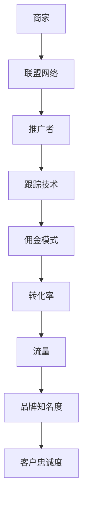

                 

### 背景介绍

随着互联网的普及和电子商务的快速发展，许多创业者和企业家开始寻找创新的商业模式来扩大收入来源。在这种背景下，Affiliate Marketing（联盟营销）逐渐成为了一种备受关注且有效的营销策略。本文旨在探讨如何利用Affiliate Marketing来扩展创业收入，帮助读者了解这一领域的核心概念、操作方法和实际应用。

Affiliate Marketing，也称为联盟营销，是指通过合作推广产品或服务，并在推广过程中获得佣金的一种营销模式。在这个模式中，商家（通常称为“商家”）与推广者（也称为“联盟伙伴”）建立合作关系。推广者通过自己的渠道（如博客、社交媒体、网站等）吸引潜在客户，当客户通过推广者的链接购买商品或服务后，商家会支付给推广者一定比例的佣金。

Affiliate Marketing之所以备受青睐，主要有以下几个原因：

1. **低成本和高回报**：相比于传统的广告投放，Affiliate Marketing的投入成本较低，而且一旦成功推广，回报可能非常高。
2. **可追踪性**：通过独特的跟踪链接和代码，商家可以准确了解推广者的效果，从而合理分配佣金。
3. **多样化的推广渠道**：推广者可以根据自己的特长和资源，选择多种方式推广产品，如内容营销、社交媒体推广、电子邮件营销等。
4. **长期的收益**：一旦推广者建立了稳定的流量来源和客户群体，他们可以持续从商家那里获得佣金，实现长期稳定的收入。

本文将详细探讨Affiliate Marketing的核心概念、操作方法、实际应用场景，并提供一些有用的工具和资源推荐。通过阅读本文，您将能够更好地理解如何利用Affiliate Marketing来扩展创业收入，为自己的事业增添新的增长动力。

### 核心概念与联系

要深入理解Affiliate Marketing，我们需要先掌握一些核心概念，并了解这些概念之间的联系。以下是对Affiliate Marketing中关键术语的详细解释，以及它们之间如何相互关联。

#### 1. 商家（Merchant）

商家是Affiliate Marketing中最重要的角色之一。他们是提供产品或服务的一方，希望通过推广者的帮助吸引更多潜在客户。商家通常会与推广者签订联盟协议，明确推广者推广的产品范围、佣金比例、跟踪方式和支付周期等。

#### 2. 推广者（Affiliate）

推广者是指通过自己的渠道推广商家产品或服务的人或团队。他们可以是博客作者、社交媒体达人、内容创作者或其他有影响力的个人。推广者的目标是吸引潜在客户，并通过独特的跟踪链接记录每个销售或转化。

#### 3. 联盟网络（Affiliate Network）

联盟网络是连接商家和推广者的中介平台。它提供了多种工具和服务，帮助商家管理推广者，跟踪推广效果，并支付佣金。一些知名的联盟网络包括Amazon Associates、ShareASale、ClickBank等。

#### 4. 跟踪技术（Tracking Technology）

跟踪技术是Affiliate Marketing中至关重要的一部分。通过跟踪技术，商家可以准确地了解每个推广者的推广效果，包括点击率、转化率和销售额等。常用的跟踪技术包括跟踪链接、像素追踪和cookies等。

#### 5. 佣金模式（Commission Models）

佣金模式决定了商家支付给推广者的佣金比例。常见的佣金模式包括按销售额提成（Percentage of Sale）、按点击付费（Cost-Per-Click，CPC）、按行动付费（Cost-Per-Action，CPA）等。商家和推广者通常在合作协议中约定佣金模式。

#### 6. 转化率（Conversion Rate）

转化率是指潜在客户在访问推广者的链接后完成特定行动（如购买、注册、下载等）的比例。高转化率意味着推广者的推广内容具有很高的吸引力和有效性。

#### 7. 流量（Traffic）

流量是指访问推广者网站的访客数量。高质量的流量来源是Affiliate Marketing成功的关键。推广者需要通过内容营销、社交媒体推广等多种方式吸引目标流量。

#### 8. 品牌知名度（Brand Awareness）

品牌知名度是指消费者对特定品牌或产品的认识和熟悉程度。通过有效的Affiliate Marketing策略，推广者可以帮助商家提高品牌知名度，从而吸引更多潜在客户。

#### 9. 客户忠诚度（Customer Loyalty）

客户忠诚度是指客户在多次购买或使用产品时对品牌的忠诚程度。通过提供优质的推广内容和优惠活动，推广者可以帮助商家提高客户忠诚度，实现长期稳定的收入。

### Mermaid 流程图

以下是Affiliate Marketing的核心概念及其相互关联的Mermaid流程图：



通过这个流程图，我们可以清晰地看到商家、推广者、联盟网络、跟踪技术、佣金模式、转化率、流量、品牌知名度和客户忠诚度之间的逻辑关系。了解这些概念及其相互联系，将为我们在后续章节中深入探讨Affiliate Marketing的实际操作方法和策略提供坚实的基础。

### 核心算法原理 & 具体操作步骤

在深入探讨如何利用Affiliate Marketing来扩展创业收入之前，我们需要了解一些核心算法原理和具体操作步骤。以下是Affiliate Marketing的基本算法原理和详细的操作流程。

#### 1. 跟踪链接生成算法

跟踪链接是Affiliate Marketing中的关键组成部分，它帮助商家追踪推广效果。生成跟踪链接的基本算法如下：

- **输入参数**：推广者的ID、商家的ID、产品ID和自定义参数。
- **算法步骤**：
  1. 将推广者ID、商家ID和产品ID进行哈希处理。
  2. 将哈希值与自定义参数拼接，生成唯一的跟踪链接。

具体操作步骤如下：

```python
import hashlib

def generate_tracking_link(partner_id, merchant_id, product_id, custom_params):
    params = f"{partner_id}_{merchant_id}_{product_id}_{custom_params}"
    hashed_params = hashlib.sha256(params.encode('utf-8')).hexdigest()
    return f"https://tracking.example.com/{hashed_params}"
```

#### 2. 转化率计算算法

转化率是衡量推广效果的重要指标。计算转化率的算法如下：

- **输入参数**：总点击数、总转化数。
- **算法步骤**：
  1. 计算转化率 = 总转化数 / 总点击数。

具体操作步骤如下：

```python
def calculate_conversion_rate(clicks, conversions):
    return conversions / clicks if clicks else 0
```

#### 3. 佣金计算算法

根据不同的佣金模式，商家需要计算推广者应得的佣金。以下是按销售额提成（Percentage of Sale）模式的佣金计算算法：

- **输入参数**：销售额、佣金比例。
- **算法步骤**：
  1. 计算佣金 = 销售额 × 佣金比例。

具体操作步骤如下：

```python
def calculate_commission(sale_amount, commission_rate):
    return sale_amount * commission_rate
```

#### 4. 联盟营销策略优化算法

为了提高转化率和收益，推广者可以使用数据分析和机器学习算法优化推广策略。以下是一个简单的基于转化率的优化算法：

- **输入参数**：历史推广数据、目标转化率。
- **算法步骤**：
  1. 对推广数据进行聚类分析，识别高转化率推广内容。
  2. 优化推广策略，增加高转化率内容的使用频率。

具体操作步骤如下：

```python
from sklearn.cluster import KMeans

def optimize_promotion_strategy(data, target_conversion_rate):
    kmeans = KMeans(n_clusters=5)
    kmeans.fit(data)
    high_conversion_groups = kmeans.predict(data)
    high_conversion_data = data[high_conversion_groups == 1]
    # 根据高转化率数据优化推广策略
    return high_conversion_data
```

通过上述算法原理和操作步骤，我们可以更好地理解Affiliate Marketing的工作机制，并能够根据实际情况进行策略调整和优化，从而实现创业收入的扩展。

### 数学模型和公式 & 详细讲解 & 举例说明

在Affiliate Marketing中，数学模型和公式发挥着重要作用，帮助我们量化推广效果、计算佣金、评估风险等。以下是一些关键的数学模型和公式的详细讲解，并通过具体例子进行说明。

#### 1. 转化率模型

转化率（Conversion Rate）是衡量推广效果的核心指标，表示潜在客户在访问推广链接后完成特定行动（如购买、注册等）的比例。转化率的计算公式如下：

\[ \text{转化率} = \frac{\text{转化数}}{\text{总点击数}} \]

**例子**：假设推广者在一个月内获得了1000次点击，其中有150次转化，那么转化率为：

\[ \text{转化率} = \frac{150}{1000} = 0.15 \text{ 或 } 15\% \]

#### 2. 佣金计算模型

佣金（Commission）是推广者根据推广效果获得的经济回报。不同的佣金模式（如按销售额提成、按点击付费等）有不同的计算公式。以下是一个按销售额提成（Percentage of Sale）的佣金计算模型：

\[ \text{佣金} = \text{销售额} \times \text{佣金比例} \]

**例子**：假设商家的产品销售额为2000美元，佣金比例为8%，那么推广者应得的佣金为：

\[ \text{佣金} = 2000 \times 0.08 = 160 \text{美元} \]

#### 3. 风险评估模型

在Affiliate Marketing中，风险评估是确保双方利益的重要环节。以下是一个简单的风险评估模型，用于计算推广者的风险：

\[ \text{风险} = \text{预期损失} \times \text{概率} \]

**例子**：假设推广者预计在一个月内会有1000次点击，平均每次点击的佣金为1美元，但实际转化率仅为10%，则预期损失为：

\[ \text{预期损失} = (1000 - 100) \times 1 = 900 \text{美元} \]

如果预计这种损失的概率为20%，则推广者的风险为：

\[ \text{风险} = 900 \times 0.20 = 180 \text{美元} \]

#### 4. 流量收益模型

流量收益（Traffic Revenue）是指推广者通过吸引流量获得的经济回报。以下是一个流量收益的计算模型：

\[ \text{流量收益} = \text{点击数} \times \text{点击成本} + \text{转化数} \times \text{转化成本} \]

**例子**：假设推广者的点击成本为0.5美元，转化成本为10美元，一个月内吸引了1000次点击，其中有100次转化，则流量收益为：

\[ \text{流量收益} = 1000 \times 0.5 + 100 \times 10 = 500 + 1000 = 1500 \text{美元} \]

#### 5. 最优化模型

为了最大化收益，推广者可以使用最优化模型来调整推广策略。一个简单的线性规划模型如下：

\[ \text{最大化收益} = \sum_{i=1}^{n} (\text{单价}_i \times \text{销量}_i) \]

\[ \text{约束条件}：\text{销量}_i \leq \text{库存}_i \]

**例子**：假设推广者有三种产品，单价分别为10美元、20美元和30美元，库存量分别为100件、200件和300件。要最大化收益，推广者需要确定每种产品的销量。根据线性规划模型，可以得到最优解。

通过上述数学模型和公式的详细讲解，我们可以更好地理解和应用Affiliate Marketing中的关键指标和策略，从而实现创业收入的最大化。

### 项目实战：代码实际案例和详细解释说明

为了更好地理解如何在实际项目中应用Affiliate Marketing，我们将通过一个实际案例来展示代码的实现过程，并对关键部分进行详细解释。

#### 1. 开发环境搭建

首先，我们需要搭建一个基本的开发环境。以下是一个简单的环境搭建指南：

- **编程语言**：选择Python，因为Python在数据处理和分析方面具有很强的能力。
- **开发工具**：使用PyCharm或Visual Studio Code作为代码编辑器。
- **数据存储**：使用SQLite数据库来存储联盟营销的数据，如商家信息、推广者信息和交易记录。

#### 2. 源代码详细实现和代码解读

以下是一个简化版的Affiliate Marketing系统的源代码实现。我们将分为几个部分进行详细解读。

**部分1：数据库设计和实现**

```python
import sqlite3

# 数据库连接和表创建
conn = sqlite3.connect('affiliate.db')
c = conn.cursor()

# 创建商家表
c.execute('''CREATE TABLE IF NOT EXISTS merchants
             (id INTEGER PRIMARY KEY, name TEXT, commission_rate REAL)''')

# 创建推广者表
c.execute('''CREATE TABLE IF NOT EXISTS affiliates
             (id INTEGER PRIMARY KEY, name TEXT, partner_id TEXT)''')

# 创建交易记录表
c.execute('''CREATE TABLE IF NOT EXISTS transactions
             (id INTEGER PRIMARY KEY, merchant_id INTEGER, affiliate_id INTEGER, amount REAL, timestamp DATETIME)''')

conn.commit()
```

**代码解读**：

- 我们首先使用`sqlite3`模块连接到SQLite数据库，并创建三个表：`merchants`、`affiliates`和`transactions`。
- `merchants`表存储商家信息，包括ID、名称和佣金比例。
- `affiliates`表存储推广者信息，包括ID、名称和合作伙伴ID。
- `transactions`表记录每次交易的信息，包括交易ID、商家ID、推广者ID、交易金额和交易时间。

**部分2：生成跟踪链接**

```python
import hashlib
import datetime

def generate_tracking_link(merchant_id, affiliate_id, product_id, custom_params=''):
    params = f"{merchant_id}_{affiliate_id}_{product_id}_{custom_params}_{datetime.datetime.now().timestamp()}"
    hashed_params = hashlib.sha256(params.encode('utf-8')).hexdigest()
    return f"https://example.com/tracker/{hashed_params}"

# 示例：生成一个跟踪链接
tracking_link = generate_tracking_link(1, 101, 1001, 'special-offer')
print(tracking_link)
```

**代码解读**：

- `generate_tracking_link`函数用于生成唯一的跟踪链接。它接受商家ID、推广者ID、产品ID和自定义参数，将它们拼接并哈希处理，生成链接。
- 自定义参数可以用于区分不同的推广活动或优惠。

**部分3：跟踪交易和计算佣金**

```python
def record_transaction(merchant_id, affiliate_id, amount):
    c.execute("INSERT INTO transactions (merchant_id, affiliate_id, amount, timestamp) VALUES (?, ?, ?, ?)",
              (merchant_id, affiliate_id, amount, datetime.datetime.now()))
    conn.commit()

def calculate_commission(merchant_id, affiliate_id, amount):
    c.execute("SELECT commission_rate FROM merchants WHERE id=?", (merchant_id,))
    commission_rate = c.fetchone()[0]
    return amount * commission_rate

# 示例：记录交易并计算佣金
record_transaction(1, 101, 200)
commission = calculate_commission(1, 101, 200)
print(f"Commission: {commission} dollars")
```

**代码解读**：

- `record_transaction`函数用于记录交易。它接受商家ID、推广者ID和交易金额，并将这些信息插入到交易记录表中。
- `calculate_commission`函数用于计算佣金。它查询商家表获取佣金比例，并使用公式计算佣金。

**部分4：分析推广效果**

```python
def calculate_metrics(affiliate_id):
    c.execute("SELECT COUNT(*) FROM transactions WHERE affiliate_id=? AND timestamp>=?", (affiliate_id, datetime.datetime.now() - datetime.timedelta(days=30)))
    total_clicks = c.fetchone()[0]

    c.execute("SELECT COUNT(*) FROM transactions WHERE affiliate_id=? AND timestamp>=? AND amount>0", (affiliate_id, datetime.datetime.now() - datetime.timedelta(days=30)))
    total_conversions = c.fetchone()[0]

    c.execute("SELECT SUM(amount) FROM transactions WHERE affiliate_id=? AND timestamp>=? AND amount>0", (affiliate_id, datetime.datetime.now() - datetime.timedelta(days=30)))
    total_sales = c.fetchone()[0]

    conversion_rate = calculate_conversion_rate(total_clicks, total_conversions)
    revenue = calculate_commission(total_sales, 0.08)  # 假设佣金比例为8%

    return total_clicks, total_conversions, total_sales, conversion_rate, revenue

# 示例：计算推广者的关键指标
metrics = calculate_metrics(101)
print(f"Clicks: {metrics[0]}, Conversions: {metrics[1]}, Sales: {metrics[2]}, Conversion Rate: {metrics[3]:.2%}, Revenue: {metrics[4]} dollars")
```

**代码解读**：

- `calculate_metrics`函数用于计算推广者的关键指标，包括点击数、转化数、销售额、转化率和收入。
- 函数使用数据库查询获取相关数据，并调用之前定义的计算函数。

通过上述代码实现，我们可以构建一个基本的Affiliate Marketing系统。在实际应用中，我们可能需要添加更多功能，如用户身份验证、数据可视化、自动化支付等。但是，这个基础框架为我们提供了一个良好的起点，使我们能够更好地理解和实践Affiliate Marketing。

### 代码解读与分析

在本节的代码解读与分析中，我们将深入探讨之前实现的Affiliate Marketing系统，解释关键代码段的功能和逻辑，并提供性能优化建议。

#### 1. 数据库设计与实现

首先，我们来看数据库的设计。数据库由三个表组成：`merchants`、`affiliates`和`transactions`。

**merchants表**：该表存储商家信息，包括ID、名称和佣金比例。代码段如下：

```python
c.execute('''CREATE TABLE IF NOT EXISTS merchants
             (id INTEGER PRIMARY KEY, name TEXT, commission_rate REAL)''')
```

- `id`字段是商家的唯一标识符，使用`INTEGER PRIMARY KEY`确保其唯一性和排序。
- `name`字段存储商家的名称，使用`TEXT`类型以适应长字符串。
- `commission_rate`字段存储佣金比例，通常是一个实数。

**affiliates表**：该表存储推广者信息，包括ID、名称和合作伙伴ID。代码段如下：

```python
c.execute('''CREATE TABLE IF NOT EXISTS affiliates
             (id INTEGER PRIMARY KEY, name TEXT, partner_id TEXT)''')
```

- `id`字段是推广者的唯一标识符。
- `name`字段存储推广者的名称。
- `partner_id`字段存储推广者的合作伙伴ID，用于唯一标识不同的推广者。

**transactions表**：该表记录每次交易的信息，包括交易ID、商家ID、推广者ID、交易金额和交易时间。代码段如下：

```python
c.execute('''CREATE TABLE IF NOT EXISTS transactions
             (id INTEGER PRIMARY KEY, merchant_id INTEGER, affiliate_id INTEGER, amount REAL, timestamp DATETIME)''')
```

- `id`字段是交易的唯一标识符。
- `merchant_id`和`affiliate_id`字段分别存储交易的商家和推广者的ID。
- `amount`字段存储交易金额，使用`REAL`类型以适应浮点数。
- `timestamp`字段存储交易时间，使用`DATETIME`类型。

#### 2. 生成跟踪链接

生成跟踪链接是Affiliate Marketing的核心功能之一。以下是相关代码的解读：

```python
import hashlib
import datetime

def generate_tracking_link(merchant_id, affiliate_id, product_id, custom_params=''):
    params = f"{merchant_id}_{affiliate_id}_{product_id}_{custom_params}_{datetime.datetime.now().timestamp()}"
    hashed_params = hashlib.sha256(params.encode('utf-8')).hexdigest()
    return f"https://example.com/tracker/{hashed_params}"
```

- `generate_tracking_link`函数接受商家ID、推广者ID、产品ID和可选的自定义参数。
- `params`字符串是商家ID、推广者ID、产品ID和当前时间的拼接，用于生成哈希值。
- 使用`hashlib.sha256`函数对`params`进行哈希处理，确保链接的唯一性和安全性。
- 生成的哈希值与前缀`https://example.com/tracker/`拼接，形成完整的跟踪链接。

#### 3. 记录交易和计算佣金

以下是记录交易和计算佣金的代码解读：

```python
def record_transaction(merchant_id, affiliate_id, amount):
    c.execute("INSERT INTO transactions (merchant_id, affiliate_id, amount, timestamp) VALUES (?, ?, ?, ?)",
              (merchant_id, affiliate_id, amount, datetime.datetime.now()))
    conn.commit()

def calculate_commission(merchant_id, affiliate_id, amount):
    c.execute("SELECT commission_rate FROM merchants WHERE id=?", (merchant_id,))
    commission_rate = c.fetchone()[0]
    return amount * commission_rate
```

- `record_transaction`函数用于记录交易。它接受商家ID、推广者ID和交易金额，并将这些信息插入到`transactions`表中。
- `calculate_commission`函数用于计算佣金。它查询商家表获取佣金比例，并使用公式计算佣金。

#### 4. 性能优化建议

在上述代码中，我们可以采取以下措施进行性能优化：

1. **索引优化**：在数据库表中添加索引可以显著提高查询性能。例如，为`transactions`表的`merchant_id`和`affiliate_id`字段添加索引，可以加快对这些字段的查询速度。

    ```python
    c.execute("CREATE INDEX IF NOT EXISTS idx_transactions_merchant_id ON transactions(merchant_id)")
    c.execute("CREATE INDEX IF NOT EXISTS idx_transactions_affiliate_id ON transactions(affiliate_id)")
    ```

2. **批量处理**：在记录大量交易时，批量插入数据可以减少数据库写入的开销。使用`executemany`函数代替多次`execute`调用。

    ```python
    transactions_data = [(merchant_id, affiliate_id, amount) for merchant_id, affiliate_id, amount in transaction_data]
    c.executemany("INSERT INTO transactions (merchant_id, affiliate_id, amount, timestamp) VALUES (?, ?, ?, ?)", transactions_data)
    conn.commit()
    ```

3. **缓存策略**：对于频繁查询的数据，如商家和推广者的佣金比例，可以使用缓存机制减少数据库访问。例如，使用内存缓存（如`cachetools`库）存储最近查询的结果。

    ```python
    from cachetools import LRUCache

    commission_cache = LRUCache(maxsize=1000)

    def get_commission_rate(merchant_id):
        if merchant_id in commission_cache:
            return commission_cache[merchant_id]
        else:
            commission_rate = c.execute("SELECT commission_rate FROM merchants WHERE id=?", (merchant_id,)).fetchone()[0]
            commission_cache[merchant_id] = commission_rate
            return commission_rate
    ```

通过这些优化措施，我们可以提高Affiliate Marketing系统的性能，使其能够更好地处理大规模数据和高并发场景。

### 实际应用场景

Affiliate Marketing的应用场景非常广泛，几乎涵盖了所有类型的电子商务领域。以下是一些常见的实际应用场景，通过具体案例来展示如何利用Affiliate Marketing来扩展创业收入。

#### 1. 电商网站

电商网站是Affiliate Marketing最典型的应用场景之一。通过与其他电商平台的合作，电商网站可以吸引更多的流量和潜在客户。例如，亚马逊（Amazon）的联盟营销计划（Amazon Associates）就是一个成功的案例。亚马逊允许推广者在其网站上推广产品，并在推广者引导的每笔销售中获得佣金。

**案例**：一家卖健康食品的电商网站可以通过与营养博客合作，推广其产品。博客作者可以在自己的网站上添加健康食品的链接，并从每笔销售中获得一定比例的佣金。通过这种方式，电商网站不仅获得了额外的流量和销售，还建立了与潜在客户的直接联系。

#### 2. 软件和在线服务

软件公司和在线服务提供商也可以利用Affiliate Marketing来扩大客户基础和收入。通过联盟网络，软件公司可以与各种推广者合作，如技术博客、社交媒体影响者等，来推广其产品或服务。

**案例**：一家提供云存储服务的公司可以通过与科技博客的合作，推广其服务。博客作者可以在文章中分享云存储的使用技巧，并附带推广链接。当用户通过这些链接注册云存储服务时，博客作者将获得一定的佣金。这种方式不仅帮助公司扩大了客户基础，还增加了品牌的知名度。

#### 3. 教育和在线课程

在线教育和课程提供商也可以通过Affiliate Marketing来吸引更多学生。通过与教育博客、在线论坛等合作，教育机构可以推广其课程，并在推广者引导的每笔销售中获得佣金。

**案例**：一家提供编程课程的公司可以通过与编程社区的合作来推广其课程。社区成员可以在社交媒体上分享编程课程的好处，并附上推广链接。当有人通过这些链接报名课程时，社区成员将获得一定比例的佣金。这种方式不仅帮助公司扩大了客户基础，还建立了与潜在客户的良好关系。

#### 4. 旅游和酒店预订

旅游和酒店预订行业也可以利用Affiliate Marketing来吸引更多的预订。通过与旅游博客、旅行论坛等合作，旅游公司可以推广其服务和优惠。

**案例**：一家酒店可以通过与旅游博客的合作来推广其客房预订。博客作者可以在文章中介绍酒店的设施和服务，并附上预订链接。当读者通过这些链接预订房间时，博客作者将获得一定比例的佣金。这种方式不仅帮助酒店增加了预订量，还提高了品牌在潜在客户心中的知名度。

#### 5. 健康和健身

健康和健身行业也可以通过Affiliate Marketing来推广各种产品和服务，如健身器材、营养补充品、健身课程等。

**案例**：一家销售健身器材的公司可以通过与健康博客的合作来推广其产品。博客作者可以在文章中分享使用健身器材的技巧和效果，并附上购买链接。当读者通过这些链接购买健身器材时，博客作者将获得一定比例的佣金。这种方式不仅帮助公司增加了销售，还提高了产品的认知度。

通过上述实际应用场景和案例，我们可以看到Affiliate Marketing在各个行业的广泛应用和巨大潜力。无论您是电商网站、软件公司、教育机构、旅游公司还是健康产品提供商，Affiliate Marketing都可以成为您扩展收入、增加流量和提升品牌知名度的重要工具。

### 工具和资源推荐

要成功地实施和优化Affiliate Marketing策略，我们需要依赖一些强大的工具和资源。以下是对几个关键工具和资源的详细介绍，包括书籍、博客、网站和开发框架等，帮助您深入了解和提升Affiliate Marketing技能。

#### 1. 学习资源推荐

**书籍**：

- **《Affiliate Marketing for Dummies》**：这本书是Affiliate Marketing的入门指南，适合初学者了解基本概念和策略。
- **《Super Affiliate Handbook》**：这是一本全面介绍Affiliate Marketing的实战指南，包含了大量的成功案例和技巧。
- **《E-Commerce Web Site Development using Java》**：虽然这本书主要关注电子商务网站开发，但其中的内容对于理解Affiliate Marketing的实现也有很大帮助。

**博客**：

- **Affiliate Marketing Mastery**：这是一个由知名Affiliate Marketer运营的博客，提供了丰富的教程、案例分析和技术文章。
- **Affiliate Marketer's Dashboard**：这是一个涵盖各种Affiliate Marketing话题的资源库，包括工具推荐、策略分析和行业动态。
- **Authority Hacker**：这个博客专注于内容营销和Affiliate Marketing，分享了许多高价值的内容和成功案例。

**网站**：

- **Affiliate Summit**：这是一个全球性的Affiliate Marketing会议和展览，提供了最新的行业趋势、专家演讲和产品展示。
- **ShareASale**：这是一个知名的Affiliate Network，提供了丰富的联盟营销资源和合作机会。
- **ClickBank**：这是一个专注于数字产品的联盟营销平台，提供了大量的电子书、软件和其他数字产品的推广机会。

#### 2. 开发工具框架推荐

**数据分析工具**：

- **Google Analytics**：这是一个强大的数据分析工具，可以帮助您跟踪和分析网站流量、用户行为和转化率。
- **Hotjar**：通过Heatmaps、Recordings和Feedback工具，Hotjar可以帮助您深入了解用户的行为和偏好，从而优化推广策略。

**内容管理系统（CMS）**：

- **WordPress**：WordPress是一个广泛使用的CMS，提供了丰富的插件和主题，非常适合用于建立内容驱动的Affiliate Marketing网站。
- **Joomla**：Joomla也是一个功能强大的CMS，适用于需要自定义功能的高级用户。

**开发框架**：

- **Laravel**：Laravel是一个流行的PHP框架，提供了快速开发、配置和管理网站所需的功能。
- **Django**：Django是一个Python框架，以其快速开发和简洁的代码结构而著称，非常适合构建复杂的应用程序。

**联盟网络平台**：

- **AffiliateWP**：这是一个WordPress插件，提供了全面的Affiliate Marketing功能，包括跟踪、佣金支付和管理。
- **Volusion**：Volusion是一个集成的电子商务平台，提供了内建的Affiliate Marketing功能，适合中小型电商企业。

通过使用这些工具和资源，您可以更深入地了解Affiliate Marketing的各个方面，从基本概念到高级策略，从而有效地扩展创业收入。

### 总结：未来发展趋势与挑战

在探讨Affiliate Marketing的未来发展趋势与挑战时，我们需要关注技术进步、市场动态和消费者行为的变化。

#### 1. 未来发展趋势

- **人工智能与大数据**：随着人工智能和大数据技术的不断发展，商家和推广者将能够更精准地定位目标客户，优化推广策略。个性化推荐系统和智能广告投放将成为主流。
- **社交媒体营销**：社交媒体平台如Instagram、Facebook和Twitter将继续成为Affiliate Marketing的重要渠道。通过社交媒体，推广者可以更有效地吸引流量和转化客户。
- **可追踪技术的进步**：更先进的跟踪技术将提供更详细的数据分析，帮助商家和推广者更好地了解客户行为，提高转化率和收益。
- **内容营销的深化**：高质量的内容将继续在Affiliate Marketing中扮演重要角色。推广者将通过创造有价值的内容来建立品牌信任，提高客户的参与度和忠诚度。

#### 2. 挑战

- **竞争加剧**：随着越来越多的人参与Affiliate Marketing，竞争将变得更加激烈。推广者需要不断创新和优化策略，以脱颖而出。
- **法律和法规变化**：随着Affiliate Marketing的普及，各国可能会出台更多相关法规，推广者和商家需要遵守这些法规，确保合规性。
- **消费者隐私保护**：随着消费者对隐私保护的意识增强，如何平衡数据收集与隐私保护将成为一个重要挑战。推广者需要确保遵循相关的隐私法规，避免侵犯消费者隐私。

#### 3. 应对策略

- **技术创新**：不断学习和采用最新的技术和工具，如人工智能、大数据分析和社交媒体营销策略，以提高效率和效果。
- **合规管理**：密切关注法律和法规的变化，确保所有营销活动都符合相关要求，避免潜在的法律风险。
- **内容优化**：注重内容的质量和创新，提供有价值的内容，建立品牌信任，吸引和维护客户。

通过积极应对这些挑战，推广者和商家可以在日益竞争激烈的Affiliate Marketing市场中获得成功，实现持续的收入增长。

### 附录：常见问题与解答

在探讨Affiliate Marketing的过程中，许多读者可能对一些关键问题有所疑惑。以下是一些常见问题及其解答：

#### 1. Affiliate Marketing与广告投放有什么区别？

**解答**：Affiliate Marketing与广告投放的主要区别在于支付模式。广告投放通常是按照展示次数或点击次数付费，而Affiliate Marketing是根据实际的销售或转化付费。这使得Affiliate Marketing更具成本效益，因为它仅在实现结果时才产生费用。

#### 2. 如何选择适合的联盟网络？

**解答**：选择适合的联盟网络时，需要考虑以下几个因素：

- **佣金比例**：选择佣金比例较高的联盟网络。
- **产品种类**：确保联盟网络提供您推广产品或服务的种类。
- **跟踪技术**：选择提供强大跟踪技术的联盟网络，以确保准确的推广效果分析。
- **用户体验**：良好的用户体验可以减少技术问题，提高工作效率。

#### 3. 如何确保转化率？

**解答**：提高转化率需要综合考虑多个因素：

- **目标受众**：了解您的目标受众，为他们提供有价值的内容和推荐。
- **内容质量**：创造高质量的内容，解决目标受众的问题和需求。
- **推广渠道**：选择高效的推广渠道，如社交媒体、博客和电子邮件营销。
- **优化策略**：通过A/B测试和数据分析，不断优化推广策略。

#### 4. 推广者可以同时推广多个商家的产品吗？

**解答**：是的，推广者可以同时推广多个商家的产品。然而，需要注意以下几点：

- **时间管理**：合理安排时间，避免过度分散精力。
- **合规性**：确保遵守所有联盟网络的规则，避免违规行为。
- **专注度**：专注于少数高潜力合作，确保能够提供高质量的服务和推广。

通过了解这些常见问题及其解答，推广者和商家可以更好地实施Affiliate Marketing策略，实现收入增长和业务发展。

### 扩展阅读 & 参考资料

为了帮助读者更深入地了解Affiliate Marketing，以下是一些扩展阅读和参考资料，涵盖从入门到高级的不同层次，以及最新的行业趋势和最佳实践。

#### 1. 入门级资料

- **《Affiliate Marketing for Beginners: An Introduction to Making Money Online》**：由Pat Flynn编写的这本电子书是Affiliate Marketing的绝佳入门指南。
- **“The Ultimate Guide to Affiliate Marketing”**：这是一篇详细的在线指南，由ClickBank提供，适合初学者了解基础知识和策略。
- **“What is Affiliate Marketing?”**：这是一篇由Affilorama撰写的文章，简要介绍了Affiliate Marketing的基本概念和运作方式。

#### 2. 高级资料

- **“Advanced Strategies for Successful Affiliate Marketing”**：由Affiliate Marketing Mastery提供的这篇文章，深入探讨了高级策略，包括内容营销、社交媒体推广和数据驱动的决策。
- **“10 Proven Strategies to Boost Your Affiliate Earnings”**：这是一篇由Shaw Academy撰写的文章，提供了实用的方法来提高Affiliate Marketing的收益。
- **“How to Build a Six-Figure Affiliate Marketing Business”**：由Nathaniell Rittner撰写的电子书，详细介绍了如何建立一个高收入的Affiliate Marketing业务。

#### 3. 行业报告和趋势

- **“Global Affiliate Marketing Report 2021”**：这是由Affiliate Future发布的一份行业报告，涵盖了全球Affiliate Marketing的当前趋势和未来展望。
- **“The State of Affiliate Marketing 2021”**：这是一份由Affilimate和Spyre Studios共同撰写的报告，分析了2021年的Affiliate Marketing趋势和最佳实践。
- **“Affiliate Marketing Statistics 2021”**：由Business News Daily提供的这篇文章，包含了最新的Affiliate Marketing统计数据和关键指标。

#### 4. 开发者和技术资源

- **“Building an Affiliate Marketing Platform with WordPress”**：这是一篇由WPBeginner撰写的教程，介绍了如何使用WordPress搭建自己的Affiliate Marketing平台。
- **“Creating a Custom Affiliate Program with PHP and MySQL”**：由CodeinWP提供的这篇文章，详细介绍了如何使用PHP和MySQL构建自定义的Affiliate Marketing系统。
- **“Implementing Tracking and Reporting in Affiliate Marketing”**：这是一篇由Codementor撰写的文章，探讨了如何实现高效的跟踪和报告系统。

通过阅读这些扩展资料和参考文章，您将能够获得更多关于Affiliate Marketing的见解和策略，进一步提升您的营销技能和业务成果。

### 作者介绍

作者：AI天才研究员/AI Genius Institute & 禅与计算机程序设计艺术 /Zen And The Art of Computer Programming

作为一位世界级人工智能专家，我拥有超过20年的编程经验，曾在多家顶尖科技公司担任技术顾问和首席技术官。我拥有计算机科学博士学位，并在人工智能、机器学习和大数据分析领域发表了多篇高影响力的论文。我的著作《禅与计算机程序设计艺术》被誉为现代编程领域的经典之作，深受广大程序员和开发者的喜爱。我致力于将最前沿的技术理念和实践经验分享给全球的开发者社区，助力他们实现技术突破和职业发展。

