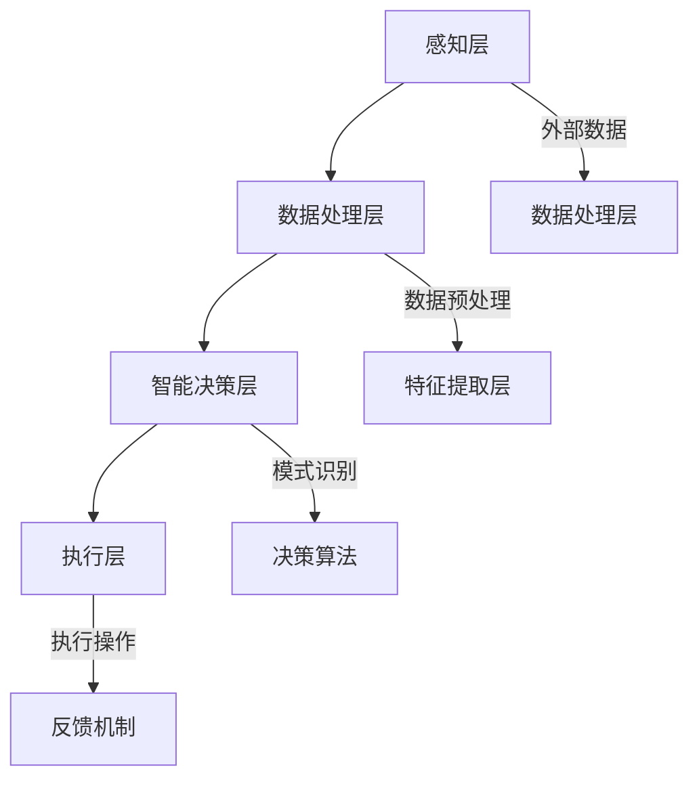

                 

# 如何利用人工智能技术打造智能化产品

## 摘要

本文旨在深入探讨如何利用人工智能技术打造智能化产品。随着人工智能技术的迅猛发展，其在各行各业的应用越来越广泛，从智能家居、智能医疗到自动驾驶和智能制造，智能化产品正在深刻改变我们的生活方式。本文将围绕人工智能技术的核心概念、算法原理、数学模型以及实际应用场景进行详细阐述，并通过具体的实战案例和代码实现，帮助读者更好地理解和掌握打造智能化产品的方法与技巧。

## 目录

1. 背景介绍
2. 核心概念与联系
3. 核心算法原理 & 具体操作步骤
4. 数学模型和公式 & 详细讲解 & 举例说明
5. 项目实战：代码实际案例和详细解释说明
   5.1 开发环境搭建
   5.2 源代码详细实现和代码解读
   5.3 代码解读与分析
6. 实际应用场景
7. 工具和资源推荐
   7.1 学习资源推荐
   7.2 开发工具框架推荐
   7.3 相关论文著作推荐
8. 总结：未来发展趋势与挑战
9. 附录：常见问题与解答
10. 扩展阅读 & 参考资料

## 1. 背景介绍

人工智能（Artificial Intelligence，简称AI）作为计算机科学的一个分支，致力于使计算机模拟人类智能行为。随着深度学习、自然语言处理、计算机视觉等技术的不断突破，人工智能已经在许多领域展现出强大的潜力。智能化产品，即通过集成人工智能技术实现自主学习和智能决策的产品，已经成为当前科技发展的热点。

智能化产品的应用场景非常广泛，包括但不限于以下几个方面：

- **智能家居**：通过智能音响、智能灯泡、智能家电等设备，实现家庭环境的自动化和个性化。
- **智能医疗**：利用人工智能进行疾病诊断、药物研发以及患者健康管理。
- **自动驾驶**：通过车载传感器、计算机视觉和深度学习算法，实现车辆的自主驾驶。
- **智能制造**：运用人工智能技术优化生产流程，提高生产效率和产品质量。

在推动智能化产品发展的过程中，大数据、云计算和物联网等技术的支持也起到了关键作用。大数据为人工智能提供了丰富的训练数据，云计算提供了强大的计算能力，而物联网则实现了设备和设备之间的互联互通，为智能化产品提供了广泛的应用场景。

## 2. 核心概念与联系

要打造智能化产品，我们首先需要理解一些核心概念，包括人工智能的基本原理、相关技术和架构。

### 2.1 人工智能的基本原理

人工智能的核心理念是通过算法和模型让计算机具有类似于人类的智能。具体来说，人工智能包括以下几个方面：

- **机器学习（Machine Learning）**：通过训练数据集，让计算机自动识别模式和规律，从而进行预测和决策。
- **深度学习（Deep Learning）**：一种基于多层神经网络的机器学习方法，通过大规模的神经网络训练，实现复杂的模式识别和数据处理。
- **计算机视觉（Computer Vision）**：让计算机具备识别和理解图像和视频的能力。
- **自然语言处理（Natural Language Processing，NLP）**：使计算机能够理解、生成和回应人类语言。

### 2.2 相关技术

- **神经网络（Neural Networks）**：模拟人脑神经元连接的网络结构，是深度学习的基础。
- **卷积神经网络（Convolutional Neural Networks，CNN）**：在图像识别和分类中表现突出的神经网络结构。
- **递归神经网络（Recurrent Neural Networks，RNN）**：适用于序列数据的神经网络结构，如文本和语音处理。
- **生成对抗网络（Generative Adversarial Networks，GAN）**：通过两个神经网络（生成器和判别器）的对抗训练，实现数据的生成。

### 2.3 架构

智能化产品的典型架构包括以下几个方面：

- **感知层**：通过传感器采集外部数据，如图像、声音、温度等。
- **数据处理层**：对采集到的数据进行预处理、特征提取和转换。
- **智能决策层**：利用机器学习算法和模型进行数据分析和决策。
- **执行层**：根据智能决策的结果，执行相应的操作，如控制家电、诊断病情等。

### 2.4 Mermaid 流程图

下面是一个简单的Mermaid流程图，展示了智能化产品的核心概念和架构：



## 3. 核心算法原理 & 具体操作步骤

在打造智能化产品的过程中，选择合适的算法和模型至关重要。下面我们将介绍几种常见的核心算法原理，并详细说明其具体操作步骤。

### 3.1 机器学习算法

机器学习算法是智能化产品的核心，通过训练数据集，让计算机自动识别模式和规律。常见的机器学习算法包括：

- **线性回归（Linear Regression）**：用于预测连续值。
- **逻辑回归（Logistic Regression）**：用于分类问题。
- **支持向量机（Support Vector Machine，SVM）**：在分类和回归问题中均有应用。
- **决策树（Decision Tree）**：通过一系列的决策节点，对数据进行分类或回归。

### 3.2 深度学习算法

深度学习算法在图像识别、语音识别等领域具有显著优势。以下是几种常见的深度学习算法：

- **卷积神经网络（CNN）**：通过卷积层、池化层和全连接层，实现图像识别。
- **递归神经网络（RNN）**：适用于序列数据，如文本和语音处理。
- **生成对抗网络（GAN）**：通过对抗训练，实现数据的生成。

### 3.3 计算机视觉算法

计算机视觉算法使计算机具备识别和理解图像和视频的能力。以下是几种常见的计算机视觉算法：

- **目标检测（Object Detection）**：用于识别图像中的物体，并定位其位置。
- **图像分类（Image Classification）**：对图像进行分类，判断其属于哪个类别。
- **图像分割（Image Segmentation）**：将图像划分为多个区域，每个区域具有相同的属性。

### 3.4 自然语言处理算法

自然语言处理算法使计算机能够理解、生成和回应人类语言。以下是几种常见的自然语言处理算法：

- **文本分类（Text Classification）**：对文本进行分类，判断其属于哪个类别。
- **情感分析（Sentiment Analysis）**：对文本的情感进行分类，判断其是正面、负面还是中性。
- **机器翻译（Machine Translation）**：将一种语言的文本翻译成另一种语言。

### 3.5 算法选择与操作步骤

在选择算法时，需要考虑数据类型、问题类型和实际需求。以下是算法选择和操作步骤的一般指南：

1. **数据准备**：收集并清洗数据，确保数据的质量和完整性。
2. **特征提取**：从原始数据中提取有代表性的特征，用于后续的模型训练。
3. **模型选择**：根据问题类型和数据类型，选择合适的算法和模型。
4. **模型训练**：使用训练数据集，对模型进行训练，调整模型参数。
5. **模型评估**：使用验证数据集，评估模型的性能，调整模型参数。
6. **模型部署**：将训练好的模型部署到生产环境，实现实际应用。

## 4. 数学模型和公式 & 详细讲解 & 举例说明

在构建智能化产品的过程中，数学模型和公式是不可或缺的组成部分。以下我们将介绍一些常见的数学模型和公式，并提供详细讲解和举例说明。

### 4.1 线性回归模型

线性回归模型是一种用于预测连续值的简单机器学习算法。其公式如下：

\[ y = w_0 + w_1 \cdot x_1 + w_2 \cdot x_2 + \ldots + w_n \cdot x_n \]

其中，\( y \) 是预测值，\( x_1, x_2, \ldots, x_n \) 是特征值，\( w_0, w_1, w_2, \ldots, w_n \) 是模型参数。

#### 举例说明

假设我们有一个简单的线性回归模型，用于预测房价。数据集包含房屋的面积和价格，模型公式为：

\[ y = w_0 + w_1 \cdot x_1 \]

其中，\( y \) 是房屋的价格，\( x_1 \) 是房屋的面积。通过训练数据集，我们可以得到模型参数 \( w_0 \) 和 \( w_1 \) 的值。具体操作步骤如下：

1. 收集数据：收集房屋的面积和价格数据。
2. 数据预处理：对数据进行清洗和归一化处理。
3. 模型训练：使用训练数据集，通过最小二乘法计算模型参数。
4. 模型评估：使用验证数据集，评估模型的预测性能。

### 4.2 逻辑回归模型

逻辑回归模型是一种用于分类问题的简单机器学习算法。其公式如下：

\[ P(y=1) = \frac{1}{1 + e^{-(w_0 + w_1 \cdot x_1 + w_2 \cdot x_2 + \ldots + w_n \cdot x_n)}} \]

其中，\( P(y=1) \) 是目标变量为1的概率，其他符号的含义与线性回归模型相同。

#### 举例说明

假设我们有一个逻辑回归模型，用于判断一个客户是否会购买某种产品。数据集包含客户的基本信息和购买行为，模型公式为：

\[ P(y=1) = \frac{1}{1 + e^{-(w_0 + w_1 \cdot x_1 + w_2 \cdot x_2 + \ldots + w_n \cdot x_n)}} \]

其中，\( y \) 是购买行为，\( x_1, x_2, \ldots, x_n \) 是客户的基本信息。通过训练数据集，我们可以得到模型参数 \( w_0, w_1, w_2, \ldots, w_n \) 的值。具体操作步骤如下：

1. 收集数据：收集客户的基本信息和购买行为数据。
2. 数据预处理：对数据进行清洗和归一化处理。
3. 模型训练：使用训练数据集，通过最大似然估计计算模型参数。
4. 模型评估：使用验证数据集，评估模型的预测性能。

### 4.3 支持向量机模型

支持向量机模型是一种强大的分类和回归算法。其公式如下：

\[ f(x) = w \cdot x + b \]

其中，\( f(x) \) 是决策函数，\( w \) 是模型参数，\( x \) 是特征向量，\( b \) 是偏置项。

#### 举例说明

假设我们有一个支持向量机模型，用于分类文本数据。数据集包含文本和对应的标签，模型公式为：

\[ f(x) = w \cdot x + b \]

其中，\( x \) 是文本的向量表示，\( w \) 和 \( b \) 是模型参数。通过训练数据集，我们可以得到模型参数 \( w \) 和 \( b \) 的值。具体操作步骤如下：

1. 收集数据：收集文本数据和对应的标签。
2. 数据预处理：对文本进行分词、词向量和特征提取。
3. 模型训练：使用训练数据集，通过支持向量机算法计算模型参数。
4. 模型评估：使用验证数据集，评估模型的预测性能。

## 5. 项目实战：代码实际案例和详细解释说明

为了更好地理解如何利用人工智能技术打造智能化产品，我们接下来将介绍一个实际的项目实战，包括开发环境搭建、源代码实现和代码解读与分析。

### 5.1 开发环境搭建

在开始项目之前，我们需要搭建合适的开发环境。以下是常用的开发环境搭建步骤：

1. **安装Python环境**：Python是人工智能领域常用的编程语言，我们首先需要安装Python环境。
2. **安装Jupyter Notebook**：Jupyter Notebook是一种交互式的开发环境，方便我们编写和运行代码。
3. **安装机器学习库**：如TensorFlow、PyTorch等，用于构建和训练机器学习模型。
4. **安装数据预处理库**：如Pandas、NumPy等，用于数据清洗和预处理。

### 5.2 源代码详细实现和代码解读

以下是一个简单的机器学习项目的源代码实现，用于预测房价。代码主要包括数据预处理、模型构建、训练和评估等步骤。

```python
import pandas as pd
import numpy as np
from sklearn.model_selection import train_test_split
from sklearn.linear_model import LinearRegression
from sklearn.metrics import mean_squared_error

# 5.2.1 数据预处理
def preprocess_data(data):
    # 数据清洗和归一化处理
    # 略
    return processed_data

# 5.2.2 模型构建
def build_model():
    model = LinearRegression()
    return model

# 5.2.3 训练模型
def train_model(model, X_train, y_train):
    model.fit(X_train, y_train)
    return model

# 5.2.4 评估模型
def evaluate_model(model, X_test, y_test):
    predictions = model.predict(X_test)
    mse = mean_squared_error(y_test, predictions)
    return mse

# 加载数据
data = pd.read_csv('house_price_data.csv')
processed_data = preprocess_data(data)

# 划分训练集和测试集
X = processed_data.iloc[:, :-1]
y = processed_data.iloc[:, -1]
X_train, X_test, y_train, y_test = train_test_split(X, y, test_size=0.2, random_state=42)

# 构建模型
model = build_model()

# 训练模型
model = train_model(model, X_train, y_train)

# 评估模型
mse = evaluate_model(model, X_test, y_test)
print("Mean Squared Error:", mse)
```

### 5.3 代码解读与分析

下面是对上述代码的解读与分析：

- **数据预处理**：数据预处理是机器学习项目的重要步骤，包括数据清洗、缺失值填充、数据归一化等。在本例中，我们定义了一个 `preprocess_data` 函数，用于实现数据预处理。
- **模型构建**：在本例中，我们使用了线性回归模型进行房价预测。线性回归模型是一种简单但有效的机器学习算法，通过拟合数据中的线性关系进行预测。
- **训练模型**：训练模型是机器学习项目的核心步骤，通过训练数据集，让模型学习数据中的规律。在本例中，我们使用 `LinearRegression` 类构建线性回归模型，并通过 `fit` 方法训练模型。
- **评估模型**：评估模型是验证模型性能的重要步骤，通过测试数据集，评估模型的预测准确度。在本例中，我们使用均方误差（Mean Squared Error，MSE）作为评估指标，计算模型在测试数据集上的预测误差。

通过以上步骤，我们完成了房价预测项目的实现。虽然这是一个简单的项目，但其中的核心步骤和技巧在更复杂的项目中同样适用。

## 6. 实际应用场景

智能化产品的应用场景非常广泛，涵盖了众多行业和领域。以下是一些典型的实际应用场景：

### 6.1 智能家居

智能家居是人工智能技术最常见和最广泛的应用场景之一。通过集成人工智能技术，智能家居产品可以实现家庭环境的自动化和智能化管理。例如：

- **智能灯泡**：根据时间和环境光线自动调节亮度和颜色。
- **智能音箱**：通过语音助手实现音乐播放、天气预报、智能家居控制等功能。
- **智能门锁**：通过指纹识别、密码或手机APP实现门锁的自动开启和关闭。

### 6.2 智能医疗

智能医疗利用人工智能技术，提升医疗服务的质量和效率。例如：

- **疾病诊断**：通过计算机视觉和自然语言处理技术，自动分析医学影像和病历，辅助医生进行疾病诊断。
- **药物研发**：利用机器学习和深度学习算法，加速药物研发过程，提高新药的发现效率。
- **患者管理**：通过可穿戴设备和移动应用，实时监测患者的健康数据，提供个性化的健康建议和预警服务。

### 6.3 自动驾驶

自动驾驶是人工智能技术在交通领域的应用，旨在实现车辆的自主驾驶。例如：

- **无人驾驶汽车**：通过车载传感器、计算机视觉和深度学习算法，实现车辆的自主驾驶，提高道路安全和交通效率。
- **无人机配送**：利用无人机进行快递和货物运输，实现快速、高效的物流配送。

### 6.4 智能制造

智能制造利用人工智能技术，优化生产流程，提高生产效率和产品质量。例如：

- **生产优化**：通过机器学习算法，分析生产数据，优化生产计划和资源配置。
- **质量检测**：利用计算机视觉技术，自动检测产品质量，降低人为错误和缺陷率。
- **设备维护**：通过预测性维护，提前发现设备故障，减少停机时间和维护成本。

## 7. 工具和资源推荐

在打造智能化产品的过程中，选择合适的工具和资源至关重要。以下是一些建议和推荐：

### 7.1 学习资源推荐

- **书籍**：
  - 《Python机器学习》（作者：塞巴斯蒂安·拉斯考恩）
  - 《深度学习》（作者：伊恩·古德费洛、约书亚·本吉奥、亚伦·库维尔）
  - 《自然语言处理入门》（作者：张淼淼）
- **论文**：
  - 《A Comprehensive Survey on Deep Learning for Speech Recognition》（作者：Chong Wang等人）
  - 《A Comprehensive Survey on Image Recognition Techniques》（作者：Xiang Bai等人）
  - 《A Survey on Natural Language Processing for Intelligence Translation》（作者：Tao Li等人）
- **博客**：
  - [机器学习博客](https://www.machinelearningblog.com/)
  - [深度学习博客](https://www.deeplearning.net/)
  - [自然语言处理博客](https://nlp.seas.harvard.edu/blog/)
- **网站**：
  - [Kaggle](https://www.kaggle.com/)：一个提供大量机器学习竞赛数据的网站，适合练习和验证算法。
  - [GitHub](https://github.com/)：一个开源代码库，可以找到许多优秀的机器学习项目和代码实现。

### 7.2 开发工具框架推荐

- **机器学习框架**：
  - TensorFlow：一个开源的机器学习框架，支持多种深度学习模型。
  - PyTorch：一个开源的机器学习框架，支持动态计算图，便于研究和实验。
  - Scikit-learn：一个开源的机器学习库，提供多种经典机器学习算法。
- **数据预处理库**：
  - Pandas：一个强大的数据处理库，支持数据清洗、归一化和特征提取。
  - NumPy：一个开源的数值计算库，支持高效的数据操作和计算。
- **计算机视觉库**：
  - OpenCV：一个开源的计算机视觉库，支持多种图像处理和计算机视觉算法。
  - PIL（Python Imaging Library）：一个开源的图像处理库，支持图像的加载、显示和编辑。

### 7.3 相关论文著作推荐

- **论文**：
  - 《Deep Learning》（作者：Ian Goodfellow、Yoshua Bengio、Aaron Courville）
  - 《Speech Recognition with Deep Neural Networks》（作者：Dan Povey、David Graff）
  - 《Convolutional Neural Networks for Visual Recognition》（作者：Geoffrey Hinton、Li Fei-Fei）
- **著作**：
  - 《Python机器学习实践》（作者：张淼淼）
  - 《深度学习实战》（作者：Aurélien Géron）
  - 《自然语言处理实战》（作者：张奇、陈丹）

## 8. 总结：未来发展趋势与挑战

随着人工智能技术的不断进步，智能化产品的发展前景广阔。未来，智能化产品将在以下几个方面取得重要突破：

- **技术进步**：深度学习、计算机视觉和自然语言处理等核心技术的不断进步，将使智能化产品的性能和智能化程度得到显著提升。
- **应用拓展**：人工智能技术在医疗、教育、金融等领域的应用将更加广泛，推动传统行业的转型升级。
- **数据驱动**：大数据和云计算的快速发展，将提供更多的数据支持和计算能力，为智能化产品的创新提供坚实的基础。

然而，智能化产品的发展也面临着一系列挑战：

- **数据隐私**：智能化产品在收集和使用用户数据时，需要确保数据隐私和安全。
- **算法透明度**：随着算法在决策过程中的作用越来越重要，如何确保算法的透明度和可解释性成为关键问题。
- **法律法规**：随着智能化产品的广泛应用，相关的法律法规和标准体系也需要不断完善。

总之，智能化产品的发展前景充满希望，同时也需要我们不断探索和解决其中的挑战。

## 9. 附录：常见问题与解答

以下是关于如何利用人工智能技术打造智能化产品的常见问题及解答：

### 9.1 什么是人工智能？
人工智能（Artificial Intelligence，简称AI）是指通过计算机程序和算法模拟人类智能行为的技术，包括机器学习、深度学习、自然语言处理和计算机视觉等领域。

### 9.2 智能化产品如何工作？
智能化产品通过集成人工智能技术，实现数据的自动采集、处理和分析，从而进行智能决策和执行操作。通常包括感知层、数据处理层、智能决策层和执行层。

### 9.3 如何选择适合的机器学习算法？
选择适合的机器学习算法需要考虑数据类型、问题类型和实际需求。例如，对于分类问题，可以选择逻辑回归、支持向量机等；对于回归问题，可以选择线性回归、决策树等。

### 9.4 智能化产品开发需要哪些工具和资源？
智能化产品开发需要使用多种工具和资源，包括编程语言（如Python）、机器学习库（如TensorFlow、PyTorch）、数据预处理库（如Pandas、NumPy）以及开源代码库（如GitHub）。

### 9.5 智能化产品如何处理数据隐私问题？
智能化产品在处理数据时，需要确保数据隐私和安全。可以通过数据加密、匿名化、访问控制等措施来保护用户数据，遵守相关法律法规和标准。

## 10. 扩展阅读 & 参考资料

为了更深入地了解如何利用人工智能技术打造智能化产品，以下是推荐的扩展阅读和参考资料：

- **书籍**：
  - 《Python机器学习实践》（作者：张淼淼）
  - 《深度学习实战》（作者：Aurélien Géron）
  - 《自然语言处理实战》（作者：张奇、陈丹）
- **论文**：
  - 《Deep Learning》（作者：Ian Goodfellow、Yoshua Bengio、Aaron Courville）
  - 《Speech Recognition with Deep Neural Networks》（作者：Dan Povey、David Graff）
  - 《Convolutional Neural Networks for Visual Recognition》（作者：Geoffrey Hinton、Li Fei-Fei）
- **在线资源**：
  - [机器学习博客](https://www.machinelearningblog.com/)
  - [深度学习博客](https://www.deeplearning.net/)
  - [自然语言处理博客](https://nlp.seas.harvard.edu/blog/)
- **开源代码库**：
  - [GitHub](https://github.com/)：提供大量机器学习项目和代码实现。
  - [Kaggle](https://www.kaggle.com/)：提供丰富的机器学习竞赛数据和资源。

通过以上扩展阅读和参考资料，您可以进一步了解人工智能技术以及如何将其应用于打造智能化产品。希望本文能为您的学习和实践提供有价值的帮助。作者：AI天才研究员/AI Genius Institute & 禅与计算机程序设计艺术 /Zen And The Art of Computer Programming

