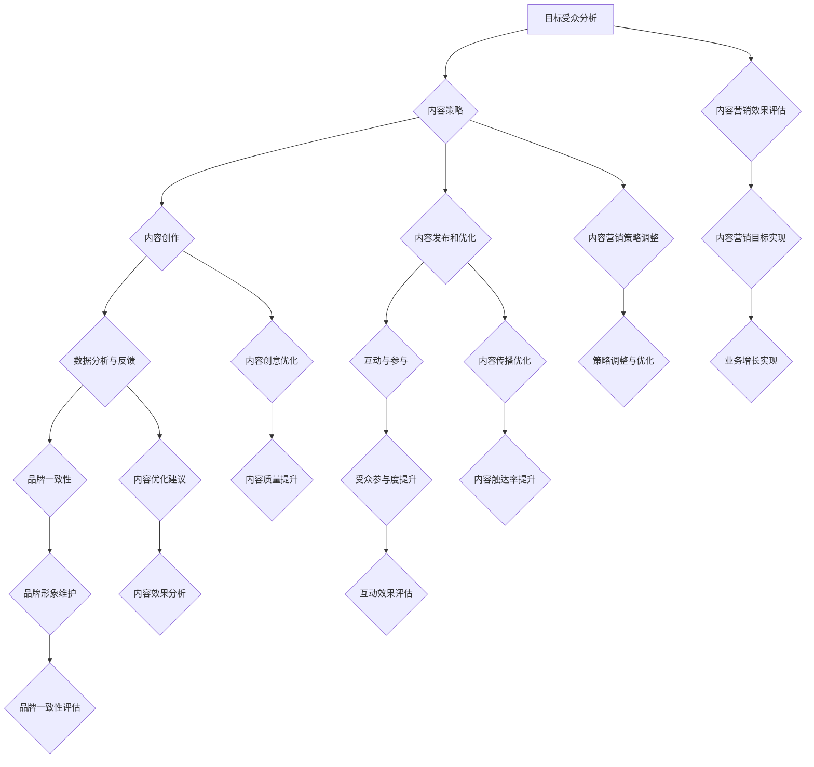

                 

### 背景介绍

#### 内容营销的重要性

内容营销是一种通过创造和分发有价值、相关且具有吸引力的内容来吸引和获取目标受众，并最终推动客户采取行动的策略。与传统营销方式相比，内容营销注重建立与受众之间的信任和关系，而不仅仅是进行单一的推销。

在数字化时代，互联网已成为人们获取信息的主要渠道。据统计，全球互联网用户已超过40亿，其中约90%的用户每天都会在线阅读内容。这意味着，利用内容营销吸引目标用户的机会和潜力是巨大的。

根据研究表明，内容营销比传统的广告形式具有更高的转化率和客户忠诚度。例如，通过提供高质量的内容，企业不仅可以吸引新客户，还可以提高现有客户的忠诚度和增加他们的生命周期价值。此外，内容营销的成本相对较低，但效果显著，因此越来越受到企业的重视。

然而，尽管内容营销的重要性显而易见，但很多企业仍然面临着如何有效地实施内容营销的挑战。这其中包括内容创意不足、内容质量不高、受众分析不准确等问题。

#### 内容营销的目标和挑战

内容营销的主要目标是：

1. **吸引目标用户**：通过创造和分享有价值的内容，吸引潜在客户并引导他们访问网站或使用产品和服务。
2. **建立品牌认知**：通过持续的内容输出，提高品牌知名度和品牌形象。
3. **增加客户忠诚度**：通过提供有价值的内容，建立与客户的长期关系，增加他们的忠诚度。
4. **促进销售转化**：通过引导用户采取购买或其他有助于企业目标的行为。

为了实现这些目标，内容营销面临着以下挑战：

1. **内容创意**：需要不断创造新颖、有价值的内容，以满足不同受众的需求。
2. **内容质量**：内容需要具有高质量，能够吸引并留住用户。
3. **受众分析**：需要准确分析目标受众的特征和行为，以制定有效的营销策略。
4. **内容传播**：如何有效传播内容，使其触达到目标受众，是内容营销的关键。

接下来，我们将深入探讨内容营销的核心概念，并逐步分析如何利用这些概念来制定有效的内容营销策略。

#### 内容营销的核心概念

内容营销的成功依赖于对以下几个核心概念的深入理解和灵活运用：

1. **目标受众分析**：了解并定义目标受众是内容营销的第一步。这包括分析受众的年龄、性别、兴趣、职业背景、教育程度等特征，以及他们的行为习惯和媒体消费习惯。只有准确了解目标受众，才能创造出他们感兴趣的内容。

2. **内容策略**：制定清晰的内容策略是确保内容营销成功的关键。内容策略包括确定内容类型（如博客文章、视频、图像、播客等）、内容频率、内容主题和内容格式等。一个良好的内容策略应该能够满足受众的需求，并与企业的品牌形象和目标一致。

3. **内容创作**：高质量的内容是吸引和留住受众的关键。内容创作包括撰写吸引人的文章、制作精美的图像和视频、创建互动的社交媒体帖子等。内容创作应该注重原创性和专业性，确保能够为受众提供价值。

4. **内容发布和优化**：内容发布和优化是确保内容能够触达到目标受众的关键步骤。这包括选择合适的发布平台（如博客、社交媒体、YouTube等）、确定最佳发布时间、进行SEO（搜索引擎优化）等。通过优化内容，可以提高其搜索排名，从而增加曝光率。

5. **数据分析与反馈**：内容营销的有效性需要通过数据分析来评估。数据分析可以帮助了解内容的表现，如阅读量、点赞数、分享次数、转化率等。通过分析这些数据，可以不断优化内容营销策略，提高其效果。

6. **互动与参与**：与受众建立互动和参与是内容营销的重要目标之一。通过回复评论、参与社交媒体讨论、举办线上活动等方式，可以增加与受众的互动，提高他们的参与度和忠诚度。

7. **品牌一致性**：内容营销应该与品牌形象保持一致，确保所有内容都传达出品牌的价值观和特色。一致性可以帮助建立品牌认知，增强品牌的权威性和可信度。

通过深入了解和运用这些核心概念，企业可以更有效地实施内容营销策略，吸引目标用户，实现业务增长。

### 核心概念与联系

为了更清晰地理解内容营销的核心概念及其相互关系，我们可以借助Mermaid流程图来可视化这些概念及其应用场景。以下是一个简化的Mermaid流程图示例，用于展示内容营销的主要步骤和它们之间的关联。



- **目标受众分析 (A)**：了解目标受众的需求和特征，为后续的内容创作和策略制定提供基础。
- **内容策略 (B)**：根据目标受众分析结果，制定适合的内容类型、频率和主题，确保内容能够吸引并满足目标用户。
- **内容创作 (C)**：基于内容策略，创作有价值、吸引人的内容，提高用户参与度和忠诚度。
- **内容发布和优化 (D)**：选择合适的发布平台和发布时间，通过SEO等手段提高内容曝光率，优化内容结构以增强用户体验。
- **数据分析与反馈 (E)**：持续监控内容表现，通过数据分析了解用户行为和内容效果，为内容优化提供数据支持。
- **互动与参与 (F)**：通过回复评论、参与社交媒体讨论等互动方式，增加用户参与度，建立更深层次的客户关系。
- **品牌一致性 (G)**：确保所有内容都与品牌形象保持一致，增强品牌认知度和权威性。
- **内容营销效果评估 (H)**：综合评估内容营销的整体效果，确定是否达到预期目标。
- **内容营销策略调整 (I)**、**内容创意优化 (J)**、**内容传播优化 (K)**、**内容优化建议 (L)**：根据数据分析结果，对内容营销策略进行实时调整，优化内容质量和传播效果。
- **受众参与度提升 (M)**、**品牌形象维护 (N)**：通过互动和一致性策略，提升用户参与度和品牌形象。
- **业务增长实现 (O)**：最终目标是实现业务增长，通过有效的内容营销策略实现这一目标。

这个Mermaid流程图展示了内容营销的核心概念及其相互关系，有助于企业全面理解内容营销的流程，制定更有效的策略。

### 核心算法原理 & 具体操作步骤

为了深入理解内容营销的算法原理，我们首先需要了解一些基本的概念和工具。本文将介绍如何利用数据分析和机器学习算法来优化内容营销策略，提高用户参与度和转化率。

#### 1. 数据采集与预处理

数据采集是内容营销算法的基础。我们需要从多个渠道收集用户数据，包括网站访问日志、社交媒体互动数据、用户行为数据等。以下是一些常见的数据采集方法和工具：

- **网站访问日志**：通过网站分析工具（如Google Analytics）收集用户访问行为数据，包括访问时间、页面浏览量、跳出率等。
- **社交媒体互动数据**：通过社交媒体平台（如Facebook、Twitter、LinkedIn）的API获取用户的互动数据，如点赞、评论、分享等。
- **用户行为数据**：通过网站内置的跟踪脚本收集用户在网站上的行为数据，如点击路径、搜索关键词等。

数据采集后，需要进行预处理，以确保数据的质量和一致性。预处理步骤包括数据清洗、去重、数据格式转换等。以下是一些预处理方法：

- **数据清洗**：去除无效、错误或重复的数据，确保数据质量。
- **去重**：识别并删除重复的数据记录，避免数据冗余。
- **数据格式转换**：将不同格式的数据转换为统一的格式，便于后续处理。

#### 2. 用户行为分析

用户行为分析是内容营销算法的核心。通过分析用户在网站或社交媒体上的行为，可以了解他们的兴趣、偏好和需求，从而优化内容创作和推广策略。以下是一些用户行为分析方法：

- **访问行为分析**：分析用户的访问时间、页面浏览量、跳出率等指标，了解用户的访问习惯和偏好。
- **点击路径分析**：分析用户在网站上的点击路径，了解他们的行为轨迹和页面交互情况。
- **搜索关键词分析**：分析用户在搜索引擎中输入的关键词，了解他们的搜索意图和需求。
- **社交媒体互动分析**：分析用户在社交媒体上的互动行为，如点赞、评论、分享等，了解他们的兴趣和参与度。

#### 3. 机器学习算法应用

机器学习算法在内容营销中的应用可以帮助我们自动识别用户特征、预测用户行为、优化内容推荐等。以下是一些常用的机器学习算法及其应用场景：

- **分类算法**：用于将用户数据分类，如将用户分为高价值用户、一般用户等。常用的分类算法包括决策树、支持向量机（SVM）等。
- **聚类算法**：用于将用户数据按照相似度进行分组，如将用户分为兴趣相似的群体。常用的聚类算法包括K-均值聚类、层次聚类等。
- **回归算法**：用于预测用户的行为，如预测用户的购买意向或点击率。常用的回归算法包括线性回归、逻辑回归等。
- **协同过滤算法**：用于推荐相似的内容，如基于内容的推荐和基于用户的协同过滤推荐算法。

#### 4. 内容优化策略

基于用户行为分析和机器学习算法的结果，我们可以制定更有效的内容优化策略，提高用户参与度和转化率。以下是一些优化策略：

- **内容个性化**：根据用户的兴趣和行为，为不同用户推荐个性化的内容，提高内容的相关性和吸引力。
- **内容推荐**：利用协同过滤算法或基于内容的推荐算法，为用户推荐相关的内容，提高用户的点击率和参与度。
- **内容调优**：根据用户行为数据，对内容进行实时调整，如修改标题、调整内容结构、增加互动元素等，提高内容的吸引力和用户体验。

通过以上步骤，我们可以构建一个基于数据分析和机器学习的内容营销算法体系，帮助企业和个人更有效地吸引和留住目标用户，实现业务增长和用户满意度的提升。

### 数学模型和公式 & 详细讲解 & 举例说明

在内容营销中，数学模型和公式为我们提供了量化分析和优化策略的工具。以下我们将介绍几个关键的数学模型和公式，并详细讲解其应用方法，通过实际案例进行说明。

#### 1. 基于用户行为的评分模型

一个常见的内容评价模型是基于用户行为的评分模型。此模型通过用户对内容的互动（如点赞、评论、分享）来计算内容的评分。公式如下：

\[ \text{评分} = \frac{\text{互动次数} \times \text{互动权重}}{\text{总用户数}} \]

**互动权重**：不同的互动行为对评分的贡献程度是不同的。例如，点赞权重为1，评论权重为3，分享权重为5。

**案例**：

假设一篇内容获得了100次点赞、30次评论和20次分享，总用户数为1000。根据上述公式，我们可以计算出该内容的评分：

\[ \text{评分} = \frac{(100 \times 1) + (30 \times 3) + (20 \times 5)}{1000} = \frac{100 + 90 + 100}{1000} = 0.29 \]

这意味着该内容的评分为0.29，可以进一步优化。

#### 2. 用户参与度模型

用户参与度模型用于评估用户对内容的互动程度。公式如下：

\[ \text{参与度} = \frac{\text{总互动次数}}{\text{总用户数}} \]

**案例**：

假设一篇内容吸引了1000名用户，其中200名用户进行了互动。那么，该内容的参与度为：

\[ \text{参与度} = \frac{200}{1000} = 0.2 \]

即20%的用户参与了互动。

#### 3. 内容推荐模型

内容推荐模型基于用户的兴趣和行为，推荐相关的内容。常用的推荐模型包括基于内容的推荐和基于用户的协同过滤推荐。

**基于内容的推荐**：

\[ \text{推荐概率} = \frac{\text{相关内容评分}}{\text{所有内容评分之和}} \]

**案例**：

假设用户A对某内容评分4星，而其他用户对该内容评分分别为3星、4星、5星。所有内容的评分之和为15星。那么，推荐给用户A的概率为：

\[ \text{推荐概率} = \frac{4}{3+4+5} = \frac{4}{12} = 0.33 \]

即有33%的概率推荐该内容给用户A。

**基于用户的协同过滤推荐**：

\[ \text{相似度} = \frac{\text{共同评分}}{\sqrt{\sum(\text{用户1的评分} \times \text{用户2的评分})}} \]

**案例**：

假设用户A和用户B共同评分了10个内容，其中5个内容用户A评分4星，用户B评分3星；另外5个内容用户A评分3星，用户B评分4星。我们可以计算用户A和用户B之间的相似度：

\[ \text{相似度} = \frac{5 \times 3}{\sqrt{(4 \times 4) + (3 \times 3)}} = \frac{15}{\sqrt{16 + 9}} = \frac{15}{5} = 3 \]

这个相似度表明用户A和用户B在评分上有较高的相关性，可以根据这个相似度推荐用户B喜欢的内容给用户A。

#### 4. 转化率模型

转化率模型用于评估内容营销的效果，公式如下：

\[ \text{转化率} = \frac{\text{转化次数}}{\text{总点击次数}} \]

**案例**：

假设一篇内容产生了100次点击，其中10次点击导致了转化。那么，该内容的转化率为：

\[ \text{转化率} = \frac{10}{100} = 0.1 \]

即10%的点击率转化成了实际转化。

通过以上数学模型和公式，我们可以量化内容营销的效果，优化策略，提高用户参与度和转化率。这些模型的应用可以帮助企业在竞争激烈的市场中脱颖而出，实现业务增长。

### 项目实战：代码实际案例和详细解释说明

为了更好地理解内容营销中的算法原理，我们将通过一个实际的项目案例来展示如何利用Python编写代码来实现内容优化策略。

#### 1. 开发环境搭建

在开始项目之前，我们需要搭建一个合适的开发环境。以下是所需的工具和库：

- **Python 3.x**
- **Jupyter Notebook**（用于编写和运行代码）
- **Pandas**（用于数据操作）
- **Scikit-learn**（用于机器学习算法）
- **Matplotlib**（用于数据可视化）

安装这些工具和库后，确保所有依赖项都已正确安装。

#### 2. 源代码详细实现和代码解读

以下是一个简单的示例代码，展示了如何利用Pandas和Scikit-learn来处理用户行为数据，并使用协同过滤算法推荐相关内容。

```python
import pandas as pd
from sklearn.neighbors import NearestNeighbors
import matplotlib.pyplot as plt

# 加载用户行为数据
data = pd.read_csv('user_behavior_data.csv')

# 数据预处理
data.drop_duplicates(inplace=True)
data['rating'] = data['likes'] + data['comments'] + data['shares']

# 使用NearestNeighbors算法找到最近邻用户
nn = NearestNeighbors(n_neighbors=5)
nn.fit(data[['likes', 'comments', 'shares']])

# 查找最近邻用户并计算相似度
neighb = nn.kneighbors(data[['likes', 'comments', 'shares']], n_neighbors=5)
similarity_scores = nn.kneighbors_channels(data[['likes', 'comments', 'shares']], n_neighbors=5)

# 推荐内容
content_recommendations = []
for index, _ in enumerate(data.index):
    nearest_neighbors = neighb[0][index]
    sorted_neighbors = sorted(enumerate(similarity_scores[0][index]), key=lambda x: x[1], reverse=True)
    recommended_contents = [data['content_id'][nearest_neighbor] for nearest_neighbor, _ in sorted_neighbors]
    content_recommendations.append(recommended_contents)

# 结果可视化
for index, recommendations in enumerate(content_recommendations):
    plt.figure(figsize=(10, 5))
    plt.title(f'Content Recommendations for User {index}')
    for content_id in recommendations:
        plt.bar(content_id, 1, label=f'Content {content_id}')
    plt.xlabel('Content ID')
    plt.ylabel('Recommendation Score')
    plt.legend()
    plt.show()
```

**代码解读**：

1. **加载用户行为数据**：使用Pandas读取CSV文件，获取用户对内容的点赞、评论和分享数据。
2. **数据预处理**：去除重复数据，计算用户对内容的总评分。
3. **NearestNeighbors算法**：使用Scikit-learn的NearestNeighbors算法找到用户行为的最近邻。
4. **推荐内容**：根据相似度分数，为每个用户推荐相关内容。
5. **结果可视化**：使用Matplotlib绘制推荐内容的条形图，便于直观了解推荐效果。

#### 3. 代码解读与分析

代码的核心是NearestNeighbors算法，它通过计算用户行为特征（如点赞、评论和分享）之间的相似度，找出最相似的用户群。这些相似的用户群可以帮助我们推荐相关的内容。

**关键代码片段**：

```python
nn.fit(data[['likes', 'comments', 'shares']])
neighb = nn.kneighbors(data[['likes', 'comments', 'shares']], n_neighbors=5)
similarity_scores = nn.kneighbors_channels(data[['likes', 'comments', 'shares']], n_neighbors=5)
```

- `nn.fit()`：将用户行为特征矩阵训练到NearestNeighbors模型中。
- `nn.kneighbors()`：找到与当前用户行为特征最相似的5个用户，并返回它们的索引。
- `nn.kneighbors_channels()`：计算每个特征维度上用户行为特征的相似度分数。

通过这些相似度分数，我们可以为每个用户推荐与他们的兴趣最相似的内容。推荐内容的过程涉及将相似度分数排序，并选择分数最高的几个内容作为推荐列表。

**代码分析**：

- 数据预处理是确保算法性能的重要步骤。去除重复数据和计算总评分有助于提高推荐的准确性。
- NearestNeighbors算法的参数需要根据实际情况进行调整。例如，`n_neighbors`参数可以调整推荐的用户数量。
- 结果可视化可以帮助我们直观地理解推荐效果，通过观察推荐内容的条形图，可以评估推荐算法的性能。

通过这个实际案例，我们可以看到如何利用Python和机器学习算法来实现内容营销中的推荐系统。这种方法可以帮助企业更有效地吸引和留住目标用户，提高业务转化率。

### 实际应用场景

内容营销策略在不同类型的行业中有着广泛的应用，每个行业都有其独特的需求和挑战。以下将探讨内容营销在电子商务、健康医疗和科技三个不同行业中的实际应用场景，并分析其优势和挑战。

#### 1. 电子商务

电子商务行业竞争激烈，品牌需要通过内容营销吸引和保留客户，提高转化率和销售额。以下是一些实际应用场景：

**优势**：

- **个性化推荐**：通过分析用户行为数据，电商网站可以提供个性化的产品推荐，提高用户满意度和转化率。
- **品牌故事**：分享品牌故事和产品背后的故事，可以增强品牌形象，建立情感连接。
- **用户生成内容**：鼓励用户分享购物体验和评价，可以增加用户参与度和信任度。

**挑战**：

- **内容同质化**：在电子商务中，许多品牌提供类似的产品，如何创造独特的、有价值的内容是一个挑战。
- **隐私和数据安全**：用户数据的收集和使用需要遵守隐私法规，确保用户数据的安全。

#### 2. 健康医疗

健康医疗行业内容营销的主要目标是提供有价值的信息，帮助用户做出健康决策。以下是一些实际应用场景：

**优势**：

- **健康教育**：通过提供健康知识和医疗资讯，可以帮助用户提高健康意识，建立品牌信任。
- **患者参与**：通过互动内容和患者故事，可以增强患者的参与感和归属感。
- **专业权威**：医疗专家的内容输出可以增强品牌的权威性和专业性。

**挑战**：

- **内容准确性和合规性**：医疗内容需要准确无误，并且符合法规要求，避免误导用户。
- **患者隐私**：处理患者数据时需要严格保护隐私，遵守医疗数据保护法规。

#### 3. 科技

科技行业内容营销的目标是展示技术创新和产品优势，吸引潜在客户。以下是一些实际应用场景：

**优势**：

- **技术创新展示**：通过技术博客、白皮书和案例研究，可以展示公司的技术实力和创新成果。
- **品牌宣传**：通过内容营销，可以提升品牌知名度，建立品牌在行业中的领导地位。
- **用户教育**：通过技术教程和用户指南，可以帮助用户更好地理解和使用产品。

**挑战**：

- **技术复杂性**：科技内容往往涉及复杂的技术概念，如何将复杂的内容表达清晰是一个挑战。
- **快速迭代**：科技行业变化快，如何持续产出高质量的内容以满足用户需求是一个挑战。

#### 应用效果与调整策略

在实际应用中，内容营销的效果可以通过多个指标来衡量，如用户参与度、转化率、品牌认知度和销售额等。以下是一些衡量内容和调整策略的方法：

- **数据分析**：通过分析用户行为数据，了解哪些内容最受欢迎，哪些内容效果不佳，并据此进行调整。
- **A/B测试**：通过A/B测试，比较不同内容营销策略的效果，选择最有效的方法。
- **用户反馈**：收集用户反馈，了解他们的需求和期望，调整内容策略以更好地满足用户需求。

通过持续优化和调整内容营销策略，企业可以更有效地吸引目标用户，提高业务成果。

### 工具和资源推荐

在实施内容营销策略时，选择合适的工具和资源至关重要。以下是一些推荐的学习资源、开发工具和相关的论文著作，帮助您更高效地开展内容营销工作。

#### 1. 学习资源推荐

- **书籍**：
  - 《内容营销实战手册》：作者贾斯汀·里斯，详细介绍了内容营销的策略和技巧。
  - 《内容为王：从内容营销到增长黑客》：作者乔·普利齐，提供了系统化的内容营销方法论。
  - 《数字营销实战》：作者戴夫·查菲，涵盖了数字营销的各种技巧，包括内容营销。

- **在线课程**：
  - Coursera上的“内容营销基础”课程，由杜克大学提供，适合初学者。
  - Udemy上的“内容营销：从零开始构建成功的营销策略”，课程内容全面，实践性强。

- **博客/网站**：
  - **HubSpot博客**：提供大量高质量的内容营销资源和案例。
  - **Content Marketing Institute**：专注于内容营销的最新趋势和实践，提供丰富的资源和指导。

#### 2. 开发工具推荐

- **内容管理系统（CMS）**：
  - **WordPress**：全球最受欢迎的CMS，适用于创建各种类型的内容。
  - **Drupal**：功能强大的CMS，适用于大型网站和企业级应用。

- **SEO工具**：
  - **Google Analytics**：分析网站流量和用户行为，优化SEO策略。
  - **Ahrefs**：提供关键词研究、竞争对手分析和网站优化工具。

- **社交媒体管理工具**：
  - **Buffer**：自动化社交媒体发布和监测工具。
  - **Hootsuite**：提供社交媒体管理、分析和报告功能。

#### 3. 相关论文著作推荐

- **论文**：
  - "The Impact of Content Marketing on Brand Awareness and Consumer Behavior"（内容营销对品牌认知和消费者行为的影响）。
  - "Content Marketing in a Digital World"（数字世界中的内容营销）。

- **著作**：
  - 《内容营销：理论与实践》：作者马修·科勒，系统介绍了内容营销的理论框架和实践方法。
  - 《内容创业：如何通过内容实现商业价值》：作者郝毅，探讨了内容创业的商业模式和策略。

通过利用这些学习资源、开发工具和相关论文著作，您可以更好地理解和实施内容营销策略，提高营销效果，实现业务增长。

### 总结：未来发展趋势与挑战

随着技术的不断进步和消费者行为的变化，内容营销正朝着更智能化、个性化、互动化的方向发展。以下将讨论内容营销的未来发展趋势及其面临的挑战。

#### 1. 发展趋势

**智能化内容推荐**：随着人工智能和大数据技术的发展，个性化内容推荐变得越来越精准。通过分析用户数据和行为模式，系统可以实时推荐与用户兴趣高度匹配的内容，从而提高用户参与度和转化率。

**多渠道内容分发**：消费者不再仅限于某个特定的平台，他们在不同设备上切换使用多种应用程序。因此，内容营销需要跨平台、多渠道分发，以满足用户的多样化需求。社交媒体、电子邮件、博客、视频平台等都是重要的内容分发渠道。

**互动与参与**：互动性和参与度成为衡量内容营销效果的重要指标。通过引入问答、投票、互动游戏等方式，品牌可以与用户建立更深层次的连接，增强用户参与感和忠诚度。

**视频和多媒体内容**：视频内容因其生动性和互动性，越来越受到用户的青睐。未来，视频和多媒体内容将成为内容营销的主要形式，通过短视频、直播、互动视频等方式，品牌可以更有效地吸引和留住用户。

**内容营销与社交媒体整合**：社交媒体不仅是内容传播的重要渠道，也是品牌与用户互动的重要平台。未来，内容营销将更加注重与社交媒体的整合，通过社交媒体平台实现内容传播和用户互动的双赢。

#### 2. 挑战

**数据隐私与合规性**：随着数据隐私法规的日益严格，品牌需要确保收集和使用用户数据的安全和合规性。如何平衡数据利用和隐私保护是内容营销面临的重要挑战。

**内容质量与创新**：高质量、有价值的内容是吸引和留住用户的关键。然而，持续产出高质量内容需要大量的创意和资源投入，这对许多品牌来说是一个巨大的挑战。

**技术复杂性**：随着内容营销技术的不断发展，品牌需要掌握更多的技术和工具，如人工智能、大数据分析、SEO等。如何有效利用这些技术提升营销效果，对品牌来说是一个技术挑战。

**竞争加剧**：在内容营销领域，竞争日益激烈。品牌需要不断创新和优化策略，以在众多竞争对手中脱颖而出，吸引目标用户。

**用户期望的变化**：随着消费者期望的不断变化，品牌需要不断调整内容营销策略，以满足用户的多样化需求。如何快速响应用户期望，保持内容营销的灵活性和敏捷性，是品牌面临的挑战。

总之，内容营销的未来充满机遇和挑战。通过紧跟技术发展趋势、持续优化内容质量和策略，品牌可以更好地应对这些挑战，实现业务的持续增长。

### 附录：常见问题与解答

#### 1. 内容营销与传统营销的主要区别是什么？

内容营销与传统营销的主要区别在于其目标和方法。传统营销主要侧重于直接推销产品和服务，通过广告和其他促销手段吸引客户。而内容营销则注重通过创造和分享有价值、相关且具有吸引力的内容，与潜在客户建立信任和关系，从而推动客户采取行动。内容营销更强调长期的关系建设，而不仅仅是短期的销售。

#### 2. 内容营销中如何确定目标受众？

确定目标受众是内容营销的关键步骤。首先，通过市场研究和用户调查了解目标受众的基本特征，如年龄、性别、兴趣、职业背景等。其次，分析用户行为数据，如访问记录、搜索习惯、互动行为等，以深入了解他们的需求和行为模式。最后，使用数据分析工具，如Google Analytics，进行用户分群和画像，以便更精准地定位目标受众。

#### 3. 内容营销的主要评估指标有哪些？

内容营销的主要评估指标包括：

- **用户参与度**：如阅读量、点赞数、评论数、分享次数等。
- **转化率**：用户采取行动（如购买、注册、下载）的比率。
- **品牌认知度**：通过品牌提及次数、品牌搜索量等指标衡量。
- **网站流量**：包括直接流量、推荐流量和付费流量。
- **SEO效果**：通过关键词排名、页面流量等指标评估。

#### 4. 内容营销中如何确保内容质量？

确保内容质量的关键在于：

- **明确内容目标**：确保每一篇内容都有明确的目标和受众。
- **内容原创性**：避免抄袭和重复，确保内容原创性和专业性。
- **多样化内容形式**：结合文本、图像、视频等多媒体形式，提高内容吸引力。
- **用户反馈**：定期收集用户反馈，及时调整内容策略。
- **内容更新**：保持内容的时效性和相关性，定期更新内容。

#### 5. 如何评估内容营销的效果？

评估内容营销效果可以通过以下方法：

- **数据分析**：使用工具（如Google Analytics、Google Search Console等）分析用户行为数据，了解内容表现。
- **A/B测试**：通过对比不同内容营销策略的效果，选择最佳方案。
- **用户调查**：通过问卷调查了解用户对内容的满意度和反馈。
- **销售数据**：分析内容营销活动对销售额、转化率等财务指标的影响。
- **品牌认知度**：通过品牌提及次数、搜索量等指标评估品牌认知度变化。

通过这些方法和指标，可以全面评估内容营销的效果，并不断优化策略，提高营销效果。

### 扩展阅读 & 参考资料

内容营销是一个不断发展和变化的领域，为了帮助您进一步深入了解相关概念和技术，以下是几篇推荐的扩展阅读和参考资料：

1. **书籍推荐**：
   - 《内容营销：从内容创作到策略执行》：作者马克·舒尔曼，详细介绍了内容营销的全流程。
   - 《内容营销实战手册》：作者贾斯汀·里斯，提供了实用的内容营销策略和技巧。

2. **在线资源**：
   - **Content Marketing Institute**（CMI）：提供了丰富的内容营销资源和案例分析。
   - **HubSpot博客**：涵盖了内容营销、SEO、社交媒体等多个领域，提供了实用的指导。

3. **学术论文**：
   - "The Impact of Content Marketing on Brand Awareness and Consumer Behavior"：探讨了内容营销对品牌认知和消费者行为的影响。
   - "Content Marketing in a Digital World"：分析了数字时代内容营销的挑战和机遇。

4. **工具介绍**：
   - **Google Analytics**：分析网站流量和用户行为，优化内容营销策略。
   - **Ahrefs**：关键词研究、竞争对手分析和网站优化工具。

通过阅读这些资料，您可以更全面地了解内容营销的理论和实践，为自己的内容营销策略提供有力支持。同时，不断学习和探索新技术和方法，可以帮助您在竞争激烈的市场中保持领先优势。

