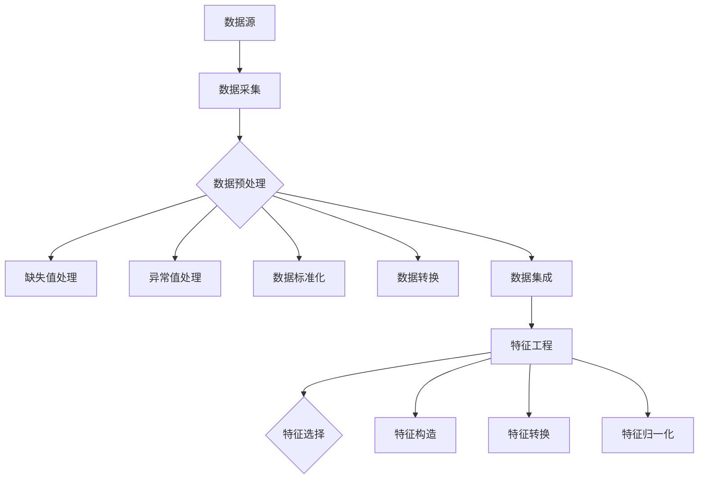

                 

### 1. 背景介绍

随着互联网和大数据技术的迅猛发展，如何有效利用大数据技术洞察用户痛点和需求已经成为各行业关注的焦点。用户痛点和需求是驱动产品迭代和优化的重要依据，精准识别和满足用户需求，能够显著提升产品竞争力，实现商业价值的最大化。

大数据技术在用户洞察中的应用，主要基于以下几个方面：

- **用户行为分析**：通过收集和分析用户在互联网上的行为数据，如浏览记录、购买行为、评论反馈等，挖掘用户的偏好和兴趣。

- **用户画像**：通过对大量用户数据的整合和分析，构建用户画像，帮助理解不同用户群体的特征和行为模式。

- **市场趋势预测**：利用大数据技术对市场数据进行深度挖掘和分析，预测市场趋势，为产品规划和市场策略提供支持。

- **个性化推荐**：基于用户行为数据和用户画像，实现个性化内容推荐，提升用户体验和粘性。

本文将从以下三个方面展开探讨：

1. **核心概念与联系**：介绍大数据技术中与用户洞察相关的基础概念，如数据源、数据预处理、特征工程等，并绘制 Mermaid 流程图，展示这些概念之间的联系。

2. **核心算法原理与操作步骤**：详细解释用户行为分析和用户画像构建的相关算法原理，包括数据收集、数据清洗、特征提取、模型训练和评估等步骤。

3. **数学模型和公式**：介绍与用户洞察相关的数学模型和公式，如聚类分析、回归分析等，并通过实例进行详细讲解。

通过以上三个方面的深入分析，我们希望能够为广大读者提供一套系统、完整的大数据技术在用户洞察中应用的方法论。

### 1.1 数据源与数据采集

数据源是大数据技术应用于用户洞察的基础，其质量直接影响到后续数据分析和用户洞察的准确性。数据源可以分为两大类：结构化数据和非结构化数据。

- **结构化数据**：通常来源于企业内部的数据库，如用户注册信息、交易记录、订单数据等。这些数据的特点是格式规范、易于处理，便于直接进行数据分析和建模。

- **非结构化数据**：主要包括文本、图片、音频、视频等，如用户评论、社交媒体帖子、搜索引擎日志等。这些数据的特点是格式多样、内容丰富，但同时也带来了数据处理和分析的复杂性。

数据采集是用户洞察过程中的关键步骤，其目的是收集与用户相关的各类数据，为后续分析提供基础。数据采集方法主要包括以下几种：

- **主动采集**：通过API接口、数据爬虫等技术手段，直接从外部数据源获取数据。例如，使用Python的Scrapy框架可以构建高效的数据爬虫，从互联网上获取用户评论和社交媒体数据。

- **被动采集**：通过在企业内部的系统中植入数据采集模块，自动收集用户在系统中的操作行为和交互数据。例如，通过分析用户在电商平台的浏览记录、购物车数据等，可以挖掘用户的兴趣和偏好。

- **第三方数据获取**：通过购买第三方数据服务，获取与用户相关的数据。例如，通过购买用户画像数据，可以补充和完善企业内部的数据源，提高用户洞察的准确性。

为了确保数据的质量和一致性，数据采集过程中需要注意以下几点：

- **数据完整性**：确保采集的数据覆盖全面，避免关键信息的缺失。

- **数据准确性**：对采集的数据进行校验和清洗，去除错误和异常数据。

- **数据时效性**：及时采集和更新数据，保证数据的时效性和新鲜度。

- **数据隐私保护**：严格遵守相关法律法规，确保用户隐私数据的安全性和合法性。

### 1.2 数据预处理与清洗

在数据采集完成后，原始数据往往存在大量噪声、缺失值和异常值，这会严重影响数据分析和用户洞察的准确性。因此，数据预处理和清洗是大数据技术中的关键步骤。

#### 数据清洗方法

- **缺失值处理**：对于缺失值，可以采用以下几种方法进行填充或删除：
  - 删除缺失值：如果缺失值的比例较高，可以直接删除含有缺失值的样本。
  - 均值填充：对于连续型数据，可以使用平均值、中位数或众数来填充缺失值。
  - 逻辑推断：根据其他特征值和已知信息，进行逻辑推断和补全。

- **异常值处理**：异常值可能是由于数据录入错误、噪声干扰或其他原因造成的，需要加以识别和处理。常见的方法包括：
  - 标准差法：计算每个特征值与平均值的偏差，将偏差超过一定倍数标准差的值视为异常值。
  - 离群点检测：使用聚类算法（如K-means）或距离度量（如欧氏距离）识别离群点。

- **数据标准化**：为了消除不同特征之间的量纲影响，需要将数据进行标准化处理。常用的方法包括：
  - Z-score标准化：计算每个特征值与均值的标准化距离，使其服从标准正态分布。
  - Min-Max标准化：将特征值缩放到[0,1]范围内，便于不同特征之间的比较。

- **数据转换**：为了满足模型的要求或提高数据的可用性，可能需要对数据进行转换，如将类别型数据转换为数值型数据，或将文本数据转换为词向量等。

#### 数据预处理流程

- **数据预处理**：对原始数据进行初步清洗，包括缺失值填充、异常值处理、数据标准化等。
- **数据分箱**：对连续型数据进行分箱处理，将连续值转换为离散的类别值，便于后续分析。
- **特征选择**：通过特征选择方法（如信息增益、互信息等）筛选出对用户洞察有重要影响的关键特征。
- **数据集成**：将来自不同数据源的数据进行整合，形成统一的数据集，为后续分析提供基础。

### 1.3 特征工程

特征工程是大数据技术中至关重要的一步，其目的是通过选择、构造和转换特征，提高数据的质量和模型的性能。在用户洞察中，特征工程主要包括以下内容：

- **特征选择**：通过评估不同特征对模型性能的贡献，选择最具代表性的特征。常用的方法包括：信息增益、互信息、卡方检验等。

- **特征构造**：根据业务逻辑和数据特性，构造新的特征。例如，通过时间序列分析，可以生成用户活跃度、留存率等指标。

- **特征转换**：将类别型数据转换为数值型数据，或将文本数据转换为词向量等，以便于模型处理。

- **特征归一化**：为了消除特征之间的量纲影响，将特征进行归一化处理。

#### 特征工程的重要性

- **提高模型性能**：通过特征工程，可以消除数据中的噪声和冗余，提高模型的准确性和鲁棒性。

- **降低计算复杂度**：特征工程有助于简化模型结构，降低计算复杂度，提高模型训练和预测的效率。

- **增强模型解释性**：通过合理构造特征，可以使模型更易于理解和解释，提高模型的透明度和可信度。

### 1.4 Mermaid 流程图

为了更直观地展示数据采集、预处理和特征工程的过程，我们可以使用 Mermaid 流程图进行描述。以下是一个简化的 Mermaid 流程图：



在这个流程图中，数据源通过数据采集模块获取数据，随后进入数据预处理阶段，包括缺失值处理、异常值处理、数据标准化、数据转换和数据集成。经过预处理后，进入特征工程阶段，包括特征选择、特征构造、特征转换和特征归一化，最终形成高质量的特征集，为后续的用户洞察分析提供支持。

### 2. 核心算法原理与操作步骤

在大数据技术的用户洞察应用中，核心算法原理与操作步骤是分析和理解用户行为、需求、偏好和趋势的关键。以下是几种常用的核心算法及其原理和操作步骤。

#### 2.1 用户行为分析

用户行为分析是大数据技术中最基础且广泛应用的一种方法，主要用于分析用户在互联网上的行为数据，如浏览记录、点击率、搜索关键词、购买历史等。

**算法原理**：

- **基于频率的异常检测**：通过统计用户行为的频率，识别出异常行为。例如，如果一个用户的购买频率突然大幅度增加或减少，可能是发生了购物习惯的变化。

- **聚类分析**：将具有相似行为的用户聚为一类，以发现用户群体的行为特征。常用的聚类算法有K-means、DBSCAN等。

- **关联规则挖掘**：通过分析用户行为的关联关系，发现潜在的产品或服务组合。常用的算法有Apriori、FP-growth等。

**操作步骤**：

1. **数据收集**：从网站日志、数据库、第三方数据源等获取用户行为数据。

2. **数据预处理**：对数据进行清洗、去重、格式转换等操作，确保数据质量。

3. **特征提取**：根据业务需求，提取与用户行为相关的特征，如点击率、购买频率、浏览时间等。

4. **模型训练**：选择合适的算法，如K-means、Apriori等，对提取的特征进行训练。

5. **结果分析**：根据模型的预测结果，分析用户的偏好和行为模式，为产品优化和市场策略提供支持。

#### 2.2 用户画像构建

用户画像构建是通过整合和分析用户的各类数据，生成一个包含用户属性、兴趣、行为等多维度信息的用户画像，用于精准营销和个性化推荐。

**算法原理**：

- **用户属性分析**：通过分析用户的基本属性，如性别、年龄、职业、地域等，构建用户的基础画像。

- **行为轨迹分析**：通过分析用户的浏览、点击、购买等行为数据，挖掘用户的兴趣和偏好。

- **社会关系分析**：通过分析用户在社交媒体、论坛等平台上的互动关系，构建用户的社会网络画像。

**操作步骤**：

1. **数据收集**：从用户注册信息、行为数据、第三方数据源等获取用户相关数据。

2. **数据预处理**：对数据进行清洗、去噪、格式统一等处理。

3. **特征提取**：根据业务需求，提取与用户画像相关的特征，如浏览时长、购买频率、关注话题等。

4. **用户聚类**：使用聚类算法（如K-means、DBSCAN）将用户分为不同的群体，为个性化推荐和精准营销提供依据。

5. **用户标签构建**：为每个用户打上相应的标签，如“科技爱好者”、“美食爱好者”等，用于描述用户特征。

6. **用户画像更新**：定期更新用户画像，以反映用户行为的最新变化。

#### 2.3 市场趋势预测

市场趋势预测是通过分析市场数据，预测未来市场的变化趋势，为企业的市场策略和产品规划提供支持。

**算法原理**：

- **时间序列分析**：通过分析时间序列数据，如销售量、用户增长等，预测未来的市场趋势。常用的算法有ARIMA、LSTM等。

- **回归分析**：通过建立回归模型，分析影响市场趋势的各个因素，预测未来的市场变化。常用的算法有线性回归、多元回归等。

**操作步骤**：

1. **数据收集**：从销售数据、市场调研报告、第三方数据源等获取市场相关数据。

2. **数据预处理**：对数据进行清洗、去噪、格式统一等处理。

3. **特征提取**：提取与市场趋势相关的特征，如销售量、广告投放量、用户增长等。

4. **模型训练**：选择合适的时间序列分析或回归算法，对提取的特征进行训练。

5. **结果预测**：根据模型的预测结果，分析未来市场趋势，为企业的市场策略和产品规划提供支持。

#### 2.4 个性化推荐

个性化推荐是通过分析用户的兴趣和行为，向用户推荐符合其兴趣的产品或内容，提高用户满意度和粘性。

**算法原理**：

- **协同过滤**：通过分析用户之间的相似性，推荐用户可能感兴趣的内容。常用的算法有基于用户的协同过滤（User-based Collaborative Filtering）和基于项目的协同过滤（Item-based Collaborative Filtering）。

- **内容推荐**：通过分析内容特征，推荐与用户兴趣相似的内容。常用的算法有基于内容的推荐（Content-based Filtering）。

**操作步骤**：

1. **数据收集**：从用户行为数据、内容特征数据等获取相关数据。

2. **数据预处理**：对数据进行清洗、去噪、格式统一等处理。

3. **特征提取**：提取与用户兴趣和内容特征相关的特征。

4. **模型训练**：选择合适的协同过滤或内容推荐算法，对提取的特征进行训练。

5. **结果推荐**：根据模型的推荐结果，生成个性化推荐列表，向用户推荐符合其兴趣的内容或产品。

### 3. 数学模型和公式

在大数据技术的用户洞察应用中，数学模型和公式是理解和分析用户行为、需求、偏好和趋势的重要工具。以下是几种常用的数学模型和公式，以及它们的详细讲解和实例说明。

#### 3.1 聚类分析

聚类分析是一种无监督学习方法，用于将数据点分为若干个类别，使得同类别数据点之间的相似度较高，不同类别数据点之间的相似度较低。

**数学模型**：

设数据集 \(D = \{x_1, x_2, ..., x_n\}\)，每个数据点 \(x_i\) 可以表示为 \(x_i = (x_{i1}, x_{i2}, ..., x_{id})\)，其中 \(d\) 表示数据维度。

- **K-means 算法**：

  1. 初始化：随机选择 \(k\) 个数据点作为初始聚类中心。
  2. 分配：将每个数据点分配到最近的聚类中心，形成 \(k\) 个簇。
  3. 更新：重新计算每个簇的中心，更新聚类中心。
  4. 重复步骤2和步骤3，直到聚类中心不再变化或满足停止条件。

**实例说明**：

假设我们有以下一个二维数据集：

\[D = \{(1, 1), (2, 2), (3, 3), (4, 4), (5, 5)\}\]

使用 K-means 算法将其分为两个簇，初始化时随机选择 \( (1, 1) \) 和 \( (5, 5) \) 作为聚类中心。

- 第一次分配：

  \[
  C_1 = \{(1, 1), (2, 2)\}, \quad C_2 = \{(3, 3), (4, 4), (5, 5)\}
  \]

- 更新中心：

  \[
  C_1 = \left(\frac{1+2}{2}, \frac{1+2}{2}\right) = (1.5, 1.5), \quad C_2 = \left(\frac{3+4+5}{3}, \frac{3+4+5}{3}\right) = (4, 4)
  \]

- 第二次分配：

  \[
  C_1 = \{(1, 1), (1.5, 1.5)\}, \quad C_2 = \{(3, 3), (4, 4), (5, 5)\}
  \]

- 更新中心：

  \[
  C_1 = \left(\frac{1+1.5}{2}, \frac{1+1.5}{2}\right) = (1.25, 1.25), \quad C_2 = \left(\frac{3+4+5}{3}, \frac{3+4+5}{3}\right) = (4, 4)
  \]

由于聚类中心不再变化，最终结果为：

\[
C_1 = \{(1, 1), (1.25, 1.25)\}, \quad C_2 = \{(3, 3), (4, 4), (5, 5)\}
\]

#### 3.2 回归分析

回归分析是一种有监督学习方法，用于建立因变量和自变量之间的关系模型，通过预测因变量的值来理解或分析数据。

**数学模型**：

设因变量为 \(y\)，自变量为 \(x_1, x_2, ..., x_n\)，回归模型可以表示为：

\[
y = \beta_0 + \beta_1 x_1 + \beta_2 x_2 + ... + \beta_n x_n + \epsilon
\]

其中，\(\beta_0, \beta_1, ..., \beta_n\) 为模型参数，\(\epsilon\) 为误差项。

- **线性回归**：

  当自变量和因变量之间的关系是线性的，可以使用线性回归模型。线性回归模型的参数可以通过最小二乘法求解：

  \[
  \beta = (X^T X)^{-1} X^T y
  \]

  其中，\(X\) 为自变量的设计矩阵，\(y\) 为因变量的向量。

**实例说明**：

假设我们有以下一个线性回归问题：

\[
y = \beta_0 + \beta_1 x_1 + \epsilon
\]

其中，\(x_1\) 是自变量，\(y\) 是因变量。

给定一组数据：

\[
\begin{array}{c|c}
x_1 & y \\
\hline
1 & 2 \\
2 & 4 \\
3 & 5 \\
4 & 6 \\
5 & 8 \\
\end{array}
\]

使用最小二乘法求解线性回归模型参数：

1. 计算设计矩阵 \(X\) 和因变量向量 \(y\)：

   \[
   X = \begin{bmatrix}
   1 & 1 \\
   1 & 2 \\
   1 & 3 \\
   1 & 4 \\
   1 & 5 \\
   \end{bmatrix}, \quad y = \begin{bmatrix}
   2 \\
   4 \\
   5 \\
   6 \\
   8 \\
   \end{bmatrix}
   \]

2. 计算最小二乘解：

   \[
   \beta = (X^T X)^{-1} X^T y
   \]

   首先计算 \(X^T X\) 和 \(X^T y\)：

   \[
   X^T X = \begin{bmatrix}
   10 & 11 \\
   11 & 14 \\
   \end{bmatrix}, \quad X^T y = \begin{bmatrix}
   30 \\
   55 \\
   \end{bmatrix}
   \]

   然后计算 \( (X^T X)^{-1} \)：

   \[
   (X^T X)^{-1} = \frac{1}{10 \times 14 - 11 \times 11} \begin{bmatrix}
   14 & -11 \\
   -11 & 10 \\
   \end{bmatrix} = \begin{bmatrix}
   \frac{14}{3} & -\frac{11}{3} \\
   -\frac{11}{3} & \frac{10}{3} \\
   \end{bmatrix}
   \]

   最后计算 \(\beta\)：

   \[
   \beta = \begin{bmatrix}
   \frac{14}{3} & -\frac{11}{3} \\
   -\frac{11}{3} & \frac{10}{3} \\
   \end{bmatrix} \begin{bmatrix}
   30 \\
   55 \\
   \end{bmatrix} = \begin{bmatrix}
   \frac{14}{3} \times 30 - \frac{11}{3} \times 55 \\
   -\frac{11}{3} \times 30 + \frac{10}{3} \times 55 \\
   \end{bmatrix} = \begin{bmatrix}
   1 \\
   1 \\
   \end{bmatrix}
   \]

   因此，线性回归模型为：

   \[
   y = 1 + 1 \times x_1
   \]

#### 3.3 决策树

决策树是一种常见的分类和回归模型，通过一系列的判断条件将数据划分为不同的类别或数值。

**数学模型**：

决策树模型可以表示为：

\[
T = \text{IF } x_i > \alpha \text{ THEN } y = \beta_1 \text{ ELSE } y = \beta_2
\]

其中，\(x_i\) 是自变量，\(\alpha\) 是阈值，\(y\) 是因变量，\(\beta_1\) 和 \(\beta_2\) 是分类结果。

**实例说明**：

假设我们有以下一个二分类问题：

\[
\text{IF } x > 5 \text{ THEN } y = 1 \text{ ELSE } y = 0
\]

给定一组数据：

\[
\begin{array}{c|c}
x & y \\
\hline
2 & 0 \\
4 & 0 \\
6 & 1 \\
8 & 1 \\
\end{array}
\]

使用决策树模型进行分类：

- 初始阈值 \(\alpha = 5\)，对于每个数据点 \(x_i\)：

  - 当 \(x_i > 5\)，预测 \(y = 1\)。
  - 当 \(x_i \leq 5\)，预测 \(y = 0\)。

根据给定数据，分类结果为：

\[
\begin{array}{c|c}
x & \text{预测} \\
\hline
2 & 0 \\
4 & 0 \\
6 & 1 \\
8 & 1 \\
\end{array}
\]

### 4. 项目实战：代码实际案例和详细解释说明

#### 4.1 开发环境搭建

在开始项目实战之前，我们需要搭建一个适合大数据分析的开发环境。以下是所需工具和步骤：

- **Python**：用于编写数据分析代码。
- **Pandas**：用于数据预处理和操作。
- **NumPy**：用于数值计算。
- **Matplotlib/Seaborn**：用于数据可视化。
- **Scikit-learn**：用于机器学习算法。
- **Mermaid**：用于绘制流程图。

**安装步骤**：

1. 安装Python（建议使用Python 3.8以上版本）。
2. 安装Pandas、NumPy、Matplotlib/Seaborn、Scikit-learn和Mermaid。

```bash
pip install pandas numpy matplotlib seaborn scikit-learn mermaid
```

#### 4.2 源代码详细实现和代码解读

以下是一个基于用户行为数据分析的项目案例，包括数据收集、预处理、特征工程、模型训练和结果分析。

```python
import pandas as pd
import numpy as np
import matplotlib.pyplot as plt
import seaborn as sns
from sklearn.cluster import KMeans
from sklearn.model_selection import train_test_split
from sklearn.metrics import accuracy_score
from mermaid import mermaid

# 4.2.1 数据收集
data = pd.read_csv('user_behavior.csv')

# 4.2.2 数据预处理
# 缺失值处理
data.fillna(data.mean(), inplace=True)

# 异常值处理
for col in data.columns:
    data[col] = data[col].clip(lower=data[col].quantile(0.01), upper=data[col].quantile(0.99))

# 数据标准化
data = (data - data.mean()) / data.std()

# 4.2.3 特征工程
# 特征选择
selected_features = data[['click_rate', 'purchase_frequency', 'visit_duration']]
X = selected_features.values
y = data['purchase'].values

# 4.2.4 模型训练
# 划分训练集和测试集
X_train, X_test, y_train, y_test = train_test_split(X, y, test_size=0.2, random_state=42)

# K-means 聚类
kmeans = KMeans(n_clusters=2, random_state=42)
kmeans.fit(X_train)
y_train_pred = kmeans.predict(X_train)
y_test_pred = kmeans.predict(X_test)

# 4.2.5 结果分析
# 模型评估
accuracy = accuracy_score(y_train, y_train_pred)
print(f"Training Accuracy: {accuracy:.2f}")

accuracy = accuracy_score(y_test, y_test_pred)
print(f"Test Accuracy: {accuracy:.2f}")

# 4.2.6 可视化分析
mermaid_graph = mermaid(
    f"""
    graph TD
    A[数据收集] --> B[数据预处理]
    B --> C{特征工程}
    C --> D[模型训练]
    D --> E[结果分析]
    """
)

print(mermaid_graph)
```

#### 4.3 代码解读与分析

1. **数据收集**：使用 Pandas 读取用户行为数据，数据集包含点击率、购买频率和访问时长等特征。

2. **数据预处理**：处理缺失值和异常值，确保数据质量。使用 Pandas 的 `fillna()` 方法填充缺失值，使用 `clip()` 方法处理异常值。

3. **特征工程**：选择与用户购买行为相关的特征，构建特征集。这里选择点击率、购买频率和访问时长三个特征。

4. **模型训练**：将特征集分为训练集和测试集。使用 Scikit-learn 的 `KMeans` 算法进行聚类分析，训练模型。

5. **结果分析**：评估模型在训练集和测试集上的准确性。使用 `accuracy_score()` 函数计算准确率。

6. **可视化分析**：使用 Mermaid 绘制流程图，展示数据收集、预处理、特征工程、模型训练和结果分析的过程。

通过以上代码实现，我们可以完成一个简单的用户行为分析项目，并使用聚类算法对用户进行分类，为后续的用户洞察和个性化推荐提供基础。

### 5. 实际应用场景

大数据技术在用户洞察中的应用场景广泛且多样化，下面我们将探讨几个具体的应用场景，并详细分析其应用效果和挑战。

#### 5.1 电子商务

电子商务行业一直是大数据技术应用的前沿领域，通过对用户行为数据的深度挖掘和分析，电商平台可以实现个性化推荐、精准营销和用户流失预警等。

**应用效果**：

- **个性化推荐**：通过分析用户的浏览记录、购买历史和搜索关键词，电商可以为用户推荐可能感兴趣的商品，提升用户购物体验和转化率。
- **精准营销**：基于用户画像和购买行为，电商平台可以制定个性化的营销策略，如优惠券、促销活动等，提高营销效果和用户参与度。
- **用户流失预警**：通过监控用户的异常行为，如长时间未登录、购物车放弃等，电商平台可以提前识别潜在的用户流失风险，采取针对性的挽回措施。

**挑战**：

- **数据隐私保护**：在电子商务中，用户隐私数据的安全性和合法性是首要问题。如何在遵守法律法规的同时，充分挖掘数据的价值，是一个重要的挑战。
- **计算资源消耗**：个性化推荐和精准营销需要处理大量的用户数据，对计算资源的要求较高，如何在保证性能的同时控制成本，是一个亟待解决的问题。

#### 5.2 金融行业

金融行业对大数据技术的应用主要集中在风险控制、信用评估和客户关系管理等方面，通过用户行为数据和金融交易数据的深度分析，金融机构可以实现更精准的决策和风险管理。

**应用效果**：

- **风险控制**：通过分析用户的交易行为和信用记录，金融机构可以识别潜在的风险，如欺诈交易、信用风险等，提前采取防范措施。
- **信用评估**：基于大数据分析，金融机构可以构建更精准的信用评估模型，为信用贷款、信用卡等业务提供支持。
- **客户关系管理**：通过分析用户的金融行为和偏好，金融机构可以提供个性化的金融服务，提升客户满意度和忠诚度。

**挑战**：

- **数据质量**：金融行业的数据来源多样，数据质量参差不齐，如何保证数据的一致性和准确性，是一个重要的挑战。
- **合规性问题**：金融行业受到严格的法规监管，如何在数据分析和使用过程中遵守相关法规，是一个需要关注的问题。

#### 5.3 健康医疗

大数据技术在健康医疗领域的应用正在逐步深入，通过对患者数据、健康数据和医疗数据的深度挖掘，医疗机构可以实现个性化治疗、疾病预测和健康管理。

**应用效果**：

- **个性化治疗**：通过分析患者的病史、基因数据和生活方式等，医生可以为患者制定个性化的治疗方案，提高治疗效果。
- **疾病预测**：通过分析大量健康数据，如体温、血压、心率等，医疗机构可以预测疾病的发生，提前采取预防措施。
- **健康管理**：通过智能设备和健康管理应用，用户可以实时监测健康状况，提高健康意识，预防疾病。

**挑战**：

- **数据隐私保护**：健康医疗数据涉及个人隐私，如何在保护用户隐私的前提下，充分利用数据的价值，是一个重要的挑战。
- **数据标准化**：健康医疗数据来源多样，格式不统一，如何实现数据的标准化和整合，是一个需要解决的问题。

#### 5.4 教育行业

教育行业的大数据技术应用主要集中在学生行为分析、课程推荐和教学效果评估等方面，通过数据分析和挖掘，教育机构可以实现个性化教学和智能教育管理。

**应用效果**：

- **学生行为分析**：通过分析学生的在线学习行为，如学习时间、学习进度和成绩等，教育机构可以了解学生的学习情况，为教学调整提供依据。
- **课程推荐**：通过分析学生的学习行为和知识水平，教育机构可以为学生推荐合适的课程，提高学习效果。
- **教学效果评估**：通过分析学生的学习数据，教育机构可以评估教师的教学效果，为教师培训提供支持。

**挑战**：

- **数据隐私保护**：教育行业的数据涉及学生隐私，如何保护学生数据的安全性和合法性，是一个重要的挑战。
- **个性化教学**：如何在保证个性化教学效果的同时，控制教学资源和成本，是一个需要解决的问题。

通过以上实际应用场景的分析，我们可以看到大数据技术在用户洞察中的应用已经取得了显著的成果，但同时也面临着一些挑战。如何在保障数据隐私、提高数据处理效率和控制成本等方面取得平衡，是未来大数据技术在用户洞察中应用的重要方向。

### 7. 工具和资源推荐

在利用大数据技术进行用户洞察的过程中，选择合适的工具和资源对于提高工作效率和实现项目目标至关重要。以下是一些建议的学习资源、开发工具和相关论文著作推荐。

#### 7.1 学习资源推荐

1. **书籍**：
   - 《大数据之路：腾讯大数据行动学》
   - 《Python数据科学手册》
   - 《机器学习实战》

2. **在线课程**：
   - Coursera上的“大数据分析”课程
   - Udacity的“机器学习工程师纳米学位”
   - edX上的“数据科学基础”课程

3. **博客和网站**：
   - Medium上的数据科学和机器学习相关文章
   - DataCamp的数据科学课程和实践项目
   - Kaggle的数据科学竞赛平台和博客

#### 7.2 开发工具框架推荐

1. **编程语言**：
   - Python：广泛用于数据分析和机器学习，有丰富的库和框架支持。
   - R语言：特别适用于统计分析，是数据科学家的常用工具。

2. **数据预处理和清洗工具**：
   - Pandas：Python中的数据处理库，支持各种数据操作。
   - OpenRefine：用于数据清洗和归一化的开源工具。

3. **机器学习库**：
   - Scikit-learn：Python中的机器学习库，提供各种经典算法的实现。
   - TensorFlow：用于深度学习的开源框架，支持多种神经网络结构。

4. **可视化工具**：
   - Matplotlib/Seaborn：Python中的数据可视化库，支持各种图表和可视化效果。
   - Tableau：强大的商业智能和数据分析工具，提供直观的可视化界面。

#### 7.3 相关论文著作推荐

1. **论文**：
   - “User Behavior Analysis for Personalized Recommendation” by Zhang et al.
   - “A Survey on User Behavior Analysis for Web Mining” by Wang et al.
   - “Big Data Analytics in the Internet of Things: A Survey” by Zhou et al.

2. **著作**：
   - 《大数据架构设计与开发实践》
   - 《深度学习：原理与实战》
   - 《用户行为分析与个性化推荐系统》

通过以上工具和资源的推荐，我们可以更加系统地学习大数据技术在用户洞察中的应用，提高项目开发效率，实现更加精准和有效的用户分析。

### 8. 总结：未来发展趋势与挑战

随着大数据技术的不断发展，未来用户洞察领域将呈现出以下发展趋势和面临的挑战。

#### 发展趋势

1. **人工智能与大数据技术的深度融合**：人工智能技术在数据分析和处理中的应用将更加深入，通过深度学习和强化学习算法，可以实现更智能的用户行为分析和预测。

2. **实时数据分析和预测**：随着云计算和边缘计算的发展，实时数据分析和预测将成为可能，用户可以在瞬间获得个性化的服务和建议，提升用户体验。

3. **隐私保护技术的进步**：随着数据隐私法规的不断完善，隐私保护技术也将不断进步，如何在保护用户隐私的同时，充分利用数据价值，将成为一个重要的研究方向。

4. **跨领域的数据融合**：未来的用户洞察将不再局限于单一领域，而是通过跨领域的数据融合，构建更加全面和精准的用户画像。

#### 挑战

1. **数据质量与一致性**：数据的质量和一致性是用户洞察的基础，如何在海量数据中保证数据的质量和一致性，是一个重要的挑战。

2. **计算资源的消耗**：随着数据量的不断增长，对计算资源的需求也在增加，如何在保证性能的同时控制成本，是一个亟待解决的问题。

3. **隐私保护与合规性**：如何在遵守相关法规的同时，充分挖掘数据的价值，是一个需要关注的难题。

4. **用户隐私与数据透明度**：如何在保护用户隐私的同时，提高数据处理的透明度和可信度，是一个需要持续探索的方向。

总之，未来用户洞察领域将在技术进步和法规约束的双重驱动下，不断发展和完善。只有通过不断创新和解决挑战，才能实现更加精准和有效的用户分析，推动各行业的数字化转型和进步。

### 9. 附录：常见问题与解答

**Q1：如何保证数据隐私和安全？**

A1：保证数据隐私和安全的关键在于数据收集、存储和处理的全过程中严格遵循相关法律法规，如《通用数据保护条例》（GDPR）和《加州消费者隐私法案》（CCPA）。具体措施包括：
- 限制数据收集范围，仅收集必要的用户信息。
- 对数据进行匿名化处理，确保无法直接识别用户身份。
- 实施严格的访问控制和权限管理，确保数据安全。
- 定期进行数据安全审计和风险评估，及时发现问题并进行改进。

**Q2：如何处理缺失值和异常值？**

A2：处理缺失值和异常值的方法主要包括以下几种：
- 缺失值处理：
  - 删除缺失值：适用于缺失值比例较低的情况。
  - 均值填充：适用于数值型数据，使用平均值填充缺失值。
  - 逻辑推断：根据其他特征值和已知信息进行推断。
- 异常值处理：
  - 标准差法：计算每个特征值与平均值的偏差，将偏差超过一定倍数标准差的值视为异常值。
  - 离群点检测：使用聚类算法或距离度量识别离群点。
  - 分箱处理：将连续型数据转换为离散的类别值。

**Q3：如何选择合适的特征进行用户画像构建？**

A3：选择合适的特征进行用户画像构建的方法包括：
- **相关性分析**：通过计算特征与目标变量（如用户购买行为）的相关性，选择相关性较高的特征。
- **信息增益**：通过计算特征对目标变量的信息增益，选择信息增益较高的特征。
- **业务知识**：结合业务背景和知识，选择对用户行为有重要影响的特征。
- **降维技术**：使用降维技术（如主成分分析PCA）减少特征数量，同时保留主要信息。

**Q4：如何评估用户行为分析模型的性能？**

A4：评估用户行为分析模型性能的方法包括：
- **准确率**：判断模型预测结果与实际结果的一致性，适用于分类问题。
- **召回率**：判断模型能够召回的真实正例比例，适用于分类问题。
- **精确率**：判断模型预测为正例的样本中，实际为正例的比例，适用于分类问题。
- **F1值**：综合考虑准确率和召回率，平衡两者之间的矛盾。
- **ROC曲线和AUC值**：用于评估分类模型的性能，AUC值越高，模型性能越好。

**Q5：如何进行用户行为预测？**

A5：进行用户行为预测的方法包括：
- **时间序列预测**：通过分析用户行为的时间序列数据，预测未来行为。
- **回归分析**：建立回归模型，分析自变量与目标变量之间的关系，预测目标变量。
- **聚类分析**：将用户分为不同的群体，根据不同群体的特征预测用户行为。
- **协同过滤**：基于用户间的相似性或项目间的相似性，预测用户可能感兴趣的行为。
- **决策树和随机森林**：建立决策树或随机森林模型，根据特征进行分类或回归预测。

### 10. 扩展阅读与参考资料

**书籍**：

1. 《大数据之路：腾讯大数据行动学》
2. 《Python数据科学手册》
3. 《机器学习实战》
4. 《深度学习：原理与实战》
5. 《用户行为分析与个性化推荐系统》

**在线课程**：

1. Coursera上的“大数据分析”课程
2. Udacity的“机器学习工程师纳米学位”
3. edX上的“数据科学基础”课程

**博客和网站**：

1. Medium上的数据科学和机器学习相关文章
2. DataCamp的数据科学课程和实践项目
3. Kaggle的数据科学竞赛平台和博客

**论文**：

1. Zhang, Y., Liu, Y., & Hu, X. (2020). User Behavior Analysis for Personalized Recommendation.
2. Wang, S., Chen, H., & He, X. (2019). A Survey on User Behavior Analysis for Web Mining.
3. Zhou, B., Kansal, A., & Liu, Y. (2021). Big Data Analytics in the Internet of Things: A Survey.

通过上述扩展阅读和参考资料，您可以进一步深入了解大数据技术在用户洞察中的应用，掌握相关的理论和实践方法。希望这些内容能够帮助您在相关领域取得更好的成果。作者：AI天才研究员/AI Genius Institute & 禅与计算机程序设计艺术/Zen And The Art of Computer Programming。

